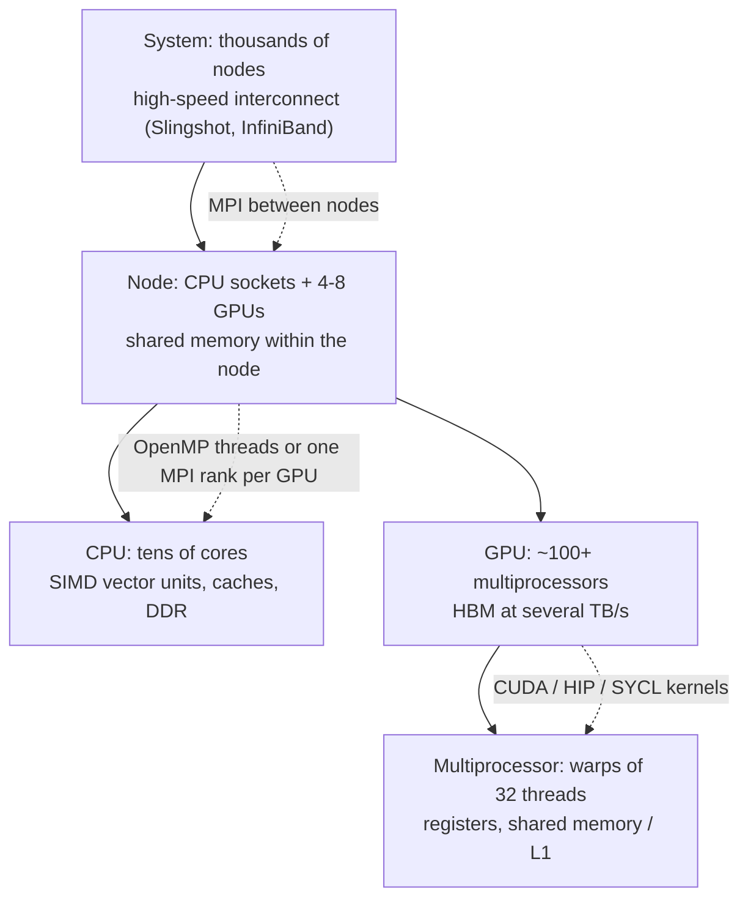
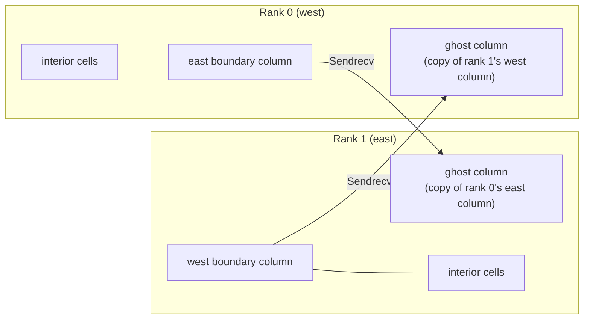
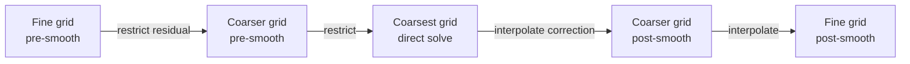

<p><a href="./">Computational Physics</a> › Parallel &amp; High-Performance Computing</p>

**High-performance computing (HPC)** maps large simulations onto parallel hardware: many cores in a node, many nodes connected by a fast network, and thousands of GPU threads per device. A 3D fluid solver on a $1024^3$ grid has billions of unknowns; exact diagonalization of a spin chain faces a Hilbert space that doubles with every spin; a cosmological $N$-body run tracks trillions of particles. This page covers the limits on parallel speedup, distributed-memory programming with MPI, GPU programming, performance modelling with the roofline model, and the sparse linear-algebra methods — Krylov solvers, multigrid, and Lanczos — that dominate the run time of most large physics codes.

Machine-learning methods for physics (physics-informed networks, neural operators, learned interatomic potentials) are covered separately in [Machine Learning for Physics](ml-for-physics.html).

## The parallel machine

A modern supercomputer is a hierarchy, and each level has its own programming model and its own bottleneck.



Data movement, not arithmetic, is the limiting cost at every level. A double-precision fused multiply-add takes a fraction of a nanosecond; fetching its operand from another node takes microseconds. On the June 2026 TOP500 list, all five leading systems (LineShine, El Capitan, Frontier, Aurora, and JUPITER Booster) exceed one exaflop/s on the HPL benchmark, and nearly all of that performance comes from GPUs. Codes that do not run on accelerators can use only a small fraction of such machines.

### Programming models

| Model | Level | Notes |
|---|---|---|
| **MPI** | Between processes and nodes | The universal distributed-memory standard. MPI 5.0 (June 2025) defines a standard ABI, so binaries can run with different MPI implementations |
| **OpenMP** | Threads within a node; GPU offload | Directive-based (`#pragma omp`); GPU `target` offload since 4.0, extended in 5.x and 6.0 |
| **CUDA** | NVIDIA GPUs | The dominant GPU model; CUDA 13 removed support for Maxwell, Pascal, and Volta GPUs |
| **HIP** | AMD (and NVIDIA) GPUs | CUDA-like API used on Frontier and El Capitan; `hipify` translates CUDA sources |
| **SYCL** | Portable C++ | Intel oneAPI / AdaptiveCpp; used on Aurora |
| **Kokkos, RAJA** | Portable C++ libraries | One source compiled for CPUs and GPUs of any vendor |
| **OpenACC** | Directives | Common in legacy Fortran codes (climate, CFD) |
| **CuPy, Numba, JAX** | Python | Array programming or JIT-compiled kernels; JAX adds automatic differentiation |
| **Julia** | Language | `KernelAbstractions.jl` targets several GPU vendors from one source |

The standard pattern at scale is **MPI + X**: MPI between nodes (often one rank per GPU), with X being CUDA, HIP, SYCL, OpenMP, or a portability layer within each rank. GPU-aware MPI implementations pass device pointers directly to the network, avoiding copies through host memory.

## Limits on speedup: Amdahl and Gustafson

If a fraction $p$ of a program's run time can be parallelized and the rest is serial, **Amdahl's law** bounds the speedup on $N$ processors:

$$
S(N) = \frac{1}{(1-p) + p/N} \;\longrightarrow\; \frac{1}{1-p} \quad \text{as } N \to \infty
$$

A code that is 95% parallel can never run more than 20 times faster, however many processors are used. This is **strong scaling**: fixed problem size, more processors.

**Gustafson's law** describes the more common use of a larger machine, which is to solve a larger problem in the same time. If the serial fraction of the run time on $N$ processors is $1-p$, the scaled speedup is

$$
S(N) = (1-p) + pN
$$

which grows linearly with $N$. This is **weak scaling**: fixed work per processor. Both are measured in practice:

| Test | Held fixed | Ideal result | What degrades it |
|---|---|---|---|
| Strong scaling | Total problem size | Time falls as $1/N$ | Serial sections, communication overhead as subdomains shrink |
| Weak scaling | Work per processor | Constant time | Global reductions, network contention, load imbalance |

Parallel efficiency $E = S(N)/N$ below about 50–70% usually signals that more processors are being wasted than used.

## MPI for distributed memory

The **Message Passing Interface (MPI)** runs one process (a **rank**) per core or per GPU. Each rank has private memory and exchanges data only through explicit messages, which is why MPI scales from a laptop to hundreds of thousands of nodes. The core operations fall into two groups:

- **Point-to-point**: `Send`/`Recv`, the combined `Sendrecv`, and their non-blocking forms `Isend`/`Irecv`. These dominate halo exchanges in grid codes.
- **Collectives**: `Bcast`, `Scatter`, `Gather`, `Reduce`, `Allreduce`, `Alltoall`. A reduction over $P$ ranks completes in $O(\log P)$ communication steps using a tree.

In mpi4py, lowercase methods (`comm.send`, `comm.reduce`) communicate arbitrary Python objects by pickling them; uppercase methods (`comm.Send`, `comm.Reduce`) communicate buffers such as NumPy arrays directly and are much faster for bulk data.

### Embarrassingly parallel Monte Carlo

Independent samples need no communication until the end. Each rank must draw from an independent random stream: seeding ranks with `seed + rank` risks correlated streams, while NumPy's `SeedSequence.spawn` produces statistically independent child seeds.

```python
# Run with: mpiexec -n 4 python mc_pi.py   (tested with mpi4py 4.1)
from mpi4py import MPI
import numpy as np

comm = MPI.COMM_WORLD
rank, size = comm.Get_rank(), comm.Get_size()

n_total = 100_000_000
n_local = n_total // size + (1 if rank < n_total % size else 0)

# Independent, reproducible random streams: one child seed per rank
rng = np.random.default_rng(np.random.SeedSequence(20260922).spawn(size)[rank])

hits = 0
for start in range(0, n_local, 10_000_000):              # bounded memory per rank
    m = min(10_000_000, n_local - start)
    xy = rng.random((m, 2))
    hits += np.count_nonzero((xy**2).sum(axis=1) <= 1.0)

total = comm.reduce(hits, op=MPI.SUM, root=0)            # O(log P) tree reduction
if rank == 0:
    pi = 4 * total / n_total
    print(f"pi ~ {pi:.6f}   error = {abs(pi - np.pi):.1e}")   # error ~ 3e-5
```

### Domain decomposition and halo exchange

Grid-based PDE solvers use **domain decomposition**: the global grid is split into subdomains, one per rank. A stencil update near a subdomain edge needs values owned by the neighbouring rank, so each subdomain is padded with **ghost cells** (a **halo**) that hold copies of the neighbours' boundary values. Every iteration begins with a **halo exchange** that refreshes them.



MPI's **Cartesian topology** routines build the process grid and return neighbour ranks. At a physical boundary the neighbour is `MPI.PROC_NULL`, which turns the corresponding send and receive into no-ops, so edge ranks need no special code. The following program solves Laplace's equation by Jacobi iteration on a 2D process grid:

```python
# Jacobi iteration for Laplace's equation on a 2D process grid.
# Run with: mpiexec -n 4 python laplace_mpi.py
from mpi4py import MPI
import numpy as np

N = 256                                           # global interior points per side
comm = MPI.COMM_WORLD
dims = MPI.Compute_dims(comm.Get_size(), 2)        # e.g. 4 ranks -> [2, 2]
cart = comm.Create_cart(dims, periods=[False, False], reorder=True)
py, px = cart.Get_coords(cart.Get_rank())
ny, nx = N // dims[0], N // dims[1]               # assume N divisible by dims

south, north = cart.Shift(0, 1)                   # PROC_NULL at the physical boundary
west, east = cart.Shift(1, 1)

u = np.zeros((ny + 2, nx + 2))                    # one ghost layer on each side
if py == dims[0] - 1:
    u[-1, :] = 1.0                                # boundary condition: top edge held at 1

def exchange_halos(u):
    # Rows are contiguous in memory and can be sent in place
    cart.Sendrecv(u[-2, :], dest=north, recvbuf=u[0, :], source=south)
    cart.Sendrecv(u[1, :], dest=south, recvbuf=u[-1, :], source=north)
    # Columns are strided: copy into contiguous buffers
    recv = np.empty(ny + 2)
    cart.Sendrecv(np.ascontiguousarray(u[:, -2]), dest=east, recvbuf=recv, source=west)
    if west != MPI.PROC_NULL:
        u[:, 0] = recv
    cart.Sendrecv(np.ascontiguousarray(u[:, 1]), dest=west, recvbuf=recv, source=east)
    if east != MPI.PROC_NULL:
        u[:, -1] = recv

for it in range(20_000):
    exchange_halos(u)
    new = 0.25 * (u[:-2, 1:-1] + u[2:, 1:-1] + u[1:-1, :-2] + u[1:-1, 2:])
    change = np.abs(new - u[1:-1, 1:-1]).max()
    u[1:-1, 1:-1] = new
    # A global reduction synchronizes all ranks, so check convergence only occasionally
    if it % 100 == 0 and cart.allreduce(change, op=MPI.MAX) < 1e-5:
        break

if cart.Get_rank() == 0:
    print(f"converged after {it} iterations")      # ~16,600 on a 256 x 256 grid
```

The 16,600 iterations needed on a modest grid illustrate why Jacobi is used as a teaching example and as a multigrid smoother, not as a solver; see [Krylov methods](#krylov-methods-conjugate-gradient) and [multigrid](#multigrid) below.

### Communication cost

The cost of domain decomposition is governed by the **surface-to-volume ratio**. A cubic subdomain of side $n$ holds $n^3$ cells of computation but exchanges $6n^2$ faces of data, so

$$
\frac{T_{\mathrm{comm}}}{T_{\mathrm{comp}}} \sim \frac{6n^2}{n^3} = \frac{6}{n}
$$

Larger subdomains amortize communication better, which is why weak scaling (fixed $n$) holds up far better than strong scaling (shrinking $n$). The time for a single message of $m$ bytes follows the **latency-bandwidth ($\alpha$-$\beta$) model**:

$$
T_{\mathrm{msg}}(m) = \alpha + \beta m
$$

where $\alpha$ is the latency (about 1–2 µs on current interconnects) and $\beta$ the inverse bandwidth. Latency penalizes many small messages, so production codes:

- **Aggregate** boundary data into a few large messages, using MPI derived datatypes (`Create_vector`, `Create_subarray`) instead of manual copies.
- **Overlap** communication with computation: post `Irecv`/`Isend`, update the interior cells that do not depend on the halo, then `Waitall` and update the boundary cells.
- **Choose a 2D or 3D block decomposition** rather than 1D slabs, which minimizes the surface area per rank.
- **Use neighbourhood collectives** (`Neighbor_alltoall`) or one-sided communication (`Put`, `Get`) where the MPI implementation optimizes them.

## GPU computing

A GPU is a throughput processor: over a hundred streaming multiprocessors, each running many threads at once, fed by high-bandwidth memory (HBM) delivering several terabytes per second. Code runs as a **kernel**, a function executed by a grid of thread **blocks** (typically 128–512 threads each). Threads execute in groups of 32 called **warps** (64-wide **wavefronts** on AMD GPUs) under the *single instruction, multiple threads* (SIMT) model; if threads in a warp take different branches, the branches run one after the other.

Two properties dominate kernel performance:

- **Coalesced memory access.** When consecutive threads read consecutive addresses, the hardware combines the reads into a few wide transactions. Strided or random access wastes most of the bandwidth. This is why GPU codes favour *structure-of-arrays* layouts.
- **Occupancy and latency hiding.** A global-memory load takes hundreds of cycles. The GPU hides this by switching to other resident warps, so enough warps must be in flight; heavy use of registers or shared memory per thread reduces occupancy.

The third rule is to **keep data on the device**. Transfers across PCIe run at tens of GB/s, far below HBM bandwidth; a simulation should copy data to the GPU once, run many time steps there, and copy back only for output. Unified-memory systems (NVIDIA Grace Hopper and Grace Blackwell, AMD MI300A) share one address space between CPU and GPU, which removes explicit copies but not the cost of moving data between the two.

The example below implements a direct $N$-body gravity calculation with a custom CUDA kernel called from CuPy, integrated with the symplectic **leapfrog** (kick-drift-kick) scheme. All arrays stay on the GPU for the whole run.

```python
import cupy as cp   # tested with CuPy 14 on CUDA 13

# One thread per body; each thread sums the pull of all bodies: O(N^2) work.
accel_kernel = cp.RawKernel(r"""
extern "C" __global__
void accel(const float3* pos, const float* mass, float3* acc, int n, float eps2) {
    int i = blockIdx.x * blockDim.x + threadIdx.x;
    if (i >= n) return;
    float3 pi = pos[i];
    float3 a = make_float3(0.0f, 0.0f, 0.0f);
    for (int j = 0; j < n; ++j) {            // j == i adds nothing: dx = dy = dz = 0
        float dx = pos[j].x - pi.x, dy = pos[j].y - pi.y, dz = pos[j].z - pi.z;
        float r2 = dx * dx + dy * dy + dz * dz + eps2;   // Plummer softening
        float inv_r3 = rsqrtf(r2 * r2 * r2);
        a.x += mass[j] * dx * inv_r3;
        a.y += mass[j] * dy * inv_r3;
        a.z += mass[j] * dz * inv_r3;
    }
    acc[i] = a;
}
""", "accel")

def accelerations(pos, mass, eps=0.01, threads=256):
    n = pos.shape[0]
    acc = cp.empty_like(pos)
    blocks = (n + threads - 1) // threads
    accel_kernel((blocks,), (threads,),
                 (pos, mass, acc, cp.int32(n), cp.float32(eps**2)))
    return acc

def nbody(n=16_384, steps=100, dt=1e-3, seed=0):
    """Leapfrog (kick-drift-kick) integration with G = 1."""
    rng = cp.random.default_rng(seed)
    pos = rng.standard_normal((n, 3), dtype=cp.float32)   # (n, 3) float32 = float3 array
    vel = cp.zeros((n, 3), dtype=cp.float32)
    mass = cp.full(n, 1.0 / n, dtype=cp.float32)
    acc = accelerations(pos, mass)
    for _ in range(steps):
        vel += 0.5 * dt * acc          # kick
        pos += dt * vel                # drift
        acc = accelerations(pos, mass)
        vel += 0.5 * dt * acc          # kick
    return cp.asnumpy(pos), cp.asnumpy(vel)   # single copy back to the host
```

On a single desktop-class GPU this computes the $2.7 \times 10^{10}$ pair interactions of 100 steps with 16,384 bodies in well under a second. Production $N$-body codes replace the $O(N^2)$ sum with tree or fast-multipole methods ($O(N \log N)$ or $O(N)$) and tile the inner loop through shared memory so each position is read from global memory once per block rather than once per thread.

Many kernels need no custom code: CuPy mirrors the NumPy and SciPy APIs, and its FFTs call cuFFT. The periodic heat equation $u_t = \nu\nabla^2 u$ is solved exactly in Fourier space:

```python
def heat_spectral(u0, nu, t):
    """Periodic heat equation on [0, 2 pi)^2: each Fourier mode decays as exp(-nu k^2 t)."""
    n = u0.shape[0]
    k = cp.fft.fftfreq(n, d=1.0 / n)                   # integer wavenumbers
    KX, KY = cp.meshgrid(k, k, indexing="ij")
    return cp.fft.ifft2(cp.fft.fft2(u0) * cp.exp(-nu * (KX**2 + KY**2) * t)).real
```

### The roofline model

The **roofline model** estimates the attainable performance of a kernel from two hardware numbers, peak compute rate $P_{\mathrm{peak}}$ (FLOP/s) and peak memory bandwidth $B$ (bytes/s), and one property of the kernel, its **arithmetic intensity** $I$ (floating-point operations per byte moved from memory):

$$
P = \min\left( P_{\mathrm{peak}},\; B \cdot I \right)
$$

<figure style="margin: 1.5rem auto; max-width: 560px;">
<svg viewBox="0 0 540 320" width="100%" role="img" aria-label="Roofline model on log-log axes: attainable performance rises linearly with arithmetic intensity under the memory-bandwidth roof, then flattens at the peak-compute roof beyond the ridge point. SpMV and stencils sit on the sloped part; FFT near the ridge; dense matrix multiply and direct N-body on the flat part.">
  <g stroke="currentColor" fill="none" stroke-width="1.2">
    <line x1="60" y1="270" x2="520" y2="270"/>
    <line x1="60" y1="270" x2="60" y2="20"/>
  </g>
  <g stroke="currentColor" fill="none" stroke-width="2.5">
    <polyline points="60,256 324,40 510,40"/>
  </g>
  <line x1="324" y1="40" x2="324" y2="270" stroke="currentColor" stroke-dasharray="4 4" stroke-opacity="0.5"/>
  <g fill="currentColor" font-family="sans-serif" font-size="12">
    <text x="290" y="300" text-anchor="middle">Arithmetic intensity I (FLOP/byte, log scale)</text>
    <text x="20" y="150" text-anchor="middle" transform="rotate(-90 20 150)">Attainable FLOP/s (log scale)</text>
    <text x="150" y="150" transform="rotate(-39 150 150)">memory-bound: P = B · I</text>
    <text x="400" y="32">compute-bound: P = P_peak</text>
    <text x="330" y="262">ridge point I* = P_peak / B</text>
  </g>
  <g fill="currentColor" font-family="sans-serif" font-size="11">
    <circle cx="104" cy="232" r="5"/><text x="112" y="248">SpMV</text>
    <circle cx="192" cy="160" r="5"/><text x="200" y="176">3D stencil</text>
    <circle cx="258" cy="104" r="5"/><text x="238" y="124">FFT</text>
    <circle cx="440" cy="52" r="5"/><text x="410" y="72">dense GEMM</text>
    <circle cx="492" cy="52" r="5"/><text x="470" y="92">direct N-body</text>
  </g>
</svg>
<figcaption>Schematic roofline. Kernels left of the ridge point are limited by memory bandwidth, those to the right by arithmetic throughput. Positions are illustrative.</figcaption>
</figure>

A sparse matrix-vector product performs about 2 flops per nonzero while reading a value and an index (12 bytes in double precision with 32-bit indices), so $I \approx 0.17$ and it sits far down the bandwidth slope; a stencil sweep is similar. Dense matrix multiplication performs $O(n^3)$ work on $O(n^2)$ data and the direct $N$-body kernel $O(N^2)$ work on $O(N)$ data, so both are compute-bound. The ridge point of current data-centre GPUs lies at an intensity of several to tens of FLOP/byte in FP64, which means that most physics kernels are memory-bound. The model identifies which optimization matters: better data reuse and layout for kernels under the slope, fewer or cheaper instructions and higher occupancy for kernels under the flat roof.

### Precision

GPU peak performance depends strongly on precision. Tensor cores deliver much higher throughput in FP16, BF16, and FP8 than in FP64, and recent AI-oriented GPUs have increased FP64 throughput far less than low-precision throughput. Physics codes exploit this in several ways:

- **Mixed-precision iterative refinement**: factor or precondition in low precision, compute residuals and corrections in FP64, and recover full double-precision accuracy. The HPL-MxP benchmark measures this approach.
- **Single precision where it suffices**, as in the $N$-body example above, molecular dynamics force kernels, and lattice QCD solvers with double-precision correction steps.
- **Emulated FP64** from low-precision integer or tensor-core arithmetic (the Ozaki scheme and related methods) is an active research area aimed at hardware with weak native FP64.

Any reduction in precision needs a check that conserved quantities and final results are unaffected.

## Sparse linear algebra

Discretizing a PDE or writing a quantum Hamiltonian in a local basis produces a **sparse** matrix. A 7-point Laplacian on a $10^6$-cell grid is a $10^6 \times 10^6$ matrix with about $7 \times 10^6$ nonzeros; storing it densely would need $10^{12}$ entries. Sparse formats store only the nonzeros:

| Format | Stores | Use |
|---|---|---|
| COO | (row, column, value) triplets | Assembly; duplicate entries are summed |
| CSR / CSC | Values and column (row) indices, plus row (column) pointers | Fast matrix-vector products and slicing; the standard format for solvers |
| ELL, SELL-C-$\sigma$ | Rows padded to equal length, in slices | Vectorized and GPU SpMV |
| Block CSR | Small dense blocks | Several unknowns per node (elasticity, coupled PDEs) |

The central operation is the **sparse matrix-vector product (SpMV)** $y = Ax$, which costs $O(\mathrm{nnz})$ and is memory-bound. Direct factorization ($LU$, Cholesky) of a sparse matrix creates **fill-in**, factors much denser than $A$; for 2D problems modern sparse direct solvers (MUMPS, SuperLU, PARDISO, cuDSS) are often still the fastest option, but in 3D the memory cost of fill-in usually rules them out. **Iterative solvers**, which need only the action of $A$ on a vector, are then the method of choice.

### Stationary iterations

Splitting $A = D + L + U$ into diagonal, strictly lower, and strictly upper parts gives the **Jacobi iteration**:

$$
x_i^{(k+1)} = \frac{1}{a_{ii}} \left( b_i - \sum_{j \ne i} a_{ij}\, x_j^{(k)} \right)
$$

Every unknown is updated from the previous iterate, so the updates are independent and parallelize trivially (the MPI example above is exactly this). Jacobi converges when the spectral radius of the iteration matrix $-D^{-1}(L+U)$ is below 1, which holds for diagonally dominant $A$, but slowly: for the Poisson problem the spectral radius is $1 - O(h^2)$, so the number of iterations grows as $h^{-2}$. **Gauss-Seidel** and **SOR** use updated values within a sweep and converge faster; they are parallelized with red-black (multicolour) ordering. Today these methods matter mainly as **smoothers** inside multigrid: a few sweeps remove high-frequency error very efficiently, even though low-frequency error decays slowly.

### Krylov methods: conjugate gradient

**Krylov subspace methods** build the $k$-th approximation from the space

$$
\mathcal{K}_k(A, r_0) = \mathrm{span}\{ r_0,\, A r_0,\, A^2 r_0,\, \dots,\, A^{k-1} r_0 \}
$$

For symmetric positive-definite $A$, the **conjugate gradient (CG)** method chooses the iterate that minimizes the $A$-norm of the error over this space, using one SpMV and two inner products per iteration and only a few stored vectors. Its convergence depends on the condition number $\kappa = \lambda_{\max}/\lambda_{\min}$:

$$
\frac{\lVert e_k \rVert_A}{\lVert e_0 \rVert_A} \le 2 \left( \frac{\sqrt{\kappa} - 1}{\sqrt{\kappa} + 1} \right)^{k}
$$

so the iteration count grows as $\sqrt{\kappa}$. For a discretized Laplacian $\kappa \sim h^{-2}$, and CG needs $O(h^{-1})$ iterations — better than Jacobi's $O(h^{-2})$, but still growing with resolution. A **preconditioner** $M \approx A$ that is cheap to apply transforms the system into one with a much smaller effective condition number. For nonsymmetric systems, **GMRES** and **BiCGSTAB** play the same role.

The effect is easy to measure. The following compares plain CG with CG preconditioned by one algebraic-multigrid V-cycle (PyAMG) on the 2D Poisson problem:

```python
import numpy as np
import scipy.sparse as sp
from scipy.sparse.linalg import cg      # SciPy >= 1.12 uses rtol (tol was removed)
import pyamg

def poisson_2d(n):
    """5-point Laplacian on an n x n interior grid with Dirichlet BCs, h = 1/(n+1)."""
    T = sp.diags([-1.0, 2.0, -1.0], [-1, 0, 1], shape=(n, n))
    I = sp.identity(n)
    return ((sp.kron(I, T) + sp.kron(T, I)) * (n + 1) ** 2).tocsr()

def cg_iterations(A, b, M=None):
    count = [0]
    def callback(xk):
        count[0] += 1
    x, info = cg(A, b, rtol=1e-8, M=M, callback=callback)
    return count[0]

for n in (50, 100, 200, 400):
    A = poisson_2d(n)
    b = np.ones(A.shape[0])
    M = pyamg.smoothed_aggregation_solver(A).aspreconditioner(cycle="V")
    print(n * n, cg_iterations(A, b), cg_iterations(A, b, M))
```

| Unknowns | CG iterations | CG + AMG iterations |
|---|---|---|
| 2,500 | 93 | 8 |
| 10,000 | 187 | 9 |
| 40,000 | 369 | 9 |
| 160,000 | 734 | 12 |

Plain CG doubles its iteration count each time the grid spacing is halved, as the $\sqrt{\kappa} \sim h^{-1}$ estimate predicts; with the multigrid preconditioner the count stays almost constant. (A Jacobi preconditioner would change nothing here, because this matrix has a constant diagonal.) In distributed-memory CG, each iteration needs a halo exchange inside SpMV and a global `Allreduce` for each inner product; at extreme scale those reductions dominate, which has motivated **pipelined** and **communication-avoiding** Krylov variants that overlap or batch them.

### Multigrid

**Multigrid** attacks the weakness of simple smoothers directly. Error that is smooth on a fine grid is oscillatory, and therefore easy to smooth, on a coarser grid. A **V-cycle** smooths, transfers the residual to a coarser grid, solves the coarse problem recursively, interpolates the correction back, and smooths again:



Each level costs a fixed fraction of the one above it, and the convergence rate per cycle is independent of the grid size, so multigrid solves elliptic problems in $O(n)$ operations — asymptotically optimal. **Geometric multigrid** uses a hierarchy of meshes; **algebraic multigrid (AMG)** builds the hierarchy from the matrix entries alone and works on unstructured problems. Production AMG is provided by hypre (BoomerAMG), PETSc (GAMG), Trilinos (MueLu), and NVIDIA AmgX, all with GPU support.

### Lanczos for extremal eigenvalues

Many physics problems need a few extremal eigenvalues of a very large sparse Hermitian matrix: the ground-state energy of a quantum Hamiltonian, the lowest vibrational modes of a structure. The **Lanczos algorithm** builds an orthonormal basis $v_1, v_2, \dots$ of the Krylov space from the three-term recurrence

$$
\beta_{j}\, v_{j+1} = A v_j - \alpha_j v_j - \beta_{j-1} v_{j-1},
\qquad \alpha_j = v_j^{\top} A v_j
$$

In that basis $A$ becomes a small tridiagonal matrix

$$
T_k = \begin{pmatrix}
\alpha_1 & \beta_1 & & \\
\beta_1 & \alpha_2 & \ddots & \\
& \ddots & \ddots & \beta_{k-1} \\
& & \beta_{k-1} & \alpha_k
\end{pmatrix}
$$

whose extreme eigenvalues (the **Ritz values**) converge to those of $A$ after typically tens to a few hundred iterations, even when $A$ has dimension $10^9$. The algorithm needs only the action $v \mapsto Av$, so the matrix need never be stored. In floating-point arithmetic the Lanczos vectors lose orthogonality once a Ritz value converges, producing spurious copies of converged eigenvalues; practical implementations use selective reorthogonalization or implicit restarts. ARPACK's implicitly restarted Lanczos, called by SciPy's `eigsh`, is the standard tool; SLEPc provides the MPI-parallel equivalent.

**Exact diagonalization** of quantum lattice models is the classic application. The following computes the ground state of the periodic spin-1/2 Heisenberg chain $H = \sum_i \mathbf{S}_i \cdot \mathbf{S}_{i+1}$ for $L = 20$ spins, a Hilbert space of dimension $2^{20} \approx 10^6$, with the Hamiltonian supplied only as a function:

```python
import numpy as np
from scipy.sparse.linalg import LinearOperator, eigsh

def heisenberg_chain(L):
    """Matrix-free H = sum_i S_i . S_{i+1} (periodic). Basis states are integers
    whose bits are the spins (1 = up); only v -> H v is ever computed."""
    states = np.arange(2 ** L)
    diag = np.zeros(2 ** L)
    hops = []
    for i in range(L):
        j = (i + 1) % L
        si, sj = (states >> i) & 1, (states >> j) & 1
        diag += np.where(si == sj, 0.25, -0.25)            # S^z_i S^z_j
        anti = states[si != sj]                             # (S+S- + S-S+)/2 flips
        hops.append((anti, anti ^ ((1 << i) | (1 << j))))   # anti-aligned pairs

    def matvec(v):
        v = np.ravel(v)
        out = diag * v
        for src, dst in hops:
            out[dst] += 0.5 * v[src]
        return out

    return LinearOperator((2 ** L, 2 ** L), matvec=matvec, dtype=float)

L = 20
E0 = eigsh(heisenberg_chain(L), k=1, which="SA", return_eigenvectors=False)[0]
print(f"E0/L = {E0 / L:.6f}")                   # -0.445219
print(f"L -> infinity (Bethe ansatz): {0.25 - np.log(2):.6f}")   # -0.443147
```

The finite-chain energy per site approaches the exact Bethe-ansatz value $\tfrac{1}{4} - \ln 2$ as $L$ grows. Production exact-diagonalization codes also exploit symmetries (total $S^z$, translation, spin inversion) to block-diagonalize $H$, which reduces the dimension by orders of magnitude and reaches about 50 spins.

## Performance in practice

The optimizations that matter most, in rough order of impact:

1. **Choose the right algorithm.** A tree code turns the $O(N^2)$ $N$-body sum into $O(N \log N)$; multigrid turns an $O(n^{3/2})$ CG solve of a 2D Poisson problem into $O(n)$. No low-level tuning recovers a worse complexity.
2. **Measure before optimizing.** Profilers — Nsight Systems and Nsight Compute (NVIDIA), rocprof (AMD), VTune (Intel), `perf`, LIKWID, Score-P with Vampir, TAU, HPCToolkit — show where time goes and whether a kernel is limited by compute, bandwidth, latency, communication, or load imbalance.
3. **Respect the memory hierarchy.** Cache blocking (tiling loops so the working set fits in cache), structure-of-arrays layouts, and kernel fusion (one pass over the data instead of several) raise effective arithmetic intensity.
4. **Vectorize.** CPU SIMD units (AVX-512, Arm SVE) process 8 double-precision values per instruction on 512-bit vectors; unit-stride, branch-free inner loops let the compiler vectorize automatically.
5. **Overlap and aggregate communication.** Non-blocking MPI hides network latency behind interior computation; fewer, larger messages reduce latency costs.
6. **Balance the load.** Adaptive meshes and particle clustering create uneven work; space-filling-curve partitioning and graph partitioners (METIS, ParMETIS, Zoltan) redistribute it.

Classify each hot kernel by its limiting resource and attack that resource: bandwidth-bound code needs better locality, compute-bound code fewer or cheaper instructions, latency-bound code more concurrency, and communication-bound code fewer, larger, overlapped messages.

### Data and workflow

At scale, input/output and job management become part of the algorithm:

- **Parallel I/O.** Thousands of ranks writing separate files overwhelm parallel file systems (Lustre, GPFS). Collective I/O through MPI-IO, parallel HDF5, or ADIOS2 writes a single shared dataset efficiently; ADIOS2 can also stream data to in-situ analysis instead of disk.
- **Checkpoint/restart.** Long runs periodically save their state so they can survive node failures and the wall-clock limits of batch queues.
- **Schedulers and containers.** Jobs are submitted to batch schedulers such as Slurm or PBS; containers built with Apptainer (formerly Singularity) or Podman package software stacks reproducibly while still using the host's MPI and GPU drivers.
- **Libraries over hand-written code.** PETSc, Trilinos, hypre, SLEPc, and vendor libraries (cuBLAS, cuSPARSE, cuFFT, rocBLAS, oneMKL) provide tuned, parallel implementations of nearly everything on this page.

---

*Previous: [Electronic Structure Beyond DFT](electronic-structure-beyond-dft.html) · Next: [Machine Learning for Physics](ml-for-physics.html)*

## See also

- [Machine Learning for Physics](ml-for-physics.html) — physics-informed neural networks, neural operators, and learned potentials.
- [Finite Elements &amp; Fluid Dynamics](fem-and-cfd.html) — the sparse systems and stencil solvers these methods accelerate.
- [Monte Carlo &amp; Molecular Dynamics](monte-carlo-and-md.html) — embarrassingly parallel sampling and GPU-accelerated molecular dynamics.
- [Visualization, Libraries &amp; Best Practices](tools-and-practices.html) — profiling, visualization, and the scientific Python stack.
- [Classical Mechanics](../classical-mechanics/) — the $N$-body dynamics behind gravitational simulations.
