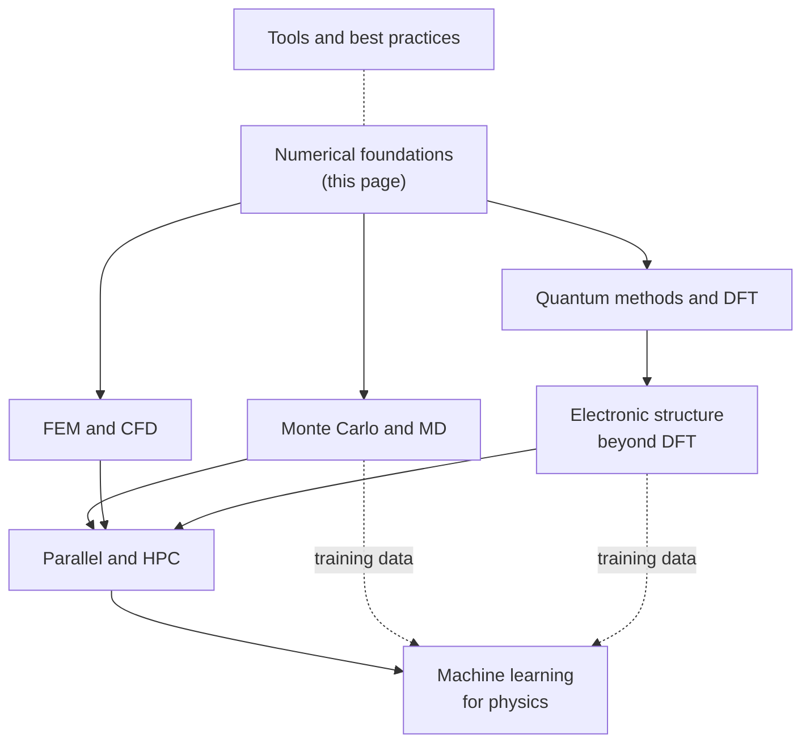
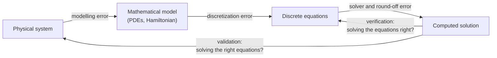

<div class="hero-section" style="background: linear-gradient(135deg, #11998e 0%, #38ef7d 100%); color: white; padding: 3rem 2rem; margin: -2rem -3rem 2rem -3rem; text-align: center;">
  <h1 style="color: white; margin: 0; font-size: 2.5rem;">Computational Physics</h1>
  <p style="font-size: 1.25rem; margin-top: 1rem; opacity: 0.9;">Where physics meets computation, using numerical algorithms and simulations to solve problems beyond analytical reach.</p>
</div>

**Computational physics** turns physical laws into algorithms and solves them numerically. It is used whenever the governing equations cannot be solved in closed form — nonlinear dynamics, many interacting particles, complicated geometries, long time evolution — and it sits alongside theory and experiment as a third way of doing physics: simulations test theories where experiments are impossible, and interpret experiments where theory is intractable.

This hub introduces the numerical foundations shared by every simulation — discretization, error, stability, and verification — and then links to the specialized pages below. Code examples use Python with NumPy and SciPy and have been run as shown.

## Topics

| Page | Covers |
|---|---|
| [Monte Carlo &amp; Molecular Dynamics](monte-carlo-and-md.html) | Random sampling, Markov chain Monte Carlo, quantum Monte Carlo, classical MD, thermostats, Ewald sums |
| [Quantum Computational Methods](quantum-methods.html) | Split-operator and Crank-Nicolson propagation of the Schrödinger equation, tunnelling, density functional theory |
| [Finite Elements &amp; Fluid Dynamics](fem-and-cfd.html) | FEM from weak form to assembly, Navier-Stokes and the projection method, finite volumes, turbulence models, lattice Boltzmann |
| [Electronic Structure Beyond DFT](electronic-structure-beyond-dft.html) | Hartree-Fock, MP2, coupled cluster, multireference methods, TD-DFT, EOM-CC, GW |
| [Parallel &amp; High-Performance Computing](hpc-and-ml.html) | MPI, GPUs, the roofline model, Krylov solvers, multigrid, Lanczos |
| [Machine Learning for Physics](ml-for-physics.html) | Physics-informed networks, equivariant models, neural-network potentials, neural operators |
| [Visualization, Libraries &amp; Best Practices](tools-and-practices.html) | Scientific visualization, data analysis, the Python physics stack, validation practice |



The core-method pages (Monte Carlo and quantum methods) can be read in either order; the domain pages build on them; the HPC page explains how all of them scale; and the machine-learning page covers models trained on their output.

## From physical law to trustworthy numbers

Every simulation passes through the same chain of approximations, and each link introduces its own error:



- **Modelling error** comes from the physics left out: neglected friction, a classical treatment of a quantum system, an approximate turbulence model.
- **Discretization (truncation) error** comes from replacing derivatives by differences and integrals by sums. It shrinks as a power of the step size $h$, and that power is the method's **order**.
- **Round-off error** comes from finite-precision arithmetic. IEEE 754 double precision has machine epsilon $\epsilon \approx 2.2 \times 10^{-16}$, and round-off grows as steps shrink and operations multiply.
- **Solver error** comes from stopping iterative methods (linear solvers, nonlinear iterations, Monte Carlo sampling) before full convergence.

**Verification** checks that the code solves the discrete equations correctly and that the discretization converges at its theoretical order — typically by comparing with exact solutions, including *manufactured* solutions chosen in advance and substituted into the equations to produce a source term. **Validation** compares the results with experiment. Neither can substitute for the other.

## Numerical integration

Numerical **quadrature** replaces an integral with a weighted sum of function values, $\int_a^b f(x)\,dx \approx \sum_i w_i f(x_i)$. Methods differ in how fast the error falls as points are added:

| Method | Idea | Error (smooth $f$, step $h$ or $n$ points) | Best for |
|---|---|---|---|
| Midpoint | Constant on each strip | $O(h^2)$ | Quick estimates, open intervals |
| Trapezoidal | Linear on each strip | $O(h^2)$; exponentially accurate for smooth periodic $f$ | Periodic integrands, tabulated data |
| Simpson's rule | Quadratic on each pair of strips | $O(h^4)$ | Smooth 1D integrands |
| Gauss-Legendre | Optimal nodes and weights | Exact for polynomials of degree $2n-1$; exponential convergence for analytic $f$ | Smooth integrands with expensive evaluations |
| Adaptive (Gauss-Kronrod) | Subdivide where the error estimate is large | Controlled by tolerance | General-purpose (`scipy.integrate.quad`) |
| Monte Carlo | Random samples | $O(N^{-1/2})$, independent of dimension | High-dimensional integrals |

The last row explains the importance of Monte Carlo in statistical and quantum many-body physics. A product grid rule with $N$ total points in $d$ dimensions has spacing $h \sim N^{-1/d}$, so Simpson's error falls only as $N^{-4/d}$; for $d > 8$ that is slower than Monte Carlo's $N^{-1/2}$, and the number of grid points needed grows exponentially with $d$ (the **curse of dimensionality**). Quasi-Monte Carlo sequences (Sobol, Halton) improve the rate to nearly $N^{-1}$ for moderately smooth integrands. The [Monte Carlo &amp; Molecular Dynamics](monte-carlo-and-md.html) page develops sampling methods further.

Composite Simpson's rule in a few lines:

```python
import numpy as np

def simpson(f, a, b, n):
    """Composite Simpson's rule with n (even) subintervals."""
    if n % 2:
        n += 1
    x = np.linspace(a, b, n + 1)
    y = f(x)
    h = (b - a) / n
    return h / 3 * (y[0] + y[-1] + 4 * y[1:-1:2].sum() + 2 * y[2:-1:2].sum())

print(simpson(np.sin, 0.0, np.pi, 100) - 2.0)   # error ~ 1e-8: O(h^4)
```

In practice `scipy.integrate.quad` (adaptive Gauss-Kronrod, 1D), `scipy.integrate.cubature` (adaptive, multidimensional, SciPy 1.15 and later), and `scipy.integrate.qmc_quad` (quasi-Monte Carlo) cover most needs.

## Numerical differentiation

Taylor expansion gives finite-difference formulas and their truncation errors:

| Formula | Expression | Truncation error |
|---|---|---|
| Forward difference | $\dfrac{f(x+h) - f(x)}{h}$ | $O(h)$ |
| Central difference | $\dfrac{f(x+h) - f(x-h)}{2h}$ | $O(h^2)$ |
| Five-point stencil | $\dfrac{-f(x+2h) + 8f(x+h) - 8f(x-h) + f(x-2h)}{12h}$ | $O(h^4)$ |
| Second derivative | $\dfrac{f(x+h) - 2f(x) + f(x-h)}{h^2}$ | $O(h^2)$ |

Making $h$ smaller does not always help. Subtracting two nearly equal function values loses digits to round-off, contributing an error of about $\epsilon |f| / h$. The total error of the central difference is therefore roughly

$$
E(h) \approx \frac{h^2}{6}\left|f'''(x)\right| + \frac{\epsilon\,|f(x)|}{h}
$$

which is minimized near $h \sim \epsilon^{1/3} \approx 10^{-5}$, giving an error of about $10^{-11}$ — not $10^{-16}$. For the forward difference the optimum is $h \sim \epsilon^{1/2} \approx 10^{-8}$. Differentiating $\sin x$ at $x = 1$:

```python
import numpy as np

f, df, x0 = np.sin, np.cos, 1.0
for h in 10.0 ** -np.arange(1, 13, 2):
    fwd = (f(x0 + h) - f(x0)) / h
    cen = (f(x0 + h) - f(x0 - h)) / (2 * h)
    print(f"h = {h:.0e}   forward {abs(fwd - df(x0)):.1e}   central {abs(cen - df(x0)):.1e}")
# h = 1e-01   forward 4.3e-02   central 9.0e-04
# h = 1e-03   forward 4.2e-04   central 9.0e-08
# h = 1e-05   forward 4.2e-06   central 1.1e-11   <- central optimum
# h = 1e-07   forward 4.2e-08   central 1.9e-10   <- round-off now dominates
# h = 1e-09   forward 5.3e-08   central 3.0e-09
# h = 1e-11   forward 1.2e-06   central 1.2e-06
```

When derivatives of a *program* are needed — gradients for optimization, Jacobians for implicit solvers, forces from a learned potential — **automatic differentiation** (JAX, PyTorch) computes them exactly to machine precision at a small constant multiple of the function's cost, avoiding the step-size dilemma entirely.

## Root finding and nonlinear equations

| Method | Requirements | Convergence | Notes |
|---|---|---|---|
| Bisection | Bracket $[a, b]$ with a sign change | Linear (one bit per step) | Guaranteed; slow |
| Newton-Raphson | $f'$ and a good initial guess | Quadratic | Fast near the root; can diverge far from it |
| Secant | Two initial points | Superlinear (order about 1.618) | Newton without derivatives |
| Brent's method | Bracket | Superlinear, never worse than bisection | The standard robust choice (`scipy.optimize.brentq`) |
| Newton-Krylov | Jacobian-vector products | Quadratic (inexact) | Large nonlinear systems from discretized PDEs |

Newton's method, $x_{k+1} = x_k - f(x_k)/f'(x_k)$, generalizes to systems as $J(\mathbf{x}_k)\,\Delta\mathbf{x} = -\mathbf{F}(\mathbf{x}_k)$. Each step requires a linear solve with the Jacobian $J$; for large PDE systems this is done iteratively (see [Krylov methods](hpc-and-ml.html#krylov-methods-conjugate-gradient)), and line searches or trust regions make the iteration robust far from the solution.

## Ordinary differential equations

Most of physics is expressed as differential equations: Newton's laws, Maxwell's equations, the Schrödinger equation. An initial-value problem $\dot{\mathbf{y}} = \mathbf{f}(t, \mathbf{y})$ is solved by stepping the state forward in time, and the choice of stepping scheme is governed by three concerns: **accuracy** (error per step), **stability** (whether errors grow over many steps), and **structure** (whether conserved quantities are respected).

### Runge-Kutta methods and adaptive stepping

The forward **Euler** method $\mathbf{y}_{n+1} = \mathbf{y}_n + h\,\mathbf{f}(t_n, \mathbf{y}_n)$ is first order: its global error is $O(h)$. The classical **fourth-order Runge-Kutta** method (RK4) samples $\mathbf{f}$ four times per step and combines the slopes so that errors cancel through fourth order:

$$
\begin{aligned}
\mathbf{k}_1 &= \mathbf{f}(t_n, \mathbf{y}_n), &
\mathbf{k}_2 &= \mathbf{f}\left(t_n + \tfrac{h}{2}, \mathbf{y}_n + \tfrac{h}{2}\mathbf{k}_1\right), \\
\mathbf{k}_3 &= \mathbf{f}\left(t_n + \tfrac{h}{2}, \mathbf{y}_n + \tfrac{h}{2}\mathbf{k}_2\right), &
\mathbf{k}_4 &= \mathbf{f}(t_n + h, \mathbf{y}_n + h\mathbf{k}_3), \\
\mathbf{y}_{n+1} &= \mathbf{y}_n + \tfrac{h}{6}\left(\mathbf{k}_1 + 2\mathbf{k}_2 + 2\mathbf{k}_3 + \mathbf{k}_4\right)
\end{aligned}
$$

The local error is $O(h^5)$ and the global error $O(h^4)$: halving $h$ reduces the error about sixteenfold.

A fixed step is wasteful when the solution changes pace. **Embedded Runge-Kutta pairs** compute two solutions of different order from the same function evaluations; their difference estimates the local error, and the step is enlarged or reduced to keep that estimate within a tolerance. The Dormand-Prince 5(4) pair is the default in SciPy's `solve_ivp` (`method="RK45"`) and in MATLAB's `ode45`; `DOP853` provides eighth order for tight tolerances. Solvers also support **event detection**, stopping the integration when a function of the state crosses zero:

```python
import numpy as np
from scipy.integrate import solve_ivp

def projectile(v0=50.0, angle_deg=45.0, drag=True):
    """Projectile with quadratic air drag (baseball-sized sphere)."""
    g, rho, cd, area, m = 9.81, 1.225, 0.47, 0.0042, 0.145
    k = 0.5 * rho * cd * area / m if drag else 0.0

    def rhs(t, s):
        x, y, vx, vy = s
        v = np.hypot(vx, vy)
        return [vx, vy, -k * v * vx, -g - k * v * vy]

    def hit_ground(t, s):          # event: height crosses zero going down
        return s[1]
    hit_ground.terminal, hit_ground.direction = True, -1

    th = np.radians(angle_deg)
    return solve_ivp(rhs, (0, 100), [0, 0, v0 * np.cos(th), v0 * np.sin(th)],
                     events=hit_ground, rtol=1e-9, atol=1e-9)

for drag in (False, True):
    sol = projectile(drag=drag)
    print(f"drag={drag}: range {sol.y_events[0][0][0]:.1f} m, time {sol.t_events[0][0]:.2f} s")
# drag=False: range 254.8 m, time 7.21 s   (analytic: v0^2/g = 254.8 m)
# drag=True:  range 107.2 m, time 5.46 s
```

The drag-free case reproduces the analytic range $v_0^2/g$, a basic verification before trusting the drag result.

### Stiff equations

A system is **stiff** when it contains processes on very different time scales — fast chemical reactions alongside slow ones, or the fine-grid modes of a discretized diffusion equation. Explicit methods must then take steps small enough to resolve the fastest scale for *stability*, even after that component has decayed and no longer matters for *accuracy*. Implicit methods, which solve an equation for $\mathbf{y}_{n+1}$ at each step, remain stable with far larger steps. On Robertson's classic chemical-kinetics problem integrated to $t = 100$, SciPy's explicit `RK45` needs about 730,000 function evaluations while the implicit `BDF` and `Radau` methods need a few hundred.

| Solver (`solve_ivp`) | Type | Use |
|---|---|---|
| `RK45`, `DOP853` | Explicit Runge-Kutta | Non-stiff problems |
| `Radau` | Implicit Runge-Kutta, order 5 | Stiff problems, high accuracy |
| `BDF` | Backward differentiation formulas, variable order | Stiff problems, large systems |
| `LSODA` | Switches automatically between Adams and BDF | Unknown or changing stiffness |

A Jacobian (analytic, or with its sparsity pattern supplied through `jac_sparsity`) makes implicit solvers much faster for large systems. For demanding work, the SUNDIALS suite (CVODE, IDA, ARKODE) and Julia's DifferentialEquations.jl provide wider choices of methods.

### Symplectic integrators

For Hamiltonian systems — planetary orbits, molecular dynamics, particle accelerators — the long-term behaviour matters more than the error at any single time. General-purpose methods such as RK4 do not preserve the geometric structure of Hamiltonian flow, so their energy error grows steadily. **Symplectic integrators** preserve phase-space volume exactly; they conserve a slightly perturbed "shadow" Hamiltonian, so the energy error stays bounded for exponentially long times. The most widely used is the second-order **velocity Verlet** (leapfrog) scheme, which needs one force evaluation per step:

$$
\mathbf{v}_{n+1/2} = \mathbf{v}_n + \tfrac{h}{2}\mathbf{a}(\mathbf{x}_n), \qquad
\mathbf{x}_{n+1} = \mathbf{x}_n + h\,\mathbf{v}_{n+1/2}, \qquad
\mathbf{v}_{n+1} = \mathbf{v}_{n+1/2} + \tfrac{h}{2}\mathbf{a}(\mathbf{x}_{n+1})
$$

```python
import numpy as np

def accel(x):
    return -x / np.linalg.norm(x) ** 3          # Kepler problem, GM = 1

def energy(x, v):
    return 0.5 * v @ v - 1.0 / np.linalg.norm(x)

def rk4_step(x, v, dt):
    def f(y):
        return np.concatenate([y[2:], accel(y[:2])])
    y = np.concatenate([x, v])
    k1 = f(y); k2 = f(y + dt / 2 * k1); k3 = f(y + dt / 2 * k2); k4 = f(y + dt * k3)
    y = y + dt / 6 * (k1 + 2 * k2 + 2 * k3 + k4)
    return y[:2], y[2:]

def verlet_step(x, v, dt):
    v = v + 0.5 * dt * accel(x)                 # kick
    x = x + dt * v                              # drift
    v = v + 0.5 * dt * accel(x)                 # kick
    return x, v

x0, v0 = np.array([1.0, 0.0]), np.array([0.0, 1.2])   # eccentric orbit (e = 0.44)
E0, dt = energy(x0, v0), 0.1
for name, step in (("RK4", rk4_step), ("Verlet", verlet_step)):
    x, v = x0.copy(), v0.copy()
    for n in range(1, 100_001):
        x, v = step(x, v, dt)
        if n in (1_000, 10_000, 100_000):
            print(f"{name:6s} t = {n * dt:6.0f}   |dE/E0| = {abs(energy(x, v) - E0) / abs(E0):.1e}")
```

| Integrator | Force evaluations per step | $\lvert\Delta E/E_0\rvert$ at $t = 10^2$ | at $t = 10^3$ | at $t = 10^4$ |
|---|---|---|---|---|
| RK4 | 4 | $1.1 \times 10^{-5}$ | $9.7 \times 10^{-5}$ | $9.6 \times 10^{-4}$ |
| Velocity Verlet | 1 | $2.8 \times 10^{-3}$ | $2.8 \times 10^{-3}$ | $2.8 \times 10^{-3}$ |

RK4 is more accurate over short times, but its energy error grows linearly without bound; Verlet's is larger but does not grow, at a quarter of the cost. Over the $10^9$ steps of a molecular-dynamics run or the billions of orbits of a solar-system integration, only the bounded behaviour is acceptable. Higher-order symplectic schemes (Yoshida, Forest-Ruth) and specialized integrators for nearly Keplerian motion (Wisdom-Holman) extend the idea.

## Partial differential equations

PDEs are classified by the character of their solutions, which determines the appropriate numerical method:

| Type | Prototype | Physics | Character | Typical numerics |
|---|---|---|---|---|
| Elliptic | Poisson $\nabla^2 u = f$ | Electrostatics, steady heat flow, pressure in incompressible flow | Boundary-value problem; every point depends on all others | Sparse linear solve (multigrid, preconditioned CG), FFT on periodic domains |
| Parabolic | Heat $u_t = \alpha \nabla^2 u$ | Diffusion, Schrödinger (with imaginary time) | Smoothing, infinite propagation speed | Implicit time stepping (Crank-Nicolson, BDF) |
| Hyperbolic | Wave $u_{tt} = c^2 \nabla^2 u$, advection $u_t + c\,u_x = 0$ | Sound, electromagnetism, gas dynamics | Finite propagation speed, can form shocks | Explicit time stepping under a CFL limit; upwind and shock-capturing schemes |

### Explicit finite differences and stability

The simplest scheme for the 2D heat equation is **FTCS** (forward in time, centred in space):

$$
u_{i,j}^{n+1} = u_{i,j}^{n} + r\left(u_{i+1,j}^{n} + u_{i-1,j}^{n} + u_{i,j+1}^{n} + u_{i,j-1}^{n} - 4u_{i,j}^{n}\right), \qquad r = \frac{\alpha\,\Delta t}{\Delta x^2}
$$

**Von Neumann stability analysis** substitutes a Fourier mode $u_{i,j}^n = G^n e^{\mathrm{i}(k_x i + k_y j)\Delta x}$ and requires the amplification factor to satisfy $|G| \le 1$ for all wavenumbers. For FTCS,

$$
G = 1 - 4r\left[\sin^2\left(\frac{k_x \Delta x}{2}\right) + \sin^2\left(\frac{k_y \Delta x}{2}\right)\right]
$$

whose minimum is $1 - 8r$, so stability requires $r \le 1/4$ in 2D ($r \le 1/2$ in 1D). Halving $\Delta x$ forces a fourfold smaller time step — the parabolic stiffness that makes implicit schemes preferable on fine grids. The unconditionally stable **Crank-Nicolson** scheme averages the spatial operator between time levels, is second order in time, and requires one sparse linear solve per step.

```python
import numpy as np

def heat_ftcs(n=101, alpha=1.0, t_end=0.05, r=0.24):
    """2D heat equation on the unit square, u = 0 on the boundary, FTCS scheme."""
    dx = 1.0 / (n - 1)
    dt = r * dx**2 / alpha                          # r <= 1/4 for stability
    x = np.linspace(0, 1, n)
    u = np.outer(np.sin(np.pi * x), np.sin(np.pi * x))   # lowest Fourier mode
    steps = int(round(t_end / dt))
    for _ in range(steps):
        u[1:-1, 1:-1] += r * (u[2:, 1:-1] + u[:-2, 1:-1] + u[1:-1, 2:]
                              + u[1:-1, :-2] - 4 * u[1:-1, 1:-1])
    exact = np.exp(-2 * np.pi**2 * alpha * steps * dt)    # decay of the peak value
    return u.max(), exact

print(heat_ftcs())            # (0.37271, 0.37277): stable and accurate
print(heat_ftcs(r=0.26))      # (4.2e+46, 0.3727): round-off in the grid-scale
                              # mode is amplified by |G| = 1.08 every step
```

For hyperbolic equations the analogous requirement is the **Courant-Friedrichs-Lewy (CFL) condition**: the numerical domain of dependence must contain the physical one, $c\,\Delta t / \Delta x \le C_{\max}$ with $C_{\max}$ of order 1 for explicit schemes. The CFL condition is necessary for stability but not sufficient: FTCS applied to the advection equation is unstable for every time step, which is why advection is discretized with upwind or Lax-Wendroff-type schemes. The **Lax equivalence theorem** ties these ideas together: for a consistent scheme for a well-posed linear problem, stability is equivalent to convergence.

### Spectral methods

For smooth solutions on periodic domains, **spectral methods** expand the solution in Fourier modes, where derivatives become multiplications: $\partial_x \to \mathrm{i}k_x$ and $\nabla^2 \to -|\mathbf{k}|^2$. The error decreases faster than any power of $1/N$ for smooth solutions (spectral accuracy), and the FFT makes each transform $O(N \log N)$. Solving the periodic Poisson equation $\nabla^2 u = f$ becomes a division in Fourier space:

```python
import numpy as np

def poisson_periodic(f, L=2 * np.pi):
    """Solve lap(u) = f on a periodic [0, L)^2 grid; f must have zero mean."""
    n = f.shape[0]
    k = 2 * np.pi * np.fft.fftfreq(n, d=L / n)      # angular wavenumbers
    KX, KY = np.meshgrid(k, k, indexing="ij")
    K2 = KX**2 + KY**2
    K2[0, 0] = 1.0                                  # avoid division by zero
    u_hat = -np.fft.fft2(f) / K2
    u_hat[0, 0] = 0.0                               # fix the free constant: zero mean
    return np.fft.ifft2(u_hat).real

x = np.linspace(0, 2 * np.pi, 64, endpoint=False)
X, Y = np.meshgrid(x, x, indexing="ij")
u_exact = np.sin(X) * np.cos(3 * Y)
print(np.abs(poisson_periodic(-10 * u_exact) - u_exact).max())   # ~3e-15
```

Non-periodic problems use Chebyshev or Legendre polynomial expansions instead; the Dedalus framework and spectral-element codes (Nek5000/NekRS) apply these ideas to large problems. Finite element and finite volume methods for complex geometries are covered in [Finite Elements &amp; Fluid Dynamics](fem-and-cfd.html).

## Practical guidelines

- **Use tested libraries for standard tasks.** SciPy's `solve_ivp`, `quad`, sparse solvers, and FFTs, or PETSc and SUNDIALS at scale, are faster and better tested than hand-written equivalents. Write your own to learn, or when the problem demands something special.
- **Always run a convergence study.** Halve the step size or mesh spacing and check that the error falls at the theoretical rate. Richardson extrapolation of two resolutions also gives an error estimate for the finer one.
- **Test against exact solutions**, including manufactured solutions, and monitor conserved quantities (energy, mass, momentum, norm) throughout a run.
- **Match the method to the problem's structure**: implicit solvers for stiff problems, symplectic integrators for long Hamiltonian runs, conservative finite volumes for shocks, Monte Carlo for high dimensions.
- **Make runs reproducible**: fix and record random seeds, software versions, and input parameters, and keep the scripts that generated every figure.
- **Profile before optimizing**, then address the real bottleneck; see [Parallel &amp; High-Performance Computing](hpc-and-ml.html#performance-in-practice).

## See also

- [Classical Mechanics](../classical-mechanics/) — Hamiltonian dynamics, $N$-body problems, and chaos.
- [Quantum Mechanics](../quantum-mechanics/) — the Schrödinger equation and its numerical solution.
- [Statistical Mechanics](../statistical-mechanics/) — the ensembles sampled by Monte Carlo and molecular dynamics.
- [Condensed Matter Physics](../condensed-matter/) — band structure, DFT, and correlated electrons in solids.
- [Relativity](../relativity/) — numerical relativity and gravitational-wave simulations.
- [Physics Hub](../) — all physics topics.
