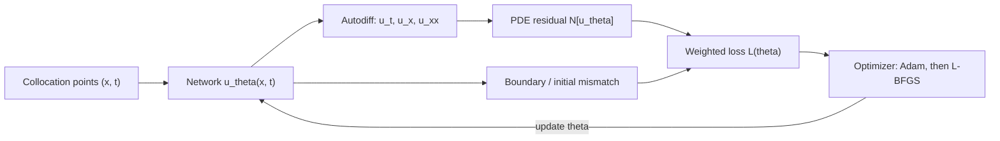
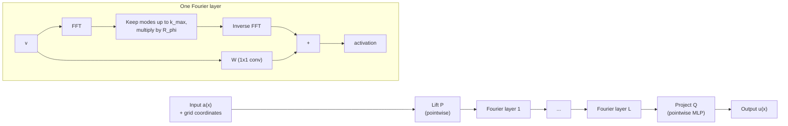
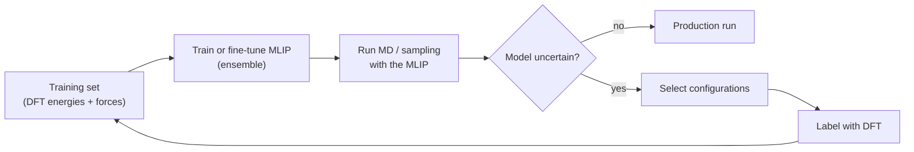

<p><a href="./">Computational Physics</a> › Machine Learning for Physics</p>

Machine learning in computational physics works alongside the governing equations; it does not replace them. A conventional solver discretizes a known equation and solves it for one set of inputs. A learned model can do three other things. It can take a known PDE as a soft constraint (**physics-informed neural networks**). It can amortize a whole family of solutions into one forward pass (**neural operators**). Or it can stand in for an expensive quantum-chemistry calculation while respecting the right symmetries (**machine-learned interatomic potentials**). This page covers these families, the architectural ideas behind them, and their failure modes.

The common thread is **inductive bias**. A generic network is a universal approximator, and in the small-data regime of physics that works against you: the network will happily fit a function that breaks energy conservation or rotational symmetry. If you build the symmetry group, the governing equation, or the conservation law into the model, the hypothesis space shrinks to physically admissible functions. That is why a symmetry-aware network can match a generic one with orders of magnitude less data.

## Where the Physics Goes

Every method on this page puts prior knowledge into one or more of three places:

| Where physics enters | Mechanism | Typical examples |
|---|---|---|
| **Loss function** | Penalize violations of a PDE, boundary condition, or conservation law | PINNs, physics-regularized surrogates |
| **Architecture** | Build the symmetry or structure in so it holds exactly | Equivariant GNNs (NequIP, MACE), Hamiltonian/Lagrangian networks, hard-constrained ansätze |
| **Data and training** | Train on simulator output, or backpropagate through the simulator itself | Neural operators, weather emulators, differentiable simulators |

In general, **architectural constraints beat loss penalties**. A penalty is only approximately satisfied and competes with the other loss terms. An architectural constraint holds exactly for every parameter value, so no data or optimizer effort is spent learning it.

## Choosing a Method

| Method | Learns | Needs | Output | Use when |
|---|---|---|---|---|
| **PINN** | One solution $u(x,t)$ | The PDE, BCs/ICs, optionally sparse data | Mesh-free, differentiable field | Inverse problems, sparse-data assimilation, awkward geometries, one-off solves |
| **Neural operator** (FNO, DeepONet) | The solution *operator* $a \mapsto u$ | Many solved input–output pairs | Fast surrogate for a PDE family | Many-query work: UQ, design optimization, real-time control |
| **ML interatomic potential** | Potential-energy surface $E(\{\mathbf{r}_i\})$ | DFT energies and forces | Energies and forces for MD | Long or large MD at near-DFT accuracy |
| **Learned emulator** (weather, climate) | Time-stepping map $x_t \mapsto x_{t+\Delta t}$ | Decades of reanalysis or simulation data | Autoregressive forecasts | High-volume, repeated forecasting where training data is plentiful |

## Physics-Informed Neural Networks (PINNs)

A PINN represents the unknown field $u(x,t)$ as a neural network $u_\theta(x,t)$. It is trained to minimize the **residual of the governing PDE** at sampled *collocation points*, plus penalties for the boundary and initial conditions. The derivatives in the PDE come from **automatic differentiation** of the network, so there is no mesh and no finite-difference stencil. For a PDE

$$ \mathcal{N}[u](x,t) = 0, \qquad x \in \Omega,\ t \in [0,T], $$

with boundary operator $\mathcal{B}$ and initial condition $u_0$, the composite loss is

$$ L(\theta) = \lambda_r L_r + \lambda_b L_b + \lambda_i L_i, $$

$$ L_r = \frac{1}{N_r}\sum_{k=1}^{N_r} \left| \mathcal{N}[u_\theta](x_k, t_k) \right|^2, \qquad L_b = \frac{1}{N_b}\sum_{k=1}^{N_b} \left| \mathcal{B}[u_\theta](x_k, t_k) \right|^2, \qquad L_i = \frac{1}{N_i}\sum_{k=1}^{N_i} \left| u_\theta(x_k, 0) - u_0(x_k) \right|^2. $$

The weights $\lambda$ set how strongly the optimizer enforces the equation relative to the boundary and initial data.



### Worked example: the 1D heat equation

For $u_t = \alpha\, u_{xx}$ on $x \in [-1, 1]$, $t \in [0, 1]$, with $u(x,0) = \sin(\pi x)$ and $u(\pm 1, t) = 0$, the residual is

$$ \mathcal{N}[u] = \frac{\partial u}{\partial t} - \alpha\, \frac{\partial^2 u}{\partial x^2}, $$

and the exact solution $u = \sin(\pi x)\, e^{-\alpha \pi^2 t}$ gives a ground truth to check against. The code below uses a **hard-constrained ansatz**,

$$ \hat{u}(x,t) = \sin(\pi x) + t\,(1 - x^2)\, N_\theta(x,t), $$

which satisfies the initial and boundary conditions exactly for any network $N_\theta$. The loss $L_b$ and $L_i$ terms therefore disappear, and only the PDE residual is trained. Training follows the standard recipe: Adam on resampled collocation points, then L-BFGS refinement.

```python
import math
import torch
import torch.nn as nn

ALPHA = 0.1  # diffusivity


class MLP(nn.Module):
    def __init__(self, widths=(2, 64, 64, 64, 1)):
        super().__init__()
        layers = []
        for n_in, n_out in zip(widths[:-1], widths[1:]):
            layers += [nn.Linear(n_in, n_out), nn.Tanh()]
        self.net = nn.Sequential(*layers[:-1])  # linear output layer

    def forward(self, x, t):
        return self.net(torch.cat([x, t], dim=1))


def u_hat(model, x, t):
    """Satisfies u(x,0) = sin(pi x) and u(+-1,t) = 0 exactly (hard constraints)."""
    return torch.sin(math.pi * x) + t * (1 - x**2) * model(x, t)


def pde_residual(model, x, t):
    x, t = x.requires_grad_(True), t.requires_grad_(True)
    u = u_hat(model, x, t)
    u_t, u_x = torch.autograd.grad(u, (t, x), torch.ones_like(u), create_graph=True)
    u_xx = torch.autograd.grad(u_x, x, torch.ones_like(u_x), create_graph=True)[0]
    return u_t - ALPHA * u_xx


def sample(n):
    return 2 * torch.rand(n, 1) - 1, torch.rand(n, 1)


torch.manual_seed(0)
model = MLP()

# Stage 1: Adam on freshly resampled collocation points each step
adam = torch.optim.Adam(model.parameters(), lr=1e-3)
for step in range(3000):
    x, t = sample(2048)
    loss = pde_residual(model, x, t).pow(2).mean()
    adam.zero_grad()
    loss.backward()
    adam.step()

# Stage 2: L-BFGS refinement on a fixed point set
x, t = sample(4096)
lbfgs = torch.optim.LBFGS(model.parameters(), max_iter=500, line_search_fn="strong_wolfe")

def closure():
    lbfgs.zero_grad()
    loss = pde_residual(model, x, t).pow(2).mean()
    loss.backward()
    return loss

lbfgs.step(closure)

# Validate against the exact solution
xv, tv = sample(10_000)
with torch.no_grad():
    exact = torch.sin(math.pi * xv) * torch.exp(-ALPHA * math.pi**2 * tv)
    err = (u_hat(model, xv, tv) - exact).norm() / exact.norm()
print(f"relative L2 error: {err:.2e}")   # of order 1e-4
```

Always report a PINN's error against an independent reference: an exact solution, or a converged conventional solve. A small residual loss does not guarantee a small solution error.

### Strengths and failure modes

PINNs are most useful when a mesh is awkward or when data and equations have to be fused. Examples are **inverse problems**, where an unknown coefficient or source is learned jointly with the field, **data assimilation** from sparse or noisy measurements, and moderately high-dimensional PDEs where a grid would need $N^d$ points. The solution is a smooth, differentiable function that can be queried anywhere.

Their known weaknesses are just as important:

| Failure mode | Symptom | Common remedies |
|---|---|---|
| **Spectral bias** | Smooth networks miss sharp fronts, boundary layers, and high-frequency content | Fourier-feature embeddings, adaptive or residual-based collocation sampling, domain decomposition (XPINNs, FBPINNs) |
| **Loss imbalance** | The PDE is satisfied in the interior while the boundary is ignored, or vice versa | Hard constraints, adaptive weights based on gradient norms or the neural tangent kernel |
| **Causality violation** | Time-dependent problems converge to a wrong but self-consistent solution | Causal weighting that trains early times first, or time-marching windows |
| **Ill-conditioned optimization** | Adam stalls with a loss plateau far above the discretization error | L-BFGS or other quasi-Newton refinement, natural-gradient and preconditioned second-order methods |

Two points of perspective matter. First, for forward problems in low dimensions that standard solvers already handle, a well-tuned finite-element or spectral code is usually faster and more accurate than a PINN by a wide margin. PINNs earn their place on inverse and data-fusion problems. Second, a 2024 survey of the ML-for-PDE literature (McGreivy and Hakim, *Nature Machine Intelligence*) found that many reported speedups over numerical solvers came from weak baselines. When evaluating any claim that a learned model beats a solver, check that the baseline solver ran at comparable accuracy on comparable hardware.

**Libraries:** [DeepXDE](https://github.com/lululxvi/deepxde) (multi-backend PINN toolkit) and [NVIDIA PhysicsNeMo](https://github.com/NVIDIA/physicsnemo) (formerly Modulus; PINNs, neural operators, and graph-based surrogates). Many research PINNs are written directly in JAX or PyTorch.

## Neural Operators

A PINN learns *one* solution. A **neural operator** learns the **solution operator** $\mathcal{G}: a \mapsto u$, a map between function spaces. For example, it can map an initial condition, a coefficient field, or a forcing function to the resulting solution. Training is expensive, since it needs a dataset of solved instances, but after that a new instance costs one forward pass. Well-designed operators are also approximately **discretization-invariant**: the learned parameters do not depend on the grid, so a model trained at one resolution can be evaluated at another.

### Fourier Neural Operator (FNO)

The FNO (Li et al., 2021) parameterizes the integral kernel of each layer in Fourier space:

$$ v^{(l+1)}(x) = \sigma\!\Big( W v^{(l)}(x) + \big(\mathcal{K} v^{(l)}\big)(x) \Big), \qquad \big(\mathcal{K} v\big)(x) = \mathcal{F}^{-1}\!\big( R_\phi \cdot \mathcal{F} v \big)(x), $$

where $W$ is a pointwise linear map and $R_\phi$ is a learned complex tensor applied to the lowest $k_{\max}$ Fourier modes. All higher modes are discarded. Truncating the spectrum works as a learnable low-pass filter: it keeps the smooth, long-range structure that dominates most PDE solutions, and it fixes the parameter count independently of resolution. Because the FFT is global, one layer mixes information across the whole domain. A convolution layer sees only its local stencil. The pointwise path $W$ restores the local, high-frequency content that the spectral path throws away.



```python
import torch
import torch.nn as nn


class SpectralConv2d(nn.Module):
    """Global convolution: FFT -> keep lowest modes -> learned complex weights -> inverse FFT."""

    def __init__(self, in_ch, out_ch, modes1, modes2):
        super().__init__()
        self.modes1, self.modes2 = modes1, modes2
        scale = 1.0 / (in_ch * out_ch)
        shape = (in_ch, out_ch, modes1, modes2)
        # rfft2 keeps only k_y >= 0, so low |k_x| lives at both ends of axis -2
        self.w_pos = nn.Parameter(scale * torch.randn(shape, dtype=torch.cfloat))
        self.w_neg = nn.Parameter(scale * torch.randn(shape, dtype=torch.cfloat))

    def forward(self, x):                                   # x: (B, C, H, W)
        B, _, H, W = x.shape
        x_ft = torch.fft.rfft2(x)                           # (B, C, H, W//2 + 1)
        out_ft = torch.zeros(B, self.w_pos.shape[1], H, W // 2 + 1,
                             dtype=torch.cfloat, device=x.device)
        m1, m2 = self.modes1, self.modes2
        mix = lambda a, w: torch.einsum("bixy,ioxy->boxy", a, w)
        out_ft[:, :, :m1, :m2] = mix(x_ft[:, :, :m1, :m2], self.w_pos)
        out_ft[:, :, -m1:, :m2] = mix(x_ft[:, :, -m1:, :m2], self.w_neg)
        return torch.fft.irfft2(out_ft, s=(H, W))


class FNO2d(nn.Module):
    def __init__(self, modes=12, width=32, in_ch=3, out_ch=1, n_layers=4):
        super().__init__()
        self.lift = nn.Conv2d(in_ch, width, 1)                       # P
        self.spectral = nn.ModuleList(
            SpectralConv2d(width, width, modes, modes) for _ in range(n_layers))
        self.local = nn.ModuleList(nn.Conv2d(width, width, 1) for _ in range(n_layers))
        self.project = nn.Sequential(nn.Conv2d(width, 128, 1), nn.GELU(),
                                     nn.Conv2d(128, out_ch, 1))     # Q
        self.act = nn.GELU()

    def forward(self, a):                  # a: (B, in_ch, H, W), e.g. [a(x,y), x, y]
        v = self.lift(a)
        for i, (K, W) in enumerate(zip(self.spectral, self.local)):
            v = K(v) + W(v)
            if i < len(self.spectral) - 1:
                v = self.act(v)
        return self.project(v)


model = FNO2d()
print(model(torch.randn(2, 3, 64, 64)).shape)    # torch.Size([2, 1, 64, 64])
print(model(torch.randn(2, 3, 128, 128)).shape)  # same weights, finer grid
```

In practice, use the maintained [`neuraloperator`](https://github.com/neuraloperator/neuraloperator) library (`from neuralop.models import FNO`) rather than hand-rolled layers. It provides FNO, tensorized FNO (TFNO, which factorizes $R_\phi$ to cut parameters), U-shaped and geometry-aware variants, and training utilities. A typical training set for the 2D Navier–Stokes benchmark pairs vorticity fields at time $t_0$ with fields at a later time $T$, all generated once by a pseudo-spectral solver.

### Other operator architectures

| Architecture | Idea | Handles irregular geometry? |
|---|---|---|
| **DeepONet** | A *branch* net encodes the input function at fixed sensors; a *trunk* net encodes the query point; the output is their inner product | Yes (trunk takes arbitrary points) |
| **FNO / TFNO** | Spectral convolution on a regular grid | No, unless the domain is mapped to a grid (Geo-FNO) |
| **Graph neural operators / MeshGraphNets** | Message passing on the simulation mesh | Yes |
| **Transformer operators** | Attention over mesh points or latent tokens | Yes |

Neural operators are most reliable when interpolating within the training distribution. Rolling them out autoregressively over long times accumulates error, and in chaotic systems that error can drive the rollout onto unphysical states. Stabilization techniques include training on multi-step rollouts, adding noise during training, and using diffusion-model refinement.

## Symmetry and Equivariant Networks

Physics has many exact symmetries. A molecule's energy does not change if you rotate, translate, or relabel its identical atoms, while a force vector *rotates with* the molecule. A generic network has to learn these facts from data. An **equivariant network** builds them into the architecture so they hold exactly.

A map $f$ is **invariant** under a group $G$ if it ignores the transformation, and **equivariant** if its output transforms along with the input:

$$ f(\rho_{\text{in}}(g)\, x) = f(x) \quad \text{(invariant)}, \qquad f(\rho_{\text{in}}(g)\, x) = \rho_{\text{out}}(g)\, f(x) \quad \text{(equivariant)}, \qquad \forall g \in G. $$

Energy is a scalar and must be *invariant* under the Euclidean group $E(3)$ and under permutations of identical atoms. Forces, dipoles, and other vectors must be *equivariant*. The standard way to get $E(3)$-equivariance is to represent features as **spherical tensors** labelled by angular-momentum order $\ell$ (scalars $\ell=0$, vectors $\ell=1$, and so on). These are combined with the **Clebsch–Gordan tensor product**, in the same way angular momenta couple in quantum mechanics:

$$ (u^{(\ell_1)} \otimes v^{(\ell_2)})^{(\ell)}_m = \sum_{m_1, m_2} C^{\ell\, m}_{\ell_1 m_1\, \ell_2 m_2}\, u^{(\ell_1)}_{m_1}\, v^{(\ell_2)}_{m_2}, \qquad |\ell_1 - \ell_2| \le \ell \le \ell_1 + \ell_2. $$

The coefficients $C$ encode how irreducible representations of $SO(3)$ combine, so any network built from these products is rotation-equivariant by construction. This is the core operation in NequIP, Allegro, and MACE. The [e3nn](https://e3nn.org/) library implements it, and NVIDIA's cuEquivariance provides fused GPU kernels for it.

A simpler special case is widely used: **invariant** message passing in the style of SchNet. Rotation invariance comes from using only interatomic *distances* as edge features, and permutation invariance comes from summing over neighbours.

```python
import torch
import torch.nn as nn


class InvariantMessagePassing(nn.Module):
    """E(3)-invariant message-passing layer (SchNet-style continuous filters)."""

    def __init__(self, n_features=64, n_rbf=20, cutoff=6.0):
        super().__init__()
        self.cutoff = cutoff
        self.register_buffer("centers", torch.linspace(0.0, cutoff, n_rbf))
        self.width = cutoff / n_rbf
        self.filter_net = nn.Sequential(nn.Linear(n_rbf, n_features), nn.SiLU(),
                                        nn.Linear(n_features, n_features))
        self.update = nn.Sequential(nn.Linear(n_features, n_features), nn.SiLU(),
                                    nn.Linear(n_features, n_features))

    def forward(self, h, positions, edge_index):
        """h: (n_atoms, n_features); edge_index: (2, n_edges) without self-loops."""
        src, dst = edge_index
        r = torch.linalg.norm(positions[dst] - positions[src], dim=-1)   # invariant
        rbf = torch.exp(-((r[:, None] - self.centers) ** 2) / (2 * self.width**2))
        fc = 0.5 * (torch.cos(torch.pi * r / self.cutoff) + 1.0) * (r < self.cutoff)
        W = self.filter_net(rbf) * fc[:, None]           # smooth, distance-only filter
        agg = torch.zeros_like(h).index_add_(0, dst, h[src] * W)   # permutation-invariant sum
        return h + self.update(agg)                      # residual update
```

Three design choices make the layer respect the symmetries exactly rather than approximately: messages depend only on distances, neighbour messages are summed, and a smooth cutoff keeps the energy differentiable. Invariant models can predict only scalars directly. Forces come from differentiating the energy. Fully equivariant models also carry $\ell \ge 1$ features, which capture angular information more efficiently and can output tensorial properties directly.

<span id="neural-network-interatomic-potentials"></span>

## Machine-Learned Interatomic Potentials

*Ab initio* molecular dynamics is limited by the cost of a DFT calculation at every timestep. A **machine-learned interatomic potential (MLIP)** is trained on DFT energies and forces and learns a surrogate $E_\theta(\{\mathbf{r}_i\})$. It can then run MD at a small fraction of the cost while keeping near-DFT accuracy. MLIPs are now a standard tool in materials and molecular simulation.

### The Behler–Parrinello decomposition

Nearly every MLIP inherits the Behler–Parrinello (2007) decomposition of the total energy into atomic contributions:

$$ E = \sum_{i=1}^{N_{\text{atoms}}} E_i\big(\mathbf{G}_i\big), $$

where a shared network maps a descriptor $\mathbf{G}_i$ of atom $i$'s local environment to its energy. This makes the model **size-extensive**, so energy scales with system size, and **local**, so cost is $O(N)$. The original descriptors are hand-designed **symmetry functions**. A radial one is

$$ G_i^{\text{rad}} = \sum_{j \neq i} e^{-\eta (r_{ij} - R_s)^2}\, f_c(r_{ij}), \qquad f_c(r) = \begin{cases} \tfrac{1}{2}\left[\cos\!\left(\dfrac{\pi r}{R_c}\right) + 1\right], & r \le R_c, \\[4pt] 0, & r > R_c, \end{cases} $$

and angular functions add three-body terms. Forces are exact gradients of the energy, which gives a conservative force field by construction:

$$ \mathbf{F}_i = -\nabla_{\mathbf{r}_i} E. $$

```python
import math
import torch
import torch.nn as nn


class BehlerParrinello(nn.Module):
    """Single-element Behler-Parrinello potential with radial symmetry functions."""

    def __init__(self, etas=(0.5, 1.0, 2.0, 4.0), shifts=(0.0, 1.0, 2.0, 3.0, 4.0),
                 cutoff=6.0, hidden=64):
        super().__init__()
        eta, rs = torch.meshgrid(torch.tensor(etas), torch.tensor(shifts), indexing="ij")
        self.register_buffer("eta", eta.flatten())
        self.register_buffer("rs", rs.flatten())
        self.cutoff = cutoff
        self.atomic_net = nn.Sequential(          # shared by every atom
            nn.Linear(self.eta.numel(), hidden), nn.SiLU(),
            nn.Linear(hidden, hidden), nn.SiLU(),
            nn.Linear(hidden, 1),
        )

    def descriptors(self, pos):
        r = torch.cdist(pos, pos)                                  # (N, N) distances
        fc = 0.5 * (torch.cos(math.pi * r / self.cutoff) + 1.0)
        fc = fc * (r < self.cutoff) * (1.0 - torch.eye(len(pos)))  # drop i == j
        g = torch.exp(-self.eta * (r[..., None] - self.rs) ** 2)   # (N, N, n_G)
        return (g * fc[..., None]).sum(dim=1)                      # sum over neighbours j

    def forward(self, pos):
        """Return total energy E and forces F = -dE/dr."""
        pos = pos.requires_grad_(True)
        energy = self.atomic_net(self.descriptors(pos)).sum()      # E = sum_i E_i(G_i)
        forces = -torch.autograd.grad(energy, pos, create_graph=self.training)[0]
        return energy, forces
```

The model is trained on a weighted loss over energies and forces, $L = w_E \lvert E - E^{\text{DFT}}\rvert^2 + w_F \sum_i \lVert \mathbf{F}_i - \mathbf{F}_i^{\text{DFT}} \rVert^2$. Forces supply $3N$ labels per configuration against one for the energy, so they dominate the information content. (`create_graph=True` during training lets the force loss backpropagate into the weights.) This toy has no periodic boundary conditions and handles only one element. Production codes add per-element networks, neighbour lists, and minimum-image distances.

### Generations of MLIPs

| Generation | Representative models | Descriptor | Trade-off |
|---|---|---|---|
| Descriptor + NN or kernel | Behler–Parrinello, ANI, GAP/SOAP, ACE | Fixed, hand-designed invariants | Cheap per step; needs large training sets; limited body order |
| Invariant message passing | SchNet, PhysNet, DimeNet | Learned from distances (and angles) | Flexible but data-hungry |
| Equivariant message passing | NequIP, Allegro, MACE | Learned $\ell \ge 1$ spherical-tensor features | 1–2 orders of magnitude more data-efficient; more cost per step |
| Universal / foundation models | MACE-MP-0 and successors, CHGNet, SevenNet, Orb, Meta's UMA | Large equivariant or attention models trained on millions of DFT structures across most of the periodic table | Usable out of the box; fine-tune for production accuracy |

**Foundation MLIPs** are the major development since 2023. Trained on datasets such as the Materials Project trajectories, Meta's OMat24 (inorganic materials) and OMol25 (molecules), and the Open Catalyst sets, one model covers about 89 elements and gives qualitatively correct dynamics for systems it never saw. The [Matbench Discovery](https://matbench-discovery.materialsproject.org/) leaderboard compares them on crystal-stability prediction. The recommended workflow is now to **start from a foundation model and fine-tune** on a few hundred system-specific DFT calculations, instead of training from scratch.

Both MACE and Meta's FAIRChem expose their models as [ASE](https://wiki.fysik.dtu.dk/ase/) calculators:

```python
from ase.build import bulk
from mace.calculators import mace_mp                      # pip install mace-torch

atoms = bulk("Cu", "fcc", a=3.6, cubic=True)
atoms.calc = mace_mp(model="medium", device="cuda", default_dtype="float64")
print(atoms.get_potential_energy(), atoms.get_forces().shape)

# Meta's UMA models (pip install fairchem-core; weights are gated on Hugging Face)
from fairchem.core import pretrained_mlip, FAIRChemCalculator
predictor = pretrained_mlip.get_predict_unit("uma-s-1p2", device="cuda")
atoms.calc = FAIRChemCalculator(predictor, task_name="omat")  # "omol", "oc20", ...
```

Check model names against the current release notes: new checkpoints come out frequently, and a checkpoint name in older code may no longer be the recommended one.

### Active learning

An MLIP can be trusted only inside the region of configuration space it was trained on. MD will eventually wander outside that region, into high temperatures, bond breaking, or new phases. Production training therefore uses an **active-learning loop**: run MD with the current model, detect configurations where it is uncertain (from committee disagreement or a per-structure error estimate), label those with DFT, and retrain.



Validate an MLIP on *physical observables* such as radial distribution functions, phonon spectra, diffusion coefficients, and energy conservation in NVE runs, not only on test-set force errors. A model with low force RMSE can still be unstable in long simulations.

## Learned Emulators at Scale

The largest ML-for-physics systems are global **weather and climate emulators**. They are trained on decades of ECMWF's ERA5 reanalysis and learn the map from the atmospheric state at time $t$ to the state at $t + 6\,\text{h}$. Forecasts come from rolling that map out autoregressively.

| System | Year | Approach | Notable result |
|---|---|---|---|
| GraphCast (Google DeepMind) | 2023 | Graph neural network on a multi-scale icosahedral mesh | Beat ECMWF's deterministic HRES on most verification targets at 10 days; about a minute per forecast on one TPU |
| NeuralGCM (Google) | 2024 | Hybrid: differentiable dynamical core plus learned physics | Stable multi-decade climate runs with realistic statistics |
| GenCast (Google DeepMind) | 2024 | Diffusion model producing ensemble members | Outperformed ECMWF's ENS ensemble on most targets |
| Aurora (Microsoft) | 2025 | Foundation model pre-trained on diverse Earth-system data, fine-tuned per task | Weather, air quality, ocean waves, and cyclone tracks from one backbone |
| AIFS (ECMWF) | 2025 | Graph/transformer model run by ECMWF itself | First ML forecast model run operationally alongside ECMWF's physics-based system |

These models show both the promise and the limits of pure emulation. They are fast and skilful within the training climate, but they inherit reanalysis biases, they are not guaranteed to conserve mass or energy, and they cannot be trusted to extrapolate to climates unlike their training data. Hybrid designs like NeuralGCM, which keep the physics core and learn only the unresolved processes, are one response.

Protein structure prediction is the other flagship result. **AlphaFold 2** (2021) used an SE(3)-invariant structure module. **AlphaFold 3** (2024) replaced it with a diffusion-based module that is not equivariant by construction and learns the symmetry from data augmentation instead. That this works suggests inductive bias is a data-efficiency tool rather than a requirement once data is abundant. The work was recognized with the 2024 Nobel Prize in Chemistry.

## Other Directions

- **Neural-network wavefunctions.** Variational Monte Carlo with neural ansätze reaches near-exact ground-state energies for small molecules and lattice models. Examples are FermiNet, PauliNet, and Psiformer for continuum electrons, and neural quantum states for spin systems. [NetKet](https://www.netket.org/) is the standard JAX library. See [Quantum Monte Carlo](monte-carlo-and-md.html#quantum-monte-carlo).
- **Generative models for sampling.** Normalizing flows and diffusion models, as *Boltzmann generators* and in lattice field theory, propose independent samples from $e^{-\beta E}$. Exact reweighting or a Metropolis correction keeps the result unbiased while sidestepping the long autocorrelations of local MCMC.
- **Differentiable simulation.** Simulators written in JAX or PyTorch, such as [JAX-MD](https://github.com/jax-md/jax-md) and differentiable CFD codes, let gradients flow through the solver. That enables inverse design, parameter fitting, and learned sub-grid closures trained against the full solver.
- **Symbolic regression.** Tools such as [PySR](https://github.com/MilesCranmer/PySR) search for compact closed-form expressions that fit data. They recover interpretable laws, and they can distil a trained neural network into an equation.
- **Simulation-based inference.** Neural density estimators fit posteriors over physical parameters directly from simulator output when the likelihood is intractable. This is now common in cosmology and particle physics.

## See Also

- [Parallel &amp; High-Performance Computing](hpc-and-ml.html): the MPI and GPU infrastructure that trains these models and generates their data.
- [Finite Elements &amp; Fluid Dynamics](fem-and-cfd.html): the Navier–Stokes solvers that neural operators emulate, and the baselines they must beat.
- [Monte Carlo &amp; Molecular Dynamics](monte-carlo-and-md.html): the MD engines that MLIPs plug into.
- [Quantum Computational Methods](quantum-methods.html): the DFT calculations that supply MLIP training labels.
- [Electronic Structure Beyond DFT](electronic-structure-beyond-dft.html): coupled-cluster references used for high-accuracy molecular training sets.
- [Visualization, Libraries &amp; Best Practices](tools-and-practices.html): the surrounding software stack and validation habits.
