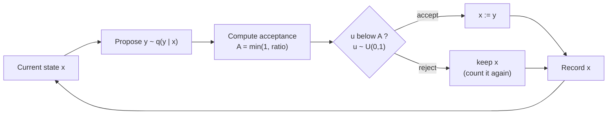
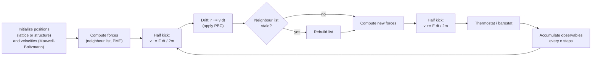

<p><a href="./">Computational Physics</a> › Monte Carlo &amp; Molecular Dynamics</p>

Monte Carlo (MC) and molecular dynamics (MD) are the two main ways to compute the properties of many-particle systems. **Monte Carlo** draws configurations at random from a probability distribution, usually the Boltzmann distribution $e^{-\beta E}$, and averages over them. **Molecular dynamics** integrates Newton's equations and averages along the resulting trajectory. By ergodicity both give the same equilibrium averages. They differ in what else they provide: MD gives real dynamics (diffusion, transport, time correlations), while MC can make unphysical moves (cluster flips, particle insertions, swaps between temperatures) that equilibrate much faster. This page covers the estimators, algorithms, and error analysis for each.

| | Monte Carlo | Molecular dynamics |
|---|---|---|
| Generates | A Markov chain of configurations | A deterministic (or stochastic) trajectory in time |
| Needs | Energies only | Forces (energy gradients) |
| Natural ensemble | Any: NVT, NPT, grand canonical, ... | NVE; NVT/NPT with thermostats and barostats |
| Dynamics | None (MC "time" is not physical) | Physical time evolution |
| Moves | Can be non-local and unphysical | Local, continuous |
| Typical use | Lattice models, phase equilibria, quantum ground states | Liquids, biomolecules, materials, transport |

## Monte Carlo Integration

To estimate $I = \mathbb{E}_p[f] = \int f(x)\, p(x)\, dx$, draw $x_1, \dots, x_N$ independently from $p$ and average:

$$ \hat{I}_N = \frac{1}{N} \sum_{i=1}^{N} f(x_i), \qquad \sigma_{\hat{I}} = \frac{\sigma_f}{\sqrt{N}}, \qquad \sigma_f^2 = \mathrm{Var}_p[f]. $$

The error falls as $N^{-1/2}$ **in any number of dimensions**. A product quadrature rule with $m$ points per axis needs $m^d$ evaluations, and its error in terms of the total point count $N$ degrades as the dimension $d$ grows. Beyond a handful of dimensions, Monte Carlo is the only practical way to integrate, which is why it dominates statistical mechanics, path integrals, and Bayesian inference. The cost is slow convergence: halving the error needs four times as many samples. Improving the method therefore means shrinking $\sigma_f$, not only increasing $N$.

### Variance reduction

**Importance sampling** draws from a proposal density $q$ and reweights:

$$ I = \int \frac{f(x)\, p(x)}{q(x)}\, q(x)\, dx \approx \frac{1}{N} \sum_{i=1}^{N} f(x_i)\, w(x_i), \qquad w = \frac{p}{q}, \quad x_i \sim q. $$

The variance vanishes when $q \propto \lvert f \rvert\, p$, so a good proposal concentrates samples where the integrand is large. A poor $q$ whose tails are lighter than $p$'s can make the variance *infinite*. Always monitor the weight distribution. The effective sample size $(\sum w)^2 / \sum w^2$ is a standard diagnostic.

| Technique | Idea |
|---|---|
| Importance sampling | Sample where $\lvert f\rvert p$ is large; reweight |
| Control variates | Subtract a correlated function with known mean |
| Antithetic variates | Pair samples $x$ and $-x$ (or $1-u$) with negatively correlated errors |
| Stratified sampling | Split the domain and sample each stratum in proportion to its variance |
| Quasi-Monte Carlo | Low-discrepancy sequences (Sobol, Halton) reach close to $O(N^{-1})$ for smooth, moderate-dimensional integrands (`scipy.stats.qmc`) |

The example estimates the tail probability $P(X > 4)$ for a standard normal, which is about $3.2 \times 10^{-5}$. Plain MC sees only a handful of hits in $10^5$ draws. Shifting the proposal onto the tail cuts the error by more than two orders of magnitude.

```python
import numpy as np
from scipy import stats

rng = np.random.default_rng(seed=42)   # modern Generator API; avoid np.random.seed
n = 100_000
f = lambda x: (x > 4.0).astype(float)

x = rng.standard_normal(n)                       # plain MC
plain = f(x).mean(), f(x).std(ddof=1) / np.sqrt(n)

q = stats.norm(loc=4.0)                          # proposal centred on the tail
y = q.rvs(size=n, random_state=rng)
g = f(y) * stats.norm.pdf(y) / q.pdf(y)          # f * p / q
importance = g.mean(), g.std(ddof=1) / np.sqrt(n)

print(f"exact      {stats.norm.sf(4.0):.3e}")                        # 3.167e-05
print(f"plain MC   {plain[0]:.3e} +/- {plain[1]:.1e}")               # ~9e-05 +/- 3e-05
print(f"importance {importance[0]:.3e} +/- {importance[1]:.1e}")     # ~3.17e-05 +/- 2e-07
```

## Markov Chain Monte Carlo

In statistical physics you cannot sample the Boltzmann distribution $\pi(x) = e^{-\beta E(x)}/Z$ directly, because the partition function $Z$ is unknown and the space is vast. **Markov chain Monte Carlo** (MCMC) instead builds a random walk whose **stationary distribution** is $\pi$. A sufficient condition is **detailed balance**,

$$ \pi(x)\, P(x \to y) = \pi(y)\, P(y \to x), $$

together with ergodicity, meaning every state can be reached. The **Metropolis–Hastings** algorithm splits each transition into a proposal $q(y \mid x)$ and an acceptance step:

$$ A(x \to y) = \min\!\left(1,\ \frac{\pi(y)\, q(x \mid y)}{\pi(x)\, q(y \mid x)}\right). $$

Only ratios of $\pi$ appear, so $Z$ cancels. For a symmetric proposal the $q$ terms cancel too, and for the Boltzmann distribution the rule becomes $A = \min(1, e^{-\beta \Delta E})$: downhill moves are always accepted, and uphill moves are accepted with just the right probability.



A rejected move still adds the *current* state to the chain again. Dropping rejected steps biases the result. Work with log-probabilities, because ratios of $e^{-\beta E}$ overflow and underflow quickly:

```python
import numpy as np

def metropolis(log_p, x0, n_steps, step, rng):
    """Random-walk Metropolis for an unnormalized log-density log_p."""
    x = np.asarray(x0, dtype=float)
    lp = log_p(x)
    chain = np.empty((n_steps, x.size))
    accepted = 0
    for i in range(n_steps):
        y = x + step * rng.standard_normal(x.shape)     # symmetric proposal
        lp_y = log_p(y)
        if np.log(rng.random()) < lp_y - lp:            # accept with min(1, p(y)/p(x))
            x, lp = y, lp_y
            accepted += 1
        chain[i] = x                                    # record even if rejected
    return chain, accepted / n_steps

# Bimodal target: 0.3 N(2, 1) + 0.7 N(-2, 1); exact mean = -0.8
log_p = lambda x: np.logaddexp(np.log(0.3) - 0.5 * np.sum((x - 2) ** 2),
                               np.log(0.7) - 0.5 * np.sum((x + 2) ** 2))
rng = np.random.default_rng(0)
chain, acc = metropolis(log_p, x0=[0.0], n_steps=50_000, step=2.5, rng=rng)
chain = chain[5_000:]                                   # discard burn-in
```

The proposal width is a trade-off. Tiny steps are nearly always accepted but barely move, and huge steps are nearly always rejected. For random-walk proposals in high dimensions, the asymptotically optimal acceptance rate is about 23%. In one or two dimensions it is closer to 40–50%.

### Example: the 2D Ising model

The Ising model $E = -J \sum_{\langle ij \rangle} s_i s_j$ with $s_i = \pm 1$ is the standard MCMC test case, and it has an exact solution for comparison: Onsager's $T_c = 2J / \ln(1+\sqrt{2}) \approx 2.269\,J/k_B$. Flipping spin $i$ costs $\Delta E = 2 J s_i \sum_{j \in \text{nn}(i)} s_j$. On a square lattice, spins of one checkerboard colour do not interact with each other, so all of them can be updated at once:

```python
import numpy as np

def ising_sweep(spins, beta, rng):
    """One checkerboard Metropolis sweep of the 2D Ising model (J = 1, periodic)."""
    L = spins.shape[0]
    parity = np.add.outer(np.arange(L), np.arange(L)) % 2
    for colour in (0, 1):
        nn_sum = (np.roll(spins, 1, 0) + np.roll(spins, -1, 0) +
                  np.roll(spins, 1, 1) + np.roll(spins, -1, 1))
        dE = 2.0 * spins * nn_sum                        # cost of flipping each spin
        accept = rng.random(spins.shape) < np.exp(-beta * dE)
        spins[accept & (parity == colour)] *= -1
    return spins

rng = np.random.default_rng(0)
L = 32
for T in (1.5, 2.269, 3.5):
    spins = rng.choice([-1, 1], size=(L, L))
    for _ in range(2000):                                # equilibrate
        ising_sweep(spins, 1.0 / T, rng)
    m = [abs(ising_sweep(spins, 1.0 / T, rng).mean()) for _ in range(4000)]
    print(f"T = {T:5.3f}   <|m|> = {np.mean(m):.3f}")
# T = 1.500 -> 0.986 (Onsager: 0.987); T = 3.500 -> ~0.06 (finite-size tail of m = 0)
```

### Beating slow mixing

Local updates break down exactly where the physics is most interesting. Near a critical point, correlated domains grow to the size of the system, and the autocorrelation time grows as $\tau \sim L^{z}$. For local Metropolis on the 2D Ising model, $z \approx 2.17$. This is **critical slowing down**. At first-order transitions and in glassy systems, the chain gets stuck behind free-energy barriers instead.

| Method | Idea | Cures |
|---|---|---|
| **Cluster algorithms** (Swendsen–Wang, Wolff) | Build clusters of aligned spins with bond probability $1 - e^{-2\beta J}$ and flip whole clusters, always accepted | Critical slowing down ($z \approx 0.25$ in 2D) |
| **Parallel tempering** (replica exchange) | Run replicas at several temperatures; swap neighbours with probability $\min\!\big(1, e^{(\beta_i - \beta_j)(E_i - E_j)}\big)$ | Barriers and metastability |
| **Hamiltonian (hybrid) Monte Carlo** | Propose via a short MD trajectory with random momenta, then a Metropolis test on $\Delta H$ | Random-walk behaviour in high-dimensional continuous spaces; standard in lattice QCD and Bayesian inference (NUTS in Stan, PyMC, BlackJAX) |
| **Multicanonical / Wang–Landau** | Sample a flat energy histogram, then reweight | Rough landscapes; gives the density of states $g(E)$ directly |
| **Event-chain MC** | Rejection-free, irreversible chains of particle moves | Hard spheres and dense soft matter |

### Error analysis for correlated samples

Successive MCMC samples are correlated, so the naive error $\sigma/\sqrt{N}$ is **too optimistic**. With the normalized autocorrelation function $\rho(t)$ of an observable $A$, define

$$ \tau_{\text{int}} = 1 + 2 \sum_{t=1}^{\infty} \rho(t), \qquad N_{\text{eff}} = \frac{N}{\tau_{\text{int}}}, \qquad \sigma_{\bar{A}}^2 \approx \frac{\sigma_A^2}{N}\, \tau_{\text{int}}. $$

(Some texts define $\tau_{\text{int}}$ as half this and write $2\tau_{\text{int}}$.) The sum must be truncated. Sokal's automatic window cuts it off at the smallest $M$ with $M \ge c\,\tau_{\text{int}}(M)$ for $c \approx 5$. **Blocking analysis** (Flyvbjerg–Petersen) is a robust alternative: average the data into blocks of increasing size until the naive error of the block means reaches a plateau. Run several independent chains and compare them (the Gelman–Rubin $\hat{R}$ statistic) to detect chains that have not mixed.

```python
def integrated_autocorr_time(a, c=5.0):
    """tau_int with Sokal's automatic windowing (FFT-based autocorrelation)."""
    a = np.asarray(a, float) - np.mean(a)
    n = len(a)
    spec = np.fft.rfft(a, n=2 * n)                       # zero-pad: no wrap-around
    acf = np.fft.irfft(spec * np.conj(spec))[:n]
    acf /= acf[0]
    tau = 2.0 * np.cumsum(acf) - 1.0                     # tau(M) = 1 + 2 sum_{t<=M} rho(t)
    below = np.arange(n) < c * tau
    window = np.argmin(below) if not below.all() else n - 1
    return tau[window]

tau = integrated_autocorr_time(chain[:, 0])
err = chain[:, 0].std(ddof=1) * np.sqrt(tau / len(chain))
print(f"mean = {chain.mean():.3f} +/- {err:.3f}  (tau_int = {tau:.1f})")
```

Burn-in (discarding the start of the chain) removes bias from the initial state. It does nothing about correlation. A result is trustworthy only when the run is many $\tau_{\text{int}}$ long, and the slowest mode sets that length, not the observable you happen to measure.

## Quantum Monte Carlo

Quantum Monte Carlo (QMC) applies stochastic sampling to the many-electron Schrödinger equation. It is among the most accurate methods for correlated systems, and its cost scales as roughly $O(N^3)$ to $O(N^4)$ with electron number, against $O(N^7)$ for CCSD(T).

### Variational Monte Carlo

Given a trial wavefunction $\psi_\alpha(\mathbf{R})$ with parameters $\alpha$, the variational energy is an average of the **local energy** $E_L = \hat{H}\psi_\alpha / \psi_\alpha$ over $\lvert\psi_\alpha\rvert^2$:

$$ E(\alpha) = \frac{\int \lvert\psi_\alpha(\mathbf{R})\rvert^2\, E_L(\mathbf{R})\, d\mathbf{R}}{\int \lvert\psi_\alpha(\mathbf{R})\rvert^2\, d\mathbf{R}} \ \ge\ E_0. $$

The sampling uses Metropolis on $\lvert\psi_\alpha\rvert^2$, so the normalization is never needed. The **zero-variance principle** says that as $\psi_\alpha$ approaches an eigenstate, $E_L$ becomes constant and its variance goes to zero. The variance is therefore a second optimization target and a measure of wavefunction quality.

For hydrogen with $\psi_\alpha = e^{-\alpha r}$ (atomic units), $\nabla^2 \psi / \psi = \alpha^2 - 2\alpha/r$, so

$$ E_L(r) = -\frac{\alpha^2}{2} + \frac{\alpha - 1}{r}, \qquad E(\alpha) = \frac{\alpha^2}{2} - \alpha, $$

minimized at $\alpha = 1$ with $E = -\tfrac{1}{2}$ Ha and zero variance:

```python
import numpy as np

def vmc_hydrogen(alpha, n_walkers=2000, n_steps=2000, step=0.5, seed=0):
    """VMC for hydrogen with psi = exp(-alpha r), atomic units. Returns <E_L>, var(E_L)."""
    rng = np.random.default_rng(seed)
    r = rng.normal(size=(n_walkers, 3))                 # an ensemble of walkers in 3D
    log_psi2 = lambda r: -2.0 * alpha * np.linalg.norm(r, axis=1)
    lp = log_psi2(r)
    energies = []
    for i in range(n_steps):
        trial = r + step * rng.normal(size=r.shape)
        lp_trial = log_psi2(trial)
        accept = np.log(rng.random(n_walkers)) < lp_trial - lp
        r[accept], lp[accept] = trial[accept], lp_trial[accept]
        if i >= n_steps // 4:                           # discard burn-in
            d = np.linalg.norm(r, axis=1)
            energies.append(-0.5 * alpha**2 + (alpha - 1.0) / d)
    E = np.concatenate(energies)
    return E.mean(), E.var()

for alpha in (0.8, 0.9, 1.0, 1.1, 1.2):
    E, var = vmc_hydrogen(alpha)
    print(f"alpha = {alpha:.1f}   E = {E:+.4f} Ha   var(E_L) = {var:.4f}")
# alpha = 1.0 gives E = -0.5000 with var = 0 exactly; alpha = 0.8 gives -0.480 (exact -0.48)
```

For real molecules and solids, the standard trial function is a **Slater–Jastrow** wavefunction: a determinant (or several) of orbitals from DFT or Hartree–Fock, multiplied by an explicit correlation factor. Since about 2020, **neural-network wavefunctions** (FermiNet, PauliNet, Psiformer, and neural quantum states for lattice models) have replaced hand-built ansätze in many benchmark studies and reach near-exact energies for small systems. See [Machine Learning for Physics](ml-for-physics.html#other-directions).

### Projector methods and the sign problem

**Diffusion Monte Carlo** (DMC) projects the ground state out of a trial state by evolving in imaginary time:

$$ \lvert \phi_0 \rangle \propto \lim_{\tau \to \infty} e^{-\tau (\hat{H} - E_T)} \lvert \psi_T \rangle. $$

It does this with a population of walkers that diffuse (kinetic term) and branch or die (potential term). For bosons the projected state is positive everywhere and DMC is exact up to statistical and time-step error. For fermions, the antisymmetric wavefunction changes sign. Sampling it exactly suffers from the **fermion sign problem**: the signal-to-noise ratio decays exponentially with system size and inverse temperature. The standard workaround is the **fixed-node approximation**, which forces the nodes to match the trial function. It gives a variational upper bound that is usually far better than VMC.

Other members of the family include **path-integral Monte Carlo** (finite temperature, bosonic superfluids), **auxiliary-field QMC** (lattice models and ab initio, with a phaseless constraint), and **stochastic series expansion** (unfrustrated quantum spin models, which have no sign problem). QMCPACK and CASINO are the main production codes for continuum electronic structure.

## Molecular Dynamics

Molecular dynamics integrates Newton's equations $m_i \ddot{\mathbf{r}}_i = \mathbf{F}_i = -\nabla_{\mathbf{r}_i} U$ for $N$ interacting particles and computes observables as time averages. Nearly all of the cost is in the force evaluation. The rest of an MD code decides how to integrate stably, how to control temperature and pressure, and how to avoid computing all $N^2$ pair interactions.



### Interaction potentials

The Lennard-Jones potential is the standard model for neutral atoms:

$$ U_{\text{LJ}}(r) = 4\varepsilon \left[ \left(\frac{\sigma}{r}\right)^{12} - \left(\frac{\sigma}{r}\right)^{6} \right], \qquad \mathbf{F}_{ij} = \frac{24\varepsilon}{r_{ij}^2} \left[ 2\left(\frac{\sigma}{r_{ij}}\right)^{12} - \left(\frac{\sigma}{r_{ij}}\right)^{6} \right] \mathbf{r}_{ij}, $$

with $\mathbf{r}_{ij} = \mathbf{r}_i - \mathbf{r}_j$ and $\mathbf{F}_{ij}$ the force on $i$ due to $j$. Simulations use **reduced units** ($\varepsilon = \sigma = m = 1$), truncate the potential at $r_c \approx 2.5\sigma$, and shift it so it is continuous there. Real systems use richer force fields: biomolecular force fields (AMBER, CHARMM, OPLS) with bonded terms and partial charges; many-body potentials for metals (EAM) and covalent solids (Tersoff, ReaxFF); and, more and more, [machine-learned potentials](ml-for-physics.html#machine-learned-interatomic-potentials) trained on DFT.

### The velocity Verlet integrator

The standard integrator is **velocity Verlet**:

$$ \mathbf{v}_{n+1/2} = \mathbf{v}_n + \frac{\Delta t}{2m} \mathbf{F}_n, \qquad \mathbf{r}_{n+1} = \mathbf{r}_n + \Delta t\, \mathbf{v}_{n+1/2}, \qquad \mathbf{v}_{n+1} = \mathbf{v}_{n+1/2} + \frac{\Delta t}{2m} \mathbf{F}_{n+1}. $$

It needs one force evaluation per step, is second-order accurate, is time-reversible, and is **symplectic**: it exactly conserves a "shadow Hamiltonian" that differs from the true one by $O(\Delta t^2)$. The practical result is that the energy error stays bounded and oscillates, with no secular drift, over very long runs. A non-symplectic method such as classical RK4 is more accurate per step but drifts steadily. The time step is limited by the fastest motion in the system. Atomistic simulations use about 1–2 fs, or up to 4 fs with bond constraints (SHAKE, LINCS) and hydrogen mass repartitioning.

The vectorized example below simulates 256 Lennard-Jones atoms at liquid density. It starts from an FCC lattice, because random initial positions create overlaps whose huge forces blow up the integration.

```python
import numpy as np

def lj_forces(pos, box, rc=2.5):
    """LJ forces and potential energy (reduced units), minimum image, shifted cutoff. O(N^2)."""
    d = pos[:, None, :] - pos[None, :, :]               # r_i - r_j, shape (N, N, 3)
    d -= box * np.round(d / box)                        # minimum-image convention
    r2 = np.einsum("ijk,ijk->ij", d, d)
    np.fill_diagonal(r2, np.inf)
    mask = r2 < rc**2
    inv6 = np.where(mask, 1.0 / r2**3, 0.0)
    fmag = np.where(mask, 24.0 * (2.0 * inv6**2 - inv6) / r2, 0.0)
    forces = np.einsum("ij,ijk->ik", fmag, d)
    shift = 4.0 * (rc**-12 - rc**-6)
    pot = 0.5 * np.sum(np.where(mask, 4.0 * (inv6**2 - inv6) - shift, 0.0))
    return forces, pot

def fcc_lattice(n_cells, density):
    a = (4.0 / density) ** (1 / 3)                      # 4 atoms per cubic cell
    basis = np.array([[0, 0, 0], [0.5, 0.5, 0], [0.5, 0, 0.5], [0, 0.5, 0.5]])
    cells = np.array(np.meshgrid(*[np.arange(n_cells)] * 3, indexing="ij")).reshape(3, -1).T
    return ((cells[:, None, :] + basis).reshape(-1, 3) * a), n_cells * a

def velocity_verlet(pos, vel, box, dt, n_steps):
    f, pot = lj_forces(pos, box)
    energy = []
    for _ in range(n_steps):
        vel += 0.5 * dt * f                             # half kick
        pos += dt * vel                                 # drift
        pos %= box                                      # wrap into the box
        f, pot = lj_forces(pos, box)                    # the only force call per step
        vel += 0.5 * dt * f                             # half kick
        energy.append(0.5 * np.sum(vel**2) + pot)
    return pos, vel, np.array(energy)

rng = np.random.default_rng(1)
pos, box = fcc_lattice(n_cells=4, density=0.8)          # 256 atoms
vel = rng.normal(size=pos.shape)                        # Maxwell-Boltzmann at T = 1
vel -= vel.mean(axis=0)                                 # zero total momentum
pos, vel, E = velocity_verlet(pos, vel, box, dt=0.005, n_steps=1000)
print(f"relative energy drift: {(E[-1] - E[0]) / abs(E[0]):.1e}")   # ~1e-5
```

Energy conservation in an NVE run is the first sanity check for any MD setup. A drift that grows with $\Delta t^2$ is expected. A drift that grows linearly in time points to a bug, a non-smooth potential, or a time step that is too large.

### Neighbour lists

The all-pairs loop above is $O(N^2)$. With a short-range cutoff, each atom interacts with only $O(1)$ neighbours, and two standard structures bring the cost down to $O(N)$:

- **Cell lists** divide the box into cells at least $r_c$ wide. Each atom only checks its own and adjacent cells.
- **Verlet lists** store, for each atom, the neighbours within $r_c + r_{\text{skin}}$. The list stays valid until some atom has moved more than $r_{\text{skin}}/2$, which typically takes 10–20 steps. It is rebuilt with cell lists.

### Thermostats and barostats

Plain Verlet samples the microcanonical (NVE) ensemble. To simulate at constant temperature or pressure, the equations of motion are modified. The choice matters: some popular thermostats **do not** generate the correct ensemble.

| Thermostat | Mechanism | Canonical ensemble? | Notes |
|---|---|---|---|
| Berendsen | Rescale velocities toward $T_0$ with time constant $\tau$ | **No** (suppresses fluctuations) | Use only for fast equilibration; can cause the "flying ice cube" artefact |
| Velocity rescaling (Bussi–Donadio–Parrinello, CSVR) | Rescale kinetic energy with a stochastic term | Yes | Robust default in GROMACS (`v-rescale`) |
| Nosé–Hoover (chains) | Extended system with a friction variable $\xi$ | Yes, if ergodic | Deterministic; use chains, because a single thermostat is non-ergodic for small or stiff systems |
| Langevin | Friction $-\gamma m \mathbf{v}$ plus random force | Yes | Perturbs dynamics (diffusion) when $\gamma$ is large; the BAOAB splitting gives very accurate configurational sampling |

For pressure control, Parrinello–Rahman and MTK (Martyna–Tobias–Klein) barostats generate the correct NPT ensemble. Berendsen pressure coupling does not. The stochastic cell-rescaling barostat (Bernetti and Bussi, 2020) is a correct first-order alternative.

A Langevin thermostat with the **BAOAB** splitting (Leimkuhler and Matthews) interleaves Verlet half-steps (B = kick, A = drift) with an exact Ornstein–Uhlenbeck velocity update (O):

```python
def baoab_step(pos, vel, f, box, dt, kT, gamma, rng):
    """One BAOAB Langevin step (unit masses): samples the canonical (NVT) ensemble."""
    c1 = np.exp(-gamma * dt)
    c2 = np.sqrt((1.0 - c1**2) * kT)
    vel += 0.5 * dt * f                                     # B
    pos += 0.5 * dt * vel                                   # A
    vel[:] = c1 * vel + c2 * rng.standard_normal(vel.shape) # O: exact OU update
    pos += 0.5 * dt * vel                                   # A
    pos %= box
    f, pot = lj_forces(pos, box)
    vel += 0.5 * dt * f                                     # B
    return pos, vel, f, pot
```

### Long-range electrostatics

The Coulomb interaction decays as $1/r$, so the lattice sum over periodic images is only conditionally convergent, and truncating it gives serious artefacts. **Ewald summation** splits the interaction with the identity

$$ \frac{1}{r} = \frac{\operatorname{erfc}(\alpha r)}{r} + \frac{\operatorname{erf}(\alpha r)}{r} $$

into a short-range part, summed in real space with a cutoff, and a smooth long-range part, summed in reciprocal space. For point charges $q_i$ in a cubic box of volume $V$ (Gaussian units, conducting boundary conditions):

$$ E = \frac{1}{2} \sum_{\mathbf{n}} \sum_{i,j}{}^{\prime}\, q_i q_j \frac{\operatorname{erfc}(\alpha \lvert \mathbf{r}_{ij} + \mathbf{n}L \rvert)}{\lvert \mathbf{r}_{ij} + \mathbf{n}L \rvert} + \frac{2\pi}{V} \sum_{\mathbf{k} \neq 0} \frac{e^{-k^2/4\alpha^2}}{k^2} \left\lvert \sum_{j} q_j e^{i \mathbf{k} \cdot \mathbf{r}_j} \right\rvert^2 - \frac{\alpha}{\sqrt{\pi}} \sum_i q_i^2, $$

where the prime omits $i = j$ in the $\mathbf{n} = 0$ image. The last term removes each charge's interaction with its own screening Gaussian. With $\alpha$ tuned, plain Ewald costs $O(N^{3/2})$. **Particle-mesh Ewald** (PME) and **P3M** spread the charges onto a grid and do the reciprocal sum with FFTs, bringing the cost to $O(N \log N)$. PME is the default in every major biomolecular code. Fast multipole methods reach $O(N)$ and suit very large or non-periodic systems.

### Enhanced sampling and free energies

Biomolecular and materials processes such as folding, nucleation, and chemical reactions often happen on timescales far beyond what direct MD can reach. Enhanced-sampling methods bias the simulation along one or more **collective variables** (CVs) and then remove the bias exactly:

| Method | Idea |
|---|---|
| Umbrella sampling + WHAM/MBAR | Harmonic restraints at windows along a CV; combine windows by reweighting |
| Metadynamics (well-tempered, OPES) | Deposit Gaussians or build a bias on the fly that fills free-energy wells |
| Replica exchange MD | Parallel tempering in MD; also Hamiltonian replica exchange (REST2) |
| Alchemical free-energy perturbation / TI | Interpolate between Hamiltonians to get binding and solvation free energies |
| Steered MD + Jarzynski equality | Non-equilibrium pulling, $\langle e^{-\beta W} \rangle = e^{-\beta \Delta F}$ |

[PLUMED](https://www.plumed.org/) implements most of these as a plugin for all the major MD engines.

### Production MD software

| Code | Strengths |
|---|---|
| [LAMMPS](https://www.lammps.org/) | Materials, soft matter, many-body and ML potentials; highly extensible (stable releases roughly yearly, e.g. 22 Jul 2025 with rolling updates) |
| [GROMACS](https://www.gromacs.org/) | Very fast biomolecular MD on CPUs and GPUs; annual releases (2026 series current) |
| [OpenMM](https://openmm.org/) | Python-scriptable, GPU-first, custom forces; common for free-energy and ML-potential work |
| AMBER, NAMD, CHARMM | Established biomolecular packages with their own force fields |
| HOOMD-blue | GPU-native soft matter and coarse-grained models |
| [ASE](https://wiki.fysik.dtu.dk/ase/) / JAX-MD | Python-level MD for prototyping, ML potentials, and differentiable simulation |

Analysis tools include MDAnalysis and MDTraj (Python trajectory analysis), and OVITO and VMD (visualization). See [Visualization, Libraries &amp; Best Practices](tools-and-practices.html).

---

*Previous: [Computational Physics Hub](./) · Next: [Finite Elements &amp; Fluid Dynamics](fem-and-cfd.html)*

## See Also

- [Statistical Mechanics](../statistical-mechanics/): ensembles, partition functions, and the physics that MC and MD sample.
- [Phase Transitions and Advanced Topics](../statistical-mechanics/phase-transitions-and-advanced.html): the Onsager solution and critical exponents used above as benchmarks.
- [Quantum Computational Methods](quantum-methods.html): DFT, whose forces drive *ab initio* MD.
- [Machine Learning for Physics](ml-for-physics.html): ML interatomic potentials and neural-network wavefunctions.
- [Parallel &amp; High-Performance Computing](hpc-and-ml.html): scaling MD and Monte Carlo across cores and GPUs.
