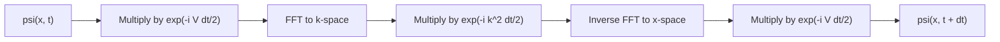
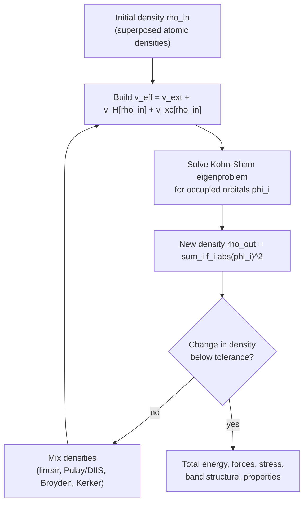

<p><a href="./">Computational Physics</a> › Quantum Computational Methods</p>

This page covers the numerical core of quantum simulation. It explains how to represent a wavefunction on a computer, how to find stationary states, how to propagate a state in time without losing unitarity, and how **density functional theory** (DFT) turns the many-electron problem into a self-consistent one-electron problem. Wavefunction-based electronic-structure methods (Hartree–Fock, coupled cluster) are on [Electronic Structure Beyond DFT](electronic-structure-beyond-dft.html). Stochastic approaches are under [Quantum Monte Carlo](monte-carlo-and-md.html#quantum-monte-carlo).

All equations use **atomic units** ($\hbar = m_e = e = 4\pi\varepsilon_0 = 1$). Energies are in hartree (1 Ha ≈ 27.211 eV) and lengths in bohr (≈ 0.529 Å).

## Representing the Wavefunction

Every method starts by choosing a finite representation of $\psi$. The Hamiltonian then becomes a matrix, and the Schrödinger equation becomes linear algebra.

| Representation | $\hat{H}$ becomes | Strengths | Typical use |
|---|---|---|---|
| **Finite-difference grid** | Sparse banded matrix | Simple; any potential; local operators | 1D/2D model problems, real-space DFT codes |
| **Fourier (plane-wave) grid** | $\hat{T}$ diagonal in $k$-space, $\hat{V}$ diagonal in $x$-space; switch with FFTs | Spectral accuracy for smooth $\psi$; natural for periodic systems | Split-operator dynamics, plane-wave DFT |
| **Localized basis** (Gaussians, atomic orbitals) | Small dense matrix plus overlap matrix $S$ | Compact for molecules; analytic integrals | Quantum chemistry |
| **Discrete variable representation** (DVR) | Diagonal $\hat{V}$, dense $\hat{T}$ | Spectral accuracy with grid-like simplicity | Molecular vibrations, reactive scattering |

On a uniform grid with spacing $\Delta x$, the three-point stencil gives

$$ \hat{H}\psi_j \approx -\frac{1}{2}\, \frac{\psi_{j+1} - 2\psi_j + \psi_{j-1}}{\Delta x^2} + V_j\, \psi_j, $$

a real symmetric tridiagonal matrix with $O(\Delta x^2)$ truncation error. Stationary states come from a sparse or banded eigensolver. You rarely need a dense `eigh`. For the harmonic oscillator, whose exact levels are $E_n = n + \tfrac{1}{2}$:

```python
import numpy as np
from scipy.linalg import eigh_tridiagonal

x = np.linspace(-10, 10, 2001)
dx = x[1] - x[0]
V = 0.5 * x**2
diag = 1.0 / dx**2 + V                         # -1/2 * (-2/dx^2) + V
off = np.full(len(x) - 1, -0.5 / dx**2)        # -1/2 * (1/dx^2)
E, phi = eigh_tridiagonal(diag, off, select="i", select_range=(0, 4))
print(E.round(5))        # [0.5  1.49998  2.49996  3.49992  4.49987] -- O(dx^2) error
phi /= np.sqrt(dx)       # normalize so that sum |phi|^2 dx = 1
```

The error grows with $n$ because higher states oscillate faster on the same grid. For 2D and 3D problems, build the Hamiltonian with `scipy.sparse` (Kronecker sums of 1D operators) and use `scipy.sparse.linalg.eigsh` with shift-invert (`sigma=`) for the lowest eigenpairs.

## Time-Dependent Schrödinger Equation

The equation $i\, \partial_t \psi = \hat{H} \psi$ has the formal solution $\psi(t + \Delta t) = e^{-i\hat{H}\Delta t}\, \psi(t)$ when $\hat{H}$ is time-independent. A good propagator approximates this exponential while keeping its key properties:

- **Unitarity.** The norm is conserved, so probability neither leaks nor grows.
- **Time reversibility.** Stepping forward then backward returns the initial state.
- **Stability.** Explicit methods such as forward Euler are unconditionally *unstable* for the Schrödinger equation, and RK4 is only conditionally stable and slowly loses norm.

### Split-operator Fourier method

The kinetic operator $\hat{T} = \hat{p}^2/2$ is diagonal in momentum space and $\hat{V}$ is diagonal in position space. **Strang splitting** factorizes the propagator into pieces that are each trivial to apply in their own basis:

$$ e^{-i(\hat{T} + \hat{V})\Delta t} = e^{-i\hat{V}\Delta t/2}\, e^{-i\hat{T}\Delta t}\, e^{-i\hat{V}\Delta t/2} + O(\Delta t^3). $$

The splitting error comes from the commutator $[\hat{T}, \hat{V}]$. It is $O(\Delta t^3)$ per step and $O(\Delta t^2)$ globally. Each factor is a pure phase, so the scheme is **exactly unitary** whatever the time step. Each step costs two FFTs, $O(N \log N)$. Higher-order compositions (Yoshida, Suzuki) and time-dependent potentials fit the same pattern.



The example sends a Gaussian wavepacket with mean energy $E = k_0^2/2 = 0.72$ at a rectangular barrier of height $V_0 = 1$ and width $a = 1$. The energy is below the barrier top, so any transmission is tunnelling.

```python
import numpy as np

n, L = 2048, 200.0                                   # periodic box for the FFT
x = (np.arange(n) - n // 2) * (L / n)
dx = x[1] - x[0]
k = 2 * np.pi * np.fft.fftfreq(n, d=dx)              # angular wavenumbers in FFT order

def wavepacket(x0, k0, sigma):
    psi = np.exp(-(x - x0) ** 2 / (4 * sigma**2) + 1j * k0 * x)
    return psi / np.sqrt(np.sum(abs(psi) ** 2) * dx)

def split_operator(psi, V, dt, n_steps):
    half_V = np.exp(-0.5j * V * dt)                  # exp(-i V dt/2)
    full_T = np.exp(-0.5j * k**2 * dt)               # exp(-i (k^2/2) dt)
    for _ in range(n_steps):
        psi = half_V * psi
        psi = np.fft.ifft(full_T * np.fft.fft(psi))
        psi = half_V * psi
    return psi

V0, a, k0 = 1.0, 1.0, 1.2
V = np.where(np.abs(x) < a / 2, V0, 0.0)
psi = split_operator(wavepacket(x0=-40.0, k0=k0, sigma=5.0), V, dt=0.02, n_steps=4000)

norm = np.sum(abs(psi) ** 2) * dx                    # 1.000000000000 (unitary)
T = np.sum(abs(psi[x > a / 2]) ** 2) * dx            # ~0.50
print(f"norm = {norm:.12f}, transmission = {T:.3f}")
```

The simulated transmission (about 0.50) is below the plane-wave value at $k_0$,

$$ T(E) = \left[ 1 + \frac{V_0^2 \sinh^2(\kappa a)}{4E(V_0 - E)} \right]^{-1}, \qquad \kappa = \sqrt{2(V_0 - E)}, $$

which gives 0.545. The difference is expected: a wavepacket is a superposition of momenta and the result is $T(k)$ averaged over its momentum distribution. Narrowing the spread (a larger $\sigma$) brings the two together. Two practical points apply. First, the FFT imposes **periodic boundaries**, so a packet leaving one side re-enters on the other. Either make the box large enough, as here, or add a **complex absorbing potential** $-i W(x)$ near the edges. Second, the grid must resolve the largest momentum present: $k_{\max} = \pi/\Delta x$.

### Crank–Nicolson

Crank–Nicolson uses the Cayley (Padé [1/1]) approximation of the exponential:

$$ \left(1 + \frac{i\Delta t}{2}\hat{H}\right) \psi^{n+1} = \left(1 - \frac{i\Delta t}{2}\hat{H}\right) \psi^{n}. $$

For Hermitian $\hat{H}$ the resulting map is exactly unitary and unconditionally stable, with second-order accuracy. It needs a linear solve every step. With a finite-difference $\hat{H}$ the matrix is sparse (tridiagonal in 1D), so factorize it **once** and reuse the factors. Never form a dense matrix or call `np.linalg.solve` in the loop.

```python
from scipy import sparse
from scipy.sparse.linalg import splu

def fd_hamiltonian(V, dx):
    off = np.full(len(V) - 1, -0.5 / dx**2)
    return sparse.diags([off, 1.0 / dx**2 + V, off], [-1, 0, 1], format="csc")

dt = 0.02
H = fd_hamiltonian(V, dx)
I = sparse.identity(len(V), format="csc")
lu = splu((I + 0.5j * dt * H).tocsc())       # factorize once: O(n) for tridiagonal
B = (I - 0.5j * dt * H).tocsc()

psi = wavepacket(x0=-40.0, k0=k0, sigma=5.0)
for _ in range(4000):
    psi = lu.solve(B @ psi)                  # each step is O(n)
```

With hard-wall (Dirichlet) boundaries instead of periodic ones, this gives the same transmission as the split-operator run to within about 0.001.

### Choosing a propagator

| Method | Order | Unitary | Cost per step | Best for |
|---|---|---|---|---|
| Split-operator (Strang) | 2 (higher with compositions) | Exactly | 2 FFTs | Smooth potentials, periodic or large boxes |
| Crank–Nicolson | 2 | Exactly | Sparse solve | Finite-difference and finite-element grids, hard walls |
| Chebyshev expansion | Spectral | To machine precision | Many $\hat{H}\psi$ products | Long steps with time-independent $\hat{H}$ |
| Short-iterative Lanczos / Krylov | Adaptive | To tolerance | $m$ products of $\hat{H}\psi$ | Large sparse $\hat{H}$, including many-body |
| RK4 | 4 | No (slow norm drift) | 4 products of $\hat{H}\psi$ | Quick prototypes only |

For time-dependent Hamiltonians, such as a laser pulse coupling as $-\mathbf{E}(t)\cdot\mathbf{r}$, use midpoint-in-time evaluation or Magnus expansions to keep the method's order.

### Imaginary-time propagation

Substituting $t \to -i\tau$ turns the propagator into $e^{-\hat{H}\tau}$, which damps each eigencomponent as $e^{-E_n \tau}$. Propagating any starting state that overlaps the ground state and renormalizing each step converges to the **ground state**. Orthogonalizing against lower states gives the excited states one at a time. The split-operator code above does this with `dt` replaced by `-1j * dtau`. The same idea underlies diffusion Monte Carlo and imaginary-time TEBD for tensor networks.

## Density Functional Theory (DFT)

For $N$ interacting electrons the wavefunction depends on $3N$ coordinates, and storing it on any grid is impossible beyond a few electrons. **Density functional theory** reformulates the problem in terms of the electron density $\rho(\mathbf{r})$, which has three coordinates. Two theorems underpin it:

1. **Hohenberg–Kohn I.** The ground-state density determines the external potential up to a constant, and therefore every ground-state property.
2. **Hohenberg–Kohn II.** A universal functional $E[\rho]$ exists whose minimum over valid densities is the exact ground-state energy.

The theorems say nothing about what the functional looks like. The **Kohn–Sham** construction makes DFT practical by introducing a fictitious system of *non-interacting* electrons with the same density. Its kinetic energy $T_s$ is computed exactly from orbitals, and everything that is not known exactly goes into one term, the **exchange–correlation energy** $E_{xc}$:

$$ E[\rho] = T_s[\rho] + \int v_{\text{ext}}(\mathbf{r})\, \rho(\mathbf{r})\, d\mathbf{r} + \frac{1}{2} \iint \frac{\rho(\mathbf{r})\, \rho(\mathbf{r}')}{\lvert \mathbf{r} - \mathbf{r}' \rvert}\, d\mathbf{r}\, d\mathbf{r}' + E_{xc}[\rho]. $$

Minimizing with respect to the orbitals gives the **Kohn–Sham equations**:

$$ \left[ -\frac{1}{2} \nabla^2 + v_{\text{ext}}(\mathbf{r}) + v_H(\mathbf{r}) + v_{xc}(\mathbf{r}) \right] \phi_i(\mathbf{r}) = \varepsilon_i\, \phi_i(\mathbf{r}), \qquad \rho(\mathbf{r}) = \sum_{i}^{\text{occ}} f_i \lvert \phi_i(\mathbf{r}) \rvert^2, $$

$$ v_H(\mathbf{r}) = \int \frac{\rho(\mathbf{r}')}{\lvert \mathbf{r} - \mathbf{r}' \rvert}\, d\mathbf{r}', \qquad v_{xc}(\mathbf{r}) = \frac{\delta E_{xc}[\rho]}{\delta \rho(\mathbf{r})}. $$

Here $f_i$ are occupation numbers. The effective potential depends on the density, and the density depends on the orbitals, so the equations must be solved **self-consistently**.

### The self-consistent field loop



Feeding $\rho_{\text{out}}$ straight back in usually oscillates or diverges ("charge sloshing", which is worst in large metallic systems). **Density mixing** is therefore essential. Simple linear mixing, $\rho_{\text{in}} \leftarrow (1-\alpha)\rho_{\text{in}} + \alpha\rho_{\text{out}}$, is robust but slow. Pulay/DIIS and Broyden methods extrapolate from the history of residuals. Kerker preconditioning damps long-wavelength charge oscillations in metals.

The minimal but numerically valid Kohn–Sham solver below treats four electrons in a 1D harmonic trap. It uses a soft-Coulomb interaction $1/\sqrt{(x-x')^2 + 1}$, the standard regularization for 1D model systems, and a placeholder local exchange term. Every step is real: the Hamiltonian is built on a grid, diagonalized for the occupied orbitals, and used to rebuild the density.

```python
import numpy as np
from scipy.linalg import eigh_tridiagonal

n, L, N_el = 401, 20.0, 4                       # grid points, box length, electrons
x = np.linspace(-L / 2, L / 2, n)
dx = x[1] - x[0]
v_ext = 0.5 * x**2
w = 1.0 / np.sqrt((x[:, None] - x[None, :]) ** 2 + 1.0)   # soft-Coulomb kernel

def v_hartree(rho):
    return w @ rho * dx

def v_xc(rho):
    # Dirac/LDA exchange form -(3 rho / pi)^(1/3), used here as a model term;
    # quantitative 1D work uses a functional fitted to the 1D soft-Coulomb gas.
    return -(3.0 * rho / np.pi) ** (1.0 / 3.0)

def kohn_sham_orbitals(v_eff, n_occ):
    diag = 1.0 / dx**2 + v_eff                 # finite-difference -1/2 d^2/dx^2 + v_eff
    off = np.full(n - 1, -0.5 / dx**2)
    eps, phi = eigh_tridiagonal(diag, off, select="i", select_range=(0, n_occ - 1))
    return eps, phi / np.sqrt(dx)              # normalize: sum |phi|^2 dx = 1

rho = np.exp(-x**2)
rho *= N_el / (rho.sum() * dx)                 # initial guess with the right electron count
for it in range(1, 201):
    v_eff = v_ext + v_hartree(rho) + v_xc(rho)
    eps, phi = kohn_sham_orbitals(v_eff, N_el // 2)
    rho_out = 2.0 * np.sum(phi**2, axis=1)     # spin-paired: 2 electrons per orbital
    if np.max(np.abs(rho_out - rho)) < 1e-8:
        break
    rho = 0.7 * rho + 0.3 * rho_out            # linear mixing
print(f"converged in {it} iterations, eigenvalues {eps.round(4)}")   # ~60 iterations
```

In 3D production codes the same loop runs with plane waves or Gaussians, $k$-point sampling of the Brillouin zone, and pseudopotentials. The code for a real molecule is just as short. With [PySCF](https://pyscf.org/):

```python
from pyscf import gto, dft

mol = gto.M(atom="O 0 0 0.117; H 0 0.757 -0.469; H 0 -0.757 -0.469", basis="def2-svp")
mf = dft.RKS(mol)
mf.xc = "r2scan"               # any Libxc functional name: "pbe", "b3lyp", "wb97m-v", ...
energy = mf.kernel()           # runs the SCF loop above; prints the converged energy in Ha
```

### Exchange–correlation functionals

Everything about DFT's accuracy lies in $E_{xc}$. Perdew's "Jacob's ladder" orders approximations by the ingredients they use. Each rung adds accuracy and cost:

| Rung | Ingredients | Examples | Character |
|---|---|---|---|
| LDA | $\rho$ | SVWN, PW92 | Overbinds; good densities for nearly uniform systems |
| GGA | $\rho$, $\nabla\rho$ | PBE, PBEsol, BLYP | Solid-state workhorse; underestimates band gaps |
| meta-GGA | $+\ \tau$ (kinetic-energy density) | SCAN, r2SCAN | Better energetics at near-GGA cost; r2SCAN fixes SCAN's numerical instability |
| Hybrid | $+$ exact (Hartree–Fock) exchange | B3LYP, PBE0, HSE06, ωB97X-V | Better gaps and barriers; much costlier in plane waves |
| Double hybrid | $+$ MP2-like correlation | B2PLYP, DSD-PBEP86 | Near-chemical accuracy for molecules |

The systematic failures are well characterized:

- **Band gaps.** GGAs underestimate them by 30–50%. Range-separated hybrids such as HSE06, or GW, correct this.
- **Self-interaction error.** An electron partly repels itself, which over-delocalizes charge and biases barrier heights.
- **Dispersion.** Van der Waals attraction is missing from semilocal functionals. Add an empirical correction (Grimme D3/D4) or use a nonlocal functional (VV10, rVV10).
- **Strong correlation.** Transition-metal oxides and bond breaking need DFT+U, DMFT, or wavefunction methods (see [Electronic Structure Beyond DFT](electronic-structure-beyond-dft.html)).

### DFT in practice

| Choice | Options | Notes |
|---|---|---|
| Basis | Plane waves + pseudopotentials / PAW (VASP, Quantum ESPRESSO, ABINIT, CASTEP) | Periodic solids; converge the kinetic-energy cutoff |
| | Gaussians / numerical atomic orbitals (PySCF, ORCA, Gaussian, FHI-aims, SIESTA) | Molecules; converge the basis set (def2-, cc-pVXZ families) |
| | Real-space grids (GPAW, Octopus) | Finite systems and real-time TDDFT |
| | Mixed Gaussian and plane-wave (CP2K) | Large condensed-phase *ab initio* MD |
| Brillouin zone | Monkhorst–Pack $k$-point meshes | Metals need dense meshes and smearing |
| Scaling | Cubic in system size (orthogonalization and diagonalization) | Linear-scaling methods exist for insulators; GPU ports are now standard in the major codes |

DFT calculations also generate the training data for [machine-learned interatomic potentials](ml-for-physics.html#machine-learned-interatomic-potentials), which reuse DFT accuracy for MD at far lower cost. Large open DFT datasets, such as the Materials Project and Meta's OMat24 and OMol25, now serve as shared training sets.

## Many-Body Lattice Methods

For strongly correlated lattice models (Hubbard, Heisenberg, and related models), mean-field DFT is inadequate. Several methods work directly with the many-body Hilbert space:

| Method | Idea | Reach |
|---|---|---|
| **Exact diagonalization** | Build $\hat{H}$ in a symmetry-reduced basis and find the low eigenstates with Lanczos | About 40–50 spins on large machines; exact benchmarks (e.g. QuSpin) |
| **DMRG / matrix product states** | Variationally optimize a low-entanglement tensor-network ansatz | Near-exact for 1D and quasi-1D systems; ground states, TEBD/TDVP dynamics (ITensor, TeNPy, block2) |
| **PEPS and other 2D tensor networks** | Tensor networks with area-law entanglement in 2D | Active research; costly contractions |
| **Quantum Monte Carlo** | Stochastic sampling (SSE, AFQMC, determinant QMC) | Large systems where there is no sign problem; see [Quantum Monte Carlo](monte-carlo-and-md.html#quantum-monte-carlo) |
| **Neural quantum states** | Neural-network wavefunction optimized with VMC | Frustrated 2D models; see [Machine Learning for Physics](ml-for-physics.html#other-directions) |

Quantum computers are a potential long-term route to simulating strongly correlated quantum systems. The algorithms (Trotterized time evolution, phase estimation, variational methods) are covered on the [quantum computing](../quantum-mechanics/qm-computing.html) page.

---

*Previous: [Finite Elements &amp; Fluid Dynamics](fem-and-cfd.html) · Next: [Parallel Computing &amp; Machine Learning](hpc-and-ml.html)*

## See Also

- [Quantum Mechanics](../quantum-mechanics/): the Schrödinger equation, operators, and analytic solutions these methods reproduce.
- [Quantum Mechanics: Computational Methods](../quantum-mechanics/qm-computational-methods.html): numerical techniques from the quantum-mechanics side.
- [Electronic Structure Beyond DFT](electronic-structure-beyond-dft.html): Hartree–Fock, MP2, coupled cluster, and TD-DFT excited states.
- [Condensed Matter Physics](../condensed-matter/): band structure and electronic properties of solids.
- [Monte Carlo &amp; Molecular Dynamics](monte-carlo-and-md.html): variational and diffusion Monte Carlo, and *ab initio* MD.
