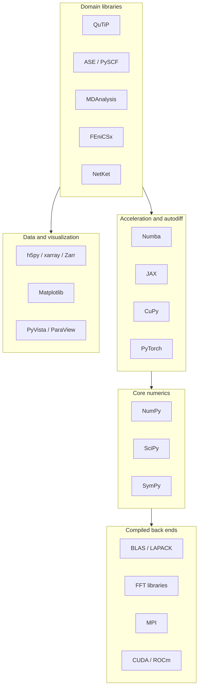
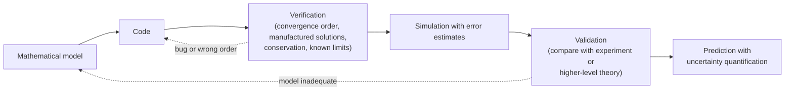

<p><a href="./">Computational Physics</a> › Visualization, Libraries &amp; Best Practices</p>

This page is a cross-cutting reference for the software side of computational physics. It covers the Python ecosystem most simulations are written in, how to keep environments and results reproducible, where performance comes from, how to store and visualize data, a set of standard analysis routines, and how to **verify and validate** a simulation so you can trust its output. The algorithms themselves are on the method pages linked from the [hub](./). Parallel and GPU performance is covered in depth on [Parallel &amp; High-Performance Computing](hpc-and-ml.html).

## The Scientific Python Stack

Most modern computational-physics work is written in Python on top of compiled libraries (C, C++, Fortran, CUDA). Python handles orchestration, while the heavy numerical work runs in optimized kernels such as BLAS/LAPACK, FFTW or pocketfft, and vendor GPU libraries.



| Library | Role | Notes |
|---|---|---|
| **NumPy** | N-dimensional arrays, vectorized math, FFT, random numbers | NumPy 2.x (since 2024) changed scalar type promotion (NEP 50) and removed old aliases such as `np.float_` and `np.Inf`. Use `np.random.default_rng()`, not the legacy `np.random.seed` API |
| **SciPy** | Integration (`solve_ivp`), optimization, sparse matrices and solvers, special functions, signal processing, `scipy.stats.qmc` | Sparse **arrays** (`csr_array`) are the recommended interface over the older `csr_matrix` |
| **SymPy** | Symbolic algebra, derivations, code generation | Useful for deriving Jacobians and checking series expansions |
| **Numba** | JIT-compiles numerical Python loops to machine code | Best for loop-heavy kernels that do not vectorize well |
| **JAX** | NumPy-like API with `jit`, `grad`, `vmap`, and GPU/TPU back ends | The basis of differentiable simulation (JAX-MD, NetKet) |
| **CuPy** | Near drop-in NumPy/SciPy replacement on NVIDIA and AMD GPUs | Custom kernels via `RawKernel` or `ElementwiseKernel` |
| **Matplotlib** | Publication-quality 2D plots and animation | The reference plotting library |

As of September 2026 the current releases are NumPy 2.5, SciPy 1.18, and Matplotlib 3.11. NumPy and SciPy now require Python 3.12 or newer.

## Environments and Reproducibility

A result you cannot regenerate is not a result. Package versions, compiler flags, BLAS back ends, and random seeds all change numerical output, sometimes only in the last bits and sometimes a great deal.

- **Pin environments with a lockfile.** [uv](https://docs.astral.sh/uv/) (`uv lock`, `uv sync`) is fast and PyPI-native. [pixi](https://pixi.sh/) or conda/mamba with conda-forge handle compiled non-Python dependencies (MPI, HDF5, CUDA toolkits, Fortran codes). Commit the lockfile alongside the code.
- **Containerize for clusters.** Apptainer (formerly Singularity) is the standard container runtime on HPC systems, where Docker is usually not allowed. Build the image from the same lockfile.
- **Record provenance with every output.** Store the code version (git commit), parameters, library versions, and seeds in the output file's metadata. Workflow managers such as Snakemake, Nextflow, and signac automate this for parameter sweeps.
- **Seed deliberately, especially in parallel.** Give every worker an *independent* stream derived from one root seed. Reusing the same seed on every MPI rank silently correlates all the replicas.

```python
import numpy as np

root = np.random.SeedSequence(20260922)            # log this number with the results
streams = [np.random.default_rng(s) for s in root.spawn(64)]   # 64 independent workers
```

Bitwise reproducibility across hardware is generally not achievable. Floating-point reductions on GPUs and multithreaded BLAS change summation order. The realistic goal is **statistical reproducibility**: results that agree within the stated error bars.

## Performance

Profile before you optimize. Most programs spend nearly all of their time in a small fraction of the code.

| Tool | Measures |
|---|---|
| `cProfile` + snakeviz | Function-level time |
| `line_profiler` | Line-by-line time in chosen functions |
| py-spy | Sampling profiler; attaches to running processes with no code changes |
| Scalene | CPU, GPU, and memory, separating Python time from native time |
| NVIDIA Nsight Systems / Compute | GPU timelines and kernel-level metrics |

The usual order of improvements is: **better algorithm** (e.g. a neighbour list instead of all pairs) → **vectorize** with NumPy → **compile** hot loops with Numba or JAX → **parallelize** or move to the GPU. Numba suits kernels with data-dependent loops, such as a pairwise potential with a cutoff:

```python
import numpy as np
from numba import njit, prange

@njit(parallel=True, fastmath=True)
def lj_energy(pos, box, rc=2.5):
    """Total Lennard-Jones energy with minimum image and cutoff (reduced units)."""
    n = pos.shape[0]
    rc2 = rc * rc
    energy = 0.0
    for i in prange(n):                     # outer loop split across threads
        for j in range(i + 1, n):
            r2 = 0.0
            for k in range(3):
                d = pos[i, k] - pos[j, k]
                d -= box * np.round(d / box)
                r2 += d * d
            if r2 < rc2:
                inv6 = 1.0 / (r2 * r2 * r2)
                energy += 4.0 * (inv6 * inv6 - inv6)   # Numba recognizes the reduction
    return energy
```

JAX takes a different approach. You write the *energy*, and automatic differentiation gives exact forces. The same function can be compiled for CPU, GPU, or TPU:

```python
import jax
import jax.numpy as jnp

def lj_energy(pos, box, rc=2.5):
    n = len(pos)
    d = pos[:, None, :] - pos[None, :, :]
    d = d - box * jnp.round(d / box)
    r2 = jnp.sum(d**2, axis=-1) + jnp.eye(n)       # avoid r = 0 on the diagonal: keeps grads finite
    inv6 = jnp.where((r2 < rc**2) & ~jnp.eye(n, dtype=bool), r2**-3, 0.0)
    return 0.5 * jnp.sum(4.0 * (inv6**2 - inv6))

forces = jax.jit(jax.grad(lambda p, box: -lj_energy(p, box)))   # F = -dE/dr
```

For MPI, CUDA kernels, the roofline model, and scaling analysis, see [Parallel &amp; High-Performance Computing](hpc-and-ml.html).

## Data Storage and I/O

Simulation output quickly outgrows text files. Use a self-describing binary format that stores metadata and units next to the arrays.

| Format | Python interface | Strengths |
|---|---|---|
| **HDF5** | h5py, PyTables | Hierarchical, chunked, compressed; parallel I/O via MPI-IO; the de facto standard for simulation output |
| **NetCDF-4** | netCDF4, xarray | HDF5 underneath plus conventions (CF) for labelled geophysical grids |
| **Zarr** (v3) | zarr, xarray | Chunked arrays as separate objects; well suited to cloud object storage and parallel writes |
| **ADIOS2** | adios2 | High-throughput I/O and in-situ streaming at extreme scale |
| **Parquet / Arrow** | pandas, polars, pyarrow | Columnar tables (event lists, parameter sweeps) |

[xarray](https://xarray.dev/) wraps these formats with *named* dimensions and coordinates (`temperature.sel(time=..., x=...)`), which removes a whole class of axis-order bugs. A minimal HDF5 layout with chunking and metadata:

```python
import h5py
import numpy as np

traj = np.zeros((1000, 256, 3), dtype=np.float32)          # (frames, atoms, xyz)
with h5py.File("run_0001.h5", "w") as f:
    pos = f.create_dataset("positions", data=traj, chunks=(1, 256, 3),
                           compression="gzip", compression_opts=4)
    pos.attrs["units"] = "sigma"
    f.attrs.update({"dt": 0.005, "temperature": 1.5, "git_commit": "abc1234"})

with h5py.File("run_0001.h5", "r") as f:
    frame = f["positions"][42]                               # reads one chunk only
```

Choose the chunk shape to match the access pattern. One frame per chunk suits frame-by-frame analysis; time-major chunks suit per-atom time series.

## Visualization

### Principles

- **Use perceptually uniform colormaps.** `viridis`, `cividis`, `magma`, and `inferno` have monotonic lightness, so equal steps in data look like equal steps in colour. Rainbow maps such as `jet` create false boundaries and hide real ones.
- **Match the colormap to the data.** Sequential maps suit magnitudes. Diverging maps (`RdBu`, `coolwarm`) centred on zero suit signed quantities such as vorticity, spin, or wavefunction phase. Cyclic maps (`twilight`) suit angles.
- **Use log scales for data spanning decades.** Use `semilogy` for spectra and convergence plots and `loglog` for power laws. The slope of a log–log convergence plot is the order of accuracy.
- **Label units and show uncertainty.** Every axis gets a quantity and a unit. Every Monte Carlo point gets an error bar.
- **Plot the conserved quantities.** An energy-versus-time panel next to every dynamics plot catches integrator and time-step problems immediately.

A typical diagnostic figure for an oscillator shows the phase portrait next to the relative energy error on a log scale:

```python
import numpy as np
import matplotlib.pyplot as plt

def leapfrog(x, v, dt, n):                                # symplectic, for H = (v^2 + x^2)/2
    xs, vs = np.empty(n), np.empty(n)
    for i in range(n):
        v -= 0.5 * dt * x
        x += dt * v
        v -= 0.5 * dt * x
        xs[i], vs[i] = x, v
    return xs, vs

def euler(x, v, dt, n):                                   # non-symplectic, for contrast
    xs, vs = np.empty(n), np.empty(n)
    for i in range(n):
        x, v = x + dt * v, v - dt * x
        xs[i], vs[i] = x, v
    return xs, vs

fig, (ax1, ax2) = plt.subplots(1, 2, figsize=(10, 4), layout="constrained")
for name, method in [("leapfrog", leapfrog), ("explicit Euler", euler)]:
    x, v = method(1.0, 0.0, dt=0.05, n=2000)
    E = 0.5 * (x**2 + v**2)
    ax1.plot(x, v, lw=0.8, label=name)
    ax2.semilogy(np.arange(len(E)) * 0.05, np.abs(E - 0.5) / 0.5, label=name)
ax1.set(xlabel="position $x$", ylabel="velocity $v$", title="Phase portrait", aspect="equal")
ax2.set(xlabel="time", ylabel="relative energy error", title="Energy conservation")
ax1.legend()
fig.savefig("diagnostics.png", dpi=200)
```

Explicit Euler spirals outward and its energy error grows without bound. Leapfrog's error stays bounded below $10^{-3}$ and oscillates, which is the signature of a symplectic integrator. For time-dependent fields, `matplotlib.animation.FuncAnimation` with `blit=True` updates only the changed artists, and `ani.save("field.mp4")` writes video through ffmpeg.

### Tools by task

| Task | Tools |
|---|---|
| 2D plots, publication figures | Matplotlib (with `layout="constrained"`), seaborn for statistical plots |
| Interactive exploration in notebooks | Plotly, Bokeh, HoloViews/hvPlot |
| 3D fields, meshes, isosurfaces | [PyVista](https://pyvista.org/) (Pythonic VTK), ParaView and VisIt (large and parallel data) |
| Particles and molecular trajectories | OVITO, VMD, nglview (in Jupyter) |
| Very large simulations | In-situ visualization (ParaView Catalyst, Ascent) so full data never has to be written to disk |

## Analysis Toolkit

Several routines come up again and again in simulation analysis. Straightforward loop implementations are $O(N^2)$ and far too slow, so use the vectorized or FFT-based forms below.

### Autocorrelation and power spectrum

The autocorrelation function $C(t) = \langle A(0) A(t) \rangle$ describes memory in a time series. It gives transport coefficients through Green–Kubo relations and the statistical efficiency of Monte Carlo chains. By the Wiener–Khinchin theorem it is the inverse Fourier transform of the power spectrum, so an FFT computes it in $O(N \log N)$:

```python
import numpy as np
from scipy import signal

def autocorrelation(a):
    """Normalized autocorrelation via FFT, O(N log N)."""
    a = np.asarray(a, float) - np.mean(a)
    n = len(a)
    spec = np.fft.rfft(a, n=2 * n)                 # zero-pad to avoid circular wrap-around
    acf = np.fft.irfft(spec * np.conj(spec))[:n]
    return acf / acf[0]

def power_spectrum(a, dt):
    """Welch's method: averaged, windowed periodograms (lower variance than one FFT)."""
    return signal.welch(a, fs=1.0 / dt, nperseg=min(len(a), 4096))
```

Error bars on means of correlated data need the integrated autocorrelation time; see [error analysis for MCMC](monte-carlo-and-md.html#error-analysis-for-correlated-samples).

### Static structure factor

For $N$ particles, $S(\mathbf{k}) = \frac{1}{N} \left\lvert \sum_j e^{i \mathbf{k} \cdot \mathbf{r}_j} \right\rvert^2$ is what X-ray and neutron scattering measure. It is the Fourier-space partner of the radial distribution function $g(r)$. In a periodic box of side $L$, only wavevectors $\mathbf{k} = 2\pi \mathbf{n}/L$ with integer $\mathbf{n}$ are valid.

```python
def structure_factor(positions, k_vectors):
    """S(k) for each row of k_vectors; positions (N, 3), k_vectors (M, 3)."""
    rho_k = np.exp(1j * positions @ k_vectors.T).sum(axis=0)     # (M,)
    return np.abs(rho_k) ** 2 / len(positions)
```

### Largest Lyapunov exponent

The largest Lyapunov exponent $\lambda_1$ measures how fast nearby trajectories separate, $\delta(t) \sim \delta_0 e^{\lambda_1 t}$. A positive $\lambda_1$ is the standard test for chaos. The **Benettin algorithm** evolves a reference trajectory and a nearby partner, measures their separation at regular intervals, logs the growth, and rescales the separation back to $\delta_0$ before it saturates:

```python
import numpy as np
from scipy.integrate import solve_ivp

def lorenz(t, s, sigma=10.0, rho=28.0, beta=8.0 / 3.0):
    x, y, z = s
    return [sigma * (y - x), x * (rho - z) - y, x * y - beta * z]

def largest_lyapunov(f, s0, dt=0.01, n_renorm=20_000, d0=1e-8, n_transient=1_000, seed=0):
    def advance(s):
        return solve_ivp(f, (0, dt), s, method="DOP853", rtol=1e-10, atol=1e-12).y[:, -1]
    s = np.asarray(s0, float)
    for _ in range(n_transient):                   # settle onto the attractor
        s = advance(s)
    u = np.random.default_rng(seed).standard_normal(s.size)
    partner = s + d0 * u / np.linalg.norm(u)
    log_growth = 0.0
    for _ in range(n_renorm):
        s, partner = advance(s), advance(partner)
        d = np.linalg.norm(partner - s)
        log_growth += np.log(d / d0)
        partner = s + (d0 / d) * (partner - s)     # renormalize the separation
    return log_growth / (n_renorm * dt)

print(largest_lyapunov(lorenz, [1.0, 1.0, 1.0]))   # approaches ~0.906 for the Lorenz attractor
```

The estimate converges slowly, as roughly $1/\sqrt{T}$ in total integration time $T$. The full spectrum needs the tangent-space (Jacobian) dynamics with repeated QR re-orthonormalization.

## Domain Libraries

| Domain | Library | What it provides |
|---|---|---|
| Open quantum systems | [QuTiP](https://qutip.org/) 5 | States, operators, master and stochastic equations, optimal control |
| Many-body quantum | NetKet, QuSpin, TeNPy, ITensor | Neural quantum states, exact diagonalization, tensor networks |
| Electronic structure | PySCF, GPAW, Quantum ESPRESSO, CP2K, VASP | DFT and wavefunction methods (see [Quantum Methods](quantum-methods.html#density-functional-theory-dft)) |
| Atomistic workflows | [ASE](https://wiki.fysik.dtu.dk/ase/), pymatgen | Structure building, calculators, optimizers, MD, and a common interface to ML potentials |
| Molecular dynamics | LAMMPS, GROMACS, OpenMM, JAX-MD | Production MD engines (see [MD software](monte-carlo-and-md.html#production-md-software)) |
| Trajectory analysis | MDAnalysis, MDTraj | Selections, RDFs, RMSD, hydrogen bonds, diffusion |
| PDEs | FEniCSx (DOLFINx), Firedrake, deal.II, Dedalus, PETSc/petsc4py | Finite elements, spectral methods, scalable solvers |
| Differential equations in Julia | DifferentialEquations.jl | Very broad ODE/SDE/DAE solver suite; Julia is a strong alternative to Python for new numerical code |

### QuTiP: a damped harmonic oscillator

QuTiP 5 (2024) rewrote the internals around a pluggable data layer (dense, sparse CSR, and GPU back ends) and a unified solver interface. In current releases, `e_ops` and `options` are keyword-only arguments. A coherent state in a lossy cavity, with $\langle n \rangle(t) = \lvert\alpha\rvert^2 e^{-\kappa t}$:

```python
import numpy as np
import qutip as qt

N = 20                                           # Fock-space truncation
a = qt.destroy(N)
H = a.dag() * a                                  # harmonic oscillator, hbar*omega = 1
psi0 = qt.coherent(N, 2.0)                       # |alpha = 2>, <n> = 4
times = np.linspace(0, 10, 200)
kappa = 0.1                                      # photon-loss rate

result = qt.mesolve(H, psi0, times, c_ops=[np.sqrt(kappa) * a], e_ops=[a.dag() * a])
n_t = result.expect[0]                           # n_t[-1] ~ 4 exp(-1) = 1.47
```

### MDAnalysis: radial distribution function

```python
import MDAnalysis as mda
from MDAnalysis.analysis import rdf

u = mda.Universe("topology.pdb", "trajectory.dcd")
oxygen = u.select_atoms("name OW")
g = rdf.InterRDF(oxygen, oxygen, nbins=150, range=(0.0, 12.0), exclusion_block=(1, 1))
g.run()
r, g_r = g.results.bins, g.results.rdf           # results live under .results since 2.0
```

### FEniCSx: the Poisson equation

The legacy `fenics`/`dolfin` package is no longer developed. Its successor, **FEniCSx** (DOLFINx with UFL and Basix), is MPI-parallel from the ground up and has a different API. Code written for legacy FEniCS (`UnitSquareMesh`, `FunctionSpace`, `Expression`, `solve(a == L, ...)`) will not run on it. The same problem as the classic tutorial, solving $-\nabla^2 u = -6$ with $u = 1 + x^2 + 2y^2$ on the boundary:

```python
from mpi4py import MPI
import ufl
from dolfinx import fem, mesh
from dolfinx.fem.petsc import LinearProblem

domain = mesh.create_unit_square(MPI.COMM_WORLD, 32, 32)
V = fem.functionspace(domain, ("Lagrange", 1))

u_D = fem.Function(V)
u_D.interpolate(lambda x: 1 + x[0] ** 2 + 2 * x[1] ** 2)
tdim = domain.topology.dim
domain.topology.create_connectivity(tdim - 1, tdim)
boundary_facets = mesh.exterior_facet_indices(domain.topology)
bc = fem.dirichletbc(u_D, fem.locate_dofs_topological(V, tdim - 1, boundary_facets))

u, v = ufl.TrialFunction(V), ufl.TestFunction(V)
f = fem.Constant(domain, -6.0)
a = ufl.dot(ufl.grad(u), ufl.grad(v)) * ufl.dx
L = f * v * ufl.dx

problem = LinearProblem(a, L, bcs=[bc], petsc_options_prefix="poisson",
                        petsc_options={"ksp_type": "preonly", "pc_type": "lu"})
uh = problem.solve()
```

DOLFINx changes its API between minor releases (0.10 made `petsc_options_prefix` required, for example). Pin the version and check the [FEniCSx tutorial](https://jsdokken.com/dolfinx-tutorial/) for the release you use. The theory behind the method is on [Finite Elements &amp; Fluid Dynamics](fem-and-cfd.html).

## Verification and Validation

Trusting a simulation takes two separate questions, and they are often confused:

- **Verification**: *are we solving the equations right?* Does the code solve its mathematical model to the claimed accuracy?
- **Validation**: *are we solving the right equations?* Does the model describe reality well enough for the intended use?

Verification must come first. Comparing an unverified code against experiment can hide a bug behind a cancelling modelling error.



### Verification checklist

| Check | What it catches |
|---|---|
| **Observed order of convergence**: halve $h$ or $\Delta t$ and confirm the error falls as $h^p$ with the method's design order $p$ | Bugs in stencils, boundary conditions, and time-stepping; the single most powerful test |
| **Method of manufactured solutions**: pick an analytic $u$, derive the source term that makes it exact, and check convergence to it | Any equation, including nonlinear ones with no known solution |
| **Conservation laws**: energy, momentum, mass, charge, norm | Integrator errors, wrong forces, leaking boundaries |
| **Known limits and exact solutions**: harmonic oscillator, Onsager's Ising solution, Poiseuille flow | Gross modelling or unit errors |
| **Symmetry tests**: rotate, translate, or permute the input; the output should transform accordingly | Indexing and sign errors, broken periodic images |
| **Dimensional analysis and units**: nondimensionalize, or use a units library such as `pint` | Mixed unit systems (Å vs bohr, eV vs Ha) |
| **Statistical checks** for stochastic codes: compare means within error bars across seeds, run lengths, and independent codes | Undersampling, correlated random streams |

Estimating the observed order takes a few lines, and it belongs in the test suite:

```python
import numpy as np

def observed_order(solve, exact, hs):
    """p from errors at successively refined step sizes: p = log(e1/e2) / log(h1/h2)."""
    errs = np.array([abs(solve(h) - exact) for h in hs])
    return np.log(errs[:-1] / errs[1:]) / np.log(np.asarray(hs[:-1]) / np.asarray(hs[1:]))

central = lambda h: (np.sin(1 + h) - np.sin(1 - h)) / (2 * h)       # d/dx sin at x = 1
print(observed_order(central, np.cos(1.0), [0.1, 0.05, 0.025, 0.0125]))   # [2.0 2.0 2.0]
```

Put these checks in an automated test suite (`pytest`, with `np.testing.assert_allclose` and explicit tolerances) and run it in continuous integration. Floating-point results should be compared with tolerances, never with `==`. Tolerances should reflect the method's truncation error, not machine epsilon.

## Further Reading

**Books**

- M. Newman, *Computational Physics* (2013): an accessible Python-based introduction.
- J. M. Thijssen, *Computational Physics*, 2nd ed. (2007): methods for quantum and statistical physics.
- D. Frenkel and B. Smit, *Understanding Molecular Simulation*, 3rd ed. (2023): the standard MC and MD reference.
- M. P. Allen and D. J. Tildesley, *Computer Simulation of Liquids*, 2nd ed. (2017).
- D. P. Landau and K. Binder, *A Guide to Monte Carlo Simulations in Statistical Physics*.
- R. M. Martin, *Electronic Structure: Basic Theory and Practical Methods*, 2nd ed. (2020).
- W. H. Press et al., *Numerical Recipes*, 3rd ed. (2007): broad algorithm coverage; use library implementations in practice.

**Online**

- [Scientific Python lectures](https://lectures.scientific-python.org/): NumPy, SciPy, and Matplotlib in depth.
- [FEniCSx tutorial](https://jsdokken.com/dolfinx-tutorial/), [QuTiP documentation](https://qutip.org/documentation), and [PySCF user guide](https://pyscf.org/user.html).
- Software Carpentry and the [Better Scientific Software](https://bssw.io/) community for testing, version control, and reproducibility practices.

---

*Previous: [Parallel Computing &amp; Machine Learning](hpc-and-ml.html) · Next: [Computational Physics Hub](./)*

## See Also

- [Computational Physics Hub](./): the overview and numerical-methods foundations (integration, ODEs, PDEs).
- [Parallel &amp; High-Performance Computing](hpc-and-ml.html): MPI, GPUs, and the roofline model.
- [Finite Elements &amp; Fluid Dynamics](fem-and-cfd.html): the finite-element method behind FEniCSx.
- [Monte Carlo &amp; Molecular Dynamics](monte-carlo-and-md.html): the simulations whose output these tools analyse.
- [Statistical Mechanics](../statistical-mechanics/): the theory behind correlation functions and structure factors.
