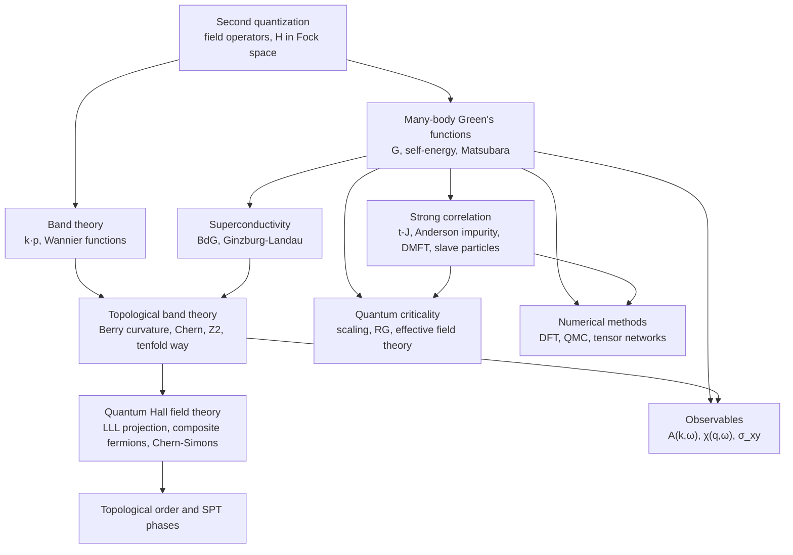
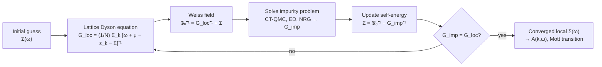

[Condensed Matter Physics](./) &raquo; Graduate-Level Formalism

This page is the theory-first companion to the [Condensed Matter hub](./). It
collects the graduate-level machinery that the narrative pages use informally:
second quantization and many-body Green's functions; band theory beyond the
nearly-free-electron picture, including the topological invariants of band
insulators; the field theories of superconductors and quantum Hall fluids; the
methods for strongly correlated electrons; topological order; the
renormalization-group theory of quantum phase transitions; and the numerical
methods that make all of this quantitative. Each section states definitions and
key results compactly and in standard notation; derivations are left to the
references at the end. The physical phenomena themselves are treated on
[Superconductivity, Quantum Hall & Topological Phases](emergent-phases.html) and
[Disorder & Localization](disorder-and-localization.html), and the probes that
test the theory on [Experimental Techniques](experimental-techniques.html).

**Conventions.** $\hbar = k_B = 1$ in the Green's-function, correlated-electron,
and field-theory sections unless a formula is written out in full; $\beta = 1/T$;
$\xi_{\mathbf{k}} = \epsilon_{\mathbf{k}} - \mu$ is the band energy measured from
the chemical potential; $0^+$ is a positive infinitesimal.

## How the pieces fit together

Most of the formalism below computes one of a small number of objects: a
single-particle Green's function (and hence the spectral function measured by
photoemission and tunneling), a two-particle response function (measured by
scattering and transport), or a topological invariant (measured by quantized
responses). The diagram shows the dependencies.



## Second quantization

Second quantization describes a many-fermion system in Fock space, with
antisymmetry built into the operator algebra instead of into Slater determinants.
Given a complete single-particle basis $\phi_\alpha(\mathbf{r})$ with fermion
operators $c_\alpha$, the field operators are

$$\psi_\sigma(\mathbf{r}) = \sum_\alpha \phi_\alpha(\mathbf{r})\, c_{\alpha\sigma}, \qquad
\psi_\sigma^\dagger(\mathbf{r}) = \sum_\alpha \phi_\alpha^*(\mathbf{r})\, c_{\alpha\sigma}^\dagger,$$

obeying canonical anticommutation relations

$$\{\psi_\sigma(\mathbf{r}), \psi_{\sigma'}^\dagger(\mathbf{r}')\} = \delta_{\sigma\sigma'}\,\delta(\mathbf{r} - \mathbf{r}'), \qquad
\{\psi_\sigma(\mathbf{r}), \psi_{\sigma'}(\mathbf{r}')\} = 0 .$$

A system of particles in an external potential $V(\mathbf{r})$ interacting through
a two-body potential $U(\mathbf{r} - \mathbf{r}')$ has the Hamiltonian

$$H = \sum_\sigma \int d\mathbf{r}\, \psi_\sigma^\dagger(\mathbf{r})\left[-\frac{\hbar^2\nabla^2}{2m} + V(\mathbf{r})\right]\psi_\sigma(\mathbf{r})
+ \frac{1}{2}\sum_{\sigma\sigma'}\int d\mathbf{r}\, d\mathbf{r}'\, \psi_\sigma^\dagger(\mathbf{r})\psi_{\sigma'}^\dagger(\mathbf{r}')\,U(\mathbf{r}-\mathbf{r}')\,\psi_{\sigma'}(\mathbf{r}')\psi_\sigma(\mathbf{r}).$$

Note the operator ordering in the interaction term: annihilating in the reverse
order of creation removes the self-interaction. In a discrete basis (plane waves,
Wannier orbitals) the same Hamiltonian reads

$$H = \sum_{\alpha\beta} t_{\alpha\beta}\, c_\alpha^\dagger c_\beta + \frac{1}{2}\sum_{\alpha\beta\gamma\delta} V_{\alpha\beta\gamma\delta}\, c_\alpha^\dagger c_\beta^\dagger c_\delta c_\gamma ,$$

and every lattice model on this page (Hubbard, t-J, Anderson, Kitaev) is a
truncation of it to a few orbitals and short-range matrix elements.

## Many-body Green's functions

### Definitions

The time-ordered, retarded, and imaginary-time single-particle Green's functions
are

$$G(\mathbf{r}t;\mathbf{r}'t') = -i\langle T\,\psi(\mathbf{r},t)\psi^\dagger(\mathbf{r}',t')\rangle, \qquad
G^R(\mathbf{r}t;\mathbf{r}'t') = -i\,\theta(t-t')\langle\{\psi(\mathbf{r},t),\psi^\dagger(\mathbf{r}',t')\}\rangle,$$

$$\mathcal{G}(\mathbf{r}\tau;\mathbf{r}'\tau') = -\langle T_\tau\,\psi(\mathbf{r},\tau)\psi^\dagger(\mathbf{r}',\tau')\rangle .$$

$G^R$ is the causal response (analytic in the upper half $\omega$-plane) and is
what experiments measure; the time-ordered $G$ is what zero-temperature
perturbation theory produces; $\mathcal{G}$ is what finite-temperature
perturbation theory and quantum Monte Carlo produce.

### Spectral representation

Inserting a complete set of many-body eigenstates gives the Lehmann
representation. At $T = 0$, with energies measured from $\mu$,

$$G^R(\mathbf{k},\omega) = \sum_n\left[\frac{|\langle n|c_{\mathbf{k}}^\dagger|0\rangle|^2}{\omega - (E_n - E_0) + i0^+} + \frac{|\langle n|c_{\mathbf{k}}|0\rangle|^2}{\omega + (E_n - E_0) + i0^+}\right].$$

The **spectral function**

$$A(\mathbf{k},\omega) = -2\,\text{Im}\,G^R(\mathbf{k},\omega), \qquad \int\frac{d\omega}{2\pi}A(\mathbf{k},\omega) = 1,$$

is the probability density for adding ($\omega > 0$) or removing ($\omega < 0$) an
electron of momentum $\mathbf{k}$ with energy $\omega$. Its occupied part,
$f(\omega)A(\mathbf{k},\omega)$, is what ARPES measures; its momentum integral is
the density of states seen by STM.

### Self-energy and quasiparticles

All interaction effects in $G$ are collected in the self-energy $\Sigma$ through
the **Dyson equation**

$$G = G_0 + G_0\,\Sigma\,G \quad\Longleftrightarrow\quad G^{-1}(\mathbf{k},\omega) = \omega - \xi_{\mathbf{k}} - \Sigma(\mathbf{k},\omega).$$

If $\Sigma$ is small and smooth near the Fermi level, $G$ has a pole close to the
real axis and can be written as a coherent quasiparticle part plus an incoherent
background:

$$G^R(\mathbf{k},\omega) \approx \frac{Z_{\mathbf{k}}}{\omega - \tilde\xi_{\mathbf{k}} + i\Gamma_{\mathbf{k}}} + G_{\text{inc}}, \qquad
Z_{\mathbf{k}} = \left[1 - \frac{\partial\,\text{Re}\,\Sigma(\mathbf{k},\omega)}{\partial\omega}\right]^{-1}_{\omega = \tilde\xi_{\mathbf{k}}} .$$

The quasiparticle residue $0 < Z \le 1$ is the weight of the coherent peak and
equals the jump in the momentum distribution $n_{\mathbf{k}}$ at $k_F$; the mass
is renormalized as $m^\ast/m = 1/Z$ for a momentum-independent self-energy; and the
lifetime is $1/(2\Gamma)$, with $\Gamma \propto \omega^2 + \pi^2 T^2$ in a Fermi
liquid. A **non-Fermi liquid** is a metal in which this structure fails: $Z \to 0$
at the Fermi surface, as in the marginal Fermi liquid
$\text{Im}\,\Sigma \propto \max(|\omega|, T)$ used to describe the strange-metal
phase of cuprates. The Fermi-liquid side is developed on
[Metals & Magnetism](metals-and-magnetism.html).

### Matsubara formalism

At finite temperature $\mathcal{G}(\tau)$ is (anti)periodic on $\tau \in [0,\beta)$,
so it has a Fourier series over discrete **Matsubara frequencies**

$$\mathcal{G}(i\omega_n) = \int_0^\beta d\tau\, e^{i\omega_n\tau}\,\mathcal{G}(\tau), \qquad
\omega_n = \begin{cases}(2n+1)\pi/\beta & \text{fermions}\\ 2n\pi/\beta & \text{bosons}\end{cases}$$

The free fermion propagator is $\mathcal{G}_0(\mathbf{k}, i\omega_n) = 1/(i\omega_n - \xi_{\mathbf{k}})$,
and the Feynman rules are identical to $T = 0$ except that frequency integrals
become sums $T\sum_n$. Real-frequency quantities follow by **analytic
continuation** $i\omega_n \to \omega + i0^+$, which is exact for analytic
expressions but ill-conditioned for numerical data (it is usually done with
maximum-entropy or related regularized inversions).

### Linear response

Two-particle correlation functions describe the response to weak external fields.
The Kubo formula gives the retarded response of an observable $A$ to a
perturbation $-B\,F(t)$:

$$\chi_{AB}(t) = -\frac{i}{\hbar}\,\theta(t)\,\langle[A(t), B(0)]\rangle .$$

Conductivity (current-current), magnetic susceptibility (spin-spin), and the
dynamic structure factor measured by neutron and X-ray scattering are all of this
form. The fluctuation-dissipation theorem relates the absorptive part
$\chi''(\mathbf{q},\omega)$ to the scattering cross-section,
$S(\mathbf{q},\omega) = 2\,[1 + n_B(\omega)]\,\chi''(\mathbf{q},\omega)$.

## Band theory beyond free electrons

### The k·p method

Writing a Bloch state as $\psi_{n\mathbf{k}} = e^{i\mathbf{k}\cdot\mathbf{r}}u_{n\mathbf{k}}$
turns the crystal Hamiltonian into one for the periodic part,

$$H_{\mathbf{k}} = \frac{p^2}{2m_0} + V(\mathbf{r}) + \frac{\hbar}{m_0}\,\mathbf{k}\cdot\mathbf{p} + \frac{\hbar^2k^2}{2m_0},$$

and $\frac{\hbar}{m_0}\mathbf{k}\cdot\mathbf{p}$ can be treated as a perturbation
about a band extremum (taken at $\mathbf{k} = 0$). Second-order perturbation
theory gives the effective-mass tensor of band $n$:

$$\frac{m_0}{m^*_{ij}} = \delta_{ij} + \frac{2}{m_0}\sum_{m \neq n}\frac{\langle u_{n0}|p_i|u_{m0}\rangle\langle u_{m0}|p_j|u_{n0}\rangle}{E_n(0) - E_m(0)} .$$

Nearby bands with large momentum matrix elements therefore make masses light. The
**Kane model** keeps the coupled conduction and valence bands exactly. In its
simplest two-band form, with interband matrix element $P$ (units of energy times
length) and gap $E_g = E_c - E_v$,

$$H(\mathbf{k}) = \begin{pmatrix} E_c + \dfrac{\hbar^2k^2}{2m_0} & P k \\ P k & E_v + \dfrac{\hbar^2k^2}{2m_0}\end{pmatrix}, \qquad
E_\pm(\mathbf{k}) \approx \frac{E_c + E_v}{2} \pm \sqrt{\frac{E_g^2}{4} + P^2k^2},$$

so $m^\ast \approx \hbar^2E_g/(2P^2)$ near the band edge: narrow-gap semiconductors
(InSb, HgCdTe) have very light carriers and strongly non-parabolic bands. The
full 8-band Kane model adds spin-orbit coupling and underlies the band-inversion
mechanism of HgTe quantum wells.

### Wannier functions

Wannier functions are the lattice Fourier transforms of Bloch states,

$$w_n(\mathbf{r} - \mathbf{R}) = \frac{V_{\text{cell}}}{(2\pi)^3}\int_{\text{BZ}} d\mathbf{k}\; e^{-i\mathbf{k}\cdot\mathbf{R}}\,\psi_{n\mathbf{k}}(\mathbf{r}),$$

and give a localized orbital basis in which tight-binding and Hubbard models are
defined. They are not unique: any $\mathbf{k}$-dependent unitary mixing
$|u_{n\mathbf{k}}\rangle \to \sum_m U_{mn}(\mathbf{k})|u_{m\mathbf{k}}\rangle$
of a group of bands gives valid Wannier functions. **Maximally localized Wannier
functions** (Marzari and Vanderbilt) fix this gauge freedom by minimizing the
total spread

$$\Omega = \sum_n\left[\langle w_n|r^2|w_n\rangle - |\langle w_n|\mathbf{r}|w_n\rangle|^2\right].$$

Wannier-function centres are the modern theory of electric polarization (their
sum is the Berry phase of the occupied bands), and **exponentially localized
Wannier functions exist if and only if the bands are topologically trivial**: a
nonzero Chern number is an obstruction to Wannierization. This is the link between
band theory and topology developed next. In practice Wannier functions are
produced from DFT calculations by codes such as Wannier90 and used to build
downfolded models for DMFT and transport.

### Topological band theory

For a set of occupied bands, the **Berry connection** and **Berry curvature** are

$$\mathbf{A}_n(\mathbf{k}) = i\langle u_{n\mathbf{k}}|\nabla_{\mathbf{k}}u_{n\mathbf{k}}\rangle, \qquad
\boldsymbol{\Omega}_n(\mathbf{k}) = \nabla_{\mathbf{k}}\times\mathbf{A}_n = i\sum_{m\neq n}\frac{\langle u_{n\mathbf{k}}|\nabla_{\mathbf{k}}H|u_{m\mathbf{k}}\rangle\times\langle u_{m\mathbf{k}}|\nabla_{\mathbf{k}}H|u_{n\mathbf{k}}\rangle}{(E_n - E_m)^2}.$$

The second form shows that curvature concentrates where bands nearly touch. Berry
curvature enters semiclassical dynamics as an anomalous velocity,
$\dot{\mathbf{r}} = \hbar^{-1}\nabla_{\mathbf{k}}E_n - \dot{\mathbf{k}}\times\boldsymbol{\Omega}_n$,
which produces the intrinsic anomalous Hall effect.

**Chern number and the TKNN formula.** In two dimensions the integral of the
curvature over the closed Brillouin zone is an integer, the Chern number, and the
Kubo formula for the Hall conductance of a band insulator reduces to

$$C_n = \frac{1}{2\pi}\int_{\text{BZ}} d^2k\;\Omega_n^z(\mathbf{k}) \in \mathbb{Z}, \qquad
\sigma_{xy} = \frac{e^2}{h}\sum_{n\,\in\,\text{occ}} C_n .$$

This is the TKNN result (Thouless, Kohmoto, Nightingale, den Nijs, 1982), which
explains the integer quantum Hall effect and, with Haldane's 1988 lattice model,
shows that quantized Hall conductance does not require a net magnetic field
(Chern insulators).

**The Z2 invariant.** With time-reversal symmetry ($\Theta^2 = -1$ for spin-1/2)
the total Chern number vanishes, but a $\mathbb{Z}_2$ invariant survives. Fu and
Kane expressed it through the sewing matrix
$w_{mn}(\mathbf{k}) = \langle u_{m,-\mathbf{k}}|\Theta|u_{n\mathbf{k}}\rangle$,
which is antisymmetric at the time-reversal-invariant momenta $\Gamma_i$:

$$(-1)^{\nu} = \prod_{i}\frac{\text{Pf}\,[w(\Gamma_i)]}{\sqrt{\det[w(\Gamma_i)]}},$$

with the product over the 4 TRIM in 2D or the 8 TRIM in 3D (the latter gives the
strong index $\nu_0$; products over TRIM in a plane give the three weak indices).
If the crystal also has inversion symmetry the formula simplifies to a product of
parity eigenvalues $\xi_{2m}(\Gamma_i) = \pm 1$ of the occupied Kramers pairs,

$$(-1)^{\nu_0} = \prod_{i=1}^{8}\prod_{m=1}^{N}\xi_{2m}(\Gamma_i),$$

which is how Bi$_{1-x}$Sb$_x$ and Bi$_2$Se$_3$ were first identified as
topological insulators.

**The tenfold way.** For non-interacting gapped fermions the possible
invariants are fixed by the dimension and by the presence or absence of three
antiunitary or chiral symmetries: time reversal $T$, particle-hole $C$, and their
product, chiral (sublattice) symmetry $S$. The Altland-Zirnbauer classes and
their invariants (the "periodic table" of Kitaev and Schnyder-Ryu-Furusaki-Ludwig)
are:

| Class | $T$ | $C$ | $S$ | $d=1$ | $d=2$ | $d=3$ | Example |
|---|---|---|---|---|---|---|---|
| A | 0 | 0 | 0 | 0 | $\mathbb{Z}$ | 0 | Quantum Hall, Chern insulator |
| AIII | 0 | 0 | 1 | $\mathbb{Z}$ | 0 | $\mathbb{Z}$ | Chiral-symmetric chains |
| AI | +1 | 0 | 0 | 0 | 0 | 0 | Spinless, time-reversal symmetric |
| BDI | +1 | +1 | 1 | $\mathbb{Z}$ | 0 | 0 | SSH chain, Kitaev chain with $T$ |
| D | 0 | +1 | 0 | $\mathbb{Z}_2$ | $\mathbb{Z}$ | 0 | Kitaev chain, $p+ip$ superconductor |
| DIII | $-1$ | +1 | 1 | $\mathbb{Z}_2$ | $\mathbb{Z}_2$ | $\mathbb{Z}$ | $^3$He-B |
| AII | $-1$ | 0 | 0 | 0 | $\mathbb{Z}_2$ | $\mathbb{Z}_2$ | 2D and 3D topological insulators |
| CII | $-1$ | $-1$ | 1 | $2\mathbb{Z}$ | 0 | $\mathbb{Z}_2$ | |
| C | 0 | $-1$ | 0 | 0 | $2\mathbb{Z}$ | 0 | $d+id$ superconductor |
| CI | +1 | $-1$ | 1 | 0 | 0 | $2\mathbb{Z}$ | |

($\pm 1$ gives the square of the antiunitary operator; 0 means the symmetry is
absent.) The table covers only internal symmetries. Crystalline symmetries
(mirrors, rotations, glides) add many more **topological crystalline** phases,
including higher-order phases with protected corner or hinge states. **Topological
quantum chemistry** and the related **symmetry-indicator** method (2017 onward)
diagnose band topology from the symmetry labels of Bloch states at high-symmetry
momenta alone, which made high-throughput searches of materials databases
possible; those surveys found that topological bands are common rather than
exotic.

## Superconductivity formalism

### Bogoliubov-de Gennes formalism

Mean-field pairing theory is written in the doubled (Nambu) space of particles and
holes. With $\Psi_{\mathbf{k}} = (c_{\mathbf{k}\uparrow}, c_{\mathbf{k}\downarrow}, c_{-\mathbf{k}\uparrow}^\dagger, c_{-\mathbf{k}\downarrow}^\dagger)^T$,

$$H = \frac{1}{2}\sum_{\mathbf{k}}\Psi_{\mathbf{k}}^\dagger H_{\text{BdG}}(\mathbf{k})\Psi_{\mathbf{k}}, \qquad
H_{\text{BdG}}(\mathbf{k}) = \begin{pmatrix} h(\mathbf{k}) & \Delta(\mathbf{k}) \\ \Delta^\dagger(\mathbf{k}) & -h^T(-\mathbf{k})\end{pmatrix},$$

where $h$ is the normal-state Bloch Hamiltonian and the $2\times 2$ gap matrix
satisfies $\Delta^T(\mathbf{k}) = -\Delta(-\mathbf{k})$ by Fermi statistics. The
doubling builds in a particle-hole symmetry,

$$\tau_x H_{\text{BdG}}^*(\mathbf{k})\,\tau_x = -H_{\text{BdG}}(-\mathbf{k}),$$

so eigenvalues come in $\pm E$ pairs. This is the symmetry $C$ of the tenfold way,
and the reason a zero-energy BdG state can be its own antiparticle (a Majorana
mode). For spin-singlet pairing in a single band the problem reduces to the
reduced Nambu spinor $(c_{\mathbf{k}\uparrow}, c_{-\mathbf{k}\downarrow}^\dagger)$:

$$H_{\mathbf{k}} = \begin{pmatrix}\xi_{\mathbf{k}} & \Delta_{\mathbf{k}}\\ \Delta_{\mathbf{k}}^* & -\xi_{\mathbf{k}}\end{pmatrix}, \qquad
E_{\mathbf{k}} = \pm\sqrt{\xi_{\mathbf{k}}^2 + |\Delta_{\mathbf{k}}|^2},$$

with $\Delta_{\mathbf{k}}$ determined self-consistently by the BCS gap equation
(see [Emergent Phases](emergent-phases.html#bcs-theory)). In real space the same
structure, the BdG equations, handles vortices, interfaces, and Andreev bound
states.

### Ginzburg-Landau theory

Near $T_c$ the free energy is expanded in a complex order parameter $\psi(\mathbf{r})$
coupled minimally to the vector potential, with pair charge $e^\ast = 2e$ and mass
$m^\ast$ (conventionally $2m$):

$$F = \int d^3r\left[\alpha|\psi|^2 + \frac{\beta}{2}|\psi|^4 + \frac{1}{2m^*}\left|(-i\hbar\nabla - e^*\mathbf{A})\psi\right|^2 + \frac{(\nabla\times\mathbf{A})^2}{2\mu_0}\right], \qquad \alpha \propto (T - T_c).$$

Varying with respect to $\psi^\ast$ and $\mathbf{A}$ gives the two GL equations:

$$\alpha\psi + \beta|\psi|^2\psi + \frac{1}{2m^*}\left(-i\hbar\nabla - e^*\mathbf{A}\right)^2\psi = 0,$$

$$\mathbf{j} = \frac{e^*\hbar}{2m^* i}\left(\psi^*\nabla\psi - \psi\nabla\psi^*\right) - \frac{e^{*2}}{m^*}|\psi|^2\mathbf{A}.$$

The two length scales are the **coherence length** and the **penetration depth**,

$$\xi = \frac{\hbar}{\sqrt{2m^*|\alpha|}}, \qquad \lambda = \sqrt{\frac{m^*}{\mu_0 e^{*2}|\psi_0|^2}}, \qquad |\psi_0|^2 = \frac{|\alpha|}{\beta},$$

both diverging as $(T_c - T)^{-1/2}$, so their ratio $\kappa = \lambda/\xi$ is
nearly temperature independent. $\kappa < 1/\sqrt{2}$ gives a type I
superconductor (positive normal-superconductor surface energy); $\kappa > 1/\sqrt{2}$
gives type II, which admits Abrikosov vortices each carrying one flux quantum
$\Phi_0 = h/2e$ between $H_{c1}$ and $H_{c2} = \Phi_0/(2\pi\mu_0\xi^2)$.

### Josephson effects

Two superconductors coupled through a weak link carry a supercurrent set by the
gauge-invariant phase difference $\varphi$:

$$I = I_c\sin\varphi, \qquad \frac{d\varphi}{dt} = \frac{2eV}{\hbar}.$$

A real junction is modelled by the **resistively and capacitively shunted
junction** (RCSJ): a Josephson element in parallel with a resistance $R$ and
capacitance $C$. Current conservation gives

$$\frac{\hbar C}{2e}\frac{d^2\varphi}{dt^2} + \frac{\hbar}{2eR}\frac{d\varphi}{dt} + I_c\sin\varphi = I,$$

the equation of a damped particle in the tilted-washboard potential
$U(\varphi) = -E_J\cos\varphi - (\hbar I/2e)\varphi$ with Josephson energy
$E_J = \hbar I_c/2e$. The Stewart-McCumber parameter
$\beta_c = 2eI_cR^2C/\hbar$ decides whether the $I$-$V$ curve is hysteretic
($\beta_c \gg 1$). Under microwave irradiation at frequency $\omega$ the phase
locks and the $I$-$V$ curve develops **Shapiro steps** at

$$V_n = n\,\frac{\hbar\omega}{2e},$$

which, because $K_J = 2e/h$ is exact in the 2019 SI, realize the volt. Quantizing
$\varphi$ and its conjugate charge turns the same circuit into a superconducting
qubit: the transmon is the $E_J \gg E_C$ limit of the Cooper-pair box.

## Quantum Hall field theory

### Landau levels and the lowest Landau level

In a field $B$ the kinetic energy of a 2D electron is quantized into Landau levels
$E_n = \hbar\omega_c(n + \frac12)$, each with degeneracy $B/\Phi_0$ per unit area
($\Phi_0 = h/e$). The magnetic length is $\ell_B = \sqrt{\hbar/eB}$ and the filling
factor is $\nu = 2\pi\ell_B^2 n$. In the symmetric gauge the lowest-Landau-level
(LLL) states are

$$\phi_m(z) = \frac{1}{\sqrt{2\pi\, 2^m m!}\;\ell_B}\;\left(\frac{z}{\ell_B}\right)^m e^{-|z|^2/4\ell_B^2}, \qquad m = 0, 1, 2, \ldots$$

with $z = x - iy$ (or $x + iy$, depending on the sign of the field). State $m$ is a
ring of radius $\sqrt{2m}\,\ell_B$. Any LLL wavefunction is therefore an analytic
function of the $z_i$ times a Gaussian, which is why trial states such as
Laughlin's are written as polynomials.

### Projected density algebra

Once the Landau-level spacing is the largest energy, the physics is that of the
interaction projected onto a single level. The projected density operators
$\bar\rho(\mathbf{q})$ no longer commute; they obey the
Girvin-MacDonald-Platzman (GMP) algebra

$$[\bar\rho(\mathbf{q}), \bar\rho(\mathbf{q}')] = 2i\,e^{\ell_B^2\,\mathbf{q}\cdot\mathbf{q}'/2}\,\sin\!\left(\frac{\ell_B^2}{2}\,\mathbf{q}\times\mathbf{q}'\right)\bar\rho(\mathbf{q} + \mathbf{q}'),$$

(sign of the cross product depending on field orientation). The same algebra,
approximately realized in flat Chern bands with near-uniform Berry curvature, is
why fractional Chern and fractional quantum anomalous Hall states can form in
moiré materials without a magnetic field.

### Composite fermions

Jain's construction attaches two flux quanta to each electron. The composite
fermions see a reduced effective field

$$B^* = B - 2\Phi_0\, n,$$

and fill an integer number $p$ of their own Landau levels (Lambda levels). The
electron trial state is

$$\Psi_{\nu} = P_{\text{LLL}}\prod_{i<j}(z_i - z_j)^2\;\Phi_{\pm p}, \qquad \nu = \frac{p}{2p \pm 1},$$

which reproduces the principal FQH sequence $1/3, 2/5, 3/7, \ldots$ and
$2/3, 3/5, \ldots$. At $\nu = 1/2$, $B^\ast = 0$ and the composite fermions form a
Fermi sea (the Halperin-Lee-Read state), observed through commensurability
oscillations and surface acoustic waves. Dirac composite-fermion theory (Son, 2015)
reformulated this state in a particle-hole symmetric way.

### Chern-Simons and K-matrix theory

The low-energy theory of an abelian quantum Hall fluid is a Chern-Simons theory of
emergent gauge fields $a^I_\mu$ that encode the conserved current
$j^\mu = \frac{1}{2\pi}\epsilon^{\mu\nu\lambda}\partial_\nu a_\lambda$:

$$\mathcal{L} = -\frac{K_{IJ}}{4\pi}\,\epsilon^{\mu\nu\lambda}a^I_\mu\partial_\nu a^J_\lambda + \frac{e}{2\pi}\,t_I\,\epsilon^{\mu\nu\lambda}A_\mu\partial_\nu a^I_\lambda + \ell_I\, a^I_\mu\, j^\mu_{\text{qp}} .$$

The integer symmetric **K matrix** and charge vector $t$ determine all universal
data:

| Quantity | K-matrix expression | Laughlin $\nu = 1/m$ ($K = m$) |
|---|---|---|
| Hall conductance | $\sigma_{xy} = \frac{e^2}{h}\,t^TK^{-1}t$ | $\frac{1}{m}\frac{e^2}{h}$ |
| Quasiparticle charge | $Q_\ell = e\,t^TK^{-1}\ell$ | $e/m$ |
| Exchange statistics | $\theta_\ell = \pi\,\ell^TK^{-1}\ell$ | $\pi/m$ |
| Torus ground-state degeneracy | $\lvert\det K\rvert$ | $m$ |
| Edge modes | signature of $K$ (chiral count) | one chiral boson |

A single level-$k$ Chern-Simons term also implements **flux attachment**
(statistical transmutation): binding $k$ flux quanta to a particle changes its
exchange phase by $k\pi$, so fermions plus an odd number of flux quanta behave as
bosons and vice versa. Non-abelian states such as the Moore-Read Pfaffian proposed
for $\nu = 5/2$ require non-abelian Chern-Simons theories (e.g. $SU(2)_2$).

## Strongly correlated electrons

### t-J and Anderson impurity models

At large on-site repulsion $U \gg t$ and near half filling, second-order
perturbation theory in $t/U$ reduces the Hubbard model to the **t-J model**,

$$H_{tJ} = -t\sum_{\langle ij\rangle\sigma}P\left(c_{i\sigma}^\dagger c_{j\sigma} + \text{h.c.}\right)P + J\sum_{\langle ij\rangle}\left(\mathbf{S}_i\cdot\mathbf{S}_j - \frac{n_in_j}{4}\right), \qquad J = \frac{4t^2}{U},$$

where $P$ projects out doubly occupied sites (a three-site hopping term of the
same order is usually dropped). At half filling it is the Heisenberg
antiferromagnet; doped, it is the standard minimal model for cuprates.

The **single-impurity Anderson model** describes one correlated orbital
hybridized with a conduction band:

$$H = \sum_{\mathbf{k}\sigma}\epsilon_{\mathbf{k}}c_{\mathbf{k}\sigma}^\dagger c_{\mathbf{k}\sigma} + \epsilon_d\sum_\sigma n_{d\sigma} + U n_{d\uparrow}n_{d\downarrow} + \sum_{\mathbf{k}\sigma}\left(V_{\mathbf{k}}c_{\mathbf{k}\sigma}^\dagger d_\sigma + \text{h.c.}\right).$$

The bath enters only through the hybridization function
$\Delta(\omega) = \sum_{\mathbf{k}}|V_{\mathbf{k}}|^2/(\omega - \epsilon_{\mathbf{k}})$.
In the local-moment regime the Schrieffer-Wolff transformation maps it to the
Kondo model, whose low-temperature screening of the moment below
$T_K \sim D\,e^{-1/(\rho J_K)}$ is solved exactly by Wilson's numerical
renormalization group and the Bethe ansatz.

### Dynamical mean-field theory

DMFT (Georges, Kotliar, and collaborators, 1989-1996) maps a lattice model onto
an Anderson impurity embedded in a self-consistently determined bath. The
approximation is that the self-energy is local, $\Sigma(\mathbf{k},\omega) \to \Sigma(\omega)$,
which becomes exact in infinite dimensions. The self-consistency loop is:

$$G_{\text{loc}}(\omega) = \frac{1}{N}\sum_{\mathbf{k}}\frac{1}{\omega + \mu - \epsilon_{\mathbf{k}} - \Sigma(\omega)}, \qquad
\mathcal{G}_0^{-1}(\omega) = G_{\text{loc}}^{-1}(\omega) + \Sigma(\omega) = \omega + \mu - \Delta(\omega),$$

$$\Sigma(\omega) = \mathcal{G}_0^{-1}(\omega) - G_{\text{imp}}^{-1}(\omega), \qquad \text{converged when } G_{\text{imp}} = G_{\text{loc}} .$$



DMFT captures the Mott transition, including the coexistence of a quasiparticle
peak with Hubbard bands, which static mean-field theory cannot. Combined with DFT
(DFT+DMFT) it is the standard first-principles method for correlated d- and
f-electron materials; cluster and diagrammatic extensions (cellular DMFT, DCA,
dual fermions, $D\Gamma A$) restore momentum dependence needed for d-wave
superconductivity and pseudogap physics. Continuous-time quantum Monte Carlo is the
usual impurity solver.

### Slave-particle methods

Slave-particle representations enforce the no-double-occupancy constraint by
splitting the electron into auxiliary particles. In the $U \to \infty$ slave-boson
representation

$$c_{i\sigma}^\dagger = f_{i\sigma}^\dagger\, b_i, \qquad b_i^\dagger b_i + \sum_\sigma f_{i\sigma}^\dagger f_{i\sigma} = 1,$$

the holon $b$ carries charge and the spinon $f$ carries spin. The constraint is
imposed with a Lagrange multiplier, and fluctuations around mean-field theory
generate an emergent U(1) gauge field. Condensation $\langle b\rangle \neq 0$
gives a Fermi liquid with $Z \sim |\langle b\rangle|^2$; the uncondensed phase with
a spinon Fermi surface is a U(1) spin liquid. Kotliar-Ruckenstein slave bosons
(finite $U$), slave rotors, and the Schwinger-boson and Abrikosov-fermion
representations of spins follow the same logic and are the standard language for
parton constructions of fractionalized phases.

## Topological order and SPT phases

### Topological quantum field theory

Gapped phases with long-range entanglement are described at low energy by
topological field theories whose correlation functions do not depend on the
metric. Two families cover the common cases:

$$S_{\text{CS}} = \frac{k}{4\pi}\int d^3x\;\epsilon^{\mu\nu\lambda}a_\mu\partial_\nu a_\lambda, \qquad
S_{\text{BF}} = \frac{k}{2\pi}\int d^3x\;\epsilon^{\mu\nu\lambda}b_\mu\partial_\nu a_\lambda .$$

Level-$k$ Chern-Simons theory describes chiral states such as the Laughlin fluid;
level-$k$ BF theory describes the time-reversal-symmetric $\mathbb{Z}_k$ gauge
theory, with $k = 2$ the toric code and the $\mathbb{Z}_2$ spin liquid. BF theory
is the special case of the K-matrix theory with
$K = \begin{pmatrix}0 & k\\ k & 0\end{pmatrix}$.

### Universal data of topological order

A topologically ordered phase is characterized by its anyons $a$, their quantum
dimensions $d_a$, fusion rules $a \times b = \sum_c N^c_{ab}\,c$, and topological
spins $\theta_a = e^{2\pi i h_a}$. From these:

**Ground-state degeneracy.** On a torus it equals the number of anyon types; on a
genus-$g$ surface it is $\lvert\det K\rvert^g$ for abelian states.

**Modular matrices.** The $S$ matrix encodes mutual braiding and the $T$ matrix
the self-statistics:

$$S_{ab} = \frac{1}{\mathcal{D}}\sum_c N^c_{\bar a b}\,\frac{\theta_c}{\theta_a\theta_b}\,d_c, \qquad
T_{ab} = \delta_{ab}\,\theta_a\,e^{-2\pi i c_-/24}, \qquad
\mathcal{D} = \sqrt{\textstyle\sum_a d_a^2},$$

where $c_-$ is the chiral central charge. The fusion rules follow from $S$ by the
Verlinde formula $N^c_{ab} = \sum_x S_{ax}S_{bx}S^\ast_{cx}/S_{0x}$.

**Topological entanglement entropy.** For a region with smooth boundary of length
$L$,

$$S_A = \alpha L - \gamma, \qquad \gamma = \ln\mathcal{D},$$

so $\gamma = \ln 2$ for the toric code and $\gamma = \ln\sqrt{m}$ for the
$\nu = 1/m$ Laughlin state. The constant $\gamma$ is isolated numerically by the
Kitaev-Preskill or Levin-Wen constructions and is the standard diagnostic for spin
liquids in DMRG studies.

### Symmetry-protected topological phases

A symmetry-protected topological (SPT) phase has no intrinsic topological order
(unique ground state, no anyons) but cannot be connected to a product state
without breaking a symmetry $G$ or closing the gap. Bosonic SPT phases in $d$
spatial dimensions are classified, for most groups, by the group cohomology
$H^{d+1}(G, U(1))$ (Chen, Gu, Liu, Wen), with beyond-cohomology phases in
$d \ge 3$; fermionic and crystalline SPTs are classified by generalized
cohomology or cobordism.

In one dimension the classification can be seen directly in matrix product states

$$|\psi\rangle = \sum_{s_1\ldots s_N}\text{Tr}\left[A^{s_1}\cdots A^{s_N}\right]|s_1\ldots s_N\rangle .$$

An on-site symmetry acts on the physical index as a gauge transformation on the
virtual (bond) index,

$$\sum_{s'}u(g)_{ss'}A^{s'} = e^{i\theta_g}\,V_g^\dagger A^s V_g,$$

and the $V_g$ may form a **projective representation** of $G$. The classes of
projective representations are $H^2(G, U(1))$. The spin-1 Haldane chain is the
standard example: $V_g$ is a spin-1/2 representation of SO(3), so a chain with open
ends carries two free spin-1/2 edge states.

## Quantum phase transitions and scaling

A **quantum phase transition (QPT)** is a transition between distinct ground states
of a many-body system, driven not by temperature but by a non-thermal coupling $g$
(pressure, magnetic field, doping, chemical potential) at $T = 0$. At the critical
coupling $g_c$ the ground-state energy is non-analytic and a characteristic
energy scale, the gap $\Delta$, vanishes. Although the transition sits at $T=0$,
the quantum critical point (QCP) controls a wedge-shaped region of the finite-$T$
phase diagram, the **quantum critical fan**, where the only relevant scale is
temperature itself. This is why a $T=0$ singularity leaves fingerprints
($T$-linear resistivity, anomalous specific heat, $\omega/T$ scaling) at
experimentally accessible temperatures.

<figure style="margin: 1.5rem auto; max-width: 480px;">
<svg viewBox="0 0 480 300" role="img" aria-labelledby="qcf-title qcf-desc" style="width: 100%; height: auto; color: currentColor;">
  <title id="qcf-title">Quantum critical fan</title>
  <desc id="qcf-desc">Temperature versus tuning parameter g. Two crossover lines rise from the quantum critical point at g_c, T = 0, bounding a fan-shaped quantum critical region. To the left, at low temperature, is the ordered phase with a finite-temperature transition line ending at the QCP; to the right is the quantum disordered region.</desc>
  <defs>
    <marker id="qcf-arrow" markerWidth="8" markerHeight="8" refX="7" refY="4" orient="auto"><path d="M0,0 L8,4 L0,8 Z" fill="currentColor"/></marker>
  </defs>
  <line x1="50" y1="260" x2="460" y2="260" stroke="currentColor" stroke-width="1.5" marker-end="url(#qcf-arrow)"/>
  <line x1="50" y1="260" x2="50" y2="20" stroke="currentColor" stroke-width="1.5" marker-end="url(#qcf-arrow)"/>
  <text x="455" y="282" font-size="14" fill="currentColor" text-anchor="end">tuning parameter g</text>
  <text x="38" y="30" font-size="14" fill="currentColor" text-anchor="end">T</text>
  <path d="M250,260 L150,40 L350,40 Z" fill="currentColor" fill-opacity="0.08" stroke="none"/>
  <line x1="250" y1="260" x2="150" y2="40" stroke="currentColor" stroke-width="1.2" stroke-dasharray="6,4"/>
  <line x1="250" y1="260" x2="350" y2="40" stroke="currentColor" stroke-width="1.2" stroke-dasharray="6,4"/>
  <path d="M60,160 C140,165 210,200 250,260" fill="none" stroke="currentColor" stroke-width="2.2"/>
  <circle cx="250" cy="260" r="5" fill="currentColor"/>
  <text x="250" y="280" font-size="13" fill="currentColor" text-anchor="middle">g_c (QCP)</text>
  <text x="250" y="110" font-size="14" fill="currentColor" text-anchor="middle">quantum</text>
  <text x="250" y="128" font-size="14" fill="currentColor" text-anchor="middle">critical</text>
  <text x="250" y="146" font-size="12" fill="currentColor" text-anchor="middle">only scale: T</text>
  <text x="110" y="220" font-size="14" fill="currentColor" text-anchor="middle">ordered</text>
  <text x="385" y="220" font-size="14" fill="currentColor" text-anchor="middle">quantum</text>
  <text x="385" y="237" font-size="14" fill="currentColor" text-anchor="middle">disordered</text>
  <text x="95" y="150" font-size="11" fill="currentColor">T_c(g)</text>
  <text x="340" y="30" font-size="11" fill="currentColor">T ~ |g − g_c|^(νz)</text>
</svg>
<figcaption style="text-align: center; font-size: 0.9em;">Generic phase diagram near a quantum critical point (ordered phase with a finite-temperature transition, as for a 3D magnet). Dashed lines are crossovers, not transitions.</figcaption>
</figure>

### Diverging length and time

Approaching $g_c$ a correlation length and a correlation time both diverge:

$$\xi \sim |g - g_c|^{-\nu}, \qquad \xi_\tau \sim \xi^{z} \sim |g - g_c|^{-\nu z}.$$

The exponent $\nu$ is the correlation-length exponent, as in a classical
transition, but space and time scale differently, as encoded in the **dynamic
critical exponent** $z$. Equivalently the characteristic energy softens as

$$\Delta \sim |g - g_c|^{\nu z}, \qquad \omega \sim k^{z}.$$

For a Lorentz-invariant critical theory $z = 1$; for a metallic QCP with overdamped
order-parameter dynamics one typically finds $z = 2$ (antiferromagnet) or $z = 3$
(ferromagnet), reflecting Landau damping by the particle-hole continuum.

### Quantum-to-classical mapping

The path integral of a $d$-dimensional quantum system is a statistical-mechanics
problem in $d + z$ effective dimensions: imaginary time $\tau \in [0, \hbar\beta)$
acts as $z$ extra spatial directions. A $T=0$ quantum transition in $d$
dimensions therefore maps onto a classical transition in

$$d_{\text{eff}} = d + z$$

dimensions, provided the resulting classical weights are positive (Berry phases
and fermion signs can spoil the mapping). The transverse-field Ising chain maps
onto the 2D classical Ising model with $z=1$. Finite temperature acts as a finite
size $L_\tau = \hbar\beta$ in the imaginary-time direction, so

$$\xi_\tau \lesssim \hbar\beta \;\Longrightarrow\; T \gtrsim \frac{\hbar}{\xi_\tau}
\sim |g - g_c|^{\nu z},$$

and the curves $T \sim |g - g_c|^{\nu z}$ trace the edges of the quantum critical
fan.

### Scaling hypothesis and exponents

Near the QCP the singular part of the free-energy density obeys a scaling form.
With reduced coupling $t = (g - g_c)/g_c$ and a symmetry-breaking field $h$,

$$f_s(t, h, T) = b^{-(d+z)}\, f_s\!\left(b^{1/\nu}\,t,\; b^{y_h}\,h,\; b^{z}\,T\right)$$

for an arbitrary rescaling factor $b$. Choosing $b = |t|^{-\nu}$ gives the order
parameter, gap, and correlation functions; choosing $b = T^{-1/z}$ collapses
finite-temperature data. The critical exponents are:

| Exponent | Definition | Meaning |
|----------|-----------|---------|
| $\nu$ | $\xi \sim \lvert t\rvert^{-\nu}$ | correlation length |
| $z$ | $\xi_\tau \sim \xi^{z}$ | dynamic scaling |
| $\alpha$ | $f_s \sim \lvert t\rvert^{2-\alpha}$ | ground-state energy / specific heat |
| $\beta$ | $m \sim \lvert t\rvert^{\beta}$ | order parameter |
| $\gamma$ | $\chi \sim \lvert t\rvert^{-\gamma}$ | susceptibility |
| $\eta$ | $G(k) \sim k^{-2+\eta}$ at $g_c$ | anomalous dimension |
| $\delta$ | $m \sim h^{1/\delta}$ at $g_c$ | critical isotherm |

Given $z$, only two static exponents are independent; the rest follow from
hyperscaling, which for a QPT uses the effective dimension $d + z$:

$$2 - \alpha = \nu(d + z), \qquad \gamma = \nu(2 - \eta), \qquad
\beta = \tfrac{1}{2}\nu(d + z - 2 + \eta).$$

**Finite-size and finite-temperature scaling.** On a system of linear size $L$ the
order parameter obeys

$$M(t, h, L) = L^{-\beta/\nu}\, \mathcal{M}\!\left(t\,L^{1/\nu},\; h\,L^{y_h},\; L^z/L_\tau\right),$$

which is the practical route to extracting exponents from quantum Monte Carlo:
data from different $L$ collapse onto one curve when the exponents are right.

### Renormalization group and universality

The exponents follow from the RG flow near the QCP. Linearizing the RG
transformation about the fixed point, the eigenvalues $b^{y_i}$ of the relevant
couplings fix $\nu = 1/y_t$ and $y_h$. The **upper critical dimension** for
$\phi^4$-type theories is $d + z = 4$: above it ($d + z > 4$) the Gaussian fixed
point and mean-field exponents apply, at it there are logarithmic corrections, and
below it fluctuations produce non-trivial Wilson-Fisher exponents. For a 2D
insulating antiferromagnet ($d=2$, $z=1$), $d + z = 3 < 4$, and the Néel-paramagnet
transition is in the 3D classical O(3) universality class.

**Universality** is the payoff: $\nu$, $z$, and $\eta$ depend only on the
dimension, the order-parameter symmetry, and the range of interactions, not on
microscopic details.

| Quantum critical point | Critical theory | $z$ | Notes |
|---|---|---|---|
| Transverse-field Ising chain, $H = -J\sum\sigma^z_i\sigma^z_{i+1} - h\sum\sigma^x_i$ | 2D Ising | 1 | Exact by Jordan-Wigner; $h_c = J$, $\nu = 1$, $\eta = 1/4$ |
| Bose-Hubbard, superfluid-Mott at the lobe tip | $(d+1)$D XY | 1 | Particle-hole symmetric; realized in optical lattices |
| Bose-Hubbard, generic (density-driven) transition | dilute Bose gas | 2 | $\nu = 1/2$; mean-field for $d \ge 2$ (logarithms at $d = 2$) |
| Coupled-dimer antiferromagnet (TlCuCl$_3$ under pressure) | 3D O(3) | 1 | Amplitude (Higgs) mode seen by neutrons |
| Heavy-fermion AFM QCP (CeCu$_{6-x}$Au$_x$, YbRh$_2$Si$_2$) | Hertz-Millis SDW, or Kondo breakdown | 2 (SDW) | Kondo-breakdown ("local") criticality gives $\omega/T$ scaling and a Fermi-surface jump |

### Beyond Landau: deconfined quantum criticality

The Landau-Ginzburg-Wilson paradigm assumes a single order parameter, which makes
a direct continuous transition between two phases with unrelated broken symmetries
non-generic. The **Néel-VBS transition** of a 2D spin-1/2 antiferromagnet is the
proposed exception (Senthil, Vishwanath, Balents, Sachdev, Fisher, 2004): both
orders emerge from fractionalized **spinons** $z_\alpha$ (a $CP^{1}$ field) coupled
to an emergent U(1) gauge field $a_\mu$,

$$S = \int d^2x \, d\tau \left[|(\partial_\mu - i a_\mu)z|^2 + s\,|z|^2
+ u\,(|z|^2)^2 + \frac{1}{2e^2}\,(\epsilon_{\mu\nu\lambda}\partial_\nu a_\lambda)^2\right].$$

Spinons are confined on both sides (into magnons in the Néel phase, into valence
bonds in the VBS phase) and deconfined only at the critical point, where monopoles
of the gauge field, which carry the VBS order, become irrelevant. Large-scale
numerics on the J-Q model and related systems find drifting finite-size exponents
and conflicting estimates, and recent work, including fuzzy-sphere studies
since 2023, favours a weakly first-order or "pseudo-critical" transition controlled
by nearby complex fixed points rather than a true conformal critical point. The
question remains open.

## Effective field theory in condensed matter

The renormalization group reframes condensed-matter problems as **effective field
theories (EFTs)**: rather than tracking every electron, one writes the most general
local action consistent with the symmetries for the relevant low-energy degrees of
freedom (an order parameter, a Goldstone mode, a gauge field, a Dirac cone), then
organizes the terms by their importance under coarse-graining. Ginzburg-Landau
theory is the prototype.

### Symmetries fix the action

One identifies the slow fields and the exact and emergent symmetries (translations,
rotations, time reversal, particle-hole, a global U(1) or O(N), gauge invariance)
and writes every local term compatible with them. Symmetry decides which terms may
appear; the RG decides which ones matter. Two consequences are immediate:

- **Goldstone modes.** A spontaneously broken continuous symmetry guarantees gapless modes whose action is fixed by the symmetry, for example the superfluid phase mode, $\mathcal{L} = \frac{\rho_s}{2}(\nabla\theta)^2 + \frac{\kappa}{2}(\partial_\tau\theta)^2$. Nonrelativistic systems can have fewer Goldstone modes than broken generators with quadratic dispersion (ferromagnetic magnons), as classified by Watanabe and Murayama.
- **Forbidden couplings.** Time reversal and parity forbid a Chern-Simons term; particle-hole symmetry constrains the BdG Hamiltonian; lattice symmetries protect band touchings (Dirac and Weyl points) against gapping.

### Scaling dimensions and relevance

Under a coarse-graining step $x \to b\,x$, $\tau \to b^{z}\tau$ each field $\phi$
acquires a **scaling dimension** $\Delta_\phi$, fixed by demanding that the
Gaussian part of the action be scale invariant. For a relativistic scalar in
$D = d + z$ effective dimensions,

$$\Delta_\phi = \frac{D - 2}{2}.$$

A coupling $g_n$ multiplying an operator $\mathcal{O}_n$ of dimension $\Delta_n$
has dimension $D - \Delta_n$ and flows as

$$g_n(b) = b^{D - \Delta_n}\, g_n .$$

Since $\Delta(\phi^{2k}) = k(D-2)$ at the Gaussian fixed point, this classifies
every term:

| Class | Condition | Behaviour under RG | Example at the Gaussian fixed point |
|---|-----------|-------------------|---------|
| Relevant | $\Delta_n < D$ | grows; drives the system off the fixed point | mass term $s\lvert\phi\rvert^2$ (always) |
| Marginal | $\Delta_n = D$ | logarithmic; decided at higher order | $\lvert\phi\rvert^4$ at $D=4$; $\lvert\phi\rvert^6$ at $D=3$ |
| Irrelevant | $\Delta_n > D$ | decays; drops out at low energy | $\lvert\phi\rvert^4$ for $D>4$; $\lvert\phi\rvert^6$ for $D>3$; higher gradients |

The few relevant and marginal couplings constitute the universal data; the
infinite tower of irrelevant operators only supplies corrections to scaling. This
is why universality holds.

### RG flow and fixed points

Adding loop corrections to the linear scaling gives **beta functions**
$\beta_n = dg_n/d\ell$ with $\ell = \ln b$. Their zeros are fixed points, where the
theory is scale invariant. For the O(N) model with interaction
$\frac{u}{4}(\phi_a\phi_a)^2$, in $D = 4 - \epsilon$,

$$\beta_u = -\epsilon\, u + \frac{N+8}{8\pi^2}\, u^2 + O(u^3),$$

with the Gaussian fixed point $u = 0$ (stable for $\epsilon < 0$) and the
infrared-stable **Wilson-Fisher fixed point** $u^{\ast} = 8\pi^2\epsilon/(N+8)$ for
$\epsilon > 0$. Linearizing about $u^\ast$ gives, to first order in $\epsilon$,

$$\nu = \frac{1}{2} + \frac{N+2}{4(N+8)}\,\epsilon, \qquad \eta = \frac{N+2}{2(N+8)^2}\,\epsilon^2,$$

connecting back to the [scaling exponents above](#scaling-hypothesis-and-exponents).
Modern precision values for the 3D Ising and O(N) classes come from the conformal
bootstrap and Monte Carlo rather than the $\epsilon$ expansion.

Emergent infrared symmetries are common: a lattice model with only discrete
rotation symmetry can flow to a Lorentz- and conformally invariant fixed point, and
gauge fields ($CP^1$, Chern-Simons, $\mathbb{Z}_2$) routinely emerge as the
low-energy description of fractionalized phases even though the microscopic
Hamiltonian has no gauge structure.

## Computational methods

No single numerical method covers condensed matter; each trades system size,
accuracy, dimensionality, and the fermion sign problem differently.

| Method | Computes | Strengths | Main limitation | Representative codes |
|---|---|---|---|---|
| DFT (LDA, GGA, meta-GGA, hybrids) | Ground-state density, band structures, forces | Scales to hundreds of atoms; routine for real materials | Approximate exchange-correlation; poor for strong correlation and band gaps (LDA/GGA) | VASP, Quantum ESPRESSO, ABINIT |
| GW and Bethe-Salpeter | Quasiparticle bands, optical spectra | Corrects DFT gaps | Cost; weakly correlated systems | BerkeleyGW, Yambo |
| DFT+DMFT | Local correlation, Mott physics, spectral functions | Handles d- and f-electron materials | Local self-energy; impurity-solver cost | TRIQS, w2dynamics |
| Exact diagonalization | All low-lying states of small clusters | Exact; any Hamiltonian | Exponential cost; roughly 40-50 spins-1/2 with symmetries | QuSpin, custom Lanczos |
| Quantum Monte Carlo (VMC, DMC, AFQMC, DQMC, SSE) | Ground-state and thermal properties | Unbiased for sign-free models; large sizes | Fermion/frustration sign problem (NP-hard in general) | QMCPACK, ALF |
| DMRG / MPS | 1D and quasi-1D ground states, dynamics | Near-exact in 1D; entanglement diagnostics | Cost grows exponentially with cylinder width | ITensor, TeNPy |
| PEPS and other 2D tensor networks | 2D ground states, including frustrated fermions | No sign problem; thermodynamic limit (iPEPS) | High cost in bond dimension; contraction is approximate | TeNPy, quimb, custom |
| Neural-network quantum states | Variational ground states and dynamics | Flexible ansatz; competitive on frustrated 2D models | Optimization is hard; limited error control | NetKet |

### Density functional theory

DFT replaces the interacting problem by non-interacting Kohn-Sham electrons moving
in an effective potential that reproduces the true ground-state density:

$$\left[-\frac{\hbar^2\nabla^2}{2m} + v_{\text{ext}}(\mathbf{r}) + v_{H}[n](\mathbf{r}) + v_{xc}[n](\mathbf{r})\right]\phi_i(\mathbf{r}) = \epsilon_i\,\phi_i(\mathbf{r}), \qquad n(\mathbf{r}) = \sum_{i\,\in\,\text{occ}}|\phi_i(\mathbf{r})|^2 .$$

All the many-body physics is in the exchange-correlation functional, arranged on
"Jacob's ladder": LDA uses $n$ only; GGA (PBE) adds $\nabla n$; meta-GGA (SCAN,
r$^2$SCAN) adds the kinetic-energy density; hybrids (PBE0, HSE06) mix in a
fraction of exact exchange and substantially improve band gaps. DFT+U adds a
Hubbard correction on localized orbitals. Kohn-Sham eigenvalues are not formally
quasiparticle energies, which is why band gaps from LDA/GGA are typically too small.

### Quantum Monte Carlo

Variational Monte Carlo evaluates $E[\Psi_T] = \langle\Psi_T|H|\Psi_T\rangle/\langle\Psi_T|\Psi_T\rangle$
by sampling $|\Psi_T|^2$. Projector methods filter the ground state out of a trial
state,

$$|\Psi_0\rangle \propto \lim_{\tau\to\infty} e^{-\tau(H - E_0)}|\Psi_T\rangle,$$

in real space (diffusion Monte Carlo, with a fixed-node approximation for
fermions) or in a space of Slater determinants (auxiliary-field QMC). Determinant
QMC and stochastic series expansion work at finite temperature. For fermions and
frustrated magnets the sampled weights can be negative, and the average sign
decays exponentially with system size and inverse temperature; Troyer and Wiese
showed that a general solution of this **sign problem** would solve NP-hard
problems. Sign-free models (half-filled Hubbard on bipartite lattices, many
designer models) are therefore the testing ground for quantum criticality.

### Tensor networks

Matrix product states (MPS) represent 1D states with area-law entanglement
efficiently; DMRG optimizes them variationally, and time-evolving block decimation
(TEBD) evolves them in real or imaginary time using Trotterized two-site gates.
Projected entangled-pair states (PEPS, and iPEPS in the thermodynamic limit)
generalize the idea to 2D, with observables computed by approximate contraction
(corner transfer matrices or boundary MPS).

The code below is a complete, minimal TEBD for the transverse-field Ising chain.
It finds the ground state by imaginary-time evolution from a product state and
checks the energy against exact diagonalization. Tensors follow the convention
`A[left_bond, physical, right_bond]`.

```python
import numpy as np

X = np.array([[0., 1.], [1., 0.]])
Z = np.array([[1., 0.], [0., -1.]])
I2 = np.eye(2)

def bond_hamiltonians(L, J=1.0, g=1.0):
    """H = -J sum Z_i Z_{i+1} - g sum X_i, split into two-site terms.
    Each interior site field is shared between its two bonds."""
    hs = []
    for i in range(L - 1):
        gl = g if i == 0 else g / 2
        gr = g if i == L - 2 else g / 2
        h = -J * np.kron(Z, Z) - gl * np.kron(X, I2) - gr * np.kron(I2, X)
        hs.append(h.reshape(2, 2, 2, 2))            # indices (s1', s2', s1, s2)
    return hs

def apply_gate(A, B, U, chi_max, tol=1e-12):
    """Contract A[a,s,b] B[b,t,c] with gate U[s',t',s,t], then SVD-truncate."""
    chi_l, d, _ = A.shape
    chi_r = B.shape[2]
    theta = np.tensordot(A, B, axes=(2, 0))                  # (a, s, t, c)
    theta = np.tensordot(U, theta, axes=([2, 3], [1, 2]))    # (s', t', a, c)
    theta = theta.transpose(2, 0, 1, 3).reshape(chi_l * d, d * chi_r)
    u, s, vh = np.linalg.svd(theta, full_matrices=False)
    keep = min(chi_max, int(np.sum(s > tol)))
    u, s, vh = u[:, :keep], s[:keep], vh[:keep, :]
    s /= np.linalg.norm(s)                                   # renormalize after non-unitary step
    return u.reshape(chi_l, d, keep), (np.diag(s) @ vh).reshape(keep, d, chi_r)

def tebd(mps, hs, dt, steps, chi_max, imaginary=True):
    """First-order Trotter TEBD: update even bonds, then odd bonds."""
    f = -dt if imaginary else -1j * dt
    gates = []
    for h in hs:                                  # exp(f h) via eigendecomposition
        w, v = np.linalg.eigh(h.reshape(4, 4))
        gates.append((v @ np.diag(np.exp(f * w)) @ v.conj().T).reshape(2, 2, 2, 2))
    for _ in range(steps):
        for parity in (0, 1):
            for i in range(parity, len(mps) - 1, 2):
                mps[i], mps[i + 1] = apply_gate(mps[i], mps[i + 1], gates[i], chi_max)
    return mps

def full_hamiltonian(hs, L):
    return sum(np.kron(np.kron(np.eye(2**i), h.reshape(4, 4)), np.eye(2**(L - i - 2)))
               for i, h in enumerate(hs))

def energy(mps, H):
    """<H> by contracting the MPS to a dense vector (fine for short chains)."""
    psi = mps[0]
    for A in mps[1:]:
        psi = np.tensordot(psi, A, axes=(-1, 0))
    psi = psi.reshape(-1)
    psi /= np.linalg.norm(psi)
    return np.real(psi.conj() @ H @ psi)

L, chi = 10, 16
hs = bond_hamiltonians(L, J=1.0, g=1.0)                      # critical point g = J
H = full_hamiltonian(hs, L)
mps = [np.array([1., 0.]).reshape(1, 2, 1) for _ in range(L)]   # product state |up...up>
for dt in (0.1, 0.02, 0.005):                                # shrink the Trotter step
    mps = tebd(mps, hs, dt, steps=int(5 / dt), chi_max=chi)
print("TEBD  E0 =", energy(mps, H))                          # about -12.38139
print("exact E0 =", np.linalg.eigvalsh(H)[0])                # -12.38149
```

The residual error (about $10^{-5}$ relative) is Trotter error; a second-order
(Strang) splitting, a smaller final step, or DMRG would remove it. For production
work use a maintained library (ITensor, TeNPy, quimb), which provide DMRG, TEBD,
TDVP, conserved quantum numbers, and infinite-system algorithms.

## Research frontiers

The narrative list of "hot topics" that used to open this page is collected here
with the developments that have shaped the field through 2026.

| Area | Key developments | Status |
|---|---|---|
| Moiré and rhombohedral graphene | Correlated insulators and superconductivity in magic-angle twisted bilayer graphene (2018); integer and fractional quantum anomalous Hall states in twisted MoTe$_2$ (2023) and rhombohedral pentalayer graphene on hBN (2024); reports of chiral superconductivity in rhombohedral multilayer graphene (2025) | Very active; pairing mechanism and FQAH phase diagram unsettled |
| Nickelate superconductors | Infinite-layer (Nd,Sr)NiO$_2$ films (2019); La$_3$Ni$_2$O$_7$ near 80 K above ~14 GPa (2023); ambient-pressure superconductivity in compressively strained La$_3$Ni$_2$O$_7$ thin films with onset near 40 K (2025) | Active; comparison with cuprates central |
| Hydrides under pressure | H$_3$S ($T_c \approx 203$ K near 150 GPa, 2015) and LaH$_{10}$ ($\approx 250$ K near 170 GPa, 2019) | Established; room-temperature claims of 2020 and 2023 were retracted, and LK-99 (2023) is not a superconductor |
| Altermagnetism | Collinear compensated magnets with spin-split bands and zero net magnetization, identified theoretically around 2019-2022 and confirmed by photoemission in MnTe and CrSb (2024) | Rapidly growing; spintronics interest |
| Majorana modes and topological qubits | Kitaev chain and proximitized nanowire proposals (2001, 2010); interferometric parity measurements in InAs-Al devices reported by Microsoft (2025) | Topological protection not yet demonstrated to community consensus |
| Kagome metals | $A$V$_3$Sb$_5$ (2020): charge order, possible time-reversal breaking, superconductivity | Active |
| Quantum spin liquids | $\alpha$-RuCl$_3$ (Kitaev candidate), herbertsmithite, and simulator realizations of $\mathbb{Z}_2$ spin liquids in Rydberg arrays (2021) | Materials evidence still debated |
| Non-equilibrium quantum matter | Floquet-Bloch states observed by time-resolved ARPES (2013); light-induced anomalous Hall effect in graphene (2020); discrete time crystals in spins, ions, and superconducting processors (2017-2022); prethermal and many-body localized regimes | See [Disorder & Localization](disorder-and-localization.html#many-body-localization) |
| Machine learning for materials | Graph-network discovery of hundreds of thousands of predicted stable crystals (2023); machine-learned interatomic potentials; neural quantum states | Active; experimental validation lags prediction |

## Experimental probes of the formalism

Each standard probe measures a quantity computed directly by the formalism above.
The full methodology is on [Experimental Techniques](experimental-techniques.html).

| Probe | Measures | Formalism it tests |
|---|---|---|
| ARPES | $I(\mathbf{k},\omega) \propto \lvert M_{fi}\rvert^2 f(\omega)A(\mathbf{k},\omega)$ | Spectral function, self-energy, band topology (surface Dirac cones) |
| STM/STS | $dI/dV \propto \rho_s(\mathbf{r}, E_F + eV)$ | Local density of states, quasiparticle interference, vortex cores |
| Inelastic neutron / RIXS | $S(\mathbf{q},\omega) \propto [1 + n_B(\omega)]\chi''(\mathbf{q},\omega)$ | Spin and lattice response functions, spinon continua |
| Quantum oscillations | Frequency $F = \frac{\hbar}{2\pi e}A_{\text{ext}}$; Lifshitz-Kosevich damping | Fermi-surface areas, $m^\ast$, Berry phase |
| Transport | $\sigma_{xx}$, $\sigma_{xy}$, thermal Hall $\kappa_{xy}$ | Kubo formula, TKNN, edge-state chirality |

Three relations are used constantly in data analysis.

**ARPES self-energy.** Fitting momentum distribution curves at fixed $\omega$
gives the peak position $k_m(\omega)$ and half width $\Delta k(\omega)$. With a
bare dispersion $\epsilon^0_{\mathbf{k}}$ and bare velocity $v_0$,

$$\text{Re}\,\Sigma(\omega) = \omega - \epsilon^0_{k_m(\omega)}, \qquad |\text{Im}\,\Sigma(\omega)| \approx v_0\,\Delta k(\omega).$$

**Lifshitz-Kosevich.** For each extremal Fermi-surface orbit the oscillatory
magnetization is

$$\tilde M \propto B^{1/2}\,R_T\,R_D\,R_S\,\sin\!\left(\frac{2\pi F}{B} + \phi\right), \qquad R_T = \frac{X}{\sinh X}, \quad X = \frac{2\pi^2 k_B T\, m^*}{\hbar e B}, \quad R_D = e^{-\pi m^*/(eB\tau_q)},$$

so the temperature dependence of the amplitude gives $m^\ast$, its field dependence
gives the quantum lifetime $\tau_q$, and the phase $\phi$ contains the Berry phase
of the orbit.

**Tunneling.** For a tip with a flat density of states $\rho_t$ and
energy-independent transmission,

$$I(V) \propto \rho_t\int_0^{eV} d\epsilon\;\rho_s(\mathbf{r}, E_F + \epsilon), \qquad \frac{dI}{dV} \propto \rho_s(\mathbf{r}, E_F + eV),$$

and Fourier-transformed $dI/dV$ maps reveal scattering vectors
$\mathbf{q} = \mathbf{k}_f - \mathbf{k}_i$ between regions of high spectral weight.

## References and further reading

**Textbooks**

1. N. W. Ashcroft and N. D. Mermin, *Solid State Physics* (1976).
2. G. D. Mahan, *Many-Particle Physics*, 3rd ed. (2000).
3. A. A. Abrikosov, L. P. Gorkov, I. E. Dzyaloshinski, *Methods of Quantum Field Theory in Statistical Physics* (1963).
4. A. Altland and B. Simons, *Condensed Matter Field Theory*, 3rd ed. (2023).
5. P. Coleman, *Introduction to Many-Body Physics* (2015).
6. X.-G. Wen, *Quantum Field Theory of Many-Body Systems* (2004).
7. S. M. Girvin and K. Yang, *Modern Condensed Matter Physics* (2019).
8. S. Sachdev, *Quantum Phase Transitions*, 2nd ed. (2011); *Quantum Phases of Matter* (2023).
9. B. A. Bernevig and T. L. Hughes, *Topological Insulators and Topological Superconductors* (2013).
10. D. Vanderbilt, *Berry Phases in Electronic Structure Theory* (2018).
11. M. Tinkham, *Introduction to Superconductivity*, 2nd ed. (1996).
12. T. Giamarchi, *Quantum Physics in One Dimension* (2004).

**Reviews**

1. A. Georges, G. Kotliar, W. Krauth, M. J. Rozenberg, "Dynamical mean-field theory of strongly correlated fermion systems," *Rev. Mod. Phys.* 68, 13 (1996).
2. M. Z. Hasan and C. L. Kane, "Colloquium: Topological insulators," *Rev. Mod. Phys.* 82, 3045 (2010).
3. C.-K. Chiu, J. C. Y. Teo, A. P. Schnyder, S. Ryu, "Classification of topological quantum matter with symmetries," *Rev. Mod. Phys.* 88, 035005 (2016).
4. N. Marzari et al., "Maximally localized Wannier functions: Theory and applications," *Rev. Mod. Phys.* 84, 1419 (2012).
5. B. Keimer et al., "From quantum matter to high-temperature superconductivity in copper oxides," *Nature* 518, 179 (2015).
6. N. P. Armitage, E. J. Mele, A. Vishwanath, "Weyl and Dirac semimetals in three-dimensional solids," *Rev. Mod. Phys.* 90, 015001 (2018).
7. L. Balents, C. R. Dean, D. K. Efetov, A. F. Young, "Superconductivity and strong correlations in moiré flat bands," *Nat. Phys.* 16, 725 (2020).
8. U. Schollwöck, "The density-matrix renormalization group in the age of matrix product states," *Ann. Phys.* 326, 96 (2011).

---

<div class="page-nav" style="display: flex; justify-content: space-between; margin-top: 2rem;">
  <a href="emergent-phases.html">&larr; Superconductivity, Quantum Hall &amp; Topological Phases</a>
  <a href="./">Condensed Matter Physics (Hub) &rarr;</a>
</div>

## See Also

- [Superconductivity, Quantum Hall & Topological Phases](emergent-phases.html) — the phenomena this formalism describes.
- [Disorder & Localization](disorder-and-localization.html) — Anderson localization, scaling theory, and many-body localization.
- [Metals & Magnetism](metals-and-magnetism.html) — Fermi-liquid theory and magnetic order.
- [Experimental Techniques](experimental-techniques.html) — full methodology for the probes that test this formalism.
- [Condensed Matter Physics (Hub)](./) — crystal structure, band theory, and semiconductors.
- [Quantum Field Theory](../quantum-field-theory.html) — field-theoretic methods for collective excitations.
- [Renormalization](../renormalization.html) — the renormalization group in field theory and statistical mechanics.
- [Computational Physics](../computational-physics/) — DFT, Monte Carlo, and tensor-network simulations in more depth.
