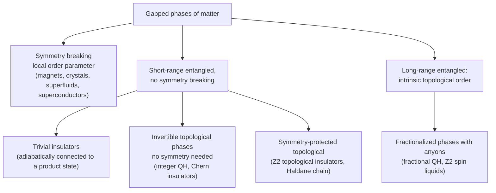

[Condensed Matter Physics](./) &raquo; Superconductivity, Quantum Hall &amp; Topological Phases

This page surveys the phases of matter that exist only because very many
particles act collectively: superconductors, quantum Hall fluids, topological
insulators and semimetals, topological spin textures, strongly correlated metals
and insulators, and the ordered phases of soft matter. For each it gives the
defining phenomena, the standard theory at the level of its key equations, and
the current experimental state of the field. Full derivations and the
field-theoretic machinery (Bogoliubov-de Gennes, K-matrix Chern-Simons theory,
DMFT, the tenfold way) are on
[Graduate-Level Formalism](advanced-formalism.html); the role of disorder in the
quantum Hall effect is developed on [Disorder & Localization](disorder-and-localization.html).

## Organizing principles

Landau's paradigm classifies phases by **spontaneous symmetry breaking**: a magnet
breaks spin-rotation symmetry, a crystal breaks translation symmetry, a
superconductor breaks the U(1) phase symmetry of the electron wavefunction, and
each is described by a local order parameter. Since the discovery of the quantum
Hall effect in 1980 it has been clear that this is not the whole story. Some
gapped phases differ not in any local order parameter but in a global,
quantized property of their ground-state wavefunction, and that difference can
only change if the energy gap closes.

Gapless phases (metals, Dirac and Weyl semimetals, critical points) sit outside
this chart and are classified by the topology of their Fermi surfaces or band
touchings. The recurring theme is the **bulk-boundary correspondence**: a
nontrivial bulk invariant forces gapless states on the boundary, which is what
most experiments detect.

## Superconductivity

Superconductivity was discovered by Kamerlingh Onnes in 1911 in mercury below
4.2 K. It is a thermodynamic phase with a set of sharply defined properties:

| Property | Observation | Explanation |
|---|---|---|
| Zero dc resistance | Persistent currents in rings show no measurable decay over years | Phase-coherent condensate; dissipation requires phase slips |
| Meissner effect | Magnetic field expelled from the bulk on cooling, not just frozen in | A thermodynamic state, not merely a perfect conductor |
| Flux quantization | Flux through a ring is $n\,\Phi_0$, $\Phi_0 = h/2e \approx 2.068\times 10^{-15}$ Wb | Single-valued pair wavefunction of charge $2e$ |
| Energy gap | Exponential specific heat and thermal conductivity; tunneling gap $2\Delta$ | Pairing gap in the excitation spectrum |
| Isotope effect | $T_c \propto M^{-1/2}$ in many elements | Lattice vibrations mediate the attraction |

### London equations

The London brothers (1935) described the electrodynamics with a supercurrent
proportional to the vector potential, $\mathbf{j}_s = -(n_se^2/m)\mathbf{A}$.
Combined with Ampère's law this gives

$$\nabla^2\mathbf{B} = \frac{\mathbf{B}}{\lambda_L^2}, \qquad \lambda_L = \sqrt{\frac{m}{\mu_0 n_s e^2}},$$

so a field decays exponentially over the **London penetration depth** $\lambda_L$,
typically 50-500 nm. This is the Meissner effect.

### Ginzburg-Landau theory and the two types of superconductor

Ginzburg-Landau (GL) theory (1950) writes the free energy near $T_c$ in terms of a
complex order parameter $\psi(\mathbf{r})$, with $|\psi|^2$ the superfluid density:

$$F = \int d^3r\left[\alpha|\psi|^2 + \frac{\beta}{2}|\psi|^4 + \frac{1}{2m^*}\left|(-i\hbar\nabla - 2e\mathbf{A})\psi\right|^2 + \frac{B^2}{2\mu_0}\right], \qquad \alpha \propto T - T_c .$$

Two lengths emerge: the **coherence length** $\xi = \hbar/\sqrt{2m^\ast|\alpha|}$, over
which $\psi$ can vary, and the **penetration depth** $\lambda$, over which fields
are screened. Their ratio, the GL parameter $\kappa = \lambda/\xi$, divides
superconductors into two classes:

| | Type I | Type II |
|---|---|---|
| Criterion | $\kappa < 1/\sqrt{2}$ | $\kappa > 1/\sqrt{2}$ |
| Normal-superconductor interface energy | positive | negative |
| Behaviour in a field | Complete Meissner state up to $H_c$, then normal | Meissner below $H_{c1}$; vortex (mixed) state between $H_{c1}$ and $H_{c2}$; normal above $H_{c2}$ |
| Examples | Al ($T_c$ 1.2 K), Pb (7.2 K), Hg | Nb (9.3 K), NbTi, Nb$_3$Sn (18 K), MgB$_2$ (39 K), cuprates, iron pnictides |

In the mixed state, flux enters as **Abrikosov vortices**, each carrying one flux
quantum $\Phi_0$ around a normal core of radius $\sim\xi$, and they arrange into a
triangular lattice. The upper critical field is $\mu_0H_{c2} = \Phi_0/(2\pi\xi^2)$,
which exceeds 100 T in some cuprates. Pinning of vortices by defects is what lets
type II wires (NbTi, Nb$_3$Sn, REBCO tapes) carry large currents in MRI, particle
accelerator, and fusion magnets.

<figure style="margin: 1.5rem auto; max-width: 460px;">
<svg viewBox="0 0 460 290" role="img" aria-labelledby="t2-title t2-desc" style="width: 100%; height: auto; color: currentColor;">
  <title id="t2-title">Phase diagram of a type II superconductor</title>
  <desc id="t2-desc">Magnetic field H versus temperature T. The lower critical field H_c1(T) and upper critical field H_c2(T) both fall to zero at T_c. Below H_c1 is the Meissner state; between H_c1 and H_c2 the vortex (mixed) state; above H_c2 the normal state.</desc>
  <defs>
    <marker id="t2-arrow" markerWidth="8" markerHeight="8" refX="7" refY="4" orient="auto"><path d="M0,0 L8,4 L0,8 Z" fill="currentColor"/></marker>
  </defs>
  <line x1="50" y1="250" x2="440" y2="250" stroke="currentColor" stroke-width="1.5" marker-end="url(#t2-arrow)"/>
  <line x1="50" y1="250" x2="50" y2="20" stroke="currentColor" stroke-width="1.5" marker-end="url(#t2-arrow)"/>
  <text x="435" y="272" font-size="14" fill="currentColor" text-anchor="end">T</text>
  <text x="38" y="30" font-size="14" fill="currentColor" text-anchor="end">H</text>
  <path d="M50,40 C200,45 300,110 360,250 L50,250 Z" fill="currentColor" fill-opacity="0.06" stroke="none"/>
  <path d="M50,40 C200,45 300,110 360,250" fill="none" stroke="currentColor" stroke-width="2.2"/>
  <path d="M50,190 C180,192 290,215 360,250 L50,250 Z" fill="currentColor" fill-opacity="0.10" stroke="none"/>
  <path d="M50,190 C180,192 290,215 360,250" fill="none" stroke="currentColor" stroke-width="2.2"/>
  <circle cx="360" cy="250" r="4" fill="currentColor"/>
  <text x="360" y="270" font-size="13" fill="currentColor" text-anchor="middle">T_c</text>
  <text x="120" y="228" font-size="13" fill="currentColor" text-anchor="middle">Meissner state</text>
  <text x="170" y="140" font-size="13" fill="currentColor" text-anchor="middle">vortex (mixed) state</text>
  <text x="330" y="70" font-size="13" fill="currentColor" text-anchor="middle">normal</text>
  <text x="268" y="98" font-size="12" fill="currentColor">H_c2(T)</text>
  <text x="235" y="192" font-size="12" fill="currentColor">H_c1(T)</text>
</svg>
<figcaption style="text-align: center; font-size: 0.9em;">A type I superconductor has a single critical field H_c(T) separating the Meissner and normal states.</figcaption>
</figure>

### BCS theory

The microscopic theory of Bardeen, Cooper, and Schrieffer (1957) rests on
Cooper's observation that a filled Fermi sea is unstable to pairing under *any*
net attraction, however weak. In conventional superconductors the attraction is
phonon-mediated: an electron distorts the lattice, and the slowly relaxing
distortion attracts a second electron. Pairs form between time-reversed states
$(\mathbf{k}\uparrow, -\mathbf{k}\downarrow)$ within the Debye energy
$\hbar\omega_D$ of the Fermi surface. The ground state is a coherent
superposition of pair occupancies,

$$|\text{BCS}\rangle = \prod_{\mathbf{k}}\left(u_{\mathbf{k}} + v_{\mathbf{k}}\,c_{\mathbf{k}\uparrow}^\dagger c_{-\mathbf{k}\downarrow}^\dagger\right)|0\rangle, \qquad |u_{\mathbf{k}}|^2 + |v_{\mathbf{k}}|^2 = 1,$$

whose excitations are Bogoliubov quasiparticles with energy
$E_{\mathbf{k}} = \sqrt{\xi_{\mathbf{k}}^2 + |\Delta_{\mathbf{k}}|^2}$, where
$\xi_{\mathbf{k}}$ is the band energy measured from the Fermi level. The gap is
determined self-consistently by the **gap equation**

$$\Delta_{\mathbf{k}} = -\sum_{\mathbf{k}'}V_{\mathbf{k}\mathbf{k}'}\,\frac{\Delta_{\mathbf{k}'}}{2E_{\mathbf{k}'}}\tanh\frac{E_{\mathbf{k}'}}{2k_BT}.$$

For a constant attraction $V$ within $\hbar\omega_D$ of the Fermi surface and
density of states $N(0)$ per spin, BCS theory gives universal weak-coupling
results:

| Quantity | BCS result |
|---|---|
| Critical temperature | $k_BT_c = 1.13\,\hbar\omega_D\,e^{-1/N(0)V}$ |
| Zero-temperature gap | $\Delta(0) = 1.764\,k_BT_c$, i.e. $2\Delta(0)/k_BT_c \approx 3.53$ |
| Gap near $T_c$ | $\Delta(T) \approx 3.06\,k_BT_c\sqrt{1 - T/T_c}$ |
| Specific-heat jump | $\Delta C/\gamma T_c \approx 1.43$ |
| Pippard coherence length | $\xi_0 = \hbar v_F/(\pi\Delta(0))$ |

The non-analytic dependence on $V$ explains why pairing is invisible to
perturbation theory. Coherence lengths range from about 1.6 μm in aluminium to 1-2
nm in cuprates. Strong electron-phonon coupling (Pb, Hg, hydrides) is treated by
**Eliashberg theory**, which raises $2\Delta/k_BT_c$ above 3.53. The Anderson-Higgs
mechanism, by which the photon acquires a mass inside a superconductor, is the
condensed-matter prototype of the Higgs mechanism of particle physics.

### Josephson effects and superconducting circuits

Two superconductors separated by a thin barrier (an insulator, normal metal, or
constriction) exchange Cooper pairs coherently. Josephson (1962) predicted:

$$I = I_c\sin\varphi \quad (\text{dc effect}), \qquad \frac{d\varphi}{dt} = \frac{2eV}{\hbar} \quad (\text{ac effect}),$$

where $\varphi$ is the phase difference across the junction. A dc supercurrent
flows with no voltage; a dc voltage $V$ produces an alternating current at
$f = 2eV/h \approx 483.6\ \text{GHz per mV}$. Irradiating a junction with microwaves
produces constant-voltage Shapiro steps at $V_n = nhf/2e$, which since the 2019 SI
redefinition (exact $e$ and $h$) realize the volt.

Josephson junctions are the active element of superconducting electronics:

- **SQUIDs.** Two junctions in a loop form an interferometer whose critical current oscillates with period $\Phi_0$ in the enclosed flux, giving magnetometers sensitive to below $10^{-6}\,\Phi_0/\sqrt{\text{Hz}}$, used in materials characterization, geophysics, and magnetoencephalography.
- **Superconducting qubits.** The junction is a nonlinear, dissipationless inductor. Shunted by a capacitor it becomes an anharmonic oscillator whose lowest two levels form a qubit; the transmon, which operates with $E_J/E_C$ of order 50 to suppress charge noise, is the basis of most superconducting quantum processors. The 2025 Nobel Prize in Physics (Clarke, Devoret, Martinis) recognized the 1980s experiments demonstrating macroscopic quantum tunneling and energy quantization in such circuits.

### Unconventional superconductors

In conventional superconductors the gap is nodeless and has the full symmetry of
the crystal (s-wave). In **unconventional** superconductors the gap changes sign
over the Fermi surface, which usually signals a pairing mechanism based on
electronic (often spin-fluctuation) rather than phonon attraction.

| Family | Discovered | Highest $T_c$ | Pairing / notes |
|---|---|---|---|
| Heavy fermions (CeCu$_2$Si$_2$, UPt$_3$, CeCoIn$_5$) | 1979 | ~2 K (Pu compounds ~18 K) | Near magnetic quantum critical points; UTe$_2$ (2019) a spin-triplet candidate |
| Cuprates (YBCO, Bi-2212, Hg-1223) | 1986 | 133 K at ambient pressure (Hg-1223), ~164 K under pressure | $d_{x^2-y^2}$ pairing established by phase-sensitive experiments |
| Organics, Sr$_2$RuO$_4$ | 1980s, 1994 | ~1-14 K | Sr$_2$RuO$_4$, long thought chiral p-wave, was reassessed after 2019 NMR results |
| MgB$_2$ | 2001 | 39 K | Conventional phonon pairing, two distinct gaps |
| Iron pnictides and chalcogenides | 2008 | ~55 K bulk; higher reported in monolayer FeSe on SrTiO$_3$ | Sign-changing $s_\pm$ between electron and hole pockets |
| Hydrides under pressure (H$_3$S, LaH$_{10}$) | 2015 | ~250 K near 170 GPa (LaH$_{10}$) | Conventional, strong coupling; claimed room-temperature superconductors in 2020 and 2023 were retracted |
| Moiré and rhombohedral graphene | 2018 | ~1-3 K | Superconductivity near correlated insulators; chiral superconductivity reported in rhombohedral multilayers (2025) |
| Nickelates | 2019 (infinite-layer films) | ~80 K in La$_3$Ni$_2$O$_7$ above ~14 GPa (2023) | Ambient-pressure superconductivity near 40 K in strained La$_3$Ni$_2$O$_7$ films (2025) |

No superconductor has been confirmed above ~250 K, and none near room temperature
at ambient pressure. Widely publicized claims (the Lu-N-H hydride in 2023, LK-99
in 2023) did not survive replication.

## Quantum Hall effects

Confine electrons to two dimensions, cool them to a few kelvin or below, and apply
a strong perpendicular magnetic field: the Hall resistance locks onto
$h/(\nu e^2)$ with $\nu$ an integer or a simple fraction, reproducible to parts in
$10^{10}$ regardless of sample geometry, material, or disorder. That precision is
the first laboratory signature of **topology** in a material: the Hall
conductance counts a topological invariant that cannot change under smooth
deformation. The von Klitzing constant $R_K = h/e^2 = 25\,812.807\,45\ldots\ \Omega$
is exact in the 2019 SI, and quantum Hall devices, increasingly made of graphene,
realize the ohm.

<figure style="margin: 1.5rem auto; max-width: 480px;">
<svg viewBox="0 0 480 350" role="img" aria-labelledby="qh-title qh-desc" style="width: 100%; height: auto; color: currentColor;">
  <title id="qh-title">Integer quantum Hall effect</title>
  <desc id="qh-desc">Upper panel: Hall resistance rho_xy versus magnetic field B shows flat plateaus at h over i e squared for i equals 4, 3, 2, 1, lying on the dashed classical straight line. Lower panel: longitudinal resistance rho_xx is zero on each plateau and peaks between plateaus.</desc>
  <defs>
    <marker id="qh-arrow" markerWidth="8" markerHeight="8" refX="7" refY="4" orient="auto"><path d="M0,0 L8,4 L0,8 Z" fill="currentColor"/></marker>
  </defs>
  <line x1="50" y1="260" x2="465" y2="260" stroke="currentColor" stroke-width="1.5" marker-end="url(#qh-arrow)"/>
  <line x1="50" y1="260" x2="50" y2="30" stroke="currentColor" stroke-width="1.5" marker-end="url(#qh-arrow)"/>
  <text x="58" y="38" font-size="14" fill="currentColor">ρ_xy</text>
  <line x1="50" y1="260" x2="430" y2="49" stroke="currentColor" stroke-width="1" stroke-dasharray="5,5" stroke-opacity="0.7"/>
  <path d="M50,260 C90,240 110,215 125,210 L155,210 C158,200 159,195 162,193 L185,193 C190,178 194,163 200,160 L262,160 C285,120 310,70 330,60 L460,60" fill="none" stroke="currentColor" stroke-width="2.4"/>
  <text x="395" y="52" font-size="12" fill="currentColor" text-anchor="middle">h/e² (ν = 1)</text>
  <text x="231" y="152" font-size="12" fill="currentColor" text-anchor="middle">h/2e²</text>
  <text x="173" y="185" font-size="11" fill="currentColor" text-anchor="middle">h/3e²</text>
  <text x="140" y="202" font-size="11" fill="currentColor" text-anchor="middle">h/4e²</text>
  <line x1="50" y1="330" x2="465" y2="330" stroke="currentColor" stroke-width="1.5" marker-end="url(#qh-arrow)"/>
  <line x1="50" y1="330" x2="50" y2="275" stroke="currentColor" stroke-width="1.5"/>
  <text x="58" y="286" font-size="14" fill="currentColor">ρ_xx</text>
  <path d="M50,318 C80,305 95,300 110,322 L125,330 L152,330 C156,310 160,310 164,330 L184,330 C189,300 197,300 202,330 L260,330 C275,280 315,280 332,330 L460,330" fill="none" stroke="currentColor" stroke-width="2"/>
  <text x="460" y="348" font-size="14" fill="currentColor" text-anchor="end">B</text>
</svg>
<figcaption style="text-align: center; font-size: 0.9em;">Schematic integer quantum Hall data. The dashed line is the classical Hall resistance B/(ne); plateaus occur where the Fermi level lies in localized states between Landau levels.</figcaption>
</figure>

### Landau levels

A perpendicular field $B$ quantizes the cyclotron motion of 2D electrons into
**Landau levels**

$$E_n = \hbar\omega_c\left(n + \tfrac{1}{2}\right), \qquad \omega_c = \frac{eB}{m^*},$$

each with degeneracy $eB/h$ per unit area (one state per flux quantum $h/e$). The
**filling factor** $\nu = nh/(eB)$ counts filled levels. In graphene the Dirac
dispersion gives instead $E_n = \pm v_F\sqrt{2e\hbar B|n|}$ with a zero-energy
level, producing plateaus at $\nu = \pm 2, \pm 6, \pm 10, \ldots$ and a quantum Hall
effect visible at room temperature in strong fields.

### Integer quantum Hall effect

Discovered by von Klitzing in 1980 (Nobel Prize 1985). When $\nu$ integer levels
are filled the bulk is gapped and the Hall conductance is

$$\sigma_{xy} = \nu\,\frac{e^2}{h}, \qquad \sigma_{xx} = 0 .$$

Three complementary explanations exist:

- **Topology.** $\sigma_{xy}$ is $e^2/h$ times the sum of the Chern numbers of the filled bands (the TKNN formula), an integer by construction.
- **Edge states.** At the sample edge the confining potential bends Landau levels up through the Fermi energy, creating $\nu$ chiral edge channels that propagate in one direction only. Backscattering would require an electron to cross the sample, so transport along the edge is dissipationless and each channel contributes $e^2/h$ (Landauer-Büttiker).
- **Disorder.** Plateaus of finite width require **localized** states: as $B$ changes, the Fermi level moves through localized states that carry no current, so $\sigma_{xy}$ stays fixed. Only one energy per Landau level hosts extended states, where the plateau transition occurs (see [Disorder & Localization](disorder-and-localization.html#where-single-parameter-scaling-is-modified)).

### Fractional quantum Hall effect

Tsui, Störmer, and Gossard found a plateau at $\nu = 1/3$ in 1982 (Nobel Prize
1998, shared with Laughlin). At fractional filling the non-interacting picture
predicts a partially filled, massively degenerate level with no gap; the plateau
exists only because Coulomb interactions select a unique, incompressible
correlated state. Laughlin's wavefunction for $\nu = 1/m$ ($m$ odd),

$$\Psi_m = \prod_{i<j}(z_i - z_j)^m\,\exp\left(-\sum_i\frac{|z_i|^2}{4\ell_B^2}\right), \qquad \ell_B = \sqrt{\frac{\hbar}{eB}},$$

with $z = x + iy$, keeps electrons apart with an $m$-th order zero and is an
excellent approximation to the exact ground state. Its excitations are
**fractionally charged** quasiparticles of charge $e/m$ with **anyonic**
exchange statistics $\theta = \pi/m$.

| Milestone | Year |
|---|---|
| Fractional charge $e/3$ measured by shot noise | 1997 |
| Composite-fermion theory explains the sequence $\nu = p/(2p \pm 1)$ (Jain) | 1989 |
| Even-denominator state at $\nu = 5/2$ observed; Moore-Read Pfaffian with non-abelian anyons proposed | 1987 / 1991 |
| Thermal Hall conductance at $\nu = 5/2$ consistent with a non-abelian state | 2018 |
| Anyonic braiding statistics seen in Fabry-Pérot interferometry and anyon collision experiments at $\nu = 1/3$ | 2020 |
| Fractional quantum Hall states in graphene, including even-denominator states in bilayers | 2009 onward |

The composite-fermion picture (electrons bound to two flux quanta, moving in a
reduced effective field) and the Chern-Simons effective theory are developed on
[Graduate-Level Formalism](advanced-formalism.html#composite-fermions).
Non-abelian anyons at $\nu = 5/2$ and related states are the original motivation
for **topological quantum computation**, in which information is stored
nonlocally and processed by braiding.

### Anomalous quantum Hall effects

A quantized Hall conductance needs broken time-reversal symmetry and nonzero
Chern number, not a magnetic field as such. Haldane showed in 1988 that a
honeycomb lattice with complex hoppings realizes a **Chern insulator** at zero
net field.

- **Quantum anomalous Hall (QAH) effect.** Observed in 2013 in magnetically doped (Cr- or V-doped) (Bi,Sb)$_2$Te$_3$ films, where ferromagnetism gaps the topological surface state, and later in the intrinsic magnetic topological insulator MnBi$_2$Te$_4$ (2020) and in moiré graphene.
- **Fractional quantum anomalous Hall (FQAH) effect.** Fractionally quantized Hall resistance at zero field was observed in 2023 in twisted bilayer MoTe$_2$ (at $\nu = -2/3$ and $-3/5$) and in 2024 in rhombohedral pentalayer graphene aligned with hBN. These are lattice analogues of FQH states (fractional Chern insulators), formed in flat Chern bands whose Berry curvature is nearly uniform, and they have become a leading platform for zero-field anyons.

## Topological phases

### Berry phase and Chern number

The mathematical engine is the **Berry phase**, the geometric phase a state
acquires when its Hamiltonian is carried slowly around a closed loop in parameter
space:

$$\gamma_n = i\oint\langle n(\mathbf{R})|\nabla_{\mathbf{R}}n(\mathbf{R})\rangle\cdot d\mathbf{R}.$$

For Bloch electrons the parameter space is the Brillouin zone. The Berry curvature
of band $n$ is $\Omega_n(\mathbf{k}) = \nabla_{\mathbf{k}}\times i\langle u_{n\mathbf{k}}|\nabla_{\mathbf{k}}u_{n\mathbf{k}}\rangle$,
and in two dimensions its integral over the closed Brillouin zone is an integer,
the **Chern number**:

$$C_n = \frac{1}{2\pi}\int_{\text{BZ}}d^2k\;\Omega_n(\mathbf{k}) \in \mathbb{Z}.$$

A nonzero total Chern number of the filled bands implies $|C|$ chiral edge states
and a quantized Hall conductance $Ce^2/h$. Berry curvature also has
non-quantized consequences in metals: the intrinsic anomalous Hall effect,
orbital magnetization, and the nonlinear Hall effect.

### Topological insulators

With time-reversal symmetry the Chern number vanishes, but spin-orbit coupling
can produce a band inversion with a $\mathbb{Z}_2$ invariant $\nu = 0$ (trivial)
or $1$ (topological).

**Two dimensions: the quantum spin Hall effect.** Kane and Mele (2005) and
Bernevig, Hughes, and Zhang (2006) predicted insulators with a pair of
counter-propagating, spin-polarized edge channels (helical edge states). The
effect was observed in HgTe/CdTe quantum wells above a critical thickness of
6.3 nm (2007), and later in InAs/GaSb wells and monolayer WTe$_2$ (up to ~100 K).
Time reversal forbids elastic backscattering between the two partners of a
Kramers pair, so each edge contributes $e^2/h$ to the conductance.

**Three dimensions.** A 3D topological insulator (Bi$_{1-x}$Sb$_x$, then
Bi$_2$Se$_3$, Bi$_2$Te$_3$, and related compounds, identified by ARPES from 2008)
is a bulk insulator whose surface hosts an odd number of Dirac cones. Near the
$\Gamma$ point the surface Hamiltonian is

$$H_{\text{surf}}(\mathbf{k}) = \hbar v_F\left(\sigma_x k_y - \sigma_y k_x\right),$$

with $\sigma$ the electron spin. The surface states have:

- a linear (Dirac) dispersion with a crossing at a time-reversal-invariant momentum, protected by Kramers' theorem;
- **spin-momentum locking**: the spin lies in-plane and perpendicular to $\mathbf{k}$;
- a Berry phase $\pi$ around the Fermi surface, so direct backscattering $\mathbf{k}\to-\mathbf{k}$ is forbidden and the surface is immune to localization by non-magnetic disorder (it shows weak antilocalization).

The $\mathbb{Z}_2$ invariant is computed from the Fu-Kane formula or, with
inversion symmetry, from the parities of occupied states at the eight
time-reversal-invariant momenta (see
[Graduate-Level Formalism](advanced-formalism.html#topological-band-theory)).

### Topological semimetals

Band touchings in 3D can themselves be topological.

- **Weyl semimetals** have isolated, twofold band crossings that act as monopoles of Berry curvature with chirality $\pm 1$. They come in pairs of opposite chirality, require broken inversion or time-reversal symmetry, and are connected on the surface by open **Fermi arcs**. First observed in TaAs (2015).
- **Dirac semimetals** (Na$_3$Bi, Cd$_3$As$_2$, 2014) have fourfold crossings protected by crystal symmetry; breaking time reversal splits each into two Weyl points.
- Signatures include the chiral anomaly (negative longitudinal magnetoresistance for $\mathbf{E}\parallel\mathbf{B}$), large linear magnetoresistance, and quantized circular photogalvanic effects in chiral crystals.

### Topological superconductors and Majorana modes

A superconductor's BdG Hamiltonian has a built-in particle-hole symmetry, so
superconductors fall into their own topological classes. The minimal example is
Kitaev's 1D chain of spinless fermions with p-wave pairing (2001), whose
topological phase hosts an unpaired **Majorana zero mode** at each end, with
$\gamma = \gamma^\dagger$. A pair of separated Majoranas stores one fermion
parity bit nonlocally, and braiding Majoranas in 2D networks implements
non-abelian exchange, the basis of proposed topologically protected qubits.

Practical proposals (2010) engineer effective p-wave pairing from s-wave
superconductors proximity-coupled to spin-orbit-coupled nanowires (InAs, InSb) in
a magnetic field, to topological-insulator surfaces, or to magnetic atom chains.
Zero-bias conductance peaks consistent with Majoranas have been reported many
times since 2012, but similar peaks arise from trivial Andreev bound states, and
several high-profile claims were retracted. Microsoft reported interferometric
parity measurements in InAs-Al "topological gap protocol" devices in 2025; the
evidence that these devices host topological Majorana modes remains disputed, and
no braiding of Majoranas has been demonstrated.

### Bulk-boundary correspondence

| Bulk phase | Invariant | Boundary signature | Key materials |
|---|---|---|---|
| Integer quantum Hall / Chern insulator | Chern number $C \in \mathbb{Z}$ | $\lvert C\rvert$ chiral edge channels | GaAs 2DEGs, graphene, Cr-(Bi,Sb)$_2$Te$_3$, MnBi$_2$Te$_4$ |
| Quantum spin Hall (2D TI) | $\mathbb{Z}_2$ | Helical edge pair | HgTe/CdTe, InAs/GaSb, WTe$_2$ |
| 3D strong TI | $\mathbb{Z}_2$ ($\nu_0 = 1$) | Odd number of surface Dirac cones | Bi$_2$Se$_3$, Bi$_2$Te$_3$ |
| Topological crystalline insulator | Mirror Chern number | Even number of surface cones on mirror-symmetric faces | SnTe, Pb$_{1-x}$Sn$_x$Se |
| Higher-order TI | Crystalline indices | Hinge or corner states | Bismuth (proposed), photonic and phononic metamaterials |
| Weyl semimetal | Monopole charge of each node | Fermi arcs | TaAs, NbAs, Co$_3$Sn$_2$S$_2$ |
| 1D topological superconductor | $\mathbb{Z}_2$ | Majorana end modes | Proximitized nanowires (under investigation) |
| Fractional QH / FQAH | Topological order (K matrix) | Chiral edges carrying fractional charge | GaAs, graphene, twisted MoTe$_2$ |

## Topological spin textures

The topological reasoning that protects quantum Hall plateaus also organizes the
*real-space* arrangement of spins in magnets. In materials lacking inversion
symmetry, or in thin films where an interface breaks it, competing interactions
wind the magnetization into textures that cannot be unwound smoothly into a
uniform state. These textures carry an integer charge, behave as stable
particle-like objects, and can be moved by small currents.

### Skyrmion number

Treat the magnetization direction as a unit vector field $\mathbf{m}(\mathbf{r})$.
A 2D texture that is uniform far away maps the plane (compactified to a sphere)
onto the unit sphere of directions, and such maps fall into classes labeled by an
integer winding number, the **skyrmion number**:

$$N_{sk} = \frac{1}{4\pi}\int d^2r\;\mathbf{m}\cdot\left(\frac{\partial\mathbf{m}}{\partial x}\times\frac{\partial\mathbf{m}}{\partial y}\right).$$

The integrand is the solid angle swept by $\mathbf{m}$, so $N_{sk}$ counts how many
times the texture wraps the sphere. No continuous deformation can change it, so a
skyrmion ($N_{sk} = \pm 1$) is **topologically protected** against decay into the
ferromagnet ($N_{sk} = 0$) in the continuum; on a lattice the protection becomes a
finite energy barrier. $N_{sk}$ is the real-space analogue of the Chern number.

### Skyrmions and the interactions that stabilize them

A **magnetic skyrmion** has its core spin antiparallel to the background, with
the magnetization rotating through the plane in between. Writing the in-plane
angle as $\phi = w\varphi + \gamma$ (winding $w$, helicity $\gamma$) and the core
polarity as $p = \pm 1$, the charge is $N_{sk} = p\,w$ up to a sign convention.
Two helicities are common:

| | Bloch skyrmion | Néel skyrmion |
|---|---|---|
| Rotation | Spins rotate in planes perpendicular to the radius (vortex-like) | Spins rotate in planes containing the radius (hedgehog-like) |
| Stabilized by | Bulk Dzyaloshinskii-Moriya interaction in chiral cubic (B20) magnets | Interfacial DMI at heavy-metal/ferromagnet interfaces |
| Examples | MnSi, FeGe, Fe$_{1-x}$Co$_x$Si, Cu$_2$OSeO$_3$ | Ir/Co/Pt and Pt/Co/Ta multilayers, polar magnets such as GaV$_4$S$_8$ |
| Typical size | 3-100 nm | 10 nm to about 1 μm, at room temperature in multilayers |

The Dzyaloshinskii-Moriya interaction (DMI) is an antisymmetric exchange arising
from spin-orbit coupling without inversion symmetry. It favours a fixed sense of
spin rotation. A standard lattice model is

$$\mathcal{H} = -J\sum_{\langle ij\rangle}\mathbf{S}_i\cdot\mathbf{S}_j + \sum_{\langle ij\rangle}\mathbf{D}_{ij}\cdot(\mathbf{S}_i\times\mathbf{S}_j) - \mathbf{B}\cdot\sum_i\mathbf{S}_i - K\sum_i(S_i^z)^2,$$

with exchange, DMI, Zeeman, and uniaxial-anisotropy terms. The competition between
$J$ and $D$ sets a length $\ell \sim Ja/D$ that fixes the helix period and skyrmion
size. At zero field the ground state is a helix; in a window of field and
temperature skyrmions condense into a triangular **skyrmion lattice**, first seen
by small-angle neutron scattering in MnSi (2009) and imaged in real space by
Lorentz transmission electron microscopy in Fe$_{0.5}$Co$_{0.5}$Si (2010).
Frustrated centrosymmetric magnets (for example Gd$_2$PdSi$_3$) host much smaller
skyrmions, a few nanometres across, stabilized without DMI.

### Merons and antiskyrmions

A **meron** covers only half the sphere: its core points out of plane while its
boundary lies in the plane, giving $N_{sk} = p\,w/2 = \pm 1/2$. A meron has
logarithmically divergent energy on its own and occurs in pairs or lattices;
a meron and an antimeron can combine into a bimeron with $|N_{sk}| = 1$, the
natural skyrmion analogue in in-plane magnets. **Antiskyrmions** ($w = -1$) are
stabilized by anisotropic DMI in Heusler compounds with $D_{2d}$ symmetry.

### Emergent electrodynamics: topological and skyrmion Hall effects

An electron moving through a smooth texture adiabatically aligns its spin with
$\mathbf{m}$. The resulting Berry phase acts like a fictitious magnetic field, the
**emergent field** $b_z = \frac{\hbar}{2e}\,\mathbf{m}\cdot(\partial_x\mathbf{m}\times\partial_y\mathbf{m})$,
which carries one flux quantum $h/e$ per skyrmion (in magnitude). Two
consequences follow.

- **Topological Hall effect.** The emergent field deflects carriers and adds a term to the Hall resistivity beyond the ordinary and anomalous contributions, $\rho_{xy} = \rho^{O}_{xy} + \rho^{A}_{xy} + \rho^{T}_{xy}$, with $\rho^{T}_{xy} \propto P\,R_0\,n_{sk}\,\Phi_0$ for spin polarization $P$, ordinary Hall coefficient $R_0$, and skyrmion density $n_{sk}$. A Hall anomaly confined to the skyrmion field window is a standard transport fingerprint, though it can be mimicked by two-component anomalous Hall signals and needs corroboration by imaging.
- **Skyrmion Hall effect.** Conversely, a current-driven skyrmion does not move parallel to the drive. Thiele's equation for a rigid texture,

$$\mathbf{G}\times\mathbf{v} - \alpha\,\mathcal{D}\,\mathbf{v} + \mathbf{F} = 0, \qquad \mathbf{G} \propto 4\pi N_{sk}\,\hat{\mathbf{z}},$$

balances the gyrotropic (Magnus-like) force against Gilbert damping $\alpha$ and the
driving force $\mathbf{F}$ (dissipation tensor $\mathcal{D}$). The skyrmion moves at
a Hall angle set by $|\mathbf{G}|/(\alpha\mathcal{D})$, which can reach tens of
degrees and was imaged directly in 2016-17.

### Applications

- **Racetrack memory.** Parkin's racetrack concept (2008) moves magnetic domain walls along a nanowire; Fert and co-workers proposed skyrmions as bits in 2013 because they can be driven by spin-orbit torques at low current densities and are less sensitive to pinning. The skyrmion Hall effect pushes bits toward the track edge, motivating textures with zero net gyrocoupling: **antiferromagnetic** and **synthetic-antiferromagnet** skyrmions and bimerons, whose sublattice contributions cancel.
- **Unconventional computing.** Thermally driven skyrmion diffusion and stochastic nucleation have been used for reservoir computing, probabilistic bits, and signal reshuffling.
- **2D magnets.** Intrinsic magnetism in van der Waals monolayers (CrI$_3$, Cr$_2$Ge$_2$Te$_6$, Fe$_3$GeTe$_2$, 2017 onward) provides atomically thin hosts in which DMI, anisotropy, and texture stability can be tuned by gating, stacking, and twist. Néel skyrmions have been imaged in Fe$_3$GeTe$_2$-based heterostructures.

## Strongly correlated systems

Band theory assumes electrons move independently in an average potential. That
fails when the Coulomb repulsion between electrons is comparable to their kinetic
energy (narrow d and f bands, flat moiré bands). Band theory can then be
qualitatively wrong, predicting a metal where experiment finds an insulator, and
the resulting phenomena include high-temperature superconductivity, heavy
fermions, strange metals, and quantum spin liquids.

### Hubbard model and the Mott transition

The minimal model keeps nearest-neighbour hopping $t$ and an on-site repulsion $U$:

$$H = -t\sum_{\langle ij\rangle,\sigma}\left(c_{i\sigma}^\dagger c_{j\sigma} + \text{h.c.}\right) + U\sum_i n_{i\uparrow}n_{i\downarrow}.$$

For $U \ll t$ the system is a metal. For $U \gg t$ at half filling (one electron per
site) the electrons localize one per site to avoid the penalty: a **Mott
insulator**, insulating because of interactions and not band filling (NiO, V$_2$O$_3$,
undoped cuprates). Virtual hopping then generates an antiferromagnetic exchange
$J = 4t^2/U$ between the localized spins. The Mott metal-insulator transition at
$U \sim W$ (the bandwidth) is described quantitatively by dynamical mean-field
theory (DMFT). Despite its simplicity, the 2D Hubbard model has no exact solution,
and large-scale numerical studies since the late 2010s have shown that its ground
state near 1/8 hole doping is a delicate competition between d-wave
superconductivity and stripe order that depends on details such as next-nearest
hopping $t'$.

### Heavy fermions and the Kondo effect

A single magnetic impurity in a metal is screened by conduction electrons below
the Kondo temperature $T_K$, forming a many-body singlet (the Kondo effect, which
explains the resistance minimum in dilute magnetic alloys). In rare-earth and
actinide compounds (CeCu$_6$, CeCoIn$_5$, YbRh$_2$Si$_2$, UPt$_3$) a lattice of
f-moments hybridizes with the conduction band, producing quasiparticles with
effective masses up to several hundred times $m_e$. Doniach's phase diagram
describes the competition between Kondo screening, which favours a heavy Fermi
liquid, and the RKKY interaction, which favours magnetic order; the quantum
critical point between them shows non-Fermi-liquid behaviour and often
unconventional superconductivity.

### Cuprates and strange metals

The cuprates consist of CuO$_2$ planes separated by charge-reservoir layers. The
undoped parent is an antiferromagnetic Mott insulator; hole doping of a few
percent destroys the antiferromagnetism and produces a superconducting dome
peaking near 16% doping, with $d_{x^2-y^2}$ pairing. Around it lie the
**pseudogap** regime (a partial gap above $T_c$ in underdoped samples, with
intertwined charge-density-wave and other orders) and, above optimal doping, a
**strange metal** with resistivity linear in $T$ down to the lowest temperatures
and a scattering rate close to the "Planckian" bound $\hbar/\tau \sim k_BT$.
Similar $T$-linear resistivity appears in heavy fermions, pnictides, and twisted
bilayer graphene, which suggests a common mechanism near quantum critical points.
Explaining the pseudogap and the strange metal remains one of the central open
problems of condensed matter physics.

### Quantum spin liquids and flat bands

Frustrated magnets can avoid ordering down to $T = 0$ and form **quantum spin
liquids** with fractionalized spinon excitations and emergent gauge fields.
Kitaev's exactly solvable honeycomb model (2006) motivated work on $\alpha$-RuCl$_3$;
a half-quantized thermal Hall effect reported in 2018 has not been consistently
reproduced, and no material is yet accepted as a spin liquid beyond reasonable
doubt. **Moiré materials** (twisted graphene, twisted transition-metal
dichalcogenides) create flat bands whose kinetic energy can be tuned by twist
angle, displacement field, and gating, providing Hubbard-model physics, correlated
insulators, superconductivity, and fractional Chern insulators in a single
tunable device.

## Soft condensed matter

Soft matter (liquid crystals, polymers, colloids, membranes, foams) has
characteristic energies comparable to $k_BT$ at room temperature, so thermal
fluctuations, entropy, and mesoscale structure dominate.

### Liquid crystals

Liquid crystals are fluids of anisotropic molecules with partial order:

| Phase | Order | Example |
|---|---|---|
| Nematic | Orientational order along a director $\mathbf{n}$; no positional order | 5CB (display mixtures) |
| Smectic A / C | Orientational order plus 1D layering; director along / tilted from the layer normal | 8CB |
| Cholesteric (chiral nematic) | Director twists helically with pitch comparable to optical wavelengths | Cholesteryl esters |

The elastic energy of a slowly varying director is the Frank free energy,

$$F = \frac{1}{2}\int d^3r\left[K_1(\nabla\cdot\mathbf{n})^2 + K_2\left(\mathbf{n}\cdot\nabla\times\mathbf{n}\right)^2 + K_3\left|\mathbf{n}\times(\nabla\times\mathbf{n})\right|^2\right],$$

with splay, twist, and bend constants $K_i$ of order $10^{-11}$ N. Liquid-crystal
displays switch pixels by using an electric field to reorient a twisted nematic
against these elastic forces (the Fréedericksz transition). Topological defects
(disclinations) in the director field are classified by homotopy theory, like the
spin textures above.

### Polymers

A flexible polymer of $N$ segments of length $l$ is modelled as a random walk. An
ideal chain has mean-square end-to-end distance

$$\langle R^2\rangle = Nl^2, \qquad R \sim N^{1/2}.$$

In a good solvent, excluded volume swells the coil. Flory's argument gives
$R_F \sim N^{\nu}$ with $\nu = 3/(d+2) = 3/5$ in three dimensions, remarkably close
to the renormalization-group value $\nu \approx 0.588$ (de Gennes showed the
problem maps onto the $N \to 0$ limit of the O(N) model). In melts and at the
theta temperature chains are again ideal. Entanglement between long chains
produces viscoelasticity, described by the reptation model.

### Colloids

Colloids are particles of roughly 1 nm to 1 μm suspended in a fluid. The
**DLVO theory** (Derjaguin, Landau, Verwey, Overbeek) treats their stability as a
competition between van der Waals attraction and screened electrostatic
repulsion between charged double layers. The repulsion is screened over the
**Debye length**

$$\lambda_D = \sqrt{\frac{\varepsilon k_BT}{2e^2 n_0}}$$

for a 1:1 electrolyte of number density $n_0$; in water at room temperature
$\lambda_D \approx 0.304\ \text{nm}/\sqrt{I}$ with ionic strength $I$ in mol/L, so
about 1 nm at 0.1 M. Adding salt collapses the barrier and causes aggregation.
Hard-sphere colloids crystallize by entropy alone above a volume fraction of about
0.494, and colloids serve as model systems for studying crystallization, glass
formation, and phase separation directly under a microscope.

## References

1. M. Tinkham, *Introduction to Superconductivity*, 2nd ed. (1996).
2. J. F. Annett, *Superconductivity, Superfluids and Condensates* (2004).
3. S. M. Girvin and K. Yang, *Modern Condensed Matter Physics* (2019).
4. M. Z. Hasan and C. L. Kane, "Colloquium: Topological insulators," *Rev. Mod. Phys.* 82, 3045 (2010).
5. N. P. Armitage, E. J. Mele, A. Vishwanath, "Weyl and Dirac semimetals in three-dimensional solids," *Rev. Mod. Phys.* 90, 015001 (2018).
6. N. Nagaosa and Y. Tokura, "Topological properties and dynamics of magnetic skyrmions," *Nat. Nanotechnol.* 8, 899 (2013).
7. B. Keimer et al., "From quantum matter to high-temperature superconductivity in copper oxides," *Nature* 518, 179 (2015).
8. P. M. Chaikin and T. C. Lubensky, *Principles of Condensed Matter Physics* (1995).

---

  <a href="./">&larr; Condensed Matter Physics (Hub)</a>
  <a href="advanced-formalism.html">Graduate-Level Formalism &rarr;</a>

## See Also

- [Graduate-Level Formalism](advanced-formalism.html) — Bogoliubov-de Gennes, K-matrix Chern-Simons theory, DMFT, topological order, and the tenfold way.
- [Disorder & Localization](disorder-and-localization.html) — why quantum Hall plateaus need localized states.
- [Metals & Magnetism](metals-and-magnetism.html) — Fermi liquids, exchange, and magnetic order.
- [Experimental Techniques](experimental-techniques.html) — ARPES, STM, neutron scattering, and transport.
- [Condensed Matter Physics (Hub)](./) — crystal structure, band theory, and semiconductors.
- [Quantum Field Theory](../quantum-field-theory.html) — field-theoretic methods for collective excitations.
