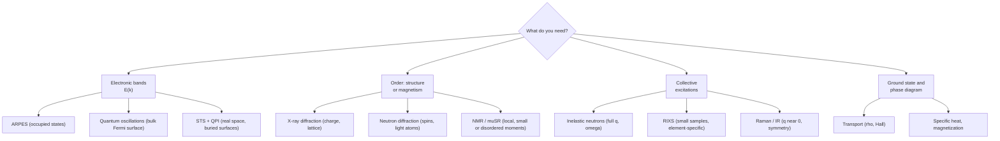

[Condensed Matter Physics](./) &raquo; Experimental Techniques

This page surveys the main experimental probes of condensed matter: what each one couples to, which correlation function it measures, and what it can and cannot tell you. The spectroscopies (ARPES, STM, scattering, optics) come first, then local magnetic probes, then the bulk measurements (quantum oscillations, transport, thermodynamics) that every new material goes through first. The last section describes how the probes are combined. The theoretical objects being measured, such as Green's functions, self-energies, and response functions, are developed on [Graduate-Level Formalism](advanced-formalism.html).

## Linear response: what a probe measures

Almost every experiment couples a weak external field to the sample: photons, electrons, neutrons, a magnetic field, or a temperature gradient. It then records the response. If the perturbation couples to an operator $\hat{B}$, the change in an observable $\hat{A}$ is governed by the **retarded response function**

$$\chi_{AB}(\mathbf{q},\omega) = \frac{i}{\hbar}\int_0^\infty dt\, e^{i\omega t}\,\langle [\hat{A}(\mathbf{q},t),\hat{B}(-\mathbf{q},0)]\rangle .$$

Scattering experiments measure the **dynamical structure factor**, the Fourier transform of the equilibrium correlation function. The **fluctuation-dissipation theorem** relates it to the dissipative part of $\chi$:

$$S(\mathbf{q},\omega) = \frac{1}{\pi}\,\frac{1}{1 - e^{-\hbar\omega/k_B T}}\,\mathrm{Im}\,\chi(\mathbf{q},\omega).$$

The prefactor $1/(1-e^{-\hbar\omega/k_BT}) = 1 + n_B(\omega)$ is the Bose factor, and it enforces **detailed balance**: $S(\mathbf{q},-\omega) = e^{-\hbar\omega/k_BT}S(\mathbf{q},\omega)$. A sample can only give energy to the probe if it is thermally excited. A probe with momentum transfer $\mathbf{q}$ and energy transfer $\hbar\omega$ therefore maps the excitation spectrum at $(\mathbf{q},\omega)$. Probes differ in which operator they couple to (charge, spin, single electrons) and in which variables they resolve: energy, momentum, position, or thermodynamic parameters.

| Probe | Couples to | Resolved in | Typical output |
|---|---|---|---|
| **ARPES** | Single-electron removal | $(\mathbf{k},\omega)$ | Band structure, Fermi surface, self-energy, gaps |
| **STM / STS** | Single-electron tunneling | $(\mathbf{r},\omega)$ | Local DOS, atomic-scale order, QPI, gap maps |
| **Neutron scattering** | Nuclei and electron spins | $(\mathbf{q},\omega)$ | Crystal and magnetic structure, phonons, magnons, spin continua |
| **X-ray diffraction / RIXS** | Electron charge; resonant charge, orbital and spin | $(\mathbf{q},\omega)$ | Structure, charge order; dispersing magnons, orbital and charge excitations |
| **Raman / infrared** | Charge density, polarizability, dipoles | $\omega$ at $\mathbf{q}\approx 0$ | Zone-center phonons, symmetry-resolved gaps, optical conductivity |
| **NMR / $\mu$SR** | Local hyperfine fields | Site, $T$, $B$ | Local susceptibility, spin dynamics, superfluid density, weak magnetism |
| **NV magnetometry** | Stray magnetic field | $\mathbf{r}$ (tens of nm) | Current flow, magnetization of 2D magnets, vortices |
| **Quantum oscillations** | Landau quantization | $1/B$ | Fermi-surface areas, effective masses, scattering, Berry phase |
| **Transport** | Charge and heat currents | $T$, $B$, $\omega$ | Carrier type and density, mobility, gaps, scattering |
| **Thermodynamics** | Entropy, magnetization, volume | $T$, $B$, $P$ | DOS at $E_F$, phase transitions, degrees of freedom |

The same classification as a decision guide:

## ARPES: band structure and self-energy

**Angle-resolved photoemission spectroscopy** measures the occupied electronic band structure $E(\mathbf{k})$ directly. A photon of energy $h\nu$ ejects an electron, and the photoelectron's kinetic energy and emission angle determine the energy and crystal momentum it had inside the solid.

### Kinematics

Energy conservation gives the binding energy relative to the Fermi level:

$$E_B = h\nu - W - E_{kin},$$

where $W$ is the work function. The surface breaks translational symmetry only along its normal, so the **momentum component parallel to the surface is conserved**:

$$k_\parallel = \frac{1}{\hbar}\sqrt{2 m E_{kin}}\,\sin\theta .$$

A hemispherical analyzer with a 2D detector records intensity over $(E_{kin},\theta)$, which is one slice of $E(k_\parallel)$ per acquisition. Deflector-based analyzers map a 2D region of $\mathbf{k}$ without rotating the sample, and time-of-flight "momentum microscopes" collect the full $(k_x,k_y,E)$ volume at once. The perpendicular component $k_\perp$ is not conserved. It is reconstructed by varying $h\nu$, usually with a free-electron final-state model and an empirical inner potential. For this reason ARPES works best on quasi-2D materials (cuprates, graphene, transition-metal dichalcogenides, moiré heterostructures), where the $k_\perp$ dispersion is weak.

### The spectral function

In the sudden approximation the photocurrent is the **single-particle spectral function**, multiplied by the Fermi function, a matrix element, and the experimental resolution:

$$I(\mathbf{k},\omega) \propto |M_{fi}(\mathbf{k},h\nu)|^2\, f(\omega)\, A(\mathbf{k},\omega).$$

The spectral function is the imaginary part of the retarded Green's function:

$$A(\mathbf{k},\omega) = -\frac{1}{\pi}\,\mathrm{Im}\,G^R(\mathbf{k},\omega)
= \frac{1}{\pi}\,\frac{|\Sigma''(\mathbf{k},\omega)|}{[\omega - \epsilon^0_\mathbf{k} - \Sigma'(\mathbf{k},\omega)]^2 + [\Sigma''(\mathbf{k},\omega)]^2}.$$

For non-interacting electrons $A$ is a delta function on the bare dispersion $\epsilon^0_\mathbf{k}$. Interactions enter through the **self-energy** $\Sigma = \Sigma' + i\Sigma''$, and ARPES can measure both parts:

- **$\Sigma'$ renormalizes the dispersion.** The quasiparticle band crosses $E_F$ where $\omega - \epsilon^0_\mathbf{k} - \Sigma' = 0$. The ratio of bare to renormalized velocity gives the mass enhancement $m^*/m = 1 + \lambda$, with $\lambda = -\partial\Sigma'/\partial\omega|_{\omega=0}$. A **kink** in the dispersion at a phonon or magnon energy is the standard signature of electron-boson coupling.
- **$\Sigma''$ sets the linewidth.** At fixed $\omega$ the peak width in momentum is $\Delta k = 2|\Sigma''|/(\hbar v_F)$, which gives the quasiparticle scattering rate. A Fermi liquid has $\Sigma'' \propto \omega^2 + (\pi k_B T)^2$. The cuprate strange metal instead shows $\Sigma'' \propto \max(|\omega|, k_BT)$, the marginal-Fermi-liquid form.

The matrix element $M_{fi}$ depends on photon energy and polarization. It can suppress whole bands in some geometries. Experiments exploit this to identify orbital character, and it must be accounted for before drawing conclusions from missing intensity.

### EDCs and MDCs

The $I(\mathbf{k},\omega)$ image is analyzed along two orthogonal cuts:

| Cut | Fixed variable | Best for |
|---|---|---|
| **EDC** (energy distribution curve) | $\mathbf{k}$ | Gaps: superconducting gap, pseudogap, CDW gap, seen as loss of weight at $E_F$ and coherence peaks at $\pm\Delta$. Often symmetrized, $I(\omega)+I(-\omega)$, to remove the Fermi function. |
| **MDC** (momentum distribution curve) | $\omega$ | Dispersion and self-energy. For a locally linear bare band the MDC is a Lorentzian whose center gives $\Sigma'$ and whose width gives $\Sigma''$. |

### Variants and current capabilities

- **Fermi-surface mapping:** integrating a narrow window at $E_F$ and plotting against $(k_x,k_y)$ gives an image of the Fermi surface.
- **Spin-resolved ARPES** adds a Mott or exchange-scattering (VLEED) spin detector. It confirmed spin-momentum locking on topological-insulator surfaces. Spin-integrated and spin-resolved ARPES are now also used to test altermagnets, whose band splitting was first observed in MnTe in 2024.
- **Laser ARPES** (photon energies around 6–11 eV) reaches sub-meV energy resolution and larger probing depth, at the cost of a small accessible $k$ range.
- **Micro- and nano-ARPES** focus synchrotron beams to micrometer and sub-micrometer spots. This is essential for exfoliated 2D materials and twisted moiré devices, which are rarely larger than tens of micrometers. Combined with gating, these instruments measure how bands change with carrier density.
- **Time-resolved ARPES** (pump-probe, typically with high-harmonic or 6 eV laser sources) populates unoccupied states and follows their relaxation on femtosecond timescales. It gives access to the band structure above $E_F$, to coherent phonons, and to light-induced (Floquet) band replicas.

**Strengths and limitations.** ARPES is the only probe that resolves the spectral function in both energy and momentum, so it is the reference measurement for dispersions, Fermi surfaces, anisotropic gaps, and self-energies. It probes only a few atomic layers, so it needs atomically clean surfaces (cleaved or grown in situ) in ultra-high vacuum. It is at its best for 2D-like band structures, and it sees only occupied states unless the sample is pumped.

## STM and STS: real-space local density of states

**Scanning tunneling microscopy** resolves position rather than momentum, down to single atoms. A sharp metal tip is held a few ångströms from a conducting surface. Electrons tunnel through the vacuum barrier, giving a current that depends exponentially on the tip-sample distance $d$:

$$I \propto e^{-2\kappa d}, \qquad \kappa = \frac{\sqrt{2m\phi}}{\hbar}.$$

For a typical barrier $\phi \approx 4$ eV, $\kappa \approx 1\ \text{\AA}^{-1}$, so the current changes by nearly an order of magnitude per ångström. This is the origin of STM's picometer vertical resolution. A feedback loop holds $I$ constant while the tip rasters, producing a **topograph**: a contour of constant integrated local density of states, not simply of atomic heights.

### Tunneling spectroscopy

In the Tersoff-Hamann approximation with a featureless tip DOS, the current integrates the sample's **local density of states** over the bias window:

$$I(\mathbf{r},V) \propto \int_0^{eV} \rho_s(\mathbf{r},\omega)\, T(\omega,eV)\, d\omega .$$

The differential conductance, measured with a lock-in amplifier, is approximately the LDOS at energy $eV$:

$$\left.\frac{dI}{dV}\right|_{\mathbf{r},V} \propto \rho_s(\mathbf{r},\, eV).$$

Recording a spectrum at every pixel gives a **spectroscopic map** of the LDOS at each energy. Such maps have imaged gap inhomogeneity in cuprates, Abrikosov vortex cores, impurity bound states, and correlated insulating states in moiré graphene. The thermal energy resolution is about $3.5\,k_BT$. This is why state-of-the-art instruments run in dilution refrigerators at tens of millikelvin, often in vector magnetic fields.

### Quasiparticle interference

Defects scatter Bloch electrons. Interference between incoming and scattered waves produces standing-wave modulations of the LDOS at wavevectors $\mathbf{q} = \mathbf{k}_f - \mathbf{k}_i$ connecting points on the constant-energy contour $E(\mathbf{k}) = \omega$. The Fourier transform of a $dI/dV$ map turns these ripples into peaks whose positions reflect the contour's geometry, weighted by its joint density of states. **Quasiparticle interference** (QPI) therefore recovers momentum-space information, including gap anisotropy and, with phase-sensitive analysis, the sign structure of a superconducting order parameter, from a real-space measurement. It complements ARPES, and it can see unoccupied states and surfaces that cannot be cleaved.

### Extensions

- **Spin-polarized STM** uses a magnetic tip to image spin contrast and resolves noncollinear magnetic textures such as skyrmions atom by atom.
- **ESR-STM** combines electron spin resonance with tunneling. It reaches neV energy resolution on single surface atoms and enables coherent control of individual spins.
- **Josephson STM** uses a superconducting tip to map the local superfluid density and pair-density modulations.
- **Non-contact AFM with qPlus sensors** resolves chemical bonds within single molecules and images insulating surfaces that STM cannot access.

**Strengths and limitations.** STM gives atomic-scale real-space images of the LDOS with meV or better spectroscopic resolution. It is the natural tool for inhomogeneous states and single impurities, and through QPI it also gives momentum-resolved gap structure. It is surface-only, needs a clean conducting surface, and measures a convolution of tip and sample states. Spectra also depend on the tip-height setpoint, a well-known artifact to control for.

## Neutron scattering: structure and magnetism

Thermal neutrons have wavelengths of 1–2 Å, comparable to interatomic spacings, and energies of a few to tens of meV, comparable to phonon and magnon energies. They carry no charge, so they penetrate bulk samples and sample environments (cryostats, magnets, pressure cells) and scatter from nuclei. They carry a magnetic moment, so they also scatter from unpaired electron spins. A single technique therefore determines both *where* atoms and spins sit and *how* they move.

### Elastic scattering: crystal and magnetic structure

Diffraction intensity concentrates at reciprocal-lattice vectors, weighted by the nuclear structure factor:

$$I(\mathbf{Q}) \propto |F(\mathbf{Q})|^2, \qquad F(\mathbf{Q}) = \sum_j b_j\, e^{i\mathbf{Q}\cdot\mathbf{r}_j}\, e^{-W_j},$$

where $b_j$ is the **scattering length** of nucleus $j$ and $e^{-W_j}$ its Debye-Waller factor. The scattering length varies irregularly with atomic number and isotope, whereas X-ray form factors grow with electron count. Neutrons therefore locate light atoms (H, Li, O) next to heavy ones, distinguish neighboring elements, and allow isotope contrast (H/D substitution).

Magnetic scattering adds **magnetic Bragg peaks** at the ordering wavevector, for example at half-integer positions for a simple antiferromagnet. The magnetic cross-section carries a polarization factor:

$$I_{mag}(\mathbf{Q}) \propto |f(\mathbf{Q})|^2\, \sum_{\alpha\beta}\big(\delta_{\alpha\beta} - \hat{Q}_\alpha\hat{Q}_\beta\big)\, S^\alpha(\mathbf{Q})\,S^\beta(-\mathbf{Q}).$$

Neutrons see only the **spin component perpendicular to $\mathbf{Q}$**. Measuring several reflections therefore determines the spin direction as well as the ordering pattern. Neutron diffraction confirmed antiferromagnetic order for the first time (MnO, Shull and Smart, 1949) and remains the standard method for solving magnetic structures. Polarization analysis separates nuclear from magnetic scattering and longitudinal from transverse spin fluctuations.

### Inelastic scattering: phonons, magnons, and continua

When the neutron exchanges energy with the sample, the double-differential cross-section measures $S(\mathbf{Q},\omega)$ directly:

$$\frac{d^2\sigma}{d\Omega\, dE_f} \propto \frac{k_f}{k_i}\, S(\mathbf{Q},\omega).$$

Triple-axis spectrometers measure selected points of $(\mathbf{Q},\omega)$ with high precision. Time-of-flight spectrometers with large detector arrays record four-dimensional $(\mathbf{Q},\omega)$ volumes. Together they map **phonon** dispersions from nuclear scattering and **magnon** dispersions from magnetic scattering. Fitting a spin-wave model to magnon dispersions yields the exchange constants. Quantum spin liquids and quantum-critical magnets instead show a broad **continuum** in $S(\mathbf{Q},\omega)$. A continuum is the expected signature of fractionalized excitations such as spinons, although disorder can mimic it.

### Facilities

Neutron flux is limited, so experiments run at reactor sources (ILL, NIST, HFIR, FRM II) and spallation sources (ISIS, SNS, J-PARC, PSI SINQ, CSNS). The European Spallation Source in Lund is completing its first instruments, with its user program scheduled to begin in 2027.

**Strengths and limitations.** Neutron scattering is bulk-sensitive and quantitative, measuring crystal and magnetic structure plus the full $(\mathbf{Q},\omega)$ spectrum of phonons and magnons in absolute units. The weak interaction requires large samples (often grams of single crystal for inelastic work) and scarce beamtime, and resolution trades off against flux.

## X-ray scattering and RIXS

X-rays scatter from the electron charge density, so non-resonant diffraction measures crystal structure and, with high sensitivity, **charge-density waves** and lattice distortions. Brilliant synchrotron sources make it possible to study micrometer-sized crystals, surfaces (grazing incidence), and diffuse scattering from short-range order. Diffraction-limited fourth-generation storage rings such as MAX IV, ESRF-EBS, and the upgraded APS increase coherent flux by one to two orders of magnitude. X-ray free-electron lasers add femtosecond time resolution.

**Resonant inelastic X-ray scattering** (RIXS) tunes the photon energy to an absorption edge of one element, such as the Cu or Ni $L_3$ edge. The virtual core-hole intermediate state couples the photon to charge, orbital, and, through core-level spin-orbit coupling, spin degrees of freedom. RIXS therefore measures **momentum-resolved** excitations like inelastic neutron scattering, but it is element-selective and works on micrometer-scale samples and thin films. At the Cu $L_3$ edge the best soft-X-ray instruments now reach about 25 meV resolution. That is sufficient to map paramagnons and charge-density-wave fluctuations across cuprate phase diagrams, $dd$ orbital excitations, plasmons, and phonons. The main limitation is kinematic: soft X-rays carry little momentum, so at the Cu $L$ edge the accessible $\mathbf{q}$ covers only part of the Brillouin zone. The cross-section also involves an intermediate state, which complicates quantitative interpretation.

## Raman and infrared spectroscopy

Photons of visible or infrared light have wavevectors far smaller than the Brillouin zone, so these probes access excitations at essentially **zero momentum**. In return they offer very high energy resolution, polarization-based **symmetry selection**, fast measurements, and small sample requirements.

### Raman scattering

A visible photon scatters inelastically, losing (Stokes) or gaining (anti-Stokes) the energy of an excitation:

$$\hbar\omega_{\text{scattered}} = \hbar\omega_{\text{incident}} \mp \hbar\Omega .$$

The anti-Stokes to Stokes intensity ratio is approximately $e^{-\hbar\Omega/k_BT}$, which provides a local thermometer. The cross-section is set by the Raman response in a symmetry channel $\gamma$:

$$\frac{d^2\sigma}{d\Omega\,d\omega} \propto \big[1 + n_B(\omega)\big]\, \chi''_\gamma(\omega).$$

Each excitation transforms as an irreducible representation of the crystal point group. Choosing incident and scattered polarizations therefore selects a channel ($A_{1g}$, $B_{1g}$, $B_{2g}$, and so on). Raman spectroscopy is used to identify **phonon modes**, lattice symmetry, strain, and layer number in 2D materials. It also detects **two-magnon** scattering in antiferromagnets, the **pair-breaking peak** near $2\Delta$ in superconductors with its symmetry-dependent gap anisotropy, and **amplitude (Higgs) modes** of order parameters.

### Infrared and optical conductivity

Broadband reflectivity or transmission, combined with Kramers-Kronig analysis or ellipsometry, gives the complex **optical conductivity** $\sigma(\omega) = \sigma_1 + i\sigma_2$. Free carriers produce a Drude peak

$$\sigma_1(\omega) = \frac{\sigma_0}{1 + (\omega\tau)^2}, \qquad \sigma_0 = \frac{ne^2\tau}{m},$$

whose width gives the scattering rate $1/\tau$ and whose weight gives $n/m$. Gaps appear as a suppression of $\sigma_1$ below a threshold. The **f-sum rule**

$$\int_0^\infty \sigma_1(\omega)\,d\omega = \frac{\pi n e^2}{2m}$$

constrains how spectral weight moves between frequencies at phase transitions. In a superconductor, the weight missing below $2\Delta$ condenses into a delta function at $\omega = 0$ (the Ferrell-Glover-Tinkham sum rule), which measures the superfluid density. Terahertz time-domain spectroscopy extends these measurements to the meV range and to thin films. Its pump-probe variants study light-driven non-equilibrium states.

**Strengths and limitations.** Optical methods offer sub-meV resolution, symmetry selectivity, and fast measurements on small samples. They are restricted to $\mathbf{q}\approx 0$. Optical penetration depth is often only tens of nanometers in metals, and the measured response includes light-matter matrix elements.

## Local magnetic probes: NMR, $\mu$SR, and NV centers

Local probes sense the magnetic field at a specific site. They measure local susceptibility and spin dynamics without long-range coherence, which makes them sensitive to small, disordered, or short-range-ordered moments that diffraction can miss.

### Nuclear magnetic resonance

NMR measures the resonance frequency and relaxation of nuclear spins coupled to electrons through the hyperfine interaction.

- The **Knight shift** $K$ of the resonance line is proportional to the local spin susceptibility at that site. In a spin-singlet superconductor $K$ falls below $T_c$, which distinguishes singlet from triplet pairing.
- The **spin-lattice relaxation rate** $1/T_1$ measures low-energy spin fluctuations: $1/T_1T \propto \sum_{\mathbf{q}} |A_{\mathbf{q}}|^2\, \chi''(\mathbf{q},\omega_0)/\omega_0$. A simple metal obeys the **Korringa relation**:

$$T_1 T K_s^2 = \frac{\hbar}{4\pi k_B}\left(\frac{\gamma_e}{\gamma_n}\right)^2 .$$

Deviations from the Korringa relation reveal antiferromagnetic or ferromagnetic correlations. In superconductors, the Hebel-Slichter coherence peak in $1/T_1$ just below $T_c$ is a hallmark of conventional s-wave pairing. Its absence and a power-law $1/T_1 \propto T^3$ indicate nodal gaps.

### Muon spin rotation

In **$\mu$SR**, spin-polarized positive muons stop at interstitial sites. Each muon precesses in the local field at $\gamma_\mu/2\pi = 135.5$ MHz/T and decays after about 2.2 $\mu$s, emitting a positron preferentially along its spin. The positron asymmetry against time records the local field distribution. $\mu$SR detects ordered moments as small as about $10^{-3}\,\mu_B$, measures magnetic volume fractions (distinguishing bulk order from impurity phases), and gives the superfluid density $n_s/m^* \propto 1/\lambda^2$ from the field broadening of the vortex lattice. Zero-field $\mu$SR is a standard test for spontaneous time-reversal-symmetry breaking in unconventional superconductors.

### NV-center magnetometry

The **nitrogen-vacancy (NV) center** in diamond is a spin-1 defect with a 2.87 GHz zero-field splitting. Its spin state can be read out optically (optically detected magnetic resonance). The resonance shifts by about 28 GHz/T of field along the NV axis, so a single NV acts as a nanoscale vector magnetometer with nanotesla-level sensitivity. Placed in a scanning tip or as a shallow ensemble under a device, NV sensors image stray fields with spatial resolution of tens of nanometers. Applications include hydrodynamic electron flow in graphene, magnetization of atomically thin magnets, superconducting vortices and Meissner screening in pressure cells, and current distributions in working devices. NV relaxometry also senses magnetic noise, which gives access to the spin and charge fluctuations of the sample.

## Quantum oscillations: the Fermi surface

In a strong magnetic field, electron orbits are quantized into **Landau levels**. As the field sweeps, the levels pass through $E_F$ one at a time, and the density of states at $E_F$ oscillates. Nearly every property oscillates in response: magnetization (**de Haas-van Alphen** effect), resistivity (**Shubnikov-de Haas** effect), magnetostriction, and sound velocity. These oscillations give the most precise measurement of the bulk **Fermi surface**.

### Onsager relation

The oscillations are periodic in $1/B$. By the Onsager relation, their frequency is proportional to an **extremal cross-sectional area** of the Fermi surface perpendicular to $\mathbf{B}$:

$$F = \frac{\hbar}{2\pi e}\, A_{ext} .$$

Each extremal orbit contributes one frequency, so the Fourier transform of the signal against $1/B$ is a fingerprint of the Fermi surface. Rotating the sample and tracking $F(\theta)$ reconstructs the full 3D shape, which is compared directly with DFT calculations. By Luttinger's theorem, the enclosed area also fixes the carrier density.

### Lifshitz-Kosevich analysis

The oscillation amplitude follows the **Lifshitz-Kosevich** form, shown here for magnetization in 3D:

$$\tilde{M} \propto B^{1/2}\, R_T\, R_D\, R_S \,\sin\!\left(\frac{2\pi F}{B} + \phi\right).$$

Three damping factors carry microscopic information:

| Factor | Form | Extracted quantity |
|---|---|---|
| Thermal | $R_T = X/\sinh X$, $X = 2\pi^2 k_B T\, m^*/\hbar e B$ | Cyclotron effective mass $m^*$ from the $T$ dependence |
| Dingle | $R_D = e^{-2\pi^2 k_B T_D\, m^*/\hbar e B}$ | Dingle temperature $T_D$, i.e. the quantum scattering rate |
| Spin | $R_S = \cos(\pi g m^*/2 m_e)$ | Zeeman splitting and $g$-factor |

The phase $\phi$ contains the Berry phase of the orbit. A Berry phase of $\pi$, which shifts the Landau-level index intercept by 1/2, is a signature of Dirac and Weyl fermions. Extracting it reliably requires care with the other phase contributions.

**Strengths and limitations.** Quantum oscillations measure bulk Fermi-surface geometry with high precision, together with effective masses, scattering rates, and Berry phases. They are the benchmark for band-structure calculations and ARPES. They require clean samples ($\omega_c\tau \gtrsim 1$), low temperatures, and high fields. Pulsed magnets reach about 100 T and DC hybrid magnets about 45 T. The observation of oscillations in underdoped cuprates (2007) revealed small Fermi pockets reconstructed by charge order.

## Transport

Transport measures how charge and heat flow in response to electric fields, magnetic fields, and temperature gradients. It is the fastest and most accessible characterization of a new material, and usually the first.

### Resistivity

DC resistivity is measured in a **four-probe** geometry: current passes through the outer contacts and voltage is read across the inner pair, so contact resistance drops out. Thin films and irregular samples use the **van der Pauw** method. The temperature dependence indicates the ground state:

| Behavior | Form | Interpretation |
|---|---|---|
| Fermi-liquid metal | $\rho = \rho_0 + AT^2$ | Electron-electron scattering; $A$ scales with $\gamma^2$ (Kadowaki-Woods) |
| Phonon-limited metal | $\rho \propto T^5$ at low $T$, $\propto T$ above about $\Theta_D/5$ | Bloch-Grüneisen |
| Strange metal | $\rho \propto T$ down to low $T$ | Cuprates, heavy fermions, and moiré graphene near quantum criticality; scattering rate near the "Planckian" bound $\hbar/\tau \sim k_BT$ |
| Band insulator / semiconductor | $\rho \propto e^{E_g/2k_BT}$ | Thermally activated carriers |
| Localized (Mott variable-range hopping) | $\rho \propto e^{(T_0/T)^{1/(d+1)}}$ | Disorder-localized states ([Disorder & Localization](disorder-and-localization.html)) |
| Superconductor | $\rho = 0$ below $T_c$ | Must be confirmed by diamagnetism (Meissner effect) |

The residual resistivity $\rho_0$ and the residual resistivity ratio $\rho(300\,\text{K})/\rho_0$ are standard measures of sample quality.

### Hall effect

A perpendicular magnetic field deflects carriers and produces a transverse Hall voltage. In a single-band picture the Hall coefficient gives the **sign and density** of carriers:

$$R_H = \frac{E_y}{j_x B_z} = \frac{1}{nq}, \qquad \mu = |R_H|\,\sigma .$$

A positive $R_H$ indicates holes and a negative one electrons. With several bands, $R_H$ becomes field-dependent and must be fitted with a multiband model. The Hall response also connects to topology. In two dimensions, $\sigma_{xy}$ is quantized at $\nu e^2/h$ in quantum Hall states, including zero-field quantum anomalous Hall states in magnetic topological insulators and moiré systems. In magnetic conductors, the anomalous Hall effect is determined by the Berry curvature of the occupied bands.

### Magnetotransport and thermal transport

The longitudinal magnetoresistance reveals multiband compensation (large, non-saturating $B^2$ magnetoresistance in semimetals), weak localization and antilocalization (phase coherence and spin-orbit coupling), and the chiral anomaly in Weyl semimetals (negative longitudinal magnetoresistance, which must be distinguished from current-jetting artifacts).

**Thermal transport** tests whether heat carriers are also charge carriers. The **Wiedemann-Franz law** $\kappa/\sigma T = L_0 = \tfrac{\pi^2}{3}(k_B/e)^2 \approx 2.44\times10^{-8}\ \text{W}\,\Omega\,\text{K}^{-2}$ holds for quasiparticles that scatter elastically. Violations point to hydrodynamic or non-quasiparticle transport. **Thermal Hall** measurements detect heat-carrying neutral excitations (magnons, phonons, possibly spinons) in insulators. Thermoelectric coefficients (Seebeck and Nernst) are sensitive to the energy dependence of scattering and to superconducting fluctuations.

**Strengths and limitations.** Transport identifies the macroscopic ground state (metal, insulator, or superconductor) along with carrier sign, density, and mobility, activation gaps, and topological quantization. It works on very small samples, including gated 2D devices, over wide ranges of $T$ and $B$. It averages over the whole Fermi surface and the whole sample. Multiband conduction, inhomogeneity, and contact geometry complicate interpretation, and a resistance drop alone does not establish superconductivity.

## Thermodynamic measurements

Thermodynamic probes count **states and entropy**. They have no momentum or spatial resolution, but they are the most reliable way to establish that a bulk phase transition occurs and to determine its order.

### Specific heat

At low temperature the specific heat of a metal separates into electronic and phonon parts:

$$C(T) = \gamma T + \beta T^3 .$$

A plot of $C/T$ against $T^2$ is a straight line. Its intercept is the **Sommerfeld coefficient** $\gamma = \tfrac{\pi^2}{3} k_B^2\, g(E_F)$, which measures the density of states at the Fermi level. **Heavy-fermion** compounds have $\gamma$ values hundreds of times those of simple metals, corresponding to quasiparticle masses of hundreds of $m_e$. The slope $\beta$ gives the Debye temperature. Phase transitions appear as anomalies:

- A superconducting transition gives a mean-field jump. The BCS weak-coupling value $\Delta C/\gamma T_c = 1.43$ tests the pairing strength, and the low-$T$ form (exponential versus power law) tests for gap nodes.
- A continuous magnetic transition gives a $\lambda$-shaped peak.
- A first-order transition gives a latent-heat spike.

The entropy released across a transition, $S(T) = \int_0^T (C/T')\,dT'$, counts the participating degrees of freedom, for example $R\ln 2$ per mole of spin-1/2 moments. A shortfall indicates that entropy was already lost to short-range correlations.

### Magnetization and susceptibility

The magnetization $M(H,T)$ and susceptibility $\chi = \partial M/\partial H$, usually measured with SQUID or vibrating-sample magnetometers, classify magnetic ground states. At high temperature local moments follow the Curie-Weiss law:

$$\chi(T) = \frac{C}{T - \theta_{CW}} ,$$

The Curie constant $C$ gives the effective moment, and the Weiss temperature $\theta_{CW}$ gives the sign and scale of the dominant exchange: $\theta_{CW} > 0$ for ferromagnetic and $\theta_{CW} < 0$ for antiferromagnetic exchange. A temperature-independent **Pauli** susceptibility indicates itinerant electrons. Hysteresis loops give the coercivity and ordered moment. A frustration index $f = |\theta_{CW}|/T_N \gtrsim 10$ flags candidate spin liquids. Zero-field-cooled and field-cooled magnetization confirm bulk diamagnetic shielding and the Meissner fraction in superconductors.

### Thermal expansion, magnetostriction, and magnetocalorics

The thermal expansion coefficient $\alpha = \tfrac1L\,\partial L/\partial T$ couples entropy to volume. The **Grüneisen ratio** $\Gamma \propto \alpha/C$ diverges at a pressure-tuned quantum critical point, which makes it a sensitive detector of quantum criticality. The magnetocaloric effect ($\partial T/\partial H$ at constant entropy) locates field-induced transitions where specific heat is ambiguous. **Elastocaloric** and elastoresistance measurements under uniaxial strain probe nematic and other symmetry-breaking susceptibilities.

**Strengths and limitations.** Thermodynamic measurements count entropy and states in the bulk without relying on a microscopic model. They give $g(E_F)$ through $\gamma$, moment size and exchange scale through Curie-Weiss analysis, and the location and order of phase transitions. They average over the whole sample and resolve neither momentum nor position, so they constrain microscopic mechanisms without determining them.

## Combining probes

No single technique settles a question, so conclusions come from **triangulation** across probes that measure different correlation functions:

| Claim | Primary evidence | Cross-checks |
|---|---|---|
| Fermi surface of a metal | ARPES Fermi-surface map | Quantum-oscillation areas; Hall coefficient and Luttinger count; $\gamma$ against band mass |
| Superconducting gap and its symmetry | ARPES EDCs, STS spectra | QPI sign analysis; Raman $B_{1g}$/$B_{2g}$ response; low-$T$ specific heat, NMR $1/T_1$, penetration depth ($\mu$SR) |
| Bulk superconductivity | Zero resistance | Meissner diamagnetism (volume fraction); specific-heat jump at $T_c$ |
| Magnetic order | Curie-Weiss anomaly, specific-heat peak | Neutron diffraction (structure and spin direction); $\mu$SR/NMR (volume fraction, small moments) |
| Magnetic excitations | Inelastic neutron scattering | RIXS (small samples, high energies); two-magnon Raman; thermal transport |

Claims that rely on a single probe often fail. The 2023 "LK-99" room-temperature superconductivity claim rested on a resistance drop and partial levitation. It collapsed once independent groups traced the resistance drop to a structural transition of a Cu$_2$S impurity phase and the levitation to ordinary magnetism of the samples. Pure crystals were insulating, with no Meissner effect.

## See also

- [Graduate-Level Formalism](advanced-formalism.html): Green's functions, self-energies, and response functions that these probes measure.
- [Superconductivity, Quantum Hall & Topological Phases](emergent-phases.html): the phases these techniques characterize.
- [Metals & Magnetism](metals-and-magnetism.html): Fermi surfaces, Fermi liquids, and magnetic order.
- [Lattice Dynamics & Phonons](lattice-dynamics.html): phonon dispersions measured by neutron, X-ray, and Raman scattering.
- [Condensed Matter Physics (hub)](./): crystal structure, diffraction, and band theory.
- [Quantum Field Theory](../quantum-field-theory.html): linear response and correlation functions in field-theoretic language.
