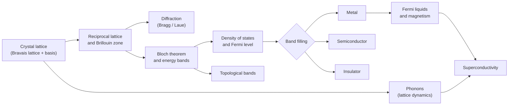

  <h1 style="color: white; margin: 0; font-size: 2rem;">Condensed Matter Physics</h1>
  
Exploring the Quantum World of Materials

**Condensed matter physics** studies the collective behavior of very large numbers of interacting particles in solids and liquids. It is the largest subfield of physics by number of practitioners, and it supplies the physics behind transistors, lasers, magnets, batteries, and superconducting qubits. This hub covers the foundations every other page builds on: how atoms arrange into crystals, how that periodicity turns electron energies into **bands**, and how band filling decides whether a solid is a metal, an insulator, or a semiconductor. The pages listed below extend this to lattice vibrations, magnetism, disorder, emergent and topological phases, experimental probes, and the many-body formalism.

The organizing idea of the field is P. W. Anderson's "more is different" (1972). Knowing everything about one electron and one ion does not tell you that $10^{23}$ of them will superconduct, order magnetically, or form a rigid solid. These **emergent** properties belong to the organization of the particles rather than to the particles themselves, and each comes with its own low-energy description: quasiparticles, order parameters, broken symmetries, and topological invariants.

## Pages in this section

| Page | Scope |
|---|---|
| [Lattice Dynamics & Phonons](lattice-dynamics.html) | Harmonic crystal, phonon dispersion, acoustic and optical branches, Debye and Einstein models, electron-phonon coupling |
| [Metals & Magnetism](metals-and-magnetism.html) | Drude, Sommerfeld and Fermi-liquid theory, Fermi surfaces, screening, exchange, Heisenberg and Ising models, spin waves |
| [Disorder & Localization](disorder-and-localization.html) | Anderson and weak localization, mobility edge, scaling theory, many-body localization |
| [Superconductivity, Quantum Hall & Topological Phases](emergent-phases.html) | Ginzburg-Landau and BCS theory, Josephson effects, integer and fractional quantum Hall effects, topological insulators, strongly correlated and soft matter |
| [Experimental Techniques](experimental-techniques.html) | ARPES, STM/STS, neutron and X-ray scattering, Raman and optics, local probes, quantum oscillations, transport, thermodynamics |
| [Graduate-Level Formalism](advanced-formalism.html) | Second quantization, Green's functions, BdG, quantum phase transitions, effective field theory, DFT/QMC/tensor networks |

The concepts on this page feed the rest of the section roughly as follows.

## Crystal structure

### Bravais lattices and bases

A **Bravais lattice** is the infinite set of points

$$\mathbf{R} = n_1\mathbf{a}_1 + n_2\mathbf{a}_2 + n_3\mathbf{a}_3, \qquad n_i \in \mathbb{Z},$$

generated by three **primitive vectors** $\mathbf{a}_i$. Every lattice point has an identical environment. A real **crystal structure** is a Bravais lattice plus a **basis**: the group of atoms attached to each lattice point. Diamond, for example, is an FCC lattice with a two-atom basis, and NaCl is an FCC lattice with a Na-Cl basis.

The **primitive cell** contains exactly one lattice point; its volume is $V_c = |\mathbf{a}_1\cdot(\mathbf{a}_2\times\mathbf{a}_3)|$. The **Wigner-Seitz cell**, the region closer to one lattice point than to any other, is the primitive cell with the full point symmetry of the lattice. Conventional cells, such as the cubes used for BCC and FCC, are larger but make the symmetry obvious.

Combining translations with point-group symmetries (rotations, reflections, inversion) leaves exactly **14 Bravais lattices** in three dimensions, grouped into **7 crystal systems**. Adding a basis and the glide and screw operations it permits gives the **230 space groups**, which classify every crystal.

| Crystal system | Cell constraints | Bravais lattices |
|---|---|---|
| Triclinic | $a \ne b \ne c$; $\alpha \ne \beta \ne \gamma$ | P |
| Monoclinic | $\alpha = \gamma = 90^\circ \ne \beta$ | P, C |
| Orthorhombic | $a \ne b \ne c$; all angles $90^\circ$ | P, C, I, F |
| Tetragonal | $a = b \ne c$; all angles $90^\circ$ | P, I |
| Trigonal (rhombohedral) | $a = b = c$; $\alpha = \beta = \gamma \ne 90^\circ$ | R |
| Hexagonal | $a = b \ne c$; $\gamma = 120^\circ$ | P |
| Cubic | $a = b = c$; all angles $90^\circ$ | P (SC), I (BCC), F (FCC) |

P = primitive, C = base-centered, I = body-centered, F = face-centered, R = rhombohedral.

<svg viewBox="0 0 600 230" role="img" aria-label="Simple cubic, body-centred cubic and face-centred cubic conventional cells" style="max-width:600px;width:100%;height:auto;display:block;margin:1rem auto;color:inherit" xmlns="http://www.w3.org/2000/svg"><text x="105" y="22" font-family="inherit" font-size="13" fill="currentColor" text-anchor="middle" font-weight="600">Simple cubic (SC)</text><line x1="30.0" y1="190.0" x2="70.0" y2="158.0" stroke="currentColor" stroke-width="1.4" stroke-dasharray="4 3" stroke-opacity="0.5"/><line x1="30.0" y1="190.0" x2="30.0" y2="80.0" stroke="currentColor" stroke-width="1.4"/><line x1="30.0" y1="190.0" x2="140.0" y2="190.0" stroke="currentColor" stroke-width="1.4"/><line x1="70.0" y1="158.0" x2="70.0" y2="48.0" stroke="currentColor" stroke-width="1.4" stroke-dasharray="4 3" stroke-opacity="0.5"/><line x1="70.0" y1="158.0" x2="180.0" y2="158.0" stroke="currentColor" stroke-width="1.4" stroke-dasharray="4 3" stroke-opacity="0.5"/><line x1="30.0" y1="80.0" x2="70.0" y2="48.0" stroke="currentColor" stroke-width="1.4"/><line x1="30.0" y1="80.0" x2="140.0" y2="80.0" stroke="currentColor" stroke-width="1.4"/><line x1="70.0" y1="48.0" x2="180.0" y2="48.0" stroke="currentColor" stroke-width="1.4"/><line x1="140.0" y1="190.0" x2="180.0" y2="158.0" stroke="currentColor" stroke-width="1.4"/><line x1="140.0" y1="190.0" x2="140.0" y2="80.0" stroke="currentColor" stroke-width="1.4"/><line x1="180.0" y1="158.0" x2="180.0" y2="48.0" stroke="currentColor" stroke-width="1.4"/><line x1="140.0" y1="80.0" x2="180.0" y2="48.0" stroke="currentColor" stroke-width="1.4"/><circle cx="30.0" cy="190.0" r="6" fill="currentColor" fill-opacity="0.85"/><circle cx="70.0" cy="158.0" r="6" fill="currentColor" fill-opacity="0.45"/><circle cx="30.0" cy="80.0" r="6" fill="currentColor" fill-opacity="0.85"/><circle cx="70.0" cy="48.0" r="6" fill="currentColor" fill-opacity="0.85"/><circle cx="140.0" cy="190.0" r="6" fill="currentColor" fill-opacity="0.85"/><circle cx="180.0" cy="158.0" r="6" fill="currentColor" fill-opacity="0.85"/><circle cx="140.0" cy="80.0" r="6" fill="currentColor" fill-opacity="0.85"/><circle cx="180.0" cy="48.0" r="6" fill="currentColor" fill-opacity="0.85"/><text x="105" y="220" font-family="inherit" font-size="13" fill="currentColor" font-size="12" text-anchor="middle">1 atom / cell · z = 6</text><text x="300" y="22" font-family="inherit" font-size="13" fill="currentColor" text-anchor="middle" font-weight="600">Body-centred (BCC)</text><line x1="225.0" y1="190.0" x2="265.0" y2="158.0" stroke="currentColor" stroke-width="1.4" stroke-dasharray="4 3" stroke-opacity="0.5"/><line x1="225.0" y1="190.0" x2="225.0" y2="80.0" stroke="currentColor" stroke-width="1.4"/><line x1="225.0" y1="190.0" x2="335.0" y2="190.0" stroke="currentColor" stroke-width="1.4"/><line x1="265.0" y1="158.0" x2="265.0" y2="48.0" stroke="currentColor" stroke-width="1.4" stroke-dasharray="4 3" stroke-opacity="0.5"/><line x1="265.0" y1="158.0" x2="375.0" y2="158.0" stroke="currentColor" stroke-width="1.4" stroke-dasharray="4 3" stroke-opacity="0.5"/><line x1="225.0" y1="80.0" x2="265.0" y2="48.0" stroke="currentColor" stroke-width="1.4"/><line x1="225.0" y1="80.0" x2="335.0" y2="80.0" stroke="currentColor" stroke-width="1.4"/><line x1="265.0" y1="48.0" x2="375.0" y2="48.0" stroke="currentColor" stroke-width="1.4"/><line x1="335.0" y1="190.0" x2="375.0" y2="158.0" stroke="currentColor" stroke-width="1.4"/><line x1="335.0" y1="190.0" x2="335.0" y2="80.0" stroke="currentColor" stroke-width="1.4"/><line x1="375.0" y1="158.0" x2="375.0" y2="48.0" stroke="currentColor" stroke-width="1.4"/><line x1="335.0" y1="80.0" x2="375.0" y2="48.0" stroke="currentColor" stroke-width="1.4"/><circle cx="225.0" cy="190.0" r="6" fill="currentColor" fill-opacity="0.85"/><circle cx="265.0" cy="158.0" r="6" fill="currentColor" fill-opacity="0.45"/><circle cx="225.0" cy="80.0" r="6" fill="currentColor" fill-opacity="0.85"/><circle cx="265.0" cy="48.0" r="6" fill="currentColor" fill-opacity="0.85"/><circle cx="335.0" cy="190.0" r="6" fill="currentColor" fill-opacity="0.85"/><circle cx="375.0" cy="158.0" r="6" fill="currentColor" fill-opacity="0.85"/><circle cx="335.0" cy="80.0" r="6" fill="currentColor" fill-opacity="0.85"/><circle cx="375.0" cy="48.0" r="6" fill="currentColor" fill-opacity="0.85"/><circle cx="300.0" cy="119.0" r="7" fill="#e8590c" fill-opacity="0.9"/><text x="300" y="220" font-family="inherit" font-size="13" fill="currentColor" font-size="12" text-anchor="middle">2 atoms / cell · z = 8</text><text x="495" y="22" font-family="inherit" font-size="13" fill="currentColor" text-anchor="middle" font-weight="600">Face-centred (FCC)</text><line x1="420.0" y1="190.0" x2="460.0" y2="158.0" stroke="currentColor" stroke-width="1.4" stroke-dasharray="4 3" stroke-opacity="0.5"/><line x1="420.0" y1="190.0" x2="420.0" y2="80.0" stroke="currentColor" stroke-width="1.4"/><line x1="420.0" y1="190.0" x2="530.0" y2="190.0" stroke="currentColor" stroke-width="1.4"/><line x1="460.0" y1="158.0" x2="460.0" y2="48.0" stroke="currentColor" stroke-width="1.4" stroke-dasharray="4 3" stroke-opacity="0.5"/><line x1="460.0" y1="158.0" x2="570.0" y2="158.0" stroke="currentColor" stroke-width="1.4" stroke-dasharray="4 3" stroke-opacity="0.5"/><line x1="420.0" y1="80.0" x2="460.0" y2="48.0" stroke="currentColor" stroke-width="1.4"/><line x1="420.0" y1="80.0" x2="530.0" y2="80.0" stroke="currentColor" stroke-width="1.4"/><line x1="460.0" y1="48.0" x2="570.0" y2="48.0" stroke="currentColor" stroke-width="1.4"/><line x1="530.0" y1="190.0" x2="570.0" y2="158.0" stroke="currentColor" stroke-width="1.4"/><line x1="530.0" y1="190.0" x2="530.0" y2="80.0" stroke="currentColor" stroke-width="1.4"/><line x1="570.0" y1="158.0" x2="570.0" y2="48.0" stroke="currentColor" stroke-width="1.4"/><line x1="530.0" y1="80.0" x2="570.0" y2="48.0" stroke="currentColor" stroke-width="1.4"/><circle cx="420.0" cy="190.0" r="6" fill="currentColor" fill-opacity="0.85"/><circle cx="460.0" cy="158.0" r="6" fill="currentColor" fill-opacity="0.45"/><circle cx="420.0" cy="80.0" r="6" fill="currentColor" fill-opacity="0.85"/><circle cx="460.0" cy="48.0" r="6" fill="currentColor" fill-opacity="0.85"/><circle cx="530.0" cy="190.0" r="6" fill="currentColor" fill-opacity="0.85"/><circle cx="570.0" cy="158.0" r="6" fill="currentColor" fill-opacity="0.85"/><circle cx="530.0" cy="80.0" r="6" fill="currentColor" fill-opacity="0.85"/><circle cx="570.0" cy="48.0" r="6" fill="currentColor" fill-opacity="0.85"/><circle cx="475.0" cy="135.0" r="7" fill="#e8590c" fill-opacity="0.9"/><circle cx="515.0" cy="103.0" r="7" fill="#e8590c" fill-opacity="0.9"/><circle cx="495.0" cy="174.0" r="7" fill="#e8590c" fill-opacity="0.9"/><circle cx="495.0" cy="64.0" r="7" fill="#e8590c" fill-opacity="0.9"/><circle cx="440.0" cy="119.0" r="7" fill="#e8590c" fill-opacity="0.9"/><circle cx="550.0" cy="119.0" r="7" fill="#e8590c" fill-opacity="0.9"/><text x="495" y="220" font-family="inherit" font-size="13" fill="currentColor" font-size="12" text-anchor="middle">4 atoms / cell · z = 12</text></svg>

| Structure | Atoms per conventional cell | Coordination number | Packing fraction | Examples |
|---|---|---|---|---|
| Simple cubic | 1 | 6 | 0.52 | $\alpha$-Po |
| BCC | 2 | 8 | 0.68 | Fe ($\alpha$), Na, W, Cr |
| FCC (cubic close-packed) | 4 | 12 | 0.74 | Cu, Al, Au, Ni |
| HCP | 2 (primitive cell) | 12 | 0.74 | Mg, Ti, Zn, Co |
| Diamond | 8 | 4 | 0.34 | C, Si, Ge |
| Zincblende | 8 (4 + 4) | 4 | 0.34 | GaAs, InP, ZnS |

FCC and HCP are the two ways of stacking close-packed planes (ABCABC and ABAB respectively) and share the maximum packing fraction $\pi/(3\sqrt{2}) \approx 0.74$.

### Miller indices

A lattice plane is labeled by **Miller indices** $(hkl)$: take the plane's intercepts with the axes in units of $a_1, a_2, a_3$, invert them, and clear fractions. The family of all planes with those indices is written $\{hkl\}$, a direction $[uvw]$, and a family of directions $\langle uvw\rangle$. The planes $(hkl)$ are perpendicular to the reciprocal lattice vector $\mathbf{G}_{hkl} = h\mathbf{b}_1 + k\mathbf{b}_2 + l\mathbf{b}_3$, and their spacing is

$$d_{hkl} = \frac{2\pi}{|\mathbf{G}_{hkl}|}, \qquad d_{hkl}^{\text{cubic}} = \frac{a}{\sqrt{h^2+k^2+l^2}}.$$

## Reciprocal lattice and Brillouin zone

The **reciprocal lattice** is the set of wavevectors $\mathbf{G}$ for which $e^{i\mathbf{G}\cdot\mathbf{R}} = 1$ for every lattice vector $\mathbf{R}$. Its primitive vectors satisfy $\mathbf{a}_i \cdot \mathbf{b}_j = 2\pi\delta_{ij}$:

$$\mathbf{b}_1 = 2\pi\,\frac{\mathbf{a}_2 \times \mathbf{a}_3}{V_c}, \qquad \mathbf{b}_2 = 2\pi\,\frac{\mathbf{a}_3 \times \mathbf{a}_1}{V_c}, \qquad \mathbf{b}_3 = 2\pi\,\frac{\mathbf{a}_1 \times \mathbf{a}_2}{V_c}.$$

Any function with the lattice periodicity, such as the crystal potential, is a Fourier series over reciprocal lattice vectors only: $V(\mathbf{r}) = \sum_{\mathbf{G}} V_{\mathbf{G}}\, e^{i\mathbf{G}\cdot\mathbf{r}}$. The reciprocal of an SC lattice is SC, the reciprocal of FCC is BCC, and vice versa. The reciprocal primitive cell has volume $(2\pi)^3/V_c$.

The **first Brillouin zone** (BZ) is the Wigner-Seitz cell of the reciprocal lattice. Electron and phonon states are labeled by a wavevector inside it, so band structures are plotted along paths joining its **high-symmetry points**. For the 2D square lattice the zone is a square of side $2\pi/a$, and the standard path is $\Gamma \to X \to M \to \Gamma$. For FCC crystals (Si, GaAs, Cu) the zone is a truncated octahedron with points $\Gamma$, X, L, W, K.

<figure>
<svg viewBox="0 0 420 350" role="img" aria-label="First Brillouin zone of the two-dimensional square lattice" style="max-width:420px;width:100%;height:auto;display:block;margin:1rem auto;color:inherit" xmlns="http://www.w3.org/2000/svg"><defs><marker id="bz-ar" markerWidth="8" markerHeight="8" refX="7" refY="4" orient="auto"><path d="M0,0 L8,4 L0,8 z" fill="currentColor"/></marker></defs><rect x="80" y="55" width="220" height="220" fill="currentColor" fill-opacity="0.08" stroke="currentColor" stroke-width="2.2"/><line x1="40" y1="165" x2="345" y2="165" stroke="currentColor" stroke-opacity="0.6" marker-end="url(#bz-ar)"/><line x1="190" y1="305" x2="190" y2="20" stroke="currentColor" stroke-opacity="0.6" marker-end="url(#bz-ar)"/><text x="350" y="169" font-family="inherit" font-size="13" fill="currentColor" font-style="italic">k<tspan baseline-shift="sub" font-size="10">x</tspan></text><text x="196" y="25" font-family="inherit" font-size="13" fill="currentColor" font-style="italic">k<tspan baseline-shift="sub" font-size="10">y</tspan></text><polygon points="190,165 300,165 300,55" fill="#e8590c" fill-opacity="0.18" stroke="#e8590c" stroke-width="2"/><circle cx="190" cy="165" r="4.5" fill="currentColor"/><text x="174" y="183" font-family="inherit" font-size="13" fill="currentColor" font-weight="600">&#915;</text><circle cx="300" cy="165" r="4.5" fill="currentColor"/><text x="308" y="183" font-family="inherit" font-size="13" fill="currentColor" font-weight="600">X</text><circle cx="300" cy="55" r="4.5" fill="currentColor"/><text x="308" y="49" font-family="inherit" font-size="13" fill="currentColor" font-weight="600">M</text><circle cx="190" cy="55" r="4.5" fill="currentColor"/><text x="196" y="47" font-family="inherit" font-size="13" fill="currentColor" font-weight="600">X</text><circle cx="80" cy="165" r="4.5" fill="currentColor"/><text x="62" y="183" font-family="inherit" font-size="13" fill="currentColor" font-weight="600">X</text><circle cx="190" cy="275" r="4.5" fill="currentColor"/><text x="196" y="293" font-family="inherit" font-size="13" fill="currentColor" font-weight="600">X</text><circle cx="80" cy="55" r="4.5" fill="currentColor"/><text x="60" y="49" font-family="inherit" font-size="13" fill="currentColor" font-weight="600">M</text><circle cx="300" cy="275" r="4.5" fill="currentColor"/><text x="308" y="291" font-family="inherit" font-size="13" fill="currentColor" font-weight="600">M</text><circle cx="80" cy="275" r="4.5" fill="currentColor"/><text x="60" y="291" font-family="inherit" font-size="13" fill="currentColor" font-weight="600">M</text><text x="10" y="344" font-family="inherit" font-size="13" fill="currentColor" font-size="12">&#915; = (0,0)   X = (&#960;/a, 0)   M = (&#960;/a, &#960;/a)   shaded: irreducible wedge#915; = (0, 0) &#183; X = (&#960;/a, 0) &#183; M = (&#960;/a, &#960;/a) &#183; shaded: irreducible wedge</text></svg>
<figcaption>First Brillouin zone of the square lattice. Band structures are usually plotted along the edges of the shaded irreducible wedge; the rest of the zone follows by symmetry.</figcaption>
</figure>

## Diffraction

Periodic arrays of atoms diffract waves whose wavelength is comparable to the lattice spacing: X-rays (about 1 Å), thermal neutrons, and electrons. Diffraction is how crystal structures are determined.

### Bragg and Laue conditions

Waves reflected from successive planes of spacing $d$ interfere constructively when the extra path length is a whole number of wavelengths:

$$2d\sin\theta = n\lambda .$$

<figure>
<svg viewBox="0 0 520 280" role="img" aria-label="Bragg reflection from two lattice planes separated by d" style="max-width:520px;width:100%;height:auto;display:block;margin:1rem auto;color:inherit" xmlns="http://www.w3.org/2000/svg"><defs><marker id="br-ar" markerWidth="8" markerHeight="8" refX="7" refY="4" orient="auto"><path d="M0,0 L8,4 L0,8 z" fill="currentColor"/></marker></defs><line x1="40" y1="90" x2="480" y2="90" stroke="currentColor" stroke-opacity="0.5"/><circle cx="60" cy="90" r="5" fill="currentColor" fill-opacity="0.55"/><circle cx="120" cy="90" r="5" fill="currentColor" fill-opacity="0.55"/><circle cx="180" cy="90" r="5" fill="currentColor" fill-opacity="0.55"/><circle cx="240" cy="90" r="5" fill="currentColor" fill-opacity="0.55"/><circle cx="300" cy="90" r="5" fill="currentColor" fill-opacity="0.55"/><circle cx="360" cy="90" r="5" fill="currentColor" fill-opacity="0.55"/><circle cx="420" cy="90" r="5" fill="currentColor" fill-opacity="0.55"/><line x1="40" y1="160" x2="480" y2="160" stroke="currentColor" stroke-opacity="0.5"/><circle cx="60" cy="160" r="5" fill="currentColor" fill-opacity="0.55"/><circle cx="120" cy="160" r="5" fill="currentColor" fill-opacity="0.55"/><circle cx="180" cy="160" r="5" fill="currentColor" fill-opacity="0.55"/><circle cx="240" cy="160" r="5" fill="currentColor" fill-opacity="0.55"/><circle cx="300" cy="160" r="5" fill="currentColor" fill-opacity="0.55"/><circle cx="360" cy="160" r="5" fill="currentColor" fill-opacity="0.55"/><circle cx="420" cy="160" r="5" fill="currentColor" fill-opacity="0.55"/><line x1="40" y1="230" x2="480" y2="230" stroke="currentColor" stroke-opacity="0.5"/><circle cx="60" cy="230" r="5" fill="currentColor" fill-opacity="0.55"/><circle cx="120" cy="230" r="5" fill="currentColor" fill-opacity="0.55"/><circle cx="180" cy="230" r="5" fill="currentColor" fill-opacity="0.55"/><circle cx="240" cy="230" r="5" fill="currentColor" fill-opacity="0.55"/><circle cx="300" cy="230" r="5" fill="currentColor" fill-opacity="0.55"/><circle cx="360" cy="230" r="5" fill="currentColor" fill-opacity="0.55"/><circle cx="420" cy="230" r="5" fill="currentColor" fill-opacity="0.55"/><line x1="72.8" y1="5.0" x2="220" y2="90" stroke="currentColor" stroke-width="2"/><line x1="220" y1="90" x2="367.2" y2="5.0" stroke="currentColor" stroke-width="2" marker-end="url(#br-ar)"/><line x1="72.8" y1="75.0" x2="220" y2="160" stroke="currentColor" stroke-width="2"/><line x1="220" y1="160" x2="367.2" y2="75.0" stroke="currentColor" stroke-width="2" marker-end="url(#br-ar)"/><line x1="220" y1="90" x2="189.7" y2="142.5" stroke="currentColor" stroke-dasharray="3 3"/><line x1="220" y1="90" x2="250.3" y2="142.5" stroke="currentColor" stroke-dasharray="3 3"/><path d="M189.7,142.5 L220,160 L250.3,142.5" fill="none" stroke="#e8590c" stroke-width="4" stroke-opacity="0.9"/><text x="238" y="182" font-family="inherit" font-size="13" fill="currentColor" fill="#e8590c">extra path 2d sin&#952;</text><path d="M182,90 A38,38 0 0,1 187.1,71.0" fill="none" stroke="currentColor"/><text x="164" y="84" font-family="inherit" font-size="13" fill="currentColor" font-style="italic">&#952;</text><path d="M258,90 A38,38 0 0,0 252.9,71.0" fill="none" stroke="currentColor"/><text x="264" y="84" font-family="inherit" font-size="13" fill="currentColor" font-style="italic">&#952;</text><line x1="495" y1="90" x2="495" y2="160" stroke="currentColor"/><line x1="489" y1="90" x2="501" y2="90" stroke="currentColor"/><line x1="489" y1="160" x2="501" y2="160" stroke="currentColor"/><text x="505" y="129.0" font-family="inherit" font-size="13" fill="currentColor" font-style="italic">d</text><text x="30" y="24" font-family="inherit" font-size="13" fill="currentColor">incident</text><text x="410" y="24" font-family="inherit" font-size="13" fill="currentColor">diffracted</text></svg>
<figcaption>Bragg construction. The ray reflected from the lower plane travels an extra distance 2d sin&#952; (highlighted); constructive interference requires this to equal n&#955;.</figcaption>
</figure>

The equivalent **Laue condition** states that the scattering vector must be a reciprocal lattice vector:

$$\mathbf{k}' - \mathbf{k} = \mathbf{G}, \qquad |\mathbf{k}'| = |\mathbf{k}| .$$

The Laue form generalizes directly to neutron and electron scattering and underlies the **Ewald sphere** construction: a reflection is excited when a reciprocal lattice point lies on a sphere of radius $|\mathbf{k}|$ centered on the tip of $-\mathbf{k}$.

### Structure factor and systematic absences

The intensity of reflection $\mathbf{G}$ is proportional to $|F_{\mathbf{G}}|^2$, where the **structure factor** sums over the atoms $j$ of the basis at positions $\mathbf{r}_j$ with atomic form factors $f_j$:

$$F_{\mathbf{G}} = \sum_j f_j\, e^{i\mathbf{G} \cdot \mathbf{r}_j} .$$

When a cubic crystal is described with its conventional cell, the extra lattice points make some $F_{hkl}$ vanish identically. These **systematic absences** identify the lattice type:

| Lattice | Allowed reflections $(hkl)$ | First allowed peaks |
|---|---|---|
| SC | all | (100), (110), (111) |
| BCC | $h+k+l$ even | (110), (200), (211) |
| FCC | $h,k,l$ all even or all odd | (111), (200), (220) |
| Diamond | FCC rule, and not $h+k+l = 4n+2$ | (111), (220), (311) |

Thermal vibrations reduce Bragg intensities by the **Debye-Waller factor** $e^{-2W}$ with $2W = \langle(\mathbf{G}\cdot\mathbf{u})^2\rangle$, without broadening the peaks. Modern structure determination relies on synchrotron X-ray and neutron sources; [Experimental Techniques](experimental-techniques.html) covers the probes that go beyond static structure.

The same lattice also vibrates. Its quantized normal modes, **phonons**, carry heat, scatter electrons, and provide the pairing interaction in conventional superconductors. They are treated on [Lattice Dynamics & Phonons](lattice-dynamics.html). The rest of this page covers what periodicity does to the electrons.

## Electronic band theory

### Bloch's theorem

For an electron in a potential with the lattice periodicity, $V(\mathbf{r}+\mathbf{R}) = V(\mathbf{r})$, every energy eigenstate can be chosen in the form

$$\psi_{n\mathbf{k}}(\mathbf{r}) = e^{i\mathbf{k} \cdot \mathbf{r}}\, u_{n\mathbf{k}}(\mathbf{r}), \qquad u_{n\mathbf{k}}(\mathbf{r}+\mathbf{R}) = u_{n\mathbf{k}}(\mathbf{r}).$$

The eigenstate is a plane wave modulated by a function with the periodicity of the lattice. The **crystal momentum** $\hbar\mathbf{k}$ is conserved modulo $\hbar\mathbf{G}$ and can be restricted to the first Brillouin zone. For each $\mathbf{k}$ the cell-periodic problem has a discrete spectrum labeled by the **band index** $n$. The resulting **band structure** $E_n(\mathbf{k})$ consists of smooth surfaces over the zone with $E_n(\mathbf{k}+\mathbf{G}) = E_n(\mathbf{k})$. Energies that no band reaches for any $\mathbf{k}$ form **band gaps**.

With periodic boundary conditions on a crystal of $N$ unit cells, $\mathbf{k}$ takes exactly $N$ values in the zone. Each band therefore holds $2N$ electrons once spin is counted. This counting argument drives the metal/insulator classification below.

Two complementary approximations explain where bands and gaps come from.

### Nearly-free-electron model

Start from free electrons, $E = \hbar^2k^2/2m$, and switch on a weak periodic potential. States $\mathbf{k}$ and $\mathbf{k}-\mathbf{G}$ are degenerate on the Bragg planes $|\mathbf{k}| = |\mathbf{k}-\mathbf{G}|$, which are exactly the Brillouin-zone boundaries. Degenerate perturbation theory in the two-plane-wave subspace gives

$$E_{\pm}(\mathbf{k}) = \frac{\epsilon^0_{\mathbf{k}} + \epsilon^0_{\mathbf{k}-\mathbf{G}}}{2} \pm \sqrt{\left(\frac{\epsilon^0_{\mathbf{k}} - \epsilon^0_{\mathbf{k}-\mathbf{G}}}{2}\right)^2 + |V_{\mathbf{G}}|^2}, \qquad \epsilon^0_{\mathbf{k}} = \frac{\hbar^2 k^2}{2m},$$

so at the zone boundary the degeneracy is lifted by a **gap** $\Delta E = 2|V_{\mathbf{G}}|$. The two standing-wave states at the gap edges concentrate charge on the ions and between them respectively, which is why their energies differ. Away from the boundaries the free-electron parabola is barely perturbed. This picture fits the simple metals (Na, Al) well.

<figure>
<svg viewBox="0 0 560 330" role="img" aria-label="Nearly-free-electron dispersion in the extended zone" style="max-width:560px;width:100%;height:auto;display:block;margin:1rem auto;color:inherit" xmlns="http://www.w3.org/2000/svg"><defs><marker id="nfe-ar" markerWidth="8" markerHeight="8" refX="7" refY="4" orient="auto"><path d="M0,0 L8,4 L0,8 z" fill="currentColor"/></marker></defs><line x1="60" y1="290" x2="535" y2="290" stroke="currentColor" marker-end="url(#nfe-ar)"/><line x1="290.0" y1="290" x2="290.0" y2="20" stroke="currentColor" marker-end="url(#nfe-ar)"/><text x="538" y="294" font-family="inherit" font-size="13" fill="currentColor" font-style="italic">k</text><text x="298.0" y="26" font-family="inherit" font-size="13" fill="currentColor" font-style="italic">E</text><line x1="90.0" y1="290" x2="90.0" y2="30" stroke="currentColor" stroke-opacity="0.35" stroke-dasharray="4 4"/><text x="90.0" y="308" font-family="inherit" font-size="13" fill="currentColor" text-anchor="middle">&#8722;2&#960;/a</text><line x1="190.0" y1="290" x2="190.0" y2="30" stroke="currentColor" stroke-opacity="0.35" stroke-dasharray="4 4"/><text x="190.0" y="308" font-family="inherit" font-size="13" fill="currentColor" text-anchor="middle">&#8722;&#960;/a</text><line x1="390.0" y1="290" x2="390.0" y2="30" stroke="currentColor" stroke-opacity="0.35" stroke-dasharray="4 4"/><text x="390.0" y="308" font-family="inherit" font-size="13" fill="currentColor" text-anchor="middle">&#960;/a</text><line x1="490.0" y1="290" x2="490.0" y2="30" stroke="currentColor" stroke-opacity="0.35" stroke-dasharray="4 4"/><text x="490.0" y="308" font-family="inherit" font-size="13" fill="currentColor" text-anchor="middle">2&#960;/a</text><path d="M67.7,33.0 L69.2,36.6 L70.8,40.1 L72.3,43.6 L73.8,47.0 L75.4,50.5 L76.9,53.9 L78.5,57.3 L80.0,60.7 L81.5,64.0 L83.1,67.4 L84.6,70.6 L86.2,73.9 L87.7,77.2 L89.2,80.4 L90.8,83.6 L92.3,86.8 L93.8,89.9 L95.4,93.0 L96.9,96.2 L98.5,99.2 L100.0,102.3 L101.5,105.3 L103.1,108.3 L104.6,111.3 L106.2,114.2 L107.7,117.2 L109.2,120.1 L110.8,123.0 L112.3,125.8 L113.8,128.6 L115.4,131.4 L116.9,134.2 L118.5,137.0 L120.0,139.7 L121.5,142.4 L123.1,145.1 L124.6,147.8 L126.2,150.4 L127.7,153.0 L129.2,155.6 L130.8,158.2 L132.3,160.7 L133.8,163.2 L135.4,165.7 L136.9,168.2 L138.5,170.6 L140.0,173.0 L141.5,175.4 L143.1,177.8 L144.6,180.1 L146.2,182.4 L147.7,184.7 L149.2,187.0 L150.8,189.2 L152.3,191.4 L153.8,193.6 L155.4,195.8 L156.9,197.9 L158.5,200.0 L160.0,202.1 L161.5,204.2 L163.1,206.2 L164.6,208.2 L166.2,210.2 L167.7,212.2 L169.2,214.2 L170.8,216.1 L172.3,218.0 L173.8,219.8 L175.4,221.7 L176.9,223.5 L178.5,225.3 L180.0,227.1 L181.5,228.8 L183.1,230.6 L184.6,232.2 L186.2,233.9 L187.7,235.6 L189.2,237.2 L190.8,238.8 L192.3,240.4 L193.8,241.9 L195.4,243.4 L196.9,245.0 L198.5,246.4 L200.0,247.9 L201.5,249.3 L203.1,250.7 L204.6,252.1 L206.2,253.4 L207.7,254.8 L209.2,256.1 L210.8,257.4 L212.3,258.6 L213.8,259.8 L215.4,261.0 L216.9,262.2 L218.5,263.4 L220.0,264.5 L221.5,265.6 L223.1,266.7 L224.6,267.8 L226.2,268.8 L227.7,269.8 L229.2,270.8 L230.8,271.8 L232.3,272.7 L233.8,273.6 L235.4,274.5 L236.9,275.4 L238.5,276.2 L240.0,277.0 L241.5,277.8 L243.1,278.6 L244.6,279.3 L246.2,280.0 L247.7,280.7 L249.2,281.4 L250.8,282.0 L252.3,282.6 L253.8,283.2 L255.4,283.8 L256.9,284.3 L258.5,284.8 L260.0,285.3 L261.5,285.8 L263.1,286.2 L264.6,286.6 L266.2,287.0 L267.7,287.4 L269.2,287.8 L270.8,288.1 L272.3,288.4 L273.8,288.6 L275.4,288.9 L276.9,289.1 L278.5,289.3 L280.0,289.5 L281.5,289.6 L283.1,289.8 L284.6,289.8 L286.2,289.9 L287.7,290.0 L289.2,290.0 L290.8,290.0 L292.3,290.0 L293.8,289.9 L295.4,289.8 L296.9,289.8 L298.5,289.6 L300.0,289.5 L301.5,289.3 L303.1,289.1 L304.6,288.9 L306.2,288.6 L307.7,288.4 L309.2,288.1 L310.8,287.8 L312.3,287.4 L313.8,287.0 L315.4,286.6 L316.9,286.2 L318.5,285.8 L320.0,285.3 L321.5,284.8 L323.1,284.3 L324.6,283.8 L326.2,283.2 L327.7,282.6 L329.2,282.0 L330.8,281.4 L332.3,280.7 L333.8,280.0 L335.4,279.3 L336.9,278.6 L338.5,277.8 L340.0,277.0 L341.5,276.2 L343.1,275.4 L344.6,274.5 L346.2,273.6 L347.7,272.7 L349.2,271.8 L350.8,270.8 L352.3,269.8 L353.8,268.8 L355.4,267.8 L356.9,266.7 L358.5,265.6 L360.0,264.5 L361.5,263.4 L363.1,262.2 L364.6,261.0 L366.2,259.8 L367.7,258.6 L369.2,257.4 L370.8,256.1 L372.3,254.8 L373.8,253.4 L375.4,252.1 L376.9,250.7 L378.5,249.3 L380.0,247.9 L381.5,246.4 L383.1,245.0 L384.6,243.4 L386.2,241.9 L387.7,240.4 L389.2,238.8 L390.8,237.2 L392.3,235.6 L393.8,233.9 L395.4,232.2 L396.9,230.6 L398.5,228.8 L400.0,227.1 L401.5,225.3 L403.1,223.5 L404.6,221.7 L406.2,219.8 L407.7,218.0 L409.2,216.1 L410.8,214.2 L412.3,212.2 L413.8,210.2 L415.4,208.2 L416.9,206.2 L418.5,204.2 L420.0,202.1 L421.5,200.0 L423.1,197.9 L424.6,195.8 L426.2,193.6 L427.7,191.4 L429.2,189.2 L430.8,187.0 L432.3,184.7 L433.8,182.4 L435.4,180.1 L436.9,177.8 L438.5,175.4 L440.0,173.0 L441.5,170.6 L443.1,168.2 L444.6,165.7 L446.2,163.2 L447.7,160.7 L449.2,158.2 L450.8,155.6 L452.3,153.0 L453.8,150.4 L455.4,147.8 L456.9,145.1 L458.5,142.4 L460.0,139.7 L461.5,137.0 L463.1,134.2 L464.6,131.4 L466.2,128.6 L467.7,125.8 L469.2,123.0 L470.8,120.1 L472.3,117.2 L473.8,114.2 L475.4,111.3 L476.9,108.3 L478.5,105.3 L480.0,102.3 L481.5,99.2 L483.1,96.2 L484.6,93.0 L486.2,89.9 L487.7,86.8 L489.2,83.6 L490.8,80.4 L492.3,77.2 L493.8,73.9 L495.4,70.6 L496.9,67.4 L498.5,64.0 L500.0,60.7 L501.5,57.3 L503.1,53.9 L504.6,50.5 L506.2,47.0 L507.7,43.6 L509.2,40.1 L510.8,36.6 L512.3,33.0" fill="none" stroke="currentColor" stroke-opacity="0.45" stroke-dasharray="5 4" stroke-width="1.5"/><path d="M190.0,254.8 L190.2,254.8 L190.5,254.8 L190.7,254.9 L191.0,254.9 L191.2,254.9 L191.5,254.9 L191.8,254.9 L192.0,255.0 L192.2,255.0 L192.5,255.0 L192.8,255.1 L193.0,255.1 L193.2,255.1 L193.5,255.2 L193.8,255.2 L194.0,255.3 L194.2,255.4 L194.5,255.4 L194.7,255.5 L195.0,255.6 L195.2,255.6 L195.5,255.7 L195.8,255.8 L196.0,255.9 L196.2,255.9 L196.5,256.0 L196.8,256.1 L197.0,256.2 L197.2,256.3 L197.5,256.4 L197.8,256.5 L198.0,256.6 L198.2,256.7 L198.5,256.8 L198.7,256.9 L199.0,257.0 L199.2,257.1 L199.5,257.3 L199.8,257.4 L200.0,257.5 L200.2,257.6 L200.5,257.7 L200.8,257.9 L201.0,258.0 L201.2,258.1 L201.5,258.2 L201.8,258.4 L202.0,258.5 L202.2,258.6 L202.5,258.8 L202.7,258.9 L203.0,259.0 L203.2,259.2 L203.5,259.3 L203.8,259.5 L204.0,259.6 L204.2,259.7 L204.5,259.9 L204.8,260.0 L205.0,260.2 L205.2,260.3 L205.5,260.5 L205.8,260.6 L206.0,260.8 L206.2,260.9 L206.5,261.1 L206.7,261.2 L207.0,261.4 L207.2,261.5 L207.5,261.7 L207.8,261.8 L208.0,262.0 L208.2,262.1 L208.5,262.3 L208.8,262.4 L209.0,262.6 L209.2,262.8 L209.5,262.9 L209.8,263.1 L210.0,263.2 L210.2,263.4 L210.5,263.5 L210.7,263.7 L211.0,263.9 L211.2,264.0 L211.5,264.2 L211.8,264.3 L212.0,264.5 L212.2,264.7 L212.5,264.8 L212.8,265.0 L213.0,265.1 L213.2,265.3 L213.5,265.4 L213.8,265.6 L214.0,265.8 L214.2,265.9 L214.5,266.1 L214.8,266.2 L215.0,266.4 L215.2,266.6 L215.5,266.7 L215.8,266.9 L216.0,267.0 L216.2,267.2 L216.5,267.4 L216.8,267.5 L217.0,267.7 L217.2,267.8 L217.5,268.0 L217.8,268.1 L218.0,268.3 L218.2,268.5 L218.5,268.6 L218.8,268.8 L219.0,268.9 L219.2,269.1 L219.5,269.2 L219.7,269.4 L220.0,269.5 L220.2,269.7 L220.5,269.9 L220.8,270.0 L221.0,270.2 L221.2,270.3 L221.5,270.5 L221.7,270.6 L222.0,270.8 L222.2,270.9 L222.5,271.1 L222.8,271.2 L223.0,271.4 L223.2,271.5 L223.5,271.7 L223.8,271.8 L224.0,272.0 L224.2,272.1 L224.5,272.3 L224.8,272.4 L225.0,272.6 L225.2,272.7 L225.5,272.9 L225.8,273.0 L226.0,273.2 L226.2,273.3 L226.5,273.5 L226.8,273.6 L227.0,273.8 L227.2,273.9 L227.5,274.1 L227.8,274.2 L228.0,274.4 L228.2,274.5 L228.5,274.6 L228.7,274.8 L229.0,274.9 L229.2,275.1 L229.5,275.2 L229.8,275.3 L230.0,275.5 L230.2,275.6 L230.5,275.8 L230.8,275.9 L231.0,276.0 L231.2,276.2 L231.5,276.3 L231.8,276.5 L232.0,276.6 L232.2,276.7 L232.5,276.9 L232.8,277.0 L233.0,277.1 L233.2,277.3 L233.5,277.4 L233.8,277.5 L234.0,277.7 L234.2,277.8 L234.5,277.9 L234.8,278.1 L235.0,278.2 L235.2,278.3 L235.5,278.5 L235.8,278.6 L236.0,278.7 L236.2,278.8 L236.5,279.0 L236.8,279.1 L237.0,279.2 L237.2,279.4 L237.5,279.5 L237.8,279.6 L238.0,279.7 L238.2,279.9 L238.5,280.0 L238.8,280.1 L239.0,280.2 L239.2,280.3 L239.5,280.5 L239.8,280.6 L240.0,280.7 L240.2,280.8 L240.5,280.9 L240.8,281.1 L241.0,281.2 L241.2,281.3 L241.5,281.4 L241.8,281.5 L242.0,281.7 L242.2,281.8 L242.5,281.9 L242.7,282.0 L243.0,282.1 L243.2,282.2 L243.5,282.3 L243.8,282.4 L244.0,282.6 L244.2,282.7 L244.5,282.8 L244.8,282.9 L245.0,283.0 L245.2,283.1 L245.5,283.2 L245.8,283.3 L246.0,283.4 L246.2,283.5 L246.5,283.6 L246.7,283.7 L247.0,283.9 L247.2,284.0 L247.5,284.1 L247.8,284.2 L248.0,284.3 L248.2,284.4 L248.5,284.5 L248.8,284.6 L249.0,284.7 L249.2,284.8 L249.5,284.9 L249.8,285.0 L250.0,285.1 L250.2,285.2 L250.5,285.3 L250.7,285.4 L251.0,285.5 L251.2,285.5 L251.5,285.6 L251.8,285.7 L252.0,285.8 L252.2,285.9 L252.5,286.0 L252.8,286.1 L253.0,286.2 L253.2,286.3 L253.5,286.4 L253.8,286.5 L254.0,286.6 L254.3,286.6 L254.5,286.7 L254.8,286.8 L255.0,286.9 L255.2,287.0 L255.5,287.1 L255.8,287.2 L256.0,287.2 L256.2,287.3 L256.5,287.4 L256.8,287.5 L257.0,287.6 L257.2,287.6 L257.5,287.7 L257.8,287.8 L258.0,287.9 L258.2,288.0 L258.5,288.0 L258.8,288.1 L259.0,288.2 L259.2,288.3 L259.5,288.3 L259.8,288.4 L260.0,288.5 L260.2,288.6 L260.5,288.6 L260.8,288.7 L261.0,288.8 L261.2,288.9 L261.5,288.9 L261.8,289.0 L262.0,289.1 L262.2,289.1 L262.5,289.2 L262.8,289.3 L263.0,289.3 L263.2,289.4 L263.5,289.5 L263.8,289.5 L264.0,289.6 L264.2,289.7 L264.5,289.7 L264.8,289.8 L265.0,289.8 L265.2,289.9 L265.5,290.0 L265.8,290.0 L266.0,290.1 L266.2,290.2 L266.5,290.2 L266.8,290.3 L267.0,290.3 L267.2,290.4 L267.5,290.4 L267.8,290.5 L268.0,290.5 L268.2,290.6 L268.5,290.7 L268.8,290.7 L269.0,290.8 L269.2,290.8 L269.5,290.9 L269.8,290.9 L270.0,291.0 L270.2,291.0 L270.5,291.1 L270.8,291.1 L271.0,291.2 L271.2,291.2 L271.5,291.2 L271.8,291.3 L272.0,291.3 L272.2,291.4 L272.5,291.4 L272.8,291.5 L273.0,291.5 L273.2,291.6 L273.5,291.6 L273.8,291.6 L274.0,291.7 L274.2,291.7 L274.5,291.8 L274.8,291.8 L275.0,291.8 L275.2,291.9 L275.5,291.9 L275.8,291.9 L276.0,292.0 L276.2,292.0 L276.5,292.0 L276.8,292.1 L277.0,292.1 L277.2,292.1 L277.5,292.2 L277.8,292.2 L278.0,292.2 L278.2,292.3 L278.5,292.3 L278.8,292.3 L279.0,292.3 L279.2,292.4 L279.5,292.4 L279.8,292.4 L280.0,292.4 L280.2,292.5 L280.5,292.5 L280.8,292.5 L281.0,292.5 L281.2,292.6 L281.5,292.6 L281.8,292.6 L282.0,292.6 L282.2,292.6 L282.5,292.7 L282.8,292.7 L283.0,292.7 L283.2,292.7 L283.5,292.7 L283.8,292.7 L284.0,292.8 L284.2,292.8 L284.5,292.8 L284.8,292.8 L285.0,292.8 L285.2,292.8 L285.5,292.8 L285.8,292.9 L286.0,292.9 L286.2,292.9 L286.5,292.9 L286.8,292.9 L287.0,292.9 L287.2,292.9 L287.5,292.9 L287.8,292.9 L288.0,292.9 L288.2,292.9 L288.5,292.9 L288.8,292.9 L289.0,292.9 L289.2,292.9 L289.5,292.9 L289.8,292.9 L290.0,292.9 L290.2,292.9 L290.5,292.9 L290.8,292.9 L291.0,292.9 L291.2,292.9 L291.5,292.9 L291.8,292.9 L292.0,292.9 L292.2,292.9 L292.5,292.9 L292.8,292.9 L293.0,292.9 L293.2,292.9 L293.5,292.9 L293.8,292.9 L294.0,292.9 L294.2,292.9 L294.5,292.8 L294.8,292.8 L295.0,292.8 L295.2,292.8 L295.5,292.8 L295.8,292.8 L296.0,292.8 L296.2,292.7 L296.5,292.7 L296.8,292.7 L297.0,292.7 L297.2,292.7 L297.5,292.7 L297.8,292.6 L298.0,292.6 L298.2,292.6 L298.5,292.6 L298.8,292.6 L299.0,292.5 L299.2,292.5 L299.5,292.5 L299.8,292.5 L300.0,292.4 L300.2,292.4 L300.5,292.4 L300.8,292.4 L301.0,292.3 L301.2,292.3 L301.5,292.3 L301.8,292.3 L302.0,292.2 L302.2,292.2 L302.5,292.2 L302.8,292.1 L303.0,292.1 L303.2,292.1 L303.5,292.0 L303.8,292.0 L304.0,292.0 L304.2,291.9 L304.5,291.9 L304.8,291.9 L305.0,291.8 L305.2,291.8 L305.5,291.8 L305.8,291.7 L306.0,291.7 L306.2,291.6 L306.5,291.6 L306.8,291.6 L307.0,291.5 L307.2,291.5 L307.5,291.4 L307.8,291.4 L308.0,291.3 L308.2,291.3 L308.5,291.2 L308.8,291.2 L309.0,291.2 L309.2,291.1 L309.5,291.1 L309.8,291.0 L310.0,291.0 L310.2,290.9 L310.5,290.9 L310.8,290.8 L311.0,290.8 L311.2,290.7 L311.5,290.7 L311.8,290.6 L312.0,290.5 L312.2,290.5 L312.5,290.4 L312.8,290.4 L313.0,290.3 L313.2,290.3 L313.5,290.2 L313.8,290.2 L314.0,290.1 L314.2,290.0 L314.5,290.0 L314.8,289.9 L315.0,289.8 L315.2,289.8 L315.5,289.7 L315.8,289.7 L316.0,289.6 L316.3,289.5 L316.5,289.5 L316.8,289.4 L317.0,289.3 L317.2,289.3 L317.5,289.2 L317.8,289.1 L318.0,289.1 L318.2,289.0 L318.5,288.9 L318.8,288.9 L319.0,288.8 L319.2,288.7 L319.5,288.6 L319.8,288.6 L320.0,288.5 L320.2,288.4 L320.5,288.3 L320.8,288.3 L321.0,288.2 L321.2,288.1 L321.5,288.0 L321.8,288.0 L322.0,287.9 L322.2,287.8 L322.5,287.7 L322.8,287.6 L323.0,287.6 L323.2,287.5 L323.5,287.4 L323.8,287.3 L324.0,287.2 L324.3,287.2 L324.5,287.1 L324.8,287.0 L325.0,286.9 L325.2,286.8 L325.5,286.7 L325.8,286.6 L326.0,286.6 L326.2,286.5 L326.5,286.4 L326.7,286.3 L327.0,286.2 L327.2,286.1 L327.5,286.0 L327.8,285.9 L328.0,285.8 L328.2,285.7 L328.5,285.6 L328.8,285.5 L329.0,285.5 L329.2,285.4 L329.5,285.3 L329.8,285.2 L330.0,285.1 L330.2,285.0 L330.5,284.9 L330.8,284.8 L331.0,284.7 L331.2,284.6 L331.5,284.5 L331.8,284.4 L332.0,284.3 L332.3,284.2 L332.5,284.1 L332.8,284.0 L333.0,283.9 L333.2,283.7 L333.5,283.6 L333.8,283.5 L334.0,283.4 L334.2,283.3 L334.5,283.2 L334.7,283.1 L335.0,283.0 L335.3,282.9 L335.5,282.8 L335.8,282.7 L336.0,282.6 L336.2,282.4 L336.5,282.3 L336.8,282.2 L337.0,282.1 L337.2,282.0 L337.5,281.9 L337.8,281.8 L338.0,281.7 L338.2,281.5 L338.5,281.4 L338.8,281.3 L339.0,281.2 L339.2,281.1 L339.5,280.9 L339.8,280.8 L340.0,280.7 L340.2,280.6 L340.5,280.5 L340.8,280.3 L341.0,280.2 L341.2,280.1 L341.5,280.0 L341.8,279.9 L342.0,279.7 L342.2,279.6 L342.5,279.5 L342.8,279.4 L343.0,279.2 L343.2,279.1 L343.5,279.0 L343.8,278.8 L344.0,278.7 L344.2,278.6 L344.5,278.5 L344.8,278.3 L345.0,278.2 L345.2,278.1 L345.5,277.9 L345.8,277.8 L346.0,277.7 L346.2,277.5 L346.5,277.4 L346.8,277.3 L347.0,277.1 L347.2,277.0 L347.5,276.9 L347.8,276.7 L348.0,276.6 L348.2,276.5 L348.5,276.3 L348.8,276.2 L349.0,276.0 L349.3,275.9 L349.5,275.8 L349.8,275.6 L350.0,275.5 L350.2,275.3 L350.5,275.2 L350.8,275.1 L351.0,274.9 L351.2,274.8 L351.5,274.6 L351.7,274.5 L352.0,274.4 L352.2,274.2 L352.5,274.1 L352.8,273.9 L353.0,273.8 L353.3,273.6 L353.5,273.5 L353.8,273.3 L354.0,273.2 L354.2,273.0 L354.5,272.9 L354.8,272.7 L355.0,272.6 L355.2,272.4 L355.5,272.3 L355.8,272.1 L356.0,272.0 L356.2,271.8 L356.5,271.7 L356.8,271.5 L357.0,271.4 L357.3,271.2 L357.5,271.1 L357.8,270.9 L358.0,270.8 L358.2,270.6 L358.5,270.5 L358.8,270.3 L359.0,270.2 L359.2,270.0 L359.5,269.9 L359.7,269.7 L360.0,269.5 L360.3,269.4 L360.5,269.2 L360.8,269.1 L361.0,268.9 L361.3,268.8 L361.5,268.6 L361.8,268.5 L362.0,268.3 L362.3,268.1 L362.5,268.0 L362.8,267.8 L363.0,267.7 L363.2,267.5 L363.5,267.4 L363.8,267.2 L364.0,267.0 L364.2,266.9 L364.5,266.7 L364.8,266.6 L365.0,266.4 L365.2,266.2 L365.5,266.1 L365.8,265.9 L366.0,265.8 L366.2,265.6 L366.5,265.4 L366.8,265.3 L367.0,265.1 L367.2,265.0 L367.5,264.8 L367.8,264.7 L368.0,264.5 L368.2,264.3 L368.5,264.2 L368.8,264.0 L369.0,263.9 L369.2,263.7 L369.5,263.5 L369.8,263.4 L370.0,263.2 L370.3,263.1 L370.5,262.9 L370.8,262.8 L371.0,262.6 L371.3,262.4 L371.5,262.3 L371.8,262.1 L372.0,262.0 L372.2,261.8 L372.5,261.7 L372.8,261.5 L373.0,261.4 L373.2,261.2 L373.5,261.1 L373.8,260.9 L374.0,260.8 L374.2,260.6 L374.5,260.5 L374.8,260.3 L375.0,260.2 L375.2,260.0 L375.5,259.9 L375.8,259.7 L376.0,259.6 L376.2,259.5 L376.5,259.3 L376.8,259.2 L377.0,259.0 L377.2,258.9 L377.5,258.8 L377.8,258.6 L378.0,258.5 L378.3,258.4 L378.5,258.2 L378.8,258.1 L379.0,258.0 L379.3,257.9 L379.5,257.7 L379.8,257.6 L380.0,257.5 L380.2,257.4 L380.5,257.3 L380.8,257.1 L381.0,257.0 L381.2,256.9 L381.5,256.8 L381.8,256.7 L382.0,256.6 L382.2,256.5 L382.5,256.4 L382.8,256.3 L383.0,256.2 L383.2,256.1 L383.5,256.0 L383.8,255.9 L384.0,255.9 L384.2,255.8 L384.5,255.7 L384.8,255.6 L385.0,255.6 L385.2,255.5 L385.5,255.4 L385.8,255.4 L386.0,255.3 L386.3,255.2 L386.5,255.2 L386.8,255.1 L387.0,255.1 L387.3,255.1 L387.5,255.0 L387.8,255.0 L388.0,255.0 L388.2,254.9 L388.5,254.9 L388.8,254.9 L389.0,254.9 L389.2,254.9 L389.5,254.8 L389.8,254.8 L390.0,254.8" fill="none" stroke="currentColor" stroke-width="2.4"/><path d="M90.0,98.2 L90.2,98.2 L90.5,98.2 L90.7,98.2 L91.0,98.3 L91.2,98.4 L91.5,98.4 L91.7,98.5 L92.0,98.7 L92.2,98.8 L92.5,98.9 L92.8,99.1 L93.0,99.2 L93.2,99.4 L93.5,99.6 L93.8,99.8 L94.0,100.0 L94.2,100.2 L94.5,100.5 L94.8,100.7 L95.0,101.0 L95.2,101.2 L95.5,101.5 L95.8,101.8 L96.0,102.1 L96.2,102.4 L96.5,102.7 L96.8,103.0 L97.0,103.3 L97.2,103.6 L97.5,104.0 L97.8,104.3 L98.0,104.6 L98.2,105.0 L98.5,105.3 L98.8,105.7 L99.0,106.0 L99.2,106.4 L99.5,106.8 L99.7,107.1 L100.0,107.5 L100.2,107.9 L100.5,108.3 L100.7,108.7 L101.0,109.0 L101.2,109.4 L101.5,109.8 L101.7,110.2 L102.0,110.6 L102.2,111.0 L102.5,111.4 L102.7,111.8 L103.0,112.2 L103.2,112.6 L103.5,113.0 L103.7,113.4 L104.0,113.9 L104.2,114.3 L104.5,114.7 L104.7,115.1 L105.0,115.5 L105.2,115.9 L105.5,116.3 L105.7,116.8 L106.0,117.2 L106.2,117.6 L106.5,118.0 L106.7,118.4 L107.0,118.9 L107.2,119.3 L107.5,119.7 L107.7,120.1 L108.0,120.6 L108.2,121.0 L108.5,121.4 L108.7,121.8 L109.0,122.3 L109.2,122.7 L109.5,123.1 L109.7,123.5 L110.0,124.0 L110.2,124.4 L110.5,124.8 L110.7,125.2 L111.0,125.7 L111.2,126.1 L111.5,126.5 L111.7,126.9 L112.0,127.4 L112.2,127.8 L112.5,128.2 L112.7,128.7 L113.0,129.1 L113.2,129.5 L113.5,129.9 L113.8,130.4 L114.0,130.8 L114.2,131.2 L114.5,131.6 L114.8,132.1 L115.0,132.5 L115.2,132.9 L115.5,133.3 L115.8,133.8 L116.0,134.2 L116.2,134.6 L116.5,135.0 L116.8,135.5 L117.0,135.9 L117.2,136.3 L117.5,136.7 L117.8,137.2 L118.0,137.6 L118.2,138.0 L118.5,138.4 L118.8,138.8 L119.0,139.3 L119.2,139.7 L119.5,140.1 L119.8,140.5 L120.0,140.9 L120.2,141.4 L120.5,141.8 L120.8,142.2 L121.0,142.6 L121.2,143.0 L121.5,143.4 L121.8,143.9 L122.0,144.3 L122.2,144.7 L122.5,145.1 L122.8,145.5 L123.0,145.9 L123.2,146.3 L123.5,146.8 L123.8,147.2 L124.0,147.6 L124.2,148.0 L124.5,148.4 L124.7,148.8 L125.0,149.2 L125.2,149.6 L125.5,150.0 L125.7,150.5 L126.0,150.9 L126.2,151.3 L126.5,151.7 L126.7,152.1 L127.0,152.5 L127.2,152.9 L127.5,153.3 L127.7,153.7 L128.0,154.1 L128.2,154.5 L128.5,154.9 L128.8,155.3 L129.0,155.7 L129.2,156.1 L129.5,156.5 L129.8,156.9 L130.0,157.3 L130.2,157.7 L130.5,158.1 L130.8,158.5 L131.0,158.9 L131.2,159.3 L131.5,159.7 L131.8,160.1 L132.0,160.5 L132.2,160.9 L132.5,161.3 L132.8,161.7 L133.0,162.1 L133.2,162.4 L133.5,162.8 L133.8,163.2 L134.0,163.6 L134.2,164.0 L134.5,164.4 L134.8,164.8 L135.0,165.2 L135.2,165.6 L135.5,165.9 L135.8,166.3 L136.0,166.7 L136.2,167.1 L136.5,167.5 L136.8,167.9 L137.0,168.2 L137.2,168.6 L137.5,169.0 L137.8,169.4 L138.0,169.8 L138.2,170.1 L138.5,170.5 L138.8,170.9 L139.0,171.3 L139.2,171.6 L139.5,172.0 L139.8,172.4 L140.0,172.8 L140.2,173.1 L140.5,173.5 L140.8,173.9 L141.0,174.3 L141.2,174.6 L141.5,175.0 L141.8,175.4 L142.0,175.7 L142.2,176.1 L142.5,176.5 L142.8,176.8 L143.0,177.2 L143.2,177.6 L143.5,177.9 L143.8,178.3 L144.0,178.7 L144.2,179.0 L144.5,179.4 L144.8,179.7 L145.0,180.1 L145.2,180.5 L145.5,180.8 L145.8,181.2 L146.0,181.5 L146.2,181.9 L146.5,182.2 L146.8,182.6 L147.0,182.9 L147.2,183.3 L147.5,183.6 L147.8,184.0 L148.0,184.3 L148.2,184.7 L148.5,185.0 L148.8,185.4 L149.0,185.7 L149.2,186.1 L149.5,186.4 L149.8,186.8 L150.0,187.1 L150.2,187.5 L150.5,187.8 L150.8,188.2 L151.0,188.5 L151.2,188.8 L151.5,189.2 L151.8,189.5 L152.0,189.9 L152.2,190.2 L152.5,190.5 L152.8,190.9 L153.0,191.2 L153.2,191.5 L153.5,191.9 L153.8,192.2 L154.0,192.5 L154.2,192.9 L154.5,193.2 L154.8,193.5 L155.0,193.8 L155.2,194.2 L155.5,194.5 L155.8,194.8 L156.0,195.1 L156.2,195.5 L156.5,195.8 L156.8,196.1 L157.0,196.4 L157.2,196.7 L157.5,197.1 L157.8,197.4 L158.0,197.7 L158.2,198.0 L158.5,198.3 L158.8,198.6 L159.0,199.0 L159.2,199.3 L159.5,199.6 L159.8,199.9 L160.0,200.2 L160.2,200.5 L160.5,200.8 L160.8,201.1 L161.0,201.4 L161.2,201.7 L161.5,202.0 L161.8,202.3 L162.0,202.6 L162.2,202.9 L162.5,203.2 L162.8,203.5 L163.0,203.8 L163.2,204.1 L163.5,204.4 L163.8,204.7 L164.0,205.0 L164.2,205.3 L164.5,205.6 L164.8,205.9 L165.0,206.2 L165.2,206.4 L165.5,206.7 L165.8,207.0 L166.0,207.3 L166.2,207.6 L166.5,207.9 L166.8,208.1 L167.0,208.4 L167.2,208.7 L167.5,209.0 L167.8,209.2 L168.0,209.5 L168.2,209.8 L168.5,210.0 L168.8,210.3 L169.0,210.6 L169.2,210.8 L169.5,211.1 L169.8,211.4 L170.0,211.6 L170.2,211.9 L170.5,212.1 L170.8,212.4 L171.0,212.6 L171.2,212.9 L171.5,213.2 L171.8,213.4 L172.0,213.6 L172.2,213.9 L172.5,214.1 L172.8,214.4 L173.0,214.6 L173.2,214.9 L173.5,215.1 L173.8,215.3 L174.0,215.6 L174.2,215.8 L174.5,216.0 L174.8,216.2 L175.0,216.5 L175.2,216.7 L175.5,216.9 L175.8,217.1 L176.0,217.3 L176.2,217.5 L176.5,217.8 L176.7,218.0 L177.0,218.2 L177.2,218.4 L177.5,218.6 L177.8,218.8 L178.0,219.0 L178.2,219.2 L178.5,219.4 L178.8,219.5 L179.0,219.7 L179.2,219.9 L179.5,220.1 L179.8,220.3 L180.0,220.4 L180.2,220.6 L180.5,220.8 L180.8,220.9 L181.0,221.1 L181.2,221.2 L181.5,221.4 L181.8,221.5 L182.0,221.7 L182.2,221.8 L182.5,222.0 L182.8,222.1 L183.0,222.2 L183.2,222.4 L183.5,222.5 L183.8,222.6 L184.0,222.7 L184.2,222.8 L184.5,222.9 L184.8,223.0 L185.0,223.1 L185.2,223.2 L185.5,223.3 L185.8,223.4 L186.0,223.5 L186.2,223.6 L186.5,223.6 L186.8,223.7 L187.0,223.8 L187.2,223.8 L187.5,223.9 L187.8,223.9 L188.0,224.0 L188.2,224.0 L188.5,224.0 L188.7,224.0 L189.0,224.1 L189.2,224.1 L189.5,224.1 L189.8,224.1 L190.0,224.1" fill="none" stroke="currentColor" stroke-width="2.4"/><path d="M390.0,224.1 L390.2,224.1 L390.5,224.1 L390.8,224.1 L391.0,224.1 L391.2,224.0 L391.5,224.0 L391.8,224.0 L392.0,224.0 L392.2,223.9 L392.5,223.9 L392.8,223.8 L393.0,223.8 L393.2,223.7 L393.5,223.6 L393.8,223.6 L394.0,223.5 L394.2,223.4 L394.5,223.3 L394.8,223.2 L395.0,223.1 L395.3,223.0 L395.5,222.9 L395.8,222.8 L396.0,222.7 L396.2,222.6 L396.5,222.5 L396.8,222.4 L397.0,222.2 L397.2,222.1 L397.5,222.0 L397.8,221.8 L398.0,221.7 L398.2,221.5 L398.5,221.4 L398.8,221.2 L399.0,221.1 L399.2,220.9 L399.5,220.8 L399.8,220.6 L400.0,220.4 L400.2,220.3 L400.5,220.1 L400.8,219.9 L401.0,219.7 L401.2,219.5 L401.5,219.4 L401.8,219.2 L402.0,219.0 L402.2,218.8 L402.5,218.6 L402.8,218.4 L403.0,218.2 L403.3,218.0 L403.5,217.8 L403.8,217.5 L404.0,217.3 L404.2,217.1 L404.5,216.9 L404.8,216.7 L405.0,216.5 L405.2,216.2 L405.5,216.0 L405.8,215.8 L406.0,215.6 L406.3,215.3 L406.5,215.1 L406.8,214.9 L407.0,214.6 L407.2,214.4 L407.5,214.1 L407.8,213.9 L408.0,213.6 L408.2,213.4 L408.5,213.2 L408.8,212.9 L409.0,212.6 L409.2,212.4 L409.5,212.1 L409.8,211.9 L410.0,211.6 L410.2,211.4 L410.5,211.1 L410.8,210.8 L411.0,210.6 L411.2,210.3 L411.5,210.0 L411.8,209.8 L412.0,209.5 L412.3,209.2 L412.5,209.0 L412.8,208.7 L413.0,208.4 L413.2,208.1 L413.5,207.9 L413.8,207.6 L414.0,207.3 L414.2,207.0 L414.5,206.7 L414.8,206.4 L415.0,206.2 L415.2,205.9 L415.5,205.6 L415.8,205.3 L416.0,205.0 L416.2,204.7 L416.5,204.4 L416.8,204.1 L417.0,203.8 L417.2,203.5 L417.5,203.2 L417.8,202.9 L418.0,202.6 L418.2,202.3 L418.5,202.0 L418.8,201.7 L419.0,201.4 L419.2,201.1 L419.5,200.8 L419.8,200.5 L420.0,200.2 L420.3,199.9 L420.5,199.6 L420.8,199.3 L421.0,199.0 L421.2,198.6 L421.5,198.3 L421.8,198.0 L422.0,197.7 L422.2,197.4 L422.5,197.1 L422.8,196.7 L423.0,196.4 L423.3,196.1 L423.5,195.8 L423.8,195.5 L424.0,195.1 L424.3,194.8 L424.5,194.5 L424.8,194.2 L425.0,193.8 L425.2,193.5 L425.5,193.2 L425.8,192.9 L426.0,192.5 L426.2,192.2 L426.5,191.9 L426.8,191.5 L427.0,191.2 L427.2,190.9 L427.5,190.5 L427.8,190.2 L428.0,189.9 L428.3,189.5 L428.5,189.2 L428.8,188.8 L429.0,188.5 L429.2,188.2 L429.5,187.8 L429.8,187.5 L430.0,187.1 L430.2,186.8 L430.5,186.4 L430.7,186.1 L431.0,185.7 L431.3,185.4 L431.5,185.0 L431.8,184.7 L432.0,184.3 L432.2,184.0 L432.5,183.6 L432.8,183.3 L433.0,182.9 L433.2,182.6 L433.5,182.2 L433.8,181.9 L434.0,181.5 L434.2,181.2 L434.5,180.8 L434.8,180.5 L435.0,180.1 L435.2,179.7 L435.5,179.4 L435.8,179.0 L436.0,178.7 L436.2,178.3 L436.5,177.9 L436.8,177.6 L437.0,177.2 L437.2,176.8 L437.5,176.5 L437.8,176.1 L438.0,175.7 L438.2,175.4 L438.5,175.0 L438.7,174.6 L439.0,174.3 L439.2,173.9 L439.5,173.5 L439.8,173.1 L440.0,172.8 L440.2,172.4 L440.5,172.0 L440.8,171.6 L441.0,171.3 L441.3,170.9 L441.5,170.5 L441.8,170.1 L442.0,169.8 L442.2,169.4 L442.5,169.0 L442.8,168.6 L443.0,168.2 L443.2,167.9 L443.5,167.5 L443.8,167.1 L444.0,166.7 L444.2,166.3 L444.5,165.9 L444.8,165.6 L445.0,165.2 L445.2,164.8 L445.5,164.4 L445.8,164.0 L446.0,163.6 L446.2,163.2 L446.5,162.8 L446.8,162.4 L447.0,162.1 L447.2,161.7 L447.5,161.3 L447.8,160.9 L448.0,160.5 L448.2,160.1 L448.5,159.7 L448.8,159.3 L449.0,158.9 L449.3,158.5 L449.5,158.1 L449.8,157.7 L450.0,157.3 L450.3,156.9 L450.5,156.5 L450.8,156.1 L451.0,155.7 L451.2,155.3 L451.5,154.9 L451.8,154.5 L452.0,154.1 L452.2,153.7 L452.5,153.3 L452.8,152.9 L453.0,152.5 L453.3,152.1 L453.5,151.7 L453.8,151.3 L454.0,150.9 L454.2,150.5 L454.5,150.0 L454.8,149.6 L455.0,149.2 L455.2,148.8 L455.5,148.4 L455.8,148.0 L456.0,147.6 L456.2,147.2 L456.5,146.8 L456.8,146.3 L457.0,145.9 L457.2,145.5 L457.5,145.1 L457.8,144.7 L458.0,144.3 L458.3,143.9 L458.5,143.4 L458.8,143.0 L459.0,142.6 L459.2,142.2 L459.5,141.8 L459.8,141.4 L460.0,140.9 L460.2,140.5 L460.5,140.1 L460.8,139.7 L461.0,139.3 L461.2,138.8 L461.5,138.4 L461.8,138.0 L462.0,137.6 L462.2,137.2 L462.5,136.7 L462.8,136.3 L463.0,135.9 L463.2,135.5 L463.5,135.0 L463.8,134.6 L464.0,134.2 L464.3,133.8 L464.5,133.3 L464.8,132.9 L465.0,132.5 L465.3,132.1 L465.5,131.6 L465.8,131.2 L466.0,130.8 L466.3,130.4 L466.5,129.9 L466.8,129.5 L467.0,129.1 L467.2,128.7 L467.5,128.2 L467.8,127.8 L468.0,127.4 L468.2,126.9 L468.5,126.5 L468.8,126.1 L469.0,125.7 L469.2,125.2 L469.5,124.8 L469.8,124.4 L470.0,124.0 L470.2,123.5 L470.5,123.1 L470.8,122.7 L471.0,122.3 L471.2,121.8 L471.5,121.4 L471.8,121.0 L472.0,120.6 L472.2,120.1 L472.5,119.7 L472.8,119.3 L473.0,118.9 L473.3,118.4 L473.5,118.0 L473.8,117.6 L474.0,117.2 L474.3,116.8 L474.5,116.3 L474.8,115.9 L475.0,115.5 L475.3,115.1 L475.5,114.7 L475.8,114.3 L476.0,113.9 L476.2,113.4 L476.5,113.0 L476.8,112.6 L477.0,112.2 L477.2,111.8 L477.5,111.4 L477.8,111.0 L478.0,110.6 L478.2,110.2 L478.5,109.8 L478.8,109.4 L479.0,109.0 L479.2,108.7 L479.5,108.3 L479.8,107.9 L480.0,107.5 L480.2,107.1 L480.5,106.8 L480.8,106.4 L481.0,106.0 L481.3,105.7 L481.5,105.3 L481.8,105.0 L482.0,104.6 L482.3,104.3 L482.5,104.0 L482.8,103.6 L483.0,103.3 L483.3,103.0 L483.5,102.7 L483.8,102.4 L484.0,102.1 L484.2,101.8 L484.5,101.5 L484.8,101.2 L485.0,101.0 L485.2,100.7 L485.5,100.5 L485.8,100.2 L486.0,100.0 L486.2,99.8 L486.5,99.6 L486.8,99.4 L487.0,99.2 L487.2,99.1 L487.5,98.9 L487.8,98.8 L488.0,98.7 L488.2,98.5 L488.5,98.4 L488.8,98.4 L489.0,98.3 L489.3,98.2 L489.5,98.2 L489.8,98.2 L490.0,98.2" fill="none" stroke="currentColor" stroke-width="2.4"/><path d="M490.0,64.7 L490.3,64.7 L490.5,64.6 L490.8,64.6 L491.0,64.5 L491.3,64.5 L491.5,64.4 L491.8,64.3 L492.0,64.1 L492.2,64.0 L492.5,63.9 L492.8,63.7 L493.0,63.5 L493.2,63.3 L493.5,63.1 L493.8,62.9 L494.0,62.6 L494.2,62.4 L494.5,62.1 L494.8,61.9 L495.0,61.6 L495.2,61.3 L495.5,61.0 L495.8,60.7 L496.0,60.4 L496.2,60.0 L496.5,59.7 L496.8,59.4 L497.0,59.0 L497.2,58.6 L497.5,58.3 L497.8,57.9 L498.0,57.5 L498.3,57.1 L498.5,56.7 L498.8,56.3 L499.0,55.9 L499.3,55.5 L499.5,55.1 L499.8,54.7 L500.0,54.3 L500.2,53.8 L500.5,53.4 L500.8,53.0 L501.0,52.5 L501.2,52.1 L501.5,51.6 L501.7,51.2 L502.0,50.7 L502.2,50.2 L502.5,49.8 L502.8,49.3 L503.0,48.8 L503.3,48.3 L503.5,47.9 L503.8,47.4 L504.0,46.9 L504.2,46.4 L504.5,45.9 L504.8,45.4 L505.0,44.9 L505.2,44.4 L505.5,43.9 L505.8,43.4 L506.0,42.9 L506.3,42.4 L506.5,41.9 L506.8,41.4 L507.0,40.9 L507.3,40.4 L507.5,39.9 L507.8,39.4 L508.0,38.8 L508.2,38.3 L508.5,37.8 L508.8,37.3 L509.0,36.8 L509.2,36.2 L509.5,35.7 L509.8,35.2 L510.0,34.6 L510.2,34.1 L510.5,33.6 L510.8,33.0 L511.0,32.5 L511.3,32.0 L511.5,31.4 L511.8,30.9 L512.0,30.3" fill="none" stroke="currentColor" stroke-width="2.4"/><path d="M68.0,30.3 L68.2,30.9 L68.5,31.4 L68.8,32.0 L69.0,32.5 L69.2,33.0 L69.5,33.6 L69.7,34.1 L70.0,34.6 L70.2,35.2 L70.5,35.7 L70.8,36.2 L71.0,36.8 L71.2,37.3 L71.5,37.8 L71.7,38.3 L72.0,38.8 L72.2,39.4 L72.5,39.9 L72.8,40.4 L73.0,40.9 L73.2,41.4 L73.5,41.9 L73.7,42.4 L74.0,42.9 L74.3,43.4 L74.5,43.9 L74.8,44.4 L75.0,44.9 L75.2,45.4 L75.5,45.9 L75.7,46.4 L76.0,46.9 L76.2,47.4 L76.5,47.9 L76.8,48.3 L77.0,48.8 L77.2,49.3 L77.5,49.8 L77.7,50.2 L78.0,50.7 L78.3,51.2 L78.5,51.6 L78.8,52.1 L79.0,52.5 L79.2,53.0 L79.5,53.4 L79.7,53.8 L80.0,54.3 L80.2,54.7 L80.5,55.1 L80.7,55.5 L81.0,55.9 L81.2,56.3 L81.5,56.7 L81.7,57.1 L82.0,57.5 L82.2,57.9 L82.5,58.3 L82.8,58.6 L83.0,59.0 L83.2,59.4 L83.5,59.7 L83.7,60.0 L84.0,60.4 L84.2,60.7 L84.5,61.0 L84.7,61.3 L85.0,61.6 L85.2,61.9 L85.5,62.1 L85.7,62.4 L86.0,62.6 L86.2,62.9 L86.5,63.1 L86.8,63.3 L87.0,63.5 L87.2,63.7 L87.5,63.9 L87.7,64.0 L88.0,64.1 L88.2,64.3 L88.5,64.4 L88.7,64.5 L89.0,64.5 L89.2,64.6 L89.5,64.6 L89.7,64.7 L90.0,64.7" fill="none" stroke="currentColor" stroke-width="2.4"/><rect x="387.0" y="224.1" width="6" height="30.7" fill="#e8590c" fill-opacity="0.85"/><text x="378.0" y="243.5" font-family="inherit" font-size="13" fill="currentColor" fill="#e8590c" text-anchor="end">gap &#8776; 2|V(2&#960;/a)|</text><rect x="487.0" y="64.7" width="6" height="33.5" fill="#e8590c" fill-opacity="0.85"/><text x="478.0" y="85.4" font-family="inherit" font-size="13" fill="currentColor" fill="#e8590c" text-anchor="end">gap &#8776; 2|V(4&#960;/a)|</text><text x="65.0" y="258.8" font-family="inherit" font-size="13" fill="currentColor" font-size="12">dashed: free electron</text></svg>
<figcaption>Nearly-free-electron bands in one dimension, drawn in the extended-zone scheme. Gaps open where the free parabola (dashed) crosses a zone boundary k = n&#960;/a; each gap is set by the corresponding Fourier component of the potential.</figcaption>
</figure>

### Tight-binding model

The opposite limit starts from localized atomic orbitals $\phi(\mathbf{r})$ and lets electrons hop between neighboring sites with amplitude $t$. The Bloch combination

$$\psi_{\mathbf{k}}(\mathbf{r}) = \frac{1}{\sqrt{N}}\sum_{\mathbf{R}} e^{i\mathbf{k} \cdot \mathbf{R}}\, \phi(\mathbf{r} - \mathbf{R})$$

broadens each atomic level $\epsilon_0$ into a band. With nearest-neighbor hopping on a simple cubic lattice,

$$E(\mathbf{k}) = \epsilon_0 - 2t\left[\cos(k_x a) + \cos(k_y a) + \cos(k_z a)\right].$$

The bandwidth is $W = 2zt$ for coordination number $z$: $4t$ in 1D, $8t$ on the square lattice, $12t$ on the cubic lattice. Narrow bands (small $t$), as in transition-metal $d$ and rare-earth $f$ states, are where electron-electron interactions compete with kinetic energy. That competition leads to the Hubbard model and Mott insulators covered on [Superconductivity, Quantum Hall & Topological Phases](emergent-phases.html). Well-separated orbitals give isolated bands; overlapping orbitals of different character hybridize, and the gaps between the resulting bands are what make covalent semiconductors such as Si insulating at $T=0$.

<figure>
<svg viewBox="0 0 560 290" role="img" aria-label="One-dimensional tight-binding band and its density of states" style="max-width:560px;width:100%;height:auto;display:block;margin:1rem auto;color:inherit" xmlns="http://www.w3.org/2000/svg"><defs><marker id="tb-ar" markerWidth="8" markerHeight="8" refX="7" refY="4" orient="auto"><path d="M0,0 L8,4 L0,8 z" fill="currentColor"/></marker></defs><line x1="70" y1="245" x2="315" y2="245" stroke="currentColor" marker-end="url(#tb-ar)"/><line x1="70" y1="245" x2="70" y2="25" stroke="currentColor" marker-end="url(#tb-ar)"/><text x="318" y="249" font-family="inherit" font-size="13" fill="currentColor" font-style="italic">k</text><text x="64" y="21" font-family="inherit" font-size="13" fill="currentColor" font-style="italic" text-anchor="middle">E</text><text x="70.0" y="263" font-family="inherit" font-size="13" fill="currentColor" text-anchor="middle">&#8722;&#960;/a</text><text x="185.0" y="263" font-family="inherit" font-size="13" fill="currentColor" text-anchor="middle">0</text><text x="300.0" y="263" font-family="inherit" font-size="13" fill="currentColor" text-anchor="middle">&#960;/a</text><line x1="70" y1="52.5" x2="300" y2="52.5" stroke="currentColor" stroke-opacity="0.25" stroke-dasharray="3 4"/><text x="64" y="56.5" font-family="inherit" font-size="13" fill="currentColor" text-anchor="end" font-size="12">&#949;&#8320;+2t</text><line x1="70" y1="140.0" x2="300" y2="140.0" stroke="currentColor" stroke-opacity="0.25" stroke-dasharray="3 4"/><text x="64" y="144.0" font-family="inherit" font-size="13" fill="currentColor" text-anchor="end" font-size="12">&#949;&#8320;</text><line x1="70" y1="227.5" x2="300" y2="227.5" stroke="currentColor" stroke-opacity="0.25" stroke-dasharray="3 4"/><text x="64" y="231.5" font-family="inherit" font-size="13" fill="currentColor" text-anchor="end" font-size="12">&#949;&#8320;&#8722;2t</text><path d="M70.0,52.5 L70.8,52.5 L71.5,52.6 L72.3,52.7 L73.1,52.8 L73.8,53.0 L74.6,53.2 L75.4,53.4 L76.2,53.7 L76.9,54.1 L77.7,54.4 L78.5,54.8 L79.2,55.3 L80.0,55.7 L80.8,56.3 L81.5,56.8 L82.3,57.4 L83.1,58.0 L83.8,58.7 L84.6,59.4 L85.4,60.1 L86.2,60.9 L86.9,61.7 L87.7,62.5 L88.5,63.4 L89.2,64.3 L90.0,65.2 L90.8,66.2 L91.5,67.2 L92.3,68.3 L93.1,69.3 L93.8,70.4 L94.6,71.5 L95.4,72.7 L96.2,73.9 L96.9,75.1 L97.7,76.4 L98.5,77.6 L99.2,78.9 L100.0,80.3 L100.8,81.6 L101.5,83.0 L102.3,84.4 L103.1,85.9 L103.8,87.3 L104.6,88.8 L105.4,90.3 L106.2,91.8 L106.9,93.4 L107.7,94.9 L108.5,96.5 L109.2,98.1 L110.0,99.7 L110.8,101.4 L111.5,103.0 L112.3,104.7 L113.1,106.4 L113.8,108.1 L114.6,109.8 L115.4,111.6 L116.2,113.3 L116.9,115.1 L117.7,116.8 L118.5,118.6 L119.2,120.4 L120.0,122.2 L120.8,124.0 L121.5,125.8 L122.3,127.6 L123.1,129.5 L123.8,131.3 L124.6,133.1 L125.4,134.9 L126.2,136.8 L126.9,138.6 L127.7,140.5 L128.5,142.3 L129.2,144.1 L130.0,146.0 L130.8,147.8 L131.5,149.6 L132.3,151.5 L133.1,153.3 L133.8,155.1 L134.6,156.9 L135.4,158.7 L136.2,160.5 L136.9,162.3 L137.7,164.0 L138.5,165.8 L139.2,167.6 L140.0,169.3 L140.8,171.0 L141.5,172.7 L142.3,174.4 L143.1,176.1 L143.8,177.8 L144.6,179.4 L145.4,181.1 L146.2,182.7 L146.9,184.3 L147.7,185.9 L148.5,187.4 L149.2,188.9 L150.0,190.5 L150.8,192.0 L151.5,193.4 L152.3,194.9 L153.1,196.3 L153.8,197.7 L154.6,199.0 L155.4,200.4 L156.2,201.7 L156.9,203.0 L157.7,204.3 L158.5,205.5 L159.2,206.7 L160.0,207.9 L160.8,209.0 L161.5,210.1 L162.3,211.2 L163.1,212.3 L163.8,213.3 L164.6,214.3 L165.4,215.2 L166.2,216.2 L166.9,217.0 L167.7,217.9 L168.5,218.7 L169.2,219.5 L170.0,220.3 L170.8,221.0 L171.5,221.6 L172.3,222.3 L173.1,222.9 L173.8,223.5 L174.6,224.0 L175.4,224.5 L176.2,225.0 L176.9,225.4 L177.7,225.8 L178.5,226.1 L179.2,226.4 L180.0,226.7 L180.8,226.9 L181.5,227.1 L182.3,227.3 L183.1,227.4 L183.8,227.5 L184.6,227.5 L185.4,227.5 L186.2,227.5 L186.9,227.4 L187.7,227.3 L188.5,227.1 L189.2,226.9 L190.0,226.7 L190.8,226.4 L191.5,226.1 L192.3,225.8 L193.1,225.4 L193.8,225.0 L194.6,224.5 L195.4,224.0 L196.2,223.5 L196.9,222.9 L197.7,222.3 L198.5,221.6 L199.2,221.0 L200.0,220.3 L200.8,219.5 L201.5,218.7 L202.3,217.9 L203.1,217.0 L203.8,216.2 L204.6,215.2 L205.4,214.3 L206.2,213.3 L206.9,212.3 L207.7,211.2 L208.5,210.1 L209.2,209.0 L210.0,207.9 L210.8,206.7 L211.5,205.5 L212.3,204.3 L213.1,203.0 L213.8,201.7 L214.6,200.4 L215.4,199.0 L216.2,197.7 L216.9,196.3 L217.7,194.9 L218.5,193.4 L219.2,192.0 L220.0,190.5 L220.8,188.9 L221.5,187.4 L222.3,185.9 L223.1,184.3 L223.8,182.7 L224.6,181.1 L225.4,179.4 L226.2,177.8 L226.9,176.1 L227.7,174.4 L228.5,172.7 L229.2,171.0 L230.0,169.3 L230.8,167.6 L231.5,165.8 L232.3,164.0 L233.1,162.3 L233.8,160.5 L234.6,158.7 L235.4,156.9 L236.2,155.1 L236.9,153.3 L237.7,151.5 L238.5,149.6 L239.2,147.8 L240.0,146.0 L240.8,144.1 L241.5,142.3 L242.3,140.5 L243.1,138.6 L243.8,136.8 L244.6,134.9 L245.4,133.1 L246.2,131.3 L246.9,129.5 L247.7,127.6 L248.5,125.8 L249.2,124.0 L250.0,122.2 L250.8,120.4 L251.5,118.6 L252.3,116.8 L253.1,115.1 L253.8,113.3 L254.6,111.6 L255.4,109.8 L256.2,108.1 L256.9,106.4 L257.7,104.7 L258.5,103.0 L259.2,101.4 L260.0,99.7 L260.8,98.1 L261.5,96.5 L262.3,94.9 L263.1,93.4 L263.8,91.8 L264.6,90.3 L265.4,88.8 L266.2,87.3 L266.9,85.9 L267.7,84.4 L268.5,83.0 L269.2,81.6 L270.0,80.3 L270.8,78.9 L271.5,77.6 L272.3,76.4 L273.1,75.1 L273.8,73.9 L274.6,72.7 L275.4,71.5 L276.2,70.4 L276.9,69.3 L277.7,68.3 L278.5,67.2 L279.2,66.2 L280.0,65.2 L280.8,64.3 L281.5,63.4 L282.3,62.5 L283.1,61.7 L283.8,60.9 L284.6,60.1 L285.4,59.4 L286.2,58.7 L286.9,58.0 L287.7,57.4 L288.5,56.8 L289.2,56.3 L290.0,55.7 L290.8,55.3 L291.5,54.8 L292.3,54.4 L293.1,54.1 L293.8,53.7 L294.6,53.4 L295.4,53.2 L296.2,53.0 L296.9,52.8 L297.7,52.7 L298.5,52.6 L299.2,52.5 L300.0,52.5" fill="none" stroke="currentColor" stroke-width="2.4"/><line x1="308" y1="52.5" x2="308" y2="227.5" stroke="#e8590c" stroke-width="2"/><text x="314" y="144.0" font-family="inherit" font-size="13" fill="currentColor" fill="#e8590c">W = 4t</text><line x1="360" y1="245" x2="360" y2="25" stroke="currentColor" marker-end="url(#tb-ar)"/><line x1="360" y1="245" x2="535" y2="245" stroke="currentColor" marker-end="url(#tb-ar)"/><text x="530" y="263" font-family="inherit" font-size="13" fill="currentColor" font-style="italic" text-anchor="end">g(E)</text><path d="M360.0,226.8 L507.2,226.8 L474.3,226.4 L456.8,226.0 L445.5,225.5 L437.4,225.1 L431.3,224.7 L426.5,224.2 L422.5,223.8 L419.2,223.4 L416.4,222.9 L414.0,222.5 L411.8,222.1 L409.9,221.6 L408.3,221.2 L406.7,220.7 L405.4,220.3 L404.1,219.9 L402.9,219.4 L401.9,219.0 L400.9,218.6 L400.0,218.1 L399.1,217.7 L398.4,217.3 L397.6,216.8 L396.9,216.4 L396.3,216.0 L395.6,215.5 L395.1,215.1 L394.5,214.7 L394.0,214.2 L393.5,213.8 L393.0,213.3 L392.6,212.9 L392.1,212.5 L391.7,212.0 L391.3,211.6 L390.9,211.2 L390.6,210.7 L390.2,210.3 L389.9,209.9 L389.6,209.4 L389.3,209.0 L389.0,208.6 L388.7,208.1 L388.4,207.7 L388.1,207.3 L387.9,206.8 L387.6,206.4 L387.4,205.9 L387.2,205.5 L386.9,205.1 L386.7,204.6 L386.5,204.2 L386.3,203.8 L386.1,203.3 L385.9,202.9 L385.7,202.5 L385.5,202.0 L385.3,201.6 L385.2,201.2 L385.0,200.7 L384.8,200.3 L384.7,199.9 L384.5,199.4 L384.4,199.0 L384.2,198.5 L384.1,198.1 L383.9,197.7 L383.8,197.2 L383.7,196.8 L383.5,196.4 L383.4,195.9 L383.3,195.5 L383.2,195.1 L383.0,194.6 L382.9,194.2 L382.8,193.8 L382.7,193.3 L382.6,192.9 L382.5,192.5 L382.4,192.0 L382.3,191.6 L382.2,191.1 L382.1,190.7 L382.0,190.3 L381.9,189.8 L381.8,189.4 L381.7,189.0 L381.6,188.5 L381.5,188.1 L381.5,187.7 L381.4,187.2 L381.3,186.8 L381.2,186.4 L381.1,185.9 L381.1,185.5 L381.0,185.1 L380.9,184.6 L380.9,184.2 L380.8,183.7 L380.7,183.3 L380.6,182.9 L380.6,182.4 L380.5,182.0 L380.5,181.6 L380.4,181.1 L380.3,180.7 L380.3,180.3 L380.2,179.8 L380.2,179.4 L380.1,179.0 L380.0,178.5 L380.0,178.1 L379.9,177.7 L379.9,177.2 L379.8,176.8 L379.8,176.3 L379.7,175.9 L379.7,175.5 L379.6,175.0 L379.6,174.6 L379.6,174.2 L379.5,173.7 L379.5,173.3 L379.4,172.9 L379.4,172.4 L379.3,172.0 L379.3,171.6 L379.3,171.1 L379.2,170.7 L379.2,170.3 L379.1,169.8 L379.1,169.4 L379.1,168.9 L379.0,168.5 L379.0,168.1 L379.0,167.6 L378.9,167.2 L378.9,166.8 L378.9,166.3 L378.8,165.9 L378.8,165.5 L378.8,165.0 L378.8,164.6 L378.7,164.2 L378.7,163.7 L378.7,163.3 L378.6,162.9 L378.6,162.4 L378.6,162.0 L378.6,161.5 L378.5,161.1 L378.5,160.7 L378.5,160.2 L378.5,159.8 L378.5,159.4 L378.4,158.9 L378.4,158.5 L378.4,158.1 L378.4,157.6 L378.4,157.2 L378.3,156.8 L378.3,156.3 L378.3,155.9 L378.3,155.5 L378.3,155.0 L378.3,154.6 L378.2,154.1 L378.2,153.7 L378.2,153.3 L378.2,152.8 L378.2,152.4 L378.2,152.0 L378.2,151.5 L378.1,151.1 L378.1,150.7 L378.1,150.2 L378.1,149.8 L378.1,149.4 L378.1,148.9 L378.1,148.5 L378.1,148.1 L378.1,147.6 L378.1,147.2 L378.1,146.7 L378.0,146.3 L378.0,145.9 L378.0,145.4 L378.0,145.0 L378.0,144.6 L378.0,144.1 L378.0,143.7 L378.0,143.3 L378.0,142.8 L378.0,142.4 L378.0,142.0 L378.0,141.5 L378.0,141.1 L378.0,140.7 L378.0,140.2 L378.0,139.8 L378.0,139.3 L378.0,138.9 L378.0,138.5 L378.0,138.0 L378.0,137.6 L378.0,137.2 L378.0,136.7 L378.0,136.3 L378.0,135.9 L378.0,135.4 L378.0,135.0 L378.0,134.6 L378.0,134.1 L378.0,133.7 L378.1,133.3 L378.1,132.8 L378.1,132.4 L378.1,131.9 L378.1,131.5 L378.1,131.1 L378.1,130.6 L378.1,130.2 L378.1,129.8 L378.1,129.3 L378.1,128.9 L378.2,128.5 L378.2,128.0 L378.2,127.6 L378.2,127.2 L378.2,126.7 L378.2,126.3 L378.2,125.9 L378.3,125.4 L378.3,125.0 L378.3,124.5 L378.3,124.1 L378.3,123.7 L378.3,123.2 L378.4,122.8 L378.4,122.4 L378.4,121.9 L378.4,121.5 L378.4,121.1 L378.5,120.6 L378.5,120.2 L378.5,119.8 L378.5,119.3 L378.5,118.9 L378.6,118.5 L378.6,118.0 L378.6,117.6 L378.6,117.1 L378.7,116.7 L378.7,116.3 L378.7,115.8 L378.8,115.4 L378.8,115.0 L378.8,114.5 L378.8,114.1 L378.9,113.7 L378.9,113.2 L378.9,112.8 L379.0,112.4 L379.0,111.9 L379.0,111.5 L379.1,111.1 L379.1,110.6 L379.1,110.2 L379.2,109.7 L379.2,109.3 L379.3,108.9 L379.3,108.4 L379.3,108.0 L379.4,107.6 L379.4,107.1 L379.5,106.7 L379.5,106.3 L379.6,105.8 L379.6,105.4 L379.6,105.0 L379.7,104.5 L379.7,104.1 L379.8,103.7 L379.8,103.2 L379.9,102.8 L379.9,102.3 L380.0,101.9 L380.0,101.5 L380.1,101.0 L380.2,100.6 L380.2,100.2 L380.3,99.7 L380.3,99.3 L380.4,98.9 L380.5,98.4 L380.5,98.0 L380.6,97.6 L380.6,97.1 L380.7,96.7 L380.8,96.3 L380.9,95.8 L380.9,95.4 L381.0,94.9 L381.1,94.5 L381.1,94.1 L381.2,93.6 L381.3,93.2 L381.4,92.8 L381.5,92.3 L381.5,91.9 L381.6,91.5 L381.7,91.0 L381.8,90.6 L381.9,90.2 L382.0,89.7 L382.1,89.3 L382.2,88.9 L382.3,88.4 L382.4,88.0 L382.5,87.5 L382.6,87.1 L382.7,86.7 L382.8,86.2 L382.9,85.8 L383.0,85.4 L383.2,84.9 L383.3,84.5 L383.4,84.1 L383.5,83.6 L383.7,83.2 L383.8,82.8 L383.9,82.3 L384.1,81.9 L384.2,81.5 L384.4,81.0 L384.5,80.6 L384.7,80.1 L384.8,79.7 L385.0,79.3 L385.2,78.8 L385.3,78.4 L385.5,78.0 L385.7,77.5 L385.9,77.1 L386.1,76.7 L386.3,76.2 L386.5,75.8 L386.7,75.4 L386.9,74.9 L387.2,74.5 L387.4,74.1 L387.6,73.6 L387.9,73.2 L388.1,72.7 L388.4,72.3 L388.7,71.9 L389.0,71.4 L389.3,71.0 L389.6,70.6 L389.9,70.1 L390.2,69.7 L390.6,69.3 L390.9,68.8 L391.3,68.4 L391.7,68.0 L392.1,67.5 L392.6,67.1 L393.0,66.7 L393.5,66.2 L394.0,65.8 L394.5,65.3 L395.1,64.9 L395.6,64.5 L396.3,64.0 L396.9,63.6 L397.6,63.2 L398.4,62.7 L399.1,62.3 L400.0,61.9 L400.9,61.4 L401.9,61.0 L402.9,60.6 L404.1,60.1 L405.4,59.7 L406.7,59.3 L408.3,58.8 L409.9,58.4 L411.8,57.9 L414.0,57.5 L416.4,57.1 L419.2,56.6 L422.5,56.2 L426.5,55.8 L431.3,55.3 L437.4,54.9 L445.5,54.5 L456.8,54.0 L474.3,53.6 L507.2,53.2 L360.0,53.2 Z" fill="currentColor" fill-opacity="0.12" stroke="currentColor" stroke-width="2"/><line x1="360" y1="52.5" x2="520" y2="52.5" stroke="currentColor" stroke-opacity="0.25" stroke-dasharray="3 4"/><line x1="360" y1="227.5" x2="520" y2="227.5" stroke="currentColor" stroke-opacity="0.25" stroke-dasharray="3 4"/><text x="415.0" y="72.2" font-family="inherit" font-size="13" fill="currentColor" fill="#e8590c">Van Hove</text><text x="415.0" y="87.5" font-family="inherit" font-size="13" fill="currentColor" fill="#e8590c">singularities</text><text x="415.0" y="196.9" font-family="inherit" font-size="13" fill="currentColor" fill="#e8590c">(band edges)</text></svg>
<figcaption>One-dimensional tight-binding band E(k) = &#949;&#8320; &#8722; 2t cos ka (left) and its density of states (right). The flat band extrema produce inverse-square-root Van Hove singularities at the band edges.</figcaption>
</figure>

In practice, band structures of real materials are computed with density functional theory (DFT) and refined with many-body corrections such as GW or DMFT. [Electronic Structure Beyond DFT](../computational-physics/electronic-structure-beyond-dft.html) describes these methods.

### Semiclassical dynamics, effective mass, and holes

A wavepacket built from states near $\mathbf{k}$ in band $n$ moves with the **group velocity**, and its crystal momentum responds to external forces:

$$\mathbf{v}_n(\mathbf{k}) = \frac{1}{\hbar}\nabla_{\mathbf{k}} E_n(\mathbf{k}), \qquad \hbar\,\dot{\mathbf{k}} = -e\left(\mathbf{E} + \mathbf{v}\times\mathbf{B}\right).$$

Near a band extremum the dispersion is quadratic and defines an **effective mass tensor**:

$$\left(\frac{1}{m^*}\right)_{ij} = \frac{1}{\hbar^2}\frac{\partial^2 E_n}{\partial k_i\, \partial k_j} .$$

The effective mass absorbs the effect of the periodic potential, so carriers near band edges behave as free particles with mass $m^*$. Typical values are $0.067\,m_e$ for electrons in GaAs, and up to hundreds of $m_e$ in heavy-fermion compounds. A full band carries no current. A nearly full band is described as a small number of **holes**: quasiparticles with positive charge and positive effective mass at the top of the band. This is why the Hall coefficient of some metals and all p-type semiconductors has the "wrong" sign. The full semiclassical equations also include an anomalous velocity from the Berry curvature, $-\dot{\mathbf{k}}\times\boldsymbol{\Omega}_n(\mathbf{k})$, which is the starting point for the anomalous Hall effect and topological band theory.

## Metals, insulators, and semiconductors

Because each band holds $2N$ electrons, the ground state follows from counting. If the valence electrons fill some bands completely and leave the rest empty, there is a gap at the Fermi level and the solid is an insulator. If a band is partly filled, states exist just above the Fermi energy $E_F$ and the solid is a metal. An odd number of electrons per primitive cell therefore forces a metal in band theory, unless strong interactions intervene (a **Mott insulator**). An even number permits either outcome, depending on whether bands overlap: Mg and Ca are metals despite having two valence electrons per atom.

<figure>
<svg viewBox="0 0 600 260" role="img" aria-label="Band filling in a metal, a semiconductor and an insulator" style="max-width:600px;width:100%;height:auto;display:block;margin:1rem auto;color:inherit" xmlns="http://www.w3.org/2000/svg"><text x="100" y="24" font-family="inherit" font-size="13" fill="currentColor" text-anchor="middle" font-weight="600">Metal</text><rect x="40" y="40" width="120" height="70" fill="none" stroke="currentColor" stroke-width="1.6"/><rect x="40" y="68.0" width="120" height="42.0" fill="currentColor" fill-opacity="0.35"/><line x1="28" y1="66" x2="172" y2="66" stroke="#e8590c" stroke-dasharray="6 4" stroke-width="1.6"/><text x="26" y="70" font-family="inherit" font-size="13" fill="currentColor" font-size="12" text-anchor="end" fill="#e8590c">E<tspan baseline-shift="sub" font-size="9">F</tspan></text><text x="290" y="24" font-family="inherit" font-size="13" fill="currentColor" text-anchor="middle" font-weight="600">Semiconductor</text><rect x="230" y="150" width="120" height="50" fill="none" stroke="currentColor" stroke-width="1.6"/><rect x="230" y="150.0" width="120" height="50.0" fill="currentColor" fill-opacity="0.35"/><rect x="230" y="40" width="120" height="85" fill="none" stroke="currentColor" stroke-width="1.6"/><text x="358" y="141.5" font-family="inherit" font-size="13" fill="currentColor" font-size="12" fill="#e8590c">E<tspan baseline-shift="sub" font-size="9">g</tspan></text><line x1="354" y1="125" x2="354" y2="150" stroke="#e8590c" stroke-width="2"/><line x1="218" y1="137.5" x2="362" y2="137.5" stroke="#e8590c" stroke-dasharray="6 4" stroke-width="1.6"/><text x="216" y="141.5" font-family="inherit" font-size="13" fill="currentColor" font-size="12" text-anchor="end" fill="#e8590c">E<tspan baseline-shift="sub" font-size="9">F</tspan></text><text x="480" y="24" font-family="inherit" font-size="13" fill="currentColor" text-anchor="middle" font-weight="600">Insulator</text><rect x="420" y="170" width="120" height="35" fill="none" stroke="currentColor" stroke-width="1.6"/><rect x="420" y="170.0" width="120" height="35.0" fill="currentColor" fill-opacity="0.35"/><rect x="420" y="40" width="120" height="50" fill="none" stroke="currentColor" stroke-width="1.6"/><text x="548" y="134.0" font-family="inherit" font-size="13" fill="currentColor" font-size="12" fill="#e8590c">E<tspan baseline-shift="sub" font-size="9">g</tspan></text><line x1="544" y1="90" x2="544" y2="170" stroke="#e8590c" stroke-width="2"/><line x1="408" y1="130.0" x2="552" y2="130.0" stroke="#e8590c" stroke-dasharray="6 4" stroke-width="1.6"/><text x="406" y="134.0" font-family="inherit" font-size="13" fill="currentColor" font-size="12" text-anchor="end" fill="#e8590c">E<tspan baseline-shift="sub" font-size="9">F</tspan></text><rect x="40" y="228" width="14" height="10" fill="currentColor" fill-opacity="0.35"/><text x="60" y="237" font-family="inherit" font-size="13" fill="currentColor" font-size="12">occupied states</text><rect x="180" y="228" width="14" height="10" fill="none" stroke="currentColor"/><text x="200" y="237" font-family="inherit" font-size="13" fill="currentColor" font-size="12">empty states</text><text x="320" y="237" font-family="inherit" font-size="13" fill="currentColor" font-size="12">Energy increases upward (T = 0)</text></svg>
<figcaption>Band filling at zero temperature. A metal has EF inside a band. A semiconductor and an insulator both have filled valence bands and empty conduction bands and differ only in the size of the gap.</figcaption>
</figure>

| Class | Band filling | Gap $E_g$ | Resistivity vs. $T$ |
|---|---|---|---|
| Metal | Partly filled band (or overlapping bands) | none | rises with $T$ (phonon scattering) |
| Semimetal | Small band overlap (Bi, graphite, graphene) | none or zero | weak $T$ dependence |
| Semiconductor | Filled valence, empty conduction band | about 0.1 to 3 eV | falls roughly as $e^{E_g/2k_BT}$ |
| Insulator | Filled valence, empty conduction band | above about 4 eV | extremely high |

The boundary between semiconductor and insulator is a convention, not a sharp line. Wide-gap materials such as GaN (3.4 eV), SiC (about 3.3 eV), Ga$_2$O$_3$ (about 4.8 eV), and diamond (5.5 eV) are now used as semiconductors in power electronics and UV optoelectronics.

## Semiconductors

### Band edges and common materials

Semiconductor behavior is set by the **valence-band maximum** (VBM) and the **conduction-band minimum** (CBM). In a **direct-gap** material both lie at the same $\mathbf{k}$, so a photon alone can create or annihilate an electron-hole pair; these materials make efficient LEDs and lasers. In an **indirect-gap** material they lie at different $\mathbf{k}$, so optical transitions need a phonon to supply the missing momentum. This is why silicon, the dominant electronic material, emits light poorly.

| Material | $E_g$ at 300 K (eV) | Gap type | Typical uses |
|---|---|---|---|
| Ge | 0.66 | indirect | IR detectors, SiGe channels |
| Si | 1.12 | indirect | CMOS logic, solar cells, power devices |
| GaAs | 1.42 | direct | RF amplifiers, IR lasers, space PV |
| 4H-SiC | 3.26 | indirect | high-voltage power electronics |
| GaN | 3.4 | direct | blue/white LEDs, RF and power transistors |
| Diamond | 5.47 | indirect | heat spreaders, radiation detectors, NV-center sensing |
| Monolayer MoS$_2$ | about 1.8 (optical) | direct | 2D transistors, optoelectronics research |

### Carrier statistics

In a nondegenerate semiconductor the electron and hole densities are Boltzmann tails of the Fermi-Dirac distribution:

$$n = N_c\, e^{-(E_c - E_F)/k_BT}, \qquad p = N_v\, e^{-(E_F - E_v)/k_BT}, \qquad N_{c} = 2\left(\frac{m_e^* k_B T}{2\pi\hbar^2}\right)^{3/2},$$

with $N_v$ defined in the same way using the hole mass. Their product is independent of $E_F$. This is the **law of mass action**:

$$np = n_i^2 = N_c N_v\, e^{-E_g/k_BT}, \qquad n_i = \sqrt{N_c N_v}\; e^{-E_g/2k_BT} .$$

The factor of 2 in the intrinsic exponent arises because thermal excitation creates electrons and holes in pairs, which puts $E_F$ near midgap. For silicon at 300 K, $n_i \approx 10^{10}\ \text{cm}^{-3}$, which is far too few carriers for useful devices.

### Doping

Substituting a small fraction of dopant atoms (typically $10^{14}$ to $10^{20}\ \text{cm}^{-3}$, against about $5\times10^{22}$ Si atoms per cm$^3$) sets the carrier density:

- **n-type:** a group-V **donor** (P, As in Si) has one extra electron, bound by only about 45 meV. At room temperature it is ionized into the conduction band.
- **p-type:** a group-III **acceptor** (B in Si) captures an electron from the valence band and leaves a mobile hole.

The donor binding energy follows from a hydrogen model rescaled by the effective mass and dielectric constant, $E_d \approx 13.6\ \text{eV} \times (m^*/m_e)/\epsilon_r^2$. Because $np = n_i^2$ still holds, raising the majority-carrier density suppresses the minority-carrier density. Minority carriers matter because they carry the current in bipolar devices and solar cells.

### The p-n junction

When p-type and n-type regions meet, carriers diffuse across the interface and recombine. This leaves a **depletion region** of ionized dopants whose field opposes further diffusion. In equilibrium the Fermi level is flat across the junction and the bands bend by the **built-in potential**:

$$V_{bi} = \frac{k_BT}{e} \ln\left(\frac{N_A N_D}{n_i^2}\right), \qquad W = \sqrt{\frac{2\epsilon_s (V_{bi} - V)}{e}\left(\frac{N_A + N_D}{N_A N_D}\right)},$$

where $W$ is the depletion width under an applied bias $V$ (forward bias positive). The asymmetric barrier gives the **Shockley diode** characteristic:

$$I = I_0\left(e^{eV/k_BT} - 1\right).$$

The p-n junction underlies diodes, bipolar transistors, LEDs, laser diodes, photodetectors, and solar cells. The MOS field-effect transistor instead uses a gate field to invert the surface carrier type. Its nanosheet (gate-all-around) form is the transistor architecture in leading-edge logic processes of the mid-2020s.

## Density of states

The **density of states** (DOS) $g(E)$ counts single-particle states per unit energy and volume:

$$g(E) = 2\sum_n \int_{\text{BZ}} \frac{d^dk}{(2\pi)^d}\, \delta\big(E - E_n(\mathbf{k})\big) = 2\sum_n \int_{E_n(\mathbf{k}) = E} \frac{dS}{(2\pi)^d}\, \frac{1}{|\nabla_{\mathbf{k}} E_n|},$$

where the factor 2 counts spin. The DOS at the Fermi level controls the electronic heat capacity ($C = \tfrac{\pi^2}{3}k_B^2 g(E_F)\,T$), the Pauli susceptibility, the screening length, and the superconducting coupling. The DOS near band edges fixes the carrier densities $N_c$ and $N_v$ above.

For a parabolic band $E = \hbar^2k^2/2m$ the DOS depends strongly on dimension:

| Dimension | $g(E)$ (including spin) | Scaling |
|---|---|---|
| 1D (nanowire, carbon nanotube) | $\dfrac{1}{\pi\hbar}\sqrt{\dfrac{2m}{E}}$ | $E^{-1/2}$ |
| 2D (quantum well, 2D electron gas) | $\dfrac{m}{\pi\hbar^2}$ | constant |
| 3D (bulk) | $\dfrac{1}{2\pi^2}\left(\dfrac{2m}{\hbar^2}\right)^{3/2}\sqrt{E}$ | $E^{1/2}$ |

<figure>
<svg viewBox="0 0 600 220" role="img" aria-label="Free-electron density of states in one, two and three dimensions" style="max-width:600px;width:100%;height:auto;display:block;margin:1rem auto;color:inherit" xmlns="http://www.w3.org/2000/svg"><defs><marker id="dos-ar" markerWidth="8" markerHeight="8" refX="7" refY="4" orient="auto"><path d="M0,0 L8,4 L0,8 z" fill="currentColor"/></marker></defs><text x="120" y="24" font-family="inherit" font-size="13" fill="currentColor" text-anchor="middle" font-weight="600">1D:  g &#8733; E<tspan baseline-shift="super" font-size="9">&#8722;1/2</tspan></text><line x1="45" y1="180" x2="205" y2="180" stroke="currentColor" marker-end="url(#dos-ar)"/><line x1="45" y1="180" x2="45" y2="34" stroke="currentColor" marker-end="url(#dos-ar)"/><text x="205" y="198" font-family="inherit" font-size="13" fill="currentColor" font-style="italic" text-anchor="end">E</text><text x="39" y="42" font-family="inherit" font-size="13" fill="currentColor" font-style="italic" text-anchor="end">g</text><path d="M54.4,180.0 L54.4,41.4 L55.1,46.4 L55.8,50.8 L56.5,54.8 L57.2,58.5 L57.9,61.9 L58.6,65.0 L59.3,67.9 L60.0,70.5 L60.7,73.0 L61.4,75.3 L62.1,77.5 L62.9,79.6 L63.6,81.5 L64.3,83.3 L65.0,85.1 L65.7,86.7 L66.4,88.2 L67.1,89.7 L67.8,91.1 L68.5,92.5 L69.2,93.8 L69.9,95.0 L70.6,96.2 L71.3,97.3 L72.0,98.4 L72.7,99.4 L73.5,100.4 L74.2,101.4 L74.9,102.4 L75.6,103.3 L76.3,104.1 L77.0,105.0 L77.7,105.8 L78.4,106.6 L79.1,107.3 L79.8,108.1 L80.5,108.8 L81.2,109.5 L81.9,110.2 L82.6,110.8 L83.3,111.5 L84.1,112.1 L84.8,112.7 L85.5,113.3 L86.2,113.9 L86.9,114.4 L87.6,115.0 L88.3,115.5 L89.0,116.0 L89.7,116.5 L90.4,117.0 L91.1,117.5 L91.8,118.0 L92.5,118.5 L93.2,118.9 L93.9,119.3 L94.7,119.8 L95.4,120.2 L96.1,120.6 L96.8,121.0 L97.5,121.4 L98.2,121.8 L98.9,122.2 L99.6,122.6 L100.3,122.9 L101.0,123.3 L101.7,123.7 L102.4,124.0 L103.1,124.3 L103.8,124.7 L104.5,125.0 L105.3,125.3 L106.0,125.6 L106.7,126.0 L107.4,126.3 L108.1,126.6 L108.8,126.9 L109.5,127.2 L110.2,127.4 L110.9,127.7 L111.6,128.0 L112.3,128.3 L113.0,128.6 L113.7,128.8 L114.4,129.1 L115.1,129.3 L115.9,129.6 L116.6,129.8 L117.3,130.1 L118.0,130.3 L118.7,130.6 L119.4,130.8 L120.1,131.0 L120.8,131.3 L121.5,131.5 L122.2,131.7 L122.9,131.9 L123.6,132.1 L124.3,132.4 L125.0,132.6 L125.7,132.8 L126.5,133.0 L127.2,133.2 L127.9,133.4 L128.6,133.6 L129.3,133.8 L130.0,134.0 L130.7,134.2 L131.4,134.3 L132.1,134.5 L132.8,134.7 L133.5,134.9 L134.2,135.1 L134.9,135.3 L135.6,135.4 L136.3,135.6 L137.1,135.8 L137.8,135.9 L138.5,136.1 L139.2,136.3 L139.9,136.4 L140.6,136.6 L141.3,136.8 L142.0,136.9 L142.7,137.1 L143.4,137.2 L144.1,137.4 L144.8,137.5 L145.5,137.7 L146.2,137.8 L146.9,138.0 L147.7,138.1 L148.4,138.3 L149.1,138.4 L149.8,138.5 L150.5,138.7 L151.2,138.8 L151.9,139.0 L152.6,139.1 L153.3,139.2 L154.0,139.4 L154.7,139.5 L155.4,139.6 L156.1,139.7 L156.8,139.9 L157.5,140.0 L158.3,140.1 L159.0,140.2 L159.7,140.4 L160.4,140.5 L161.1,140.6 L161.8,140.7 L162.5,140.9 L163.2,141.0 L163.9,141.1 L164.6,141.2 L165.3,141.3 L166.0,141.4 L166.7,141.5 L167.4,141.7 L168.1,141.8 L168.9,141.9 L169.6,142.0 L170.3,142.1 L171.0,142.2 L171.7,142.3 L172.4,142.4 L173.1,142.5 L173.8,142.6 L174.5,142.7 L175.2,142.8 L175.9,142.9 L176.6,143.0 L177.3,143.1 L178.0,143.2 L178.7,143.3 L179.5,143.4 L180.2,143.5 L180.9,143.6 L181.6,143.7 L182.3,143.8 L183.0,143.9 L183.7,144.0 L184.4,144.1 L185.1,144.1 L185.8,144.2 L186.5,144.3 L187.2,144.4 L187.9,144.5 L188.6,144.6 L189.3,144.7 L190.1,144.8 L190.8,144.9 L191.5,144.9 L192.2,145.0 L192.9,145.1 L193.6,145.2 L194.3,145.3 L195.0,145.4 L195.0,180.0 Z" fill="currentColor" fill-opacity="0.12" stroke="currentColor" stroke-width="2"/><text x="315" y="24" font-family="inherit" font-size="13" fill="currentColor" text-anchor="middle" font-weight="600">2D:  g = const</text><line x1="240" y1="180" x2="400" y2="180" stroke="currentColor" marker-end="url(#dos-ar)"/><line x1="240" y1="180" x2="240" y2="34" stroke="currentColor" marker-end="url(#dos-ar)"/><text x="400" y="198" font-family="inherit" font-size="13" fill="currentColor" font-style="italic" text-anchor="end">E</text><text x="234" y="42" font-family="inherit" font-size="13" fill="currentColor" font-style="italic" text-anchor="end">g</text><path d="M240.0,180.0 L240.0,103.0 L240.8,103.0 L241.5,103.0 L242.3,103.0 L243.0,103.0 L243.8,103.0 L244.5,103.0 L245.3,103.0 L246.0,103.0 L246.8,103.0 L247.5,103.0 L248.3,103.0 L249.0,103.0 L249.8,103.0 L250.6,103.0 L251.3,103.0 L252.1,103.0 L252.8,103.0 L253.6,103.0 L254.3,103.0 L255.1,103.0 L255.8,103.0 L256.6,103.0 L257.3,103.0 L258.1,103.0 L258.8,103.0 L259.6,103.0 L260.4,103.0 L261.1,103.0 L261.9,103.0 L262.6,103.0 L263.4,103.0 L264.1,103.0 L264.9,103.0 L265.6,103.0 L266.4,103.0 L267.1,103.0 L267.9,103.0 L268.6,103.0 L269.4,103.0 L270.2,103.0 L270.9,103.0 L271.7,103.0 L272.4,103.0 L273.2,103.0 L273.9,103.0 L274.7,103.0 L275.4,103.0 L276.2,103.0 L276.9,103.0 L277.7,103.0 L278.4,103.0 L279.2,103.0 L279.9,103.0 L280.7,103.0 L281.5,103.0 L282.2,103.0 L283.0,103.0 L283.7,103.0 L284.5,103.0 L285.2,103.0 L286.0,103.0 L286.7,103.0 L287.5,103.0 L288.2,103.0 L289.0,103.0 L289.7,103.0 L290.5,103.0 L291.3,103.0 L292.0,103.0 L292.8,103.0 L293.5,103.0 L294.3,103.0 L295.0,103.0 L295.8,103.0 L296.5,103.0 L297.3,103.0 L298.0,103.0 L298.8,103.0 L299.5,103.0 L300.3,103.0 L301.1,103.0 L301.8,103.0 L302.6,103.0 L303.3,103.0 L304.1,103.0 L304.8,103.0 L305.6,103.0 L306.3,103.0 L307.1,103.0 L307.8,103.0 L308.6,103.0 L309.3,103.0 L310.1,103.0 L310.9,103.0 L311.6,103.0 L312.4,103.0 L313.1,103.0 L313.9,103.0 L314.6,103.0 L315.4,103.0 L316.1,103.0 L316.9,103.0 L317.6,103.0 L318.4,103.0 L319.1,103.0 L319.9,103.0 L320.7,103.0 L321.4,103.0 L322.2,103.0 L322.9,103.0 L323.7,103.0 L324.4,103.0 L325.2,103.0 L325.9,103.0 L326.7,103.0 L327.4,103.0 L328.2,103.0 L328.9,103.0 L329.7,103.0 L330.5,103.0 L331.2,103.0 L332.0,103.0 L332.7,103.0 L333.5,103.0 L334.2,103.0 L335.0,103.0 L335.7,103.0 L336.5,103.0 L337.2,103.0 L338.0,103.0 L338.7,103.0 L339.5,103.0 L340.3,103.0 L341.0,103.0 L341.8,103.0 L342.5,103.0 L343.3,103.0 L344.0,103.0 L344.8,103.0 L345.5,103.0 L346.3,103.0 L347.0,103.0 L347.8,103.0 L348.5,103.0 L349.3,103.0 L350.1,103.0 L350.8,103.0 L351.6,103.0 L352.3,103.0 L353.1,103.0 L353.8,103.0 L354.6,103.0 L355.3,103.0 L356.1,103.0 L356.8,103.0 L357.6,103.0 L358.3,103.0 L359.1,103.0 L359.8,103.0 L360.6,103.0 L361.4,103.0 L362.1,103.0 L362.9,103.0 L363.6,103.0 L364.4,103.0 L365.1,103.0 L365.9,103.0 L366.6,103.0 L367.4,103.0 L368.1,103.0 L368.9,103.0 L369.6,103.0 L370.4,103.0 L371.2,103.0 L371.9,103.0 L372.7,103.0 L373.4,103.0 L374.2,103.0 L374.9,103.0 L375.7,103.0 L376.4,103.0 L377.2,103.0 L377.9,103.0 L378.7,103.0 L379.4,103.0 L380.2,103.0 L381.0,103.0 L381.7,103.0 L382.5,103.0 L383.2,103.0 L384.0,103.0 L384.7,103.0 L385.5,103.0 L386.2,103.0 L387.0,103.0 L387.7,103.0 L388.5,103.0 L389.2,103.0 L390.0,103.0 L390.0,180.0 Z" fill="currentColor" fill-opacity="0.12" stroke="currentColor" stroke-width="2"/><text x="510" y="24" font-family="inherit" font-size="13" fill="currentColor" text-anchor="middle" font-weight="600">3D:  g &#8733; E<tspan baseline-shift="super" font-size="9">1/2</tspan></text><line x1="435" y1="180" x2="595" y2="180" stroke="currentColor" marker-end="url(#dos-ar)"/><line x1="435" y1="180" x2="435" y2="34" stroke="currentColor" marker-end="url(#dos-ar)"/><text x="595" y="198" font-family="inherit" font-size="13" fill="currentColor" font-style="italic" text-anchor="end">E</text><text x="429" y="42" font-family="inherit" font-size="13" fill="currentColor" font-style="italic" text-anchor="end">g</text><path d="M435.0,180.0 L435.0,180.0 L435.8,173.7 L436.5,171.1 L437.3,169.1 L438.0,167.4 L438.8,165.9 L439.5,164.5 L440.3,163.3 L441.0,162.1 L441.8,161.1 L442.5,160.0 L443.3,159.1 L444.0,158.1 L444.8,157.2 L445.6,156.4 L446.3,155.5 L447.1,154.7 L447.8,154.0 L448.6,153.2 L449.3,152.5 L450.1,151.8 L450.8,151.1 L451.6,150.4 L452.3,149.7 L453.1,149.1 L453.8,148.4 L454.6,147.8 L455.4,147.2 L456.1,146.6 L456.9,146.0 L457.6,145.4 L458.4,144.8 L459.1,144.3 L459.9,143.7 L460.6,143.2 L461.4,142.6 L462.1,142.1 L462.9,141.6 L463.6,141.1 L464.4,140.6 L465.2,140.1 L465.9,139.6 L466.7,139.1 L467.4,138.6 L468.2,138.1 L468.9,137.6 L469.7,137.2 L470.4,136.7 L471.2,136.2 L471.9,135.8 L472.7,135.3 L473.4,134.9 L474.2,134.5 L474.9,134.0 L475.7,133.6 L476.5,133.2 L477.2,132.7 L478.0,132.3 L478.7,131.9 L479.5,131.5 L480.2,131.1 L481.0,130.7 L481.7,130.3 L482.5,129.9 L483.2,129.5 L484.0,129.1 L484.7,128.7 L485.5,128.3 L486.3,127.9 L487.0,127.5 L487.8,127.2 L488.5,126.8 L489.3,126.4 L490.0,126.0 L490.8,125.7 L491.5,125.3 L492.3,124.9 L493.0,124.6 L493.8,124.2 L494.5,123.9 L495.3,123.5 L496.1,123.2 L496.8,122.8 L497.6,122.5 L498.3,122.1 L499.1,121.8 L499.8,121.4 L500.6,121.1 L501.3,120.8 L502.1,120.4 L502.8,120.1 L503.6,119.8 L504.3,119.4 L505.1,119.1 L505.9,118.8 L506.6,118.4 L507.4,118.1 L508.1,117.8 L508.9,117.5 L509.6,117.2 L510.4,116.8 L511.1,116.5 L511.9,116.2 L512.6,115.9 L513.4,115.6 L514.1,115.3 L514.9,115.0 L515.7,114.7 L516.4,114.4 L517.2,114.1 L517.9,113.8 L518.7,113.5 L519.4,113.2 L520.2,112.9 L520.9,112.6 L521.7,112.3 L522.4,112.0 L523.2,111.7 L523.9,111.4 L524.7,111.1 L525.5,110.8 L526.2,110.5 L527.0,110.2 L527.7,110.0 L528.5,109.7 L529.2,109.4 L530.0,109.1 L530.7,108.8 L531.5,108.5 L532.2,108.3 L533.0,108.0 L533.7,107.7 L534.5,107.4 L535.3,107.2 L536.0,106.9 L536.8,106.6 L537.5,106.3 L538.3,106.1 L539.0,105.8 L539.8,105.5 L540.5,105.3 L541.3,105.0 L542.0,104.7 L542.8,104.5 L543.5,104.2 L544.3,103.9 L545.1,103.7 L545.8,103.4 L546.6,103.2 L547.3,102.9 L548.1,102.6 L548.8,102.4 L549.6,102.1 L550.3,101.9 L551.1,101.6 L551.8,101.4 L552.6,101.1 L553.3,100.9 L554.1,100.6 L554.8,100.4 L555.6,100.1 L556.4,99.9 L557.1,99.6 L557.9,99.4 L558.6,99.1 L559.4,98.9 L560.1,98.6 L560.9,98.4 L561.6,98.1 L562.4,97.9 L563.1,97.7 L563.9,97.4 L564.6,97.2 L565.4,96.9 L566.2,96.7 L566.9,96.4 L567.7,96.2 L568.4,96.0 L569.2,95.7 L569.9,95.5 L570.7,95.3 L571.4,95.0 L572.2,94.8 L572.9,94.6 L573.7,94.3 L574.4,94.1 L575.2,93.9 L576.0,93.6 L576.7,93.4 L577.5,93.2 L578.2,92.9 L579.0,92.7 L579.7,92.5 L580.5,92.3 L581.2,92.0 L582.0,91.8 L582.7,91.6 L583.5,91.4 L584.2,91.1 L585.0,90.9 L585.0,180.0 Z" fill="currentColor" fill-opacity="0.12" stroke="currentColor" stroke-width="2"/><text x="300.0" y="212" font-family="inherit" font-size="13" fill="currentColor" text-anchor="middle" font-size="12">Near a parabolic band edge g(E) &#8733; E<tspan baseline-shift="super" font-size="9">(d&#8722;2)/2</tspan>; the 1D divergence is a Van Hove singularity.</text></svg>
<figcaption>Free-electron density of states near a band edge in one, two and three dimensions.</figcaption>
</figure>

Where the band is flat, $\nabla_{\mathbf{k}}E_n = 0$, the DOS shows a **Van Hove singularity**. It is a divergence in 1D, a logarithmic peak at the saddle points of 2D bands, and a kink in 3D. Van Hove singularities appear directly in optical absorption and tunneling spectra. Bringing one close to $E_F$, as in strained Sr$_2$RuO$_4$ or twisted bilayer graphene near its magic angle, strongly enhances instabilities toward magnetism and superconductivity. Linear (Dirac) dispersion gives $g(E) \propto |E|$ in 2D, which is why graphene's DOS vanishes at the charge-neutrality point.

## Current research directions

Band theory plus interactions and topology still produces surprises. Several threads that were active in 2023–2026 build directly on the concepts above. They are treated in more depth on [Superconductivity, Quantum Hall & Topological Phases](emergent-phases.html) and [Graduate-Level Formalism](advanced-formalism.html).

| Topic | Key result | Connection to this page |
|---|---|---|
| Moiré materials | Fractional quantum anomalous Hall states, with fractional Hall conductance at zero magnetic field, observed in twisted bilayer MoTe$_2$ (2023) and rhombohedral pentalayer graphene on hBN (2024) | A moiré superlattice folds bands into a mini Brillouin zone and creates nearly flat Chern bands |
| Altermagnetism | Compensated magnets with momentum-dependent, nonrelativistic spin splitting of bands; the splitting was confirmed by ARPES in MnTe (2024) | The spin splitting follows the crystal symmetry of $E_n(\mathbf{k})$ even though the net magnetization is zero |
| Nickelate superconductors | Bilayer La$_3$Ni$_2$O$_7$ superconducts near 80 K under about 14 GPa (2023); strained thin films superconduct at ambient pressure with lower $T_c$ (2025) | Pressure and epitaxial strain tune bandwidth and orbital filling |
| Claims that failed | The 2023 room-temperature superconductor claim for "LK-99" was traced to Cu$_2$S impurities | Resistivity and magnetization must be checked with the full toolkit on [Experimental Techniques](experimental-techniques.html) |

## See also

- [Lattice Dynamics & Phonons](lattice-dynamics.html): quantized vibrations, heat capacity, and electron-phonon coupling.
- [Metals & Magnetism](metals-and-magnetism.html): the electron sea, Fermi surfaces, and magnetic order.
- [Disorder & Localization](disorder-and-localization.html): how randomness drives metal-insulator transitions.
- [Superconductivity, Quantum Hall & Topological Phases](emergent-phases.html): emergent and topological states of matter.
- [Experimental Techniques](experimental-techniques.html): how band structure, order, and excitations are measured.
- [Graduate-Level Formalism](advanced-formalism.html): many-body theory and field-theoretic methods.
- [Quantum Mechanics](../quantum-mechanics/): the single-particle quantum mechanics underlying band theory.
- [Statistical Mechanics](../statistical-mechanics/): Fermi-Dirac statistics and the theory of phase transitions.
- [Quantum Field Theory](../quantum-field-theory.html): field-theoretic methods for collective excitations.
- [Thermodynamics](../thermodynamics.html): macroscopic properties and phase diagrams.
- [Computational Physics](../computational-physics/): DFT, Monte Carlo, and molecular dynamics.
- [Physics Hub](../): all physics topics.
