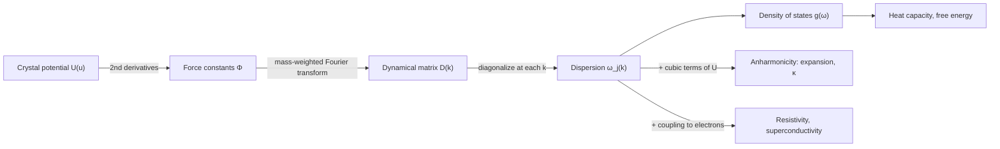
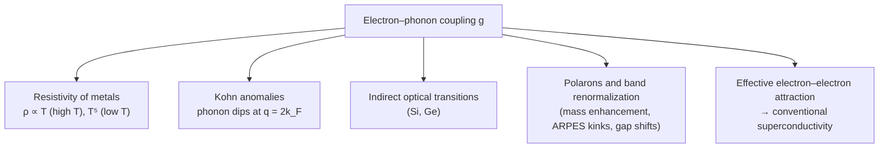

[Condensed Matter Physics](./) &raquo; Lattice Dynamics &amp; Phonons

## Lattice Dynamics & Phonons

**Lattice dynamics** is the theory of how the ions of a crystal vibrate about their equilibrium positions. Because the lattice is periodic, the vibrations organize into collective **normal modes** — plane waves of displacement labelled by a wavevector $\mathbf{k}$ and a branch index $j$. Quantizing each mode gives a harmonic oscillator whose excitation quanta, of energy $\hbar\omega_j(\mathbf{k})$, are **phonons**: bosonic quasiparticles that carry most of the heat in insulators, set the low-temperature heat capacity, scatter conduction electrons, and mediate the pairing in conventional superconductors.

This page covers the harmonic approximation and the dynamical matrix, the acoustic/optical branch structure, phonon quantization and the density of states, the Einstein and Debye models, polar-crystal effects (LO–TO splitting), anharmonic effects (thermal expansion, thermal conductivity, soft modes), electron–phonon coupling through Eliashberg theory and the hydrides, and how phonon spectra are measured and computed today. It assumes the crystallography on the [hub page](./) (Bravais lattices, reciprocal space, Brillouin zones).

The logical chain of the subject is short:

## Lattice and Reciprocal Space (Recap)

A **Bravais lattice** is the set of points $\mathbf{R} = n_1\mathbf{a}_1 + n_2\mathbf{a}_2 + n_3\mathbf{a}_3$ with integer $n_i$. A crystal is a Bravais lattice decorated with a **basis** of $p$ atoms at positions $\boldsymbol{\tau}_s$ ($s = 1,\dots,p$) in each primitive cell. The **reciprocal lattice** vectors $\mathbf{G}$ are defined by $e^{i\mathbf{G}\cdot\mathbf{R}} = 1$ for every $\mathbf{R}$, with primitive vectors

$$\mathbf{a}_i \cdot \mathbf{b}_j = 2\pi\,\delta_{ij}, \qquad \mathbf{b}_1 = 2\pi\,\frac{\mathbf{a}_2 \times \mathbf{a}_3}{\mathbf{a}_1 \cdot (\mathbf{a}_2 \times \mathbf{a}_3)}$$

and cyclic permutations. Three consequences matter for vibrations:

- **Wavevectors live in the first Brillouin zone (BZ).** A displacement wave sampled only at lattice sites is unchanged by $\mathbf{k} \to \mathbf{k} + \mathbf{G}$, so $\mathbf{k}$ and $\mathbf{k}+\mathbf{G}$ label the same mode. In a monatomic chain of spacing $a$ no mode has a wavelength shorter than $2a$.
- **Mode counting.** With $N$ primitive cells and periodic (Born–von Kármán) boundary conditions, the allowed $\mathbf{k}$ form a uniform mesh of exactly $N$ points in the BZ. With $3p$ branches this gives $3pN$ modes — one per degree of freedom.
- **Crystal momentum is conserved only modulo $\mathbf{G}$.** Discrete translation symmetry conserves $\hbar\mathbf{k}$ up to a reciprocal lattice vector. Collisions that transfer a nonzero $\hbar\mathbf{G}$ to the lattice as a whole are **Umklapp** processes; they are what give a perfect insulating crystal a finite thermal resistance (see [Anharmonic Effects](#anharmonic-effects)).

## The Harmonic Approximation

Let $\mathbf{u}_{\mathbf{R}s}$ be the displacement of the atom of mass $M_s$ at $\mathbf{R} + \boldsymbol{\tau}_s$. Expanding the potential energy about the equilibrium configuration,

$$U = U_0 + \frac{1}{2}\sum_{\mathbf{R}s\alpha}\sum_{\mathbf{R}'s'\beta} \Phi_{\alpha\beta}^{ss'}(\mathbf{R}-\mathbf{R}')\, u_{\mathbf{R}s\alpha}\, u_{\mathbf{R}'s'\beta} + \mathcal{O}(u^3),$$

where the linear term vanishes because equilibrium is a minimum and $\alpha,\beta \in \{x,y,z\}$. The **force-constant matrix**

$$\Phi_{\alpha\beta}^{ss'}(\mathbf{R}-\mathbf{R}') = \left.\frac{\partial^2 U}{\partial u_{\mathbf{R}s\alpha}\,\partial u_{\mathbf{R}'s'\beta}}\right|_{\mathrm{eq}}$$

depends only on $\mathbf{R}-\mathbf{R}'$ by translation symmetry. Dropping the cubic and higher terms is the **harmonic approximation**; the equations of motion are then linear:

$$M_s\,\ddot{u}_{\mathbf{R}s\alpha} = -\sum_{\mathbf{R}'s'\beta}\Phi_{\alpha\beta}^{ss'}(\mathbf{R}-\mathbf{R}')\,u_{\mathbf{R}'s'\beta}.$$

Symmetry constrains $\Phi$. Rigid translation of the whole crystal costs no energy, which imposes the **acoustic sum rule**

$$\sum_{\mathbf{R}'s'}\Phi_{\alpha\beta}^{ss'}(\mathbf{R}-\mathbf{R}') = 0,$$

and guarantees three gapless acoustic branches. Point-group symmetry further reduces the number of independent constants. (Numerically computed force constants violate the sum rule slightly; phonon codes re-impose it, otherwise the acoustic modes acquire small spurious frequencies at $\mathbf{k}=0$.)

The harmonic model is exact in the small-amplitude limit and gives infinitely long-lived normal modes and the correct low-temperature heat capacity. It cannot give thermal expansion, finite phonon lifetimes, or a finite thermal conductivity — all of which require the anharmonic terms.

## Normal Modes and the Dynamical Matrix

Translational symmetry lets the equations be solved with a plane-wave ansatz,

$$u_{\mathbf{R}s\alpha}(t) = \frac{1}{\sqrt{M_s}}\,\epsilon_{s\alpha}\,e^{i(\mathbf{k}\cdot\mathbf{R} - \omega t)},$$

which reduces the infinite coupled system to a $3p \times 3p$ Hermitian eigenvalue problem at each $\mathbf{k}$:

$$\omega^2\,\epsilon_{s\alpha} = \sum_{s'\beta} D_{\alpha\beta}^{ss'}(\mathbf{k})\,\epsilon_{s'\beta}, \qquad D_{\alpha\beta}^{ss'}(\mathbf{k}) = \frac{1}{\sqrt{M_s M_{s'}}}\sum_{\mathbf{R}} \Phi_{\alpha\beta}^{ss'}(\mathbf{R})\,e^{-i\mathbf{k}\cdot\mathbf{R}}.$$

$D(\mathbf{k})$ is the **dynamical matrix**. Its $3p$ eigenvalues $\omega_j^2(\mathbf{k})$ define the **phonon dispersion relations** — the central output of lattice dynamics — and its eigenvectors $\boldsymbol{\epsilon}_j(\mathbf{k})$ give the pattern of atomic motion (longitudinal, transverse, or mixed). A negative eigenvalue $\omega^2 < 0$ signals a **dynamical instability**: the assumed structure is not a minimum and will distort along that eigenvector.

### Monatomic chain

A chain of atoms of mass $M$, spacing $a$, and nearest-neighbour spring constant $C$ obeys

$$M\,\ddot{u}_n = C\,(u_{n+1} + u_{n-1} - 2u_n),$$

and the ansatz $u_n \propto e^{i(kna - \omega t)}$ gives

$$\omega(k) = 2\sqrt{\frac{C}{M}}\,\left|\sin\frac{ka}{2}\right|.$$

Three features generalize to every acoustic branch:

- **Linear at small $k$:** $\omega \approx v_s|k|$ with sound speed $v_s = a\sqrt{C/M}$. Long-wavelength phonons are ordinary sound.
- **Flat at the zone boundary:** at $k = \pi/a$ the group velocity $d\omega/dk$ vanishes; neighbouring atoms move exactly out of phase and the wave is standing. Flat regions produce **van Hove singularities** in the density of states.
- **Periodic in $k$** with period $2\pi/a$, so only $-\pi/a < k \le \pi/a$ is distinct.

### Diatomic chain: acoustic and optical branches

With alternating masses $M_1 < M_2$, period $a$, and identical springs $C$, there are two atoms per cell and two branches:

$$\omega^2_\pm(k) = C\left(\frac{1}{M_1} + \frac{1}{M_2}\right) \pm C\sqrt{\left(\frac{1}{M_1} + \frac{1}{M_2}\right)^2 - \frac{4\sin^2(ka/2)}{M_1 M_2}}.$$

| | Acoustic branch ($\omega_-$) | Optical branch ($\omega_+$) |
|---|---|---|
| $k \to 0$ | $\omega \to v_s\lvert k\rvert$ (gapless) | $\omega \to \sqrt{2C(1/M_1 + 1/M_2)}$ (finite) |
| $k = \pi/a$ | $\sqrt{2C/M_2}$ | $\sqrt{2C/M_1}$ |
| Motion within a cell at small $k$ | atoms move in phase; the cell translates | atoms move against each other; centre of mass fixed |
| Couples to light? | no | yes, if the two atoms carry opposite charge (infrared active) |

The frequency window between $\sqrt{2C/M_2}$ and $\sqrt{2C/M_1}$ contains no modes: waves at those frequencies are evanescent. The gap closes as $M_1 \to M_2$, when the diatomic chain becomes a monatomic chain of spacing $a/2$ and the optical branch is just the acoustic branch folded back into the smaller zone.

<svg viewBox="0 0 480 300" role="img" aria-label="Dispersion of the diatomic chain for M2 = 2 M1: a gapless acoustic branch rising from zero at k = 0 to a maximum at the zone boundary, and an optical branch with a maximum at k = 0 and a minimum at the zone boundary, separated by a frequency gap." style="max-width: 560px; width: 100%; display: block; margin: 0 auto; color: currentColor;">
  <defs>
    <marker id="ld-arrow" markerWidth="8" markerHeight="8" refX="6" refY="4" orient="auto">
      <path d="M0,0 L8,4 L0,8 L2,4 Z" fill="currentColor" />
    </marker>
  </defs>
  <g fill="none" stroke="currentColor">
    <line x1="60" y1="250" x2="430" y2="250" stroke-width="1.5" marker-end="url(#ld-arrow)" />
    <line x1="240" y1="262" x2="240" y2="22" stroke-width="1.5" marker-end="url(#ld-arrow)" />
    <line x1="70" y1="250" x2="70" y2="30" stroke-width="1" stroke-dasharray="4,3" opacity="0.5" />
    <line x1="410" y1="250" x2="410" y2="30" stroke-width="1" stroke-dasharray="4,3" opacity="0.5" />
    <rect x="70" y="80.3" width="340" height="49.7" fill="currentColor" fill-opacity="0.08" stroke="none" />
    <path d="M70.0,80.3 L78.5,79.8 L87.0,78.3 L95.5,76.1 L104.0,73.5 L112.5,70.5 L121.0,67.5 L129.5,64.4 L138.0,61.4 L146.5,58.5 L155.0,55.8 L163.5,53.3 L172.0,51.1 L180.5,49.0 L189.0,47.2 L197.5,45.7 L206.0,44.4 L214.5,43.4 L223.0,42.7 L231.5,42.3 L240.0,42.2 L248.5,42.3 L257.0,42.7 L265.5,43.4 L274.0,44.4 L282.5,45.7 L291.0,47.2 L299.5,49.0 L308.0,51.1 L316.5,53.3 L325.0,55.8 L333.5,58.5 L342.0,61.4 L350.5,64.4 L359.0,67.5 L367.5,70.5 L376.0,73.5 L384.5,76.1 L393.0,78.3 L401.5,79.8 L410.0,80.3" stroke-width="3" />
    <path d="M70.0,130.0 L78.5,130.7 L87.0,132.8 L95.5,136.1 L104.0,140.3 L112.5,145.2 L121.0,150.6 L129.5,156.4 L138.0,162.6 L146.5,169.1 L155.0,175.8 L163.5,182.7 L172.0,189.8 L180.5,197.1 L189.0,204.4 L197.5,211.9 L206.0,219.4 L214.5,227.0 L223.0,234.6 L231.5,242.3 L240.0,250.0 L248.5,242.3 L257.0,234.6 L265.5,227.0 L274.0,219.4 L282.5,211.9 L291.0,204.4 L299.5,197.1 L308.0,189.8 L316.5,182.7 L325.0,175.8 L333.5,169.1 L342.0,162.6 L350.5,156.4 L359.0,150.6 L367.5,145.2 L376.0,140.3 L384.5,136.1 L393.0,132.8 L401.5,130.7 L410.0,130.0" stroke-width="3" stroke-dasharray="9,5" />
  </g>
  <g fill="currentColor" font-family="sans-serif" font-size="13">
    <text x="436" y="262">k</text>
    <text x="248" y="26">&#969;</text>
    <text x="70" y="270" text-anchor="middle">&#8722;&#960;/a</text>
    <text x="410" y="270" text-anchor="middle">+&#960;/a</text>
    <text x="240" y="270" text-anchor="middle">0</text>
    <text x="300" y="36">optical (&#969;&#8330;)</text>
    <text x="276" y="226">acoustic (&#969;&#8331;)</text>
    <text x="96" y="110" font-size="12">band gap</text>
    <text x="418" y="84" font-size="11">&#8730;(2C/M&#8321;)</text>
    <text x="418" y="134" font-size="11">&#8730;(2C/M&#8322;)</text>
  </g>
</svg>

Exact dispersion of the diatomic chain for $M_2 = 2M_1$. The acoustic branch (dashed) is gapless; the optical branch (solid) has finite frequency at $k=0$. The shaded band between the zone-boundary frequencies contains no propagating modes.

### Branch counting in three dimensions

For $p$ atoms per primitive cell there are $3p$ branches: **3 acoustic** (one longitudinal, two transverse, all gapless) and **$3p-3$ optical**. Labels such as LA, TA, LO, TO combine the character (acoustic/optical) with the polarization (longitudinal/transverse); away from high-symmetry directions the modes are mixed.

| Crystal | Basis $p$ | Branches | Acoustic / optical |
|---|---|---|---|
| Cu, Al (FCC metals) | 1 | 3 | 3 / 0 |
| Si, Ge, diamond | 2 | 6 | 3 / 3 |
| NaCl, GaAs | 2 | 6 | 3 / 3 (polar: LO–TO split) |
| Graphene | 2 | 6 | 3 / 3 (including a quadratic out-of-plane ZA branch) |
| SrTiO$_3$ (cubic perovskite) | 5 | 15 | 3 / 12 |

## Quantization: Phonons

Each normal mode $(\mathbf{k}, j)$ is an independent harmonic oscillator. Introducing bosonic operators $a_{\mathbf{k}j}$, $a^\dagger_{\mathbf{k}j}$ with $[a_{\mathbf{k}j}, a^\dagger_{\mathbf{k}'j'}] = \delta_{\mathbf{k}\mathbf{k}'}\delta_{jj'}$, the displacement field and Hamiltonian are

$$u_{\mathbf{R}s\alpha} = \sum_{\mathbf{k}j} \sqrt{\frac{\hbar}{2NM_s\,\omega_j(\mathbf{k})}}\;\epsilon^{(j)}_{s\alpha}(\mathbf{k})\,e^{i\mathbf{k}\cdot\mathbf{R}}\left(a_{\mathbf{k}j} + a^\dagger_{-\mathbf{k}j}\right),$$

$$H = \sum_{\mathbf{k}j} \hbar\omega_j(\mathbf{k})\left(a^\dagger_{\mathbf{k}j}a_{\mathbf{k}j} + \frac{1}{2}\right).$$

The occupation $n_{\mathbf{k}j}$ is the **number of phonons** in the mode; each carries energy $\hbar\omega_j(\mathbf{k})$ and crystal momentum $\hbar\mathbf{k}$. (Crystal momentum is not true momentum: a phonon with $\mathbf{k} \neq 0$ carries no net mechanical momentum.) Phonon number is not conserved, so the chemical potential is zero and thermal occupation follows the Planck form

$$\bar{n}_j(\mathbf{k}) = \frac{1}{e^{\hbar\omega_j(\mathbf{k})/k_BT} - 1}.$$

The zero-point term $\tfrac{1}{2}\hbar\omega$ has measurable consequences: it produces atomic motion at $T = 0$ (visible as a nonzero Debye–Waller factor in diffraction), shifts lattice constants through the isotope dependence of zero-point energy, and in light-atom solids such as helium and hydrogen-rich compounds it is large enough to change which crystal structure is stable.

## Phonon Density of States

The **phonon density of states** counts modes per unit frequency,

$$g(\omega) = \sum_j \int_{\mathrm{BZ}} \frac{V\,d^3k}{(2\pi)^3}\,\delta\big(\omega - \omega_j(\mathbf{k})\big), \qquad \int_0^\infty g(\omega)\,d\omega = 3pN.$$

Any harmonic thermodynamic quantity is a one-dimensional integral over $g(\omega)$. Two features are generic:

- **Low-frequency behaviour.** Linear acoustic branches give $g(\omega) \propto \omega^{d-1}$ in $d$ dimensions — $\omega^2$ in 3D — which is the origin of the Debye $T^3$ law.
- **Van Hove singularities.** Wherever $\nabla_{\mathbf{k}}\omega_j = 0$ (zone boundaries, band extrema, saddle points) $g(\omega)$ has a singularity: a square-root kink in 3D, a step or logarithmic divergence in 2D, an inverse-square-root divergence in 1D. Measured phonon DOS spectra are dominated by these features.

## Heat Capacity

The harmonic internal energy is the sum of zero-point and thermal oscillator energies,

$$U = \int_0^\infty d\omega\, g(\omega)\,\hbar\omega\left(\frac{1}{2} + \frac{1}{e^{\hbar\omega/k_BT}-1}\right),$$

so the heat capacity is

$$C_V = k_B\int_0^\infty d\omega\, g(\omega)\,\left(\frac{\hbar\omega}{k_BT}\right)^2 \frac{e^{\hbar\omega/k_BT}}{\left(e^{\hbar\omega/k_BT}-1\right)^2}.$$

The weight function equals 1 when $k_BT \gg \hbar\omega$ and is exponentially small when $k_BT \ll \hbar\omega$: raising $T$ progressively activates higher-frequency modes until all $3pN$ contribute $k_B$ each (**Dulong–Petit**, $C_V = 3pNk_B$). For a monatomic crystal ($p = 1$), the Einstein and Debye models are this integral with two idealized forms of $g(\omega)$:

$$g_{\text{Einstein}}(\omega) = 3N\,\delta(\omega - \omega_E), \qquad g_{\text{Debye}}(\omega) = \frac{9N}{\omega_D^3}\,\omega^2\;\;(\omega \le \omega_D).$$

### Einstein model

Einstein (1907) assigned every mode the same frequency $\omega_E$, a good caricature of a flat optical branch:

$$C_V = 3Nk_B\left(\frac{\theta_E}{T}\right)^2 \frac{e^{\theta_E/T}}{\left(e^{\theta_E/T}-1\right)^2}, \qquad \theta_E = \frac{\hbar\omega_E}{k_B}.$$

It was the first derivation of the low-temperature fall of $C_V$ from quantization, but it predicts an exponential freeze-out $C_V \sim e^{-\theta_E/T}$, because every mode is gapped. Real solids have gapless acoustic modes and a power-law decrease.

### Debye model

Debye (1912) replaced all three acoustic branches by a single linear, isotropic dispersion $\omega = v_s k$, cut off at the radius $k_D$ of a sphere holding $N$ wavevectors:

$$\frac{V}{(2\pi)^3}\cdot\frac{4\pi}{3}k_D^3 = N \;\Longrightarrow\; k_D = \left(6\pi^2 \frac{N}{V}\right)^{1/3}, \qquad \theta_D = \frac{\hbar v_s k_D}{k_B}.$$

The heat capacity is

$$C_V = 9Nk_B\left(\frac{T}{\theta_D}\right)^3 \int_0^{\theta_D/T} \frac{x^4 e^x}{(e^x-1)^2}\,dx,$$

with limits

$$C_V \xrightarrow{T \ll \theta_D} \frac{12\pi^4}{5}Nk_B\left(\frac{T}{\theta_D}\right)^3, \qquad C_V \xrightarrow{T \gg \theta_D} 3Nk_B.$$

The $T^3$ law holds in practice only below roughly $\theta_D/50$, where just the linear part of the acoustic branches is populated. In a metal it adds to the electronic Sommerfeld term, $C = \gamma T + \beta T^3$, so a plot of $C/T$ against $T^2$ is a straight line with intercept $\gamma$ and slope $\beta$ (see [Metals & Magnetism](metals-and-magnetism.html)).

Representative Debye temperatures (low-temperature values, Kittel):

| Material | $\theta_D$ (K) | Comment |
|---|---|---|
| Pb | 105 | heavy, soft; classical at room temperature |
| Na | 158 | |
| Cu | 343 | |
| Al | 428 | |
| Fe | 470 | |
| Si | 645 | |
| Diamond | 2230 | light, stiff bonds; strongly quantum at room temperature |

Because $\theta_D \propto v_s \propto \sqrt{C/M}$, it measures lattice stiffness per unit mass. Neither model is exact: a practical fit to a measured $C_V(T)$ superposes a Debye term for the acoustic modes and Einstein terms for flat optical branches, and a temperature-dependent "effective $\theta_D(T)$" is a common way of displaying how a real $g(\omega)$ departs from the Debye form. In glasses, an excess of low-frequency modes over the Debye $\omega^2$ law (the **boson peak**) appears as a bump in $C/T^3$.

## Polar Crystals: LO–TO Splitting

In an ionic crystal a long-wavelength longitudinal optical (LO) mode sets up a macroscopic polarization and hence an electric field that stiffens it; the transverse optical (TO) mode produces no such field. The two therefore split at $\mathbf{k} \to 0$, and the splitting is fixed by the dielectric constants through the **Lyddane–Sachs–Teller relation**

$$\frac{\omega_{LO}^2}{\omega_{TO}^2} = \frac{\varepsilon(0)}{\varepsilon(\infty)}.$$

The lattice contribution to the dielectric function is

$$\varepsilon(\omega) = \varepsilon(\infty)\,\frac{\omega_{LO}^2 - \omega^2}{\omega_{TO}^2 - \omega^2}.$$

Between $\omega_{TO}$ and $\omega_{LO}$, $\varepsilon(\omega) < 0$: light cannot propagate and is almost totally reflected (the **Reststrahlen band**). Photons and TO phonons hybridize into **phonon polaritons**, which in thin polar crystals such as hexagonal boron nitride are used to confine infrared light far below the diffraction limit. In first-principles calculations the LO–TO splitting requires a non-analytic correction built from the Born effective charges and $\varepsilon(\infty)$.

A **soft mode** — a TO frequency that falls toward zero as temperature is lowered — drives $\varepsilon(0)$ to diverge through the LST relation. This is the Cochran mechanism of displacive ferroelectricity (see [Soft modes](#soft-modes-and-structural-transitions)).

## Anharmonic Effects

The cubic and quartic terms dropped in the harmonic approximation let phonons interact. Three observable consequences follow.

### Thermal expansion and the Grüneisen parameter

In the **quasi-harmonic approximation** the phonon frequencies are taken to depend on volume. The dependence is summarized by the mode **Grüneisen parameters**

$$\gamma_j(\mathbf{k}) = -\frac{\partial \ln \omega_j(\mathbf{k})}{\partial \ln V},$$

and the volumetric thermal expansion coefficient is

$$\alpha_V = \frac{\gamma\, C_V}{B\,V},$$

where $B$ is the bulk modulus and $\gamma$ the heat-capacity-weighted average of the $\gamma_j$ (typically 1–3). A strictly harmonic crystal has $\gamma = 0$ and does not expand. Negative mode Grüneisen parameters, usually on low-frequency transverse "rocking" modes of open framework structures such as ZrW$_2$O$_8$, produce **negative thermal expansion**.

### Phonon–phonon scattering and thermal conductivity

Kinetic theory gives the lattice thermal conductivity as a sum over modes,

$$\kappa = \frac{1}{3}\sum_{\mathbf{k}j} c_{\mathbf{k}j}\, v_{\mathbf{k}j}^2\, \tau_{\mathbf{k}j} \approx \frac{1}{3}\,C\,\bar{v}\,\ell,$$

with mode heat capacity $c$, group velocity $v$, lifetime $\tau$, and mean free path $\ell = v\tau$. The cubic anharmonicity allows **three-phonon processes** $\mathbf{k}_1 + \mathbf{k}_2 = \mathbf{k}_3 + \mathbf{G}$. Normal ($\mathbf{G}=0$) processes conserve total crystal momentum and so cannot relax a heat current on their own; only **Umklapp** processes ($\mathbf{G} \neq 0$), which require phonons with wavevector of order half the zone, degrade it. The competition of scattering mechanisms gives the characteristic curve of a pure insulating crystal:

| Temperature range | Dominant scattering | $\kappa(T)$ |
|---|---|---|
| $T \ll \theta_D$ (lowest) | sample boundaries; $\ell$ = sample size | $\propto T^3$ (follows $C$) |
| intermediate | point defects, isotopes; Umklapp freezing out | peak; Umklapp rate $\propto e^{-\theta_D/bT}$, $b \approx 2$ |
| $T \gtrsim \theta_D$ | Umklapp | $\propto 1/T$ |

Materials with light atoms, stiff bonds and weak anharmonicity conduct heat best: diamond (around 2000 W m$^{-1}$ K$^{-1}$ at room temperature), and cubic boron arsenide, whose unusual phonon band structure suppresses three-phonon scattering and gives values above 1000 W m$^{-1}$ K$^{-1}$. At the other extreme, strongly anharmonic compounds such as SnSe are studied as thermoelectrics precisely because their $\kappa$ is low. Modern first-principles work solves the phonon Boltzmann transport equation with computed third- (and increasingly fourth-) order force constants; four-phonon scattering turns out to be significant in many materials at high temperature.

In very pure crystals at low temperature, where Normal processes dominate but Umklapp and boundary scattering are rare, heat can propagate collectively as a temperature wave — **second sound** — and flow in a viscous, **hydrodynamic** regime. Once seen only in solid helium and a few crystals near 10 K, it has been observed in graphite at considerably higher temperatures.

### Soft modes and structural transitions

If an anharmonic crystal is stable only because thermal fluctuations stabilize a mode that would be unstable in the harmonic approximation, that mode's frequency softens as $T$ falls, typically as $\omega^2 \propto (T - T_c)$ in Landau theory, and the structure distorts along its eigenvector at $T_c$. A zone-centre polar soft mode gives a ferroelectric (as in PbTiO$_3$); a zone-boundary soft mode multiplies the unit cell, as in the antiferrodistortive octahedral-rotation transition of SrTiO$_3$ near 105 K. SrTiO$_3$'s polar mode also softens but never condenses — zero-point fluctuations keep it paraelectric down to $T = 0$ (a **quantum paraelectric**).

## Electron–Phonon Coupling

The ionic displacements that make up a phonon also modulate the potential felt by the electrons. To linear order in $u$ this gives the Fröhlich-type interaction

$$H_{\text{el-ph}} = \frac{1}{\sqrt{N}}\sum_{\mathbf{k},\mathbf{q},j} g_{j}(\mathbf{k},\mathbf{q})\,c^\dagger_{\mathbf{k}+\mathbf{q}}\,c_{\mathbf{k}}\left(a_{\mathbf{q}j} + a^\dagger_{-\mathbf{q}j}\right),$$

in which an electron scatters from $\mathbf{k}$ to $\mathbf{k}+\mathbf{q}$ by absorbing a phonon $\mathbf{q}$ or emitting one with $-\mathbf{q}$ (crystal momentum conserved modulo $\mathbf{G}$). The matrix element $g$ contains the factor $\sqrt{\hbar/2M\omega}$ from the displacement field.

### Normal-state consequences

- **Resistivity.** Phonon scattering dominates metallic resistivity at ordinary temperatures. The **Bloch–Grüneisen formula** for the phonon part is

$$\rho_{\text{ph}}(T) = A\left(\frac{T}{\Theta_R}\right)^5 \int_0^{\Theta_R/T} \frac{x^5}{(e^x - 1)(1 - e^{-x})}\,dx,$$

  with $\Theta_R$ close to $\theta_D$. It is linear in $T$ for $T \gtrsim \Theta_R/5$ (phonon population $\propto T$) and $\propto T^5$ at low $T$, where there are few phonons and each changes the electron direction only by a small angle. The high-temperature slope measures the transport coupling constant $\lambda_{tr}$.
- **Kohn anomalies.** Electrons screen the ionic motion; because the screening response is non-analytic at $q = 2k_F$ (see [screening](metals-and-magnetism.html#screening)), phonon branches show kinks or dips at wavevectors that span the Fermi surface. In low dimensions the dip can go to zero frequency, producing a **Peierls** or charge-density-wave transition.
- **Indirect gaps.** In silicon the conduction-band minimum and valence-band maximum lie at different $\mathbf{k}$, so absorption and emission across the gap require a phonon to supply the momentum. This is why silicon is a poor light emitter.
- **Renormalization and polarons.** Coupling enhances the electron effective mass by $(1 + \lambda)$ near $E_F$, produces kinks in ARPES dispersions at phonon energies, and shifts band gaps with temperature (including a zero-point renormalization at $T = 0$ that can reach tenths of an eV in light-atom materials). A strongly coupled carrier dragging its own lattice distortion is a **polaron**.

### Phonon-mediated superconductivity

An electron passing through the lattice attracts the positive ions; because the ions respond on the slow timescale $1/\omega_D \sim 10^{-13}$ s, the resulting positive-charge wake persists after the electron has gone, and attracts a second electron. This **retarded** attraction can exceed the screened Coulomb repulsion for electrons within $\sim\hbar\omega_D$ of the Fermi surface, and binds them into Cooper pairs (the full theory is on [Superconductivity, Quantum Hall & Topological Phases](emergent-phases.html)). In weak-coupling BCS theory

$$k_B T_c \approx 1.13\,\hbar\omega_D\,e^{-1/N(0)V},$$

with $N(0)$ the density of states per spin at $E_F$ and $V$ the pairing interaction.

Quantitative work uses **Migdal–Eliashberg theory**, justified because the phonon energy is small compared with the Fermi energy ($\hbar\omega_D/E_F \sim 10^{-2}$). The coupling is encoded in the **Eliashberg spectral function** $\alpha^2F(\omega)$ — the phonon DOS weighted by the Fermi-surface-averaged coupling — from which

$$\lambda = 2\int_0^\infty \frac{\alpha^2F(\omega)}{\omega}\,d\omega, \qquad \ln\omega_{\log} = \frac{2}{\lambda}\int_0^\infty \frac{\alpha^2F(\omega)}{\omega}\ln\omega\,d\omega.$$

The **Allen–Dynes (modified McMillan) formula** then estimates

$$T_c = \frac{\omega_{\log}}{1.2}\exp\!\left[-\frac{1.04\,(1+\lambda)}{\lambda - \mu^*(1 + 0.62\lambda)}\right],$$

where $\mu^* \approx 0.1$–$0.15$ is the retarded Coulomb pseudopotential and $\omega_{\log}$ is expressed in kelvin. Density-functional perturbation theory can now compute $\alpha^2F(\omega)$ from first principles, making conventional $T_c$ one of the few superconducting properties that is genuinely predictable.

Two consequences are experimental landmarks:

- **Isotope effect.** Since $\omega_D \propto M^{-1/2}$, $T_c \propto M^{-\alpha}$ with $\alpha \approx 1/2$. Its discovery in mercury (1950) identified the lattice as the pairing glue. Deviations from $\alpha = 1/2$ (Coulomb effects, anharmonicity) are informative.
- **Light atoms and strong coupling give high $T_c$.** MgB$_2$ (39 K, discovered 2001) holds the ambient-pressure record for a conventional superconductor, driven by strongly coupled boron in-plane stretching modes. Hydrogen, the lightest atom, gives very high phonon frequencies: compressed H$_3$S superconducts at about 203 K near 150 GPa (2015) and LaH$_{10}$ at about 250 K near 150–170 GPa (2019), both predicted by first-principles calculations before or alongside the experiments.

Claims of room-temperature superconductivity in hydrides need care: two high-profile reports — carbonaceous sulfur hydride (2020) and nitrogen-doped lutetium hydride (2023) — were retracted. The current research direction is ternary hydrides that might retain high $T_c$ at lower pressure, guided by high-throughput Eliashberg calculations.

Phonons are thus both the main source of resistance in the normal state and the source of its disappearance below $T_c$: above $T_c$ they relax electron momentum; below it the same coupling binds electrons into a coherent condensate.

## Measuring and Computing Phonons

| Method | What it measures | Range / notes |
|---|---|---|
| Inelastic neutron scattering (triple-axis, time-of-flight) | $\omega_j(\mathbf{q})$ across the whole BZ, phonon DOS, linewidths | the reference technique; needs large crystals |
| Inelastic X-ray scattering (meV resolution) | dispersion in small samples, under pressure | synchrotron; complements neutrons |
| Raman scattering | zone-centre Raman-active optical modes | fast, table-top; symmetry-selective; linewidths give anharmonic lifetimes |
| Infrared / THz spectroscopy | zone-centre IR-active (polar) modes, $\omega_{TO}$, $\omega_{LO}$ | Reststrahlen reflectivity |
| Heat capacity, thermal conductivity | integrals over $g(\omega)$ and lifetimes | indirect but cheap |
| Ultrafast (pump–probe, time-resolved diffraction) | coherent phonons, electron–phonon energy transfer | femtosecond time resolution |

Probe details are on [Experimental Techniques](experimental-techniques.html).

Computationally, force constants come from **density-functional perturbation theory** (linear response, e.g. in Quantum ESPRESSO or ABINIT) or from **finite displacements in supercells** (e.g. Phonopy driving any DFT code). Anharmonic force constants for thermal-conductivity calculations are obtained the same way at third and fourth order, and strongly anharmonic or dynamically stabilized structures are handled by temperature-dependent effective-potential or self-consistent-phonon methods. Increasingly, **machine-learned interatomic potentials** trained on DFT data are used to obtain phonons, lifetimes and thermal conductivity at a small fraction of the cost, which has made high-throughput phonon databases practical.

A further recent theme is **phonon angular momentum**: in crystals lacking inversion or time-reversal symmetry, phonons can be circularly polarized (**chiral phonons**) and carry angular momentum, observed for example by circularly polarized resonant X-ray scattering in quartz (2023). They contribute to the phonon (thermal) Hall effect and to angular-momentum transfer in ultrafast demagnetization.

## See Also

- [Condensed Matter Physics (Hub)](./) — crystal structure, reciprocal space, band theory.
- [Metals & Magnetism](metals-and-magnetism.html) — the electronic heat capacity, resistivity, screening, and magnons (the magnetic analogue of phonons).
- [Superconductivity, Quantum Hall & Topological Phases](emergent-phases.html) — BCS theory and the superconducting state.
- [Experimental Techniques](experimental-techniques.html) — neutron, X-ray, Raman and infrared probes of phonons.
- [Graduate-Level Formalism & Experiment](advanced-formalism.html) — second quantization, Green's functions, and DFT for solids.
- [Statistical Mechanics](../statistical-mechanics/) — Bose–Einstein statistics and the thermodynamics of oscillators.
- [Quantum Mechanics](../quantum-mechanics/) — the harmonic oscillator whose quanta are phonons.
- [Thermodynamics](../thermodynamics.html) — heat capacity and thermal expansion at the macroscopic level.
