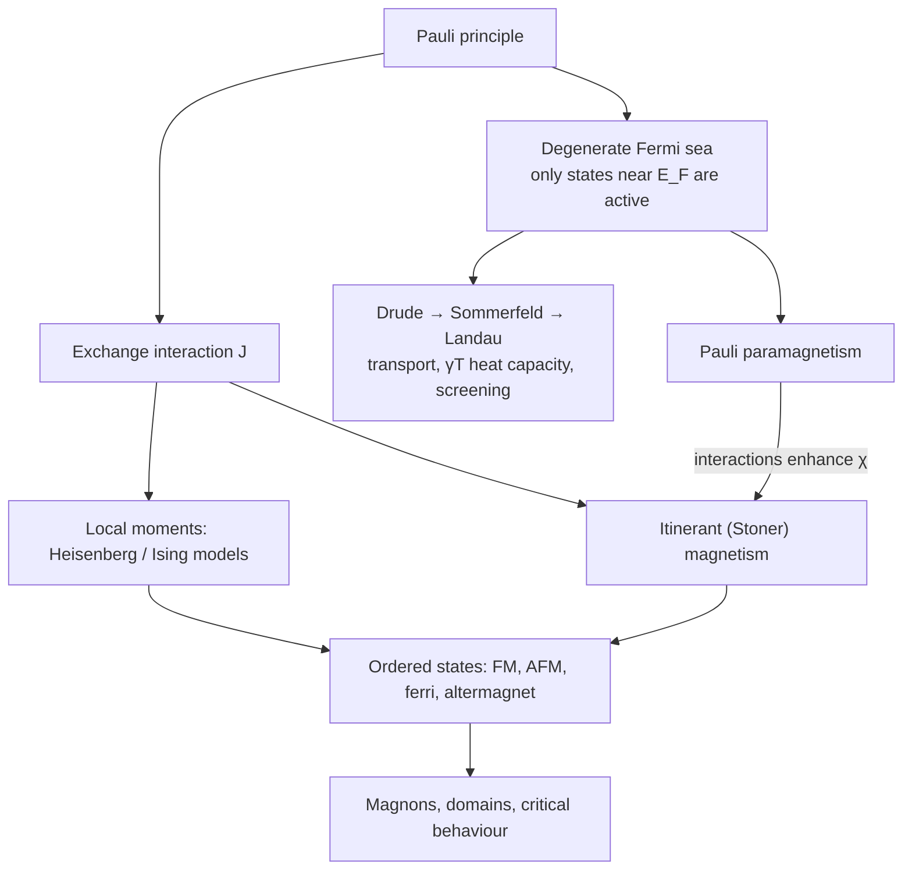

[Condensed Matter Physics](./) &raquo; Metals &amp; Magnetism

## Metals & Magnetism

A **metal** is a solid with a partly filled band, whose conduction electrons form a degenerate quantum fluid; **magnetic order** is the spontaneous alignment of electron spins. Both are collective quantum states rather than collections of independent particles, and both rest on the Pauli principle. Fermi statistics confines the low-energy physics of a metal to a thin shell at the Fermi surface, and the antisymmetry of the many-electron wavefunction produces the **exchange interaction** — an electrostatic effect, roughly a thousand times stronger than the magnetic dipole coupling between moments — that aligns spins.

The first half of this page follows the theory of the metallic state (Drude, Sommerfeld, Landau's Fermi liquid), the Fermi surface, transport and screening, and where the Fermi-liquid picture fails. The second half builds magnetism from the weak responses of independent moments, through exchange and the Heisenberg and Ising models, mean-field theory and critical behaviour, to the ordered states (including the recently identified altermagnets), itinerant magnetism, spin waves, and domains.

## The Metallic State

The picture of a metal was refined in three steps, each keeping the successes of the last and fixing a failure: a classical gas (Drude, 1900), a free quantum Fermi gas (Sommerfeld, 1927), and an interacting Fermi liquid (Landau, 1956).

### Drude model

Drude treated conduction electrons as a classical gas of charge $-e$ and mass $m$ that scatters randomly with mean free time $\tau$. The average momentum obeys

$$\frac{d\mathbf{p}}{dt} = -e\left(\mathbf{E} + \frac{\mathbf{p}}{m}\times\mathbf{B}\right) - \frac{\mathbf{p}}{\tau},$$

whose steady state gives Ohm's law and the Hall coefficient

$$\sigma_0 = \frac{ne^2\tau}{m}, \qquad R_H = -\frac{1}{ne}.$$

An oscillating field gives $\sigma(\omega) = \sigma_0/(1 - i\omega\tau)$ and the **plasma frequency** $\omega_p = \sqrt{ne^2/\epsilon_0 m}$, below which a metal reflects light. For typical metals $\hbar\omega_p$ is 5–15 eV, in the ultraviolet — which is why metals are shiny and alkali metals become transparent in the UV. (The colours of copper and gold come from interband transitions, beyond Drude.)

| Drude prediction | Verdict | Reason |
|---|---|---|
| Ohm's law, $\sigma_0 = ne^2\tau/m$ | correct form | survives in all later theories with $m \to m^*$ |
| $R_H = -1/ne$ | right for alkali metals | fails in sign and magnitude for Be, Zn, Al, Bi (band structure: hole-like carriers) |
| AC conductivity and $\omega_p$ | correct at low frequency | |
| Electronic heat capacity $\tfrac{3}{2}nk_B$ | wrong: observed value is ~100 times smaller | electrons are a degenerate Fermi gas |
| Wiedemann–Franz law $\kappa/\sigma T = L$ | right law, value right only by luck | two compensating errors (heat capacity too large, $v^2$ too small) |
| No magnetoresistance | wrong for most metals | multiple carrier types, Fermi-surface geometry |

### Sommerfeld model

Electrons obey Fermi–Dirac statistics,

$$f(E) = \frac{1}{e^{(E-\mu)/k_BT} + 1},$$

so at $T = 0$ they fill a **Fermi sphere** of radius $k_F = (3\pi^2 n)^{1/3}$ up to the **Fermi energy**

$$E_F = \frac{\hbar^2 k_F^2}{2m} = \frac{\hbar^2}{2m}(3\pi^2 n)^{2/3}.$$

Free-electron values for three simple metals (Ashcroft & Mermin):

| Metal | $n$ ($10^{22}$ cm$^{-3}$) | $E_F$ (eV) | $T_F$ ($10^4$ K) | $v_F$ ($10^6$ m/s) |
|---|---|---|---|---|
| Na | 2.65 | 3.24 | 3.77 | 1.07 |
| Cu | 8.47 | 7.00 | 8.16 | 1.57 |
| Al | 18.1 | 11.7 | 13.6 | 2.03 |

Since $T_F \sim 10^4$–$10^5$ K, the electron gas is deeply **degenerate** at all accessible temperatures. Only electrons within $\sim k_BT$ of $E_F$ can be thermally excited — a fraction $\sim k_BT/E_F$, under 1% at room temperature — each gaining $\sim k_BT$. The thermal energy therefore scales as $(k_BT)^2 g(E_F)$ and the heat capacity is linear in $T$:

$$C_{el} = \gamma T, \qquad \gamma = \frac{\pi^2}{3}k_B^2\, g(E_F),$$

where $g(E_F)$ is the density of states at the Fermi level (both spins). Combined with the phonon term, $C = \gamma T + \beta T^3$ at low temperature (see [Lattice Dynamics](lattice-dynamics.html#debye-model)). The same Fermi-surface argument fixes Wiedemann–Franz: both heat and charge are carried by electrons at $E_F$ with the same $\tau$ (for elastic scattering), giving the **Sommerfeld Lorenz number**

$$L_0 = \frac{\kappa}{\sigma T} = \frac{\pi^2}{3}\left(\frac{k_B}{e}\right)^2 \approx 2.44 \times 10^{-8}\ \mathrm{W\,\Omega\,K^{-2}}.$$

It holds when scattering is elastic (impurities at low $T$, phonons at high $T$) and fails at intermediate temperatures, where small-angle inelastic phonon scattering degrades heat current more than charge current. Large violations are a diagnostic of exotic transport, as in hydrodynamic electron flow or strange metals.

### The Fermi surface

The **Fermi surface** is the surface in $\mathbf{k}$-space separating occupied from empty states at $T = 0$. In a crystal the periodic potential distorts the free-electron sphere: it can neck through Brillouin-zone faces (as in copper) or break into separate electron and hole pockets. Low-energy properties — conduction, $\gamma$, spin susceptibility, screening — depend only on states at this surface.

- **It carries the current.** A field $\mathbf{E}$ displaces the occupied region by $\delta\mathbf{k} = -e\mathbf{E}\tau/\hbar$; interior states cancel and only the displaced surface contributes. Conductivity depends on the Fermi velocity and the Fermi-surface area, not on the total electron count.
- **It is measurable.** In a magnetic field, closed electron orbits are quantized into Landau levels, and the magnetization (**de Haas–van Alphen**) and resistivity (**Shubnikov–de Haas**) oscillate periodically in $1/B$. The period gives an extremal cross-sectional area $A$ normal to $\mathbf{B}$ through the **Onsager relation**

$$\Delta\!\left(\frac{1}{B}\right) = \frac{2\pi e}{\hbar A}.$$

  Rotating the sample maps the full 3D Fermi surface; the temperature dependence of the oscillation amplitude gives the cyclotron mass $m^*$. ARPES images the Fermi surface directly in momentum space. Both are covered on [Experimental Techniques](experimental-techniques.html).

### Transport and Matthiessen's rule

Independent scattering mechanisms add rates, so their resistivities approximately add (**Matthiessen's rule**):

$$\rho(T) = \rho_0 + \rho_{\text{e-e}}(T) + \rho_{\text{ph}}(T).$$

| Contribution | Origin | Temperature dependence |
|---|---|---|
| $\rho_0$ (residual) | impurities, defects | constant; the residual resistance ratio $\rho(300\,\mathrm{K})/\rho_0$ measures sample purity |
| $\rho_{\text{e-e}}$ | electron–electron Umklapp scattering | $AT^2$ (Fermi liquid) |
| $\rho_{\text{ph}}$ | electron–phonon scattering | $\propto T^5$ well below $\theta_D$, $\propto T$ above (Bloch–Grüneisen; see [Lattice Dynamics](lattice-dynamics.html#normal-state-consequences)) |
| Kondo term | spin-flip scattering off dilute magnetic impurities | $-\ln T$; produces a resistance minimum |

In ordinary metals the phonon term dominates above ~20 K; the $T^2$ term is visible at low temperature in transition metals and dominates in heavy-fermion compounds.

### Screening

A test charge in a metal is surrounded by a compensating cloud of electrons, so its field decays over a short distance. This is why a metal's interior is field-free and why the Coulomb interaction between electrons, bare range infinite, is effectively short-ranged.

In the **Thomas–Fermi** approximation, a slowly varying potential $\phi(\mathbf{r})$ induces a charge density $\delta\rho = -e^2 g(E_F)\,\phi$. Combined with Poisson's equation, a point charge produces a **screened (Yukawa) potential**

$$\phi(r) = \frac{Q}{4\pi\epsilon_0 r}\, e^{-r/\lambda_{TF}}, \qquad \frac{1}{\lambda_{TF}^2} = \frac{e^2 g(E_F)}{\epsilon_0},$$

with $\lambda_{TF}$ about half an ångström in a good metal. The full linear-response result, the **Lindhard dielectric function** $\epsilon(\mathbf{q},\omega)$, reduces to Thomas–Fermi at small $q$ but is non-analytic at $q = 2k_F$, where the Fermi surface can no longer span the wavevector. In real space this gives **Friedel oscillations** in the induced density,

$$\delta n(r) \propto \frac{\cos(2k_F r)}{r^3} \qquad (r \gg 1/k_F),$$

which are imaged directly by STM around surface impurities. The same $2k_F$ singularity produces Kohn anomalies in phonon spectra and the oscillating RKKY coupling between magnetic moments. At finite frequency, the zero of $\epsilon(\mathbf{q},\omega)$ is the **plasmon**, the collective charge oscillation at $\omega_p$ that electron-energy-loss spectroscopy measures.

### Fermi-liquid theory

Electron–electron repulsion in a metal is comparable to the kinetic energy, yet the free-electron model works. **Landau's Fermi-liquid theory** explains why: if interactions are switched on adiabatically, each free-electron state evolves continuously into a **quasiparticle** state with the same quantum numbers — an electron dressed by its screening cloud and particle–hole excitations — with an effective mass $m^*$. The low-energy spectrum stays in one-to-one correspondence with that of the free gas.

Quasiparticles are long-lived near $E_F$ because Pauli blocking restricts phase space for scattering:

$$\frac{1}{\tau} \propto (E - E_F)^2 + (\pi k_BT)^2,$$

so the decay rate vanishes faster than the energy itself, and the resulting electron–electron resistivity is $\rho \propto T^2$. In many correlated metals the $T^2$ coefficient $A$ and the Sommerfeld coefficient $\gamma$ both scale with $m^*$, and the **Kadowaki–Woods ratio** $A/\gamma^2$ is roughly universal within a material class.

Residual interactions enter through the Landau function $f^{\sigma\sigma'}_{\mathbf{k}\mathbf{k}'}$, the energy of a quasiparticle in the presence of others:

$$\delta E = \sum_{\mathbf{k}\sigma} \epsilon_{\mathbf{k}}\, \delta n_{\mathbf{k}\sigma} + \frac{1}{2V}\sum_{\mathbf{k}\mathbf{k}'\sigma\sigma'} f_{\mathbf{k}\mathbf{k}'}^{\sigma\sigma'}\, \delta n_{\mathbf{k}\sigma}\, \delta n_{\mathbf{k}'\sigma'}.$$

Expanding $f$ on the Fermi surface in Legendre polynomials and multiplying by the density of states gives the dimensionless **Landau parameters** $F^s_\ell$ (charge channel) and $F^a_\ell$ (spin channel). In 3D they renormalize observables as follows:

| Quantity | Free Fermi gas | Fermi liquid |
|---|---|---|
| Effective mass | $m$ | $m^*/m = 1 + F_1^s/3$ |
| Sommerfeld coefficient $\gamma$ | $\gamma_0$ | $\gamma_0\, m^*/m$ |
| Compressibility | $\kappa_0$ | $\kappa_0\,\dfrac{m^*/m}{1 + F_0^s}$ |
| Spin susceptibility | $\chi_P$ | $\chi_P\,\dfrac{m^*/m}{1 + F_0^a}$ |
| Wilson ratio $R_W \propto \chi/\gamma$ | 1 | $1/(1 + F_0^a)$ |

Liquid $^3$He is the textbook Fermi liquid, with $m^*/m$ from about 3 to 6 depending on pressure. In **heavy-fermion** compounds, hybridization of $f$ electrons with conduction electrons produces $m^*/m$ of order 100–1000. The theory also predicts **zero sound**, a collisionless oscillation of the Fermi-surface shape observed in $^3$He. A diverging response signals an instability: $F_0^a \to -1$ is the Stoner ferromagnetic instability (see [Itinerant magnetism](#itinerant-magnetism-and-the-stoner-criterion)), and $F_0^s \to -1$ phase separation.

### Beyond the Fermi liquid

- **One dimension.** Any interaction destroys the quasiparticle pole; the low-energy theory is a **Luttinger liquid**, in which electrons fractionalize into independent spin and charge excitations with different velocities (spin–charge separation), seen in ARPES on quasi-1D materials and in tunnelling into nanowires and carbon nanotubes.
- **Strange metals.** Near quantum critical points in cuprates, heavy-fermion compounds, iron pnictides, and twisted graphene, resistivity is linear in $T$ over wide ranges rather than $T^2$. The scattering rate often approaches the **Planckian bound** $1/\tau \approx k_BT/\hbar$, suggesting dissipation as fast as quantum mechanics allows. Shot-noise measurements on nanowires of the heavy-fermion strange metal YbRh$_2$Si$_2$ (2023) found noise strongly suppressed relative to the value expected for quasiparticles, direct evidence that current there is not carried by well-defined quasiparticles. A theory of strange metals remains one of the central open problems in condensed matter.
- **Mott insulators.** When on-site repulsion $U$ exceeds the bandwidth, a half-filled band that band theory calls metallic becomes insulating. See the [Hubbard model](emergent-phases.html#hubbard-model-and-the-mott-transition).
- **Disorder.** Strong disorder localizes electrons ([Disorder & Localization](disorder-and-localization.html)).

## Magnetism

A classical system in thermal equilibrium has zero magnetization (the **Bohr–van Leeuwen theorem**: a vector potential enters the classical partition function only through $\mathbf{p} - q\mathbf{A}$, which a shift of the momentum integration removes). All magnetism is quantum mechanical.

### Response of independent moments

With no magnetic order, the magnetization is linear in field, $M = \chi H$, and the responses separate by origin:

| Response | Origin | Sign and typical $\chi$ (SI, dimensionless) | $T$ dependence |
|---|---|---|---|
| Larmor (core) diamagnetism | orbital response of filled shells | negative, $\sim -10^{-5}$ | none |
| Landau diamagnetism | orbital motion of conduction electrons | negative; $-\tfrac{1}{3}\chi_P$ for free electrons | weak |
| Pauli paramagnetism | spin polarization of electrons at $E_F$ | positive, $\sim 10^{-5}$ | weak |
| Curie paramagnetism | partly filled shells (local moments) | positive, up to $\sim 10^{-3}$ at room temperature | $\propto 1/T$ |
| Superconducting diamagnetism | Meissner screening | $-1$ | below $T_c$ |

**Curie paramagnetism.** A free moment of total angular momentum $J$ and Landé factor $g$ has magnetization given by the Brillouin function $B_J$. Expanding for small field gives the **Curie law**

$$\chi = \frac{C}{T}, \qquad C = \frac{n\mu_0 g^2\mu_B^2 J(J+1)}{3k_B},$$

with $n$ the number of moments per unit volume. The effective moment $p_{\text{eff}} = g\sqrt{J(J+1)}$ extracted from $C$ identifies the ionic state; in 3d transition-metal ions the orbital moment is largely quenched by the crystal field, so $p_{\text{eff}} \approx 2\sqrt{S(S+1)}$.

**Pauli paramagnetism.** In a metal, the Pauli principle allows only electrons near $E_F$ to flip, so

$$\chi_P = \mu_0\mu_B^2\, g(E_F),$$

independent of temperature and set by the same $g(E_F)$ as $\gamma$.

### The exchange interaction

The magnetic dipole energy between neighbouring moments is ~0.1 meV, enough to order moments only below about 1 K, yet iron stays ferromagnetic to 1043 K. The ordering energy is **exchange**. Because the two-electron wavefunction is antisymmetric, a spin triplet (symmetric in spin) has an antisymmetric spatial part, which keeps the electrons apart and reduces their Coulomb repulsion; the singlet does the opposite. For two spin-$\tfrac{1}{2}$ electrons the splitting is summarized by

$$\hat{H}_{12} = -J\,\hat{\mathbf{S}}_1 \cdot \hat{\mathbf{S}}_2, \qquad J = E_{\text{singlet}} - E_{\text{triplet}},$$

using $\hat{\mathbf{S}}_1\cdot\hat{\mathbf{S}}_2 = \tfrac{1}{4}$ (triplet) and $-\tfrac{3}{4}$ (singlet). On this page $J > 0$ is ferromagnetic. (Many textbooks, including Kittel, write $-2J\,\hat{\mathbf{S}}_i\cdot\hat{\mathbf{S}}_j$, which halves $J$; check the convention before comparing numbers.)

| Mechanism | Where | Typical sign | Key feature |
|---|---|---|---|
| Direct exchange | overlapping orbitals on neighbours | either | short-ranged; sensitive to distance |
| Superexchange | TM–O–TM bonds in insulating oxides (MnO, NiO, cuprates) | usually antiferromagnetic for 180° bonds | virtual hopping: $J \sim -4t^2/U$; sign set by the Goodenough–Kanamori rules |
| Double exchange | mixed-valence oxides (manganites) | ferromagnetic | carrier hopping favours parallel core spins; colossal magnetoresistance |
| RKKY | local moments in a metal (rare earths, dilute alloys) | oscillates | mediated by conduction electrons; $\propto \cos(2k_F r)/r^3$ |
| Itinerant (Stoner) exchange | band electrons in Fe, Co, Ni | ferromagnetic | splits spin-up and spin-down bands |
| Dzyaloshinskii–Moriya | bonds lacking inversion symmetry, with spin–orbit coupling | antisymmetric: $\mathbf{D}\cdot(\mathbf{S}_i\times\mathbf{S}_j)$ | cants spins; stabilizes spirals and [skyrmions](emergent-phases.html#topological-spin-textures) |

### Heisenberg, XY, and Ising models

Summing exchange over bonds gives the **Heisenberg model**, with each nearest-neighbour bond $\langle ij\rangle$ counted once:

$$\hat{H} = -J\sum_{\langle ij\rangle} \hat{\mathbf{S}}_i \cdot \hat{\mathbf{S}}_j - g\mu_B \mu_0 H \sum_i \hat{S}_i^z.$$

Spin–orbit coupling and crystal fields add **anisotropy** that reduces the symmetry. Easy-plane anisotropy gives the **XY model** (spins in a plane, O(2) symmetry); strong easy-axis anisotropy gives the **Ising model**, $s_i = \pm 1$:

$$H = -J\sum_{\langle ij\rangle} s_i s_j - h\sum_i s_i.$$

The number of spin components $n$ (1, 2, 3 for Ising, XY, Heisenberg) together with the spatial dimension $d$ decides whether order is possible at finite temperature:

| $d$ | Ising ($n=1$) | XY ($n=2$) | Heisenberg ($n=3$) |
|---|---|---|---|
| 1 | no order for $T > 0$ (Ising, 1925) | no order | no order |
| 2 | order below $k_BT_c = 2J/\ln(1+\sqrt{2})$ (Onsager, 1944) | no long-range order, but a Berezinskii–Kosterlitz–Thouless transition to quasi-long-range order | no order (Mermin–Wagner) |
| 3 | order | order | order |

In 1D, a single domain wall costs finite energy $2J$ but gains entropy $k_B\ln N$, so order is destroyed at any $T > 0$. The **Mermin–Wagner theorem** extends this to continuous symmetries in $d \le 2$ with short-range interactions: long-wavelength spin waves cost so little energy that their thermal fluctuations diverge. Real 2D magnets evade it through anisotropy: monolayer CrI$_3$ (2017) orders ferromagnetically because easy-axis anisotropy gaps the spin waves and places it in the 2D Ising class.

### Mean-field theory

**Weiss mean-field theory** replaces the neighbours of each spin by their thermal average. For the Heisenberg model with $z$ nearest neighbours, each spin sees an effective field proportional to the magnetization, and the self-consistency condition is

$$\langle S^z\rangle = S\,B_S\!\left(\frac{S\left(g\mu_B\mu_0 H + zJ\langle S^z\rangle\right)}{k_BT}\right),$$

which has a nonzero solution at $H = 0$ below the **Curie temperature**

$$k_B T_C = \frac{zJ\,S(S+1)}{3}.$$

Above $T_C$ the susceptibility follows the **Curie–Weiss law**

$$\chi = \frac{C}{T - \theta},$$

with Weiss temperature $\theta = T_C$ in mean-field theory. Measuring $1/\chi$ against $T$ and extrapolating the high-temperature line is the standard first characterization of a magnetic material: the slope gives the moment, the intercept $\theta$ the sign and scale of the dominant exchange.

<svg viewBox="0 0 480 290" role="img" aria-label="Inverse susceptibility versus temperature: three parallel straight lines. The paramagnet passes through the origin, the ferromagnet intercepts the temperature axis at positive theta equal to T_C, and the antiferromagnet extrapolates to a negative intercept minus theta, with data only above T_N." style="max-width: 560px; width: 100%; display: block; margin: 0 auto; color: currentColor;">
  <defs>
    <marker id="mm-arrow" markerWidth="8" markerHeight="8" refX="6" refY="4" orient="auto">
      <path d="M0,0 L8,4 L0,8 L2,4 Z" fill="currentColor" />
    </marker>
  </defs>
  <g fill="none" stroke="currentColor">
    <line x1="60" y1="250" x2="450" y2="250" stroke-width="1.5" marker-end="url(#mm-arrow)" />
    <line x1="200" y1="262" x2="200" y2="22" stroke-width="1.5" marker-end="url(#mm-arrow)" />
    <line x1="200" y1="250" x2="420" y2="96" stroke-width="2.5" />
    <line x1="280" y1="250" x2="420" y2="152" stroke-width="2.5" stroke-dasharray="10,5" />
    <line x1="120" y1="250" x2="240" y2="166" stroke-width="1.2" stroke-dasharray="2,4" opacity="0.7" />
    <line x1="240" y1="166" x2="420" y2="40" stroke-width="2.5" stroke-dasharray="14,4,3,4" />
    <line x1="240" y1="244" x2="240" y2="256" stroke-width="1.5" />
  </g>
  <g fill="currentColor" font-family="sans-serif" font-size="13">
    <text x="456" y="262">T</text>
    <text x="208" y="28">1/&#967;</text>
    <text x="200" y="272" text-anchor="middle">0</text>
    <text x="280" y="272" text-anchor="middle">&#952; = T<tspan font-size="10" dy="3">C</tspan></text>
    <text x="120" y="272" text-anchor="middle">&#8722;|&#952;|</text>
    <text x="240" y="240" text-anchor="middle" font-size="11">T<tspan font-size="9" dy="3">N</tspan></text>
    <text x="424" y="44" font-size="12">antiferromagnet</text>
    <text x="424" y="100" font-size="12">paramagnet</text>
    <text x="424" y="156" font-size="12">ferromagnet</text>
  </g>
</svg>

Curie–Weiss behaviour $1/\chi = (T - \theta)/C$ above the ordering temperature. A positive intercept indicates ferromagnetic exchange, a negative one antiferromagnetic exchange. For an antiferromagnet the fitted $|\theta|$ is usually larger than $T_N$; a ratio $|\theta|/T_N \gg 1$ signals frustration.

Mean-field theory neglects correlated fluctuations and typically overestimates $T_C$ — it predicts order even in 1D. It also gives the same **critical exponents** for every system, which are correct only above the upper critical dimension $d = 4$. In $d = 2, 3$ the exponents depend only on $d$ and the symmetry of the order parameter (the **universality class**) and are obtained from exact solutions, the renormalization group, and the conformal bootstrap:

| Exponent | Definition | Mean field | 2D Ising (exact) | 3D Ising | 3D Heisenberg |
|---|---|---|---|---|---|
| $\alpha$ | $C \sim \lvert t\rvert^{-\alpha}$ | 0 (jump) | 0 (log) | 0.110 | $-0.13$ |
| $\beta$ | $M \sim (-t)^{\beta}$ | 1/2 | 1/8 | 0.326 | 0.37 |
| $\gamma$ | $\chi \sim \lvert t\rvert^{-\gamma}$ | 1 | 7/4 | 1.237 | 1.40 |
| $\nu$ | $\xi \sim \lvert t\rvert^{-\nu}$ | 1/2 | 1 | 0.630 | 0.71 |
| $\delta$ | $M \sim H^{1/\delta}$ at $T_c$ | 3 | 15 | 4.79 | 4.8 |

Here $t = (T - T_c)/T_c$. The 3D Ising class also describes the liquid–gas critical point and order–disorder transitions in binary alloys. The scaling theory behind these numbers is on [Graduate-Level Formalism](advanced-formalism.html#scaling-hypothesis-and-exponents) and [Statistical Mechanics](../statistical-mechanics/).

### Ordered states

Collinear magnetic order comes in four symmetry-distinct types:

| Order | Arrangement | Net moment | Band spin splitting (no spin–orbit) | Examples |
|---|---|---|---|---|
| Ferromagnet | all moments parallel | large | uniform (Zeeman-like) | Fe, Co, Ni, CrI$_3$ |
| Antiferromagnet | two sublattices, opposite and equal; related by translation or inversion | zero | none (Kramers degenerate) | MnO, NiO, Cr, La$_2$CuO$_4$ |
| Ferrimagnet | opposite but unequal sublattices | nonzero | uniform | Fe$_3$O$_4$, YIG, GdCo alloys |
| Altermagnet | opposite and equal; related only by a rotation | zero | alternating in sign across the BZ ($d$-, $g$-, $i$-wave) | MnTe, CrSb |

Non-collinear states (spirals, cones, cantings from Dzyaloshinskii–Moriya coupling, skyrmion lattices) and frustrated magnets that fail to order at all (**quantum spin liquids**) extend the list; see [Topological Spin Textures](emergent-phases.html#topological-spin-textures).

**Antiferromagnets.** With $J < 0$ on a bipartite lattice, the order parameter is the staggered magnetization $\mathbf{M}_A - \mathbf{M}_B$. Two-sublattice mean-field theory gives order below the **Néel temperature** $k_BT_N = z\lvert J\rvert S(S+1)/3$ and Curie–Weiss behaviour above it with a negative intercept, $\chi = C/(T + \lvert\theta\rvert)$. Below $T_N$ the susceptibility is anisotropic: parallel to the ordered axis it falls toward zero as $T \to 0$, perpendicular to it it stays roughly constant. Antiferromagnetic order is invisible to a magnetometer but produces magnetic Bragg peaks in neutron diffraction, which is how Shull and Smart confirmed Néel order in MnO in 1949. Frustration pushes $T_N$ well below $\lvert\theta\rvert$; MnO has $T_N \approx 116$ K but $\lvert\theta\rvert \approx 610$ K. Antiferromagnets are now studied for spintronics because they have no stray fields and switch at terahertz rather than gigahertz frequencies.

**Ferrimagnets.** Magnetite (Fe$_3$O$_4$, the original lodestone, $T_C \approx 858$ K) is an inverse spinel: Fe$^{3+}$ on tetrahedral sites couples antiparallel, through superexchange, to equal numbers of Fe$^{3+}$ and Fe$^{2+}$ on octahedral sites. The Fe$^{3+}$ moments cancel and the Fe$^{2+}$ moments remain, about $4\,\mu_B$ per formula unit. When the two sublattice magnetizations have different temperature dependences, the net moment can vanish at a **compensation temperature** and reverse sign; rare-earth iron garnets and amorphous GdFeCo, used in magneto-optical recording and all-optical switching, exploit this.

**Altermagnets.** Proposed as a distinct class by Šmejkal, Sinova and Jungwirth (2022), altermagnets are collinear, fully compensated magnets in which the two sublattices are mapped into each other not by a translation or inversion but only by a rotation (or mirror). This breaks the combined symmetry that forces spin degeneracy in an ordinary antiferromagnet, so the electronic bands are **spin-split even without spin–orbit coupling**, with a splitting that alternates in sign around the Brillouin zone like a $d$-, $g$- or $i$-wave form factor. Spin-resolved ARPES confirmed the splitting in MnTe and CrSb in 2024. Altermagnets combine the zero net moment and fast dynamics of antiferromagnets with ferromagnet-like spin-polarized currents and an anomalous Hall effect, which makes them a focus of spintronics research. Several early candidates, notably RuO$_2$, have since been questioned on whether they order magnetically at all.

### Itinerant magnetism and the Stoner criterion

In Fe, Co and Ni the magnetic electrons are also conduction electrons, and the moments per atom are non-integer — about 2.22, 1.72 and 0.62 $\mu_B$ — which a local-moment picture cannot explain. In the **Stoner model**, an on-site exchange energy $I$ lowers the energy of a spin imbalance; the cost is kinetic, since electrons must be moved to higher band states. Including interactions enhances the Pauli susceptibility,

$$\chi = \frac{\chi_P}{1 - I\,N(E_F)},$$

where $N(E_F)$ is the density of states per spin per atom. When the **Stoner criterion**

$$I\,N(E_F) > 1$$

is met, the paramagnetic state is unstable and the spin-up and spin-down bands split spontaneously. Fe, Co and Ni satisfy it because their narrow 3d bands put a high density of states at $E_F$; Pd and Pt fall just short and are strongly **exchange-enhanced paramagnets**. This is the band-electron form of the Fermi-liquid instability $F_0^a \to -1$. Stoner theory captures ground-state moments but badly overestimates $T_C$, because it neglects transverse spin fluctuations; modern treatments (spin-fluctuation theory, DFT combined with dynamical mean-field theory) interpolate between the itinerant and local-moment limits.

### Spin waves and magnons

The low-energy excitations of an ordered magnet are not single flipped spins but coherent waves of small spin deviation — **spin waves**, whose quanta are **magnons**. The **Holstein–Primakoff** transformation writes spin operators in terms of bosons; to leading order in $1/S$ the Heisenberg ferromagnet (with the convention above) gives

$$\hbar\omega_{\mathbf{k}} = JS\sum_{\boldsymbol{\delta}}\left(1 - \cos\mathbf{k}\cdot\boldsymbol{\delta}\right) \;\xrightarrow{\text{1D}}\; 2JS\,(1 - \cos ka) \approx JSa^2k^2,$$

where $\boldsymbol{\delta}$ runs over the $z$ nearest-neighbour vectors. The dispersion is **quadratic**, $\hbar\omega \approx Dk^2$ with spin-wave stiffness $D$. For an antiferromagnet it is **linear**, $\hbar\omega \approx \hbar c\,k$ (in 1D, $2\lvert J\rvert S\lvert\sin ka\rvert$), like acoustic phonons.

| | Ferromagnetic magnons | Antiferromagnetic magnons | Acoustic phonons |
|---|---|---|---|
| Small-$k$ dispersion | $Dk^2$ | $\hbar c k$ | $\hbar v_s k$ |
| Low-$T$ heat capacity (3D) | $\propto T^{3/2}$ | $\propto T^3$ | $\propto T^3$ |
| Order-parameter reduction | $M(0) - M(T) \propto T^{3/2}$ (Bloch law) | staggered moment $\propto T^2$ | — |
| Polarization | one (right-handed) | two (opposite chirality) | three |

The **Bloch $T^{3/2}$ law**, $M(T) = M(0)\left[1 - (T/T_0)^{3/2}\right]$, follows from counting thermally excited magnons with the $k^2$ dispersion. Anisotropy opens a gap at $k = 0$, as seen in ferromagnetic resonance. Magnon dispersions across the whole zone are measured by inelastic neutron scattering, and increasingly by resonant inelastic X-ray scattering; even in antiferromagnetic ground states quantum zero-point fluctuations reduce the ordered moment below $S$ (to about 60% for the 2D spin-$\tfrac{1}{2}$ square lattice). **Magnonics** uses magnons in low-damping insulators such as yttrium iron garnet to carry spin information without charge currents.

### Anisotropy, domains, and hysteresis

A macroscopic ferromagnet usually has little or no net moment in zero field because it breaks into **domains**. The magnetostatic (stray-field) energy favours flux closure; exchange favours uniform magnetization; **magnetocrystalline anisotropy** (energy density $K$, from spin–orbit coupling) favours particular crystal axes. Their balance sets the domain wall, across which the magnetization rotates over a width and with an energy per unit area of

$$\delta_w \approx \pi\sqrt{\frac{A}{K}}, \qquad \sigma_w \approx 4\sqrt{AK},$$

where $A$ is the exchange stiffness. In Fe, $\delta_w$ is tens of nanometres. Magnetization processes — domain-wall motion at low fields, domain rotation at high fields, wall pinning by defects — produce **hysteresis**:

- **Soft magnets** (low $K$, few pinning sites; Fe–Si steel, permalloy, amorphous and nanocrystalline alloys) have small coercivity and low loss, for transformers and motors.
- **Hard magnets** (high $K$; Nd$_2$Fe$_{14}$B, SmCo$_5$, ferrites) have large coercivity and remanence, for permanent magnets. Their energy product $(BH)_{\max}$ is the standard figure of merit.
- **Single-domain particles** below a critical size switch coherently; below a smaller size thermal fluctuations flip them (superparamagnetism), which limits the grain size in magnetic recording.

## See Also

- [Condensed Matter Physics (Hub)](./) — crystal structure, band theory, and the density of states.
- [Lattice Dynamics & Phonons](lattice-dynamics.html) — the phonon heat capacity and electron–phonon resistivity that complement the electronic properties here.
- [Superconductivity, Quantum Hall & Topological Phases](emergent-phases.html) — superconductivity, the Hubbard model, heavy fermions, and skyrmions.
- [Disorder & Localization](disorder-and-localization.html) — what happens to metals when disorder dominates.
- [Experimental Techniques](experimental-techniques.html) — quantum oscillations, ARPES, neutron scattering, and magnetometry.
- [Graduate-Level Formalism & Experiment](advanced-formalism.html) — second quantization, Green's functions, and the renormalization group.
- [Statistical Mechanics](../statistical-mechanics/) — the Ising model, mean-field theory, and phase transitions.
- [Quantum Mechanics](../quantum-mechanics/) — spin, the Pauli principle, and exchange.
