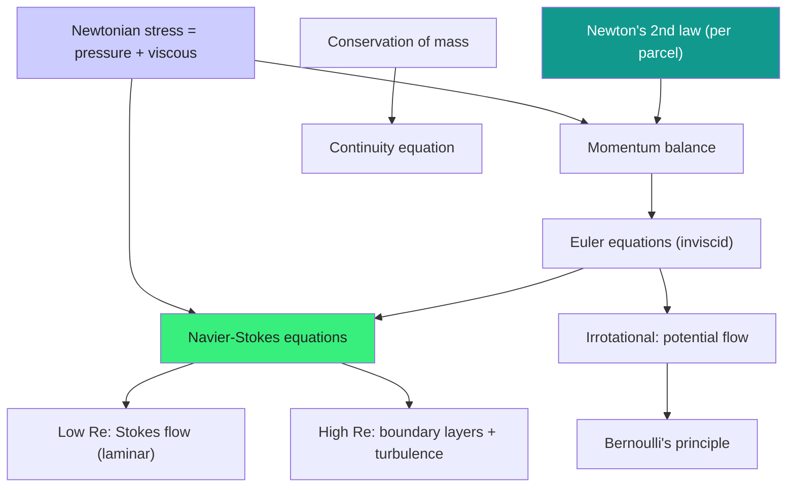

  <h1 style="color: white; margin: 0; font-size: 2.5rem;">Fluid Mechanics</h1>
  
Newton's laws written for a continuum: how liquids and gases flow, from a dripping tap to a turbulent jet.

[Physics](./) &raquo; Fluid Mechanics

<!-- Custom styles are now loaded via main.scss -->

  
Fluid mechanics is classical mechanics applied to matter that has no fixed shape. A fluid cannot resist shear at rest — push it sideways and it keeps deforming forever — so instead of tracking individual molecules we describe a smoothed-out <em>velocity field</em> $\mathbf{u}(\mathbf{x}, t)$ filling space. From two conservation laws (mass and momentum) plus a constitutive relation for stress, the entire subject unfolds: the elegant inviscid Euler equations, the formidable Navier-Stokes equations, the lift on a wing, the drag on a sphere, and the still-unsolved problem of turbulence.

  

    <i class="fas fa-water"></i>
    <h4>The continuum hypothesis</h4>
    
We replace $10^{23}$ molecules with smooth fields of density, velocity, and pressure.

  

  

    <i class="fas fa-arrows-alt"></i>
    <h4>The material derivative</h4>
    
Newton's law follows a moving fluid parcel: $D/Dt = \partial_t + \mathbf{u}\cdot\nabla$.

  

  

    <i class="fas fa-tint"></i>
    <h4>Viscosity sets the regime</h4>
    
The Reynolds number $Re = UL/\nu$ decides whether flow is smooth or chaotic.

  

  

    <i class="fas fa-tornado"></i>
    <h4>Turbulence is open</h4>
    
Existence and smoothness of 3D Navier-Stokes is a Clay Millennium Prize Problem.

  

### What You'll Find on This Page

| Section | What it covers |
|---------|----------------|
| [The Continuum Hypothesis](#the-continuum-hypothesis) | When fluids can be treated as smooth fields |
| [Kinematics of Flow](#kinematics-of-flow) | Streamlines, the material derivative, vorticity, strain |
| [Conservation of Mass](#conservation-of-mass-the-continuity-equation) | The continuity equation and incompressibility |
| [The Euler Equations](#the-euler-equations-inviscid-flow) | Inviscid momentum balance |
| [Navier-Stokes](#the-navier-stokes-equations) | Adding viscous stress; the full equations |
| [Viscosity & Reynolds Number](#viscosity-and-the-reynolds-number) | Nondimensionalization and flow regimes |
| [Bernoulli's Principle](#bernoullis-principle) | Energy along a streamline |
| [Potential Flow](#potential-flow) | Irrotational, incompressible idealizations |
| [Boundary Layers](#boundary-layers) | Where viscosity hides, and where drag comes from |
| [Turbulence](#turbulence) | The energy cascade and statistical description |
| [The Millennium Problem](#the-clay-millennium-problem) | The open mathematics of Navier-Stokes |

### The Big Picture: From Newton to Navier-Stokes

## The Continuum Hypothesis

A milliliter of air contains roughly $2.5 \times 10^{19}$ molecules. Tracking each one is hopeless and, fortunately, unnecessary. Fluid mechanics rests on the **continuum hypothesis**: we associate with every point $\mathbf{x}$ and time $t$ smooth field quantities — density $\rho(\mathbf{x}, t)$, velocity $\mathbf{u}(\mathbf{x}, t)$, pressure $p(\mathbf{x}, t)$, temperature $T(\mathbf{x}, t)$ — defined by averaging over a *fluid element*: a volume large enough to contain enormous numbers of molecules, yet small compared to the scales over which the macroscopic fields vary.

This separation of scales is quantified by the **Knudsen number**,

$$Kn = \frac{\lambda}{L},$$

the ratio of the molecular mean free path $\lambda$ to the characteristic length $L$ of the flow. The continuum description is valid when $Kn \ll 1$. For air at room conditions $\lambda \approx 70$ nm, so the hypothesis holds superbly for everyday flows but breaks down in rarefied gases (high-altitude reentry, vacuum systems) and microfluidic channels, where kinetic theory or the Boltzmann equation must take over.

  <h4>What makes a fluid a fluid</h4>
  
A solid resists shear: deform it and it pushes back with a stress proportional to the <em>strain</em>. A fluid cannot do this — any nonzero shear stress, however small, sets it flowing indefinitely. A fluid therefore resists not strain but the <em>rate of strain</em>. This single property, encoded in the constitutive law for the stress tensor, is what distinguishes the equations of fluid mechanics from those of elasticity, and it is what makes flow possible.

### Lagrangian vs. Eulerian Descriptions

There are two ways to bookkeep a flow:

- **Lagrangian:** follow individual fluid parcels, labeling each by its initial position $\mathbf{a}$ and tracking its trajectory $\mathbf{x}(\mathbf{a}, t)$. This is Newton's natural viewpoint — it is parcels that obey $\mathbf{F} = m\mathbf{a}$.
- **Eulerian:** sit at a fixed point in space and record the fields $\mathbf{u}(\mathbf{x}, t)$, $p(\mathbf{x}, t)$ as fluid streams past. This is the practical viewpoint, the one in which the governing PDEs are written.

The bridge between them is the **material derivative**, derived below, which expresses the rate of change *following a parcel* in terms of the Eulerian fields.

## Kinematics of Flow

Kinematics describes motion without reference to its causes. The geometry of a flow field is captured by a handful of derived quantities.

### Pathlines, Streamlines, and Streaklines

Three families of curves describe a flow, and they coincide only when the flow is steady:

- A **pathline** is the trajectory of a single fluid parcel over time — the curve traced by $\mathbf{x}(t)$ with $d\mathbf{x}/dt = \mathbf{u}(\mathbf{x}, t)$.
- A **streamline** is a curve everywhere tangent to the *instantaneous* velocity field. In 2D it satisfies $dx/u = dy/v$. Streamlines are snapshots; they cannot cross (the velocity would be double-valued).
- A **streakline** is the locus of all parcels that have passed through a fixed point — what a continuously injected dye filament reveals.

For **steady flow** ($\partial \mathbf{u}/\partial t = 0$) all three families coincide.

### The Material Derivative

Consider any field $f(\mathbf{x}, t)$ — density, a velocity component, temperature — and ask how it changes *as experienced by a moving parcel*. Over time $dt$ the parcel moves $d\mathbf{x} = \mathbf{u}\, dt$, so by the chain rule

$$df = \frac{\partial f}{\partial t}\, dt + \nabla f \cdot d\mathbf{x} = \left(\frac{\partial f}{\partial t} + \mathbf{u}\cdot\nabla f\right) dt.$$

Dividing by $dt$ defines the **material (or substantial) derivative**:

$$\frac{Df}{Dt} = \frac{\partial f}{\partial t} + \mathbf{u}\cdot\nabla f.$$

The first term is the *local* rate of change at a fixed point; the second is *advection* — change a parcel feels because it is carried into regions where $f$ differs. Applied to velocity itself, $D\mathbf{u}/Dt$ is the acceleration of a fluid parcel, and the advective term $\mathbf{u}\cdot\nabla\mathbf{u}$ is the source of the nonlinearity that makes fluid mechanics hard.

### The Rate-of-Strain and Vorticity Tensors

The local relative motion of a parcel is governed by the velocity gradient $\nabla\mathbf{u}$, with components $\partial u_i/\partial x_j$. It splits uniquely into symmetric and antisymmetric parts:

$$\frac{\partial u_i}{\partial x_j} = \underbrace{\frac{1}{2}\left(\frac{\partial u_i}{\partial x_j} + \frac{\partial u_j}{\partial x_i}\right)}_{S_{ij}\ \text{(rate of strain)}} + \underbrace{\frac{1}{2}\left(\frac{\partial u_i}{\partial x_j} - \frac{\partial u_j}{\partial x_i}\right)}_{\Omega_{ij}\ \text{(rotation)}}.$$

- The symmetric **rate-of-strain tensor** $S_{ij}$ describes how a parcel stretches and shears. Its trace, $\nabla\cdot\mathbf{u}$, is the rate of volume expansion.
- The antisymmetric part encodes local **rotation** and is equivalent to a vector, the vorticity.

### Vorticity

The **vorticity** is the curl of the velocity field:

$$\boldsymbol{\omega} = \nabla \times \mathbf{u}.$$

It measures twice the local angular velocity of a fluid parcel — a tiny paddle wheel placed in the flow spins at rate $\tfrac{1}{2}|\boldsymbol{\omega}|$. A flow with $\boldsymbol{\omega} = 0$ everywhere is called **irrotational**; this is the gateway to potential flow.

Taking the curl of the momentum equation (below) eliminates pressure and yields the **vorticity transport equation**. For an incompressible flow with constant viscosity,

$$\frac{D\boldsymbol{\omega}}{Dt} = (\boldsymbol{\omega}\cdot\nabla)\mathbf{u} + \nu\nabla^2\boldsymbol{\omega}.$$

The first term on the right is **vortex stretching** — when a vortex tube is stretched along its axis, conservation of angular momentum spins it faster, intensifying vorticity. This mechanism is unique to three dimensions (it vanishes identically in 2D) and is widely believed to be the engine of the turbulent energy cascade. The second term is viscous diffusion of vorticity.

## Conservation of Mass: The Continuity Equation

Mass is neither created nor destroyed. Apply this to a fixed control volume $V$: the rate at which mass inside changes equals the net flux of mass across its boundary $\partial V$:

$$\frac{d}{dt}\int_V \rho \, dV = -\oint_{\partial V} \rho\, \mathbf{u}\cdot d\mathbf{A}.$$

Converting the surface integral with the divergence theorem and shrinking the volume to a point gives the **continuity equation** in differential form:

$$\frac{\partial \rho}{\partial t} + \nabla\cdot(\rho\mathbf{u}) = 0.$$

Expanding the divergence and recognizing the material derivative,

$$\frac{D\rho}{Dt} + \rho\,\nabla\cdot\mathbf{u} = 0.$$

### The Incompressibility Condition

If a fluid parcel's density does not change as it moves, $D\rho/Dt = 0$, and continuity collapses to the **incompressibility condition**:

$$\nabla\cdot\mathbf{u} = 0.$$

This is an excellent approximation whenever the flow speed is small compared to the speed of sound, i.e. when the **Mach number** $Ma = U/c$ satisfies $Ma \lesssim 0.3$ (density variations scale as $Ma^2$). Liquids are nearly incompressible under almost all conditions; air is too, as long as it moves well below the speed of sound. Note that incompressibility constrains the *flow* ($\nabla\cdot\mathbf{u}=0$), not necessarily that the fluid has uniform density — a stratified ocean is incompressible but not homogeneous.

## The Euler Equations: Inviscid Flow

Before adding the complication of viscosity, consider an **ideal fluid** with no internal friction. Apply Newton's second law to a fluid parcel of density $\rho$. Its acceleration is the material derivative of velocity. The forces are the pressure on its surface and body forces such as gravity $\mathbf{g}$ per unit mass. The surface pressure force per unit volume is $-\nabla p$, so

$$\rho\frac{D\mathbf{u}}{Dt} = -\nabla p + \rho\mathbf{g}.$$

Written out in Eulerian form, these are the **Euler equations** (1757):

$$\frac{\partial \mathbf{u}}{\partial t} + (\mathbf{u}\cdot\nabla)\mathbf{u} = -\frac{1}{\rho}\nabla p + \mathbf{g}.$$

Together with continuity (and, for compressible flow, an energy equation and an equation of state) this closes the system. The Euler equations are first-order in space, which means they cannot satisfy the **no-slip** boundary condition that a real, viscous fluid obeys at a wall — they can only enforce that fluid does not penetrate a solid surface ($\mathbf{u}\cdot\hat{\mathbf{n}} = 0$). This deficiency is exactly what the boundary layer repairs.

### Worked Example: Hydrostatics

For a fluid at rest, $\mathbf{u} = 0$ and the Euler equation reduces to $\nabla p = \rho\mathbf{g}$. With gravity $\mathbf{g} = -g\hat{\mathbf{z}}$ and constant $\rho$,

$$\frac{dp}{dz} = -\rho g \quad\Longrightarrow\quad p(z) = p_0 - \rho g z.$$

This is the familiar result that pressure increases linearly with depth — the hydrostatic balance underlying buoyancy and Archimedes' principle.

## The Navier-Stokes Equations

Real fluids have **viscosity**: adjacent layers moving at different speeds exert frictional shear on one another. To capture this we return to Newton's second law for a parcel but write the surface force in terms of the full **stress tensor** $\sigma_{ij}$, the $i$-component of force per unit area on a surface with normal in the $j$-direction. The momentum equation, in conservation form, reads

$$\rho\frac{Du_i}{Dt} = \frac{\partial \sigma_{ij}}{\partial x_j} + \rho g_i.$$

### The Newtonian Constitutive Relation

We split the stress into an isotropic pressure part and a deviatoric (shear) part:

$$\sigma_{ij} = -p\,\delta_{ij} + \tau_{ij}.$$

A **Newtonian fluid** is one whose viscous stress $\tau_{ij}$ is *linearly* proportional to the rate of strain — the defining property of fluids like water and air. The most general isotropic linear relation is

$$\tau_{ij} = 2\mu\, S_{ij} + \lambda\,(\nabla\cdot\mathbf{u})\,\delta_{ij},$$

where $\mu$ is the **dynamic viscosity** and $\lambda$ the second (bulk) viscosity. The strain rate $S_{ij}$ is the symmetric velocity gradient defined earlier. Non-Newtonian fluids (blood, ketchup, polymer melts, cornstarch suspensions) violate this linear law and require more elaborate constitutive models.

### Assembling the Equations

Substitute the constitutive relation into the momentum balance. For an **incompressible** fluid ($\nabla\cdot\mathbf{u} = 0$) with constant viscosity, the divergence of the viscous stress simplifies dramatically to $\mu\nabla^2\mathbf{u}$, giving the celebrated **incompressible Navier-Stokes equations**:

$$\rho\left(\frac{\partial \mathbf{u}}{\partial t} + (\mathbf{u}\cdot\nabla)\mathbf{u}\right) = -\nabla p + \mu\nabla^2\mathbf{u} + \rho\mathbf{g},$$

$$\nabla\cdot\mathbf{u} = 0.$$

Dividing the momentum equation by $\rho$ and introducing the **kinematic viscosity** $\nu = \mu/\rho$ gives the form most often quoted:

$$\frac{\partial \mathbf{u}}{\partial t} + (\mathbf{u}\cdot\nabla)\mathbf{u} = -\frac{1}{\rho}\nabla p + \nu\nabla^2\mathbf{u} + \mathbf{g}.$$

  <h4>Reading the equation term by term</h4>
  
Each term is a force per unit mass on a fluid parcel: $\partial_t\mathbf{u}$ is the local (unsteady) acceleration; $(\mathbf{u}\cdot\nabla)\mathbf{u}$ is convective acceleration, the <em>nonlinear</em> heart of the equation that couples scales and breeds turbulence; $-\tfrac{1}{\rho}\nabla p$ is the pressure-gradient force that enforces incompressibility; $\nu\nabla^2\mathbf{u}$ is viscous diffusion of momentum that smooths sharp gradients and dissipates energy into heat; and $\mathbf{g}$ collects body forces. The interplay of the nonlinear convective term against the linear viscous term — quantified by the Reynolds number — determines everything about the character of the flow.

The pressure in incompressible flow is not an independent thermodynamic variable: it is a **Lagrange multiplier** that instantaneously adjusts to keep $\nabla\cdot\mathbf{u} = 0$. Taking the divergence of the momentum equation yields a Poisson equation for the pressure, $\nabla^2 p = -\rho\,\nabla\cdot[(\mathbf{u}\cdot\nabla)\mathbf{u}]$, which is solved subject to the velocity field at each instant.

### Boundary Conditions

The defining condition for a viscous fluid is **no-slip**: at a solid wall the fluid velocity equals the wall velocity, $\mathbf{u} = \mathbf{u}_{\text{wall}}$. This is an experimental fact (molecules adhere to the surface) and it is precisely what the inviscid Euler equations cannot accommodate. The second-order viscous term $\nu\nabla^2\mathbf{u}$ raises the spatial order of the equation just enough to permit it.

## Viscosity and the Reynolds Number

To compare flows of different size, speed, and fluid we **nondimensionalize**. Choose a characteristic length $L$, speed $U$, and rescale: $\mathbf{x} = L\mathbf{x}^*$, $\mathbf{u} = U\mathbf{u}^*$, $t = (L/U)t^*$, $p = \rho U^2 p^*$. Substituting into the steady incompressible Navier-Stokes equation and dropping stars, the entire equation depends on a *single* dimensionless group:

$$Re = \frac{UL}{\nu} = \frac{\rho U L}{\mu}.$$

This is the **Reynolds number**, the ratio of inertial forces ($\sim \rho U^2/L$) to viscous forces ($\sim \mu U/L^2$). The nondimensional momentum equation becomes

$$\frac{\partial \mathbf{u}}{\partial t} + (\mathbf{u}\cdot\nabla)\mathbf{u} = -\nabla p + \frac{1}{Re}\nabla^2\mathbf{u}.$$

Two flows with the same geometry and the same $Re$ are **dynamically similar** — identical up to rescaling. This is the principle that lets wind-tunnel and water-channel models predict the behavior of full-scale aircraft and ships.

| Regime | Reynolds number | Character | Example |
|--------|-----------------|-----------|---------|
| Creeping (Stokes) flow | $Re \ll 1$ | Viscosity dominates; reversible, no inertia | A bacterium swimming; sediment settling |
| Laminar | $Re \lesssim 2000$ (pipe) | Smooth, ordered, layered flow | Honey pouring; flow in a capillary |
| Transitional | $Re \sim 10^3$–$10^4$ | Intermittent bursts of disorder | Smoke rising from a candle |
| Turbulent | $Re \gtrsim 4000$ (pipe) | Chaotic, eddying, well-mixed | River rapids; atmospheric flow; jet exhaust |

In the **Stokes limit** $Re \to 0$ the nonlinear term is negligible and Navier-Stokes linearizes to the **Stokes equations** $\nabla p = \mu\nabla^2\mathbf{u}$, $\nabla\cdot\mathbf{u}=0$. These are time-reversible, which produces the famous result that a microorganism cannot swim with a reciprocal (back-and-forth) stroke — the "scallop theorem."

## Bernoulli's Principle

For a steady, incompressible, inviscid flow, integrate the Euler equation along a streamline. Using the identity $(\mathbf{u}\cdot\nabla)\mathbf{u} = \nabla(\tfrac{1}{2}u^2) - \mathbf{u}\times\boldsymbol{\omega}$ and projecting onto the streamline direction (along which the rotational term drops out), one finds that the quantity

$$\frac{1}{2}u^2 + \frac{p}{\rho} + gz = \text{constant along a streamline}$$

is conserved. This is **Bernoulli's equation**. Multiplying by $\rho$ casts it as a statement of energy density:

$$\underbrace{\tfrac{1}{2}\rho u^2}_{\text{dynamic}} + \underbrace{p}_{\text{static}} + \underbrace{\rho g z}_{\text{gravitational}} = \text{const}.$$

Where the flow speeds up, the pressure must drop. This single fact explains a great deal:

- **Lift on a wing:** faster flow over the curved upper surface means lower pressure there, producing net upward force (the full story also requires circulation and the Kutta condition).
- **The Venturi effect:** fluid accelerating through a constriction shows a pressure minimum, the basis of carburetors and flow meters.
- **Pitot tubes:** measuring the difference between stagnation pressure ($u=0$) and static pressure gives the flow speed, $u = \sqrt{2(p_0 - p)/\rho}$.

**Caveat:** Bernoulli holds only along a streamline for inviscid, steady flow. If the flow is irrotational everywhere, the constant is the same for *all* streamlines. Where viscosity matters — inside boundary layers, in pipes with friction — Bernoulli must be augmented by head-loss terms.

## Potential Flow

If a flow is both **incompressible** ($\nabla\cdot\mathbf{u}=0$) and **irrotational** ($\boldsymbol{\omega}=\nabla\times\mathbf{u}=0$), the mathematics becomes remarkably clean. Irrotationality means the velocity is the gradient of a scalar **velocity potential** $\phi$:

$$\mathbf{u} = \nabla\phi.$$

Incompressibility then forces $\phi$ to satisfy **Laplace's equation**:

$$\nabla^2\phi = 0.$$

The entire theory of harmonic functions — superposition, complex analysis, conformal mapping — now applies to fluids. Because Laplace's equation is linear, elementary solutions can be added to build complex flows.

### The Stream Function and Complex Potential

In two dimensions, incompressibility is automatically satisfied by introducing a **stream function** $\psi$ with $u = \partial\psi/\partial y$, $v = -\partial\psi/\partial x$. Lines of constant $\psi$ are streamlines. For irrotational 2D flow, $\phi$ and $\psi$ satisfy the Cauchy-Riemann equations, so they combine into an analytic **complex potential**

$$w(z) = \phi + i\psi, \qquad z = x + iy,$$

whose derivative gives the velocity, $dw/dz = u - iv$. The full power of complex analysis — including conformal maps such as the Joukowski transform that turns a circle into an airfoil — becomes available.

### Elementary Flows

| Flow | Complex potential $w(z)$ | Description |
|------|--------------------------|-------------|
| Uniform stream | $U z$ | Constant velocity $U$ in the $x$-direction |
| Source / sink | $\dfrac{m}{2\pi}\ln z$ | Radial outflow ($m>0$) or inflow |
| Vortex | $-\dfrac{i\Gamma}{2\pi}\ln z$ | Circulation $\Gamma$ about the origin |
| Doublet | $-\dfrac{\mu}{z}$ | Source+sink in the limit they merge |

Superposing a uniform stream with a doublet yields **flow past a cylinder**; adding a vortex produces lift via the **Kutta-Joukowski theorem**, $L = \rho U \Gamma$ per unit span.

  <h4>D'Alembert's paradox</h4>
  
Potential flow predicts that a body moving steadily through an unbounded ideal fluid experiences <em>zero drag</em> — the pressure distribution is fore-aft symmetric and cancels. This blatantly contradicts experience: real bodies feel drag. The resolution, supplied by Prandtl a century and a half later, is that viscosity, no matter how small, cannot be neglected in the thin layer next to the body. That boundary layer separates, leaves a low-pressure wake, and breaks the symmetry. Potential flow is the right answer almost everywhere — except exactly where the drag is decided.

## Boundary Layers

D'Alembert's paradox is dissolved by Ludwig Prandtl's **boundary-layer theory** (1904), arguably the single most important idea in applied fluid mechanics. The insight: even at very high Reynolds number, viscosity cannot be dropped entirely, because near a solid wall the no-slip condition forces the velocity from zero (at the wall) up to the free-stream value over a very thin layer. Inside this **boundary layer**, velocity gradients are enormous and the viscous term $\nu\nabla^2\mathbf{u}$ is comparable to inertia, no matter how large $Re$ is overall.

### Boundary-Layer Scaling

Balancing convection $U\,\partial u/\partial x \sim U^2/L$ against cross-stream viscous diffusion $\nu\,\partial^2 u/\partial y^2 \sim \nu U/\delta^2$ shows the layer thickness $\delta$ grows as

$$\frac{\delta}{L} \sim \frac{1}{\sqrt{Re}} \quad\Longrightarrow\quad \delta(x) \sim \sqrt{\frac{\nu x}{U}}.$$

The layer is thin (vanishing as $Re\to\infty$) but its consequences are not. Within it, Prandtl's reduced **boundary-layer equations** apply, in which pressure is imposed by the outer potential flow and is constant across the layer:

$$u\frac{\partial u}{\partial x} + v\frac{\partial u}{\partial y} = -\frac{1}{\rho}\frac{dp}{dx} + \nu\frac{\partial^2 u}{\partial y^2}, \qquad \frac{\partial u}{\partial x} + \frac{\partial v}{\partial y} = 0.$$

For a flat plate with zero pressure gradient, this system admits the self-similar **Blasius solution**, giving a skin-friction drag coefficient $C_f \approx 1.328/\sqrt{Re_L}$.

### Separation and Drag

When the outer flow decelerates (an **adverse pressure gradient**, $dp/dx > 0$, on the rear of a bluff body), the slow fluid deep in the boundary layer can be brought to rest and pushed backward. The boundary layer then **separates** from the surface, shedding into a turbulent wake. Separation is the origin of **pressure (form) drag**, which dwarfs skin-friction drag for bluff bodies. It is also why dimpled golf balls fly farther: the dimples trip the boundary layer turbulent, and a turbulent layer — carrying more momentum near the wall — resists separation longer, shrinking the wake and the drag.

The total drag on a body thus has two contributions:

$$D = \underbrace{D_{\text{friction}}}_{\text{viscous shear at wall}} + \underbrace{D_{\text{pressure}}}_{\text{fore-aft pressure asymmetry from separation}}.$$

## Turbulence

At high Reynolds number, laminar flow becomes unstable and gives way to **turbulence**: a three-dimensional, chaotic, rotational, and highly diffusive state of motion spanning an enormous range of scales. Turbulence is deterministic (it obeys Navier-Stokes) yet so sensitive to initial conditions that it is treated statistically. Richard Feynman called it "the most important unsolved problem of classical physics."

### The Energy Cascade

Lewis Fry Richardson captured the essential picture in verse: *"Big whorls have little whorls that feed on their velocity, and little whorls have lesser whorls and so on to viscosity."* Energy is injected at large scales $L$ (the integral scale), then transferred — through the vortex-stretching nonlinearity — to successively smaller eddies in an essentially inviscid **cascade**, until it reaches scales small enough for viscosity to dissipate it into heat.

### Kolmogorov's 1941 Theory

Andrey Kolmogorov made this quantitative. Assume that at scales much smaller than $L$ but larger than the dissipation scale (the **inertial range**), the statistics depend only on the energy dissipation rate per unit mass $\varepsilon$ and the scale. Dimensional analysis then fixes everything. The smallest eddies have the **Kolmogorov microscale**

$$\eta = \left(\frac{\nu^3}{\varepsilon}\right)^{1/4},$$

and the ratio of largest to smallest scales grows as $L/\eta \sim Re^{3/4}$. The famous **five-thirds law** gives the energy spectrum in the inertial range:

$$E(k) = C\,\varepsilon^{2/3} k^{-5/3},$$

where $k$ is wavenumber and $C \approx 1.5$ is a universal constant. This spectrum has been confirmed in countless experiments and is one of the triumphs of turbulence theory.

### The Closure Problem and Modeling

The deep obstacle to a complete theory is the **closure problem**. Averaging Navier-Stokes (the **Reynolds decomposition** $\mathbf{u} = \bar{\mathbf{u}} + \mathbf{u}'$) produces equations for the mean flow that contain a new unknown, the **Reynolds stress tensor**

$$\tau^R_{ij} = -\rho\,\overline{u_i' u_j'},$$

representing momentum transport by turbulent fluctuations. Writing an equation for this term introduces yet higher-order unknowns, and so on forever — the equations never close. Practical computation therefore relies on *models*:

- **RANS** (Reynolds-Averaged Navier-Stokes): model the Reynolds stress, e.g. via $k$-$\varepsilon$ or $k$-$\omega$ turbulence models. Cheap; the workhorse of engineering.
- **LES** (Large-Eddy Simulation): resolve the large, energy-containing eddies directly and model only the small subgrid scales.
- **DNS** (Direct Numerical Simulation): resolve every scale down to $\eta$. Exact but staggeringly expensive — the number of grid points scales as $Re^{9/4}$, putting most engineering Reynolds numbers far out of reach.

## The Clay Millennium Problem

The incompressible Navier-Stokes equations describe the world with spectacular accuracy, yet we cannot prove they always have sensible solutions. The **Navier-Stokes existence and smoothness problem** is one of the seven Clay Mathematics Institute Millennium Prize Problems, carrying a US \$1,000,000 award.

  <h4>The open question, precisely</h4>
  
Given smooth, finite-energy initial velocity data in three dimensions, does the incompressible Navier-Stokes equation always possess a smooth solution for all time? Or can the nonlinear vortex-stretching term concentrate energy at ever-smaller scales until the velocity (or its gradients) blows up to infinity in finite time — a <em>singularity</em>? No one knows. We cannot prove solutions stay smooth, and we cannot exhibit a counterexample.

The state of knowledge is sharply asymmetric:

- **Two dimensions:** the problem is solved. Smooth global solutions are known to exist and be unique. The crucial reason is that vortex stretching vanishes in 2D, so vorticity cannot intensify uncontrollably.
- **Three dimensions:** only partial results exist. Jean Leray (1934) proved the existence of **weak solutions** for all time, but these are not known to be unique or smooth. Local-in-time smooth solutions exist; whether they persist for all time is the open question. Partial regularity theory (Caffarelli-Kohn-Nirenberg, 1982) shows that any singular set must be very small (parabolic Hausdorff dimension at most one), but cannot rule it out.

The difficulty is fundamentally the same nonlinearity that produces turbulence: the convective term $(\mathbf{u}\cdot\nabla)\mathbf{u}$ couples all scales and can, in principle, drive energy toward a singularity faster than viscosity can dissipate it. Resolving the problem would not only earn the prize — it would mean genuinely understanding turbulence at the level of the equations themselves.

## Key Takeaways

  

    <h4>Fluids are continua</h4>
    
For $Kn \ll 1$ we replace molecules with smooth fields and write conservation laws as PDEs for $\rho$, $\mathbf{u}$, and $p$.

  

  

    <h4>Follow the parcel</h4>
    
The material derivative $D/Dt = \partial_t + \mathbf{u}\cdot\nabla$ turns Newton's law into the Euler and Navier-Stokes equations.

  

  

    <h4>Viscosity is the difference</h4>
    
Adding the Newtonian viscous stress $\mu\nabla^2\mathbf{u}$ to Euler gives Navier-Stokes and enforces no-slip at walls.

  

  

    <h4>One number rules the regime</h4>
    
The Reynolds number $Re = UL/\nu$ sets dynamic similarity and the laminar-to-turbulent transition.

  

  

    <h4>Viscosity hides in thin layers</h4>
    
Boundary layers ($\delta/L \sim Re^{-1/2}$) carry the drag and resolve d'Alembert's paradox via separation.

  

  

    <h4>Turbulence is still open</h4>
    
Kolmogorov's $-5/3$ cascade describes it statistically, but 3D Navier-Stokes smoothness is an unsolved Millennium Problem.

  

## See Also

  <h4>Where to go next</h4>
  <ul>
    <li><a href="classical-mechanics/">Classical Mechanics</a> — Newton's laws and the variational principles fluid mechanics is built on.</li>
    <li><a href="thermodynamics.html">Thermodynamics</a> — the energy equation and equation of state for compressible flow.</li>
    <li><a href="statistical-mechanics/">Statistical Mechanics</a> — the kinetic-theory foundation underneath the continuum hypothesis.</li>
    <li><a href="computational-physics/">Computational Physics</a> — numerical methods for PDEs, CFD, and turbulence simulation.</li>
    <li><a href="index.html">Physics Hub</a> — browse all physics topics.</li>
    <li><a href="../reference/#physics-formulas--constants">Physics Reference</a> — constants, key equations, and unit conversions.</li>
  </ul>

