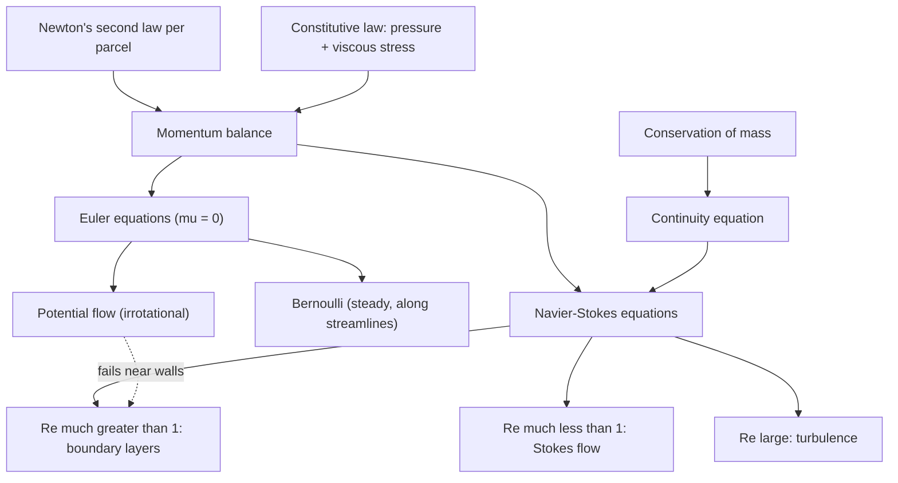
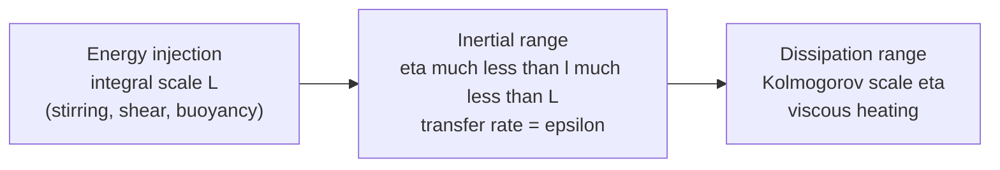

[Physics](./) &raquo; Fluid Mechanics

**Fluid mechanics** is classical mechanics applied to matter that has no fixed shape. A fluid cannot resist a shear stress at rest — push it sideways and it keeps deforming — so rather than tracking molecules we describe smooth fields of density $\rho$, velocity $\mathbf{u}$, and pressure $p$. Two conservation laws (mass and momentum), a constitutive law for the stress, and boundary conditions produce the whole subject: hydrostatics, the Euler and Navier-Stokes equations, lift and drag, shock waves, and turbulence. This page develops the equations, the dimensionless numbers that organize flow regimes, the classical exact and asymptotic solutions, and the state of the open mathematical problems as of 2026.

Numerical methods (finite-volume CFD, RANS/LES/DNS solvers) are covered on [Finite Elements & Fluid Dynamics](computational-physics/fem-and-cfd.html).

## Overview

The central organizing parameter is the **Reynolds number** $Re = UL/\nu$, the ratio of inertial to viscous forces. At small $Re$ the equations are effectively linear; at large $Re$ viscosity survives only in thin layers and small eddies, and the flow outside is nearly ideal.

## The Continuum Hypothesis

A milliliter of air holds about $2.5 \times 10^{19}$ molecules. The **continuum hypothesis** assigns to each point $\mathbf{x}$ and time $t$ smooth fields — $\rho(\mathbf{x},t)$, $\mathbf{u}(\mathbf{x},t)$, $p(\mathbf{x},t)$, $T(\mathbf{x},t)$ — defined by averaging over a *fluid element* large enough to contain many molecules but small compared with the scales on which the averages vary.

The separation of scales is measured by the **Knudsen number**

$$Kn = \frac{\lambda}{L},$$

the ratio of the molecular mean free path $\lambda$ to the flow length scale $L$.

| Regime | $Kn$ | Description |
|--------|------|-------------|
| Continuum | $\lesssim 10^{-3}$ | Navier-Stokes with no-slip walls |
| Slip flow | $10^{-3}$–$10^{-1}$ | Navier-Stokes with velocity-slip and temperature-jump wall conditions |
| Transitional | $10^{-1}$–$10$ | Boltzmann equation; direct simulation Monte Carlo (DSMC) |
| Free molecular | $\gtrsim 10$ | Collisionless kinetic theory |

For air at sea level $\lambda \approx 70$ nm, so the continuum description is excellent for everyday flows. It fails for spacecraft reentry at high altitude, in vacuum systems, and in nanoscale channels.

The passage from molecules to continuum equations is itself a theorem-in-progress. In 2025 Deng, Hani and Ma announced a rigorous derivation of the compressible Euler and Navier-Stokes-Fourier equations from hard-sphere particle dynamics, via the Boltzmann equation, over long times — a substantial step on Hilbert's sixth problem (the axiomatization of physics).

**What makes a fluid a fluid.** A solid responds to *strain*: deform it and it pushes back. A fluid responds to the *rate of strain*: any nonzero shear stress, however small, produces continuing deformation. This is encoded in the constitutive law for the stress tensor and is what separates fluid mechanics from elasticity.

### Lagrangian and Eulerian descriptions

| Description | Independent variables | Natural for |
|-------------|----------------------|-------------|
| **Lagrangian** | Parcel label $\mathbf{a}$ and time: trajectory $\mathbf{x}(\mathbf{a},t)$ | Newton's law (it is parcels that accelerate), particle tracking, mixing |
| **Eulerian** | Fixed position $\mathbf{x}$ and time: fields $\mathbf{u}(\mathbf{x},t)$, $p(\mathbf{x},t)$ | Writing PDEs, measurements at fixed probes, most CFD |

The **material derivative** (below) translates between them.

## Kinematics

Kinematics describes the geometry of motion without reference to forces.

### Pathlines, streamlines, and streaklines

- A **pathline** is the trajectory of one parcel: $d\mathbf{x}/dt = \mathbf{u}(\mathbf{x}, t)$.
- A **streamline** is everywhere tangent to the *instantaneous* velocity field; in 2D, $dx/u = dy/v$. Streamlines cannot cross except at stagnation points.
- A **streakline** is the locus of all parcels that have passed through a fixed point — what continuously injected dye reveals.

In **steady flow** ($\partial\mathbf{u}/\partial t = 0$) the three coincide. In unsteady flow they generally differ, which is why flow-visualization photographs must be interpreted with care.

### The material derivative

A parcel moves $d\mathbf{x} = \mathbf{u}\,dt$ in time $dt$, so the change of any field $f(\mathbf{x},t)$ it experiences is $df = \partial_t f\,dt + \nabla f\cdot\mathbf{u}\,dt$. The **material derivative** is therefore

$$\frac{Df}{Dt} = \frac{\partial f}{\partial t} + \mathbf{u}\cdot\nabla f.$$

The first term is the local rate of change at a fixed point; the second is **advection**, the change a parcel sees because it is carried into regions where $f$ differs. Applied to velocity, $D\mathbf{u}/Dt$ is the parcel's acceleration, and the advective term $(\mathbf{u}\cdot\nabla)\mathbf{u}$ is the nonlinearity responsible for most of the difficulty of the subject.

### Strain rate, rotation, and vorticity

The velocity gradient splits into symmetric and antisymmetric parts:

$$\frac{\partial u_i}{\partial x_j} = \underbrace{\frac{1}{2}\left(\frac{\partial u_i}{\partial x_j} + \frac{\partial u_j}{\partial x_i}\right)}_{S_{ij}\ \text{(rate of strain)}} + \underbrace{\frac{1}{2}\left(\frac{\partial u_i}{\partial x_j} - \frac{\partial u_j}{\partial x_i}\right)}_{\Omega_{ij}\ \text{(rotation)}}.$$

The symmetric **rate-of-strain tensor** $S_{ij}$ describes stretching and shearing of a parcel; its trace $\nabla\cdot\mathbf{u}$ is the rate of volume change. The antisymmetric part is equivalent to the **vorticity** vector

$$\boldsymbol{\omega} = \nabla\times\mathbf{u}, \qquad \Omega_{ij} = -\tfrac{1}{2}\epsilon_{ijk}\,\omega_k,$$

which is twice the local angular velocity of the parcel. A flow with $\boldsymbol{\omega} = 0$ everywhere is **irrotational**.

Taking the curl of the incompressible Navier-Stokes equation (derived below) eliminates pressure and gives the **vorticity equation**

$$\frac{D\boldsymbol{\omega}}{Dt} = (\boldsymbol{\omega}\cdot\nabla)\mathbf{u} + \nu\nabla^2\boldsymbol{\omega}.$$

The first term is **vortex stretching**: a vortex tube stretched along its axis narrows and spins faster, conserving its circulation. It vanishes identically in two dimensions and is the mechanism behind both the 3D turbulent cascade and the difficulty of the Navier-Stokes regularity problem. The second term is viscous diffusion of vorticity.

### Circulation and Kelvin's theorem

The **circulation** around a closed curve $C$ is $\Gamma = \oint_C \mathbf{u}\cdot d\boldsymbol{\ell} = \int_S \boldsymbol{\omega}\cdot d\mathbf{A}$. **Kelvin's circulation theorem** states that for an inviscid, barotropic fluid ($p = p(\rho)$) under conservative body forces, the circulation around any material curve is constant:

$$\frac{D\Gamma}{Dt} = 0.$$

Consequences: vortex lines move with the fluid (Helmholtz's theorems), and a flow that starts irrotational — such as fluid at rest set in motion by a moving body — stays irrotational outside regions where viscosity or baroclinic torque acts. This is the justification for potential flow away from walls and wakes.

## Conservation of Mass

For a fixed control volume $V$, the rate of change of enclosed mass equals the net inflow across its boundary:

$$\frac{d}{dt}\int_V \rho\, dV = -\oint_{\partial V} \rho\,\mathbf{u}\cdot d\mathbf{A}.$$

The divergence theorem and an arbitrary choice of $V$ give the **continuity equation**

$$\frac{\partial\rho}{\partial t} + \nabla\cdot(\rho\mathbf{u}) = 0 \qquad\Longleftrightarrow\qquad \frac{D\rho}{Dt} + \rho\,\nabla\cdot\mathbf{u} = 0.$$

### Incompressibility

If parcel density does not change, $D\rho/Dt = 0$, and continuity reduces to

$$\nabla\cdot\mathbf{u} = 0.$$

This is accurate when the **Mach number** $Ma = U/c$ is small; density fluctuations scale as $Ma^2$, so $Ma \lesssim 0.3$ keeps them below about 5%. Liquids are nearly incompressible in almost all circumstances, and so is air in low-speed flow. Incompressibility constrains the flow, not the fluid: a stratified ocean has $\nabla\cdot\mathbf{u} \approx 0$ but non-uniform density.

## The Euler Equations

For an **ideal (inviscid) fluid** the only surface force is pressure, which exerts $-\nabla p$ per unit volume. Newton's second law for a parcel, with body force $\mathbf{g}$ per unit mass, gives the **Euler equations** (1757):

$$\frac{\partial\mathbf{u}}{\partial t} + (\mathbf{u}\cdot\nabla)\mathbf{u} = -\frac{1}{\rho}\nabla p + \mathbf{g}.$$

With continuity — plus an energy equation and an equation of state for compressible flow — the system is closed. Being first order in space, the Euler equations admit only the **no-penetration** condition $\mathbf{u}\cdot\hat{\mathbf{n}} = 0$ at a wall; they cannot enforce no-slip. That mismatch is repaired by the boundary layer.

### Hydrostatics

At rest, $\mathbf{u} = 0$ and the Euler equation reduces to $\nabla p = \rho\mathbf{g}$. With $\mathbf{g} = -g\hat{\mathbf{z}}$ and constant $\rho$,

$$\frac{dp}{dz} = -\rho g \qquad\Longrightarrow\qquad p(z) = p_0 - \rho g z.$$

Integrating this pressure over the surface of a submerged body gives a net upward force equal to the weight of displaced fluid — **Archimedes' principle**. For an isothermal ideal-gas atmosphere, $p = \rho R_s T$ gives instead an exponential decay $p \propto e^{-z/H}$ with scale height $H = R_s T/g \approx 8$ km.

## The Navier-Stokes Equations

Real fluids transmit shear stress between layers moving at different speeds. Writing the surface force through the **Cauchy stress tensor** $\sigma_{ij}$ gives the general momentum balance

$$\rho\frac{Du_i}{Dt} = \frac{\partial\sigma_{ij}}{\partial x_j} + \rho g_i.$$

### Newtonian constitutive law

Split the stress into pressure and a viscous part, $\sigma_{ij} = -p\,\delta_{ij} + \tau_{ij}$. A **Newtonian fluid** has viscous stress linear in the strain rate. Isotropy restricts the most general such law to

$$\tau_{ij} = 2\mu\,S_{ij} + \lambda\,(\nabla\cdot\mathbf{u})\,\delta_{ij},$$

with **dynamic viscosity** $\mu$ and second viscosity coefficient $\lambda$ (the bulk viscosity is $\mu_b = \lambda + \tfrac{2}{3}\mu$; Stokes' hypothesis sets $\mu_b = 0$). Water, air, and most simple liquids and gases are Newtonian. Blood, paints, polymer solutions, and suspensions are **non-Newtonian**: their apparent viscosity depends on shear rate (shear-thinning or shear-thickening), they may have a yield stress (Bingham fluids such as toothpaste), or they carry memory of past deformation (viscoelasticity).

### The incompressible equations

For incompressible flow with constant $\mu$, the divergence of the viscous stress reduces to $\mu\nabla^2\mathbf{u}$. Dividing by $\rho$ and writing $\nu = \mu/\rho$ for the **kinematic viscosity**:

$$\frac{\partial\mathbf{u}}{\partial t} + (\mathbf{u}\cdot\nabla)\mathbf{u} = -\frac{1}{\rho}\nabla p + \nu\nabla^2\mathbf{u} + \mathbf{g}, \qquad \nabla\cdot\mathbf{u} = 0.$$

| Term | Meaning |
|------|---------|
| $\partial_t\mathbf{u}$ | Local (unsteady) acceleration |
| $(\mathbf{u}\cdot\nabla)\mathbf{u}$ | Convective acceleration — nonlinear, couples scales |
| $-\rho^{-1}\nabla p$ | Pressure-gradient force; enforces incompressibility |
| $\nu\nabla^2\mathbf{u}$ | Viscous diffusion of momentum; dissipates kinetic energy as heat |
| $\mathbf{g}$ | Body forces (gravity; in rotating frames also Coriolis and centrifugal terms) |

In incompressible flow the pressure is not a thermodynamic variable but a **Lagrange multiplier** for the constraint $\nabla\cdot\mathbf{u} = 0$. Taking the divergence of the momentum equation gives a Poisson equation that determines it instantaneously from the velocity field:

$$\nabla^2 p = -\rho\,\frac{\partial u_i}{\partial x_j}\frac{\partial u_j}{\partial x_i}.$$

Pressure is therefore nonlocal: a disturbance anywhere is felt everywhere at once, the incompressible limit of sound waves travelling at infinite speed.

### Energy balance

Dotting the momentum equation with $\mathbf{u}$ and integrating over a periodic domain (or all of space, with decay at infinity), in the absence of forcing, gives

$$\frac{d}{dt}\int \frac{1}{2}|\mathbf{u}|^2\, dV = -\nu\int |\boldsymbol{\omega}|^2\, dV.$$

Kinetic energy only decreases, and the rate of loss is controlled by the total squared vorticity (the *enstrophy*). This energy inequality is the one a-priori bound available for 3D Navier-Stokes and is the starting point of Leray's existence theory.

### Boundary conditions

At a solid wall a viscous fluid satisfies **no-slip**, $\mathbf{u} = \mathbf{u}_{\text{wall}}$ — an empirical fact that holds extremely well for $Kn \ll 1$. The second-order viscous term is what allows this extra condition. At a free surface the conditions are continuity of stress (including surface tension) and a kinematic condition that the surface moves with the fluid.

## Dimensionless Numbers and Similarity

Rescale with a length $L$, speed $U$, time $L/U$, and pressure $\rho U^2$. The incompressible momentum equation without body forces becomes

$$\frac{\partial\mathbf{u}}{\partial t} + (\mathbf{u}\cdot\nabla)\mathbf{u} = -\nabla p + \frac{1}{Re}\nabla^2\mathbf{u}, \qquad Re = \frac{UL}{\nu}.$$

Two geometrically similar flows with the same dimensionless parameters are **dynamically similar** — identical after rescaling. This is why wind-tunnel and towing-tank models predict full-scale behavior, and why matching all relevant numbers simultaneously (for example $Re$ and $Fr$ for a ship model) is often impossible and forces compromises.

| Number | Definition | Ratio of | Governs |
|--------|-----------|----------|---------|
| Reynolds $Re$ | $UL/\nu$ | inertia / viscosity | Laminar vs. turbulent; boundary-layer thickness |
| Mach $Ma$ | $U/c$ | flow speed / sound speed | Compressibility, shocks |
| Froude $Fr$ | $U/\sqrt{gL}$ | inertia / gravity | Free-surface waves, ship wave drag, hydraulic jumps |
| Strouhal $St$ | $fL/U$ | oscillation / advection time | Vortex shedding ($St \approx 0.2$ behind a cylinder over a wide range of $Re$) |
| Weber $We$ | $\rho U^2 L/\sigma$ | inertia / surface tension | Droplet breakup, sprays |
| Prandtl $Pr$ | $\nu/\kappa$ | momentum / thermal diffusivity | Thermal vs. velocity boundary layers ($Pr \approx 0.7$ air, $\approx 7$ water) |
| Rayleigh $Ra$ | $g\beta\Delta T L^3/(\nu\kappa)$ | buoyancy / diffusion | Onset of convection ($Ra_c \approx 1708$ between rigid plates) |
| Rossby $Ro$ | $U/(fL)$ | inertia / Coriolis | Geophysical flows; $Ro \ll 1$ gives geostrophic balance |
| Knudsen $Kn$ | $\lambda/L$ | mean free path / length | Validity of the continuum model |

### Flow regimes by Reynolds number

| Regime | Reynolds number | Character | Example |
|--------|-----------------|-----------|---------|
| Creeping (Stokes) | $Re \ll 1$ | Viscosity dominates; linear and time-reversible | Swimming bacteria, sedimenting particles |
| Laminar | $Re \lesssim 2000$ (pipe, based on diameter) | Smooth, layered | Honey, blood in capillaries |
| Transitional | $Re \approx 2000$–$4000$ (pipe) | Intermittent turbulent "puffs" and "slugs" | Faucet opened partway |
| Turbulent | $Re \gtrsim 4000$ (pipe) | Chaotic, strongly mixing | Rivers, atmosphere, jet exhausts |

The pipe thresholds are not sharp. Laminar pipe flow is linearly stable at every $Re$; transition is triggered by finite disturbances. Careful experiments place the onset of *sustained* turbulence at $Re \approx 2040$ (Avila et al., 2011), where the rate at which turbulent puffs split first exceeds the rate at which they decay — a transition in the directed-percolation universality class. With extreme care to suppress disturbances, laminar flow has been maintained above $Re = 10^5$.

## Exact and Limiting Solutions

The nonlinearity rules out general solutions, but several flows are solved exactly and anchor intuition.

### Plane Couette and Poiseuille flow

Between parallel plates with the upper plate sliding at speed $U$ (plane **Couette flow**) the velocity is linear, $u(y) = Uy/h$. Driven instead by a pressure gradient $G = -dp/dx$ between fixed plates at $y = 0, h$ (plane **Poiseuille flow**), the profile is parabolic: $u(y) = \frac{G}{2\mu}\,y(h-y)$.

### Hagen-Poiseuille pipe flow

For steady laminar flow in a circular pipe of radius $R$ with pressure gradient $G = -dp/dx$, the Navier-Stokes equation reduces to $\mu\,r^{-1}\,d(r\,du/dr)/dr = -G$, giving

$$u(r) = \frac{G}{4\mu}\left(R^2 - r^2\right), \qquad Q = \frac{\pi R^4 G}{8\mu}.$$

The $R^4$ dependence of the volume flux is why narrowing an artery by 20% cuts flow by about 60% at fixed pressure drop. In terms of the Darcy friction factor, laminar pipe flow has $f = 64/Re$; turbulent flow has a much larger, roughness-dependent $f$ (the Moody chart, or the Colebrook equation).

### Stokes flow and Stokes drag

As $Re \to 0$ the inertial term drops out and Navier-Stokes becomes the linear **Stokes equations**

$$\nabla p = \mu\nabla^2\mathbf{u}, \qquad \nabla\cdot\mathbf{u} = 0.$$

A sphere of radius $a$ moving at speed $U$ feels the **Stokes drag** $F = 6\pi\mu a U$ (drag coefficient $C_D = 24/Re$ based on diameter), the law behind Millikan's oil-drop experiment and sedimentation rates. Because the equations have no time derivative and are linear, the flow is kinematically reversible: a swimmer using a reciprocal stroke (one that looks the same run backwards) makes no net progress — Purcell's **scallop theorem**. Microorganisms swim with non-reciprocal strokes such as rotating helical flagella or waving cilia.

## Bernoulli's Principle

For steady, inviscid flow with conservative body forces, use the identity $(\mathbf{u}\cdot\nabla)\mathbf{u} = \nabla(\tfrac{1}{2}|\mathbf{u}|^2) - \mathbf{u}\times\boldsymbol{\omega}$ and project the Euler equation along a streamline, where the $\mathbf{u}\times\boldsymbol{\omega}$ term has no component. For incompressible flow,

$$\frac{1}{2}\rho u^2 + p + \rho g z = \text{constant along a streamline}.$$

The three terms are dynamic, static, and hydrostatic pressure. If the flow is also irrotational, the constant is the same on every streamline. For compressible isentropic flow of an ideal gas, $p/\rho$ is replaced by the enthalpy $\gamma p/[(\gamma-1)\rho]$.

Applications:

- **Pitot-static tube:** the difference between stagnation pressure $p_0$ (where $u = 0$) and static pressure gives $u = \sqrt{2(p_0 - p)/\rho}$ — the basis of aircraft airspeed indicators.
- **Venturi meter:** fluid accelerating through a constriction shows a pressure drop that measures the flow rate.
- **Torricelli's law:** a jet from a hole at depth $h$ below a free surface leaves at $u = \sqrt{2gh}$.

**Common misconception.** Bernoulli's equation relates pressure and speed; it does not by itself explain lift. The popular "equal transit time" argument — that air over the top of a wing must rejoin air from below — is false (upper-surface air arrives at the trailing edge first). Lift is correctly obtained from the circulation fixed by the Kutta condition (next section), or equivalently from the downward momentum imparted to the air; Bernoulli then converts the resulting velocity difference into a pressure difference.

## Potential Flow

If a flow is **incompressible and irrotational**, the velocity is the gradient of a **velocity potential**, $\mathbf{u} = \nabla\phi$, and incompressibility gives **Laplace's equation**

$$\nabla^2\phi = 0.$$

The problem is linear: solutions superpose, and the whole theory of harmonic functions applies. Pressure follows afterwards from Bernoulli.

### Stream function and complex potential

In 2D incompressible flow a **stream function** $\psi$ with $u = \partial\psi/\partial y$, $v = -\partial\psi/\partial x$ satisfies continuity identically; contours of $\psi$ are streamlines, and the difference in $\psi$ between two streamlines is the volume flux between them. In irrotational flow $\phi$ and $\psi$ satisfy the Cauchy-Riemann equations and combine into an analytic **complex potential**

$$w(z) = \phi + i\psi, \qquad z = x + iy, \qquad \frac{dw}{dz} = u - iv.$$

Conformal maps then transport solutions between geometries; the **Joukowski map** $z \mapsto z + c^2/z$ turns flow past a circle into flow past an airfoil.

| Flow | $w(z)$ | Description |
|------|--------|-------------|
| Uniform stream | $Uz$ | Speed $U$ in the $x$-direction |
| Source / sink | $\dfrac{m}{2\pi}\ln z$ | Radial outflow ($m > 0$) or inflow |
| Point vortex | $-\dfrac{i\Gamma}{2\pi}\ln z$ | Counterclockwise circulation $\Gamma$ |
| Doublet | $\dfrac{\kappa}{z}$ | Coalesced source–sink pair |
| Cylinder in a stream | $U\left(z + \dfrac{a^2}{z}\right)$ | Uniform stream + doublet; $\lvert z\rvert = a$ is a streamline |

Adding a vortex to the cylinder flow produces a net force perpendicular to the stream, given by the **Kutta-Joukowski theorem**: lift per unit span $L' = \rho U\Gamma$. For a sharp-edged airfoil, the circulation is fixed by the **Kutta condition** — the flow leaves the trailing edge smoothly rather than wrapping around it — which yields thin-airfoil theory's lift coefficient $C_L = 2\pi\alpha$ for small angle of attack $\alpha$.

### D'Alembert's paradox

Potential flow predicts that a body moving steadily through an unbounded ideal fluid feels **zero drag**: the pressure distribution is fore-aft symmetric. Real bodies obviously feel drag. The resolution, given by Prandtl in 1904, is that viscosity cannot be neglected in a thin layer next to the body, however small $\nu$ is.

## Boundary Layers

At high $Re$, viscosity matters only in a thin **boundary layer** where the no-slip condition forces the velocity from zero at the wall to the outer (potential-flow) value. Inside it, velocity gradients are large enough that viscous and inertial terms are comparable.

<figure style="margin:1.5rem auto; max-width:640px;">
<svg viewBox="0 0 640 260" width="100%" role="img" aria-labelledby="bl-title" style="color:currentColor; background:transparent;">
<title id="bl-title">Laminar boundary layer growing along a flat plate, with velocity profiles</title>
<defs>
<marker id="fm-arrow" markerWidth="8" markerHeight="8" refX="7" refY="4" orient="auto"><path d="M0,0 L8,4 L0,8 z" fill="currentColor"/></marker>
</defs>
<line x1="60" y1="210" x2="610" y2="210" stroke="currentColor" stroke-width="3"/>
<g stroke="currentColor" stroke-width="0.8" opacity="0.5">
<line x1="70" y1="210" x2="60" y2="222"/><line x1="110" y1="210" x2="100" y2="222"/><line x1="150" y1="210" x2="140" y2="222"/><line x1="190" y1="210" x2="180" y2="222"/><line x1="230" y1="210" x2="220" y2="222"/><line x1="270" y1="210" x2="260" y2="222"/><line x1="310" y1="210" x2="300" y2="222"/><line x1="350" y1="210" x2="340" y2="222"/><line x1="390" y1="210" x2="380" y2="222"/><line x1="430" y1="210" x2="420" y2="222"/><line x1="470" y1="210" x2="460" y2="222"/><line x1="510" y1="210" x2="500" y2="222"/><line x1="550" y1="210" x2="540" y2="222"/><line x1="590" y1="210" x2="580" y2="222"/>
</g>
<g stroke="currentColor" stroke-width="1.5" marker-end="url(#fm-arrow)">
<line x1="10" y1="60" x2="50" y2="60"/><line x1="10" y1="110" x2="50" y2="110"/><line x1="10" y1="160" x2="50" y2="160"/><line x1="10" y1="200" x2="50" y2="200"/>
</g>
<text x="12" y="45" font-size="13" fill="currentColor">U</text>
<path d="M60,210 Q200,165 330,148 T610,118" fill="none" stroke="currentColor" stroke-width="1.5" stroke-dasharray="6 4"/>
<text x="470" y="108" font-size="13" fill="currentColor">edge of layer, &#948;(x) &#8733; &#8730;x</text>
<g fill="none" stroke="currentColor" stroke-width="2">
<path d="M200,210 C215,190 225,178 232,171 L236,165"/>
<path d="M420,210 C445,180 460,150 470,138 L476,132"/>
</g>
<g stroke="currentColor" stroke-width="1" opacity="0.7" marker-end="url(#fm-arrow)">
<line x1="200" y1="200" x2="212" y2="200"/><line x1="200" y1="188" x2="222" y2="188"/><line x1="200" y1="176" x2="230" y2="176"/><line x1="200" y1="164" x2="236" y2="164"/>
<line x1="420" y1="200" x2="430" y2="200"/><line x1="420" y1="180" x2="445" y2="180"/><line x1="420" y1="160" x2="460" y2="160"/><line x1="420" y1="140" x2="472" y2="140"/><line x1="420" y1="120" x2="476" y2="120"/>
</g>
<line x1="200" y1="210" x2="200" y2="150" stroke="currentColor" stroke-width="0.8" opacity="0.5"/>
<line x1="420" y1="210" x2="420" y2="110" stroke="currentColor" stroke-width="0.8" opacity="0.5"/>
<text x="250" y="245" font-size="13" fill="currentColor">no-slip wall: u = 0</text>
<text x="80" y="95" font-size="13" fill="currentColor">outer flow: nearly inviscid</text>
<text x="60" y="235" font-size="12" fill="currentColor">x = 0</text>
</svg>
<figcaption style="text-align:center; font-size:0.9em;">Flat-plate boundary layer (vertical scale exaggerated). Viscous effects are confined below the dashed line, whose height grows as the square root of distance from the leading edge.</figcaption>
</figure>

### Scaling and the boundary-layer equations

Balancing streamwise advection $U\,\partial u/\partial x \sim U^2/x$ against cross-stream diffusion $\nu\,\partial^2 u/\partial y^2 \sim \nu U/\delta^2$ gives

$$\delta(x) \sim \sqrt{\frac{\nu x}{U}} \qquad\Longrightarrow\qquad \frac{\delta}{x} \sim Re_x^{-1/2}.$$

Because the layer is thin, the pressure is constant across it and is imposed by the outer flow. Prandtl's 2D **boundary-layer equations** are

$$u\frac{\partial u}{\partial x} + v\frac{\partial u}{\partial y} = -\frac{1}{\rho}\frac{dp}{dx} + \nu\frac{\partial^2 u}{\partial y^2}, \qquad \frac{\partial u}{\partial x} + \frac{\partial v}{\partial y} = 0.$$

For a flat plate with zero pressure gradient these admit the self-similar **Blasius solution**. Its main results:

| Quantity | Laminar (Blasius) |
|----------|-------------------|
| 99% thickness | $\delta_{99} \approx 5.0\,x/\sqrt{Re_x}$ |
| Local skin-friction coefficient | $c_f \approx 0.664/\sqrt{Re_x}$ |
| Plate-averaged drag coefficient | $C_D \approx 1.328/\sqrt{Re_L}$ |

On a smooth flat plate the boundary layer typically becomes turbulent around $Re_x \sim 5\times 10^5$; the turbulent layer grows faster (roughly $\delta \propto x^{4/5}$) and has much higher skin friction.

### Separation and drag

On the rear of a bluff body the outer flow decelerates, so the pressure rises downstream (an **adverse pressure gradient**, $dp/dx > 0$). The slow fluid near the wall cannot climb this pressure hill; the wall shear falls to zero and the flow reverses. The boundary layer **separates**, leaving a broad low-pressure wake. Drag on a body therefore has two parts:

| Component | Origin | Dominates for |
|-----------|--------|---------------|
| Skin-friction drag | Viscous shear stress at the wall | Streamlined bodies: airfoils at small angle, ship hulls |
| Pressure (form) drag | Fore-aft pressure asymmetry caused by separation | Bluff bodies: spheres, cylinders, trucks |

A turbulent boundary layer carries more momentum close to the wall and resists separation longer. On a sphere, the transition moves separation rearward and the drag coefficient falls abruptly from about $0.47$ to about $0.1$ near $Re \approx 3\times 10^5$ — the **drag crisis**. Golf-ball dimples trip the layer to turbulence at lower $Re$ so the ball operates beyond the crisis at typical speeds.

## Compressible Flow

When $Ma$ is not small, density varies significantly and the energy equation couples to momentum. For an ideal gas the speed of sound is $c = \sqrt{\gamma p/\rho} = \sqrt{\gamma R_s T}$ (about 343 m/s in air at 20 °C, with $\gamma = 1.4$).

| Regime | Mach number | Features |
|--------|-------------|----------|
| Incompressible | $Ma \lesssim 0.3$ | Density changes negligible |
| Subsonic | $0.3 \lesssim Ma < 0.8$ | Compressibility corrections (Prandtl-Glauert) |
| Transonic | $0.8 \lesssim Ma \lesssim 1.2$ | Local supersonic pockets terminated by shocks; drag rise |
| Supersonic | $1.2 \lesssim Ma < 5$ | Shock and expansion waves; Mach cones with half-angle $\arcsin(1/Ma)$ |
| Hypersonic | $Ma \gtrsim 5$ | Thin shock layers, strong heating, real-gas chemistry |

For steady isentropic flow the stagnation temperature and pressure relative to local values are

$$\frac{T_0}{T} = 1 + \frac{\gamma-1}{2}Ma^2, \qquad \frac{p_0}{p} = \left(1 + \frac{\gamma-1}{2}Ma^2\right)^{\gamma/(\gamma-1)}.$$

In a duct of slowly varying area $A$, mass conservation combined with the momentum equation gives

$$\frac{dA}{A} = \left(Ma^2 - 1\right)\frac{du}{u}.$$

Subsonic flow speeds up in a converging duct; supersonic flow speeds up in a *diverging* one. To accelerate a gas from rest to supersonic speed requires a **converging-diverging (de Laval) nozzle** with $Ma = 1$ at the throat — the shape of every rocket nozzle.

### Shock waves

Because disturbances travel at $c$ relative to the fluid, supersonic flow cannot signal ahead, and compressions steepen into **shock waves**: layers a few mean free paths thick across which pressure, density, and temperature jump. Mass, momentum, and energy conservation across a normal shock (the Rankine-Hugoniot conditions) give the downstream Mach number

$$Ma_2^2 = \frac{1 + \frac{\gamma-1}{2}Ma_1^2}{\gamma Ma_1^2 - \frac{\gamma-1}{2}}.$$

Flow behind a normal shock is always subsonic, and entropy increases across it — the second law is what forbids "expansion shocks". The mathematical theory of shocks as weak (discontinuous) solutions of hyperbolic conservation laws, and the associated numerical shock-capturing schemes, is a major field in its own right.

## Instability and Transition

Laminar flows lose stability through a small number of recurring mechanisms:

| Instability | Mechanism | Example |
|-------------|-----------|---------|
| Kelvin-Helmholtz | Velocity shear across an interface | Billow clouds, mixing layers |
| Rayleigh-Taylor | Heavy fluid above light fluid in a gravitational (or accelerating) field | Supernova remnants, inertial-confinement fusion capsules |
| Rayleigh-Bénard | Buoyancy in a fluid heated from below, $Ra > Ra_c$ | Convection cells in pans, mantle, stars |
| Tollmien-Schlichting | Viscous wave instability of boundary layers | Natural transition on smooth wings |
| Taylor-Couette | Centrifugal instability between rotating cylinders | Taylor vortices |

Linear stability theory (the Orr-Sommerfeld equation for parallel shear flows) predicts onset for some of these, but pipe flow and plane Couette flow are linearly stable at all $Re$ and still become turbulent. **Subcritical transition** in such flows proceeds through finite-amplitude disturbances, transient (non-normal) energy growth, and exact unstable "coherent state" solutions of Navier-Stokes that organize the turbulent dynamics.

## Turbulence

At high $Re$ the flow becomes **turbulent**: three-dimensional, rotational, chaotic, and strongly mixing, with motion across a wide range of scales. It is deterministic but so sensitive to initial conditions that it is described statistically.

### The energy cascade

Richardson (1922): *"Big whorls have little whorls that feed on their velocity, and little whorls have lesser whorls and so on to viscosity."* Energy is injected at the **integral scale** $L$, transferred by vortex stretching to progressively smaller eddies with negligible loss, and dissipated as heat at the smallest scales.

In 2D the picture changes: vortex stretching is absent, enstrophy is conserved by the nonlinearity, and energy cascades to *larger* scales (an inverse cascade) while enstrophy cascades to smaller ones. Large-scale atmospheric and oceanic flows, and soap-film experiments, show aspects of this behavior.

### Kolmogorov 1941 theory

Kolmogorov assumed that at scales well below $L$ the statistics are universal and depend only on the mean dissipation rate per unit mass $\varepsilon$ and, at the smallest scales, on $\nu$. Dimensional analysis then gives the **Kolmogorov microscale**, the inertial-range **energy spectrum**, and the scale separation:

$$\eta = \left(\frac{\nu^3}{\varepsilon}\right)^{1/4}, \qquad E(k) = C_K\,\varepsilon^{2/3} k^{-5/3}, \qquad \frac{L}{\eta} \sim Re^{3/4},$$

with $C_K \approx 1.5$. The $-5/3$ spectrum is well confirmed in the atmosphere, oceans, and laboratory flows. Kolmogorov's **four-fifths law**, $\langle(\delta u_\parallel)^3\rangle = -\tfrac{4}{5}\varepsilon r$ for the third-order longitudinal velocity increment, is one of the few exact results in turbulence.

Two refinements matter in practice:

- **Intermittency.** Dissipation is concentrated in sparse, intense structures (vortex filaments and sheets), so higher-order structure functions $\langle|\delta u(r)|^p\rangle \sim r^{\zeta_p}$ deviate from the K41 prediction $\zeta_p = p/3$. Multifractal models (for example She-Leveque) fit the measured exponents.
- **Dissipative anomaly.** Measured $\varepsilon$ becomes independent of $\nu$ as $\nu \to 0$ (the "zeroth law" of turbulence). Onsager conjectured in 1949 that this requires velocity fields rougher than Hölder-$1/3$. Both directions are now theorems: fields smoother than $1/3$ conserve energy (Constantin-E-Titi, 1994), and Isett (2018), building on convex-integration work of De Lellis and Székelyhidi, constructed energy-dissipating Euler solutions with any Hölder exponent below $1/3$.

### The closure problem and turbulence modeling

The **Reynolds decomposition** $\mathbf{u} = \bar{\mathbf{u}} + \mathbf{u}'$ into mean and fluctuation, averaged, yields equations for $\bar{\mathbf{u}}$ containing the **Reynolds stress**

$$\tau^R_{ij} = -\rho\,\overline{u_i' u_j'}.$$

An equation for $\tau^R_{ij}$ contains third-order correlations, and so on — the hierarchy never closes. Practical computation relies on models:

| Approach | What is resolved | What is modeled | Cost scaling | Typical use |
|----------|------------------|-----------------|--------------|-------------|
| RANS | Mean flow only | All turbulence (e.g. $k$-$\varepsilon$, $k$-$\omega$ SST, Spalart-Allmaras) | Weak in $Re$ | Industrial design, most commercial CFD |
| LES | Energy-containing eddies | Subgrid scales (Smagorinsky, dynamic, wall models) | Grid points $\sim Re^{13/7}$ wall-resolved; $\sim Re$ wall-modeled (Choi-Moin, 2012) | Combustion, acoustics, separated flows |
| DNS | Every scale down to $\eta$ | Nothing | Grid points $\sim Re^{9/4}$ | Research, model development |

Hybrid RANS-LES methods (detached-eddy simulation and its variants) and wall-modeled LES are the current compromise for high-$Re$ engineering flows. Machine-learned closures and GPU-native solvers are active areas; see [Finite Elements & Fluid Dynamics](computational-physics/fem-and-cfd.html) and [Machine Learning for Physics](computational-physics/ml-for-physics.html).

## Open Mathematics: The Navier-Stokes Problem

The **Navier-Stokes existence and smoothness problem** is one of the seven Clay Mathematics Institute Millennium Prize Problems (prize: one million US dollars). As of 2026 it remains unsolved.

**Statement.** For smooth, divergence-free, finite-energy initial data in three dimensions (on $\mathbb{R}^3$ with suitable decay, or on a periodic box), does the incompressible Navier-Stokes system always have a smooth solution for all time — or can a solution develop a singularity, with velocity gradients becoming infinite in finite time? A proof of either global regularity or of a blow-up example would win the prize.

| Setting | Status |
|---------|--------|
| 2D Navier-Stokes and 2D Euler | Global smooth solutions exist and are unique (no vortex stretching) |
| 3D Navier-Stokes, small data or short times | Smooth solutions exist |
| 3D Navier-Stokes, weak solutions | Leray (1934): global weak solutions exist; uniqueness and smoothness unknown |
| Size of possible singular set | Caffarelli-Kohn-Nirenberg (1982): one-dimensional parabolic Hausdorff measure zero |
| Non-uniqueness | Buckmaster-Vicol (2019): non-unique weak solutions (weaker than Leray's class); Albritton-Brué-Colombo (2022): non-unique Leray-Hopf solutions with a suitable forcing |
| Model equations | Tao (2016): an averaged Navier-Stokes equation with the same energy identity blows up — so any regularity proof must use finer structure of the nonlinearity |
| 3D Euler with a boundary | Chen-Hou (2022, computer-assisted proof): finite-time blow-up from smooth data in the Luo-Hou scenario |

The Euler results matter because Euler is the $\nu = 0$ limit, and singularity scenarios found there are candidate starting points for Navier-Stokes. In 2025 a collaboration led by Google DeepMind researchers with academic mathematicians (Wang, Buckmaster, Gómez-Serrano and others) used physics-informed neural networks and high-precision optimization to discover families of **unstable** self-similar blow-up solutions for the incompressible porous media equation and the 3D Euler equations with boundary, computed to accuracy approaching machine precision — a level intended to support computer-assisted proofs. Unstable singularities are thought to be the relevant kind for the viscous problem, since generic data would avoid them.

The obstacle in every approach is the same nonlinearity that drives turbulence: the convective term transfers energy to small scales, and the energy inequality alone is not strong enough to rule out concentration at a point faster than viscosity can smooth it.

## See Also

- [Classical Mechanics](classical-mechanics/) — Newton's laws and variational principles that fluid mechanics builds on.
- [Oscillations & Waves](classical-mechanics/waves.html) — linear waves, dispersion, and the wave equation.
- [Chaos & Nonlinear Dynamics](classical-mechanics/chaos-and-computational.html) — sensitive dependence and strange attractors, the dynamical-systems view of turbulence.
- [Thermodynamics](thermodynamics.html) — equations of state and the energy equation for compressible flow.
- [Statistical Mechanics](statistical-mechanics/) — kinetic theory beneath the continuum hypothesis.
- [Finite Elements & Fluid Dynamics](computational-physics/fem-and-cfd.html) — CFD discretizations and turbulence simulation.
- [Physics Reference](../reference/#physics-formulas--constants) — constants, key equations, and unit conversions.
