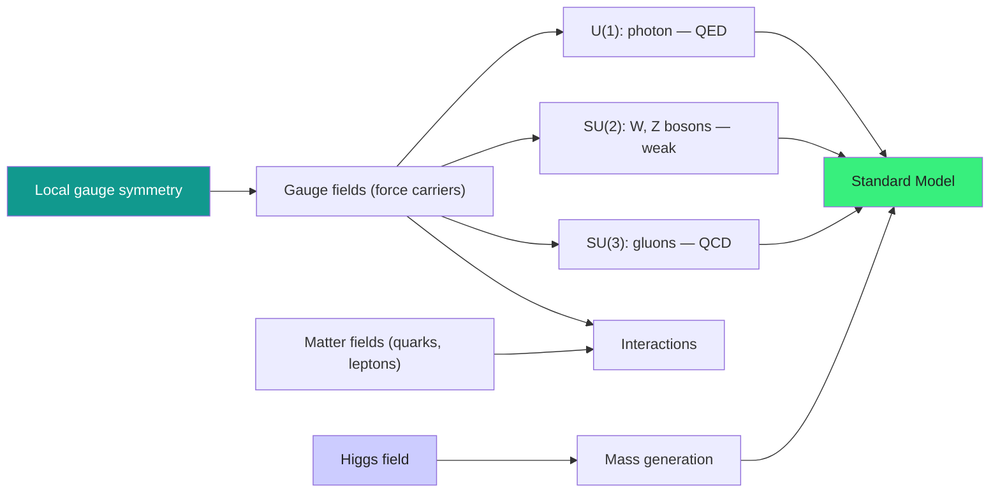

  <h1 style="color: white; margin: 0; font-size: 2.5rem;">Gauge Theories &amp; the Standard Model</h1>
  
How demanding local symmetry forces the existence of forces — from the photon of QED to the gluons of QCD, electroweak unification, the Higgs mechanism, and the full Standard Model Lagrangian.

[Physics](./) &raquo; [Quantum Field Theory](quantum-field-theory.html) &raquo; Gauge Theories &amp; the Standard Model

  
The Standard Model is not a list of forces bolted together by hand. It is the consequence of a single demand: that the phase (and the internal "color" or "flavor" label) of every matter field be choosable <em>independently at every point of spacetime</em>. That demand — <strong>local gauge symmetry</strong> — cannot be met by free fields alone. Repairing it forces new vector fields into existence, and those fields <em>are</em> the photon, the $W$ and $Z$ bosons, and the gluons. This page develops that argument from $U(1)$ electromagnetism up to the full $SU(3)_C \times SU(2)_L \times U(1)_Y$ gauge group, and shows how the Higgs mechanism gives the gauge bosons and fermions their masses without spoiling the symmetry.

  

    <i class="fas fa-shield-alt"></i>
    <h4>Symmetry dictates forces</h4>
    
A global symmetry made local cannot be maintained by the ordinary derivative — repairing it <em>forces</em> a gauge field into the theory.

  

  

    <i class="fas fa-project-diagram"></i>
    <h4>Non-abelian means self-interacting</h4>
    
When the symmetry group doesn't commute, the gauge bosons carry the charge themselves and interact with one another.

  

  

    <i class="fas fa-compress-arrows-alt"></i>
    <h4>Strong force gets weaker up close</h4>
    
QCD's coupling runs to zero at high energy (asymptotic freedom) and grows at long range (confinement).

  

  

    <i class="fas fa-wine-bottle"></i>
    <h4>Mass from a hidden symmetry</h4>
    
The Higgs field's vacuum value breaks electroweak symmetry, giving the $W$/$Z$ and fermions mass while leaving the photon massless.

  

### What You'll Find on This Page

| Section | What it covers |
|---------|----------------|
| [The Gauge Principle](#the-gauge-principle) | Global vs. local symmetry and the covariant derivative |
| [QED](#quantum-electrodynamics-qed) | The abelian $U(1)$ gauge theory of light and charge |
| [Yang-Mills Theory](#non-abelian-gauge-theory-yang-mills) | Non-abelian $SU(N)$ gauge fields and self-coupling |
| [QCD](#quantum-chromodynamics-qcd) | Color, asymptotic freedom, and confinement |
| [Electroweak Unification](#electroweak-unification) | Mixing $SU(2)_L \times U(1)_Y$ into the photon and $W/Z$ |
| [The Higgs Mechanism](#the-higgs-mechanism) | Spontaneous breaking and the origin of mass |
| [The Standard Model](#the-standard-model) | The full particle content, gauge group, and Lagrangian |

### The Big Picture: From Symmetry to the Standard Model

## The Gauge Principle

  <h4>The deepest idea in modern physics: forces from symmetry</h4>
  
A free electron's phase is unobservable — multiply its field by $e^{i\alpha}$ everywhere and nothing measurable changes (a <em>global</em> symmetry). Now demand something stronger: that we be free to choose that phase <em>independently at every point in spacetime</em> (a <em>local</em>, or gauge, symmetry). The ordinary derivative ruins this, because comparing the field at neighboring points now mixes in the arbitrary phase choices. To repair it we are <strong>forced</strong> to introduce a new field that "connects" the phases from point to point — and that field turns out to be precisely the photon. The electromagnetic force is not added by hand; it is the unavoidable consequence of insisting on local phase freedom. Repeat the argument with larger symmetry groups and you generate the $W$/$Z$ bosons ($SU(2)$) and the gluons ($SU(3)$). This single principle organizes the entire Standard Model.

### Global versus local symmetry

The free Dirac Lagrangian for a fermion field $\psi$,

$$\mathcal{L}_0 = \bar{\psi}(i\gamma^\mu\partial_\mu - m)\psi,$$

is invariant under the **global** $U(1)$ phase rotation $\psi \to e^{i\alpha}\psi$ with $\alpha$ a constant: the phase cancels between $\bar\psi$ and $\psi$, and $\partial_\mu$ acts only on $\psi$. By Noether's theorem this global symmetry implies a conserved current $j^\mu = \bar\psi\gamma^\mu\psi$ — conservation of electric charge.

Now promote $\alpha$ to a spacetime-dependent function $\alpha(x)$:

$$\psi \to e^{i\alpha(x)}\psi.$$

The mass term $-m\bar\psi\psi$ is still invariant, but the kinetic term is not, because the derivative now hits the local phase:

$$\partial_\mu\psi \to e^{i\alpha(x)}\bigl(\partial_\mu\psi + i(\partial_\mu\alpha)\psi\bigr).$$

The extra $i(\partial_\mu\alpha)\psi$ term spoils invariance. The geometric meaning is that the ordinary derivative compares $\psi$ at neighboring points $x$ and $x+dx$, but those points now use independently rotated reference phases, so the comparison is ill-defined.

### The covariant derivative

The cure is to introduce a **gauge field** $A_\mu$ that tells us how to "parallel transport" the phase from one point to the next, and to replace $\partial_\mu$ with the **covariant derivative**

$$D_\mu = \partial_\mu + igA_\mu.$$

We demand that $D_\mu\psi$ transform exactly like $\psi$ itself, i.e. $D_\mu\psi \to e^{i\alpha(x)}D_\mu\psi$. This fixes the transformation law of the gauge field:

$$A_\mu \to A_\mu - \frac{1}{g}\partial_\mu\alpha.$$

With this rule the unwanted $i(\partial_\mu\alpha)\psi$ generated by the derivative is exactly cancelled by the shift in $A_\mu$. Replacing $\partial_\mu \to D_\mu$ in $\mathcal{L}_0$ produces

$$\mathcal{L} = \bar\psi(i\gamma^\mu D_\mu - m)\psi = \underbrace{\bar\psi(i\gamma^\mu\partial_\mu - m)\psi}_{\text{free fermion}} \;-\; \underbrace{g\,\bar\psi\gamma^\mu\psi\,A_\mu}_{\text{interaction}}.$$

The interaction term — the coupling of the charge current to the gauge field — was not put in by hand. **It is the price of local invariance.**

### Dynamics for the gauge field

A propagating gauge field needs its own kinetic term, which must itself be gauge invariant. The gauge-invariant object built from $A_\mu$ is the **field strength**

$$F_{\mu\nu} = \partial_\mu A_\nu - \partial_\nu A_\mu,$$

which is unchanged under $A_\mu \to A_\mu - \tfrac{1}{g}\partial_\mu\alpha$ because mixed partial derivatives commute. The unique dimension-four, Lorentz-invariant, gauge-invariant kinetic term is

$$\mathcal{L}_{\text{gauge}} = -\frac{1}{4}F_{\mu\nu}F^{\mu\nu}.$$

Crucially, a mass term $\tfrac{1}{2}m_A^2 A_\mu A^\mu$ is **forbidden** by gauge invariance — it is not invariant under the shift of $A_\mu$. This is why the photon is exactly massless, and why giving the $W$/$Z$ a mass later will require the Higgs mechanism rather than a bare mass term.

## Quantum Electrodynamics (QED)

QED is the abelian gauge theory that results from gauging the $U(1)$ phase symmetry of the electron, with coupling $g = e$ (the elementary charge). It is the most precisely tested theory in all of physics.

### QED Lagrangian

$$\mathcal{L}_{\text{QED}} = \bar{\psi}(i\gamma^\mu D_\mu - m)\psi - \frac{1}{4}F_{\mu\nu}F^{\mu\nu}, \qquad D_\mu = \partial_\mu + ieA_\mu.$$

This single line contains the free electron, the free photon, and their interaction $-e\bar\psi\gamma^\mu\psi A_\mu$. The fine-structure constant $\alpha = e^2/4\pi \approx 1/137$ measures the strength of the coupling.

### Feynman rules for QED

The perturbative expansion of $\mathcal{L}_{\text{QED}}$ generates the following momentum-space rules:

**Vertex factor:** $-ie\gamma^\mu$

**Electron propagator:**

$$S_F(p) = \frac{i}{\not{p} - m + i\varepsilon} = \frac{i(\not{p}+m)}{p^2 - m^2 + i\varepsilon}$$

**Photon propagator (Feynman gauge):**

$$D^{\mu\nu}_F(k) = \frac{-ig^{\mu\nu}}{k^2 + i\varepsilon}$$

The freedom in the photon propagator (the gauge parameter $\xi$, set to $1$ in Feynman gauge) reflects the gauge redundancy and drops out of all physical amplitudes.

### Characteristic QED processes

- **Electron–positron scattering** (Bhabha / Møller): tree level is single-photon exchange; higher orders add loop corrections.
- **Compton scattering:** $\gamma + e^- \to \gamma + e^-$.
- **Pair production:** $\gamma \to e^+ + e^-$ (in an external field, to conserve momentum).
- **Annihilation:** $e^+ + e^- \to \gamma\gamma$.

### Precision triumphs

QED's defining success is the **anomalous magnetic moment** of the electron, $a_e = (g-2)/2$. Theory and experiment agree to better than twelve significant figures — the most stringent confirmation of any physical theory. The **Lamb shift** in hydrogen, a splitting of levels that are degenerate in the Dirac equation, is a direct measurement of QED radiative (vacuum-polarization and self-energy) corrections.

QED's coupling **grows** with energy: its one-loop $\beta$-function is positive,

$$\beta(e) = \frac{e^3}{12\pi^2} + O(e^5),$$

so the effective charge increases at short distances and formally hits a Landau pole at enormous energy. QED is therefore *not* asymptotically free — in sharp contrast to QCD below.

## Non-Abelian Gauge Theory (Yang-Mills)

Electromagnetism gauges a single phase. The richer case is to gauge a symmetry whose transformations **do not commute** — a non-abelian group such as $SU(N)$. This is the Yang–Mills construction (1954), the structural backbone of both the strong and the weak interactions.

### Matter in a representation

Let the matter field $\psi$ carry an internal index transforming in the fundamental representation of $SU(N)$:

$$\psi \to U(x)\,\psi, \qquad U(x) = \exp\!\bigl(i\,\alpha^a(x)\,T^a\bigr),$$

where the $T^a$ ($a = 1,\dots,N^2-1$) are the generators of the Lie algebra, obeying

$$[T^a, T^b] = if^{abc}T^c,$$

with $f^{abc}$ the (totally antisymmetric) **structure constants**. For $SU(2)$ the generators are $T^a = \sigma^a/2$ (Pauli matrices) and $f^{abc} = \varepsilon^{abc}$; for $SU(3)$ they are $T^a = \lambda^a/2$ (Gell-Mann matrices).

### The covariant derivative and gauge field

Local invariance now requires **one gauge field per generator**, $A^a_\mu$, collected into the matrix-valued field $A_\mu = A^a_\mu T^a$. The covariant derivative is

$$D_\mu = \partial_\mu + ig A^a_\mu T^a,$$

and gauge invariance fixes the transformation law of the gauge field to

$$A_\mu \to U A_\mu U^{-1} + \frac{i}{g}(\partial_\mu U)U^{-1}.$$

The first term — the homogeneous rotation $U A_\mu U^{-1}$ — is new compared to the abelian case and is the source of everything that follows.

### Field strength and self-interaction

Because the gauge field now transforms inhomogeneously under the group, the field strength acquires an extra non-abelian term:

$$F^a_{\mu\nu} = \partial_\mu A^a_\nu - \partial_\nu A^a_\mu + g f^{abc}A^b_\mu A^c_\nu.$$

The Yang–Mills Lagrangian keeps the same gauge-invariant form,

$$\mathcal{L}_{\text{YM}} = -\frac{1}{4}F^a_{\mu\nu}F^{a\mu\nu},$$

but the quadratic $gf^{abc}A^b_\mu A^c_\nu$ piece inside $F^a_{\mu\nu}$ means $\mathcal{L}_{\text{YM}}$ contains **cubic and quartic self-interactions of the gauge bosons**.

  <h4>Why gauge bosons interact with each other</h4>
  
In QED the photon is electrically neutral, so photons do not scatter off one another at tree level. In a non-abelian theory the gauge bosons transform among themselves (the $UA_\mu U^{-1}$ term), which means they carry the very charge they mediate: gluons carry color, the $W$ bosons carry weak isospin. This self-coupling is the single fact responsible for both asymptotic freedom and confinement in QCD.

## Quantum Chromodynamics (QCD)

QCD is the Yang–Mills theory of $SU(3)_C$ — the gauge theory of the strong force, binding quarks into protons, neutrons, and all other hadrons.

### Color charge

Each quark flavor comes in three **colors** (conventionally red, green, blue), forming a triplet in the fundamental representation of $SU(3)$:

$$q_i \to U_{ij}\,q_j, \qquad U \in SU(3).$$

The eight gauge bosons are the **gluons** $A^a_\mu$ ($a=1,\dots,8$), one for each generator of $SU(3)$. Unlike the photon, gluons themselves carry color charge and so interact directly with one another.

### QCD Lagrangian

$$\mathcal{L}_{\text{QCD}} = \sum_q \bar{q}_i\bigl(i\gamma^\mu D_\mu^{ij} - m\,\delta^{ij}\bigr)q_j - \frac{1}{4}G^a_{\mu\nu}G^{a\mu\nu},$$

with the color-covariant derivative and gluon field strength

$$D_\mu^{ij} = \delta^{ij}\partial_\mu + ig_s(T^a)^{ij}A^a_\mu,$$

$$G^a_{\mu\nu} = \partial_\mu A^a_\nu - \partial_\nu A^a_\mu + g_s f^{abc}A^b_\mu A^c_\nu.$$

Here $g_s$ is the strong coupling and $\alpha_s = g_s^2/4\pi$.

### Asymptotic freedom

The defining feature of QCD is that its coupling **decreases** at high energy. The one-loop running coupling is

$$\alpha_s(Q^2) = \frac{\alpha_s(\mu^2)}{1 + \dfrac{\alpha_s(\mu^2)}{4\pi}\,\beta_0\,\ln(Q^2/\mu^2)},$$

with the one-loop coefficient

$$\beta_0 = 11 - \frac{2}{3}n_f,$$

where $n_f$ is the number of active quark flavors. For any $n_f \le 16$ — and in particular the $n_f = 6$ of the real world — $\beta_0 > 0$, so $\alpha_s \to 0$ as $Q \to \infty$. The positive contribution $11$ comes entirely from the **gluon self-interaction** (gluon loops antiscreen color charge); the $-\tfrac{2}{3}n_f$ is the familiar fermion-loop screening. Gross, Wilczek, and Politzer received the 2004 Nobel Prize for discovering this. Physically, quarks probed at very short distances behave almost as free particles — which is why the parton model of deep-inelastic scattering works.

### Confinement

The flip side of asymptotic freedom is that the coupling **grows** at low energy / long distance. As $Q^2$ decreases toward $\Lambda_{\text{QCD}} \sim 200$ MeV the denominator above vanishes and perturbation theory breaks down. The empirical and lattice result is a linearly rising potential between a static quark–antiquark pair:

$$V(r) \approx -\frac{4}{3}\frac{\alpha_s}{r} + k\,r,$$

with string tension $k \approx 1$ GeV/fm. The energy needed to separate two quarks grows without bound; long before they are free, the stored energy materializes a new quark–antiquark pair. The consequence is **color confinement**: only color-singlet combinations — mesons ($q\bar q$) and baryons ($qqq$) — appear as isolated particles. No free quark or gluon has ever been observed.

## Electroweak Unification

The weak interaction and electromagnetism are two faces of a single $SU(2)_L \times U(1)_Y$ gauge theory — the Glashow–Weinberg–Salam model. The subscripts encode its two defining features: the $SU(2)$ acts only on **left-handed** fields ($L$), and the $U(1)$ charge is **weak hypercharge** ($Y$), not ordinary electric charge.

### Gauge fields before symmetry breaking

The electroweak gauge group has four gauge bosons:

- $W^1_\mu, W^2_\mu, W^3_\mu$ — the three $SU(2)_L$ gauge fields, with coupling $g$;
- $B_\mu$ — the single $U(1)_Y$ gauge field, with coupling $g'$.

Left-handed fermions are grouped into $SU(2)_L$ doublets, e.g. $\binom{\nu_e}{e}_L$ and $\binom{u}{d}_L$, while right-handed fermions are $SU(2)_L$ singlets. This chiral structure is why the weak force violates parity.

### Mixing into the physical bosons

The physical, mass-eigenstate bosons are linear combinations of the gauge eigenstates, controlled by the **Weinberg (weak mixing) angle** $\theta_W$, defined by $\tan\theta_W = g'/g$:

$$W^\pm_\mu = \frac{1}{\sqrt{2}}\bigl(W^1_\mu \mp iW^2_\mu\bigr),$$

$$Z_\mu = W^3_\mu\cos\theta_W - B_\mu\sin\theta_W,$$

$$A_\mu = W^3_\mu\sin\theta_W + B_\mu\cos\theta_W.$$

The combination $A_\mu$ is the photon — it remains massless because it corresponds to the unbroken $U(1)_{EM}$ subgroup. The orthogonal combination $Z_\mu$, together with the charged $W^\pm_\mu$, acquires mass through the Higgs mechanism. The electric charge is recovered as

$$e = g\sin\theta_W = g'\cos\theta_W,$$

so the single relation ties together the electromagnetic and weak couplings — the essence of *unification*. Measured value: $\sin^2\theta_W \approx 0.231$.

## The Higgs Mechanism

Gauge invariance forbids explicit mass terms for the gauge bosons, yet the $W$ and $Z$ are heavy ($\sim 80$–$91$ GeV). The resolution is **spontaneous symmetry breaking**: the symmetry of the Lagrangian is exact, but the *vacuum* does not share it.

  <h4>The pencil that has to fall: where mass comes from</h4>
  
A pencil balanced on its tip is perfectly symmetric — no direction is special. But that balanced state is unstable; the pencil <em>must</em> topple, and the moment it does, it picks one direction and the symmetry is hidden. The laws stayed symmetric; the <em>state</em> did not. This is spontaneous symmetry breaking, and it is how particles get mass in the Standard Model. The Higgs field sits in a potential shaped like a Mexican hat (or a wine bottle's punt): the symmetric point at the center is a local <em>maximum</em>, so the field rolls down into the circular trough and acquires a nonzero vacuum value $v$ everywhere in space. Particles that interact with this pervasive background field are slowed — they behave as if they have mass — while the photon, which does not couple to it, stays massless and travels at $c$.

### The Mexican-hat potential

Introduce a complex scalar field (in the Standard Model, an $SU(2)_L$ doublet $\phi$) with the potential

$$V(\phi) = -\mu^2|\phi|^2 + \lambda|\phi|^4, \qquad \mu^2 > 0,\ \lambda > 0.$$

The point $\phi = 0$ is an unstable maximum. The minima form a circle (a sphere of vacua) at

$$|\langle\phi\rangle| = v = \sqrt{\frac{\mu^2}{2\lambda}}.$$

The field rolls into the trough and picks one point on the circle, breaking the symmetry spontaneously. The measured electroweak vacuum value is $v \approx 246$ GeV.

### Goldstone's theorem and the Higgs mechanism

**Goldstone's theorem:** spontaneous breaking of a continuous *global* symmetry produces one massless scalar (a Goldstone boson) for each broken generator. In a *gauge* theory, however, something better happens. The would-be Goldstone bosons are not physical: they can be removed by a gauge transformation (unitary gauge), where they reappear as the **longitudinal polarization** of the gauge bosons. The gauge bosons "eat" the Goldstones and thereby acquire mass:

- Each broken generator gives its gauge boson a mass and a longitudinal mode.
- No physical Goldstone bosons remain in the spectrum.
- One physical scalar survives — the **Higgs boson** $h$, the radial excitation of $\phi$.

### Masses generated

Expanding the Higgs doublet around its vacuum value and reading off the quadratic terms gives the gauge-boson masses

$$m_W = \frac{1}{2}g\,v, \qquad m_Z = \frac{m_W}{\cos\theta_W}, \qquad m_\gamma = 0.$$

The relation $m_W = m_Z\cos\theta_W$ is a sharp, testable prediction of the minimal (doublet) Higgs sector — confirmed experimentally. Fermion masses arise separately, from gauge-invariant **Yukawa couplings** $y_f\,\bar\psi_L\,\phi\,\psi_R$ that turn into $m_f = y_f v/\sqrt{2}$ once $\phi$ takes its vacuum value. The large hierarchy of fermion masses (from the electron at $0.5$ MeV to the top at $173$ GeV) is just the hierarchy of these Yukawa couplings — the Standard Model does not predict them.

The Higgs boson itself has mass $m_h = \sqrt{2\lambda}\,v \approx 125$ GeV, measured at the LHC in 2012.

## The Standard Model

The Standard Model is the crowning achievement of QFT: a single Lagrangian, built from the gauge principle plus the Higgs mechanism, that accounts for every confirmed elementary particle and three of the four known forces. It is organized around the gauge group

$$SU(3)_C \times SU(2)_L \times U(1)_Y,$$

one factor for each force, acting on a fixed roster of matter fields. The pieces below are the entire known particle content of the universe (gravity excepted).

### Gauge groups

- $SU(3)_C$: **color** — the strong force (8 gluons).
- $SU(2)_L$: **weak isospin** — acts only on left-handed fields.
- $U(1)_Y$: **weak hypercharge** — combines with $SU(2)_L$ to yield electromagnetism after symmetry breaking.

After the Higgs mechanism, $SU(2)_L \times U(1)_Y$ breaks down to $U(1)_{EM}$, leaving the unbroken $SU(3)_C \times U(1)_{EM}$ of the strong and electromagnetic forces.

### Particle content

**Quarks (spin-½), three generations:**

- Up-type: $u$, $c$, $t$
- Down-type: $d$, $s$, $b$

**Leptons (spin-½), three generations:**

- Charged: $e$, $\mu$, $\tau$
- Neutrinos: $\nu_e$, $\nu_\mu$, $\nu_\tau$

**Gauge bosons (spin-1):**

- Photon ($\gamma$): electromagnetic force, massless
- $W^\pm$, $Z$: weak force, massive
- Gluons ($g$): strong force, 8 massless color octet

**Higgs boson (spin-0):** the quantum of the field that breaks electroweak symmetry and supplies mass.

### The three gauge forces at a glance

| Force | Gauge group | Carrier(s) | Charge | Relative strength | Range |
|-------|-------------|------------|--------|-------------------|-------|
| Strong | $SU(3)_C$ | 8 gluons | color | $\sim 1$ | $\sim 10^{-15}$ m (confined) |
| Electromagnetic | $U(1)_{EM}$ | photon | electric | $\sim 10^{-2}$ | infinite |
| Weak | $SU(2)_L$ | $W^\pm, Z$ | weak isospin | $\sim 10^{-6}$ | $\sim 10^{-18}$ m |
| Gravity* | — | (graviton?) | mass-energy | $\sim 10^{-38}$ | infinite |

*Gravity is not part of the Standard Model — quantizing it remains an open problem. Strengths are order-of-magnitude comparisons at low energy; the strong and electromagnetic couplings converge toward each other at high energy.

### The Standard Model Lagrangian, schematically

Every term in the Standard Model is fixed by the gauge group and the chosen matter representations:

$$\mathcal{L}_{\text{SM}} = \underbrace{-\frac{1}{4}\sum_a F^a_{\mu\nu}F^{a\mu\nu}}_{\text{gauge kinetic}} + \underbrace{\sum_\psi \bar\psi\,i\gamma^\mu D_\mu\,\psi}_{\text{fermion kinetic + interactions}} + \underbrace{|D_\mu\phi|^2 - V(\phi)}_{\text{Higgs}} - \underbrace{\bigl(y_f\,\bar\psi_L\,\phi\,\psi_R + \text{h.c.}\bigr)}_{\text{Yukawa}}.$$

The covariant derivative $D_\mu$ contains all three gauge fields, with each field coupling only to the matter that carries the corresponding charge. There are no free choices in the *structure* — only in the numerical parameters (the gauge couplings, the Yukawa couplings, the Higgs $\mu$ and $\lambda$, and the CKM mixing angles).

### Anomaly cancellation

A subtle consistency requirement is that the chiral gauge symmetries be free of **quantum anomalies** — gauge currents that are conserved classically but not quantum-mechanically would render the theory inconsistent. The triangle-diagram anomalies cancel only when summed over a *complete* generation of quarks and leptons, with the quark color factor of 3 playing an essential role. This is a remarkable internal harmony: the existence of three colors and the matching of quark and lepton charges are tied together by quantum consistency.

### Experimental confirmation

- **W and Z bosons (1983, CERN):** confirmed electroweak unification, with masses matching $m_W = m_Z\cos\theta_W$.
- **Top quark (1995, Fermilab):** completed the third generation at $m_t \approx 173$ GeV.
- **Higgs boson (2012, LHC):** confirmed the mass-generation mechanism, $m_h \approx 125$ GeV.
- **Precision electroweak fits** at LEP tested the theory at the per-mille level across dozens of observables.

### What the Standard Model leaves out

Despite its success, the Standard Model is incomplete:

1. **Neutrino masses** — observed oscillations require nonzero masses not present in the minimal model.
2. **Dark matter** — no Standard Model particle fits.
3. **The hierarchy problem** — why the Higgs mass is so far below the Planck scale.
4. **The strong CP problem** — why the QCD vacuum angle $\theta_{\text{QCD}} \approx 0$.
5. **Gravity** — not included; quantizing it remains open.
6. **Matter–antimatter asymmetry** — Standard Model CP violation is too small to explain it.

These gaps motivate grand unified theories, supersymmetry, and other physics beyond the Standard Model.

## Key Takeaways

  

    <h4>Local symmetry forces gauge fields</h4>
    
Promoting a global phase to a local one cannot be done with the ordinary derivative; the covariant derivative $D_\mu = \partial_\mu + igA_\mu$ drags in a gauge field whose interaction term is mandatory, not optional.

  

  

    <h4>Abelian vs. non-abelian</h4>
    
$U(1)$ gives the neutral, non-self-interacting photon; $SU(N)$ gauge bosons carry charge and couple to themselves via the $gf^{abc}A^b A^c$ term in the field strength.

  

  

    <h4>QCD runs the opposite way to QED</h4>
    
Gluon self-interaction makes $\beta_0 = 11 - \tfrac{2}{3}n_f > 0$, giving asymptotic freedom at high energy and confinement at long range.

  

  

    <h4>Electroweak mixing</h4>
    
$SU(2)_L \times U(1)_Y$ mixes through the Weinberg angle into the massless photon and the massive $W^\pm$, $Z$, with $e = g\sin\theta_W$.

  

  

    <h4>The Higgs gives mass</h4>
    
A nonzero vacuum value breaks electroweak symmetry; gauge bosons eat the Goldstones to become massive ($m_W = m_Z\cos\theta_W$), and Yukawa couplings give fermions their masses.

  

  

    <h4>One Lagrangian, fixed by symmetry</h4>
    
$SU(3)_C \times SU(2)_L \times U(1)_Y$ plus the Higgs determines the entire structure of the Standard Model; only the numerical parameters are free.

  

## See Also

  <h4>Where to go next</h4>
  <ul>
    <li><a href="quantum-field-theory.html">Quantum Field Theory</a> — fields, quantization, propagators, renormalization, and the path integral that underlie this page.</li>
    <li><a href="quantum-mechanics/">Quantum Mechanics</a> — the non-relativistic foundation that QFT generalizes.</li>
    <li><a href="relativity/">Relativity</a> — special relativity is what makes gauge theories Lorentz-invariant.</li>
    <li><a href="string-theory/">String Theory</a> — an attempt to unify the gauge forces with gravity.</li>
    <li><a href="index.html">Physics Hub</a> — browse all physics topics.</li>
  </ul>

