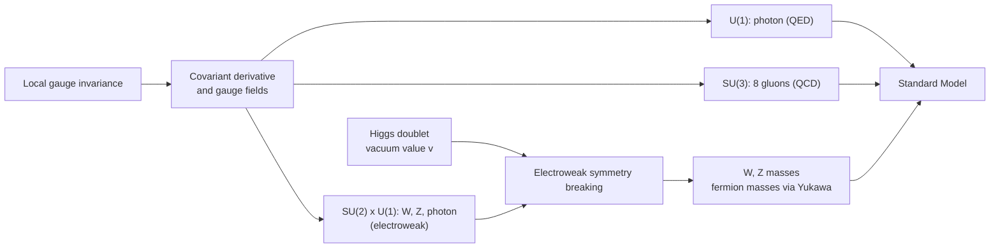
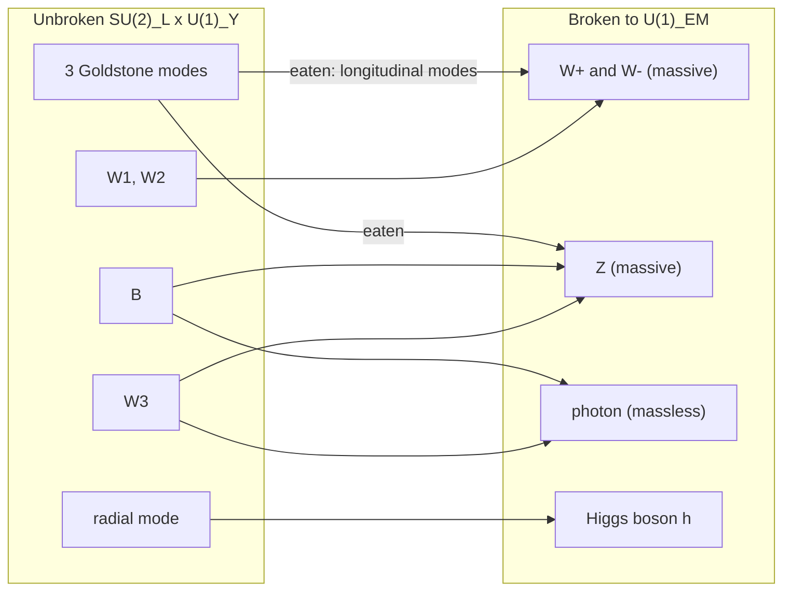

[Physics](./) &raquo; [Quantum Field Theory](quantum-field-theory.html) &raquo; Gauge Theories &amp; the Standard Model

The **Standard Model** of particle physics is a quantum field theory with gauge group $SU(3)_C \times SU(2)_L \times U(1)_Y$, three generations of quarks and leptons, and one scalar doublet, the Higgs field. Its structure follows from one requirement: that the theory be invariant under symmetry transformations chosen *independently at each spacetime point* (**local gauge invariance**). Meeting that requirement forces vector fields into the theory, and those fields are the photon, the $W$ and $Z$ bosons, and the gluons. This page builds the argument from $U(1)$ electromagnetism through non-abelian Yang-Mills theory to QCD and the electroweak theory, then shows how the Higgs mechanism gives mass to the $W$, $Z$, and fermions without breaking the gauge symmetry of the Lagrangian. It closes with the particle content, parameters, current experimental status, and what the Standard Model does not explain.

It assumes the free-field material of [Canonical Quantization](qft-quantization.html). Loop effects and running couplings are developed in [Renormalization](renormalization.html); the path-integral quantization of gauge fields (gauge fixing, Faddeev-Popov ghosts) is in [Path Integrals & Methods](qft-methods.html).

**Conventions.** Natural units $\hbar = c = 1$, metric signature $(+,-,-,-)$, covariant derivative $D_\mu = \partial_\mu + igA_\mu$. Many textbooks (e.g. Peskin & Schroeder) use $D_\mu = \partial_\mu - igA_\mu$; this flips the sign of $g$ in the interaction vertex and in the non-abelian term of the field strength, and has no physical consequence.

## The Gauge Principle

### Global versus local symmetry

The free Dirac Lagrangian

$$\mathcal{L}_0 = \bar{\psi}(i\gamma^\mu\partial_\mu - m)\psi$$

is invariant under the **global** $U(1)$ phase rotation $\psi \to e^{i\alpha}\psi$ with constant $\alpha$. By Noether's theorem the symmetry implies a conserved current $j^\mu = \bar\psi\gamma^\mu\psi$ — conservation of charge.

Now let the phase depend on position, $\psi \to e^{i\alpha(x)}\psi$. The mass term is still invariant, but the derivative picks up an extra piece:

$$\partial_\mu\psi \to e^{i\alpha(x)}\bigl(\partial_\mu\psi + i(\partial_\mu\alpha)\,\psi\bigr).$$

Geometrically, $\partial_\mu\psi$ compares the field at neighboring points whose phase conventions are now chosen independently, so the comparison is not meaningful without extra structure.

### The covariant derivative

The extra structure is a **connection**: a vector field $A_\mu$ that specifies how to compare phases between neighboring points. Replace $\partial_\mu$ with the **covariant derivative**

$$D_\mu = \partial_\mu + igA_\mu,$$

and require $D_\mu\psi \to e^{i\alpha(x)}D_\mu\psi$. This fixes the transformation of the gauge field,

$$A_\mu \to A_\mu - \frac{1}{g}\partial_\mu\alpha,$$

which cancels the unwanted term. The gauge-invariant Lagrangian is

$$\mathcal{L} = \bar\psi(i\gamma^\mu D_\mu - m)\psi = \bar\psi(i\gamma^\mu\partial_\mu - m)\psi \;-\; g\,\bar\psi\gamma^\mu\psi\,A_\mu.$$

The interaction $-g\,j^\mu A_\mu$, coupling the conserved current to the gauge field, is not an independent assumption: it is required by local invariance.

### Field strength and the ban on gauge-boson mass

The gauge-invariant combination of derivatives of $A_\mu$ is the **field strength**

$$F_{\mu\nu} = \partial_\mu A_\nu - \partial_\nu A_\mu = \frac{1}{ig}\,[D_\mu, D_\nu],$$

and the unique Lorentz- and gauge-invariant kinetic term of mass dimension four (with parity conserved) is $-\tfrac{1}{4}F_{\mu\nu}F^{\mu\nu}$, which reproduces Maxwell's equations. A mass term $\tfrac{1}{2}m_A^2 A_\mu A^\mu$ is **not** gauge invariant. Exact gauge symmetry therefore implies a massless gauge boson — which is why the photon is massless, and why the massive $W$ and $Z$ require the Higgs mechanism rather than an explicit mass term.

In geometric language, $A_\mu$ is a connection on a principal bundle with structure group $G$, $F_{\mu\nu}$ is its curvature, and gauge transformations are changes of local frame. The Aharonov-Bohm effect shows that the gauge-invariant holonomy $\exp\left(ie\oint A_\mu\,dx^\mu\right)$ is physical even where $F_{\mu\nu} = 0$.

## Quantum Electrodynamics (QED)

QED is the $U(1)$ gauge theory of charged fermions and the photon:

$$\mathcal{L}_{\text{QED}} = \bar{\psi}(i\gamma^\mu D_\mu - m)\psi - \frac{1}{4}F_{\mu\nu}F^{\mu\nu}, \qquad D_\mu = \partial_\mu + ieQA_\mu,$$

where $Q$ is the charge in units of $e > 0$ ($Q = -1$ for the electron). The fine-structure constant $\alpha = e^2/4\pi \approx 1/137.036$ sets the coupling strength.

### Feynman rules

| Element | Momentum-space factor |
|---------|----------------------|
| Vertex (fermion of charge $Q$) | $-ieQ\gamma^\mu$ |
| Fermion propagator | $\dfrac{i(\not{p} + m)}{p^2 - m^2 + i\varepsilon}$ |
| Photon propagator, $R_\xi$ gauge | $\dfrac{-i}{k^2 + i\varepsilon}\left[g^{\mu\nu} - (1-\xi)\dfrac{k^\mu k^\nu}{k^2}\right]$ |

$\xi = 1$ is Feynman gauge and $\xi = 0$ Landau gauge. The $\xi$-dependence cancels in every physical amplitude because the photon couples to a conserved current (the **Ward identity** $k_\mu \mathcal{M}^\mu = 0$).

Tree-level processes include Compton scattering ($\gamma e^- \to \gamma e^-$), Møller ($e^-e^- \to e^-e^-$) and Bhabha ($e^+e^- \to e^+e^-$) scattering, pair annihilation ($e^+e^- \to \gamma\gamma$), and pair production in the field of a nucleus.

### Running coupling

Vacuum polarization screens charge, so the effective coupling grows at short distances. The one-loop beta function for a single Dirac fermion is

$$\beta(e) = \mu\frac{de}{d\mu} = \frac{e^3}{12\pi^2}.$$

Including all charged Standard Model fermions, $\alpha$ rises from $1/137.036$ at low energy to about $1/128$ at the $Z$ mass. Extrapolated far beyond the Planck scale, the one-loop coupling diverges (the **Landau pole**), signaling that pure QED is not a complete theory at arbitrarily high energy.

### Precision tests

| Observable | Status |
|------------|--------|
| Electron $g-2$ | $g/2$ measured to about 0.13 parts per trillion (Fan et al., Northwestern, 2023). The SM prediction (5-loop QED plus small hadronic and electroweak terms) agrees, with the comparison limited by the input value of $\alpha$: the two best recoil measurements (Cs, 2018; Rb, 2020) disagree with each other by several standard deviations. |
| Muon $g-2$ | Fermilab's final result (2025) measures $a_\mu$ to 127 ppb; the world average reaches 124 ppb. The 2025 Theory Initiative prediction, which takes the hadronic vacuum polarization from lattice QCD, agrees with experiment. The earlier $\sim 4$–$5\sigma$ "anomaly" relied on $e^+e^-\to$ hadrons data whose data sets are themselves in tension. |
| Lamb shift | The $2S_{1/2}$–$2P_{1/2}$ splitting in hydrogen (about 1058 MHz), degenerate in the Dirac equation, is a direct measurement of self-energy and vacuum-polarization corrections. |

## Non-Abelian Gauge Theory (Yang-Mills)

Yang and Mills (1954) gauged a symmetry whose transformations do not commute. This construction underlies both the strong and weak interactions.

### Matter fields and generators

Let $\psi$ be a multiplet transforming under $SU(N)$:

$$\psi \to U(x)\,\psi, \qquad U(x) = \exp\bigl(i\,\alpha^a(x)\,T^a\bigr), \qquad [T^a, T^b] = if^{abc}T^c,$$

with $a = 1,\dots,N^2-1$ and totally antisymmetric **structure constants** $f^{abc}$. For $SU(2)$, $T^a = \sigma^a/2$ and $f^{abc} = \epsilon^{abc}$; for $SU(3)$, $T^a = \lambda^a/2$ with the Gell-Mann matrices $\lambda^a$. Generators are normalized by $\operatorname{Tr}(T^aT^b) = \tfrac{1}{2}\delta^{ab}$.

### Covariant derivative and field strength

Local invariance requires one gauge field per generator, $A_\mu = A^a_\mu T^a$, with

$$D_\mu = \partial_\mu + igA^a_\mu T^a, \qquad A_\mu \to UA_\mu U^{-1} + \frac{i}{g}(\partial_\mu U)U^{-1}.$$

The field strength follows from the commutator of covariant derivatives, $F_{\mu\nu} = (ig)^{-1}[D_\mu, D_\nu]$:

$$F^a_{\mu\nu} = \partial_\mu A^a_\nu - \partial_\nu A^a_\mu - g f^{abc}A^b_\mu A^c_\nu.$$

Unlike the abelian case, $F_{\mu\nu}$ is not gauge invariant but **covariant**, $F_{\mu\nu} \to UF_{\mu\nu}U^{-1}$, so the invariant kinetic term uses a trace:

$$\mathcal{L}_{\text{YM}} = -\frac{1}{2}\operatorname{Tr}\left(F_{\mu\nu}F^{\mu\nu}\right) = -\frac{1}{4}F^a_{\mu\nu}F^{a\mu\nu}.$$

### Self-interaction

The quadratic term in $F^a_{\mu\nu}$ makes $\mathcal{L}_{\text{YM}}$ contain **cubic and quartic gauge-boson self-couplings**. Physically, the gauge bosons carry the charge they mediate: gluons carry color, and $W$ bosons carry weak isospin. The photon is neutral and has no tree-level self-coupling. Gluon self-interaction is the origin of asymptotic freedom and, non-perturbatively, of confinement.

| Property | Abelian ($U(1)$) | Non-abelian ($SU(N)$) |
|----------|------------------|----------------------|
| Number of gauge bosons | 1 | $N^2 - 1$ |
| Gauge bosons charged? | No | Yes (adjoint representation) |
| Field strength | Invariant | Covariant: $F \to UFU^{-1}$ |
| Self-couplings | None | Cubic and quartic |
| Faddeev-Popov ghosts | Decouple | Required in covariant gauges |
| One-loop running (pure gauge) | — | Coupling decreases at high energy |

Quantizing Yang-Mills in a covariant gauge requires **Faddeev-Popov ghosts**, anticommuting scalar fields that cancel unphysical gauge-boson polarizations in loops; the residual **BRST symmetry** of the gauge-fixed action ensures that physical amplitudes are gauge independent and unitary. 't Hooft and Veltman proved in 1971–72 that Yang-Mills theories, including those with spontaneous breaking, are renormalizable (Nobel Prize 1999).

## Quantum Chromodynamics (QCD)

QCD is the $SU(3)_C$ Yang-Mills theory of quarks and gluons.

### Lagrangian

Each quark flavor $q$ is a color triplet $q_i$, $i = 1,2,3$. With eight gluon fields $G^a_\mu$,

$$\mathcal{L}_{\text{QCD}} = \sum_{q} \bar{q}_i\bigl(i\gamma^\mu (D_\mu)_{ij} - m_q\delta_{ij}\bigr)q_j - \frac{1}{4}G^a_{\mu\nu}G^{a\mu\nu} + \frac{\theta g_s^2}{32\pi^2}G^a_{\mu\nu}\tilde{G}^{a\mu\nu},$$

$$(D_\mu)_{ij} = \delta_{ij}\partial_\mu + ig_s(T^a)_{ij}G^a_\mu, \qquad G^a_{\mu\nu} = \partial_\mu G^a_\nu - \partial_\nu G^a_\mu - g_s f^{abc}G^b_\mu G^c_\nu.$$

The last term, with $\tilde{G}^{a\mu\nu} = \tfrac{1}{2}\epsilon^{\mu\nu\rho\sigma}G^a_{\rho\sigma}$, is a total derivative that nevertheless affects physics through topologically nontrivial field configurations (instantons). It violates CP; see the strong CP problem below.

### Asymptotic freedom

At one loop the strong coupling $\alpha_s = g_s^2/4\pi$ runs as

$$\alpha_s(Q^2) = \frac{\alpha_s(\mu^2)}{1 + \dfrac{\beta_0}{4\pi}\,\alpha_s(\mu^2)\ln\left(Q^2/\mu^2\right)}, \qquad \beta_0 = 11 - \frac{2}{3}n_f,$$

where $n_f$ is the number of quark flavors lighter than $Q$. The $11$ (for $SU(3)$, in general $\tfrac{11}{3}N$) comes from gluon loops and **anti-screens** color charge; the $-\tfrac{2}{3}n_f$ is ordinary quark-loop screening. For $n_f \le 16$, $\beta_0 > 0$ and $\alpha_s \to 0$ at high energy — **asymptotic freedom** (Gross, Wilczek, Politzer, 1973; Nobel Prize 2004). This is why quarks inside a proton behave as nearly free partons in deep-inelastic scattering. The world average is $\alpha_s(m_Z) \approx 0.118$, determined to below 1% from lattice QCD, $\tau$ decays, jet rates, and deep-inelastic scattering, all consistent with the predicted running.

Writing the one-loop result as $\alpha_s(Q^2) = 4\pi/[\beta_0\ln(Q^2/\Lambda^2)]$ defines the scale $\Lambda_{\text{QCD}} \approx 200$–$300$ MeV (scheme and $n_f$ dependent), below which perturbation theory fails. The QCD scale is generated from a dimensionless coupling by quantum effects — **dimensional transmutation**.

### Confinement and the origin of hadron mass

At distances beyond about $1/\Lambda_{\text{QCD}} \sim 1$ fm, lattice QCD shows the static quark–antiquark potential rising linearly (the Cornell form):

$$V(r) \approx -\frac{4}{3}\frac{\alpha_s}{r} + \sigma r, \qquad \sigma \approx 0.9\ \text{GeV/fm}.$$

Chromoelectric flux is squeezed into a tube, and pulling quarks apart eventually makes it energetically favorable to create a new $q\bar q$ pair. Only color singlets — mesons ($q\bar q$), baryons ($qqq$), and exotic multiquark states such as the tetraquarks and pentaquarks observed at LHCb — appear as free particles. A proof that pure Yang-Mills theory has a mass gap is another Clay Millennium Prize Problem.

Confinement also explains where visible mass comes from. The up and down quarks have masses of only a few MeV, yet the proton weighs $938$ MeV. Lattice QCD computes the light-hadron spectrum from first principles to percent-level accuracy; nearly all of the nucleon mass is gluon field energy and quark kinetic energy, not Higgs-generated quark mass. Spontaneous breaking of approximate chiral symmetry by the quark condensate $\langle\bar q q\rangle \neq 0$ makes the pions light pseudo-Goldstone bosons.

## Electroweak Unification

The Glashow-Weinberg-Salam theory is an $SU(2)_L \times U(1)_Y$ gauge theory. $SU(2)_L$ acts only on **left-handed** fermions — this chirality is why the weak interaction violates parity maximally — and the $U(1)$ charge is **weak hypercharge** $Y$, related to electric charge by

$$Q = T_3 + Y.$$

There are four gauge fields: $W^{1,2,3}_\mu$ with coupling $g$ and $B_\mu$ with coupling $g'$.

### Quantum numbers of one generation

| Field | $SU(3)_C$ | $SU(2)_L$ | $Y$ | Electric charges |
|-------|-----------|-----------|-----|------------------|
| $Q_L = (u_L, d_L)$ | 3 | 2 | $+\tfrac{1}{6}$ | $+\tfrac{2}{3}, -\tfrac{1}{3}$ |
| $u_R$ | 3 | 1 | $+\tfrac{2}{3}$ | $+\tfrac{2}{3}$ |
| $d_R$ | 3 | 1 | $-\tfrac{1}{3}$ | $-\tfrac{1}{3}$ |
| $L_L = (\nu_L, e_L)$ | 1 | 2 | $-\tfrac{1}{2}$ | $0, -1$ |
| $e_R$ | 1 | 1 | $-1$ | $-1$ |
| Higgs $\phi$ | 1 | 2 | $+\tfrac{1}{2}$ | $+1, 0$ |

The other two generations repeat this pattern with heavier masses. No right-handed neutrino appears in the minimal model.

### Mixing into physical bosons

After symmetry breaking the mass eigenstates are

$$W^\pm_\mu = \frac{1}{\sqrt{2}}\left(W^1_\mu \mp iW^2_\mu\right), \qquad \begin{pmatrix} Z_\mu \\ A_\mu \end{pmatrix} = \begin{pmatrix} \cos\theta_W & -\sin\theta_W \\ \sin\theta_W & \cos\theta_W \end{pmatrix}\begin{pmatrix} W^3_\mu \\ B_\mu \end{pmatrix},$$

with the **weak mixing angle** $\tan\theta_W = g'/g$. The photon $A_\mu$ couples to $Q$ with strength

$$e = g\sin\theta_W = g'\cos\theta_W,$$

so the electromagnetic coupling is fixed by the two electroweak couplings. Experimentally $\sin^2\theta_W \approx 0.2312$ (in the $\overline{\text{MS}}$ scheme at the $Z$ mass). The $W^\pm$ mediate charged-current processes such as beta decay; the $Z$ mediates the **neutral currents** discovered at CERN's Gargamelle bubble chamber in 1973, the first confirmation of the theory.

At energies far below $m_W$, $W$ exchange reduces to Fermi's four-fermion contact interaction with

$$\frac{G_F}{\sqrt{2}} = \frac{g^2}{8m_W^2}, \qquad G_F \approx 1.166\times 10^{-5}\ \text{GeV}^{-2},$$

which explains why the weak interaction is weak: not a small coupling ($g \approx 0.65$ is larger than $e \approx 0.31$), but a heavy mediator.

## The Higgs Mechanism

Gauge invariance forbids explicit masses for the $W$ and $Z$, and also for the fermions, since $m\bar\psi\psi = m(\bar\psi_L\psi_R + \bar\psi_R\psi_L)$ couples an $SU(2)_L$ doublet to a singlet. Both problems are solved by **spontaneous symmetry breaking**: the Lagrangian keeps the full symmetry, but the vacuum does not.

### The Higgs potential

The Higgs field is an $SU(2)_L$ doublet $\phi$ with hypercharge $\tfrac{1}{2}$ and potential

$$V(\phi) = -\mu^2\,\phi^\dagger\phi + \lambda\left(\phi^\dagger\phi\right)^2, \qquad \mu^2 > 0,\ \lambda > 0.$$

<figure style="margin:1.5rem auto; max-width:600px;">
<svg viewBox="0 0 640 250" width="100%" role="img" aria-labelledby="higgs-pot-title" style="color:currentColor; background:transparent;">
<title id="higgs-pot-title">Cross-section of the Higgs potential: a local maximum at zero field and minima at field value v over root two</title>
<line x1="40" y1="80" x2="610" y2="80" stroke="currentColor" stroke-width="1" opacity="0.5"/>
<line x1="320" y1="5" x2="320" y2="230" stroke="currentColor" stroke-width="1" opacity="0.5"/>
<path d="M65.0,12.5 L73.5,54.1 L82.0,89.4 L90.5,118.8 L99.0,142.9 L107.5,162.0 L116.0,176.8 L124.5,187.5 L133.0,194.7 L141.5,198.7 L150.0,200.0 L158.5,198.9 L167.0,195.7 L175.5,190.8 L184.0,184.4 L192.5,177.0 L201.0,168.8 L209.5,160.0 L218.0,150.8 L226.5,141.6 L235.0,132.5 L243.5,123.7 L252.0,115.3 L260.5,107.6 L269.0,100.6 L277.5,94.5 L286.0,89.4 L294.5,85.3 L303.0,82.4 L311.5,80.6 L320.0,80.0 L328.5,80.6 L337.0,82.4 L345.5,85.3 L354.0,89.4 L362.5,94.5 L371.0,100.6 L379.5,107.6 L388.0,115.3 L396.5,123.7 L405.0,132.5 L413.5,141.6 L422.0,150.8 L430.5,160.0 L439.0,168.8 L447.5,177.0 L456.0,184.4 L464.5,190.8 L473.0,195.7 L481.5,198.9 L490.0,200.0 L498.5,198.7 L507.0,194.7 L515.5,187.5 L524.0,176.8 L532.5,162.0 L541.0,142.9 L549.5,118.8 L558.0,89.4 L566.5,54.1 L575.0,12.5" fill="none" stroke="currentColor" stroke-width="2.5"/>
<circle cx="320" cy="72" r="7" fill="none" stroke="currentColor" stroke-width="2"/>
<circle cx="490" cy="192" r="7" fill="currentColor"/>
<line x1="490" y1="200" x2="490" y2="222" stroke="currentColor" stroke-width="1" stroke-dasharray="4 3"/>
<text x="478" y="240" font-size="14" fill="currentColor">v/&#8730;2</text>
<text x="328" y="60" font-size="13" fill="currentColor">symmetric point: unstable maximum</text>
<text x="500" y="178" font-size="13" fill="currentColor">vacuum</text>
<text x="585" y="100" font-size="14" fill="currentColor">|&#966;|</text>
<text x="330" y="20" font-size="14" fill="currentColor">V</text>
<path d="M515,210 q-25,-18 -50,0" fill="none" stroke="currentColor" stroke-width="1" opacity="0.7"/>
<text x="420" y="232" font-size="11" fill="currentColor" opacity="0.8">(Goldstone directions: around the trough)</text>
</svg>
<figcaption style="text-align:center; font-size:0.9em;">A slice through the potential. In the full field space the minima form a three-sphere; the vacuum picks one point on it. Excitations along the trough are the would-be Goldstone bosons; the radial excitation is the Higgs boson.</figcaption>
</figure>

The origin is a local maximum. The minima lie at $\phi^\dagger\phi = \mu^2/2\lambda \equiv v^2/2$, and in unitary gauge the vacuum and its fluctuations can be written

$$\langle\phi\rangle = \frac{1}{\sqrt{2}}\begin{pmatrix} 0 \\ v \end{pmatrix}, \qquad \phi(x) = \frac{1}{\sqrt{2}}\begin{pmatrix} 0 \\ v + h(x) \end{pmatrix}, \qquad v = \frac{\mu}{\sqrt{\lambda}} = \left(\sqrt{2}\,G_F\right)^{-1/2} \approx 246\ \text{GeV}.$$

The vacuum is invariant only under the combination $Q = T_3 + Y$, so $SU(2)_L \times U(1)_Y \to U(1)_{\text{EM}}$.

### Goldstone bosons are eaten

**Goldstone's theorem**: spontaneously breaking a continuous *global* symmetry produces one massless scalar per broken generator. Here three of the four generators are broken, but the symmetry is *gauged*, and the three would-be Goldstone modes can be removed by a gauge transformation. They reappear as the **longitudinal polarizations** of three gauge bosons, which become massive (a massive vector has three polarizations, a massless one two). Degrees of freedom are conserved:

| Before breaking | After breaking |
|-----------------|----------------|
| 4 massless gauge bosons $\times$ 2 = 8 | $W^+, W^-, Z$: 3 $\times$ 3 = 9 |
| Complex doublet: 4 real scalars | Photon: 2 |
| **Total 12** | Higgs boson $h$: 1. **Total 12** |

### Masses

Substituting $\langle\phi\rangle$ into the kinetic term $|D_\mu\phi|^2$ gives

$$m_W = \frac{gv}{2}, \qquad m_Z = \frac{\sqrt{g^2 + g'^2}\,v}{2} = \frac{m_W}{\cos\theta_W}, \qquad m_\gamma = 0, \qquad m_h = \sqrt{2\lambda}\,v.$$

The tree-level relation $\rho \equiv m_W^2/(m_Z^2\cos^2\theta_W) = 1$ is a consequence of the Higgs being a doublet (a "custodial" symmetry of the potential); measured deviations are small and accounted for by loops of the top quark and Higgs. With $m_h \approx 125$ GeV the quartic coupling is $\lambda \approx 0.13$.

**Fermion masses** come from gauge-invariant **Yukawa couplings**. For one generation,

$$\mathcal{L}_{\text{Yuk}} = -y_d\,\bar{Q}_L\phi\,d_R - y_u\,\bar{Q}_L\tilde\phi\,u_R - y_e\,\bar{L}_L\phi\,e_R + \text{h.c.}, \qquad \tilde\phi = i\sigma^2\phi^*,$$

which yield $m_f = y_f v/\sqrt{2}$. The Yukawa couplings span from $y_e \approx 3\times 10^{-6}$ to $y_t \approx 1$; the Standard Model accommodates but does not explain this hierarchy. With three generations the Yukawa couplings are $3\times 3$ matrices. Diagonalizing them misaligns the up- and down-type mass bases, producing the **CKM matrix**: three mixing angles and one CP-violating phase (Kobayashi-Maskawa, Nobel Prize 2008), which is the only confirmed source of CP violation in the quark sector.

## The Standard Model

### Gauge structure and breaking pattern

$$SU(3)_C \times SU(2)_L \times U(1)_Y \;\xrightarrow{\;\langle\phi\rangle\;}\; SU(3)_C \times U(1)_{\text{EM}}$$

| Force | Gauge group | Carriers | Mass | Coupling at $m_Z$ | Range |
|-------|-------------|----------|------|-------------------|-------|
| Strong | $SU(3)_C$ | 8 gluons | 0 | $\alpha_s \approx 0.118$ | $\sim 1$ fm (confinement) |
| Electromagnetic | $U(1)_{\text{EM}}$ | photon | 0 | $\alpha \approx 1/128$ | Infinite |
| Weak | $SU(2)_L \times U(1)_Y$ (broken) | $W^\pm$, $Z$ | 80.4, 91.2 GeV | $\alpha_W = g^2/4\pi \approx 1/30$ | $\sim 10^{-3}$ fm |

Gravity is not part of the Standard Model; at accessible energies it is negligible for individual particles (the gravitational attraction between two protons is about $10^{-36}$ of their electric repulsion).

### Particle content and masses

Approximate values from the Particle Data Group (2024–2025 editions). Light-quark masses are $\overline{\text{MS}}$ values at 2 GeV.

| Generation | Up-type quark | Down-type quark | Charged lepton | Neutrino |
|------------|---------------|-----------------|----------------|----------|
| 1 | $u$: 2.2 MeV | $d$: 4.7 MeV | $e$: 0.511 MeV | $\nu_e$ |
| 2 | $c$: 1.27 GeV | $s$: 93 MeV | $\mu$: 105.7 MeV | $\nu_\mu$ |
| 3 | $t$: 172.6 GeV | $b$: 4.18 GeV | $\tau$: 1.777 GeV | $\nu_\tau$ |

| Boson | Spin | Mass |
|-------|------|------|
| Photon $\gamma$ | 1 | 0 |
| Gluons $g$ (8) | 1 | 0 |
| $W^\pm$ | 1 | $\approx 80.37$ GeV |
| $Z$ | 1 | $91.188$ GeV |
| Higgs $h$ | 0 | $\approx 125.2$ GeV |

### The Lagrangian

$$\mathcal{L}_{\text{SM}} = -\frac{1}{4}\sum_{\text{gauge}} F^a_{\mu\nu}F^{a\mu\nu} + \sum_{\psi}\bar\psi\,i\gamma^\mu D_\mu\psi + \left(D_\mu\phi\right)^\dagger\left(D^\mu\phi\right) - V(\phi) + \mathcal{L}_{\text{Yuk}} + \mathcal{L}_{\theta}.$$

Each $D_\mu$ contains exactly the gauge fields under which that field is charged. Given the gauge group and the representations in the table above, renormalizability fixes the form of every term. What is not fixed are the numerical parameters:

| Sector | Parameters | Count |
|--------|-----------|-------|
| Gauge couplings | $g_s$, $g$, $g'$ | 3 |
| Higgs potential | $\mu^2$, $\lambda$ | 2 |
| Quark masses | 6 Yukawa eigenvalues | 6 |
| Charged-lepton masses | 3 Yukawa eigenvalues | 3 |
| Quark mixing (CKM) | 3 angles + 1 phase | 4 |
| QCD vacuum angle | $\bar\theta$ | 1 |
| **Total (massless neutrinos)** | | **19** |

Adding neutrino masses brings three masses and the four-parameter PMNS lepton mixing matrix (26 total), plus two further phases if neutrinos are Majorana particles.

### Anomaly cancellation

A chiral gauge theory is consistent only if its gauge anomalies — triangle diagrams that would break gauge invariance at the quantum level — cancel. Writing every fermion as a left-handed Weyl field (so $u_R$ contributes as a left-handed antiquark with $Y = -\tfrac{2}{3}$, and so on), the conditions for one generation are:

| Anomaly | Condition | Check |
|---------|-----------|-------|
| $U(1)_Y^3$ | $\sum Y^3 = 0$ | $6\left(\tfrac{1}{6}\right)^3 + 3\left(-\tfrac{2}{3}\right)^3 + 3\left(\tfrac{1}{3}\right)^3 + 2\left(-\tfrac{1}{2}\right)^3 + 1^3 = 0$ |
| $SU(2)_L^2\,U(1)_Y$ | $\sum_{\text{doublets}} Y = 0$ | $3\cdot\tfrac{1}{6} - \tfrac{1}{2} = 0$ |
| $SU(3)_C^2\,U(1)_Y$ | $\sum_{\text{triplets}} Y = 0$ | $2\cdot\tfrac{1}{6} - \tfrac{2}{3} + \tfrac{1}{3} = 0$ |
| Gravitational $U(1)_Y$ | $\sum Y = 0$ | $6\cdot\tfrac{1}{6} - 3\cdot\tfrac{2}{3} + 3\cdot\tfrac{1}{3} - 2\cdot\tfrac{1}{2} + 1 = 0$ |

Every condition requires quarks and leptons together, with the color factor 3; neither sector is consistent alone. Given the field content, these conditions (with a Yukawa coupling to the Higgs) fix the hypercharges up to normalization, which in turn explains why the proton and electron charges are exactly opposite. The general theory of anomalies is on [Modern Frontiers](qft-frontiers.html#anomalies).

### Experimental milestones

| Year | Result | Where |
|------|--------|-------|
| 1973 | Weak neutral currents | CERN (Gargamelle) |
| 1974 | Charm quark ($J/\psi$) | SLAC, Brookhaven |
| 1979 | Gluon (three-jet events) | DESY (PETRA) |
| 1983 | $W$ and $Z$ bosons | CERN ($Sp\bar pS$: UA1, UA2) |
| 1989–2000 | Three light neutrino species; per-mille electroweak precision tests | CERN (LEP), SLAC (SLC) |
| 1995 | Top quark | Fermilab (CDF, D0) |
| 1998 | Neutrino oscillations (neutrino mass) | Super-Kamiokande |
| 2000 | Tau neutrino directly observed | Fermilab (DONUT) |
| 2012 | Higgs boson | CERN (ATLAS, CMS) |

### Current status (2026)

- **Higgs properties.** Couplings to $W$, $Z$, and the third-generation fermions are measured and agree with SM predictions at roughly the 5–20% level, and there is evidence for the much smaller coupling to muons. The Higgs self-coupling $\lambda$ — which determines the shape of the potential — has not yet been measured; di-Higgs searches constrain it only loosely. Pinning it down is a central goal of the High-Luminosity LHC, which follows the end of LHC Run 3 and a long shutdown, with physics running expected around 2030.
- **$W$ mass.** The 2022 CDF measurement ($80.434 \pm 0.009$ GeV) is in strong tension with the SM prediction ($\approx 80.35$ GeV). Subsequent measurements by ATLAS (2024) and CMS (2024, $80.360 \pm 0.010$ GeV) agree with the SM and not with CDF.
- **Flavor.** The $B$-meson lepton-universality anomalies in $R_K$ and $R_{K^*}$ disappeared in LHCb's 2022 reanalysis; some tensions in $b \to c\tau\nu$ decays and in the unitarity of the first CKM row remain under study.
- **Neutrino mass.** KATRIN's 2025 direct measurement bounds the effective electron-neutrino mass below 0.45 eV (90% CL). Cosmological fits combining DESI baryon-acoustic-oscillation data with the CMB bound the sum of neutrino masses more tightly, near the minimum (about 0.06 eV) allowed by oscillation data. Oscillation experiments (JUNO, which began data taking in 2025, and the planned DUNE and Hyper-Kamiokande) target the mass ordering and leptonic CP violation.

### What the Standard Model leaves out

| Problem | Description | Proposed directions |
|---------|-------------|---------------------|
| Neutrino masses | Oscillations require masses the minimal model lacks | Right-handed neutrinos, seesaw mechanism |
| Dark matter | About 85% of matter is non-baryonic and not an SM particle | WIMPs, axions, sterile neutrinos, hidden sectors |
| Baryon asymmetry | CKM CP violation is far too small to explain the matter excess | Leptogenesis, new CP phases, first-order electroweak transition |
| Hierarchy problem | Why $m_h \ll M_{\text{Pl}}$ despite quadratic sensitivity to high scales | Supersymmetry, compositeness, anthropic/landscape arguments |
| Strong CP problem | Neutron EDM limits imply $\lvert\bar\theta\rvert \lesssim 10^{-10}$ with no reason within the SM | Peccei-Quinn symmetry and the axion |
| Flavor puzzle | Unexplained Yukawa hierarchies and mixing patterns | Flavor symmetries, extra dimensions |
| Gravity and dark energy | No quantum theory of gravity; cosmological constant unexplained | [String theory](string-theory/), [other approaches](relativity/quantum-gravity.html) |

Grand unified theories embed the three gauge factors in a single group such as $SU(5)$ or $SO(10)$, where one generation fits a single representation (the $SO(10)$ spinor $\mathbf{16}$, including a right-handed neutrino) and anomaly cancellation becomes automatic. Their generic prediction, proton decay, has not been observed: Super-Kamiokande bounds the $p \to e^+\pi^0$ lifetime above about $2\times 10^{34}$ years, ruling out minimal $SU(5)$.

## See Also

- [Quantum Field Theory](quantum-field-theory.html) — overview and reading order for the QFT pages.
- [Canonical Quantization](qft-quantization.html) — free scalar, Dirac, and photon fields and their propagators.
- [Renormalization & the RG](renormalization.html) — beta functions, running couplings, and effective field theory.
- [Path Integrals & Methods](qft-methods.html) — functional quantization, gauge fixing, and ghosts.
- [Modern Frontiers](qft-frontiers.html) — anomalies, amplitudes, holography, and quantum gravity.
- [Emergent Phases](condensed-matter/emergent-phases.html) — the Anderson-Higgs mechanism in superconductors.
- [String Theory](string-theory/) — attempts to unify the gauge forces with gravity.
