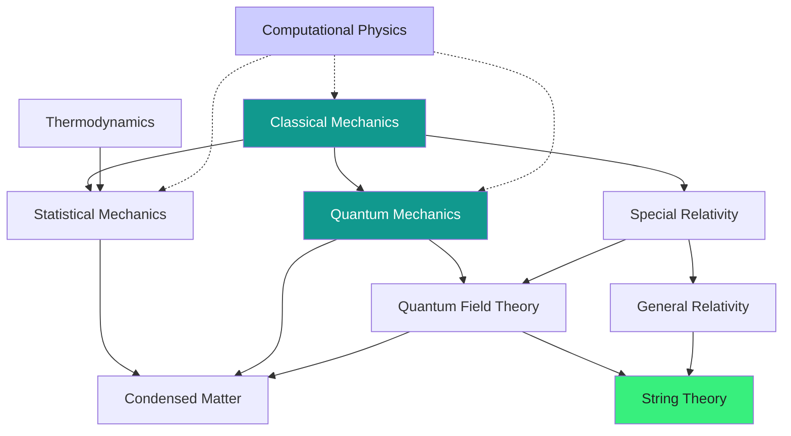

  <h1 style="color: white; margin: 0; font-size: 2.5rem;">Physics Documentation Hub</h1>
  
The fundamental laws that govern matter, energy, space, and time — from falling apples to the quantum vacuum.

A reference wiki for physics, pairing rigorous mathematics with physical intuition. Each page builds from the core idea through the formalism to where it applies. Pick a topic below, or follow a guided path if you are just getting started.

## Browse by Topic

### Core Physics

The classical pillars — the physics of everyday scales, energy, and the structure of spacetime.

  <a href="classical-mechanics/" class="nav-card">
    <h4><i class="fas fa-atom"></i> Classical Mechanics</h4>
    
Newton's laws, the Lagrangian and Hamiltonian formulations, conservation laws, and chaos.

  </a>
  <a href="thermodynamics.html" class="nav-card">
    <h4><i class="fas fa-fire"></i> Thermodynamics</h4>
    
Heat, work, entropy, and the four laws governing every engine and the fate of the universe.

  </a>
  <a href="statistical-mechanics/" class="nav-card">
    <h4><i class="fas fa-dice"></i> Statistical Mechanics</h4>
    
How microscopic randomness becomes macroscopic law — ensembles, partition functions, phase transitions.

  </a>
  <a href="relativity/" class="nav-card">
    <h4><i class="fas fa-clock"></i> Relativity</h4>
    
Special and general relativity: spacetime, $E=mc^2$, curved geometry, and gravity as geometry.

  </a>

### Quantum & Advanced

The quantum world and the many-body, high-energy, and theoretical frontiers built on top of it.

  <a href="quantum-mechanics/" class="nav-card">
    <h4><i class="fas fa-wave-square"></i> Quantum Mechanics</h4>
    
Wave functions, the uncertainty principle, measurement, and the strange logic of the quantum world.

  </a>
  <a href="quantum-field-theory.html" class="nav-card">
    <h4><i class="fas fa-project-diagram"></i> Quantum Field Theory</h4>
    
Quantum mechanics + special relativity. Particles as field excitations; the Standard Model.

  </a>
  <a href="condensed-matter/" class="nav-card">
    <h4><i class="fas fa-cube"></i> Condensed Matter</h4>
    
Solids, superconductors, topological materials, and emergent collective phenomena.

  </a>
  <a href="string-theory/" class="nav-card">
    <h4><i class="fas fa-infinity"></i> String Theory</h4>
    
Extra dimensions, dualities, branes, and the quest for a quantum theory of gravity.

  </a>

### Methods

  <a href="computational-physics/" class="nav-card">
    <h4><i class="fas fa-laptop-code"></i> Computational Physics</h4>
    
Numerical integration, Monte Carlo, molecular dynamics, PDE solvers, and machine learning for physics.

  </a>

## How These Topics Connect

Physics is not a list of separate subjects — each field grows out of and feeds back into the others. The map below traces the main lines of descent.

Solid arrows: one theory is built on or reduces to another. Dashed arrows: computational methods support every field.

## Guided Paths

- **New to physics:** start with [Classical Mechanics](classical-mechanics/) to build intuition for force, energy, and motion.
- **Undergraduate sequence:** Classical Mechanics → [Quantum Mechanics](quantum-mechanics/) → [Thermodynamics](thermodynamics.html) → [Statistical Mechanics](statistical-mechanics/) → [Relativity](relativity/).
- **Graduate / research:** dive into [QFT](quantum-field-theory.html), [Condensed Matter](condensed-matter/), or [String Theory](string-theory/), with [Computational Physics](computational-physics/) as a toolbox.

## Related Resources

- [Quantum Computing](../technology/quantumcomputing.html) — where quantum mechanics meets information processing.
- [Quantum Algorithms Research](../advanced/quantum-algorithms-research/) — advanced quantum information and algorithms.
- [AI Mathematics](../advanced/ai-mathematics/) — statistical-mechanics connections to machine learning.
- [Advanced Research Topics](../advanced/) — graduate-level physics and mathematics.
- [Physics Reference](../reference/#physics-formulas--constants) — CODATA constants, key equations, and unit conversions.

---

*This physics documentation combines rigorous mathematical treatment with intuitive explanations. For corrections or suggestions, please visit our [GitHub repository](https://github.com/AndrewAltimit/Documentation).*
