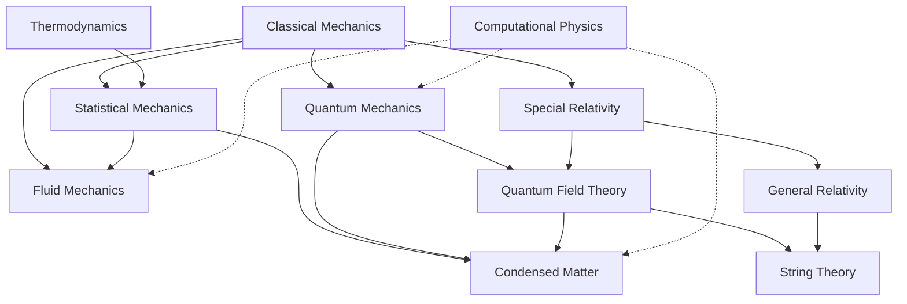

  <h1 style="color: white; margin: 0; font-size: 2.5rem;">Physics Documentation Hub</h1>
  
The fundamental laws that govern matter, energy, space, and time — from falling apples to the quantum vacuum.

This section is a reference wiki for physics at the undergraduate-to-graduate level. Each topic page states the core ideas, develops the mathematics, and connects the formalism to experiment and to current research; longer topics are split into a hub page with focused subpages. The [full page index](#all-physics-pages) below lists every page in the section.

## Browse by Topic

### Classical Physics

Physics at everyday scales and speeds, and the statistical bridge from microscopic to macroscopic.

  <a href="classical-mechanics/" class="nav-card">
    <h4><i class="fas fa-atom"></i> Classical Mechanics</h4>
    
Newton's laws, Lagrangian and Hamiltonian mechanics, rigid bodies, oscillations, and chaos.

  </a>
  <a href="fluid-mechanics.html" class="nav-card">
    <h4><i class="fas fa-water"></i> Fluid Mechanics</h4>
    
Navier-Stokes, the Reynolds number, boundary layers, shocks, turbulence, and the Millennium Problem.

  </a>
  <a href="thermodynamics.html" class="nav-card">
    <h4><i class="fas fa-fire"></i> Thermodynamics</h4>
    
Heat, work, entropy, the four laws, thermodynamic potentials, and engines.

  </a>
  <a href="statistical-mechanics/" class="nav-card">
    <h4><i class="fas fa-dice"></i> Statistical Mechanics</h4>
    
Ensembles, partition functions, quantum statistics, and phase transitions.

  </a>

### Spacetime and Gravity

  <a href="relativity/" class="nav-card">
    <h4><i class="fas fa-clock"></i> Relativity</h4>
    
Special and general relativity, black holes, gravitational waves, and cosmology.

  </a>

### Quantum Physics

The quantum theory of particles and fields, and the many-body and high-energy frontiers built on it.

  <a href="quantum-mechanics/" class="nav-card">
    <h4><i class="fas fa-wave-square"></i> Quantum Mechanics</h4>
    
States and operators, measurement, entanglement and Bell tests, and quantum computing.

  </a>
  <a href="quantum-field-theory.html" class="nav-card">
    <h4><i class="fas fa-project-diagram"></i> Quantum Field Theory</h4>
    
Quantization, gauge theories and the Standard Model, renormalization, and modern frontiers.

  </a>
  <a href="condensed-matter/" class="nav-card">
    <h4><i class="fas fa-cube"></i> Condensed Matter</h4>
    
Crystals, phonons, metals and magnetism, superconductivity, and topological phases.

  </a>
  <a href="string-theory/" class="nav-card">
    <h4><i class="fas fa-infinity"></i> String Theory</h4>
    
Strings, branes, dualities, AdS/CFT, and the search for quantum gravity.

  </a>

### Methods

  <a href="computational-physics/" class="nav-card">
    <h4><i class="fas fa-laptop-code"></i> Computational Physics</h4>
    
Numerical integration, Monte Carlo, molecular dynamics, PDE solvers, HPC, and machine learning.

  </a>

## How the Topics Connect

Each field builds on, generalizes, or supplies limits of the others. Solid arrows point from a theory to one that builds on or generalizes it; dashed arrows mark computational methods, which support every field.

Some links run in both directions in practice: the renormalization group was developed jointly in particle physics and critical phenomena, and ideas such as the Higgs mechanism, anomalies, and topological order pass freely between quantum field theory and condensed matter.

## Suggested Reading Paths

| Goal | Path |
|------|------|
| Core undergraduate sequence | [Classical Mechanics](classical-mechanics/) → [Thermodynamics](thermodynamics.html) → [Quantum Mechanics](quantum-mechanics/) → [Statistical Mechanics](statistical-mechanics/) → [Special Relativity](relativity/special-relativity.html) |
| Continuum physics | [Classical Mechanics](classical-mechanics/) → [Oscillations & Waves](classical-mechanics/waves.html) → [Fluid Mechanics](fluid-mechanics.html) → [Finite Elements & CFD](computational-physics/fem-and-cfd.html) |
| Particle physics | [Quantum Mechanics](quantum-mechanics/) → [QFT](quantum-field-theory.html) → [Gauge Theories & the Standard Model](gauge-and-standard-model.html) → [Renormalization](renormalization.html) → [Modern Frontiers](qft-frontiers.html) |
| Gravity and cosmology | [Special Relativity](relativity/special-relativity.html) → [General Relativity](relativity/general-relativity.html) → [Black Holes](relativity/black-holes.html) → [Cosmology](relativity/cosmology.html) → [Toward Quantum Gravity](relativity/quantum-gravity.html) |
| Quantum matter | [Statistical Mechanics](statistical-mechanics/) → [Condensed Matter](condensed-matter/) → [Emergent Phases](condensed-matter/emergent-phases.html) → [Disorder & Localization](condensed-matter/disorder-and-localization.html) |

## All Physics Pages

| Topic | Hub | Subpages |
|-------|-----|----------|
| Classical mechanics | [Classical Mechanics](classical-mechanics/) | [Newtonian Mechanics](classical-mechanics/newtonian.html) · [Lagrangian & Hamiltonian](classical-mechanics/lagrangian-hamiltonian.html) · [Rigid Body Dynamics](classical-mechanics/rigid-body-dynamics.html) · [Oscillations & Waves](classical-mechanics/waves.html) · [Geometric Formalism](classical-mechanics/geometric-mechanics.html) · [Chaos & Nonlinear Dynamics](classical-mechanics/chaos-and-computational.html) · [Computational Methods](classical-mechanics/computational-classical-mechanics.html) |
| Fluids | [Fluid Mechanics](fluid-mechanics.html) | — |
| Thermodynamics | [Thermodynamics](thermodynamics.html) | [Advanced Topics](thermodynamics-advanced.html) |
| Statistical mechanics | [Statistical Mechanics](statistical-mechanics/) | [Classical & Quantum Statistical Mechanics](statistical-mechanics/classical-and-quantum.html) · [Phase Transitions & Graduate Formalism](statistical-mechanics/phase-transitions-and-advanced.html) |
| Relativity | [Relativity](relativity/) | [Special Relativity](relativity/special-relativity.html) · [Tensor Formalism](relativity/tensor-formalism.html) · [General Relativity](relativity/general-relativity.html) · [Black Holes](relativity/black-holes.html) · [Gravitational Waves](relativity/gravitational-waves.html) · [Cosmology](relativity/cosmology.html) · [Toward Quantum Gravity](relativity/quantum-gravity.html) · [Graduate Topics](relativity/advanced.html) |
| Quantum mechanics | [Quantum Mechanics](quantum-mechanics/) | [States, Operators & Dynamics](quantum-mechanics/formalism.html) · [Systems & Phenomena](quantum-mechanics/systems-and-phenomena.html) · [Bell's Theorem & Tests](quantum-mechanics/bell-inequalities-and-tests.html) · [Advanced Formalism](quantum-mechanics/qm-advanced-formalism.html) · [Computational Methods](quantum-mechanics/qm-computational-methods.html) · [Quantum Computing](quantum-mechanics/qm-computing.html) · [Computing & Advanced Topics](quantum-mechanics/computing-and-advanced.html) · [Research Frontiers](quantum-mechanics/qm-research-frontiers.html) |
| Quantum field theory | [Quantum Field Theory](quantum-field-theory.html) | [Canonical Quantization](qft-quantization.html) · [Gauge Theories & the Standard Model](gauge-and-standard-model.html) · [Renormalization & the RG](renormalization.html) · [Path Integrals & Methods](qft-methods.html) · [Modern Frontiers](qft-frontiers.html) |
| Condensed matter | [Condensed Matter](condensed-matter/) | [Lattice Dynamics & Phonons](condensed-matter/lattice-dynamics.html) · [Metals & Magnetism](condensed-matter/metals-and-magnetism.html) · [Superconductivity, Quantum Hall & Topological Phases](condensed-matter/emergent-phases.html) · [Disorder & Localization](condensed-matter/disorder-and-localization.html) · [Experimental Techniques](condensed-matter/experimental-techniques.html) · [Graduate Formalism](condensed-matter/advanced-formalism.html) |
| String theory | [String Theory](string-theory/) | [Graduate Formalism](string-theory/string-theory-formalism.html) · [D-Branes, Dualities & M-Theory](string-theory/dualities-and-branes.html) · [Criticisms & Research Frontiers](string-theory/frontiers-and-formalism.html) |
| Computational physics | [Computational Physics](computational-physics/) | [Monte Carlo & Molecular Dynamics](computational-physics/monte-carlo-and-md.html) · [Finite Elements & Fluid Dynamics](computational-physics/fem-and-cfd.html) · [Quantum Computational Methods](computational-physics/quantum-methods.html) · [Electronic Structure Beyond DFT](computational-physics/electronic-structure-beyond-dft.html) · [Parallel & High-Performance Computing](computational-physics/hpc-and-ml.html) · [Machine Learning for Physics](computational-physics/ml-for-physics.html) · [Visualization, Libraries & Best Practices](computational-physics/tools-and-practices.html) |

## Related Sections

- [Physics Formulas & Constants](../reference/#physics-formulas--constants) — CODATA constants, key equations, and unit conversions.
- [Quantum Computing](../technology/quantumcomputing.html) — quantum mechanics applied to information processing.
- [Quantum Algorithms Research](../advanced/quantum-algorithms-research/) — advanced quantum information and algorithms.
- [AI Mathematics](../advanced/ai-mathematics/) — statistical-mechanics methods in machine learning.
- [Advanced Research Topics](../advanced/) — graduate-level mathematics and theoretical computer science.

Corrections and suggestions are welcome on the [GitHub repository](https://github.com/AndrewAltimit/Documentation).
