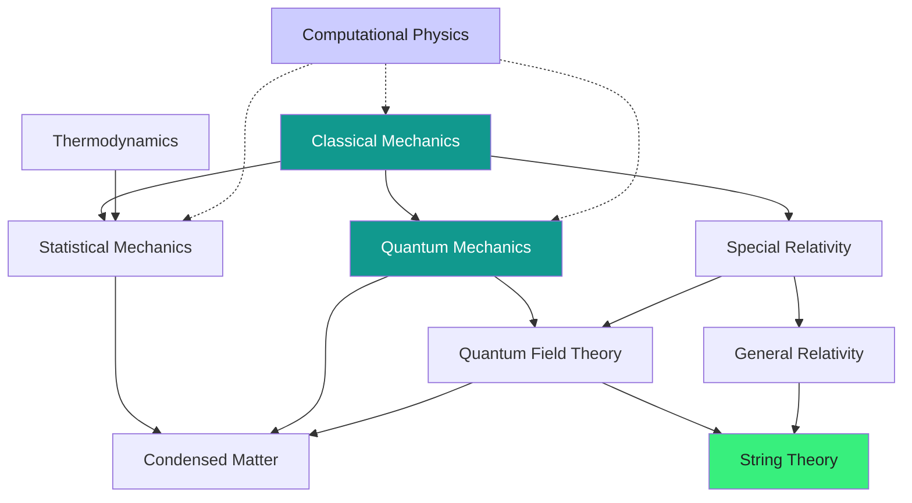

  <h1 style="color: white; margin: 0; font-size: 2.5rem;">Physics Documentation Hub</h1>
  
The fundamental laws that govern matter, energy, space, and time — from falling apples to the quantum vacuum.

  
A reference-wiki for physics: rigorous mathematics paired with physical intuition. Each page builds from the core idea (why it matters) through the formalism (the equations) to where it applies. Pick a topic below, or follow a guided path if you are just getting started.

## Browse by Topic

### Core Physics

The classical pillars — the physics of everyday scales, energy, and the structure of spacetime.

  <a href="classical-mechanics.html" class="nav-card">
    <h4><i class="fas fa-atom"></i> Classical Mechanics</h4>
    
Newton's laws, the Lagrangian and Hamiltonian formulations, conservation laws, and chaos.

  </a>
  <a href="thermodynamics.html" class="nav-card">
    <h4><i class="fas fa-fire"></i> Thermodynamics</h4>
    
Heat, work, entropy, and the four laws governing every engine and the fate of the universe.

  </a>
  <a href="statistical-mechanics.html" class="nav-card">
    <h4><i class="fas fa-dice"></i> Statistical Mechanics</h4>
    
How microscopic randomness becomes macroscopic law — ensembles, partition functions, phase transitions.

  </a>
  <a href="relativity.html" class="nav-card">
    <h4><i class="fas fa-clock"></i> Relativity</h4>
    
Special and general relativity: spacetime, $E=mc^2$, curved geometry, and gravity as geometry.

  </a>

### Quantum & Advanced

The quantum world and the many-body, high-energy, and theoretical frontiers built on top of it.

  <a href="quantum-mechanics.html" class="nav-card">
    <h4><i class="fas fa-wave-square"></i> Quantum Mechanics</h4>
    
Wave functions, the uncertainty principle, measurement, and the strange logic of the quantum world.

  </a>
  <a href="quantum-field-theory.html" class="nav-card">
    <h4><i class="fas fa-project-diagram"></i> Quantum Field Theory</h4>
    
Quantum mechanics + special relativity. Particles as field excitations; the Standard Model.

  </a>
  <a href="condensed-matter.html" class="nav-card">
    <h4><i class="fas fa-cube"></i> Condensed Matter</h4>
    
Solids, superconductors, topological materials, and emergent collective phenomena.

  </a>
  <a href="string-theory.html" class="nav-card">
    <h4><i class="fas fa-infinity"></i> String Theory</h4>
    
Extra dimensions, dualities, branes, and the quest for a quantum theory of gravity.

  </a>

### Methods

  <a href="computational-physics.html" class="nav-card">
    <h4><i class="fas fa-laptop-code"></i> Computational Physics</h4>
    
Numerical integration, Monte Carlo, molecular dynamics, PDE solvers, and machine learning for physics.

  </a>

## How These Topics Connect

Physics is not a list of separate subjects — each field grows out of and feeds back into the others. The map below traces the main lines of descent.

Solid arrows: one theory is built on or reduces to another. Dashed arrows: computational methods support every field.

## Guided Paths

  

    <h4>New to physics</h4>
    
Start with <a href="classical-mechanics.html">Classical Mechanics</a> to build intuition for force, energy, and motion before anything else.

  

  

    <h4>Undergraduate sequence</h4>
    
Classical Mechanics → <a href="quantum-mechanics.html">Quantum Mechanics</a> → <a href="thermodynamics.html">Thermodynamics</a> → <a href="statistical-mechanics.html">Statistical Mechanics</a> → <a href="relativity.html">Relativity</a>.

  

  

    <h4>Graduate / research</h4>
    
Dive into <a href="quantum-field-theory.html">QFT</a>, <a href="condensed-matter.html">Condensed Matter</a>, or <a href="string-theory.html">String Theory</a>, and use <a href="computational-physics.html">Computational Physics</a> as a toolbox.

  

## Related Resources

  <h4>Cross-Disciplinary Links</h4>
  <ul>
    <li><a href="../technology/quantumcomputing.html">Quantum Computing</a> — where quantum mechanics meets information processing.</li>
    <li><a href="../advanced/quantum-algorithms-research/">Quantum Algorithms Research</a> — advanced quantum information and algorithms.</li>
    <li><a href="../advanced/ai-mathematics/">AI Mathematics</a> — statistical-mechanics connections to machine learning.</li>
    <li><a href="../advanced/">Advanced Research Topics</a> — graduate-level physics and mathematics.</li>
    <li><a href="../reference/#physics-formulas--constants">Physics Reference</a> — CODATA constants, key equations, and unit conversions.</li>
  </ul>

---

*This physics documentation combines rigorous mathematical treatment with intuitive explanations. For corrections or suggestions, please visit our [GitHub repository](https://github.com/AndrewAltimit/Documentation).*
