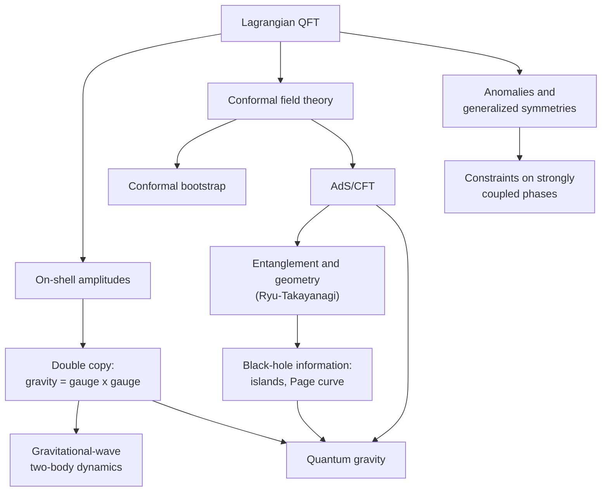
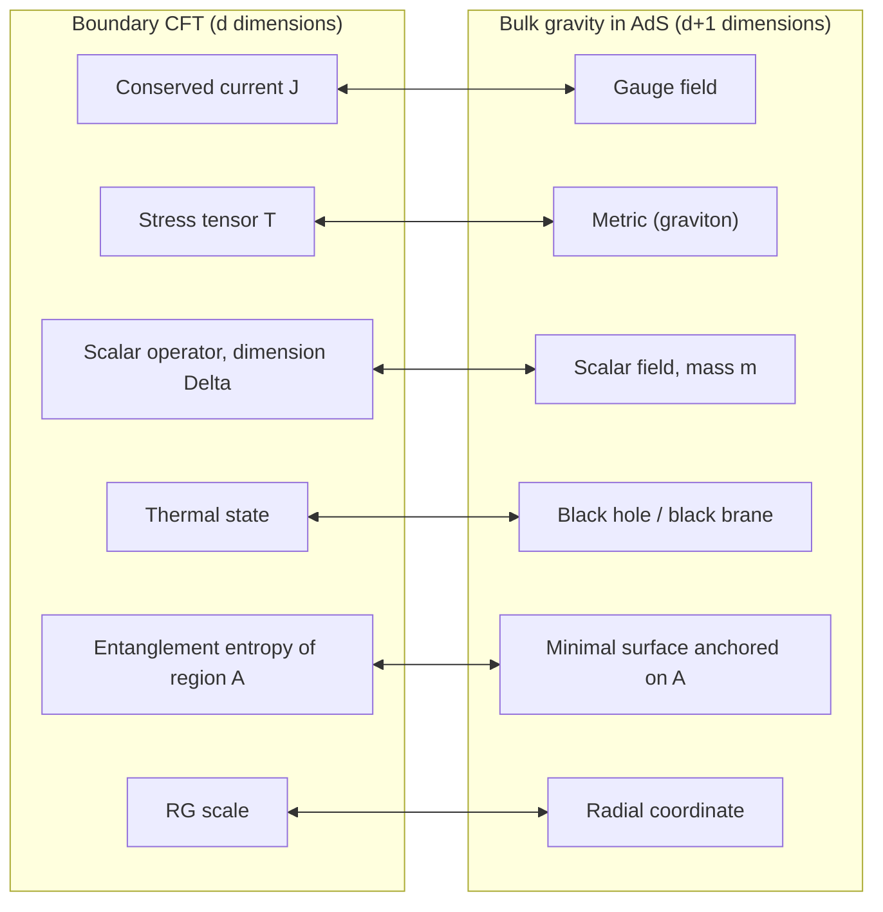

[Physics](./) &raquo; [Quantum Field Theory](quantum-field-theory.html) &raquo; Modern Frontiers

The textbook formulation of quantum field theory — a Lagrangian, Feynman diagrams, renormalization — is complete enough to compute almost anything measured at colliders, yet much of the research of the past three decades has come from **reformulations that avoid it**. Scattering amplitudes turn out to be far simpler than the diagrams that compute them; conformal field theories can be solved from consistency conditions alone; strongly coupled gauge theories can be equivalent to gravity in one extra dimension; and the notion of symmetry itself has been generalized. This page surveys those frontiers at a level that assumes the [main QFT pages](quantum-field-theory.html): gauge theory, the path integral, renormalization, and spontaneous symmetry breaking.

The recurring theme is that these programs keep meeting each other. The double copy connects gauge-theory amplitudes to gravity; holography connects conformal field theory to black holes; anomalies constrain every strongly coupled system the other methods study.

## The Modern Amplitudes Program

The Feynman-diagram expansion is correct but inefficient. The number of diagrams grows factorially with the number of external particles, individual diagrams depend on the gauge and contain unphysical polarizations, and yet the gauge-invariant sum is often a short expression. The amplitudes program computes that sum directly from the properties any amplitude must have: Lorentz invariance, **locality** (poles only where an internal particle goes on shell) and **unitarity** (residues factorize into lower-point amplitudes).

The motivating example is gluon scattering. The tree-level amplitude with two negative-helicity gluons and any number of positive-helicity ones — the **maximally helicity-violating (MHV)** configuration — needs hundreds of diagrams at six points, but Parke and Taylor (1986) found that the result is a single term.

### Spinor-helicity variables

A massless momentum factorizes into two-component Weyl spinors:

$$p_{\alpha\dot\alpha} = p_\mu\,\sigma^\mu_{\alpha\dot\alpha} = \lambda_\alpha\,\tilde\lambda_{\dot\alpha}.$$

The little group acts as $\lambda \to t\lambda$, $\tilde\lambda \to t^{-1}\tilde\lambda$, and an amplitude for a particle of helicity $h$ scales as $t^{-2h}$. The Lorentz-invariant brackets

$$\langle i\,j\rangle = \epsilon_{\alpha\beta}\,\lambda_i^\alpha\lambda_j^\beta, \qquad [i\,j] = \epsilon_{\dot\alpha\dot\beta}\,\tilde\lambda_i^{\dot\alpha}\tilde\lambda_j^{\dot\beta}$$

satisfy $s_{ij} = (p_i + p_j)^2 = \langle i\,j\rangle[j\,i]$ (up to sign conventions). In these variables the color-ordered **Parke-Taylor** amplitude for $n$ gluons, with $i$ and $j$ of negative helicity, is

$$A_n^{\text{MHV}}(1^+,\dots,i^-,\dots,j^-,\dots,n^+) = \frac{\langle i\,j\rangle^4}{\langle 1\,2\rangle\langle 2\,3\rangle\cdots\langle n\,1\rangle}.$$

The numerator is fixed by little-group scaling and the denominator by the cyclic ordering. Three-particle amplitudes are fixed entirely by little-group scaling and dimensional analysis, which is why on-shell methods can dispense with a Lagrangian.

For four or more gluons, amplitudes with all helicities equal, or with only one different, vanish at tree level for real momenta in Minkowski signature. In 2026 Guevara, Lupsasca, Skinner, Strominger and Weil showed that the single-minus tree amplitudes are nonzero on a special "half-collinear" region of kinematics available in split (Klein) signature or for complex momenta, and gave a closed-form expression consistent with soft theorems — an example of how much structure remains to be found even at tree level.

### BCFW recursion

Britto, Cachazo, Feng and Witten (2005) showed that tree amplitudes are fixed by their poles. Deform two external momenta by a complex parameter $z$, keeping them on shell and preserving momentum conservation:

$$\hat{\tilde\lambda}_i = \tilde\lambda_i - z\,\tilde\lambda_j, \qquad \hat\lambda_j = \lambda_j + z\,\lambda_i.$$

The deformed amplitude $A_n(z)$ is rational in $z$ with simple poles where an internal momentum $\hat P_I(z)$ goes on shell. If $A_n(z) \to 0$ as $z \to \infty$ — true for gluons and gravitons with appropriate helicity choices — Cauchy's theorem applied to $A_n(z)/z$ gives

$$A_n = \sum_{I}\sum_{h} A_L^{h}\!\left(z_I\right)\,\frac{1}{P_I^2}\,A_R^{-h}\!\left(z_I\right).$$

Each term glues two on-shell lower-point amplitudes with one propagator, summed over factorization channels $I$ and internal helicity $h$. No off-shell vertex, gauge choice, or ghost appears.

### Generalized unitarity and loops

At one loop, any amplitude in four dimensions can be decomposed onto a fixed basis of scalar integrals:

$$A_n^{\text{1-loop}} = \sum_i c_i\,I_4^{(i)} + \sum_j d_j\,I_3^{(j)} + \sum_k e_k\,I_2^{(k)} + R_n.$$

Putting several propagators on shell ("cutting" them) isolates individual coefficients. A quadruple cut freezes the loop momentum completely, so each box coefficient $c_i$ is a product of four tree amplitudes — algebra, not integration. Triangle and bubble coefficients follow from triple and double cuts, and the rational term $R_n$ from $D$-dimensional cuts. Automated versions of this method (together with integration-by-parts reduction and differential equations for master integrals) produced the next-to-leading-order revolution in LHC predictions and now deliver two-loop amplitudes for five-particle processes.

### Positive geometry and the amplituhedron

In planar $\mathcal{N}=4$ super-Yang-Mills theory, amplitudes have a hidden symmetry (dual superconformal invariance, which combines with ordinary superconformal symmetry into an infinite-dimensional Yangian) and a geometric description. The **amplituhedron** (Arkani-Hamed and Trnka, 2013) is a region in a Grassmannian whose canonical differential form — a form with logarithmic singularities on its boundaries — equals the amplitude. Locality and unitarity are not inputs; they appear as properties of the boundaries.

Related "positive geometries" have since been found for other theories and observables: the associahedron for bi-adjoint scalar amplitudes, and a "surfaceology" formalism (2023 onward) that computes all-loop amplitudes in simple colored theories from curves on surfaces and relates scalar, pion, and gluon amplitudes. Amplitudes in these theories exhibit **hidden zeros** — kinematic loci where they vanish — and factorize near them in a new way. A parallel program applies the same ideas to **cosmological correlators**, the boundary correlations of fields in an expanding universe that seed large-scale structure.

| Approach | Core idea | Removes |
|----------|-----------|---------|
| Spinor-helicity | Null momenta as spinor products | Polarization vectors, dot-product clutter |
| BCFW recursion | Complex shift + Cauchy's theorem | Off-shell vertices, gauge artifacts |
| Generalized unitarity | Multi-line cuts onto an integral basis | Brute-force loop integration |
| Amplituhedron / positive geometry | Amplitude as canonical form of a geometry | Locality and unitarity as inputs |
| Double copy | Gravity numerators = (gauge numerators)$^2$ | Direct perturbative gravity calculations |

### The double copy

Bern, Carrasco and Johansson (2008) found that gauge-theory amplitudes can be written so that kinematic numerators $n_i$ obey the same Jacobi identities as the color factors $c_i$ (**color-kinematics duality**). Replacing each color factor by a second copy of the numerators then produces a gravity amplitude:

$$A_n^{\text{gauge}} = g^{n-2}\sum_i \frac{c_i\,n_i}{D_i} \qquad\longrightarrow\qquad M_n^{\text{gravity}} = \left(\frac{\kappa}{2}\right)^{n-2}\sum_i \frac{n_i\,\tilde n_i}{D_i}.$$

At tree level this is the field-theory version of the Kawai-Lewellen-Tye relations between closed and open strings. The double copy extends to loops, where it is the most efficient way to compute supergravity amplitudes, and to classical solutions (the Schwarzschild metric as a double copy of a Coulomb field).

Its most practical output is **gravitational-wave physics**. Treating two black holes as massive particles and computing their scattering amplitude in the post-Minkowskian (weak-field, arbitrary-velocity) expansion yields the conservative and radiative dynamics used to build waveform models. Calculations have reached fifth post-Minkowskian order at first order in the mass ratio (Driesse et al., 2024–2025), where periods of Calabi-Yau manifolds unexpectedly appear in the radiated energy and recoil. Worldline quantum field theory and effective-field-theory methods run in parallel and cross-check these results.

## Conformal Field Theory and the Bootstrap

A **conformal field theory** is a QFT invariant under angle-preserving transformations. CFTs describe the endpoints of renormalization-group flows and hence every continuous phase transition: the liquid-gas critical point, the Curie point of a uniaxial magnet, and the 3D Ising model are all the same CFT.

A CFT is specified by its **CFT data**: the scaling dimensions $\Delta_i$ and spins of its local operators, and the coefficients $\lambda_{ijk}$ of the operator product expansion (OPE)

$$\mathcal{O}_i(x)\,\mathcal{O}_j(0) = \sum_k \lambda_{ijk}\,|x|^{\Delta_k - \Delta_i - \Delta_j}\left[\mathcal{O}_k(0) + \text{descendants}\right].$$

Every correlation function follows from this data. The **conformal bootstrap** asks which data are consistent. Evaluating a four-point function by OPE in two different channels must give the same answer (**crossing symmetry**); combined with **unitarity** (real OPE coefficients and dimensions above unitarity bounds) this becomes a positivity problem that can be solved numerically by semidefinite programming. Rattazzi, Rychkov, Tonni and Vichi (2008) introduced the modern numerical method.

The flagship result is the 3D Ising model. The only inputs are that the theory has a $\mathbb{Z}_2$ symmetry with one relevant odd and one relevant even scalar; the output is an island in parameter space containing the critical point. The 2024 stress-tensor bootstrap (Chang et al.) gives

$$\Delta_\sigma = 0.518148806(24), \qquad \Delta_\epsilon = 1.41262528(29),$$

from which the critical exponents follow as $\eta = 2\Delta_\sigma - 1 \approx 0.0362976$ and $\nu = 1/(3 - \Delta_\epsilon) \approx 0.629971$. These are more precise than Monte Carlo simulations and agree with them and with experiment. Similar methods have determined exponents of the $O(N)$ models (for the $O(2)$ class, bootstrap and Monte Carlo agree with each other but not with the space-shuttle superfluid-helium measurement of $\nu$, a discrepancy still unexplained), and "analytic bootstrap" methods derive large-spin behavior from the lightcone limit of crossing.

## AdS/CFT and Holography

The **AdS/CFT correspondence** (Maldacena, 1997) is a conjectured exact equivalence between quantum gravity in $(d+1)$-dimensional anti-de Sitter space and a conformal field theory on its $d$-dimensional boundary. It is the best-understood realization of the **holographic principle** ('t Hooft, Susskind): black-hole entropy scales with horizon area, $S_{\text{BH}} = A/4G_N$, which suggests that the number of degrees of freedom in a gravitating region is bounded by its boundary area rather than its volume.

### The canonical example

Type IIB string theory on $AdS_5 \times S^5$ is dual to $\mathcal{N}=4$ super-Yang-Mills theory with gauge group $SU(N)$ in four dimensions. The parameters are related by

$$\frac{L^4}{\ell_s^4} = g_{\text{YM}}^2 N \equiv \lambda, \qquad \frac{L^3}{G_5} \propto N^2, \qquad g_{\text{YM}}^2 = 4\pi g_s$$

(numerical factors in the last relation are convention dependent). Classical supergravity is valid when the curvature radius $L$ is large in string units and Planck units — that is, at large $N$ and large 't Hooft coupling $\lambda$, where the gauge theory is strongly coupled. The duality is therefore a **strong/weak duality**: hard strong-coupling questions in the field theory become classical gravity calculations, and quantum-gravity questions become questions about a well-defined field theory.

### The dictionary

The Gubser-Klebanov-Polyakov-Witten prescription equates the bulk partition function, with boundary values $\phi_0$ of bulk fields, to the CFT generating functional with $\phi_0$ as sources:

$$Z_{\text{bulk}}\left[\phi \to \phi_0\right] = \left\langle \exp\left(\int d^dx\;\phi_0(x)\,\mathcal{O}(x)\right)\right\rangle_{\text{CFT}}, \qquad Z_{\text{bulk}} \approx e^{-S_{\text{on-shell}}[\phi_0]}.$$

In the classical limit, CFT correlators are obtained by solving bulk field equations. A scalar of mass $m$ in $AdS_{d+1}$ is dual to an operator of dimension

$$\Delta(\Delta - d) = m^2L^2,$$

and stability requires only $m^2L^2 \ge -d^2/4$ (the Breitenlohner-Freedman bound), so tachyonic masses are allowed in AdS.

A global symmetry of the boundary theory is a gauge symmetry in the bulk; this is one route to the expectation that quantum gravity has no exact global symmetries.

### Applications

- **Quark-gluon plasma.** Black-brane calculations give the shear viscosity to entropy density ratio $\eta/s = 1/4\pi$ (Kovtun-Son-Starinets) for any gauge theory with a two-derivative Einstein gravity dual. Values extracted from heavy-ion collisions at RHIC and the LHC are of the same order, making the QGP a nearly perfect fluid. The KSS value is not a strict lower bound — higher-derivative bulk corrections can lower it — but it anchors the idea that strongly coupled matter has no quasiparticles.
- **Condensed matter.** Holographic models of strange metals, non-Fermi liquids, and superconductors capture transport in systems with no quasiparticle description, though no known material is literally holographic.
- **Quantum information.** Bulk locality emerges from boundary entanglement in a way formally identical to a quantum error-correcting code (Almheiri-Dong-Harlow, 2015).

The correspondence is unproven, but it has passed a very large number of quantitative checks — in $\mathcal{N}=4$ SYM, integrability computes the spectrum of operator dimensions at every value of $\lambda$ and interpolates exactly between the perturbative gauge theory and the string regime.

## Entanglement, Black Holes, and Islands

### Ryu-Takayanagi

The **Ryu-Takayanagi formula** (2006) computes the entanglement entropy of a boundary region $A$ from the area of the minimal bulk surface $\gamma_A$ anchored on $\partial A$:

$$S_A = \frac{\text{Area}(\gamma_A)}{4G_N} + \mathcal{O}(G_N^0).$$

It generalizes the Bekenstein-Hawking formula and implies that bulk geometry is encoded in boundary entanglement ("entanglement builds spacetime"). Quantum corrections replace the minimal surface by a **quantum extremal surface** (Engelhardt-Wall, 2014), which extremizes area plus the entropy of bulk quantum fields.

### The Page curve

Hawking's 1975 calculation implies that radiation from an evaporating black hole is thermal, so its entropy grows monotonically until the black hole is gone — and pure initial states would evolve into mixed ones, violating unitarity. If evaporation is unitary, the radiation entropy must instead follow the **Page curve**: rising at first, then turning over at the Page time (roughly when half the black hole's entropy has been radiated) and falling to zero.

<figure style="margin:1.5rem auto; max-width:600px;">
<svg viewBox="0 0 600 300" width="100%" role="img" aria-labelledby="page-curve-title" style="color:currentColor; background:transparent;">
<title id="page-curve-title">Entropy of Hawking radiation versus time: Hawking's rising curve, the decreasing black-hole entropy, and the Page curve following the minimum</title>
<line x1="60" y1="250" x2="570" y2="250" stroke="currentColor" stroke-width="1.5"/>
<line x1="60" y1="250" x2="60" y2="20" stroke="currentColor" stroke-width="1.5"/>
<text x="540" y="275" font-size="13" fill="currentColor">time</text>
<text x="18" y="30" font-size="13" fill="currentColor">S</text>
<path d="M60,250 L520,40" fill="none" stroke="currentColor" stroke-width="1.5" stroke-dasharray="6 4"/>
<path d="M60,40 Q300,70 520,250" fill="none" stroke="currentColor" stroke-width="1.5" stroke-dasharray="2 4"/>
<path d="M60.0,250.0 L98.3,232.5 L136.3,215.2 L174.0,197.9 L211.6,180.8 L248.8,163.8 L285.8,146.9 L322.5,130.2 L336.2,127.6 L359.0,139.8 L395.2,161.0 L431.2,184.0 L466.9,209.0 L502.4,235.8 L520.0,250.0" fill="none" stroke="currentColor" stroke-width="3"/>
<line x1="336" y1="128" x2="336" y2="250" stroke="currentColor" stroke-width="0.8" opacity="0.5"/>
<text x="308" y="268" font-size="12" fill="currentColor">Page time</text>
<text x="400" y="60" font-size="12" fill="currentColor">Hawking: radiation entropy grows</text>
<text x="75" y="35" font-size="12" fill="currentColor">black-hole entropy A/4G</text>
<text x="370" y="200" font-size="12" fill="currentColor">Page curve (unitary)</text>
</svg>
<figcaption style="text-align:center; font-size:0.9em;">Schematic entropy of Hawking radiation. Unitarity requires the radiation entropy to follow the lower of the two curves; the island formula reproduces this.</figcaption>
</figure>

In 2019 Penington and, independently, Almheiri, Engelhardt, Marolf and Maxfield derived the Page curve within semiclassical gravity. The entropy of radiation $R$ is computed by the **island formula**

$$S(R) = \min_I\,\operatorname{ext}_I\left[\frac{\text{Area}(\partial I)}{4G_N} + S_{\text{matter}}(R \cup I)\right],$$

where after the Page time the extremum includes an **island** $I$ inside the black hole that is counted as part of the radiation. The formula follows from the gravitational path integral via **replica wormholes** — saddle points connecting copies of the geometry. The result shows how semiclassical gravity "knows" about unitarity, although the detailed microscopic mechanism of information transfer, and the extension beyond AdS and to realistic black holes, remain open.

## Anomalies

A **quantum anomaly** is a classical symmetry that is broken by quantization — in the path integral, by the non-invariance of the fermion measure. Whether an anomaly is harmless or fatal depends on whether the symmetry is global or gauged.

| Type | Symmetry | Consequence |
|------|----------|-------------|
| Chiral (ABJ) anomaly | Global axial $U(1)$ | Physical: fixes $\pi^0 \to \gamma\gamma$; explains why $\eta'$ is heavy (via QCD instantons) |
| Gauge anomaly | Local gauge symmetry | Fatal: must cancel, constraining the fermion content |
| Mixed gauge-gravitational | Gauge $\times$ diffeomorphisms | Requires $\sum Y = 0$ in the Standard Model |
| Global (Witten) $SU(2)$ anomaly | Large gauge transformations | Requires an even number of $SU(2)$ doublets |
| 't Hooft anomaly | Global symmetry, obstruction to gauging | Matched between UV and IR; constrains phases |
| Trace (conformal) anomaly | Scale invariance | Running couplings; $a$- and $c$-theorems |

### The chiral anomaly

For a massless Dirac fermion of charge $e$, the axial current $j^\mu_5 = \bar\psi\gamma^\mu\gamma^5\psi$ is conserved classically but not quantum mechanically. The triangle diagram with one axial and two vector vertices gives

$$\partial_\mu j^\mu_5 = \frac{e^2}{16\pi^2}\,\epsilon^{\mu\nu\rho\sigma}F_{\mu\nu}F_{\rho\sigma}$$

(the overall sign depends on the convention for $\epsilon^{0123}$). The **Adler-Bardeen theorem** states that this one-loop coefficient receives no higher-order corrections. Fujikawa showed that the anomaly is the Jacobian of the path-integral measure under a chiral rotation, and the Atiyah-Singer index theorem identifies the integrated anomaly with the difference of left- and right-handed zero modes.

The anomaly predicts the neutral-pion decay rate:

$$\Gamma(\pi^0 \to \gamma\gamma) = \left(\frac{N_c}{3}\right)^2\frac{\alpha^2 m_\pi^3}{64\pi^3 f_\pi^2} \approx 7.7\ \text{eV},$$

with $f_\pi \approx 92$ MeV, in agreement with the PrimEx measurement (about 7.8 eV). The factor $N_c^2$ makes this one of the classic confirmations that quarks come in three colors.

### Gauge anomaly cancellation

If an anomalous current is coupled to a gauge field, gauge invariance fails, and with it the decoupling of unphysical polarizations — the theory loses unitarity. The condition for cancellation is

$$\sum_{\text{left-handed Weyl fermions}} \operatorname{Tr}\left[T^a\left\{T^b, T^c\right\}\right] = 0$$

for every combination of gauge generators. In the Standard Model the cancellation works generation by generation and only when quarks and leptons are combined, with the color factor 3 (see the [explicit check](gauge-and-standard-model.html#anomaly-cancellation)). In string theory, the Green-Schwarz mechanism — cancellation by a classical field's transformation rather than by the fermion content — singled out the gauge groups $SO(32)$ and $E_8 \times E_8$ in 1984 and started the first superstring revolution.

### 't Hooft anomaly matching and anomaly inflow

A global symmetry whose anomaly would obstruct coupling it to a background gauge field has a **'t Hooft anomaly**. Because the anomaly is invariant under renormalization-group flow, it must be reproduced by the low-energy degrees of freedom:

$$\mathcal{A}_{\text{UV}} = \mathcal{A}_{\text{IR}}.$$

An anomalous symmetry therefore cannot flow to a trivially gapped phase; the IR must contain massless particles, a spontaneously broken symmetry, or a topological order. In QCD, matching the anomalies of the chiral flavor symmetry is satisfied by massless pions (spontaneous chiral symmetry breaking) and rules out massless composite baryons in many cases.

The modern understanding is **anomaly inflow**: a $d$-dimensional anomaly is the boundary of a $(d+1)$-dimensional invertible topological field theory, whose gauge variation cancels the boundary's. The surface states of topological insulators and the chiral edge modes of the quantum Hall effect are condensed-matter realizations; the classification of such bulk theories (by cobordism) is now a systematic tool for classifying anomalies.

## Generalized Symmetries

Since Gaiotto, Kapustin, Seiberg and Willett (2014), the notion of global symmetry has been broadened in two directions, and the resulting framework has become one of the most active areas of the field.

**Higher-form symmetries.** An ordinary symmetry acts on local operators and is implemented by a topological operator on a codimension-1 surface. A **$p$-form symmetry** acts on $p$-dimensional extended operators (lines, surfaces) and is implemented on codimension-$(p+1)$ surfaces. Pure $SU(N)$ Yang-Mills theory has a $\mathbb{Z}_N$ 1-form "center" symmetry acting on Wilson lines. Confinement — the area law for Wilson loops — is precisely the statement that this 1-form symmetry is unbroken, turning a notoriously hard dynamical question into a symmetry-breaking question with an order parameter. Free Maxwell theory has electric and magnetic $U(1)$ 1-form symmetries, and the photon is a Goldstone boson of their spontaneous breaking.

**Non-invertible symmetries.** Topological operators need not have inverses; their fusion can produce a sum of operators rather than a single one. The Kramers-Wannier duality defect of the critical Ising model is the classic 2D example. In 2022, Choi, Lam and Shao and, independently, Córdova and Ohmori showed that the ABJ-anomalous axial symmetry of QED is not simply broken but survives, for rational rotation angles, as a non-invertible symmetry — which constrains, for example, the decay of axions and neutral pions.

These symmetries also have anomalies and can be organized by a **symmetry TFT** in one higher dimension, the same structure that underlies anomaly inflow. Applications range from constraining QCD-like phase diagrams to classifying gapped phases of lattice models.

## Connections to Quantum Gravity

### Gravity as an effective field theory

General relativity is non-renormalizable, but as an **effective field theory** it is predictive below the Planck scale $M_{\text{Pl}} \approx 1.2\times 10^{19}$ GeV. The action is an expansion in curvature,

$$S = \int d^4x\,\sqrt{-g}\left(\frac{R}{16\pi G} + c_1R^2 + c_2R_{\mu\nu}R^{\mu\nu} + \cdots\right),$$

with higher terms suppressed by powers of $E/M_{\text{Pl}}$. Long-distance quantum effects come from massless loops and are independent of the unknown coefficients. The one-loop correction to the potential between two masses (Bjerrum-Bohr, Donoghue and Holstein, 2003) is

$$V(r) = -\frac{Gm_1m_2}{r}\left[1 + 3\,\frac{G(m_1 + m_2)}{rc^2} + \frac{41}{10\pi}\,\frac{G\hbar}{r^2c^3} + \cdots\right],$$

where the second term is a classical post-Newtonian correction and the third is a genuine quantum prediction, unobservably small for macroscopic masses (the numerical coefficients depend on how the potential is defined). The EFT framing locates the real problem: gravity needs a **UV completion** near $M_{\text{Pl}}$.

### Candidate completions and constraints

| Approach | Idea | Status |
|----------|------|--------|
| [String theory](string-theory/) | Gravity from closed strings; finite perturbation theory | The most developed; realizes AdS/CFT; landscape of vacua |
| Asymptotic safety (Weinberg, 1979) | Couplings flow to an interacting UV fixed point with finitely many relevant directions | Functional-RG evidence for a fixed point; not established in the full theory |
| Holography | Quantum gravity defined by a dual non-gravitational theory | Precise in AdS; de Sitter and flat-space versions under construction |
| [Loop quantum gravity and others](relativity/quantum-gravity.html) | Non-perturbative quantization of geometry | Separate program; see the relativity pages |

The **swampland program** asks the converse question: which low-energy EFTs can be coupled consistently to quantum gravity? Conjectured criteria include the absence of exact global symmetries and the **weak gravity conjecture** (Arkani-Hamed, Motl, Nicolis and Vafa, 2006), which requires a state with charge-to-mass ratio at least that of an extremal black hole — gravity must be the weakest force. Some criteria are well supported by black-hole arguments and holography; others, especially those about de Sitter vacua, remain contested. Positivity bounds from unitarity and causality of amplitudes (the "EFT-hedron") give rigorous constraints on the coefficients $c_i$ above.

### Flat-space and celestial holography

Since our universe is not anti-de Sitter, holography for asymptotically flat spacetime is a major goal. Soft theorems for gravitons and photons, gravitational and electromagnetic **memory effects**, and infinite-dimensional **asymptotic symmetries** at null infinity (BMS symmetry) are three faces of one structure — Strominger's "infrared triangle". **Celestial holography** rewrites four-dimensional scattering amplitudes as correlators of a two-dimensional theory on the celestial sphere, where these symmetries act as conformal currents. Whether this yields a complete dual description is an open question.

## See Also

- [Quantum Field Theory](quantum-field-theory.html) — overview and reading order for the QFT pages.
- [Gauge Theories & the Standard Model](gauge-and-standard-model.html) — the gauge theories whose amplitudes and anomalies are studied here.
- [Renormalization & the RG](renormalization.html) — fixed points, effective field theory, and running couplings.
- [Path Integrals & Methods](qft-methods.html) — the functional methods behind anomalies and holographic calculations.
- [String Theory](string-theory/) and [D-Branes, Dualities & M-Theory](string-theory/dualities-and-branes.html) — the origin of AdS/CFT and the brane construction behind it.
- [Black Holes](relativity/black-holes.html) and [Toward Quantum Gravity](relativity/quantum-gravity.html) — Hawking radiation, horizon entropy, and other quantum-gravity programs.
- [Gravitational Waves](relativity/gravitational-waves.html) — the observations that post-Minkowskian amplitude calculations feed.
- [Phase Transitions](statistical-mechanics/phase-transitions-and-advanced.html) — critical phenomena described by conformal field theory.
- [Emergent Phases](condensed-matter/emergent-phases.html) — topological phases and anomaly inflow in condensed matter.
