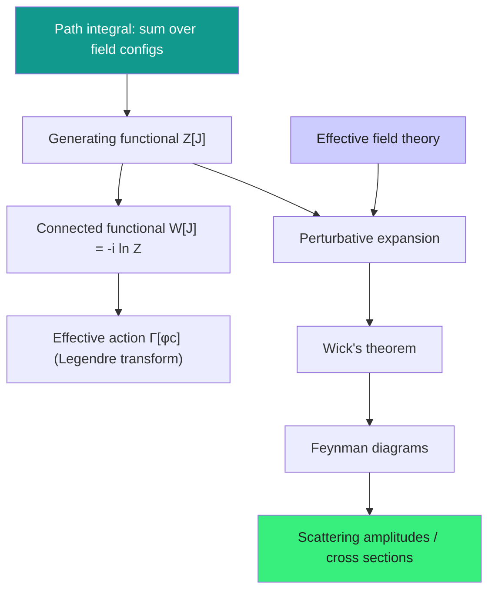
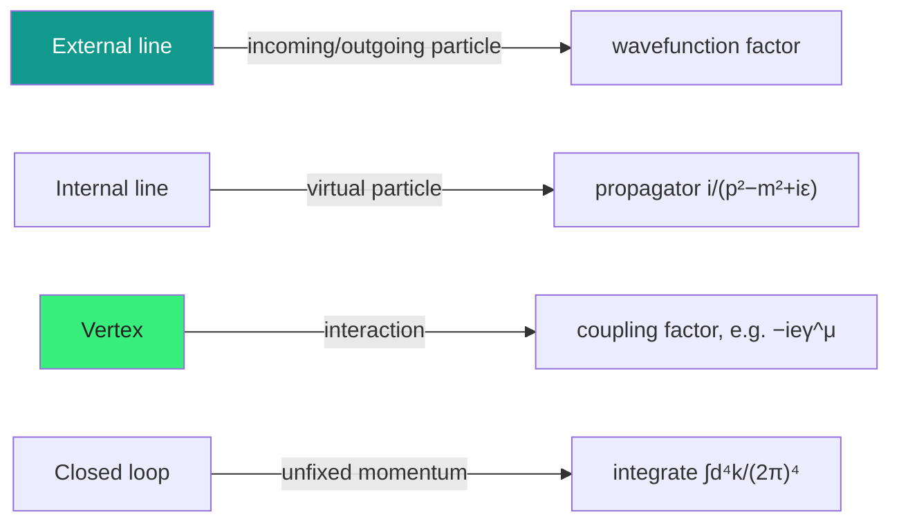

  <h1 style="color: white; margin: 0; font-size: 2.5rem;">Path Integrals &amp; Methods</h1>
  
The calculational engine of quantum field theory: Feynman's sum over histories, generating functionals, perturbation theory, the diagrammatic expansion, and effective field theory as a working tool.

[Quantum Field Theory](quantum-field-theory.html) &raquo; Path Integrals &amp; Methods

  
Knowing what a quantum field <em>is</em> tells you almost nothing about how to <em>compute</em> with one. This page is the workshop: the path integral that packages all of QFT into a single weighted sum over field configurations, the generating functionals that turn that sum into a machine for spitting out correlation functions, the perturbative expansion of that machine into Feynman diagrams, and the effective-field-theory mindset that lets you calculate without knowing the full theory. These are the tools that produce the numbers — the electron <em>g</em>−2 to twelve digits, cross sections at the LHC, the running of the strong coupling.

  

    <i class="fas fa-infinity"></i>
    <h4>Sum over histories</h4>
    
Every field configuration contributes an amplitude $e^{iS/\hbar}$; the classical path is just where the phase is stationary.

  

  

    <i class="fas fa-project-diagram"></i>
    <h4>Diagrams are the expansion</h4>
    
Each Feynman diagram is one term in a power series in the coupling — propagators for lines, factors for vertices.

  

  

    <i class="fas fa-cogs"></i>
    <h4>One functional, all correlators</h4>
    
Differentiate the generating functional $Z[J]$ and every Green's function falls out automatically.

  

  

    <i class="fas fa-layer-group"></i>
    <h4>Calculate at the right scale</h4>
    
Effective field theory lets you ignore physics you cannot reach and organize the rest by powers of energy.

  

### What You'll Find on This Page

| Section | What it covers |
|---------|----------------|
| [Path-Integral Formulation](#the-path-integral-formulation) | Sum over histories, the action, Euclidean rotation |
| [Generating Functionals](#generating-functionals) | $Z[J]$, $W[J]$, the effective action, Gaussian integrals |
| [Perturbation Theory](#perturbation-theory) | Expanding the interacting theory, Wick's theorem |
| [Feynman Diagrams](#feynman-diagrams) | Reading and building diagrams; the Feynman rules |
| [A Worked Amplitude](#a-worked-amplitude) | Tree-level scattering from start to finish |
| [Loops & Functional Methods](#loops--functional-methods) | Loop integrals, Ward identities, Schwinger–Dyson, BRST |
| [Effective Field Theory](#effective-field-theory-as-a-calculational-tool) | EFT as a practical organizing principle |

### How the Pieces Fit Together

## The Path-Integral Formulation

The path integral, due to Feynman (building on a remark of Dirac), provides an alternative to canonical quantization that is fully equivalent but often far more powerful. Instead of promoting fields to operators and imposing commutation relations, it assigns a complex amplitude to *every* possible field configuration and sums them all up.

### Sum Over Histories

In ordinary quantum mechanics, the amplitude for a particle to travel from $x_i$ at time $t_i$ to $x_f$ at time $t_f$ is obtained by summing $e^{iS/\hbar}$ over *all* paths connecting the endpoints — not just the classical one:

$$\langle x_f, t_f | x_i, t_i \rangle = \int_{x(t_i)=x_i}^{x(t_f)=x_f} \mathcal{D}x \; e^{iS[x]/\hbar}$$

The classical trajectory is the one where the action is stationary ($\delta S = 0$), so nearby paths interfere constructively; far from it, the rapidly oscillating phase causes cancellation. This is how the classical limit ($\hbar \to 0$) emerges: only the stationary-action path survives.

### The Field-Theory Path Integral

Promoting the single coordinate $x(t)$ to a field $\phi(x)$ defined at every spacetime point, the transition amplitude between field configurations becomes a functional integral:

$$\langle \phi_f, t_f | \phi_i, t_i \rangle = \int_{\phi(t_i)=\phi_i}^{\phi(t_f)=\phi_f} \mathcal{D}\phi \; e^{iS[\phi]/\hbar}$$

where the action is the spacetime integral of the Lagrangian density:

$$S[\phi] = \int_{t_i}^{t_f} dt \int d^3x \; \mathcal{L}\big[\phi(x,t),\, \partial_\mu\phi(x,t)\big]$$

The symbol $\mathcal{D}\phi$ denotes integration over every possible field configuration — a continuous infinity of ordinary integrals, one for the value of $\phi$ at each spacetime point. This object is the master quantity from which everything else is derived.

### Euclidean Formulation

The oscillatory factor $e^{iS}$ makes the Minkowski path integral only conditionally convergent. The standard cure is **Wick rotation**: analytically continue to imaginary time, $t \to -i\tau$. The action picks up factors of $i$ that convert it into the Euclidean action $S_E$, and the integrand becomes a real, exponentially damped weight:

$$Z_E = \int \mathcal{D}\phi \; e^{-S_E[\phi]/\hbar}$$

This has two enormous payoffs:

1. **Convergence.** The integrand is a genuine probability-like weight; field configurations with large action are exponentially suppressed, making the integral well-defined and amenable to numerical evaluation (this is the basis of **lattice QFT**).
2. **Statistical-mechanics connection.** $Z_E$ is mathematically identical to the partition function of a classical statistical system, with $S_E/\hbar$ playing the role of $\beta H$. Correlation lengths map to inverse masses, phase transitions to critical phenomena, and the renormalization group is shared between the two fields. (See [Statistical Mechanics](statistical-mechanics/).)

## Generating Functionals

The path integral becomes a *calculational* tool the moment we couple the field to an external source $J(x)$. Differentiating with respect to that source pulls down factors of the field, so a single functional encodes every correlation function at once.

### The Generating Functional Z[J]

Add a linear source term $J(x)\phi(x)$ to the action:

$$Z[J] = \int \mathcal{D}\phi \; e^{\,i\left(S[\phi] + \int d^4x \, J(x)\phi(x)\right)}$$

Functional derivatives with respect to $J$ bring down fields, and setting $J=0$ leaves the time-ordered vacuum correlation functions (Green's functions):

$$\langle 0|T[\phi(x_1)\cdots\phi(x_n)]|0\rangle = \frac{1}{Z[0]} \frac{(-i)^n \, \delta^n Z[J]}{\delta J(x_1)\cdots\delta J(x_n)}\bigg|_{J=0}$$

This is the central identity of the functional approach: *all* the physical content of the theory is packed into $Z[J]$, and any correlator is extracted by mechanical differentiation.

### Connected Functional W[J]

The full Green's functions contain redundant, disconnected pieces (processes happening independently in different regions). Taking the logarithm strips these away, leaving only **connected** correlators:

$$W[J] = -i \ln Z[J]$$

$$\langle 0|T[\phi(x_1)\cdots\phi(x_n)]|0\rangle_c = (-i)^{n-1} \frac{\delta^n W[J]}{\delta J(x_1)\cdots\delta J(x_n)}\bigg|_{J=0}$$

Physically, $W[J]$ generates exactly the diagrams that cannot be split into independent pieces — the ones that carry real interaction information.

### The Effective Action

One Legendre transform further isolates the **one-particle-irreducible (1PI)** content — diagrams that stay connected when any single internal line is cut. Define the classical field $\phi_c = \delta W/\delta J$ and form:

$$\Gamma[\phi_c] = W[J] - \int d^4x \; J(x)\,\phi_c(x)$$

$\Gamma[\phi_c]$ is the **effective action**. Its great virtues:

- Its derivatives are the 1PI vertex functions — the irreducible building blocks from which all diagrams are assembled.
- It includes all quantum corrections to the classical action, so extremizing $\Gamma$ (rather than $S$) gives the *quantum* equations of motion.
- Its minimum locates the true vacuum, making it the natural tool for analyzing [spontaneous symmetry breaking](gauge-and-standard-model.html#the-higgs-mechanism): the **effective potential** $V_{\text{eff}}(\phi_c)$ is the part of $\Gamma$ with no derivatives, and one-loop corrections to it (the Coleman–Weinberg potential) can shift the vacuum away from the classical minimum.

### Gaussian Integration: the Free Theory

For a **free** field the action is quadratic, and the path integral reduces to an infinite-dimensional Gaussian — which we can do exactly. Writing the quadratic form as $\phi K \phi$:

$$Z_0 = \int \mathcal{D}\phi \, \exp\left[\frac{i}{2} \int d^4x\, d^4y \; \phi(x)\,K(x,y)\,\phi(y)\right] = (\det K)^{-1/2}$$

The two-point function is the *inverse* of the kinetic operator — which is precisely the Feynman propagator:

$$\langle 0|T[\phi(x)\phi(y)]|0\rangle_0 = K^{-1}(x,y) = D_F(x-y)$$

For the Klein–Gordon field, $K = -(\Box + m^2)$ and its inverse in momentum space is the familiar

$$\tilde{D}_F(k) = \frac{i}{k^2 - m^2 + i\varepsilon}$$

This is the cornerstone of perturbation theory: the free theory is solved in closed form, and interactions are added as a controlled expansion around it.

## Perturbation Theory

Realistic theories are interacting, and almost none are exactly solvable. The strategy is to split the Lagrangian into a free (quadratic) part we can integrate exactly and an interaction part we expand in powers of the small coupling.

### Expanding Around the Free Theory

Write $\mathcal{L} = \mathcal{L}_0 + \mathcal{L}_{\text{int}}$. The interacting generating functional can be written by pulling the interaction outside the integral as a differential operator acting on the free functional:

$$Z[J] = \exp\left[\,i\int d^4x \; \mathcal{L}_{\text{int}}\!\left(\frac{1}{i}\frac{\delta}{\delta J(x)}\right)\right] Z_0[J]$$

Expanding the exponential generates an infinite series, each term containing some number of interaction vertices acting on the free propagators inside $Z_0[J]$. This series *is* the perturbative expansion, and each term corresponds to a Feynman diagram.

### Wick's Theorem

To evaluate a given term we must reduce a time-ordered product of many fields into propagators. **Wick's theorem** does exactly this: it rewrites a time-ordered product as a sum over all possible pairwise contractions, where each contraction is a Feynman propagator:

$$T[\phi(x_1)\cdots\phi(x_n)] = \;:\!\phi(x_1)\cdots\phi(x_n)\!: \;+\; \text{(all contractions)}$$

Each full contraction of $n$ fields (with $n$ even) into $n/2$ propagators contributes a product like $D_F(x_1-x_2)\,D_F(x_3-x_4)\cdots$. The normal-ordered terms vanish between vacuum states, so only the fully contracted pieces survive in vacuum correlators. Wick's theorem is the bookkeeping device that turns the abstract functional expansion into a concrete, finite set of propagator products at each order — precisely the lines of a Feynman diagram.

### Organizing the Expansion

Two complementary expansions are in play:

- **Coupling expansion.** Powers of the coupling $g$ (or $\lambda$, $e$) count vertices; weak coupling means few vertices dominate.
- **Loop expansion.** Powers of $\hbar$ count independent loop momenta. The number of loops is $L = I - V + 1$ for $I$ internal lines and $V$ vertices, so tree diagrams ($L=0$) are the classical/leading result and loops are successive quantum corrections.

For QED the relevant small parameter is the fine-structure constant $\alpha = e^2/4\pi \approx 1/137$, which is why the perturbative series converges so well numerically — each additional loop costs roughly a factor of $\alpha$.

## Feynman Diagrams

Feynman diagrams are not mere illustrations; they are a precise, one-to-one shorthand for the terms of the perturbation series. Each diagram translates, via the **Feynman rules**, into a specific mathematical expression contributing to an amplitude.

### The Dictionary

Reading a diagram:

- **External lines** represent the incoming and outgoing real particles; each carries a wavefunction factor (a spinor $u(p)$, $\bar u(p)$, $v(p)$, $\bar v(p)$ for fermions, or a polarization $\varepsilon^\mu$ for photons).
- **Internal lines** are **virtual** particles — off-shell intermediate states that need not satisfy $p^2 = m^2$. Each contributes a **propagator**.
- **Vertices** encode the interaction and carry the coupling. Momentum is conserved at every vertex.
- **Loops** carry an undetermined internal momentum that must be integrated over; these are the source of both quantum corrections and ultraviolet divergences.

### Feynman Rules for QED

The interaction in quantum electrodynamics is the single term $\mathcal{L}_{\text{int}} = -e\,\bar\psi\gamma^\mu\psi\,A_\mu$, giving a remarkably compact set of rules.

**Vertex factor** (one photon, one incoming and one outgoing electron line):

$$-i e \gamma^\mu$$

**Electron (fermion) propagator:**

$$S_F(p) = \frac{i(\not{p} + m)}{p^2 - m^2 + i\varepsilon} = \frac{i}{\not{p} - m + i\varepsilon}$$

**Photon propagator** (Feynman gauge):

$$D^{\mu\nu}_F(k) = \frac{-i g^{\mu\nu}}{k^2 + i\varepsilon}$$

**Closed fermion loop:** include a factor of $(-1)$ and a trace over the Dirac indices around the loop.

**Loop integration:** integrate each unfixed loop momentum with $\displaystyle\int \frac{d^4k}{(2\pi)^4}$.

Assembling these factors according to the topology of the diagram, then summing over all diagrams at the desired order, yields the invariant amplitude $i\mathcal{M}$.

### From Amplitude to Observable

The amplitude $\mathcal{M}$ feeds directly into measurable quantities. For a $2 \to 2$ scattering in the centre-of-mass frame, the differential cross section is

$$\frac{d\sigma}{d\Omega} = \frac{1}{64\pi^2 s}\,\frac{|\mathbf{p}_f|}{|\mathbf{p}_i|}\,\overline{|\mathcal{M}|^2}$$

where $\sqrt{s}$ is the total centre-of-mass energy and $\overline{|\mathcal{M}|^2}$ denotes the spin-averaged (initial) and spin-summed (final) squared amplitude. For decays, $\mathcal{M}$ enters the decay rate $\Gamma$ through an analogous phase-space formula. This is the bridge from diagrams to numbers an experimentalist can check.

## A Worked Amplitude

To make the machinery concrete, consider electron–muon scattering, $e^- \mu^- \to e^- \mu^-$, at lowest (tree) order in QED. Because the electron and muon are distinct particles, there is a *single* tree diagram: the two fermion lines exchange one virtual photon.

**Step 1 — Identify the diagram.** Incoming electron $p_1$ and muon $p_2$; outgoing electron $p_3$ and muon $p_4$. A virtual photon of momentum $q = p_1 - p_3$ connects the two vertices. Momentum conservation: $q = p_1 - p_3 = p_4 - p_2$.

**Step 2 — Apply the rules.** Write down the factors:

- Electron line: $\bar u(p_3)\,(-ie\gamma^\mu)\,u(p_1)$
- Muon line: $\bar u(p_4)\,(-ie\gamma^\nu)\,u(p_2)$
- Photon propagator: $\dfrac{-ig_{\mu\nu}}{q^2}$

**Step 3 — Assemble the amplitude.**

$$i\mathcal{M} = \big[\bar u(p_3)(-ie\gamma^\mu)u(p_1)\big]\,\frac{-i g_{\mu\nu}}{q^2}\,\big[\bar u(p_4)(-ie\gamma^\nu)u(p_2)\big]$$

which simplifies to

$$\mathcal{M} = \frac{e^2}{q^2}\,\big[\bar u(p_3)\gamma^\mu u(p_1)\big]\big[\bar u(p_4)\gamma_\mu u(p_2)\big]$$

**Step 4 — Square and average over spins.** Using the spin sums $\sum_s u(p)\bar u(p) = \not{p} + m$, the spin-averaged squared amplitude becomes a product of Dirac traces:

$$\overline{|\mathcal{M}|^2} = \frac{e^4}{4q^4}\,\text{Tr}\!\big[(\not{p}_3 + m_e)\gamma^\mu(\not{p}_1 + m_e)\gamma^\nu\big]\,\text{Tr}\!\big[(\not{p}_4 + m_\mu)\gamma_\mu(\not{p}_2 + m_\mu)\gamma_\nu\big]$$

Evaluating the traces (using $\text{Tr}[\gamma^\mu\gamma^\nu] = 4g^{\mu\nu}$ and the four-gamma trace identity) and expressing the result in Mandelstam variables $s,t,u$ gives, in the high-energy limit $m_e, m_\mu \to 0$:

$$\overline{|\mathcal{M}|^2} = \frac{2e^4\,(s^2 + u^2)}{t^2}$$

with $t = q^2$. **Step 5 — Insert into the cross-section formula** above to obtain $d\sigma/d\Omega$. This is the entire pipeline — diagram to rule to trace to observable — that underlies every QED prediction; adding the muon's *internal* structure or moving to identical particles (Bhabha, Møller scattering) only changes which diagrams appear.

## Loops & Functional Methods

Beyond tree level, diagrams contain closed loops with unconstrained internal momenta. These loops carry the genuine quantum corrections — and the divergences that motivate renormalization.

### Loop Integrals

A one-loop correction requires integrating over the loop momentum. The QED electron self-energy, for instance, is

$$\Sigma(p) = -i e^2 \int \frac{d^4k}{(2\pi)^4} \; \frac{\gamma^\mu(\not{p}-\not{k}+m)\gamma_\mu}{\big[(p-k)^2 - m^2 + i\varepsilon\big]\big[k^2 + i\varepsilon\big]}$$

and the vertex correction is

$$\Lambda^\mu(p',p) = -i e^2 \int \frac{d^4k}{(2\pi)^4} \; \frac{\gamma^\nu(\not{p}'-\not{k}+m)\gamma^\mu(\not{p}-\not{k}+m)\gamma_\nu}{\big[(p'-k)^2 - m^2\big]\big[(p-k)^2 - m^2\big]\big[k^2\big]}$$

These integrals typically diverge in the ultraviolet. Handling them — via dimensional regularization, counterterms, and the renormalization group — is the subject of the [renormalization](renormalization.html) page. The vertex correction $\Lambda^\mu$ is also exactly what produces the famous anomalous magnetic moment, the electron $g-2$, agreeing with experiment to twelve digits.

### Practical Techniques for Loops

A handful of standard tools turn loop integrals into tractable expressions:

- **Feynman parameters.** Combine denominators into a single quadratic via $\frac{1}{AB} = \int_0^1 dx\,[xA + (1-x)B]^{-2}$, then shift the loop momentum to complete the square.
- **Wick rotation.** Rotate $k^0 \to ik^0_E$ to turn the Minkowski integral into a convergent Euclidean one.
- **Dimensional regularization.** Compute in $d = 4 - \varepsilon$ dimensions, isolating divergences as $1/\varepsilon$ poles while preserving gauge invariance.
- **Integration by parts (IBP).** Use $\int d^d k\,\partial_\mu[k^\mu f(k)] = 0$ to reduce a large family of integrals to a small basis of **master integrals** — the workhorse of modern multi-loop calculations.

### Functional Identities: Ward & Schwinger–Dyson

The functional formalism does more than reproduce diagrams; it yields exact, all-orders relations.

**Schwinger–Dyson equations** are the quantum equations of motion. They follow from the fact that a path integral is invariant under a shift of the integration variable, $\phi \to \phi + \delta\phi$:

$$\left\langle \frac{\delta S}{\delta \phi(x)} \right\rangle = \text{(contact terms)}$$

They form an infinite, coupled hierarchy relating $n$-point to $(n+1)$-point functions — the non-perturbative skeleton of the theory.

**Ward–Takahashi identities** are the special case enforced by a *symmetry* of the action. In QED, gauge invariance ties the vertex function to the electron propagator:

$$q_\mu \Gamma^\mu(p', p) = S_F^{-1}(p') - S_F^{-1}(p)$$

These identities guarantee that gauge invariance survives renormalization (e.g. relating the charge and field renormalization constants), and they protect the photon from acquiring a mass. They are a powerful consistency check on any calculation.

### Gauge Fixing and BRST

Naively, the photon path integral diverges because gauge-equivalent configurations are summed redundantly. The **Faddeev–Popov** procedure factors out this redundancy by inserting a gauge-fixing condition, at the cost of introducing **ghost** fields (anticommuting scalars) in non-abelian theories. The whole gauge-fixed action then possesses a residual rigid fermionic symmetry — **BRST symmetry** — which encodes the original gauge invariance at the quantum level and guarantees unitarity of physical amplitudes. BRST is the modern, systematic way to quantize Yang–Mills theories within the path integral.

## Effective Field Theory as a Calculational Tool

Effective field theory (EFT) is less a specific model than a way of thinking that makes QFT *usable*: you never need the complete theory of everything to compute a low-energy process — you only need the right degrees of freedom at the scale you care about.

### The Core Idea

If a process occurs at energy $E$ well below some heavy scale $\Lambda$, the heavy physics cannot be produced directly. Its effects appear only indirectly, suppressed by powers of $E/\Lambda$. EFT makes this systematic: **integrate out** the heavy fields and write the most general local Lagrangian for the light fields consistent with the symmetries, organized as an expansion in $1/\Lambda$:

$$\mathcal{L}_{\text{eff}} = \mathcal{L}_{d \le 4} + \sum_{i} \frac{c_i}{\Lambda^{n_i - 4}}\,\mathcal{O}_i$$

Each operator $\mathcal{O}_i$ of mass dimension $n_i$ comes with a dimensionless **Wilson coefficient** $c_i$. Higher-dimension operators are suppressed by more powers of $\Lambda$, so at any desired accuracy only finitely many operators matter. This is **power counting**, and it is what makes a non-renormalizable theory perfectly predictive at low energies.

### Why It Works

- **Decoupling.** Heavy particles decouple from low-energy physics, leaving only their imprint in the Wilson coefficients. You can compute without ever resolving the heavy sector.
- **Predictivity with a cutoff.** A theory with infinitely many couplings is still predictive: truncating the $1/\Lambda$ expansion at finite order leaves a finite, controlled error of order $(E/\Lambda)^{n}$.
- **Matching and running.** Wilson coefficients are fixed by **matching** the EFT to the full theory at the scale $\Lambda$, then **run** down to the experimental scale using the renormalization group — automatically resumming large logarithms $\ln(\Lambda/E)$.

### EFT in Practice

| Effective theory | Light fields | Heavy scale integrated out |
|------------------|--------------|----------------------------|
| Fermi theory of $\beta$-decay | leptons, nucleons | $W$ boson mass $m_W$ |
| Chiral perturbation theory | pions (Goldstone bosons) | QCD scale $\Lambda_{\text{QCD}}$ |
| Heavy quark effective theory | light quarks, gluons | heavy quark mass $m_Q$ |
| Standard Model EFT (SMEFT) | Standard Model fields | unknown new-physics scale |
| Euler–Heisenberg | photons | electron mass $m_e$ |

The classic example is Fermi's four-fermion theory of beta decay: long before the $W$ boson was known, the weak interaction could be described by a contact interaction with coupling $G_F \sim g^2/m_W^2$. The full electroweak theory "matches onto" this EFT in the limit $q^2 \ll m_W^2$, with the heavy $W$ propagator $\sim 1/(q^2 - m_W^2) \to -1/m_W^2$ shrinking to a point. Crucially, the entire Standard Model is itself almost certainly an EFT — the leading terms of a more complete theory whose new physics lives at a scale we have not yet reached. (See [Effective Field Theory as a Calculational Tool](#effective-field-theory-as-a-calculational-tool) below.)

## Key Takeaways

  

    <h4>The path integral is the master tool</h4>
    
Summing $e^{iS/\hbar}$ over all field configurations reproduces all of QFT and connects directly to statistical mechanics after Wick rotation.

  

  

    <h4>Generating functionals automate correlators</h4>
    
$Z[J]$ gives all Green's functions, $W[J]$ the connected ones, and the effective action $\Gamma[\phi_c]$ the 1PI vertices and the quantum vacuum.

  

  

    <h4>Diagrams are the perturbation series</h4>
    
Wick's theorem turns the expansion into propagator products; each Feynman diagram is one term, with rules for lines, vertices, and loops.

  

  

    <h4>Amplitudes become observables</h4>
    
Squaring $\mathcal{M}$, averaging over spins, and inserting phase space yields cross sections and decay rates an experiment can test.

  

  

    <h4>Functional identities are exact</h4>
    
Schwinger–Dyson and Ward–Takahashi relations hold to all orders, protecting gauge invariance and constraining every calculation.

  

  

    <h4>EFT lets you calculate at the right scale</h4>
    
Integrate out heavy physics, organize by powers of $E/\Lambda$, and compute predictively without knowing the complete theory.

  

## See Also

  <h4>Where to go next</h4>
  <ul>
    <li><a href="quantum-field-theory.html">Quantum Field Theory</a> — fields, gauge symmetry, the Standard Model, and renormalization.</li>
    <li><a href="quantum-mechanics/">Quantum Mechanics</a> — the non-relativistic foundation the path integral generalizes.</li>
    <li><a href="statistical-mechanics/">Statistical Mechanics</a> — the Euclidean path integral is a statistical partition function.</li>
    <li><a href="relativity/">Relativity</a> — special relativity makes the action Lorentz-invariant.</li>
    <li><a href="string-theory/">String Theory</a> — worldsheet path integrals extend these methods to extended objects.</li>
    <li><a href="index.html">Physics Hub</a> — browse all physics topics.</li>
  </ul>

