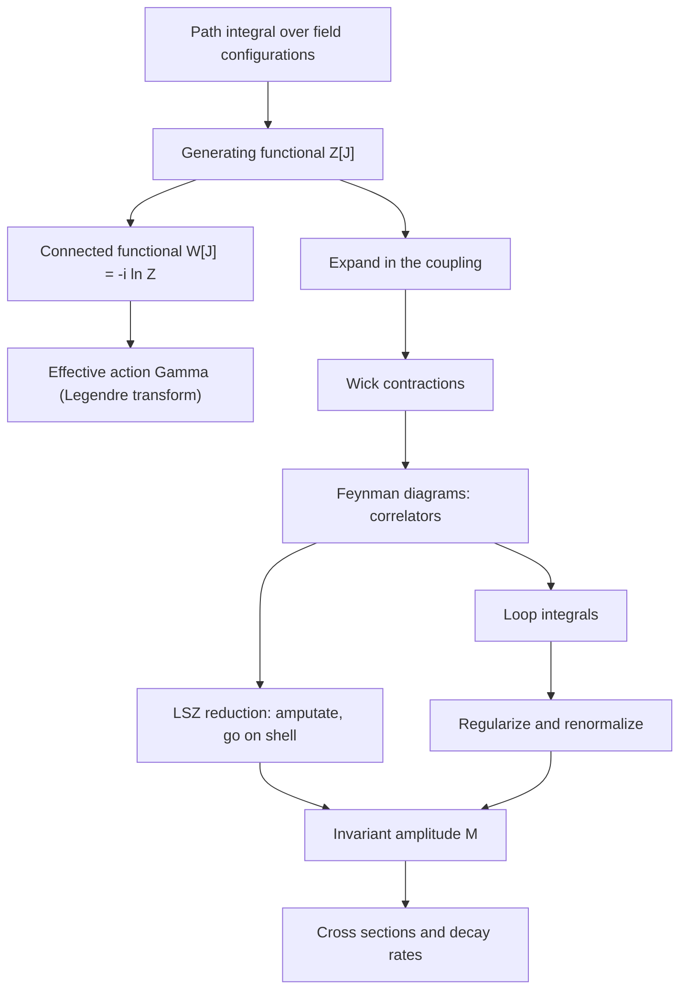
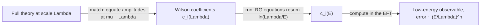

## Path Integrals & Methods

[Quantum Field Theory](quantum-field-theory.html) &raquo; Path Integrals &amp; Methods

This page covers the methods used to compute with quantum fields. The **path integral** writes the theory as a weighted sum over field configurations. **Generating functionals** turn that sum into a source of correlation functions. **Wick's theorem** and the **LSZ reduction formula** turn correlation functions into scattering amplitudes, and the **Feynman rules** are the shorthand that organizes the expansion. Further sections cover loop-integral techniques, the functional identities that constrain every calculation, gauge fixing, and effective field theory as a practical tool. The free-field inputs (mode expansions and propagators) are derived on the [canonical quantization](qft-quantization.html) page, and dealing with divergent loops is the subject of [renormalization](renormalization.html). Conventions are $\hbar = c = 1$ and a mostly-minus metric, except where $\hbar$ is restored to show the classical limit.

## The Path-Integral Formulation

The path integral was developed by Feynman in 1948, building on a 1933 observation of Dirac. It is equivalent to canonical quantization but keeps Lorentz invariance manifest, handles gauge theories and fermions naturally, and connects QFT directly to statistical mechanics. Instead of operators and commutators, it assigns the amplitude $e^{iS/\hbar}$ to every configuration and sums over all of them.

### Sum over histories

For a particle with $H = p^2/2m + V(x)$, split the time interval $T$ into $N$ steps of length $\delta t$ and insert a complete set of position states at each step. The transition amplitude becomes an iterated integral:

$$\langle x_f|e^{-iHT/\hbar}|x_i\rangle = \lim_{N\to\infty}\left(\frac{m}{2\pi i\hbar\,\delta t}\right)^{N/2}\int\prod_{k=1}^{N-1}dx_k\,\exp\left[\frac{i}{\hbar}\sum_{k=0}^{N-1}\delta t\left(\frac{m}{2}\left(\frac{x_{k+1}-x_k}{\delta t}\right)^2 - V(x_k)\right)\right] \equiv \int\mathcal{D}x\;e^{iS[x]/\hbar}.$$

Every path contributes a phase. Near a path where the action is stationary ($\delta S = 0$) the phases add constructively, and elsewhere they cancel. As $\hbar \to 0$ only the classical trajectory survives. Expanding about it gives the semiclassical (WKB) approximation.

### Fields

Replace $x(t)$ by $\phi(\mathbf{x}, t)$, so that there is one integration variable per spacetime point:

$$\langle \phi_f|e^{-iHT}|\phi_i\rangle = \int_{\phi_i}^{\phi_f}\mathcal{D}\phi\;e^{iS[\phi]}, \qquad S[\phi] = \int d^4x\;\mathcal{L}(\phi, \partial_\mu\phi).$$

Vacuum correlation functions are ratios of path integrals:

$$\langle\Omega|T\,\phi(x_1)\cdots\phi(x_n)|\Omega\rangle = \frac{\int\mathcal{D}\phi\;\phi(x_1)\cdots\phi(x_n)\,e^{iS[\phi]}}{\int\mathcal{D}\phi\;e^{iS[\phi]}}.$$

Time ordering comes out automatically, because the time-sliced integral always places the fields in time order. Projection onto the interacting vacuum $|\Omega\rangle$ comes from the same slightly imaginary time direction used in the [Gell-Mann-Low formula](qft-quantization.html#interacting-fields-the-interaction-picture).

### Euclidean path integral and the lattice

The oscillating weight $e^{iS}$ makes the Minkowski integral poorly defined. A **Wick rotation** $t = -i\tau$ turns $iS$ into $-S_E$, where for a scalar

$$S_E = \int d^4x_E\left[\tfrac{1}{2}(\partial_\mu\phi)^2 + \tfrac{1}{2}m^2\phi^2 + V(\phi)\right] \ge 0, \qquad Z_E = \int\mathcal{D}\phi\;e^{-S_E[\phi]}.$$

This has two consequences:

- **Statistical-mechanics dictionary.** $Z_E$ has the form of a Boltzmann partition function in four dimensions, with $S_E$ in the role of $\beta H$. Masses become inverse correlation lengths, and a continuum limit corresponds to a critical point. The [renormalization group](renormalization.html#the-wilsonian-renormalization-group) is common to both subjects. Compactifying Euclidean time on a circle of circumference $\beta = 1/T$ gives finite-temperature field theory.
- **Lattice field theory.** On a spacetime lattice of spacing $a$, the path integral becomes a finite-dimensional integral with a positive weight, which Monte Carlo methods can sample. Lattice QCD is the main non-perturbative method for the strong interaction: it computes hadron masses, decay constants and form factors from first principles. It now has direct precision impact. The 2025 Muon $g-2$ Theory Initiative white paper used lattice results for the leading hadronic vacuum polarization, obtained $a_\mu^{\text{SM}} = 116\,592\,033(62)\times 10^{-11}$, and found no significant tension with Fermilab's final 127 ppb measurement (June 2025). The difference is $38(63)\times 10^{-11}$, which removes the long-standing "muon $g-2$ anomaly". Two limitations remain. The **sign problem** blocks lattice simulations at finite baryon density and in real time, because the weight there is complex. And the tension between lattice and data-driven ($e^+e^- \to$ hadrons) evaluations of the hadronic vacuum polarization has not yet been resolved.

## Generating Functionals

Adding a source term $J\phi$ to the action turns the path integral into a single object from which every correlation function can be extracted by differentiation.

### Z[J], W[J] and the effective action

$$Z[J] = \int\mathcal{D}\phi\;\exp\left[iS[\phi] + i\int d^4x\,J(x)\phi(x)\right], \qquad \langle\Omega|T\,\phi(x_1)\cdots\phi(x_n)|\Omega\rangle = \frac{1}{Z[0]}\left(\prod_{k=1}^{n}\frac{-i\,\delta}{\delta J(x_k)}\right)Z[J]\bigg|_{J=0}.$$

Three functionals are in standard use. Each generates a smaller class of diagrams than the one before:

| Functional | Definition | Generates | Use |
|------------|------------|-----------|-----|
| $Z[J]$ | path integral with source | all correlators (including disconnected pieces) | starting point |
| $W[J]$ | $Z = e^{iW}$, i.e. $W = -i\ln Z$ | connected correlators | removes vacuum bubbles and factorized pieces |
| $\Gamma[\phi_c]$ | $\Gamma = W - \int J\phi_c$, with $\phi_c = \delta W/\delta J$ | one-particle-irreducible (1PI) vertices | quantum equations of motion, effective potential |

Connected correlators come from $\langle\phi(x_1)\cdots\phi(x_n)\rangle_c = (-i)^{n-1}\,\delta^n W/\delta J(x_1)\cdots\delta J(x_n)$ at $J = 0$. The effective action satisfies $\delta\Gamma/\delta\phi_c = -J$. With no source, the quantum vacuum is therefore an extremum of $\Gamma$ and not of the classical action $S$. For constant $\phi_c$, $\Gamma = -\int d^4x\,V_{\text{eff}}(\phi_c)$. At one loop the **effective potential** is

$$V_{\text{eff}}(\phi_c) = V(\phi_c) + \frac{1}{64\pi^2}\,V''(\phi_c)^2\left[\ln\frac{V''(\phi_c)}{\mu^2} - \frac{3}{2}\right] \quad (\overline{\text{MS}}),$$

where $V$ is the full tree-level potential (mass term included). This is the **Coleman-Weinberg** correction. Radiative corrections of this kind can shift or create minima, a mechanism relevant to [spontaneous symmetry breaking](gauge-and-standard-model.html#the-higgs-mechanism) and to the question of whether the electroweak vacuum is stable. With the measured Higgs and top masses, the Standard Model vacuum is metastable, with a lifetime far longer than the age of the universe.

### The free theory as a Gaussian integral

For a free field the action is quadratic, $S_0 = \tfrac{1}{2}\int\phi K\phi$ with $K = -(\Box + m^2)$, and the path integral is Gaussian. Completing the square gives the closed form

$$Z_0[J] = Z_0[0]\,\exp\left[-\frac{1}{2}\int d^4x\,d^4y\;J(x)\,D_F(x-y)\,J(y)\right], \qquad D_F = i\,K^{-1}, \qquad \tilde D_F(k) = \frac{i}{k^2 - m^2 + i\varepsilon}.$$

The two-point function of the free theory is $i$ times the inverse of the kinetic operator. This is the same Feynman propagator derived canonically, and the $i\varepsilon$ is what makes the Gaussian integral converge. The normalization $Z_0[0] \propto (\det K)^{-1/2}$ drops out of every normalized correlator, but it contributes to vacuum energies and one-loop effective actions.

### Fermions and Grassmann integration

Fermion fields anticommute, so their path integral runs over **Grassmann numbers**: $\theta\eta = -\eta\theta$ and $\theta^2 = 0$. Berezin integration is defined by $\int d\theta = 0$ and $\int d\theta\,\theta = 1$. The Gaussian integral then gives a determinant in the numerator instead of the denominator:

$$\int d\bar\theta\,d\theta\;e^{-\bar\theta B\theta} = \det B \qquad \text{(compare } \int dx\,e^{-xBx/2} \propto (\det B)^{-1/2}\text{ for bosons)}.$$

For the Dirac field, $\int\mathcal{D}\bar\psi\,\mathcal{D}\psi\;e^{i\int\bar\psi(i\not\partial - m)\psi} \propto \det(i\not\partial - m)$. This inverted power gives each closed fermion loop its factor of $-1$. It also produces the Faddeev-Popov ghosts below and the cancellation between boson and fermion loops in supersymmetric theories.

## Perturbation Theory

Split $\mathcal{L} = \mathcal{L}_0 + \mathcal{L}_{\text{int}}$. Inside the path integral each field can be replaced by a derivative with respect to the source, so the interaction can be taken outside as a differential operator acting on the solved free theory:

$$Z[J] = \exp\left[i\int d^4x\;\mathcal{L}_{\text{int}}\!\left(\frac{-i\,\delta}{\delta J(x)}\right)\right]Z_0[J].$$

Expanding the exponential in powers of the coupling gives the perturbation series.

### Wick's theorem and contractions

Differentiating the Gaussian $Z_0[J]$ pairs fields in every possible way. This is **Wick's theorem**. In operator language:

$$T\,\phi(x_1)\cdots\phi(x_n) = \;:\!\phi(x_1)\cdots\phi(x_n)\!: + \text{(all terms with one or more contractions)}, \qquad \text{contraction of }\phi(x_i)\text{ and }\phi(x_j) = D_F(x_i - x_j).$$

Normal-ordered terms have zero vacuum expectation value, so only full contractions contribute to vacuum correlators. For example,

$$\langle 0|T\,\phi_1\phi_2\phi_3\phi_4|0\rangle = D_F(x_1-x_2)\,D_F(x_3-x_4) + D_F(x_1-x_3)\,D_F(x_2-x_4) + D_F(x_1-x_4)\,D_F(x_2-x_3).$$

With $n$ fields there are $(n-1)!!$ pairings. Each pairing is a diagram: fields are endpoints and contractions are lines. For fermions every pairing also carries the sign of the permutation needed to bring the contracted fields next to each other.

### Symmetry factors and vacuum bubbles

With the conventional normalization $\mathcal{L}_{\text{int}} = -\tfrac{\lambda}{4!}\phi^4$, the $4!$ cancels the ways of attaching four lines to a vertex, and the $1/n!$ from the exponential cancels the ways of permuting identical vertices. What is left over is the **symmetry factor** $1/S$, where $S$ is the order of the diagram's automorphism group. Examples in $\phi^4$ theory: the one-loop tadpole correction to the propagator has $S = 2$, the one-loop "fish" correction to the four-point function has $S = 2$ in each channel, and the figure-eight vacuum bubble has $S = 8$. Diagrams with pieces disconnected from all external points (**vacuum bubbles**) exponentiate and cancel against $Z[0]$. This is why $W = -i\ln Z$ generates only connected diagrams.

### Two expansions

- **Coupling expansion.** Each vertex brings a power of $g$, $\lambda$ or $e$. For QED the effective expansion parameter is about $\alpha/\pi \approx 2.3\times 10^{-3}$, which is why five-loop QED calculations are meaningful.
- **Loop expansion.** A connected diagram with $I$ internal lines and $V$ vertices has $L = I - V + 1$ independent loop momenta. Restoring $\hbar$, each loop brings one more power of $\hbar$. Trees ($L = 0$) are the classical field theory and loops are quantum corrections. Unlike the coupling expansion, the loop expansion is well defined even when several couplings are present.

Perturbative series in QFT are generally **asymptotic, not convergent**. Dyson's argument for QED is that at $e^2 < 0$ the vacuum would be unstable, so the series has zero radius of convergence, and the number of diagrams grows factorially with order. Terms keep improving the answer only up to roughly order $1/\alpha$. Non-perturbative effects such as instantons and renormalons appear as ambiguities of order $e^{-c/g^2}$. The theory of resurgence studies how these ambiguities are related to the large-order behaviour of the perturbative series.

## From Correlators to Scattering: LSZ Reduction

Experiments measure scattering, not correlation functions. The **Lehmann-Symanzik-Zimmermann (LSZ) reduction formula** connects the two. Fourier transform the correlator in every external point. Near the one-particle poles it behaves as

$$\prod_{i=1}^{n}\int d^4x_i\,e^{ip_i\cdot x_i}\,\langle\Omega|T\,\phi(x_1)\cdots\phi(x_n)|\Omega\rangle \;\sim\; \prod_{i=1}^{n}\frac{i\sqrt{Z}}{p_i^2 - m^2 + i\varepsilon}\;\langle p_{\text{out}}|S|p_{\text{in}}\rangle \qquad (p_i^2 \to m^2),$$

where incoming momenta are taken with the opposite sign, $m$ is the physical (pole) mass, and $Z$ is the residue of the full propagator at that pole. S-matrix elements are therefore the residues of correlators at the external poles. In diagram terms: compute the **amputated** diagrams (external propagators removed), put the external momenta on shell, and multiply by $\sqrt{Z}$ for each external leg. The invariant amplitude $\mathcal{M}$ is defined by removing overall momentum conservation:

$$\langle f|\,S - \mathbb{1}\,|i\rangle = (2\pi)^4\,\delta^4\!\left(\textstyle\sum p_f - \sum p_i\right)\,i\mathcal{M}.$$

## Feynman Diagrams

Once LSZ is in place, the perturbation series for $i\mathcal{M}$ can be written directly from a set of rules, without passing through correlators.

### Feynman rules

For $\phi^4$ theory, $\mathcal{L}_{\text{int}} = -\tfrac{\lambda}{4!}\phi^4$. For QED, $\mathcal{L}_{\text{int}} = -e\bar\psi\gamma^\mu\psi A_\mu$ (Peskin & Schroeder convention, in which $e = -\lvert e\rvert$ is the electron's charge).

| Element | $\phi^4$ theory | QED (Feynman gauge) |
|---------|-----------------|---------------------|
| Vertex | $-i\lambda$ | $-ie\gamma^\mu$ |
| Internal scalar / fermion line | $\dfrac{i}{p^2 - m^2 + i\varepsilon}$ | $\dfrac{i(\not{p} + m)}{p^2 - m^2 + i\varepsilon}$ |
| Internal photon line | none | $\dfrac{-ig_{\mu\nu}}{q^2 + i\varepsilon}$ |
| Each undetermined loop momentum | $\displaystyle\int\frac{d^4k}{(2\pi)^4}$ | $\displaystyle\int\frac{d^4k}{(2\pi)^4}$ |
| Closed fermion loop | none | factor $-1$ and a Dirac trace |
| Symmetry factor | $1/S$ | usually 1 |

Momentum is conserved at each vertex. External lines carry wavefunction factors:

| External particle | Incoming | Outgoing |
|-------------------|----------|----------|
| Scalar | 1 | 1 |
| Fermion ($e^-$) | $u^s(p)$ | $\bar u^s(p)$ |
| Antifermion ($e^+$) | $\bar v^s(p)$ | $v^s(p)$ |
| Photon | $\epsilon_\mu(p)$ | $\epsilon^\ast_\mu(p)$ |

Fermion lines are read against the arrow, from the outgoing end back to the incoming end, which produces spinor chains such as $\bar u(p')\gamma^\mu u(p)$. Internal lines are **virtual**: they are off shell ($p^2 \ne m^2$), with momentum fixed by conservation at tree level and integrated over in loops. Diagrams that differ by exchanging identical external fermions carry a relative minus sign. Gauge bosons of a non-abelian theory add three- and four-gluon vertices and ghost lines; see [non-abelian gauge theory](gauge-and-standard-model.html#non-abelian-gauge-theory-yang-mills).

### From amplitude to observable

For $2 \to n$ scattering and for the decay of a particle of mass $M$:

$$d\sigma = \frac{\overline{\lvert\mathcal{M}\rvert^2}}{4\sqrt{(p_1\cdot p_2)^2 - m_1^2m_2^2}}\;d\Pi_n, \qquad d\Gamma = \frac{\overline{\lvert\mathcal{M}\rvert^2}}{2M}\;d\Pi_n, \qquad d\Pi_n = \prod_{f}\frac{d^3p_f}{(2\pi)^3\,2E_f}\;(2\pi)^4\,\delta^4\!\left(P - \textstyle\sum_f p_f\right).$$

The overline means averaged over initial spins and summed over final spins. For $2 \to 2$ scattering in the centre-of-mass frame this reduces to

$$\frac{d\sigma}{d\Omega}\bigg|_{\text{CM}} = \frac{1}{64\pi^2 s}\,\frac{\lvert\mathbf{p}_f\rvert}{\lvert\mathbf{p}_i\rvert}\,\overline{\lvert\mathcal{M}\rvert^2},$$

with Mandelstam invariants $s = (p_1+p_2)^2$, $t = (p_1-p_3)^2$, $u = (p_1-p_4)^2$, which satisfy $s + t + u = \sum m_i^2$.

## A Worked Amplitude

Consider electron-muon scattering $e^-(p_1)\,\mu^-(p_2) \to e^-(p_3)\,\mu^-(p_4)$ at tree level in QED. The particles are distinct, so there is a single diagram: one photon exchanged in the $t$-channel.

<figure class="diagram">
<svg viewBox="0 0 420 250" role="img" aria-labelledby="qftm-emu-title" style="max-width:420px;width:100%;color:inherit;">
<title id="qftm-emu-title">Tree-level Feynman diagram for electron-muon scattering: the electron line (top) and muon line (bottom) exchange a single virtual photon of momentum q = p1 - p3.</title>
<defs><marker id="qftm-arr" markerWidth="8" markerHeight="8" refX="6" refY="3" orient="auto"><path d="M0,0 L0,6 L8,3 z" fill="currentColor"/></marker></defs>
<g stroke="currentColor" fill="none" stroke-width="1.8">
<line x1="50" y1="30" x2="130" y2="52" marker-end="url(#qftm-arr)"/>
<line x1="130" y1="52" x2="210" y2="75"/>
<line x1="210" y1="75" x2="290" y2="52" marker-end="url(#qftm-arr)"/>
<line x1="290" y1="52" x2="370" y2="30"/>
<line x1="50" y1="220" x2="130" y2="198" marker-end="url(#qftm-arr)"/>
<line x1="130" y1="198" x2="210" y2="175"/>
<line x1="210" y1="175" x2="290" y2="198" marker-end="url(#qftm-arr)"/>
<line x1="290" y1="198" x2="370" y2="220"/>
<path d="M210,75 q8,5 0,10 t0,10 t0,10 t0,10 t0,10 t0,10 t0,10 t0,10 t0,10 t0,10"/>
<circle cx="210" cy="75" r="3" fill="currentColor"/>
<circle cx="210" cy="175" r="3" fill="currentColor"/>
</g>
<g fill="currentColor" font-size="13" font-family="sans-serif">
<text x="40" y="22">e⁻ (p₁)</text>
<text x="330" y="22">e⁻ (p₃)</text>
<text x="40" y="242">μ⁻ (p₂)</text>
<text x="330" y="242">μ⁻ (p₄)</text>
<text x="228" y="130">γ*,  q = p₁ − p₃</text>
<text x="222" y="70" font-size="12">−ieγ^μ</text>
<text x="222" y="190" font-size="12">−ieγ^ν</text>
<text x="210" y="148" font-size="11" text-anchor="end" opacity="0.8">−i g_μν / q²  </text>
</g>
</svg>
<figcaption>The single tree-level diagram for $e^-\mu^- \to e^-\mu^-$. Time runs left to right. Each vertex contributes $-ie\gamma$ and the virtual photon contributes its propagator.</figcaption>
</figure>

**Assemble the amplitude.** Read each fermion line backwards along the arrow and connect the two lines with the photon propagator:

$$i\mathcal{M} = \left[\bar u(p_3)(-ie\gamma^\mu)u(p_1)\right]\frac{-ig_{\mu\nu}}{q^2}\left[\bar u(p_4)(-ie\gamma^\nu)u(p_2)\right] \quad\Longrightarrow\quad \mathcal{M} = \frac{e^2}{t}\left[\bar u(p_3)\gamma^\mu u(p_1)\right]\left[\bar u(p_4)\gamma_\mu u(p_2)\right],$$

with $t = q^2 = (p_1 - p_3)^2$.

**Square and sum over spins.** Using $\sum_s u\bar u = \not{p} + m$, each spinor chain becomes a trace. Including the factor $\tfrac14$ for averaging over initial spins:

$$\overline{\lvert\mathcal{M}\rvert^2} = \frac{e^4}{4t^2}\,\mathrm{Tr}\left[(\not{p}_3 + m_e)\gamma^\mu(\not{p}_1 + m_e)\gamma^\nu\right]\mathrm{Tr}\left[(\not{p}_4 + m_\mu)\gamma_\mu(\not{p}_2 + m_\mu)\gamma_\nu\right].$$

**Evaluate the traces.** Use $\mathrm{Tr}[\gamma^\mu\gamma^\nu] = 4g^{\mu\nu}$, $\mathrm{Tr}[\gamma^\mu\gamma^\nu\gamma^\rho\gamma^\sigma] = 4(g^{\mu\nu}g^{\rho\sigma} - g^{\mu\rho}g^{\nu\sigma} + g^{\mu\sigma}g^{\nu\rho})$, and the fact that the trace of an odd number of gamma matrices vanishes. In the high-energy limit $m_e, m_\mu \to 0$:

$$\overline{\lvert\mathcal{M}\rvert^2} = \frac{2e^4\left(s^2 + u^2\right)}{t^2}.$$

**Cross section.** Substituting into the centre-of-mass formula with $\lvert\mathbf{p}_f\rvert = \lvert\mathbf{p}_i\rvert$ and $e^2 = 4\pi\alpha$:

$$\frac{d\sigma}{d\Omega} = \frac{\alpha^2}{2s}\,\frac{s^2 + u^2}{t^2}, \qquad t = -\frac{s}{2}(1 - \cos\theta), \quad u = -\frac{s}{2}(1 + \cos\theta).$$

The $1/t^2$ factor makes the cross section peak strongly in the forward direction ($\theta \to 0$). This is the Rutherford singularity of long-range photon exchange. Crossing symmetry relates this result to others: exchanging $s \leftrightarrow t$ gives $e^+e^- \to \mu^+\mu^-$, with $\overline{\lvert\mathcal{M}\rvert^2} = 2e^4(t^2 + u^2)/s^2$. Identical particles add a second diagram with a relative sign, as in Bhabha ($e^+e^-\to e^+e^-$) and Møller ($e^-e^-\to e^-e^-$) scattering.

## Loop Calculations

Beyond tree level, diagrams contain closed loops whose momenta are integrated over. Loops carry the genuine quantum corrections, including the anomalous magnetic moments, the Lamb shift and the running of couplings. They also carry the ultraviolet divergences handled on the [renormalization page](renormalization.html), which works through the one-loop QED self-energy, vertex and vacuum-polarization diagrams.

### Standard one-loop techniques

- **Feynman parameters** combine the propagator denominators into a single quadratic form:

  $$\frac{1}{A_1\cdots A_n} = (n-1)!\int_0^1 dx_1\cdots dx_n\;\frac{\delta\!\left(1 - \sum_i x_i\right)}{\left(x_1A_1 + \cdots + x_nA_n\right)^n}.$$

  A shift of the loop momentum then completes the square, leaving integrands of the form $1/(\ell^2 - \Delta)^n$.
- **Wick rotation** $\ell^0 = i\ell_E^0$ turns Minkowski integrals into Euclidean ones, $\int d^4\ell \to i\int d^4\ell_E$.
- **Dimensional regularization** evaluates the integral in $d = 4 - \epsilon$ dimensions. Divergences appear as poles in $1/\epsilon$, and Lorentz and gauge invariance are preserved.
- **Passarino-Veltman reduction** rewrites one-loop tensor integrals in terms of a handful of scalar integrals: the tadpole $A_0$, bubble $B_0$, triangle $C_0$ and box $D_0$. Any one-loop amplitude is then a linear combination of these with rational coefficients.
- **Unitarity methods** build loop amplitudes from products of on-shell tree amplitudes, using the discontinuities fixed by the optical theorem. The [modern amplitudes program](qft-frontiers.html#the-modern-amplitudes-program) extends this approach.

### Multi-loop technology

High-precision predictions need two to five loops. Standard practice for these is:

1. **Integration-by-parts (IBP) identities**, $\int d^d\ell\;\partial_\mu\!\left[v^\mu f(\ell)\right] = 0$, reduce thousands of integrals to a small basis of **master integrals** using the Laporta algorithm.
2. The master integrals are computed with **differential equations** in the kinematic variables, often in a canonical "$\epsilon$-form" whose solutions are multiple polylogarithms. Elliptic and more complicated function classes appear in massive and higher-loop cases. **Sector decomposition** is used for numerical evaluation.
3. Everything is automated. Commonly used tools include FeynArts and FeynCalc for diagram generation and Dirac algebra, FORM for large symbolic manipulation, Kira, FIRE and LiteRed for IBP reduction, pySecDec and AMFlow for numerical master integrals, and MadGraph5_aMC@NLO for automated next-to-leading-order collider predictions.

Representative results include the four- and five-loop QED contributions to the electron $g-2$ (the five-loop term alone involves 12,672 diagrams), N3LO QCD corrections to Higgs production at the LHC, and the five-loop QCD beta function.

## Functional Identities

The path integral also gives exact, all-orders relations that do not depend on the perturbative expansion.

### Schwinger-Dyson equations

The integral of a total functional derivative vanishes. Applying this to $\delta/\delta\phi(x)$ acting on $e^{iS}\phi(x_1)\cdots\phi(x_n)$ gives the quantum equations of motion:

$$\left\langle\frac{\delta S}{\delta\phi(x)}\,\phi(x_1)\cdots\phi(x_n)\right\rangle = i\sum_{j=1}^{n}\delta^4(x - x_j)\,\left\langle\phi(x_1)\cdots\widehat{\phi(x_j)}\cdots\phi(x_n)\right\rangle,$$

where the hat marks an omitted field. The classical equation of motion $\delta S/\delta\phi = 0$ holds inside correlators except at **contact terms**. The equations form an infinite coupled hierarchy linking $n$-point functions to higher ones. Truncations of this hierarchy are a standard non-perturbative approach to QCD bound states.

### Ward-Takahashi identities

If the action has a symmetry, the same argument applied to a change of variables along that symmetry gives **Ward-Takahashi identities**, the quantum form of Noether's theorem. In QED, current conservation relates the full electron-photon vertex $\Gamma^\mu$ to the full electron propagator $S(p) = [\not{p} - m - \Sigma(p)]^{-1}$ (factors of $i$ stripped):

$$q_\mu\,\Gamma^\mu(p + q,\,p) = S^{-1}(p + q) - S^{-1}(p).$$

At tree level both sides equal $\not{q}$. To all orders the identity implies $Z_1 = Z_2$ (vertex and wavefunction renormalization are equal). As a result charge renormalization comes only from vacuum polarization and is the same for every charged species. The identity also keeps the photon massless, because the vacuum polarization has the transverse form $\Pi^{\mu\nu} = (q^2g^{\mu\nu} - q^\mu q^\nu)\,\Pi(q^2)$. A related identity for amplitudes, $q_\mu\mathcal{M}^\mu = 0$ for an external photon, is what allows unphysical polarizations to be dropped.

## Gauge Fixing, Ghosts and BRST

A gauge-field path integral naively diverges, because it integrates over infinitely many gauge-equivalent copies of each configuration. The **Faddeev-Popov** procedure inserts $1 = \int\mathcal{D}\alpha\;\delta(G[A^\alpha])\,\det(\delta G/\delta\alpha)$, factors out the (infinite) volume of the gauge group, and writes the determinant as a Gaussian integral over anticommuting scalar **ghost** fields $c$, $\bar c$. For Yang-Mills theory with the covariant gauge $G = \partial^\mu A^a_\mu$:

$$\mathcal{L} = -\frac{1}{4}F^a_{\mu\nu}F^{a\mu\nu} - \frac{1}{2\xi}\left(\partial^\mu A^a_\mu\right)^2 + \bar c^a\left(-\partial^\mu D^{ab}_\mu\right)c^b.$$

Ghosts violate spin-statistics. They are not physical particles, and they appear only in loops, where they cancel the unphysical polarizations of the gauge field. In QED the ghosts do not couple to the photon and can be dropped.

The gauge-fixed Lagrangian is no longer gauge invariant. It is invariant under a residual global fermionic symmetry, **BRST symmetry**, generated by a nilpotent charge $Q_B$ with $Q_B^2 = 0$. Physical states are the cohomology of $Q_B$ (states annihilated by $Q_B$, modulo those of the form $Q_B\lvert\chi\rangle$). This definition guarantees that unphysical modes decouple, that the S-matrix is unitary on the physical subspace, and that physical results are independent of $\xi$. BRST is the standard framework for quantizing gauge theories, and its generalization, the Batalin-Vilkovisky formalism, covers more complicated gauge structures such as those in string field theory and supergravity.

## Effective Field Theory in Practice

Effective field theory (EFT) is how QFT is used when the full theory is unknown or too hard to solve. The conceptual basis, Wilson's renormalization group and why low-energy physics looks renormalizable, is developed on the [renormalization page](renormalization.html#effective-field-theory-the-modern-viewpoint). This section covers the practical steps.

For processes at energy $E$ well below a heavy scale $\Lambda$, write the most general local Lagrangian for the light fields consistent with the symmetries and organize it by operator dimension $d_i$:

$$\mathcal{L}_{\text{eff}} = \mathcal{L}_{d \le 4} + \sum_{i}\frac{c_i}{\Lambda^{d_i - 4}}\,\mathcal{O}_i.$$

Each operator contributes at relative order $(E/\Lambda)^{d_i - 4}$, so a fixed accuracy needs only finitely many **Wilson coefficients** $c_i$. A typical calculation has three steps:

**Worked matching: Fermi theory.** The charged-current amplitude for muon decay has two $W$ vertices $\frac{-ig}{\sqrt{2}}\gamma^\mu P_L$ connected by a $W$ propagator. For momentum transfer $q^2 \ll m_W^2$ the propagator can be expanded:

$$\frac{-i\,g_{\mu\nu}}{q^2 - m_W^2} = \frac{i\,g_{\mu\nu}}{m_W^2}\left(1 + \frac{q^2}{m_W^2} + \cdots\right) \quad\Longrightarrow\quad \frac{G_F}{\sqrt{2}} = \frac{g^2}{8m_W^2}.$$

The leading term is a four-fermion contact interaction with $G_F \approx 1.16638\times 10^{-5}\ \text{GeV}^{-2}$. The $q^2/m_W^2$ terms are dimension-8 corrections. Fermi's non-renormalizable coupling had negative mass dimension, and that pointed to the scale of the new physics: $m_W \approx 80$ GeV.

| Effective theory | Light degrees of freedom | Integrated out | Expansion parameter |
|------------------|--------------------------|----------------|---------------------|
| Fermi theory | leptons, quarks | $W$, $Z$ | $E/m_W$ |
| Chiral perturbation theory | pions, kaons, eta | QCD resonances | $p/(4\pi f_\pi)$, with $4\pi f_\pi \approx 1$ GeV |
| Heavy-quark EFT (HQET) | light quarks, gluons, static heavy quark | heavy-quark recoil | $\Lambda_{\text{QCD}}/m_Q$ |
| Non-relativistic QED/QCD (NRQED, NRQCD) | slow bound-state constituents | relativistic modes | velocity $v$ |
| Soft-collinear EFT (SCET) | collinear and soft quarks and gluons | hard modes | $\lambda \sim p_T/Q$ |
| Euler-Heisenberg | photons | electron | $\omega/m_e$ |
| SMEFT | all Standard Model fields | unknown heavy physics | $v/\Lambda$, $E/\Lambda$ |
| General relativity as an EFT | graviton | unknown UV completion | $E/M_{\text{Pl}}$ |

**SMEFT** is the standard framework for model-independent searches for new physics at the LHC. At dimension 5 there is a single operator structure, the Weinberg operator $(LH)(LH)/\Lambda$, which gives Majorana neutrino masses. At dimension 6 the Warsaw basis has 59 independent baryon-number-conserving operator structures, which become 2499 independent coefficients once three generations of flavour indices are counted. Global fits to Higgs, electroweak, top and flavour data constrain combinations of these coefficients. A closely related framework, HEFT, relaxes the assumption that the Higgs sits in an electroweak doublet.

## See Also

- [Quantum Field Theory](quantum-field-theory.html): the overview hub and reading order.
- [Canonical Quantization](qft-quantization.html): free fields, propagators and the interaction picture.
- [Renormalization & the RG](renormalization.html): regularizing and renormalizing loop integrals, running couplings and the Wilsonian view of EFT.
- [Gauge Theories & the Standard Model](gauge-and-standard-model.html): the Lagrangians these methods are applied to.
- [QFT: Modern Frontiers](qft-frontiers.html): on-shell amplitude methods, anomalies and holography.
- [Statistical Mechanics](statistical-mechanics/): the Euclidean path integral as a partition function.
- [Computational Physics](computational-physics/): Monte Carlo methods of the kind used in lattice field theory.
- [Physics Hub](index.html): all physics topics.
