  <h1 style="color: white; margin: 0; font-size: 2.5rem;">Canonical Quantization</h1>
  
Promoting classical fields to operators: the Klein-Gordon and Dirac fields, ladder operators, the vacuum, and the propagators that glue Feynman diagrams together.

[Quantum Field Theory](./quantum-field-theory.html) &raquo; Canonical Quantization

  
Canonical quantization is the most direct route from a classical field theory to a quantum one. You take the classical field — a function $\phi(x)$ defined at every point of spacetime — and its conjugate momentum, and you impose the same equal-time commutation relations that turned the harmonic oscillator into a quantum system. The payoff is enormous: the field decomposes into an infinite collection of oscillators, one per momentum mode, and the quanta of those oscillators <em>are the particles</em>. Energy in a mode comes in discrete lumps; each lump is one particle. This page builds that machinery explicitly for spin-0 (Klein-Gordon) and spin-½ (Dirac) fields, defines the vacuum, and derives the Feynman propagators.

  

    <i class="fas fa-wave-square"></i>
    <h4>A field is infinitely many oscillators</h4>
    
Fourier-expanding a free field turns it into one harmonic oscillator per momentum mode.

  

  

    <i class="fas fa-layer-group"></i>
    <h4>Quanta are particles</h4>
    
The $n$-th excited state of a mode is a state of $n$ identical particles with that momentum.

  

  

    <i class="fas fa-exchange-alt"></i>
    <h4>Statistics from (anti)commutators</h4>
    
Bosons use commutators; fermions <em>must</em> use anticommutators — this is the spin-statistics connection.

  

  

    <i class="fas fa-arrows-left-right"></i>
    <h4>The propagator is the inverse</h4>
    
The two-point function is the Green's function of the field equation, with the $i\varepsilon$ contour fixing causality.

  

## From the Oscillator to the Field

Canonical quantization begins with a classical Lagrangian density $\mathcal{L}(\phi, \partial_\mu\phi)$. The field $\phi(x)$ plays the role of a coordinate, and the **conjugate momentum density** is defined by analogy with $p = \partial L/\partial\dot{q}$:

$$\pi(x) = \frac{\partial \mathcal{L}}{\partial \dot{\phi}(x)}$$

The classical Hamiltonian density is the Legendre transform

$$\mathcal{H} = \pi\dot{\phi} - \mathcal{L}, \qquad H = \int d^3x\, \mathcal{H}.$$

To quantize, we promote $\phi$ and $\pi$ to operators and impose **equal-time canonical commutation relations** — the continuum generalization of $[\hat{q},\hat{p}] = i\hbar$:

$$[\phi(\mathbf{x}, t), \pi(\mathbf{y}, t)] = i\hbar\,\delta^3(\mathbf{x} - \mathbf{y})$$

$$[\phi(\mathbf{x}, t), \phi(\mathbf{y}, t)] = [\pi(\mathbf{x}, t), \pi(\mathbf{y}, t)] = 0$$

The Dirac delta replaces the Kronecker delta because the "index" labelling the degrees of freedom is now the continuous spatial position. Everything below is the systematic working out of this single prescription. (We set $\hbar = c = 1$ from here on, as is standard.)

```mermaid
graph LR
    CL["Classical field phi(x)"] --> CONJ["Conjugate momentum pi(x)"]
    CONJ --> COMM["Impose [phi, pi] = i delta"]
    COMM --> EXP["Fourier-expand into modes"]
    EXP --> LADDER["Ladder operators a, a-dagger"]
    LADDER --> FOCK["Fock space: vacuum + n-particle states"]
    FOCK --> PROP["Propagator = vacuum 2-point function"]
    style CL fill:#11998e,color:#fff
    style FOCK fill:#38ef7d,color:#222
    style PROP fill:#ccf,color:#222
```

## Creation and Annihilation Operators

Fields are quantized using creation ($a^\dagger$) and annihilation ($a$) operators, exactly as for the harmonic oscillator, but with one such pair for every momentum mode.

**Commutation relations (bosons):**

$$[a_k, a^\dagger_{k'}] = (2\pi)^3\,\delta^3(k - k')$$

$$[a_k, a_{k'}] = [a^\dagger_k, a^\dagger_{k'}] = 0$$

(The normalization of the delta function depends on conventions; the structure is what matters.) The operator $a^\dagger_k$ creates a quantum of momentum $k$ and $a_k$ destroys one. Because particle number can change, the Hilbert space is not the fixed-particle space of ordinary quantum mechanics but a **Fock space** built by acting with creation operators on the vacuum.

**Anticommutation relations (fermions):**

$$\{a_k, a^\dagger_{k'}\} = (2\pi)^3\,\delta^3(k - k')$$

$$\{a_k, a_{k'}\} = \{a^\dagger_k, a^\dagger_{k'}\} = 0$$

For fermions the curly braces are not a choice — they are forced. The relation $\{a^\dagger_k, a^\dagger_k\} = 0$ gives $(a^\dagger_k)^2 = 0$: you cannot put two identical fermions in the same mode. This is the **Pauli exclusion principle**, and it emerges automatically from anticommutation. The deep theorem behind which fields use which is the **spin-statistics theorem**: integer-spin fields must be quantized with commutators (and are bosons), half-integer-spin fields with anticommutators (and are fermions). Choosing the wrong one produces a theory with either negative-norm states or no stable ground state.

### Number operator and Fock space

For each mode the **number operator** $N_k = a^\dagger_k a_k$ counts quanta. A general multi-particle state is

$$|n_{k_1}, n_{k_2}, \ldots\rangle \propto (a^\dagger_{k_1})^{n_{k_1}}(a^\dagger_{k_2})^{n_{k_2}}\cdots|0\rangle.$$

For bosons each $n_k$ ranges over $0, 1, 2, \ldots$; for fermions each $n_k \in \{0, 1\}$. Because creation operators for bosons commute, the state is automatically symmetric under particle exchange; because fermionic ones anticommute, the state is automatically antisymmetric. The (anti)symmetrization postulate of ordinary quantum mechanics is thus a derived consequence of field quantization.

## The Vacuum State

The vacuum $|0\rangle$ is the state annihilated by every annihilation operator — the state with no particles:

$$a_k|0\rangle = 0 \quad \text{for all } k$$

It is the lowest-energy state of the theory, not "nothing." The vacuum has non-zero energy due to quantum fluctuations: each oscillator mode contributes a zero-point energy $\tfrac{1}{2}\omega_k$, and summing over the infinitely many modes gives a (formally divergent) **zero-point energy**

$$E_0 = \langle 0|H|0\rangle = \int \frac{d^3k}{(2\pi)^3}\,\frac{\omega_k}{2}.$$

In practice we **normal-order** the Hamiltonian — move all annihilation operators to the right, denoted $:H:$ — which subtracts this constant and defines energies relative to the vacuum. The fluctuations are physically real, however: they produce the **Casimir force** between conducting plates and the **Lamb shift** in atomic spectra. The vacuum of an interacting theory is more subtle still — it is a complicated superposition dressed by virtual particles — but for the free fields below the simple definition above suffices.

## Scalar Field Theory: the Klein-Gordon Field

The simplest quantum field describes spin-0 particles. It is the workhorse for learning the formalism because it has no spinor or vector indices to track.

### Lagrangian and equation of motion

**Lagrangian density:**

$$\mathcal{L} = \frac{1}{2}(\partial_\mu\phi)(\partial^\mu\phi) - \frac{1}{2}m^2\phi^2$$

**Equation of motion** (the Euler-Lagrange equation for this $\mathcal{L}$):

$$(\Box + m^2)\phi = 0$$

where $\Box = \partial_\mu\partial^\mu = \partial_t^2 - \nabla^2$ is the d'Alembertian operator. This is the **Klein-Gordon equation**, historically the first relativistic wave equation. Plane-wave solutions $e^{-ik\cdot x}$ satisfy it only when $k^2 = m^2$, i.e. $k_0^2 = \mathbf{k}^2 + m^2$ — the relativistic energy-momentum relation. The conjugate momentum is $\pi = \partial\mathcal{L}/\partial\dot\phi = \dot\phi$.

### Quantization: the mode expansion

Solving the field equation mode by mode and imposing the canonical commutators yields the **field expansion**:

$$\phi(x) = \int \frac{d^3k}{(2\pi)^3\sqrt{2\omega_k}} \left[a_k\, e^{-ik\cdot x} + a^\dagger_k\, e^{ik\cdot x}\right]$$

where $\omega_k = \sqrt{\mathbf{k}^2 + m^2}$ and $k\cdot x = \omega_k t - \mathbf{k}\cdot\mathbf{x}$ on shell. The first term annihilates a particle, the second creates one; because the field is real (Hermitian), the same operators appear in both. Substituting this expansion into the equal-time commutator $[\phi, \pi] = i\delta^3$ and matching coefficients reproduces precisely the bosonic ladder commutators $[a_k, a^\dagger_{k'}] = (2\pi)^3\delta^3(k-k')$ — this is the consistency check that the whole construction hangs together.

Inserting the expansion into $H = \int d^3x\,\tfrac{1}{2}(\pi^2 + (\nabla\phi)^2 + m^2\phi^2)$ and normal-ordering gives the clean result

$$:H: = \int \frac{d^3k}{(2\pi)^3}\,\omega_k\, a^\dagger_k a_k,$$

which is manifestly a sum of independent oscillators: each particle of momentum $k$ carries energy $\omega_k$, exactly as relativity demands.

### A complex scalar field and antiparticles

If the scalar is **complex**, $\phi \neq \phi^\dagger$, the expansion uses two independent sets of operators,

$$\phi(x) = \int \frac{d^3k}{(2\pi)^3\sqrt{2\omega_k}} \left[a_k\, e^{-ik\cdot x} + b^\dagger_k\, e^{ik\cdot x}\right],$$

where $a_k$ destroys a particle and $b^\dagger_k$ creates an **antiparticle**. The theory then has a conserved $U(1)$ charge $Q = \int \tfrac{d^3k}{(2\pi)^3}(a^\dagger_k a_k - b^\dagger_k b_k)$: particles and antiparticles carry opposite charge. This is the first appearance of antimatter as an unavoidable feature of relativistic quantum fields.

### The Feynman propagator

The central object for perturbation theory is the **Feynman propagator**, the vacuum expectation value of the time-ordered product of two fields:

$$D_F(x - y) = \langle 0|T[\phi(x)\phi(y)]|0\rangle = \int \frac{d^4k}{(2\pi)^4} \frac{i}{k^2 - m^2 + i\varepsilon}\, e^{-ik\cdot(x-y)}$$

It is the Green's function of the Klein-Gordon equation: $(\Box_x + m^2)D_F(x-y) = -i\delta^4(x-y)$. Physically it is the amplitude for a disturbance created at $y$ to propagate to $x$.

**Derivation via contour integration.** The time-ordered product is

$$T[\phi(x)\phi(y)] = \theta(x^0 - y^0)\,\phi(x)\phi(y) + \theta(y^0 - x^0)\,\phi(y)\phi(x).$$

Using the mode expansion, each ordering picks out the positive- or negative-frequency part; the step functions can be written as contour integrals over $k^0$. Performing the $k^0$ integral with the appropriate $i\varepsilon$ prescription assembles both orderings into the single covariant expression above. The momentum-space propagator is

$$\tilde{D}_F(k) = \frac{i}{k^2 - m^2 + i\varepsilon}.$$

The pole sits at $k^2 = m^2$, the mass shell. The infinitesimal $+i\varepsilon$ shifts the two poles off the real $k^0$ axis: the positive-energy pole goes below, the negative-energy pole above. This is exactly the prescription that makes positive-energy modes propagate forward in time and negative-energy modes (antiparticles) backward — guaranteeing **causality** and the correct **analytic continuation** to the Euclidean theory. Different contour choices give the retarded or advanced Green's functions; only the Feynman contour produces the time-ordered correlator that enters Feynman diagrams.

## Dirac Field Theory: spin-½ fermions

Electrons, quarks, and all matter particles are spin-½ fermions, described by the Dirac field. The new ingredient is that the field carries a four-component **spinor** index, and it must be quantized with anticommutators.

### The Dirac equation

Dirac sought a relativistic equation **first order** in time (unlike second-order Klein-Gordon), to avoid negative probabilities. The result is

$$(i\gamma^\mu\partial_\mu - m)\psi = 0$$

where $\psi$ is a four-component spinor and the $\gamma^\mu$ are $4\times 4$ matrices. Consistency with $k^2 = m^2$ requires the **gamma matrices** to satisfy the Clifford algebra

$$\{\gamma^\mu, \gamma^\nu\} = 2g^{\mu\nu}\,\mathbb{1}.$$

A common explicit choice is the Dirac representation, built from Pauli matrices $\sigma^i$:

$$\gamma^0 = \begin{pmatrix} \mathbb{1} & 0 \\ 0 & -\mathbb{1} \end{pmatrix}, \qquad \gamma^i = \begin{pmatrix} 0 & \sigma^i \\ -\sigma^i & 0 \end{pmatrix}.$$

Acting on the Dirac equation with $(i\gamma^\nu\partial_\nu + m)$ and using the Clifford algebra recovers $(\Box + m^2)\psi = 0$ component by component — so every solution of the Dirac equation also solves Klein-Gordon, which fixes the dispersion relation to be relativistic.

### Spinors and their structure

Plane-wave solutions take the form $\psi \sim u^s(p)\,e^{-ip\cdot x}$ (positive energy) and $\psi \sim v^s(p)\,e^{+ip\cdot x}$ (negative energy), where $s \in \{1,2\}$ labels the two spin states. The spinors satisfy the momentum-space Dirac equations

$$(\not{p} - m)\,u^s(p) = 0, \qquad (\not{p} + m)\,v^s(p) = 0,$$

with the Feynman slash $\not{p} = \gamma^\mu p_\mu$. They are normalized by $\bar{u}^r u^s = 2m\,\delta^{rs}$, $\bar{v}^r v^s = -2m\,\delta^{rs}$, and obey the **completeness (spin-sum) relations**

$$\sum_s u^s(p)\bar{u}^s(p) = \not{p} + m, \qquad \sum_s v^s(p)\bar{v}^s(p) = \not{p} - m,$$

which are what make spin sums in cross-section calculations collapse into traces of gamma matrices.

### The Dirac Lagrangian

$$\mathcal{L} = \bar{\psi}(i\gamma^\mu\partial_\mu - m)\psi$$

where $\bar{\psi} = \psi^\dagger\gamma^0$ is the **Dirac adjoint** — the combination that transforms so that $\bar\psi\psi$ is a Lorentz scalar. Varying with respect to $\bar\psi$ returns the Dirac equation; varying with respect to $\psi$ gives the adjoint equation $\bar\psi(i\overleftarrow{\not\partial} + m) = 0$.

### Fermion quantization

The field is expanded over the spinor solutions, now with operator coefficients:

$$\psi(x) = \sum_s \int \frac{d^3p}{(2\pi)^3\sqrt{2E_p}} \left[b^s_p\, u^s(p)\,e^{-ip\cdot x} + d^{s\dagger}_p\, v^s(p)\,e^{ip\cdot x}\right]$$

where

- $b^s_p$ **annihilates** a particle (electron) of spin $s$, momentum $p$,
- $d^{s\dagger}_p$ **creates** an antiparticle (positron),
- $u^s(p), v^s(p)$ are the spinor solutions above.

The conjugate momentum is $\pi = \partial\mathcal{L}/\partial\dot\psi = i\psi^\dagger$, and the operators obey **anticommutation** relations:

$$\{b^r_p, b^{s\dagger}_{p'}\} = \{d^r_p, d^{s\dagger}_{p'}\} = (2\pi)^3\delta^3(p - p')\,\delta^{rs},$$

with all other anticommutators vanishing. Had we instead used commutators, the Hamiltonian $H = \sum_s\int \tfrac{d^3p}{(2\pi)^3} E_p\,(b^{s\dagger}_p b^s_p - d^s_p d^{s\dagger}_p)$ would not be bounded below — the antiparticle term would lower the energy without limit. Anticommutation flips the sign after normal-ordering, giving a positive-definite

$$:H: = \sum_s\int \frac{d^3p}{(2\pi)^3}\,E_p\,(b^{s\dagger}_p b^s_p + d^{s\dagger}_p d^s_p),$$

and simultaneously enforces Pauli exclusion. This is the spin-statistics theorem in action: a spin-½ field has no consistent quantization other than the fermionic one.

### The Dirac propagator

The fermion Feynman propagator is the time-ordered two-point function of the Dirac field. Because spinor fields anticommute, the time-ordering picks up a relative minus sign:

$$S_F(x - y) = \langle 0|T[\psi(x)\bar\psi(y)]|0\rangle = \int \frac{d^4p}{(2\pi)^4}\,\frac{i(\not{p} + m)}{p^2 - m^2 + i\varepsilon}\,e^{-ip\cdot(x-y)}.$$

In momentum space, using the identity $(\not{p}-m)(\not{p}+m) = p^2 - m^2$, this is compactly the inverse of the Dirac operator:

$$\tilde{S}_F(p) = \frac{i(\not{p}+m)}{p^2 - m^2 + i\varepsilon} = \frac{i}{\not{p} - m + i\varepsilon}.$$

The same $i\varepsilon$ contour as in the scalar case ensures particles propagate forward and antiparticles backward in time. This propagator, together with the scalar and (in [QED](./gauge-and-standard-model.html#quantum-electrodynamics-qed)) photon propagators, is the internal line of every Feynman diagram.

## Worked Example: equal-time commutator from the mode expansion

To see the machinery close, verify that the scalar mode expansion reproduces the canonical commutator. With $\pi = \dot\phi$,

$$\phi(\mathbf{x}) = \int \frac{d^3k}{(2\pi)^3\sqrt{2\omega_k}}\left[a_k e^{i\mathbf{k}\cdot\mathbf{x}} + a^\dagger_k e^{-i\mathbf{k}\cdot\mathbf{x}}\right], \qquad \pi(\mathbf{y}) = \int \frac{d^3k'}{(2\pi)^3}(-i)\sqrt{\frac{\omega_{k'}}{2}}\left[a_{k'} e^{i\mathbf{k}'\cdot\mathbf{y}} - a^\dagger_{k'} e^{-i\mathbf{k}'\cdot\mathbf{y}}\right]$$

(at equal time). Computing $[\phi(\mathbf{x}), \pi(\mathbf{y})]$, only the $[a_k, a^\dagger_{k'}] = (2\pi)^3\delta^3(k-k')$ and $[a^\dagger_k, a_{k'}]$ terms survive. The frequency factors cancel ($\tfrac{1}{\sqrt{2\omega_k}}\cdot\sqrt{\tfrac{\omega_k}{2}} = \tfrac12$), and the two surviving pieces combine as

$$[\phi(\mathbf{x}), \pi(\mathbf{y})] = \int \frac{d^3k}{(2\pi)^3}\,\frac{i}{2}\left(e^{i\mathbf{k}\cdot(\mathbf{x}-\mathbf{y})} + e^{-i\mathbf{k}\cdot(\mathbf{x}-\mathbf{y})}\right) = i\,\delta^3(\mathbf{x}-\mathbf{y}),$$

recovering the postulated canonical relation. This consistency is precisely why the bosonic ladder commutators are the *correct* choice for a scalar field — running the calculation in reverse is how one derives them.

## Summary

  

    <h4>Quantize like an oscillator</h4>
    
Impose $[\phi, \pi] = i\delta^3$; the field becomes one harmonic oscillator per momentum mode.

  

  

    <h4>Ladder operators make particles</h4>
    
$a^\dagger_k$ creates a quantum of momentum $k$; multi-particle states span a Fock space built on the vacuum.

  

  

    <h4>Bosons commute, fermions anticommute</h4>
    
The choice is fixed by spin-statistics; anticommutation yields Pauli exclusion and a stable vacuum for the Dirac field.

  

  

    <h4>Antiparticles are mandatory</h4>
    
Complex scalar and Dirac fields each contain a second set of operators creating oppositely charged antiparticles.

  

  

    <h4>Propagators are inverse operators</h4>
    
$\tilde D_F = i/(k^2-m^2+i\varepsilon)$ and $\tilde S_F = i/(\not{p}-m+i\varepsilon)$ are the Green's functions with the causal $i\varepsilon$ contour.

  

  

    <h4>The vacuum is not empty</h4>
    
Zero-point fluctuations give measurable effects (Casimir, Lamb shift); normal ordering measures energy relative to it.

  

## See Also

  <h4>Where to go next</h4>
  <ul>
    <li><a href="./quantum-field-theory.html">Quantum Field Theory</a> — the overview hub: gauge theories, the Standard Model, renormalization, and path integrals.</li>
    <li><a href="./qft-methods.html#the-path-integral-formulation">Path Integral Formulation</a> — the equivalent route to quantization via sum-over-histories.</li>
    <li><a href="./gauge-and-standard-model.html#quantum-electrodynamics-qed">Quantum Electrodynamics</a> — these propagators and the gauge field combine into the first interacting theory.</li>
    <li><a href="quantum-mechanics/">Quantum Mechanics</a> — the non-relativistic foundation, including the harmonic oscillator that this construction generalizes.</li>
    <li><a href="relativity/">Relativity</a> — special relativity is what forces the relativistic dispersion and antiparticles.</li>
    <li><a href="index.html">Physics Hub</a> — browse all physics topics.</li>
  </ul>

