## Canonical Quantization

[Quantum Field Theory](./quantum-field-theory.html) &raquo; Canonical Quantization

**Canonical quantization** turns a classical field theory into a quantum one by treating the field value at each point of space as a coordinate, defining its conjugate momentum, and imposing equal-time commutation relations, exactly as for a finite set of particles. Applied to a free field, the procedure produces one harmonic oscillator per momentum mode. The quanta of those oscillators are the particles. This page works through the free spin-0 (Klein-Gordon), spin-1/2 (Dirac) and spin-1 (Maxwell) fields. It covers the Fock space, the vacuum, microcausality, the spin-statistics connection and the Feynman propagators, and ends with the interaction picture that connects to [perturbation theory](./qft-methods.html#perturbation-theory). The path integral is an equivalent route to the same results and is covered on the [methods page](./qft-methods.html#the-path-integral-formulation).

**Conventions.** Natural units $\hbar = c = 1$. The metric is mostly-minus, $g_{\mu\nu} = \mathrm{diag}(+1,-1,-1,-1)$, so a particle on shell has $p^2 = E^2 - \mathbf{p}^2 = m^2$. These are the conventions of Peskin & Schroeder, Schwartz and most particle-physics texts. Srednicki and many GR-adjacent texts use the mostly-plus metric, which flips the sign of $p^2$ and of every propagator denominator.

```mermaid
graph LR
    L["Lagrangian density L(phi, d phi)"] --> PI["Conjugate momentum pi = dL/d(dphi/dt)"]
    PI --> CCR["Equal-time commutators [phi, pi] = i delta"]
    CCR --> MODES["Fourier modes: one oscillator per k"]
    MODES --> LAD["Ladder operators a_k, a_k^dagger"]
    LAD --> FOCK["Fock space: vacuum and n-particle states"]
    FOCK --> PROP["Propagator: time-ordered 2-point function"]
    PROP --> INT["Interaction picture and Dyson series"]
```

## The Canonical Framework

Start from a local Lagrangian density $\mathcal{L}(\phi, \partial_\mu\phi)$ with action $S = \int d^4x\,\mathcal{L}$. The field $\phi(\mathbf{x})$ plays the role of a generalized coordinate $q_i$, with the continuous label $\mathbf{x}$ replacing the discrete index $i$. The conjugate momentum density and the Hamiltonian follow the usual Legendre construction:

$$\pi(\mathbf{x}) = \frac{\partial \mathcal{L}}{\partial \dot{\phi}(\mathbf{x})}, \qquad \mathcal{H} = \pi\dot{\phi} - \mathcal{L}, \qquad H = \int d^3x\, \mathcal{H}.$$

Quantization promotes $\phi$ and $\pi$ to operators and imposes the **equal-time canonical commutation relations**, the continuum version of $[q_i, p_j] = i\delta_{ij}$:

$$[\phi(\mathbf{x}, t), \pi(\mathbf{y}, t)] = i\,\delta^3(\mathbf{x} - \mathbf{y}), \qquad [\phi(\mathbf{x}, t), \phi(\mathbf{y}, t)] = [\pi(\mathbf{x}, t), \pi(\mathbf{y}, t)] = 0.$$

The operators are in the Heisenberg picture: they evolve by $\phi(x) = e^{iHt}\phi(\mathbf{x},0)e^{-iHt}$, so the field operator satisfies the classical equation of motion. Singling out a time coordinate makes the procedure look non-covariant. Lorentz invariance of the final theory has to be checked, and for the free fields below it holds.

## The Real Scalar Field

The simplest field describes a neutral spin-0 particle. It has no spinor or vector indices, so it shows the formalism without extra bookkeeping.

### Lagrangian and the Klein-Gordon equation

$$\mathcal{L} = \frac{1}{2}\partial_\mu\phi\,\partial^\mu\phi - \frac{1}{2}m^2\phi^2$$

The Euler-Lagrange equation is the **Klein-Gordon equation**

$$(\Box + m^2)\phi = 0, \qquad \Box = \partial_\mu\partial^\mu = \partial_t^2 - \nabla^2.$$

Plane waves $e^{\mp ik\cdot x}$ solve it when $k^2 = m^2$, that is, $k^0 = \pm\omega_k$ with $\omega_k = \sqrt{\mathbf{k}^2 + m^2}$. The conjugate momentum is $\pi = \dot\phi$ and the Hamiltonian density is $\mathcal{H} = \tfrac{1}{2}\pi^2 + \tfrac{1}{2}(\nabla\phi)^2 + \tfrac{1}{2}m^2\phi^2$.

As a single-particle wave equation, Klein-Gordon has negative-energy solutions and a conserved density $i(\phi^\ast\dot\phi - \dot\phi^\ast\phi)$ that is not positive, so it cannot be a probability density. Both problems go away once $\phi$ is read as a quantum field and not as a wavefunction. The negative-frequency solutions then multiply creation operators, and the conserved current becomes a charge density.

### Mode expansion and ladder operators

Expanding the field in plane waves and imposing the canonical commutators gives

$$\phi(x) = \int \frac{d^3k}{(2\pi)^3}\,\frac{1}{\sqrt{2\omega_k}} \left(a_{\mathbf{k}}\, e^{-ik\cdot x} + a^\dagger_{\mathbf{k}}\, e^{ik\cdot x}\right)\bigg|_{k^0 = \omega_k},$$

with the ladder operators obeying

$$[a_{\mathbf{k}}, a^\dagger_{\mathbf{k}'}] = (2\pi)^3\,\delta^3(\mathbf{k} - \mathbf{k}'), \qquad [a_{\mathbf{k}}, a_{\mathbf{k}'}] = [a^\dagger_{\mathbf{k}}, a^\dagger_{\mathbf{k}'}] = 0.$$

Because $\phi$ is Hermitian, the same operator $a_{\mathbf{k}}$ appears in the positive-frequency part and its adjoint in the negative-frequency part. Different textbooks put the factors of $2\pi$ and $2\omega$ in different places. This normalization follows Peskin & Schroeder.

**Checking the commutator.** At $t = 0$ the momentum is $\pi(\mathbf{y}) = \int \frac{d^3k}{(2\pi)^3}(-i)\sqrt{\omega_k/2}\,\big(a_{\mathbf{k}} e^{i\mathbf{k}\cdot\mathbf{y}} - a^\dagger_{\mathbf{k}} e^{-i\mathbf{k}\cdot\mathbf{y}}\big)$. In $[\phi(\mathbf{x}), \pi(\mathbf{y})]$ only the $[a, a^\dagger]$ and $[a^\dagger, a]$ terms survive, and the frequency factors combine to $\tfrac{1}{\sqrt{2\omega}}\sqrt{\tfrac{\omega}{2}} = \tfrac{1}{2}$:

$$[\phi(\mathbf{x}), \pi(\mathbf{y})] = \int \frac{d^3k}{(2\pi)^3}\,\frac{i}{2}\left(e^{i\mathbf{k}\cdot(\mathbf{x}-\mathbf{y})} + e^{-i\mathbf{k}\cdot(\mathbf{x}-\mathbf{y})}\right) = i\,\delta^3(\mathbf{x}-\mathbf{y}).$$

Running this calculation backwards is how the ladder commutators are derived.

### Hamiltonian, momentum and Fock space

Substituting the expansion into $H$ and $\mathbf{P} = -\int d^3x\,\pi\nabla\phi$ gives a sum of independent oscillators:

$$H = \int \frac{d^3k}{(2\pi)^3}\,\omega_k\left(a^\dagger_{\mathbf{k}} a_{\mathbf{k}} + \tfrac{1}{2}[a_{\mathbf{k}}, a^\dagger_{\mathbf{k}}]\right), \qquad \mathbf{P} = \int \frac{d^3k}{(2\pi)^3}\,\mathbf{k}\,a^\dagger_{\mathbf{k}} a_{\mathbf{k}}.$$

So $a^\dagger_{\mathbf{k}}$ creates a quantum carrying energy $\omega_k$ and momentum $\mathbf{k}$, which is a relativistic particle of mass $m$. The Hilbert space is the **Fock space** spanned by products of creation operators acting on the vacuum:

$$|\mathbf{k}_1, \ldots, \mathbf{k}_n\rangle \propto a^\dagger_{\mathbf{k}_1}\cdots a^\dagger_{\mathbf{k}_n}|0\rangle.$$

Because the $a^\dagger$ commute, these states are automatically symmetric under exchange. Bose statistics follows from the field theory; it does not have to be postulated as in many-particle quantum mechanics. The number operator $N = \int \frac{d^3k}{(2\pi)^3} a^\dagger_{\mathbf{k}} a_{\mathbf{k}}$ commutes with the free $H$. Particle number is conserved only because the theory is free; interactions break it.

**Relativistic normalization.** One-particle states are usually normalized as $|\mathbf{p}\rangle = \sqrt{2E_p}\,a^\dagger_{\mathbf{p}}|0\rangle$, which gives

$$\langle \mathbf{p}|\mathbf{q}\rangle = 2E_p\,(2\pi)^3\,\delta^3(\mathbf{p}-\mathbf{q}), \qquad \mathbb{1}_{\text{1-particle}} = \int \frac{d^3p}{(2\pi)^3}\,\frac{1}{2E_p}\,|\mathbf{p}\rangle\langle\mathbf{p}|.$$

Both $2E_p\,\delta^3(\mathbf{p}-\mathbf{q})$ and the measure $d^3p/(2E_p)$ are Lorentz invariant, because $d^3p/(2E_p) = d^4p\,\delta(p^2 - m^2)\,\theta(p^0)$. The factors of $2E$ that appear in cross-section formulas come from this normalization.

### The vacuum and normal ordering

The vacuum $|0\rangle$ is defined by $a_{\mathbf{k}}|0\rangle = 0$ for every $\mathbf{k}$. Its energy is the sum of the zero-point energies of all the oscillators:

$$E_0 = \langle 0|H|0\rangle = \int d^3x \int \frac{d^3k}{(2\pi)^3}\,\frac{\omega_k}{2}.$$

This diverges twice over. The $\int d^3x$ is an infrared divergence (infinite volume, so the meaningful quantity is an energy density). The $\int d^3k$ is an ultraviolet divergence. Only energy differences are measurable in a theory without gravity, so the constant is removed by **normal ordering**: $:\!H\!:$ puts every annihilation operator to the right, and

$$:\!H\!: \; = \int \frac{d^3k}{(2\pi)^3}\,\omega_k\,a^\dagger_{\mathbf{k}} a_{\mathbf{k}}.$$

Zero-point fluctuations still have observable consequences. Changing the boundary conditions changes the mode spectrum, and the resulting energy difference is the **Casimir force** between conducting plates, $F/A = -\pi^2/(240\,a^4)$ in natural units for plate separation $a$. Coupled to gravity, the vacuum energy density is the source of the cosmological constant problem: naive estimates exceed the observed dark-energy density by dozens of orders of magnitude. The vacuum of an interacting theory, $|\Omega\rangle$, is a different state from the free $|0\rangle$, and the interaction picture below is how the two are related.

### Microcausality

A relativistic theory must not let measurements at spacelike separation affect one another. The free field satisfies this condition. Define the vacuum two-point function

$$D(x - y) \equiv \langle 0|\phi(x)\phi(y)|0\rangle = \int \frac{d^3p}{(2\pi)^3}\,\frac{1}{2E_p}\,e^{-ip\cdot(x-y)}.$$

The commutator at arbitrary separation is then

$$[\phi(x), \phi(y)] = D(x-y) - D(y-x).$$

$D$ is Lorentz invariant. For spacelike $x - y$, a continuous Lorentz transformation takes $x - y$ to $-(x - y)$, so the two terms cancel and the commutator vanishes. $D(x-y)$ is not zero outside the light cone; it falls off as $e^{-m|\mathbf{r}|}$. The particle *amplitude* leaks outside the light cone, but the commutator, which is what controls whether measurements interfere, vanishes there. In the commutator, the particle propagating from $y$ to $x$ cancels the antiparticle propagating from $x$ to $y$. This cancellation is the physical reason antiparticles have to exist.

### The complex scalar field and antiparticles

A complex (non-Hermitian) field needs two independent sets of ladder operators:

$$\phi(x) = \int \frac{d^3k}{(2\pi)^3}\,\frac{1}{\sqrt{2\omega_k}} \left(a_{\mathbf{k}}\, e^{-ik\cdot x} + b^\dagger_{\mathbf{k}}\, e^{ik\cdot x}\right).$$

$a_{\mathbf{k}}$ annihilates a particle and $b^\dagger_{\mathbf{k}}$ creates an **antiparticle** of the same mass. The Lagrangian $\partial_\mu\phi^\ast\partial^\mu\phi - m^2\phi^\ast\phi$ is invariant under the global phase rotation $\phi \to e^{i\alpha}\phi$. The corresponding Noether charge is

$$Q = \int \frac{d^3k}{(2\pi)^3}\left(a^\dagger_{\mathbf{k}} a_{\mathbf{k}} - b^\dagger_{\mathbf{k}} b_{\mathbf{k}}\right),$$

so particles and antiparticles carry opposite charge. If this $U(1)$ is gauged, $Q$ becomes electric charge and the theory is scalar QED.

## The Feynman Propagator

Perturbation theory is built from the **Feynman propagator**, the vacuum expectation value of the time-ordered product of two fields:

$$D_F(x - y) \equiv \langle 0|T\,\phi(x)\phi(y)|0\rangle = \theta(x^0 - y^0)\,D(x-y) + \theta(y^0 - x^0)\,D(y-x).$$

The step functions can be written as a single covariant integral over $k^0$:

$$D_F(x - y) = \int \frac{d^4k}{(2\pi)^4}\,\frac{i}{k^2 - m^2 + i\varepsilon}\,e^{-ik\cdot(x-y)}, \qquad (\Box_x + m^2)\,D_F(x-y) = -i\,\delta^4(x-y).$$

$D_F$ is therefore a Green's function of the Klein-Gordon operator. The $+i\varepsilon$ picks out which Green's function. The integrand has poles at $k^0 = \pm(\omega_k - i\varepsilon')$: the positive-energy pole sits just below the real axis and the negative-energy pole just above.

<figure class="diagram">
<svg viewBox="0 0 540 240" role="img" aria-labelledby="qftq-contour-title" style="max-width:540px;width:100%;color:inherit;">
<title id="qftq-contour-title">Complex k0 plane: the Feynman prescription puts the positive-energy pole below the real axis and the negative-energy pole above it; closing the contour below or above selects the particle or antiparticle contribution.</title>
<defs><marker id="qftq-arr" markerWidth="8" markerHeight="8" refX="7" refY="3" orient="auto"><path d="M0,0 L0,6 L8,3 z" fill="currentColor"/></marker></defs>
<g stroke="currentColor" fill="none" stroke-width="1">
<line x1="20" y1="120" x2="515" y2="120" opacity="0.45" marker-end="url(#qftq-arr)"/>
<line x1="270" y1="225" x2="270" y2="12" opacity="0.45" marker-end="url(#qftq-arr)"/>
<path d="M50,120 L170,120" stroke-width="2.4" marker-end="url(#qftq-arr)"/>
<path d="M170,120 L390,120" stroke-width="2.4" marker-end="url(#qftq-arr)"/>
<path d="M390,120 L490,120" stroke-width="2.4"/>
<path d="M490,120 A220,88 0 0 1 50,120" stroke-dasharray="5 4" opacity="0.8"/>
<path d="M50,120 A220,88 0 0 1 490,120" stroke-dasharray="2 4" opacity="0.8"/>
<path d="M142,94 l12,12 m0,-12 l-12,12" stroke-width="2"/>
<path d="M382,134 l12,12 m0,-12 l-12,12" stroke-width="2"/>
</g>
<g fill="currentColor" font-size="13" font-family="sans-serif">
<text x="500" y="112" text-anchor="end">Re k⁰</text>
<text x="278" y="24">Im k⁰</text>
<text x="148" y="86" text-anchor="middle">−ω + iε</text>
<text x="388" y="164" text-anchor="middle">+ω − iε</text>
<text x="270" y="58" text-anchor="middle" font-size="12">close above if x⁰ &lt; y⁰: antiparticle term</text>
<text x="270" y="198" text-anchor="middle" font-size="12">close below if x⁰ &gt; y⁰: particle term</text>
</g>
</svg>
<figcaption>The Feynman contour runs along the real $k^0$ axis with the poles displaced by $i\varepsilon$. For $x^0 > y^0$ the factor $e^{-ik^0(x^0-y^0)}$ decays in the lower half-plane, so the contour closes below and picks up the positive-energy pole. For $x^0 < y^0$ it closes above and picks up the negative-energy pole.</figcaption>
</figure>

For $x^0 > y^0$, closing below picks up the $+\omega_k$ pole and gives $D(x-y)$, a particle created at $y$ and absorbed at $x$. For $x^0 < y^0$, closing above gives $D(y-x)$, which reads as an antiparticle travelling the other way. Other placements of the poles give other Green's functions of the same operator:

| Green's function | Pole placement | Physical meaning | Where it is used |
|------------------|----------------|------------------|------------------|
| Retarded $D_R$ | both poles below the real axis | response vanishes for $x^0 < y^0$ | classical radiation, linear response |
| Advanced $D_A$ | both poles above the real axis | vanishes for $x^0 > y^0$ | time-reversed boundary problems |
| Feynman $D_F$ | $+\omega$ below, $-\omega$ above | time-ordered vacuum correlator | Feynman diagrams, S-matrix |
| Euclidean $D_E$ | after rotating $k^0 = ik_E^0$ | $1/(k_E^2 + m^2)$, no poles on the contour | lattice, finite temperature |

The Feynman prescription is also what makes the Wick rotation to Euclidean momenta possible: rotating the $k^0$ contour anticlockwise by $90^\circ$ passes through no poles.

## The Dirac Field

Leptons and quarks are spin-1/2 fermions described by the Dirac field. Compared with the scalar there are two new features. The field carries a four-component spinor index, and it has to be quantized with anticommutators.

### The Dirac equation and gamma matrices

$$(i\gamma^\mu\partial_\mu - m)\,\psi = 0, \qquad \{\gamma^\mu, \gamma^\nu\} = 2g^{\mu\nu}\,\mathbb{1}_4.$$

The Clifford algebra is what the equation needs to square to Klein-Gordon. Multiplying by $(i\gamma^\nu\partial_\nu + m)$ gives $(\Box + m^2)\psi = 0$ for each component. Two representations of the $\gamma$ matrices are in common use, both built from the Pauli matrices $\sigma^i$:

$$\text{Weyl (chiral):}\quad \gamma^0 = \begin{pmatrix} 0 & \mathbb{1} \\ \mathbb{1} & 0 \end{pmatrix},\quad \gamma^i = \begin{pmatrix} 0 & \sigma^i \\ -\sigma^i & 0 \end{pmatrix}; \qquad \text{Dirac:}\quad \gamma^0 = \begin{pmatrix} \mathbb{1} & 0 \\ 0 & -\mathbb{1} \end{pmatrix},\quad \gamma^i = \begin{pmatrix} 0 & \sigma^i \\ -\sigma^i & 0 \end{pmatrix}.$$

The Dirac representation is convenient for the non-relativistic limit, where the upper components dominate. The Weyl representation is the standard one in particle physics because it makes chirality diagonal.

### Chirality

The fifth gamma matrix anticommutes with all four $\gamma^\mu$:

$$\gamma^5 \equiv i\gamma^0\gamma^1\gamma^2\gamma^3 = \begin{pmatrix} -\mathbb{1} & 0 \\ 0 & \mathbb{1} \end{pmatrix}\ \text{(Weyl basis)}, \qquad P_{L,R} = \frac{1 \mp \gamma^5}{2}.$$

The projectors split a Dirac spinor into two-component **Weyl spinors**, $\psi = (\psi_L, \psi_R)^T$, which transform as separate irreducible representations of the Lorentz group. The kinetic term preserves chirality and the mass term mixes the two:

$$\bar\psi\,i\gamma^\mu\partial_\mu\,\psi = \psi_L^\dagger\,i\bar\sigma^\mu\partial_\mu\,\psi_L + \psi_R^\dagger\,i\sigma^\mu\partial_\mu\,\psi_R, \qquad m\,\bar\psi\psi = m\left(\psi_L^\dagger\psi_R + \psi_R^\dagger\psi_L\right),$$

where $\sigma^\mu = (\mathbb{1}, \sigma^i)$ and $\bar\sigma^\mu = (\mathbb{1}, -\sigma^i)$. The electroweak interaction couples only to left-handed fields, so a bare mass term is forbidden by gauge symmetry in the Standard Model. Fermion masses have to come from Yukawa couplings to the Higgs; see [the Higgs mechanism](./gauge-and-standard-model.html#the-higgs-mechanism). For a massless fermion, chirality coincides with helicity.

### Spinor solutions

Plane-wave solutions are $u^s(p)\,e^{-ip\cdot x}$ (positive frequency) and $v^s(p)\,e^{+ip\cdot x}$ (negative frequency), with $s = 1, 2$ labelling the spin. Using the slash notation $\not{p} \equiv \gamma^\mu p_\mu$ and the Dirac adjoint $\bar{u} \equiv u^\dagger\gamma^0$:

$$(\not{p} - m)\,u^s(p) = 0, \qquad (\not{p} + m)\,v^s(p) = 0, \qquad \bar{u}^r u^s = 2m\,\delta^{rs}, \qquad \bar{v}^r v^s = -2m\,\delta^{rs}.$$

The **spin sums** are the identities used in almost every cross-section calculation:

$$\sum_{s} u^s(p)\,\bar{u}^s(p) = \not{p} + m, \qquad \sum_{s} v^s(p)\,\bar{v}^s(p) = \not{p} - m.$$

They turn sums over unobserved spins into traces of gamma matrices. The [worked amplitude](./qft-methods.html#a-worked-amplitude) on the methods page uses them.

### Lagrangian and quantization

$$\mathcal{L} = \bar{\psi}\,(i\gamma^\mu\partial_\mu - m)\,\psi, \qquad \bar\psi \equiv \psi^\dagger\gamma^0.$$

The Dirac adjoint is the combination that makes $\bar\psi\psi$ a Lorentz scalar and $\bar\psi\gamma^\mu\psi$ a vector. The conjugate momentum is $\pi_\psi = i\psi^\dagger$. The mode expansion is

$$\psi(x) = \int \frac{d^3p}{(2\pi)^3}\,\frac{1}{\sqrt{2E_p}}\sum_{s}\left(b^s_{\mathbf{p}}\,u^s(p)\,e^{-ip\cdot x} + d^{s\dagger}_{\mathbf{p}}\,v^s(p)\,e^{ip\cdot x}\right),$$

where $b^s_{\mathbf{p}}$ annihilates a fermion (for example an electron) and $d^{s\dagger}_{\mathbf{p}}$ creates the antifermion (a positron). The operators must obey **anticommutation** relations:

$$\{b^r_{\mathbf{p}}, b^{s\dagger}_{\mathbf{q}}\} = \{d^r_{\mathbf{p}}, d^{s\dagger}_{\mathbf{q}}\} = (2\pi)^3\,\delta^3(\mathbf{p} - \mathbf{q})\,\delta^{rs}, \qquad \text{all others} = 0.$$

The reason is the Hamiltonian. Before any reordering it is $H = \int \frac{d^3p}{(2\pi)^3}\sum_s E_p\,(b^{s\dagger}_{\mathbf{p}} b^s_{\mathbf{p}} - d^s_{\mathbf{p}} d^{s\dagger}_{\mathbf{p}})$. With commutators, the second term would be $-d^\dagger d$ and every antiparticle would *lower* the energy, leaving no ground state. With anticommutators, $-d\,d^\dagger = +d^\dagger d - (\text{constant})$, and after normal ordering

$$:\!H\!: \; = \int \frac{d^3p}{(2\pi)^3}\sum_s E_p\left(b^{s\dagger}_{\mathbf{p}} b^s_{\mathbf{p}} + d^{s\dagger}_{\mathbf{p}} d^s_{\mathbf{p}}\right) \ge 0.$$

The same anticommutators give $(b^{s\dagger}_{\mathbf{p}})^2 = 0$, which is the **Pauli exclusion principle**: no two identical fermions can occupy the same mode. Multi-fermion states are automatically antisymmetric. The fermion vacuum energy has the opposite sign to the boson one. In supersymmetric theories the two contributions cancel.

### The spin-statistics connection

The Dirac case is one instance of a general theorem (Pauli 1940; later proved rigorously in axiomatic QFT by Lüders, Zumino, Burgoyne and others). In a local, Lorentz-invariant theory with a stable vacuum and positive-norm states, integer-spin fields must be quantized with commutators and half-integer-spin fields with anticommutators. Each wrong choice breaks a different requirement:

| Field | Quantized with | Outcome |
|-------|----------------|---------|
| Integer spin | commutators | consistent: bosons |
| Integer spin | anticommutators | observables fail to commute at spacelike separation (causality violated) |
| Half-integer spin | anticommutators | consistent: fermions, Pauli exclusion |
| Half-integer spin | commutators | Hamiltonian unbounded below (no stable vacuum) |

In two spatial dimensions the theorem's assumptions allow **anyons**, whose exchange phase is arbitrary. These have been observed in fractional quantum Hall systems.

### The Dirac propagator

$$S_F(x - y) \equiv \langle 0|T\,\psi(x)\bar\psi(y)|0\rangle = \int \frac{d^4p}{(2\pi)^4}\,\frac{i(\not{p} + m)}{p^2 - m^2 + i\varepsilon}\,e^{-ip\cdot(x-y)}.$$

For fermions the time-ordering symbol includes a minus sign when the operators are swapped: $T\,\psi(x)\bar\psi(y) = -\bar\psi(y)\psi(x)$ for $y^0 > x^0$. Since $(\not{p} - m)(\not{p} + m) = p^2 - m^2$, the momentum-space propagator is the inverse of the Dirac operator:

$$\tilde S_F(p) = \frac{i(\not{p} + m)}{p^2 - m^2 + i\varepsilon} = \frac{i}{\not{p} - m + i\varepsilon}.$$

## The Electromagnetic Field

Quantizing the Maxwell field is harder than quantizing a scalar because $A_\mu$ has four components but only two physical polarizations. The rest is **gauge redundancy**: $A_\mu$ and $A_\mu + \partial_\mu\alpha$ describe the same physics.

### Why naive quantization fails

For $\mathcal{L} = -\tfrac{1}{4}F_{\mu\nu}F^{\mu\nu}$ with $F_{\mu\nu} = \partial_\mu A_\nu - \partial_\nu A_\mu$, the momentum conjugate to $A_0$ vanishes identically, $\pi^0 = \partial\mathcal{L}/\partial\dot{A}_0 = 0$. The commutator $[A_0, \pi^0] = i\delta^3$ therefore cannot be imposed. Two standard ways around this are:

**Coulomb gauge** ($\nabla\cdot\mathbf{A} = 0$). Solve the constraint, keep only the two transverse components, and quantize them. Only physical states appear, but manifest Lorentz covariance is lost and an instantaneous Coulomb interaction has to be added by hand.

**Covariant (Gupta-Bleuler) quantization.** Add a gauge-fixing term that gives $A_0$ dynamics:

$$\mathcal{L} = -\frac{1}{4}F_{\mu\nu}F^{\mu\nu} - \frac{1}{2\xi}\left(\partial_\mu A^\mu\right)^2.$$

All four components are quantized, $[a^\lambda_{\mathbf{k}}, a^{\lambda'\dagger}_{\mathbf{k}'}] = -g^{\lambda\lambda'}(2\pi)^3\delta^3(\mathbf{k}-\mathbf{k}')$, so timelike photons have negative norm. Physical states are restricted by the **Gupta-Bleuler condition** $\partial_\mu A^{\mu(+)}|\psi_{\text{phys}}\rangle = 0$, where $A^{\mu(+)}$ is the positive-frequency (annihilation) part. Under this condition the timelike and longitudinal contributions cancel in every physical matrix element, and only the two transverse polarizations remain.

In non-abelian gauge theories this construction is replaced by Faddeev-Popov gauge fixing with ghost fields and BRST symmetry, which is most natural in the [path integral](./qft-methods.html#gauge-fixing-ghosts-and-brst).

### Mode expansion and propagator

$$A^\mu(x) = \int \frac{d^3k}{(2\pi)^3}\,\frac{1}{\sqrt{2\lvert\mathbf{k}\rvert}}\sum_{\lambda}\left(\epsilon^\mu_\lambda(k)\,a^\lambda_{\mathbf{k}}\,e^{-ik\cdot x} + \epsilon^{\mu*}_\lambda(k)\,a^{\lambda\dagger}_{\mathbf{k}}\,e^{ik\cdot x}\right)$$

The propagator in the general $R_\xi$ gauge is

$$\tilde D^{\mu\nu}_F(k) = \frac{-i}{k^2 + i\varepsilon}\left[g^{\mu\nu} - (1 - \xi)\,\frac{k^\mu k^\nu}{k^2}\right].$$

$\xi = 1$ (Feynman gauge) is the usual choice in calculations and $\xi = 0$ is Landau gauge. Physical amplitudes do not depend on $\xi$, and checking that the $\xi$-dependence cancels is a standard test of a calculation. Current conservation (the **Ward identity** $k_\mu\mathcal{M}^\mu = 0$) is also what allows the sum over physical photon polarizations to be replaced by $\sum_\lambda \epsilon^\mu_\lambda\epsilon^{\nu*}_\lambda \to -g^{\mu\nu}$.

A **massive** vector boson (the Proca field, or the $W$ and $Z$ in unitary gauge) has three polarizations and propagator $-i\,(g^{\mu\nu} - k^\mu k^\nu/m^2)/(k^2 - m^2 + i\varepsilon)$. The $k^\mu k^\nu/m^2$ term grows with energy. This bad high-energy behaviour is one way to see that massive vector bosons need a Higgs mechanism to keep the theory renormalizable.

## Summary of Free Fields

| Field | Spin | Field equation | Physical states per momentum | Momentum-space propagator |
|-------|------|----------------|------------------------------|---------------------------|
| Real scalar | 0 | $(\Box + m^2)\phi = 0$ | 1 | $\dfrac{i}{p^2 - m^2 + i\varepsilon}$ |
| Complex scalar | 0 | $(\Box + m^2)\phi = 0$ | 2 (particle, antiparticle) | $\dfrac{i}{p^2 - m^2 + i\varepsilon}$ |
| Dirac | 1/2 | $(i\not\partial - m)\psi = 0$ | 4 (2 spins, particle and antiparticle) | $\dfrac{i(\not{p} + m)}{p^2 - m^2 + i\varepsilon}$ |
| Photon | 1 | $\partial_\mu F^{\mu\nu} = 0$ | 2 (helicity $\pm 1$) | $\dfrac{-ig^{\mu\nu}}{k^2 + i\varepsilon}$ (Feynman gauge) |
| Massive vector | 1 | $\partial_\mu F^{\mu\nu} + m^2 A^\nu = 0$ | 3 | $\dfrac{-i(g^{\mu\nu} - k^\mu k^\nu/m^2)}{k^2 - m^2 + i\varepsilon}$ |

## Interacting Fields: the Interaction Picture

Free fields can be solved exactly. Interacting ones generally cannot. Canonical perturbation theory splits $H = H_0 + H_{\text{int}}$ and uses the **interaction picture**, in which operators evolve with $H_0$ (so they keep the free mode expansions above) and states evolve with $H_I(t) = e^{iH_0t}H_{\text{int}}e^{-iH_0t}$. The time-evolution operator is the **Dyson series**

$$U(t, t_0) = T\exp\left[-i\int_{t_0}^{t} dt'\,H_I(t')\right] = \sum_{n=0}^{\infty}\frac{(-i)^n}{n!}\int_{t_0}^{t} dt_1\cdots dt_n\;T\left[H_I(t_1)\cdots H_I(t_n)\right].$$

The **Gell-Mann-Low formula** writes correlators in the interacting vacuum $|\Omega\rangle$ in terms of free fields and the free vacuum $|0\rangle$:

$$\langle\Omega|T\,\phi(x_1)\cdots\phi(x_n)|\Omega\rangle = \lim_{T \to \infty(1 - i\epsilon)}\frac{\langle 0|T\left\{\phi_I(x_1)\cdots\phi_I(x_n)\exp\left[-i\int_{-T}^{T}dt\,H_I(t)\right]\right\}|0\rangle}{\langle 0|T\left\{\exp\left[-i\int_{-T}^{T}dt\,H_I(t)\right]\right\}|0\rangle}.$$

The slightly imaginary time direction projects the free vacuum onto the interacting one. The denominator removes vacuum bubbles. Expanding the exponential and applying **Wick's theorem** reduces every term to products of the Feynman propagators derived above, and those products are the Feynman diagrams. The [methods page](./qft-methods.html#perturbation-theory) continues from this point, using the path integral, which reaches the same diagrams by a shorter route.

One caveat: Haag's theorem shows that the interaction picture does not exist rigorously for an interacting relativistic QFT. The free and interacting fields cannot be unitarily related. The perturbative recipe above still works, because renormalized perturbation theory never uses that unitary equivalence directly. It is a known gap between the working formalism and its mathematical foundations.

## See Also

- [Quantum Field Theory](./quantum-field-theory.html): the overview hub and reading order.
- [Path Integrals & Methods](./qft-methods.html): the functional route to the same theory, Wick's theorem, Feynman rules and LSZ.
- [Gauge Theories & the Standard Model](./gauge-and-standard-model.html): coupling these fields through the gauge principle (QED, QCD, electroweak).
- [Renormalization & the RG](./renormalization.html): what happens when loops of these propagators diverge.
- [Quantum Mechanics](quantum-mechanics/): the harmonic oscillator and identical-particle symmetrization that this construction generalizes.
- [Relativity](relativity/): the Lorentz group whose representations classify the fields.
- [Physics Hub](index.html): all physics topics.
