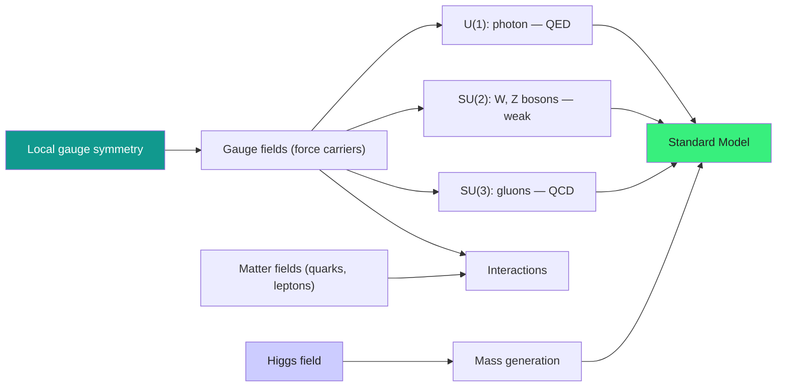

  <h1 style="color: white; margin: 0; font-size: 2rem;">Quantum Field Theory</h1>
  
Quantum mechanics and special relativity combined: particles as excitations of fields.

[Physics](./) &raquo; Quantum Field Theory

Quantum Field Theory (QFT) combines quantum mechanics with special relativity to describe the fundamental forces and particles of nature, treating particles as excited states of quantum fields that permeate spacetime. Where quantum mechanics describes a fixed number of particles, QFT lets particles be *created and destroyed* — exactly what happens when an electron and positron annihilate into light, or when a photon converts into matter. The fundamental object is no longer the particle but the **field**, and particles are its ripples. This hub sets up that core picture, then routes to dedicated pages for the machinery:

- **Fields are fundamental** — a particle is a localized excitation of a field filling all space, like a ripple on a pond.
- **Particle number changes** — creation and annihilation operators let particles appear and disappear, as relativity demands.
- **Symmetry dictates forces** — demanding local gauge symmetry *forces* the existence of the force-carrying bosons.
- **Renormalization tames infinities** — physics depends on the energy scale probed; "running" couplings absorb the divergences.

## Why Fields?

Non-relativistic quantum mechanics describes a fixed number of particles, each with its own wave function. That picture breaks the moment relativity enters. Einstein's $E = mc^2$ means energy can be converted into matter: collide two electrons hard enough and you can produce extra electron–positron pairs; let a high-energy photon pass an atomic nucleus and it can materialize into a particle and its antiparticle. A theory built on a fixed particle count simply cannot describe these processes.

The resolution is to make the **field** primary. Instead of "an electron, located here," QFT posits an electron *field* filling all of spacetime; an electron is a quantized excitation — a ripple — in that field. Because a field has no fixed number of ripples, particle number is free to change. Each species of particle in nature gets its own field:

- **Electron field** → electrons and positrons
- **Electromagnetic field** → photons
- **Quark fields** → quarks and antiquarks
- **Higgs field** → Higgs bosons

Quantizing a field turns each of its momentum modes into a quantum harmonic oscillator; the quanta of those oscillators *are* the particles, created and destroyed by ladder operators. The vacuum is the state with no quanta — yet it is not empty, because those oscillators retain zero-point energy and fluctuate. From this single idea grow the gauge principle (forces from symmetry), the Standard Model, renormalization, and the entire calculational apparatus of modern particle physics. The pages below develop each in turn.

### The Big Picture: From Fields to Forces

## Explore Quantum Field Theory

The subject splits naturally into five focused pages. They are arranged in a sensible reading order below — start with quantization to see *what a quantum field is*, build up to gauge theory and the Standard Model, learn how renormalization keeps the answers finite, pick up the path-integral toolkit, and finish at the modern frontier.

  <a href="qft-quantization.html" class="nav-card">
    <h4><i class="fas fa-wave-square"></i> 1. Canonical Quantization</h4>
    
Promoting classical fields to operators: Klein–Gordon and Dirac fields, ladder operators, the vacuum, and the Feynman propagators that glue diagrams together.

  </a>
  <a href="gauge-and-standard-model.html" class="nav-card">
    <h4><i class="fas fa-shield-alt"></i> 2. Gauge Theories &amp; the Standard Model</h4>
    
How local symmetry forces the existence of forces — QED, QCD, Yang–Mills theory, electroweak unification, the Higgs mechanism, and the full $SU(3)\times SU(2)\times U(1)$ Lagrangian.

  </a>
  <a href="renormalization.html" class="nav-card">
    <h4><i class="fas fa-ruler"></i> 3. Renormalization &amp; the RG</h4>
    
Why loop integrals diverge, how regularization and counterterms extract finite physics, and how the renormalization group makes couplings run with energy scale.

  </a>
  <a href="qft-methods.html" class="nav-card">
    <h4><i class="fas fa-calculator"></i> 4. Path Integrals &amp; Methods</h4>
    
The calculational engine: Feynman's sum over histories, generating functionals, perturbation theory and Feynman diagrams, and effective field theory as a working tool.

  </a>
  <a href="qft-frontiers.html" class="nav-card">
    <h4><i class="fas fa-rocket"></i> 5. Modern Frontiers</h4>
    
Scattering-amplitude methods, AdS/CFT and holography, anomalies and instantons, entanglement in field theory, and the bridges toward quantum gravity.

  </a>

**Suggested reading order:** [Quantization](qft-quantization.html) → [Gauge theory & the Standard Model](gauge-and-standard-model.html) → [Renormalization](renormalization.html) → [Path integrals & methods](qft-methods.html) → [Modern frontiers](qft-frontiers.html). The first two establish what fields are and how forces arise; renormalization and methods supply the tools that make calculations finite and tractable; the frontiers page assumes all of it.

## Key Takeaways

- **Fields, not particles.** The fundamental degrees of freedom are quantum fields; particles are their quantized excitations, created and destroyed by ladder operators.
- **Symmetry generates forces.** Promoting a global symmetry to a local (gauge) one forces the introduction of gauge bosons — the photon, $W/Z$, and gluons.
- **The Standard Model works.** $SU(3)\times SU(2)\times U(1)$ plus the Higgs reproduces every confirmed particle measurement, including the electron $g\!-\!2$ to 12 digits.
- **Renormalization is physics.** Infinities are absorbed into scale-dependent couplings; the renormalization group tells you how physics changes with energy.
- **Two equivalent formulations.** Canonical quantization and the path integral give the same physics; the path integral connects directly to statistical mechanics.
- **The frontier is open.** Dark matter, neutrino masses, the hierarchy problem, and quantum gravity all point beyond the Standard Model.

## See Also

- [Canonical Quantization](qft-quantization.html) — start here: scalar and Dirac fields, the vacuum, and propagators.
- [Gauge Theories & the Standard Model](gauge-and-standard-model.html) — forces from symmetry, QED, QCD, and the Higgs mechanism.
- [Renormalization & the RG](renormalization.html) — taming divergences and the running of couplings.
- [Path Integrals & Methods](qft-methods.html) — the sum over histories and the diagrammatic engine.
- [Modern Frontiers](qft-frontiers.html) — amplitudes, holography, anomalies, and quantum gravity.
- [Quantum Mechanics](quantum-mechanics/) — the non-relativistic foundation that QFT generalizes.
- [Relativity](relativity/) — special relativity is what makes field theories Lorentz-invariant.
- [Statistical Mechanics](statistical-mechanics/) — finite-temperature field theory and the path-integral connection.
- [Condensed Matter Physics](condensed-matter/) — field-theoretic methods in many-body systems.
- [String Theory](string-theory/) — extending point particles to strings for quantum gravity.
- [Physics Hub](index.html) — browse all physics topics.
