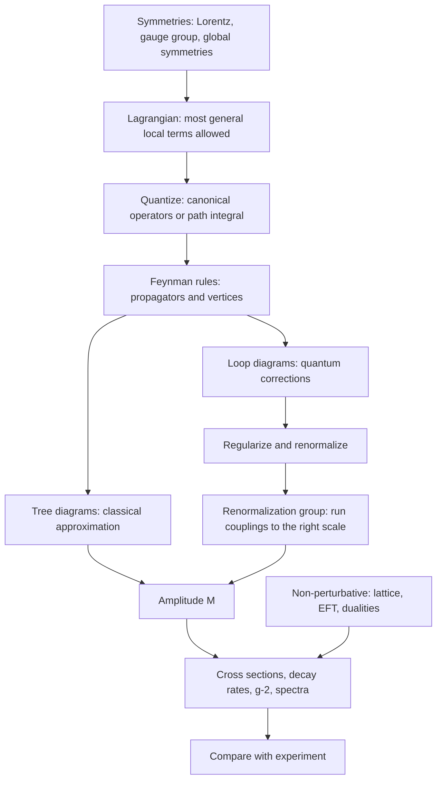
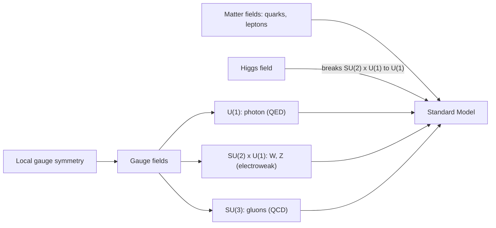

  <h1 style="color: white; margin: 0; font-size: 2rem;">Quantum Field Theory</h1>
  
Quantum mechanics and special relativity combined: particles as excitations of fields.

[Physics](./) &raquo; Quantum Field Theory

**Quantum field theory** (QFT) is the framework that combines quantum mechanics with special relativity. Its basic objects are fields defined throughout spacetime. Particles are the quantized excitations of those fields and can be created and destroyed. QFT is the language of the Standard Model of particle physics, which is the most precisely tested theory in science. It is also used throughout condensed matter physics, statistical mechanics and cosmology. This hub explains why fields are needed, gives an outline of how a QFT calculation proceeds, and links to five pages that develop the subject in detail.

## Why Fields?

Non-relativistic quantum mechanics describes a fixed number of particles with a wavefunction $\psi(\mathbf{x}_1, \ldots, \mathbf{x}_N, t)$. Relativity breaks that description in three ways:

- **Particle number is not conserved.** Because $E = mc^2$, energy can become matter. A high-energy photon near a nucleus can convert into an electron-positron pair, and colliders routinely produce dozens of new particles per collision. A fixed-$N$ Hilbert space cannot describe these processes.
- **Single-particle relativistic wave equations fail.** The Klein-Gordon and Dirac equations, read as wavefunction equations, have negative-energy solutions and, for Klein-Gordon, no positive probability density.
- **Causality requires antiparticles.** A relativistic particle's propagation amplitude is non-zero outside the light cone. Measurements at spacelike separation commute only because a particle going one way cancels an antiparticle going the other.

A quantum field solves all three problems. Each species has a field operator $\phi(x)$ at every spacetime point. Quantizing a free field turns each momentum mode into a harmonic oscillator, and the quanta of those oscillators are the particles. Particle number can therefore change, the negative-frequency modes describe antiparticles, and field operators at spacelike separation commute ([microcausality](qft-quantization.html#microcausality)). Identical-particle statistics follow as well: every electron in the universe is an excitation of the same electron field, which is why electrons are exactly identical. Bose or Fermi statistics is fixed by the spin, through the spin-statistics theorem.

| Field | Spin | Quanta | Role in the Standard Model |
|-------|------|--------|----------------------------|
| Dirac / Weyl fermion fields | 1/2 | quarks, leptons and their antiparticles | matter |
| Gauge fields | 1 | photon, $W^\pm$, $Z$, 8 gluons | forces, via the gauge principle |
| Higgs field | 0 | Higgs boson (125 GeV) | electroweak symmetry breaking, masses |
| (Metric perturbation) | 2 | graviton | gravity as an effective field theory; not part of the Standard Model |

## How a QFT Calculation Works

Almost every quantitative result in particle physics follows the same pipeline. The pages linked below each cover part of it.

The gauge principle has a particular role in this pipeline. Requiring the Lagrangian to be invariant under *local* symmetry transformations requires the existence of force-carrying gauge fields:

**Conventions used on these pages.** Natural units $\hbar = c = 1$. Mostly-minus metric $\mathrm{diag}(+,-,-,-)$, so on-shell momenta satisfy $p^2 = m^2$. Relativistic state normalization $\langle\mathbf{p}|\mathbf{q}\rangle = 2E_p(2\pi)^3\delta^3(\mathbf{p}-\mathbf{q})$. These are the conventions of Peskin & Schroeder and Schwartz.

## Pages in This Section

The pages are listed in a suggested reading order. The first two establish what fields are and where forces come from. The next two provide the tools for finite, tractable calculations. The last page assumes all of the others.

| # | Page | Covers | Builds on |
|---|------|--------|-----------|
| 1 | [Canonical Quantization](qft-quantization.html) | Klein-Gordon, Dirac and Maxwell fields; Fock space; microcausality; spin-statistics; Feynman propagators; the interaction picture | quantum harmonic oscillator, special relativity |
| 2 | [Gauge Theories & the Standard Model](gauge-and-standard-model.html) | the gauge principle; QED; Yang-Mills; QCD; electroweak unification; the Higgs mechanism; the full $SU(3)\times SU(2)\times U(1)$ theory | 1 |
| 3 | [Renormalization & the RG](renormalization.html) | UV divergences; power counting; dimensional regularization; counterterms and schemes; running couplings; the Wilsonian RG; the EFT viewpoint | 1, 4 (Feynman rules) |
| 4 | [Path Integrals & Methods](qft-methods.html) | path integrals; generating functionals; Wick's theorem; LSZ; Feynman rules; a worked cross section; loop techniques; BRST; EFT in practice | 1 |
| 5 | [Modern Frontiers](qft-frontiers.html) | on-shell amplitudes; AdS/CFT; anomalies; entanglement; connections to quantum gravity | all of the above |

Pages 3 and 4 can be read in either order. Readers who want to see a complete calculation before the subtleties of loops can read the methods page first.

## Status of the Theory (2026)

**Tested successes.**

- **Electron magnetic moment.** Measured to 0.13 parts per trillion (2023) and matched by five-loop QED. The comparison is now the most precise determination of the fine-structure constant, $\alpha^{-1} = 137.035\,999\,166(15)$.
- **Muon magnetic moment.** Fermilab's final measurement (2025, 127 ppb) agrees with the 2025 Standard Model prediction, which uses lattice QCD for the hadronic contribution. This removes what had been a long-standing anomaly of about $5\sigma$. See [renormalization: precision status](renormalization.html#precision-status-2026).
- **The strong coupling.** Asymptotic freedom and the running of $\alpha_s$ have been confirmed across energy scales from about 1 GeV to several TeV. The world average is $\alpha_s(M_Z) = 0.1180 \pm 0.0009$ (PDG 2025).
- **The Higgs boson** (discovered 2012). Its couplings to $W$, $Z$ and the third-generation fermions have been measured in agreement with the Standard Model, to about 5-10% in the best-measured channels. There is also evidence for its decay to muons, the first sign of a Higgs coupling to a second-generation fermion.

**Open problems.** Several observations point beyond the Standard Model as a QFT: neutrino masses, dark matter, the baryon asymmetry of the universe, the smallness of the Higgs mass ([hierarchy problem](renormalization.html#open-problems)) and of the cosmological constant, the strong CP problem, and the absence of a UV-complete quantum theory of gravity. On the mathematical side, no interacting four-dimensional QFT has yet been constructed rigorously, and the Yang-Mills mass gap remains a Millennium Prize problem.

## Further Reading

- M. Peskin and D. Schroeder, *An Introduction to Quantum Field Theory* (1995). The standard graduate text, and the source of the conventions used here.
- M. Schwartz, *Quantum Field Theory and the Standard Model* (2014). A modern treatment with strong coverage of EFT and renormalization.
- M. Srednicki, *Quantum Field Theory* (2007). Built around the path integral; uses the mostly-plus metric.
- A. Zee, *Quantum Field Theory in a Nutshell* (2nd ed., 2010). A conceptual first pass.
- S. Weinberg, *The Quantum Theory of Fields*, vols. I-III (1995-2000). Derives QFT from symmetry and the S-matrix.
- D. Tong, *Lectures on Quantum Field Theory* (Cambridge, freely available online). A concise introduction.

## See Also

- [Quantum Mechanics](quantum-mechanics/): the non-relativistic theory that QFT generalizes.
- [Relativity](relativity/): the Lorentz symmetry that constrains every field theory.
- [Statistical Mechanics](statistical-mechanics/): the Euclidean path integral as a partition function; critical phenomena.
- [Condensed Matter Physics](condensed-matter/): field-theoretic methods for many-body systems.
- [Quantum Gravity](relativity/quantum-gravity.html) and [String Theory](string-theory/): approaches to going beyond QFT.
- [Physics Hub](index.html): all physics topics.
