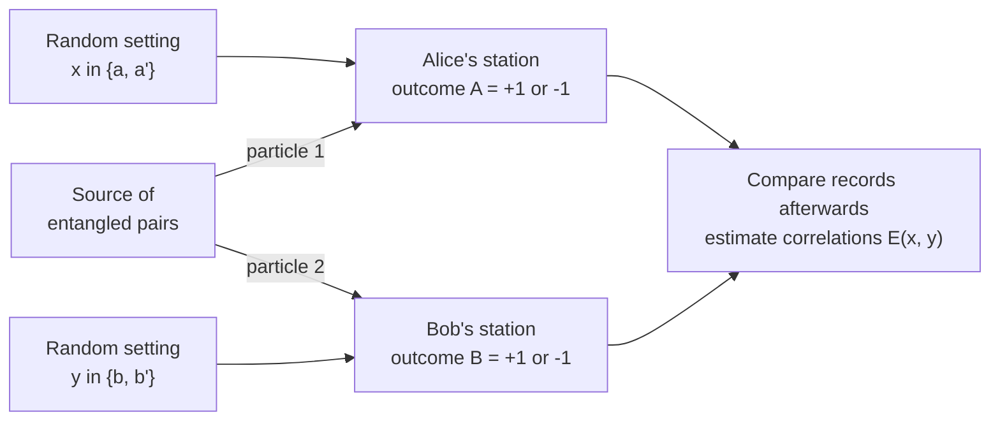
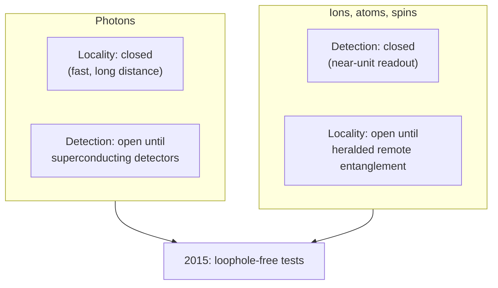

## Bell's Theorem & Experimental Tests

[Quantum Mechanics](./) &raquo; Bell's Theorem &amp; Experimental Tests

**Bell's theorem** states that no theory in which measurement outcomes are determined by local variables can reproduce all the predictions of quantum mechanics. It turned the 1935 Einstein–Podolsky–Rosen (EPR) debate about the completeness of quantum mechanics into a quantitative, testable inequality. This page derives the CHSH form of the inequality, computes the quantum violation and its upper limit (Tsirelson's bound), describes the loopholes that kept the question technically open for decades, summarizes the experiments that closed them from 2015 onward, and covers the device-independent technologies — certified randomness and key distribution — that Bell violations now power.

## The Bell Test Scenario

Every Bell experiment has the same abstract structure. A source emits pairs of systems to two distant stations. At each station an experimenter chooses one of two measurement settings at random and records a binary outcome. The choice and the recording at one station are arranged to be space-like separated from those at the other, so that no signal limited by the speed of light can connect them.



Only the joint statistics $P(A, B \mid x, y)$ are used. Nothing about the internal workings of the source or detectors is assumed, which is why a Bell violation is such a strong and portable conclusion.

## The EPR Argument

In 1935 Einstein, Podolsky, and Rosen argued that quantum mechanics, although correct in its predictions, is *incomplete*. Their argument rests on two premises:

- **Locality.** A measurement on one system cannot instantaneously influence a distant system.
- **The reality criterion.** "If, without in any way disturbing a system, we can predict with certainty the value of a physical quantity, then there exists an element of physical reality corresponding to that quantity."

Bohm's spin version of the argument uses two spin-½ particles in the **singlet state**, sent to Alice and Bob:

$$
|\Psi^-\rangle = \frac{1}{\sqrt{2}}\left(|{\uparrow}\rangle_A|{\downarrow}\rangle_B - |{\downarrow}\rangle_A|{\uparrow}\rangle_B\right).
$$

The singlet is rotationally invariant, so the spins are perfectly anti-correlated along *any* common axis. If Alice measures $z$ and gets up, Bob's $z$-spin is certainly down; had she measured $x$ instead, she could equally have predicted Bob's $x$-spin with certainty. By locality, Alice's choice cannot affect Bob's particle, so by the reality criterion Bob's particle must carry definite values of *both* $S_z$ and $S_x$. Quantum mechanics assigns no such simultaneous values ($[\hat S_x, \hat S_z] \neq 0$), so EPR concluded that the wave function omits "elements of reality" — additional **hidden variables** that fix outcomes in advance.

Bohr rejected the reality criterion as inapplicable to entangled systems, but for nearly thirty years the dispute remained philosophical: it was widely assumed that a local hidden-variable theory could reproduce every quantum prediction. Bell showed in 1964 that it cannot.

## Local Hidden Variables

Suppose each pair carries a hidden variable $\lambda$ — an arbitrary list of instructions — drawn from a distribution $\rho(\lambda)$ with $\int\rho(\lambda)\,d\lambda = 1$. A **local hidden-variable (LHV)** model makes three assumptions:

| Assumption | Formal statement | Loophole if it fails |
|------------|------------------|----------------------|
| **Realism** (outcome determinism) | Outcomes are functions $A(x,\lambda) = \pm 1$, $B(y,\lambda) = \pm 1$ | — (dropping it alone does not help; see below) |
| **Locality** | $A$ does not depend on Bob's setting $y$; $B$ does not depend on Alice's setting $x$ | Locality loophole |
| **Measurement independence** ("free choice") | $\rho(\lambda \mid x, y) = \rho(\lambda)$ | Freedom-of-choice loophole |

The predicted correlation is then an average over the hidden variable:

$$
E(x, y) = \int \rho(\lambda)\, A(x, \lambda)\, B(y, \lambda)\, d\lambda.
$$

Determinism is less essential than it looks. Bell's more general **local causality** condition allows stochastic outcomes, requiring only that the joint probabilities factorize once $\lambda$ is given:

$$
P(A, B \mid x, y, \lambda) = P(A \mid x, \lambda)\; P(B \mid y, \lambda).
$$

Any such stochastic model can be rewritten as a deterministic one with a larger $\lambda$, so the inequality below holds for it too. Bell's theorem therefore rules out *local causality*, not merely determinism.

## The CHSH Inequality

Bell's original 1964 inequality assumed perfect anti-correlation, which no real experiment achieves. The **CHSH inequality** (Clauser, Horne, Shimony, Holt, 1969) tolerates imperfections and is the form used by almost all modern tests. Alice chooses between settings $a$ and $a'$, Bob between $b$ and $b'$, and each outcome is $\pm 1$. Define

$$
S = E(a, b) - E(a, b') + E(a', b) + E(a', b').
$$

### Derivation

For a single value of $\lambda$ write $A = A(a,\lambda)$, $A' = A(a',\lambda)$, $B = B(b,\lambda)$, $B' = B(b',\lambda)$, all $\pm 1$. Then

$$
AB - AB' + A'B + A'B' = A\,(B - B') + A'\,(B + B').
$$

Since $B, B' = \pm 1$, one of $(B - B')$ and $(B + B')$ is zero and the other is $\pm 2$, so the expression equals $\pm 2$ for every $\lambda$. Averaging a quantity confined to $[-2, 2]$ with a non-negative weight $\rho(\lambda)$ keeps it in $[-2, 2]$, which gives the **CHSH inequality**:

$$
|S| = \left| E(a, b) - E(a, b') + E(a', b) + E(a', b') \right| \le 2.
$$

The derivation uses no quantum mechanics. Its only inputs are the three assumptions in the table above: definite $\pm 1$ outcomes for all four settings (realism), the same $A$ regardless of Bob's setting and vice versa (locality), and one $\rho(\lambda)$ for all setting pairs (measurement independence). A measured violation refutes that conjunction.

## The Quantum Prediction and Tsirelson's Bound

For the singlet state, measuring spin along unit vectors $\mathbf a$ and $\mathbf b$ with the $\pm 1$-valued observables $\boldsymbol\sigma\cdot\mathbf a$ and $\boldsymbol\sigma\cdot\mathbf b$ gives

$$
E_{\text{QM}}(\mathbf a, \mathbf b) = \langle\Psi^-|\,(\boldsymbol\sigma\cdot\mathbf a)\otimes(\boldsymbol\sigma\cdot\mathbf b)\,|\Psi^-\rangle = -\,\mathbf a\cdot\mathbf b = -\cos\theta_{ab}.
$$

This is where the classical and quantum pictures part company. Simple LHV models (for example, each pair carrying a shared random axis) can reproduce perfect anti-correlation at $\theta = 0$, but their correlation falls off linearly with angle, whereas quantum mechanics predicts a cosine that stays stronger at intermediate angles. The CHSH combination is designed to expose that difference.

### Optimal settings

Take coplanar directions $a = 0^\circ$, $b = 45^\circ$, $a' = 90^\circ$, $b' = 135^\circ$. Three pairs are $45^\circ$ apart and one pair ($a$, $b'$) is $135^\circ$ apart, so

$$
E(a,b) = E(a',b) = E(a',b') = -\frac{1}{\sqrt 2}, \qquad E(a,b') = +\frac{1}{\sqrt 2},
$$

$$
S_{\text{QM}} = -\frac{1}{\sqrt 2} - \frac{1}{\sqrt 2} - \frac{1}{\sqrt 2} - \frac{1}{\sqrt 2} = -2\sqrt 2, \qquad |S_{\text{QM}}| = 2\sqrt 2 \approx 2.828.
$$

```python
import numpy as np

def E(theta_a, theta_b):
    """Singlet-state correlation for spin measurements at the given angles (degrees)."""
    return -np.cos(np.radians(theta_a - theta_b))

a, a_prime, b, b_prime = 0.0, 90.0, 45.0, 135.0
S = E(a, b) - E(a, b_prime) + E(a_prime, b) + E(a_prime, b_prime)

print(f"LHV bound:        |S| <= 2")
print(f"Quantum value:     S  = {S:.4f}")            # -2.8284
print(f"Tsirelson bound:  |S| <= {2 * np.sqrt(2):.4f}")
```

### Tsirelson's bound

Quantum mechanics cannot exceed $\lvert S\rvert = 2\sqrt 2$ (Tsirelson, 1980), so the settings above are optimal. Write the CHSH operator as $\hat S = \hat A(\hat B - \hat B') + \hat A'(\hat B + \hat B')$, where $\hat A, \hat A'$ act on Alice's system, $\hat B, \hat B'$ on Bob's, and each is Hermitian with square equal to the identity. Expanding and using $\hat A^2 = \hat B^2 = \hat 1$:

$$
\hat S^2 = 4\,\hat 1 + [\hat A, \hat A']\otimes[\hat B, \hat B'].
$$

Each commutator has operator norm at most $2$, so $\lVert\hat S^2\rVert \le 8$ and $\lVert\hat S\rVert \le 2\sqrt 2$. Equality requires anticommuting observables on each side, as with the orthogonal spin directions used above.

### Beyond quantum: the no-signaling bound

Algebraically $\lvert S\rvert$ could reach $4$, and hypothetical **Popescu–Rohrlich (PR) boxes** do so without permitting faster-than-light signaling. Nature appears to stop at Tsirelson's bound. Why physical correlations are limited to $2\sqrt 2$ is an open question in quantum foundations; proposed principles such as *information causality* and *macroscopic locality* recover the bound, at least for this scenario.

| Class of correlations | Maximum $\lvert S\rvert$ |
|-----------------------|--------------------------|
| Local hidden variables | $2$ |
| Quantum mechanics (Tsirelson) | $2\sqrt 2 \approx 2.83$ |
| General no-signaling (PR box) | $4$ |

## Bell's Theorem

> No physical theory satisfying local causality and measurement independence can reproduce all the predictions of quantum mechanics.

It is a no-go theorem: it says the assumptions cannot all hold, not which one fails. Experiments (below) side with quantum mechanics, so at least one assumption is false in nature. The main options:

- **Give up locality** while keeping definite outcomes, as in de Broglie–Bohm mechanics, which is explicitly nonlocal (but still cannot be used to signal).
- **Give up the idea of a single outcome or of observer-independent facts**, as in many-worlds, QBism, or relational quantum mechanics.
- **Give up measurement independence** — superdeterminism, in which the hidden variables and the experimenters' choices are correlated from the start. It evades the theorem but is widely regarded as undermining the basis of empirical science.

The common summary "local realism is false" compresses these options; strictly, what is ruled out is the conjunction of assumptions in the derivation.

## Loopholes

A loophole is an auxiliary assumption that, if false, would let an LHV model mimic a violation in a real (imperfect) experiment.

### Locality loophole

If a light-speed signal could carry Alice's setting to Bob's station before his outcome is fixed, an LHV model could make $B$ depend on $x$. **Closing it** requires each station's setting choice and outcome recording to be space-like separated from the other station's, with settings chosen by a fast random process after the particles leave the source.

### Detection (fair-sampling) loophole

Real detectors miss particles. If the unregistered events are simply discarded, an LHV model can let each particle "decide" whether to be detected depending on the local setting, biasing the surviving sample into an apparent violation. **Closing it** requires counting every trial and a sufficiently high overall efficiency $\eta$:

| Scenario | Required detection efficiency |
|----------|-------------------------------|
| CHSH with a maximally entangled state | $\eta > 2(\sqrt 2 - 1) \approx 82.8\%$ |
| Non-maximally entangled states with the CH/Eberhard inequality | $\eta > 2/3 \approx 66.7\%$ (in the limit of vanishing entanglement and no background) |

### Freedom-of-choice loophole

If the hidden variable could influence, or share a common cause with, the setting choices, measurement independence fails. It can be pushed back, though never closed completely, by generating settings from processes space-like separated from the source, from human choices, or from light emitted by distant astronomical sources long ago.

### Other assumptions

- **Memory loophole.** Trials in a long run are not independent. Modern analyses use martingale-based statistics that give valid $p$-values without assuming independent, identically distributed trials.
- **Coincidence-time loophole.** Using a sliding time window to pair detections can be exploited by LHV models; fixed, pre-defined time slots avoid it.

### Why closing both main loopholes was hard

The locality and detection loopholes pull in opposite directions. **Photons** travel far and fast, making locality easy, but are lost in transmission and detectors, making detection hard. **Trapped ions, atoms and solid-state spins** can be measured with near-unit efficiency but are hard to entangle across the distances needed for space-like separation. Until 2015 each platform closed one loophole while leaving the other open.



## Experimental History

### Early tests (1972–1998)

| Year | Group | Platform | Result | Advance |
|------|-------|----------|--------|---------|
| 1972 | Freedman & Clauser (Berkeley) | Photons from a calcium atomic cascade | Violation by about 6 standard deviations | First experimental test; static polarizers |
| 1982 | Aspect, Grangier & Roger (Orsay) | Cascade photons, two-channel polarizers | $S = 2.697 \pm 0.015$, about 40 standard deviations | Direct CHSH measurement close to the quantum prediction |
| 1982 | Aspect, Dalibard & Roger (Orsay) | Cascade photons, switched analyzers | Violation by about 5 standard deviations | Settings changed during flight (quasi-periodically) |
| 1998 | Weihs, Zeilinger et al. (Innsbruck) | Polarization-entangled photons, stations about 400 m apart | $S \approx 2.73$, about 30 standard deviations | Independent fast random setting choices; strict Einstein locality |

Aspect's switched-analyzer experiment changed each photon's analyzer faster than light could cross between the stations, but the switching was periodic rather than random. Weihs et al. used physical random number generators at each station, closing the locality loophole for photons; the detection loophole remained open because only a few percent of pairs were registered.

### Loophole-free experiments (2015 onward)

| Year | Group | Platform and separation | Result | Notes |
|------|-------|-------------------------|--------|-------|
| 2015 | Hensen et al. (Delft) | NV-center electron spins in diamond, 1.3 km | $S = 2.42 \pm 0.20$, $p \approx 0.039$ | Event-ready (heralded) entanglement; 245 trials |
| 2015 | Giustina et al. (Vienna) | Polarization-entangled photons | $p \le 3.74 \times 10^{-31}$ (11.5 standard deviations) | Superconducting detectors; Eberhard inequality |
| 2015 | Shalm et al. (NIST Boulder) | Polarization-entangled photons | $p \approx 2.3 \times 10^{-7}$ (conservative) | Superconducting detectors; Eberhard inequality |
| 2017 | Rosenfeld et al. (Munich) | Trapped rubidium atoms, 398 m | $S = 2.221 \pm 0.033$, $p < 2.57 \times 10^{-9}$ | Heralded atom–atom entanglement |
| 2023 | Storz et al. (ETH Zurich) | Superconducting qubits, about 30 m cryogenic link | $S \approx 2.07$, over one million trials | First loophole-free test with superconducting circuits |

The **Delft** experiment solved the distance problem with *entanglement swapping*: each electron spin was entangled with an emitted photon, the photons were brought together at a midpoint, and a successful joint measurement there heralded spin–spin entanglement before the settings were chosen. The spin readout was fast and essentially deterministic, closing the detection loophole; the 1.3 km separation closed the locality loophole. The price was a very low event rate. The **Vienna** and **NIST** photonic experiments instead used superconducting single-photon detectors with efficiencies above the Eberhard threshold, combined with fast random setting choices, giving far higher event rates and statistical significance. The **ETH Zurich** experiment showed the same can be done with superconducting circuits, a platform relevant to distributed quantum computing, by cooling a 30 m waveguide link to millikelvin temperatures.

### Freedom-of-choice tests

- **The BIG Bell Test** (performed November 2016, published 2018) had roughly 100,000 volunteers worldwide generate setting bits through an online game, which drove Bell tests at laboratories on several continents using photons, atoms and superconducting circuits.
- **Cosmic Bell tests** chose settings from the color of astronomical photons. Handsteiner et al. (2017) used Milky Way stars, pushing any setting-correlating mechanism back about 600 years; Rauch et al. (2018) used two high-redshift quasars, pushing it back at least 7.8 billion years, with a violation of 9.3 standard deviations.

### Recognition

The 2022 Nobel Prize in Physics was awarded to Alain Aspect, John Clauser, and Anton Zeilinger "for experiments with entangled photons, establishing the violation of Bell inequalities and pioneering quantum information science."

## Implications

### No-signaling

A Bell violation does not allow faster-than-light communication. For any quantum state and any local measurements, each party's marginal outcome distribution is independent of the other party's setting:

$$
\sum_{A} P(A, B \mid x, y) = \sum_{A} P(A, B \mid x', y) \quad \text{for all } B, y, x, x'.
$$

Bob sees the same local statistics whatever Alice does; the correlations appear only when the two records are compared over an ordinary classical channel. Quantum nonlocality is a property of correlations, not of signals, and is compatible with relativistic causality. (See the no-communication discussion on the [Quantum Computing](qm-computing.html#entanglement-as-a-resource) page.)

### Device-independent protocols

Because a CHSH value above $2$ cannot be produced by any local classical mechanism, it certifies properties of devices treated as black boxes, characterized only by their inputs and outputs. This is **device-independent (DI)** quantum information:

- **Certified randomness.** A violation bounds how predictable the outcomes can be to anyone, including the device manufacturer. NIST demonstrated certified randomness from a loophole-free Bell test in 2018, and the Colorado University Randomness Beacon (CURBy), run by NIST and the University of Colorado Boulder and described in *Nature* in June 2025, publishes Bell-certified random numbers as a public service; in its first 40 days it delivered output in 7,434 of 7,454 attempts.
- **Device-independent quantum key distribution (DIQKD).** The size of the violation bounds an eavesdropper's information, so security does not depend on trusting the hardware. The first experimental demonstrations were reported in 2022 with trapped ions and with trapped atoms; distances and key rates remain far below those of conventional QKD.
- **Self-testing.** Observing $\lvert S\rvert = 2\sqrt 2$ exactly certifies, up to local isometries, that the devices share a maximally entangled pair and measure anticommuting observables. Robust versions tolerate small deviations and are used to benchmark quantum hardware.

The same inequality that excludes local causality thus serves as a measurable witness of genuine entanglement, with guarantees that hold even against untrusted equipment.

## See Also

- [Systems & Phenomena](systems-and-phenomena.html) — entanglement, the singlet state, and a shorter summary of Bell tests.
- [States, Operators & Dynamics](formalism.html) — spin operators, Pauli matrices, addition of angular momenta, and the measurement postulate behind $E(\mathbf a,\mathbf b)$.
- [Quantum Computing](qm-computing.html) — the Bell states, the no-communication theorem, and entanglement as a computational resource.
- [Advanced Formalism](qm-advanced-formalism.html) — density matrices and reduced states used in quantum-information arguments.
- [Research Frontiers](qm-research-frontiers.html) — foundations, interpretations, and measurement-induced phenomena.
- [Quantum Mechanics Hub](./) — the postulates and core formalism these arguments rest on.
