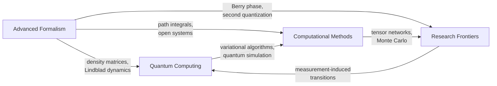

[Quantum Mechanics](./) &raquo; Computing &amp; Advanced Topics

## Computing & Advanced Topics

This sub-hub collects the graduate-level and applied material that builds on the core formalism of [States, Operators & Dynamics](formalism.html) and the solvable models of [Systems & Phenomena](systems-and-phenomena.html). The four pages below are self-contained references rather than a linear sequence: quantum information and hardware, the extended mathematical formalism, numerical methods for many-body problems, and current research topics.

## Pages

| Page | Scope | Key topics |
|------|-------|------------|
| [Quantum Computing](qm-computing.html) | Quantum information as a computational resource | Qubits and the Bloch sphere, gates and universality, entanglement, Shor, Grover, VQE, QAOA, decoherence, error correction, NISQ and fault tolerance |
| [Advanced Formalism](qm-advanced-formalism.html) | The mathematics beyond the undergraduate postulates | Rigged Hilbert spaces and the spectral theorem, density matrices and entropy, path integrals, coherent and squeezed states, Lindblad equation and quantum channels, Klein–Gordon and Dirac equations |
| [Computational Methods](qm-computational-methods.html) | Solving quantum problems numerically | Exact diagonalization and Lanczos, matrix product states and DMRG, variational and diffusion Monte Carlo, the sign problem, split-operator and Krylov propagation, Floquet theory, QuTiP |
| [Research Frontiers](qm-research-frontiers.html) | Active areas of research | Second quantization and many-body entanglement, Berry phases, topological matter, measurement-induced phase transitions, quantum thermodynamics, foundations |

## How the Pages Connect

The same few ideas recur across all four pages. Density matrices and open-system dynamics, developed in Advanced Formalism, are the language of noise in quantum computers and of the numerical methods for dissipative systems. Entanglement is simultaneously a computational resource, the quantity that determines whether a tensor-network simulation is tractable, and an organizing principle for many-body phases.

## Where to Start

| If you want to... | Start with | Then read |
|-------------------|------------|-----------|
| Understand how quantum computers work | [Quantum Computing](qm-computing.html) | Density matrices and channels in [Advanced Formalism](qm-advanced-formalism.html#density-matrices-and-mixed-states) |
| Handle mixed states, noise, and open systems | [Advanced Formalism](qm-advanced-formalism.html#density-matrices-and-mixed-states) | [Lindblad dynamics](qm-advanced-formalism.html#open-quantum-systems-and-the-lindblad-equation), then [Computational Methods](qm-computational-methods.html#open-systems-and-lindblad-dynamics) |
| Simulate a many-body Hamiltonian | [Computational Methods](qm-computational-methods.html#choosing-a-method) | [Tensor networks](qm-research-frontiers.html#tensor-networks) in Research Frontiers |
| Connect to relativistic physics and QFT | [Relativistic quantum mechanics](qm-advanced-formalism.html#relativistic-quantum-mechanics) | [Quantum Field Theory](../quantum-field-theory.html) |
| Explore foundations and interpretations | [Bell's Theorem & Experimental Tests](bell-inequalities-and-tests.html) | [Research Frontiers](qm-research-frontiers.html#foundations-and-open-questions) |

## Recent Milestones

Selected developments since 2024 that the pages above build on:

- **Error correction below threshold (2024).** Google's Willow processor ran a distance-7 surface-code memory on 101 qubits with a logical error of about 0.143% per cycle, with the error suppressed by a factor of about 2.14 each time the code distance increased by two, and a logical qubit outliving the best physical qubit by a factor of about 2.4 (Google Quantum AI, reported in *Nature* in December 2024). This was the first clear experimental demonstration that adding qubits to a surface code reduces the logical error rate.
- **Macroscopic quantum effects recognized (2025).** The 2025 Nobel Prize in Physics went to John Clarke, Michel Devoret, and John Martinis for macroscopic quantum tunnelling and energy quantisation in superconducting circuits — the physics underlying superconducting qubits.
- **Certified randomness in service (2025).** A public randomness beacon run by NIST and the University of Colorado now publishes random numbers certified by loophole-free Bell tests (see [Bell's Theorem](bell-inequalities-and-tests.html#device-independent-protocols)).

---

## Continue Reading

- **Previous:** [Systems &amp; Phenomena](systems-and-phenomena.html) — the solvable systems and quantum effects these methods analyze.
- **Up:** [Quantum Mechanics Hub](./)

## See Also

- [Quantum Computing (technology section)](../../quantum-computing/) — algorithms and hardware treated as a computing discipline.
- [Quantum Field Theory](../quantum-field-theory.html) — second quantization and relativistic wave equations developed fully.
- [Statistical Mechanics](../statistical-mechanics/) — density matrices, partition functions, and quantum statistics.
- [Condensed Matter Physics](../condensed-matter/) — the many-body and topological systems these methods are applied to.
