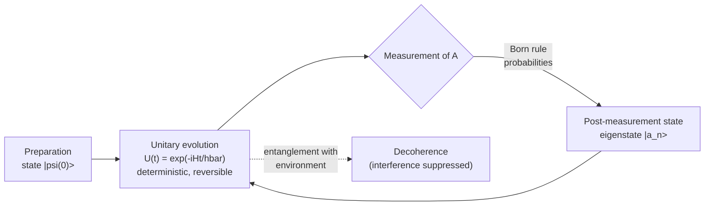
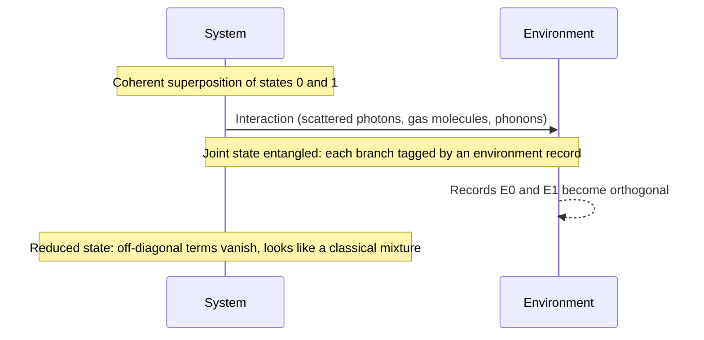

## States, Operators & Dynamics

[Quantum Mechanics](./) &raquo; States, Operators &amp; Dynamics

This page sets out the standard formalism of non-relativistic quantum mechanics: how states are represented, how observables and measurement work, how states evolve in time, the algebra of angular momentum, the main approximation methods, and how decoherence and the measurement problem fit on top of that machinery. The postulates themselves are summarized on the [hub page](./#the-postulates-of-quantum-mechanics); the solvable systems (box, oscillator, hydrogen) are on [Systems & Phenomena](systems-and-phenomena.html); mixed states, path integrals and open-system dynamics are developed in [Advanced Formalism](qm-advanced-formalism.html).

Two different rules change a quantum state, and most of the page is about one or the other:

## Hilbert Space and Dirac Notation

The state of a closed quantum system is a unit vector (more precisely, a ray: vectors differing by a global phase are the same state) in a complex Hilbert space $\mathcal{H}$. Dirac notation writes vectors as **kets** $\lvert\psi\rangle$ and linear functionals on them as **bras** $\langle\phi\rvert$.

| Object | Notation | Meaning |
|--------|----------|---------|
| Ket | $\lvert\psi\rangle$ | State vector |
| Bra | $\langle\psi\rvert = (\lvert\psi\rangle)^\dagger$ | Dual (conjugate-transpose) vector |
| Inner product | $\langle\phi\vert\psi\rangle$ | Probability amplitude; $\langle\phi\vert\psi\rangle = \langle\psi\vert\phi\rangle^*$ |
| Outer product | $\lvert\phi\rangle\langle\psi\rvert$ | Operator mapping $\lvert\psi\rangle \mapsto \lvert\phi\rangle$ |
| Projector | $\hat P_n = \lvert n\rangle\langle n\rvert$ | Projects onto basis state $\lvert n\rangle$ |
| Expectation value | $\langle\psi\rvert\hat A\lvert\psi\rangle$ | Mean of many measurements of $\hat A$ |

An orthonormal basis $\{\lvert n\rangle\}$ satisfies $\langle m\vert n\rangle = \delta_{mn}$ and the **completeness relation**

$$\sum_n |n\rangle\langle n| = \hat{1}, \qquad |\psi\rangle = \sum_n c_n |n\rangle, \quad c_n = \langle n|\psi\rangle, \quad \sum_n |c_n|^2 = 1.$$

For continuous observables the sum becomes an integral and the Kronecker delta a Dirac delta. The familiar wave function is simply the component of the state in the position basis, and the momentum-space wave function is its Fourier transform:

$$\psi(x) = \langle x|\psi\rangle, \qquad \langle x|p\rangle = \frac{1}{\sqrt{2\pi\hbar}}\,e^{ipx/\hbar}, \qquad \tilde\psi(p) = \frac{1}{\sqrt{2\pi\hbar}}\int e^{-ipx/\hbar}\,\psi(x)\,dx.$$

States like $\lvert x\rangle$ and $\lvert p\rangle$ are not normalizable and are not strictly elements of $\mathcal{H}$; the rigged-Hilbert-space construction that makes them rigorous is covered in [Advanced Formalism](qm-advanced-formalism.html#rigged-hilbert-spaces).

## Observables and Operators

### Hermitian operators and the spectral theorem

Every measurable quantity is represented by a self-adjoint (Hermitian) operator $\hat A = \hat A^\dagger$. Hermiticity guarantees real eigenvalues and orthogonal eigenvectors for distinct eigenvalues, and the spectral theorem lets the operator be written in terms of its eigenvalues $a_n$ and eigenprojectors:

$$\hat A\,|a_n\rangle = a_n|a_n\rangle, \qquad \hat A = \sum_n a_n\,|a_n\rangle\langle a_n|.$$

| Observable | Operator (position representation) | Notes |
|------------|------------------------------------|-------|
| Position | $\hat x = x$ | Multiplication operator |
| Momentum | $\hat p = -i\hbar\,\partial_x$ | Generator of translations |
| Kinetic energy | $\hat T = \hat p^2/2m = -\frac{\hbar^2}{2m}\nabla^2$ | |
| Hamiltonian | $\hat H = \hat p^2/2m + V(\hat x)$ | Generator of time evolution |
| Orbital angular momentum | $\hat{\mathbf L} = \hat{\mathbf r}\times\hat{\mathbf p}$ | Generator of rotations |
| Parity | $\hat\Pi\,\psi(x) = \psi(-x)$ | Eigenvalues $\pm 1$ |

### Commutators and compatibility

The commutator $[\hat A, \hat B] = \hat A\hat B - \hat B\hat A$ decides whether two observables can have simultaneous definite values. Commuting Hermitian operators share a complete eigenbasis (they are **compatible**); non-commuting ones do not. The defining relation of quantum kinematics is the **canonical commutation relation**

$$[\hat x_i, \hat p_j] = i\hbar\,\delta_{ij}, \qquad [\hat x_i, \hat x_j] = [\hat p_i, \hat p_j] = 0.$$

Useful identities: $[\hat A, \hat B\hat C] = [\hat A,\hat B]\hat C + \hat B[\hat A,\hat C]$, and $[\hat x, f(\hat p)] = i\hbar\,f'(\hat p)$, $[\hat p, g(\hat x)] = -i\hbar\,g'(\hat x)$.

### The uncertainty relation

For any two observables and any state, the standard deviations $\sigma_A = \sqrt{\langle\hat A^2\rangle - \langle\hat A\rangle^2}$ obey the **Robertson uncertainty relation**

$$\sigma_A\,\sigma_B \geq \frac{1}{2}\left|\langle[\hat A,\hat B]\rangle\right|.$$

With $[\hat x,\hat p] = i\hbar$ this gives Heisenberg's $\sigma_x\sigma_p \ge \hbar/2$, saturated only by Gaussian wave packets. The relation is a statement about the spread of outcomes over an ensemble of identically prepared systems; it is not primarily about disturbance by a measuring device (error–disturbance relations are a separate, later development due to Ozawa and others).

Time is a parameter, not an operator, so the **energy–time** relation has a different status. In the Mandelstam–Tamm form, if $\tau_A = \sigma_A / \lvert d\langle\hat A\rangle/dt\rvert$ is the time for $\langle\hat A\rangle$ to change by one standard deviation, then $\sigma_E\,\tau_A \ge \hbar/2$. It bounds how fast a state with energy spread $\sigma_E$ can evolve, and it underlies the relation between the lifetime of an unstable state and its natural linewidth.

## Measurement

For an observable $\hat A = \sum_n a_n \hat P_n$, with $\hat P_n$ the projector onto the eigenspace of $a_n$:

| Rule | Statement |
|------|-----------|
| Outcomes | Only eigenvalues $a_n$ can be observed |
| Born rule | $P(a_n) = \langle\psi\rvert\hat P_n\lvert\psi\rangle$, which is $\lvert\langle a_n\vert\psi\rangle\rvert^2$ for a non-degenerate eigenvalue |
| State update | $\lvert\psi\rangle \to \hat P_n\lvert\psi\rangle / \sqrt{P(a_n)}$ (projection, "collapse") |
| Mean value | $\langle\hat A\rangle = \sum_n a_n P(a_n) = \langle\psi\rvert\hat A\lvert\psi\rangle$ |
| Repeatability | An immediate second measurement of $\hat A$ returns $a_n$ with certainty |

This is the textbook **projective** (von Neumann) measurement. The general description of real measurements, including inefficient detectors and weak or unsharp measurements, uses **positive operator-valued measures** (POVMs): a set of positive operators $\hat E_k$ with $\sum_k \hat E_k = \hat 1$ and $P(k) = \langle\psi\rvert\hat E_k\lvert\psi\rangle$. Every POVM can be realized as a projective measurement on a larger system (Naimark's theorem), so nothing new is postulated.

## The Schrödinger Equation

<a href="https://www.fisica.net/mecanica-quantica/Schrodinger_1926.pdf"> Paper: <b><i>An Undulatory Theory of the Mechanics of Atoms and Molecules</i></b> - Erwin Schrödinger</a>

### Time-dependent equation

Between measurements, the state of a closed system evolves according to

$$i\hbar\,\frac{\partial}{\partial t}|\psi(t)\rangle = \hat H\,|\psi(t)\rangle, \qquad \text{for one particle:} \quad i\hbar\,\frac{\partial\psi}{\partial t} = -\frac{\hbar^2}{2m}\nabla^2\psi + V(\mathbf r, t)\,\psi.$$

The equation is linear (superpositions of solutions are solutions) and first order in time, so the state at $t=0$ determines it at all later times. It plays the role that Hamilton's equations play in classical mechanics.

### Stationary states

If $\hat H$ does not depend on time, separation of variables gives the **time-independent Schrödinger equation**, an eigenvalue problem for the energy:

$$\hat H\,|E_n\rangle = E_n|E_n\rangle, \qquad -\frac{\hbar^2}{2m}\frac{d^2\psi_n}{dx^2} + V(x)\,\psi_n = E_n\psi_n.$$

Each energy eigenstate evolves only by a phase, so all its measurable properties are constant in time — hence "stationary." A general state is a superposition, and its dynamics come entirely from the relative phases between components:

$$|\psi(t)\rangle = \sum_n c_n\, e^{-iE_n t/\hbar}\,|E_n\rangle, \qquad c_n = \langle E_n|\psi(0)\rangle.$$

Expectation values of such a superposition oscillate at the **Bohr frequencies** $\omega_{mn} = (E_m - E_n)/\hbar$ — the frequencies of the spectral lines the system emits or absorbs.

### Probability current

Probability is locally conserved. With $\rho = \lvert\psi\rvert^2$, the Schrödinger equation implies a continuity equation

$$\frac{\partial\rho}{\partial t} + \nabla\cdot\mathbf j = 0, \qquad \mathbf j = \frac{\hbar}{m}\,\mathrm{Im}\left(\psi^*\nabla\psi\right).$$

The current $\mathbf j$ is what one uses to define reflection and transmission coefficients in scattering and tunneling problems.

## Time Evolution and Pictures

### The evolution operator

The solution of the Schrödinger equation is a unitary operator acting on the initial state, $\lvert\psi(t)\rangle = \hat U(t,t_0)\lvert\psi(t_0)\rangle$. For a time-independent Hamiltonian it is a simple exponential; when $\hat H(t)$ does not commute with itself at different times, the exponential must be time-ordered (the Dyson series):

$$\hat U(t) = e^{-i\hat H t/\hbar} \quad (\hat H \text{ constant}), \qquad \hat U(t,t_0) = \mathcal{T}\exp\left(-\frac{i}{\hbar}\int_{t_0}^{t}\hat H(t')\,dt'\right) \quad (\text{general}).$$

Unitarity ($\hat U^\dagger\hat U = \hat 1$) preserves norms and inner products, so probabilities always sum to one and evolution is reversible.

### Schrödinger, Heisenberg and interaction pictures

Only matrix elements $\langle\phi\rvert\hat A\lvert\psi\rangle$ are measurable, so the time dependence can be placed in the states, in the operators, or split between them:

| Picture | States | Operators | Typical use |
|---------|--------|-----------|-------------|
| Schrödinger | $\lvert\psi_S(t)\rangle = \hat U(t)\lvert\psi(0)\rangle$ | Fixed, $\hat A_S$ | Wave mechanics, numerics |
| Heisenberg | Fixed, $\lvert\psi(0)\rangle$ | $\hat A_H(t) = \hat U^\dagger(t)\,\hat A_S\,\hat U(t)$ | Operator dynamics, correlation functions, QFT |
| Interaction (Dirac) | Evolve under $\hat V_I(t)$ only | Evolve under $\hat H_0$ | Perturbation theory, scattering |

In the Heisenberg picture the operators obey the **Heisenberg equation of motion**, the quantum analogue of Hamilton's equations with Poisson brackets replaced by commutators ($\{A,B\} \to [\hat A,\hat B]/i\hbar$):

$$\frac{d\hat A_H}{dt} = \frac{i}{\hbar}\,[\hat H, \hat A_H] + \left(\frac{\partial\hat A}{\partial t}\right)_H.$$

In the interaction picture with $\hat H = \hat H_0 + \hat V(t)$, states are defined by $\lvert\psi_I(t)\rangle = e^{i\hat H_0 t/\hbar}\lvert\psi_S(t)\rangle$ and obey $i\hbar\,\partial_t\lvert\psi_I\rangle = \hat V_I(t)\lvert\psi_I\rangle$ with $\hat V_I(t) = e^{i\hat H_0 t/\hbar}\,\hat V(t)\,e^{-i\hat H_0 t/\hbar}$, which isolates the effect of the perturbation.

### Ehrenfest's theorem and the classical limit

Taking expectation values of the Heisenberg equations for $\hat x$ and $\hat p$ gives

$$\frac{d\langle\hat x\rangle}{dt} = \frac{\langle\hat p\rangle}{m}, \qquad \frac{d\langle\hat p\rangle}{dt} = -\left\langle V'(\hat x)\right\rangle.$$

These reproduce Newton's law for the centroid only when $\langle V'(\hat x)\rangle \approx V'(\langle\hat x\rangle)$, i.e. when the wave packet is narrow compared with the scale on which the force varies. That is exact for free particles, uniform fields and harmonic potentials, and approximate otherwise; wave-packet spreading and decoherence together explain why macroscopic bodies look classical.

## Symmetries and Conservation Laws

A symmetry is a unitary (or, for time reversal, antiunitary) transformation that commutes with the Hamiltonian. If a Hermitian operator $\hat G$ generates the symmetry through $\hat U(\alpha) = e^{-i\alpha\hat G/\hbar}$ and $[\hat G,\hat H] = 0$, the Heisenberg equation gives $d\langle\hat G\rangle/dt = 0$ — the quantum form of Noether's theorem. Commuting symmetries also label energy eigenstates with good quantum numbers and produce degeneracies.

| Symmetry | Generator | Conserved quantity |
|----------|-----------|--------------------|
| Time translation | $\hat H$ | Energy |
| Spatial translation | $\hat{\mathbf p}$ | Linear momentum |
| Rotation | $\hat{\mathbf J} = \hat{\mathbf L} + \hat{\mathbf S}$ | Angular momentum |
| Spatial inversion | $\hat\Pi$ (discrete) | Parity |
| Permutation of identical particles | Exchange operator (discrete) | Bosonic/fermionic symmetry |

## Angular Momentum

### The angular momentum algebra

Any three Hermitian operators obeying

$$[\hat J_i, \hat J_j] = i\hbar\,\varepsilon_{ijk}\,\hat J_k, \qquad [\hat J^2, \hat J_i] = 0$$

are called angular momentum. From this algebra alone, using the ladder operators $\hat J_\pm = \hat J_x \pm i\hat J_y$, the spectrum follows:

$$\hat J^2|j,m\rangle = \hbar^2 j(j+1)\,|j,m\rangle, \qquad \hat J_z|j,m\rangle = \hbar m\,|j,m\rangle, \qquad m = -j, -j+1, \ldots, j,$$

$$\hat J_\pm|j,m\rangle = \hbar\sqrt{j(j+1) - m(m\pm 1)}\;|j,m\pm 1\rangle,$$

with $j \in \{0, \tfrac12, 1, \tfrac32, \ldots\}$. Only one component (conventionally $\hat J_z$) can be sharp at a time, because the components do not commute.

### Orbital angular momentum and spin

| | Orbital, $\hat{\mathbf L} = \hat{\mathbf r}\times\hat{\mathbf p}$ | Spin, $\hat{\mathbf S}$ |
|---|---|---|
| Quantum number | $\ell = 0, 1, 2, \ldots$ (integer only) | $s = 0, \tfrac12, 1, \ldots$ (fixed per particle) |
| Eigenfunctions | Spherical harmonics $Y_\ell^m(\theta,\phi)$ | Spinors, no position dependence |
| Classical analogue | Yes | None |
| Examples | Atomic orbitals s, p, d, f | Electron, proton, neutron: $s=\tfrac12$; photon: helicity $\pm 1$ |

For spin-½, $\hat{\mathbf S} = \tfrac{\hbar}{2}\boldsymbol\sigma$ with the Pauli matrices

$$\sigma_x = \begin{pmatrix} 0 & 1 \\ 1 & 0 \end{pmatrix}, \quad \sigma_y = \begin{pmatrix} 0 & -i \\ i & 0 \end{pmatrix}, \quad \sigma_z = \begin{pmatrix} 1 & 0 \\ 0 & -1 \end{pmatrix}, \qquad \sigma_i\sigma_j = \delta_{ij}\hat 1 + i\,\varepsilon_{ijk}\,\sigma_k.$$

The spin component along a unit vector $\mathbf n = (\sin\theta\cos\phi, \sin\theta\sin\phi, \cos\theta)$ is $\tfrac{\hbar}{2}\,\boldsymbol\sigma\cdot\mathbf n$, with "up" eigenstate

$$|{+}\mathbf n\rangle = \cos\frac{\theta}{2}\,|{\uparrow}\rangle + e^{i\phi}\sin\frac{\theta}{2}\,|{\downarrow}\rangle.$$

The half-angles are the origin of the Bloch-sphere picture of a qubit and of the fact that a $2\pi$ rotation multiplies a spinor by $-1$ (observed in neutron interferometry).

### Addition of angular momenta

Combining two angular momenta $j_1$ and $j_2$ yields total $J = \lvert j_1 - j_2\rvert, \ldots, j_1 + j_2$; the change of basis from $\lvert j_1 m_1\rangle\lvert j_2 m_2\rangle$ to $\lvert J M\rangle$ is given by **Clebsch–Gordan coefficients**. The most important case, two spin-½ particles, splits the four-dimensional product space into a spin-1 **triplet** and a spin-0 **singlet**:

$$|1,1\rangle = |{\uparrow\uparrow}\rangle, \quad |1,0\rangle = \frac{|{\uparrow\downarrow}\rangle + |{\downarrow\uparrow}\rangle}{\sqrt 2}, \quad |1,-1\rangle = |{\downarrow\downarrow}\rangle, \qquad |0,0\rangle = \frac{|{\uparrow\downarrow}\rangle - |{\downarrow\uparrow}\rangle}{\sqrt 2}.$$

The singlet is the entangled state used in the EPR argument and in [Bell tests](bell-inequalities-and-tests.html); the triplet/singlet split also underlies exchange interactions, the helium spectrum, and hyperfine structure (including the 21 cm line of hydrogen).

## Approximation Methods

Few Hamiltonians are exactly solvable. The standard toolkit:

| Method | Applies when | Delivers |
|--------|--------------|----------|
| Time-independent perturbation theory | $\hat H = \hat H_0 + \lambda\hat V$, $\hat H_0$ solvable, $\hat V$ small | Energy shifts and corrected states |
| Degenerate perturbation theory | Same, but $\hat H_0$ has degenerate levels | Splitting of degenerate levels |
| Variational method | Good trial wave function available | Rigorous upper bound on ground-state energy |
| WKB (semiclassical) | Potential varies slowly on the scale of the local wavelength | Quantization conditions, tunneling rates |
| Time-dependent perturbation theory | Weak or brief time-dependent perturbation | Transition amplitudes and rates |
| Adiabatic approximation | $\hat H(t)$ changes slowly compared with gap frequencies | State follows instantaneous eigenstate plus Berry phase |

### Time-independent perturbation theory

Write $\hat H = \hat H_0 + \lambda\hat V$ with known non-degenerate eigenstates $\lvert n^{(0)}\rangle$ and energies $E_n^{(0)}$, and let $V_{mn} = \langle m^{(0)}\rvert\hat V\lvert n^{(0)}\rangle$. To second order in $\lambda$ (set $\lambda = 1$ at the end):

$$E_n = E_n^{(0)} + V_{nn} + \sum_{m\neq n}\frac{|V_{mn}|^2}{E_n^{(0)} - E_m^{(0)}} + \cdots, \qquad |n\rangle = |n^{(0)}\rangle + \sum_{m\neq n}\frac{V_{mn}}{E_n^{(0)} - E_m^{(0)}}\,|m^{(0)}\rangle + \cdots$$

Two consequences are worth remembering: the second-order correction to the ground state is always negative, and nearby levels "repel." The expansion is valid when $\lvert V_{mn}\rvert \ll \lvert E_n^{(0)} - E_m^{(0)}\rvert$; perturbation series in quantum mechanics are frequently asymptotic rather than convergent.

**Degenerate levels.** If $E_n^{(0)}$ is degenerate, the denominators vanish. The fix is to diagonalize $\hat V$ within the degenerate subspace first; its eigenvalues are the first-order shifts and its eigenvectors the correct zeroth-order states. The linear Stark effect in hydrogen and the Zeeman splitting of atomic levels are standard examples.

### Variational principle

For any normalizable trial state, the energy expectation value bounds the true ground-state energy from above:

$$E_0 \leq \frac{\langle\psi_{\text{trial}}|\hat H|\psi_{\text{trial}}\rangle}{\langle\psi_{\text{trial}}|\psi_{\text{trial}}\rangle}.$$

Minimizing over a parameterized family gives the best estimate within that family. The same principle drives Hartree–Fock, variational Monte Carlo, neural-network wave functions, and the variational quantum eigensolver (see [Computational Methods](qm-computational-methods.html) and [Quantum Computing](qm-computing.html)).

### WKB approximation

When the local de Broglie wavelength $\lambda(x) = h/p(x)$, with $p(x) = \sqrt{2m(E - V(x))}$, changes slowly, the wave function is approximately

$$\psi(x) \approx \frac{C}{\sqrt{p(x)}}\exp\left(\pm\frac{i}{\hbar}\int^x p(x')\,dx'\right).$$

In classically forbidden regions $p$ becomes imaginary and the solution decays; the transmission probability through a barrier between turning points $x_1$ and $x_2$ is

$$T \approx \exp\left(-\frac{2}{\hbar}\int_{x_1}^{x_2}\sqrt{2m\,(V(x) - E)}\;dx\right),$$

the formula behind Gamow's theory of alpha decay, field emission, and scanning tunneling microscopy. Matching at turning points gives the Bohr–Sommerfeld rule $\oint p\,dx = 2\pi\hbar\,(n + \tfrac12)$.

### Time-dependent perturbation theory and Fermi's golden rule

For $\hat H = \hat H_0 + \hat V(t)$, the first-order amplitude to go from $\lvert i\rangle$ to $\lvert f\rangle$ is

$$c_f^{(1)}(t) = -\frac{i}{\hbar}\int_0^t \langle f|\hat V(t')|i\rangle\,e^{i\omega_{fi}t'}\,dt', \qquad \omega_{fi} = \frac{E_f - E_i}{\hbar}.$$

For a constant (or harmonic) perturbation coupling to a continuum of final states, $\lvert c_f\rvert^2$ grows linearly in time at long times, giving a constant **transition rate** — **Fermi's golden rule**:

$$\Gamma_{i\to f} = \frac{2\pi}{\hbar}\,\left|\langle f|\hat V|i\rangle\right|^2\,\rho(E_f),$$

where $\rho(E_f)$ is the density of final states at the energy allowed by conservation (for a harmonic perturbation at frequency $\omega$, $E_f = E_i \pm \hbar\omega$). It is a rate, not a probability, and it governs spontaneous and stimulated emission, beta decay, photoemission, and scattering cross sections in the Born approximation.

## Decoherence

Decoherence is a physical process, not an interpretation. It follows from ordinary unitary dynamics applied to a system *together with* its environment, and it makes testable predictions — timescales and loss of fringe visibility — that have been measured. It explains why interference between macroscopically distinct states is never seen; on its own it does not explain why a single definite outcome occurs (that is the measurement problem, below).

### Mechanism

A system in $\alpha\lvert 0\rangle + \beta\lvert 1\rangle$ interacts with its surroundings, and each branch becomes correlated with a different environmental state. Tracing out the environment gives the system's reduced density matrix (see [Advanced Formalism](qm-advanced-formalism.html#density-matrices-and-mixed-states)):

$$\rho_S = \mathrm{Tr}_E\,|\Psi\rangle\langle\Psi| = \begin{pmatrix} |\alpha|^2 & \alpha\beta^*\langle E_1|E_0\rangle \\ \alpha^*\beta\,\langle E_0|E_1\rangle & |\beta|^2 \end{pmatrix}.$$

As the environment records which-state information, $\langle E_0\vert E_1\rangle \to 0$ and the coherences vanish. Interference could in principle be restored only by recovering and reversing everything the environment learned — practically impossible for a macroscopic environment. The interaction also selects a preferred **pointer basis**: the states that are least disturbed by the coupling (for macroscopic objects, typically well-localized positions), which is why the classical world appears in position rather than in arbitrary superpositions.

### Master equation and timescales

For a system coupled through operators $\hat S_\alpha$ to a large Markovian environment, the reduced dynamics take the form

$$\frac{d\rho_S}{dt} = -\frac{i}{\hbar}\,[\hat H_S, \rho_S] - \sum_\alpha \gamma_\alpha\,\big[\hat S_\alpha, [\hat S_\alpha, \rho_S]\big],$$

a special case of the Lindblad equation (see [Advanced Formalism](qm-advanced-formalism.html#open-quantum-systems-and-the-lindblad-equation)). The commutator is unitary evolution; the double commutator damps off-diagonal elements in the eigenbasis of $\hat S_\alpha$. For a particle of mass $m$ in a thermal environment at temperature $T$ (the Caldeira–Leggett model), Zurek's estimate for the decoherence time of a superposition of two positions separated by $\Delta x$ is

$$\tau_D \approx \tau_R\left(\frac{\lambda_{\text{th}}}{\Delta x}\right)^2, \qquad \lambda_{\text{th}} = \frac{\hbar}{\sqrt{2mk_BT}},$$

where $\tau_R$ is the classical relaxation (friction) time. For $m = 1\ \mathrm{g}$, $T = 300\ \mathrm{K}$ and $\Delta x = 1\ \mathrm{cm}$, $\lambda_{\text{th}} \sim 10^{-23}\ \mathrm{m}$ and $\tau_D/\tau_R \sim 10^{-40}$: macroscopic superpositions decohere essentially instantaneously even when friction is negligible, while isolated microscopic systems can stay coherent for long times.

### Experimental observations

- **Cavity QED (1996).** Haroche's group at ENS Paris prepared a microwave field in a superposition of two coherent states ("Schrödinger cat" states) and watched the coherence decay faster for larger separations, as decoherence theory predicts.
- **Molecule interferometry (2004).** Vienna experiments with C70 fullerenes showed interference fringes disappearing as the molecules were heated and emitted enough thermal photons to reveal their path.
- **Quantum hardware.** Qubit $T_1$ (energy relaxation) and $T_2$ (dephasing) times are decoherence times, and extending them is the central engineering problem of [quantum computing](qm-computing.html#decoherence-why-quantum-computers-are-hard).

### Quantum Zeno effect

Repeated measurement can inhibit evolution. For short times the survival probability of an initial state falls quadratically, $P(t) \approx 1 - (\Delta H\,t/\hbar)^2$, where $\Delta H$ is the energy spread. Dividing an interval $t$ into $N$ projective measurements gives

$$P_N(t) \approx \left[1 - \left(\frac{\Delta H\,t}{\hbar N}\right)^2\right]^N \longrightarrow 1 \quad \text{as } N \to \infty.$$

Itano and collaborators demonstrated the effect in 1990 by interrupting an RF-driven transition in trapped beryllium ions with laser pulses. The opposite regime — measurement accelerating decay — is the anti-Zeno effect. The same physics appears as measurement-induced dynamics in monitored quantum circuits (see [Research Frontiers](qm-research-frontiers.html#measurement-induced-phenomena)).

## The Measurement Problem and Interpretations

The previous section is settled physics; this one is not. Unitary evolution of system plus apparatus plus environment produces an entangled superposition of all outcomes. Decoherence makes the branches effectively non-interfering, but the global state is still a superposition, and nothing in the linear dynamics selects the single outcome that is actually recorded. The measurement problem is the question of how to reconcile the two rules in the diagram at the top of this page:

- What physical process, if any, counts as a measurement?
- Is the state update ("collapse") a physical event, an update of information, or an illusion?
- Why are outcomes definite, and why do their frequencies follow the Born rule?

### Interpretations compared

Most interpretations are empirically equivalent to standard quantum mechanics. Objective-collapse models are the exception: they modify the dynamics and are therefore testable.

| Approach | Is the wave function real? | Collapse? | Deterministic? | Key idea / status |
|----------|---------------------------|-----------|----------------|-------------------|
| Copenhagen | Instrumental; classical apparatus assumed | Yes, at measurement | No | The operational textbook view |
| Many-worlds (Everett) | Yes | No; all branches persist | Yes | Decoherent branches; Born rule derivation debated |
| De Broglie–Bohm (pilot wave) | Yes, plus particle positions | No (effective) | Yes, explicitly nonlocal | Definite trajectories; hard to make relativistic |
| Objective collapse (GRW, CSL, Diósi–Penrose) | Yes | Yes, spontaneous and physical | No | Modifies Schrödinger dynamics; being experimentally constrained |
| QBism / epistemic views | No; encodes an agent's beliefs | Belief update | No | Probabilities are personal and Bayesian |
| Relational QM | States are relative to other systems | Relative | No | No observer-independent state |
| Consistent (decoherent) histories | Yes, as a tool for assigning probabilities to histories | No | No | Probabilities for sets of consistent histories |

**Testing collapse models.** Spontaneous-collapse models predict tiny departures from quantum mechanics: extra heating, spontaneous radiation from charged particles, and a mass-dependent limit on interference. Matter-wave interferometry with ever larger molecules, levitated nanoparticles and optomechanical systems, and low-background X-ray searches constrain their parameters. An underground measurement at Gran Sasso (Donadi et al., *Nature Physics*, 2021) ruled out the natural, parameter-free version of the Diósi–Penrose gravity-related collapse model. Wigner's-friend-type no-go theorems (2018–2020) add further constraints on what combinations of assumptions an interpretation can keep.

**Decoherence is not an interpretation.** Decoherence explains the suppression of interference and the emergence of a pointer basis, and every interpretation uses it. It does not, by itself, explain why one outcome is realized.

---

## Continue Reading

- **Next:** [Systems & Phenomena](systems-and-phenomena.html) — the box, oscillator, and hydrogen atom; tunneling, entanglement, and superposition.
- **Related:** [Bell's Theorem & Experimental Tests](bell-inequalities-and-tests.html) — spin measurements on the singlet state, and why local hidden variables fail.
- **Up:** [Quantum Mechanics Hub](./)

## See Also

- [Advanced Formalism](qm-advanced-formalism.html) — density matrices, rigged Hilbert spaces, path integrals, Lindblad dynamics.
- [Quantum Field Theory](../quantum-field-theory.html) — the Heisenberg picture and operator dynamics extended to fields.
- [Classical Mechanics](../classical-mechanics/) — Hamiltonian mechanics, Poisson brackets, and the classical limit of these equations.
