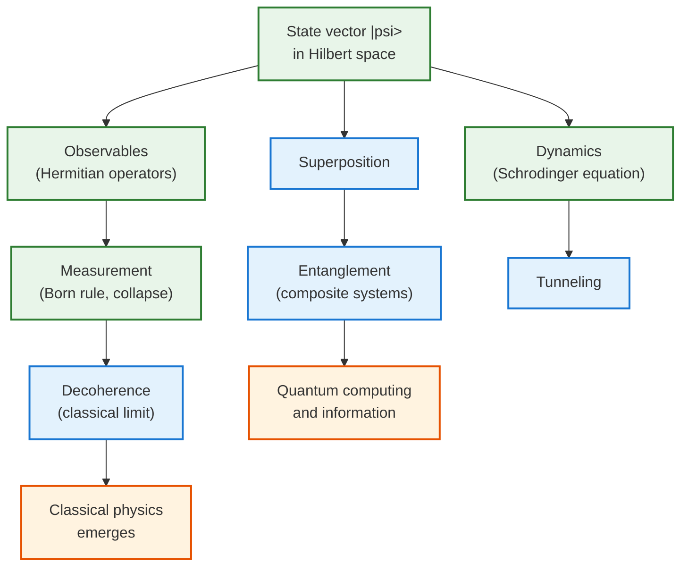

  <h1 style="color: white; margin: 0; font-size: 2rem;">Quantum Mechanics</h1>
  
The fundamental theory describing nature at atomic and subatomic scales, where particles exhibit wave-like behavior and uncertainty reigns.

Quantum mechanics is the operating system of the microscopic world. It replaces the definite trajectories of classical physics with *amplitudes* — complex numbers whose squared magnitudes give probabilities — and in doing so explains the stability of atoms, the colors of light, the periodic table, and the transistor in the device you are reading this on. These pages build from the core formalism (states, operators, the Schrödinger equation) through worked examples to the modern research frontier.

- **The state is a wave function.** A system is a vector $\lvert\psi\rangle$; $\lvert\psi\rvert^2$ gives probabilities, and amplitudes can interfere.
- **Observables are operators.** Measurable quantities are Hermitian operators; their eigenvalues are the only possible outcomes.
- **Measurement is special.** Smooth, deterministic evolution is interrupted by abrupt, probabilistic collapse — the measurement problem.
- **Entanglement is real.** Composite systems share correlations with no classical counterpart — the engine of quantum information.

## Explore Quantum Mechanics

The four core pages plus four deep-dive references are listed with full descriptions in the [What These Pages Cover](#what-these-pages-cover) table below.

## What These Pages Cover

| Section | What it covers |
|---------|----------------|
| Fundamental Concepts (below) | The five postulates, duality, uncertainty, wave functions |
| [States, Operators & Dynamics](formalism.html) | Schrödinger equation, observables, measurement, angular momentum, time evolution, perturbation theory |
| [Systems & Phenomena](systems-and-phenomena.html) | The box, oscillator, and hydrogen atom; tunneling, entanglement, superposition; experiments |
| [Computing, Information & Advanced Formalism](computing-and-advanced.html) | Overview hub for quantum information and the graduate machinery |
| [Quantum Computing](qm-computing.html) | Qubits, gates, entanglement as a resource, Shor/Grover/VQE, error correction |
| [Advanced Formalism](qm-advanced-formalism.html) | Rigged Hilbert spaces, density matrices, path integrals, coherent states, open systems |
| [Computational Methods](qm-computational-methods.html) | Exact diagonalization, tensor networks/DMRG, quantum Monte Carlo, time propagation |
| [Research Frontiers](qm-research-frontiers.html) | Many-body theory, geometric phases, topological matter, open questions |
| [Bell's Theorem & Experimental Tests](bell-inequalities-and-tests.html) | EPR, CHSH inequality, Tsirelson's bound, loophole-free experiments |

## How to Think Quantum

Before the mathematics, it helps to internalize how quantum systems behave differently from classical ones:

- **Classical coin:** heads OR tails. **Quantum coin:** heads AND tails simultaneously (superposition).
- **Classical information:** copy it freely. **Quantum information:** the no-cloning theorem forbids copying an unknown state.
- **Classical measurement:** look without disturbing. **Quantum measurement:** fundamentally changes the system.
- **Classical correlation:** local interactions only. **Quantum correlation:** instant correlations via entanglement.

### Visualizing Quantum States

Think of quantum states as **vectors in an abstract space**. A classical bit is the north pole ($|0\rangle$) OR the south pole ($|1\rangle$); a qubit can be ANY point on the Bloch sphere, with equal superpositions like $(|0\rangle + |1\rangle)/\sqrt{2}$ sitting on the equator. Measurement projects the state onto a measurement axis. Pure states lie on the sphere's surface (radius $= 1$); mixed states lie inside it (radius $< 1$).

### How the Pieces Fit Together

It is easy to lose the forest for the trees in quantum mechanics. The map below organizes the machinery: the state vector sits at the center, observables and dynamics act on it, and the strange phenomena (superposition, entanglement, tunneling) are consequences, not separate rules. Applications and interpretations branch off the same trunk.

## Fundamental Concepts

### The Postulates of Quantum Mechanics

Beneath the wave functions and operators, the entire theory rests on a short list of postulates. Everything else — uncertainty, quantization, tunneling, entanglement — is a logical consequence. It is worth seeing them assembled in one place; the rest of these pages are essentially these five statements worked out in detail.

| # | Postulate | Statement | Where it appears |
|---|-----------|-----------|------------------|
| 1 | State | A system is fully described by a normalized vector $\lvert\psi\rangle$ in a Hilbert space | Wave functions, Dirac notation |
| 2 | Observables | Measurable quantities are Hermitian operators $\hat{A}$; possible results are their eigenvalues | Position, momentum, energy operators |
| 3 | Measurement (Born rule) | The probability of result $a_n$ is $\lvert\langle a_n\lvert\psi\rangle\rvert^2$, and the state collapses to $\lvert a_n\rangle$ | Measurement and decoherence |
| 4 | Dynamics | Between measurements the state evolves by the Schrödinger equation, $i\hbar\,\partial_t\lvert\psi\rangle = \hat{H}\lvert\psi\rangle$ | Time evolution |
| 5 | Composite systems | The state space of a combined system is the tensor product of the parts | Entanglement, many-body QM |

**The two kinds of change.** Notice that postulates 4 and 3 describe two utterly different ways a quantum state can change. Schrödinger evolution (postulate 4) is smooth, deterministic, and reversible — given $\lvert\psi(0)\rangle$ the future is fixed. Measurement (postulate 3) is abrupt, probabilistic, and irreversible — the state jumps to an eigenstate and information about the others is lost. Reconciling these two — when and why one becomes the other — is the *measurement problem*, and decoherence is the modern bridge between them. Hold this tension in mind; it is the conceptual heart of quantum mechanics.

### Wave-Particle Duality

<a href="https://www.fisica.net/mecanica-quantica/de_broglie_thesis.pdf"> Paper: <b><i>On the Theory of Quanta</i></b> - Louis de Broglie</a>

<a href="https://www.youtube.com/watch?v=qCmtegdqOOA"> Video: <b><i>Double Slit Experiment Explained</i></b></a>

<a href="https://en.wikipedia.org/wiki/Wave-particle_duality"> Article: <b><i>Wave-Particle Duality - Wikipedia</i></b></a>

All matter and radiation exhibit both wave and particle properties. This duality is captured by de Broglie's relation:

$$\lambda = \frac{h}{p}$$

Where:
- $\lambda$ = de Broglie wavelength
- $h$ = Planck's constant ($6.626 \times 10^{-34}$ J·s)
- $p$ = momentum

### The Uncertainty Principle

<a href="https://www.phys.lsu.edu/faculty/oconnell/p7221/Heisenberg_zpk_1927.pdf"> Paper: <b><i>Über den anschaulichen Inhalt der quantentheoretischen Kinematik und Mechanik</i></b> - Werner Heisenberg</a>

Heisenberg's uncertainty principle sets fundamental limits on simultaneous knowledge of complementary variables:

<a href="https://scienceexchange.caltech.edu/topics/quantum-science-explained/uncertainty-principle"> Tutorial: <b><i>Understanding the Uncertainty Principle</i></b> - Caltech</a>

**Position-Momentum Uncertainty:**
$$\Delta x\,\Delta p \geq \frac{\hbar}{2}$$

**Energy-Time Uncertainty:**
$$\Delta E\,\Delta t \geq \frac{\hbar}{2}$$
Note: $\Delta t$ is the time scale for significant change in the system, not an uncertainty in clock time.

Where $\hbar = h/2\pi$ (reduced Planck's constant).

### Wave Functions and Probability

The state of a quantum system is described by a wave function $\psi(x,t)$. The probability density of finding a particle at position $x$ is:

$$P(x) = |\psi(x,t)|^2$$

**Normalization condition:**
$$
\int_{-\infty}^{\infty} |\psi(x,t)|^2 \, dx = 1
$$

The probability of finding the particle in a region is $P(a < x < b) = \int_a^b |\psi(x,t)|^2\,dx$. Because the wave function carries all knowable information about the system, everything that follows — quantization, tunneling, interference — is a property of $\psi$ and the operators that act on it.

## Common Misconceptions

Quantum mechanics is unusually prone to plausible-sounding errors. They come in two flavors: **conceptual pitfalls** — wrong mental pictures — and **technical notes** — bookkeeping that quietly produces wrong answers even when the physics is understood.

### Conceptual Pitfalls

- **"Observation requires consciousness."** No. Any interaction that distinguishes quantum states causes apparent collapse; decoherence, not a conscious observer, explains why we see definite outcomes.
- **"The uncertainty principle is measurement disturbance."** No. It is a fundamental property of wave-like systems — position and momentum do not have simultaneous definite values, they are not merely unknown.
- **"Quantum effects only occur at small scales."** More common there, but macroscopic quantum phenomena exist (superconductivity, superfluidity, Bose–Einstein condensates).
- **"Quantum tunneling is teleportation."** No. The wave function extends continuously through the barrier; nothing jumps.
- **"Entanglement transmits information faster than light."** No. Correlations exist, but the no-communication theorem forbids using them to signal.
- **"The electron orbits the nucleus."** No. The electron occupies an orbital — a probability distribution, a cloud, not a trajectory.
- **"Many-worlds means anything can happen."** No. Only outcomes consistent with the wave function occur.
- **"Virtual particles are real particles popping in and out."** No. They are calculational tools in perturbation theory, not physical objects.

### Technical Notes

These are the bookkeeping traps that produce wrong numbers even when the concepts are clear:

- **Normalization.** Every physical state must satisfy $\int|\psi|^2\,dx = 1$; forgetting to renormalize after a projection or a basis change is the most common arithmetic error.
- **Representation mixing.** Position $\psi(x)$ and momentum $\tilde\psi(p)$ are the *same* state in two bases, related by a Fourier transform — never combine them as if they lived in one space.
- **Operator ordering.** Because $[\hat x,\hat p]=i\hbar$, the operators do not commute: $\hat x\hat p \neq \hat p\hat x$. Order matters whenever you build or factor a Hamiltonian.
- **Global vs. relative phase.** A global phase $e^{i\theta}\lvert\psi\rangle$ is unphysical, but *relative* phase is real and measurable: $\lvert 0\rangle + \lvert 1\rangle \neq \lvert 0\rangle - \lvert 1\rangle$.

## Key Takeaways

- **The state is a wave function.** All knowable information lives in $\psi$; $|\psi|^2$ gives the probability density of measurement outcomes.
- **Observables are operators.** Measurable quantities correspond to Hermitian operators; their eigenvalues are the possible results.
- **Uncertainty is fundamental.** $\Delta x\,\Delta p \geq \hbar/2$ is not a measurement limitation but a property of conjugate observables.
- **Evolution is unitary, measurement is not.** The Schrödinger equation evolves states deterministically; measurement projects them probabilistically.
- **Entanglement has no classical analog.** Correlations between subsystems can exceed anything classical, powering quantum computing and teleportation.
- **Classical physics is the $\hbar \to 0$ limit.** Decoherence and the correspondence principle recover familiar classical behavior at macroscopic scales.

## See Also

- [Classical Mechanics](../classical-mechanics/) — the classical limit recovered as $\hbar \to 0$.
- [Quantum Field Theory](../quantum-field-theory.html) — quantum mechanics made relativistic, with particles as field excitations.
- [Statistical Mechanics](../statistical-mechanics/) — quantum statistics (Bose–Einstein, Fermi–Dirac) and many-body systems.
- [Condensed Matter Physics](../condensed-matter/) — quantum mechanics applied to solids and emergent phases.
- [Quantum Computing](../../quantum-computing/) — superposition and entanglement as a computational resource.
- [Physics Hub](../) — browse all physics topics.
