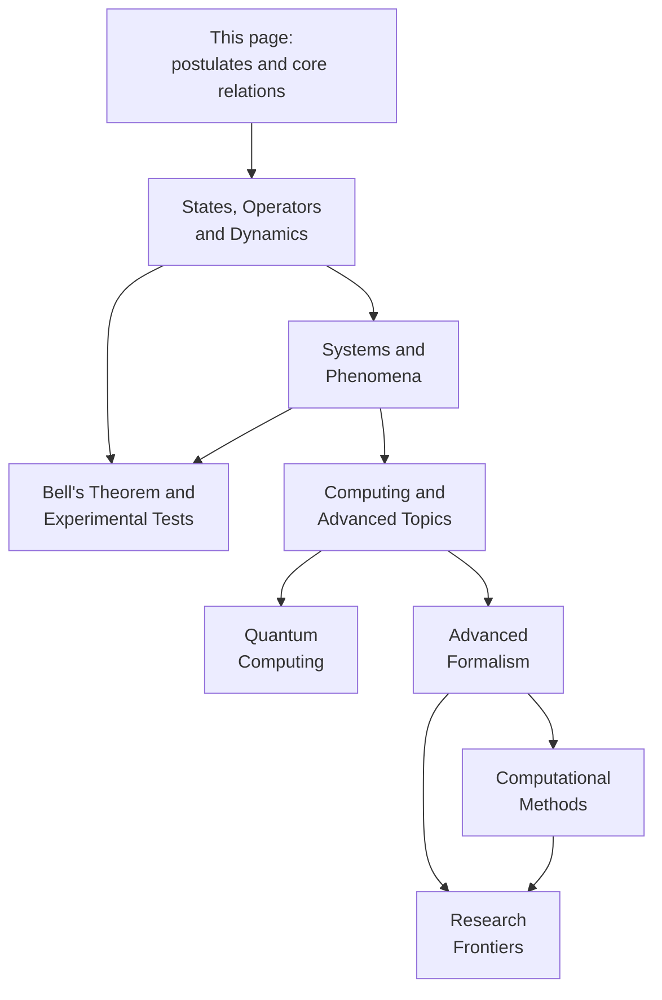
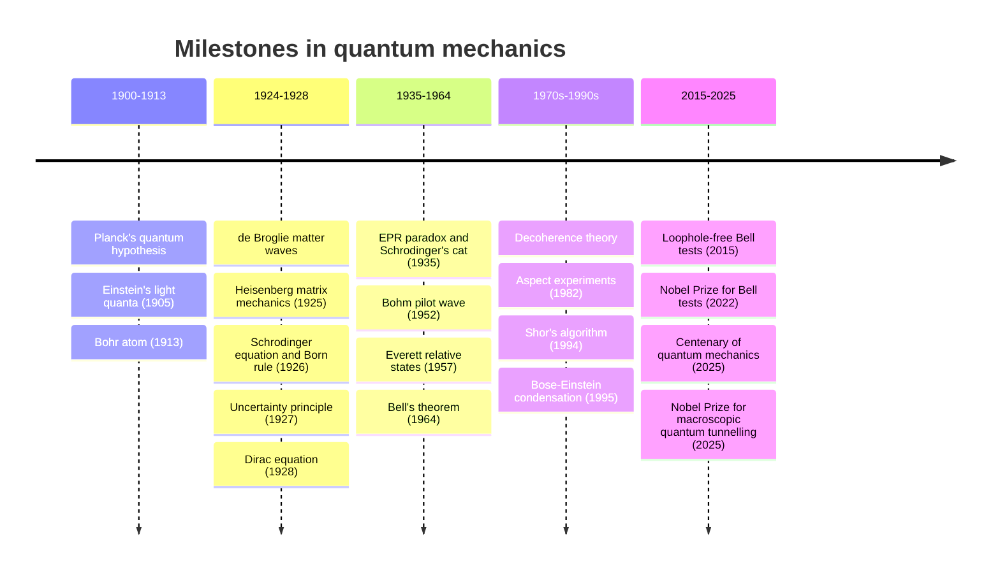

  <h1 style="color: white; margin: 0; font-size: 2rem;">Quantum Mechanics</h1>
  
The fundamental theory of matter and radiation at atomic and subatomic scales, where states are complex amplitudes and measurement outcomes are probabilistic.

**Quantum mechanics** is the physical theory that describes matter and light at the scale of atoms and below, and — through its consequences — chemistry, solids, lasers, and semiconductors. It replaces the definite trajectories of classical mechanics with *probability amplitudes*: complex numbers whose squared magnitudes give the probabilities of measurement outcomes, and which can interfere. This hub states the postulates and the foundational relations, lists the pages in this section, and corrects the most common misconceptions. The detailed formalism, solvable systems, and graduate material live on the sub-pages.

In brief:

- **States are vectors.** A system is described by a unit vector $\lvert\psi\rangle$ in a complex Hilbert space; amplitudes add, so alternatives can interfere.
- **Observables are operators.** Measurable quantities are Hermitian operators; the only possible results are their eigenvalues, with probabilities given by the Born rule.
- **Evolution is unitary; measurement is not.** Between measurements the Schrödinger equation evolves the state deterministically; a measurement yields one outcome at random.
- **Composite systems can be entangled.** Their joint states need not factor into states of the parts, producing correlations that no local classical model can reproduce.

## Pages in This Section

| Page | What it covers |
|------|----------------|
| [States, Operators & Dynamics](formalism.html) | Dirac notation, observables and commutators, measurement, the Schrödinger equation and its pictures, symmetries, angular momentum and spin, perturbation theory, WKB, decoherence, interpretations |
| [Systems & Phenomena](systems-and-phenomena.html) | Particle in a box, harmonic oscillator, hydrogen atom; tunneling, entanglement, superposition; key experiments |
| [Bell's Theorem & Experimental Tests](bell-inequalities-and-tests.html) | EPR, the CHSH inequality, Tsirelson's bound, loopholes, loophole-free tests, device-independent applications |
| [Computing & Advanced Topics](computing-and-advanced.html) | Sub-hub for the four graduate-level pages below |
| [Quantum Computing](qm-computing.html) | Qubits, gates, Shor, Grover, variational algorithms, error correction, hardware |
| [Advanced Formalism](qm-advanced-formalism.html) | Rigged Hilbert spaces, density matrices, path integrals, coherent and squeezed states, Lindblad dynamics, Dirac equation |
| [Computational Methods](qm-computational-methods.html) | Exact diagonalization, tensor networks and DMRG, quantum Monte Carlo, time propagation, QuTiP |
| [Research Frontiers](qm-research-frontiers.html) | Many-body physics, Berry phases, topological matter, measurement-induced phenomena, open questions |

A suggested reading order, with arrows pointing from prerequisites to the pages that use them:

## The Postulates of Quantum Mechanics

The theory rests on a short list of postulates; uncertainty relations, quantization, tunneling, and entanglement are consequences. Textbooks differ slightly in how they split and number them, but the content is standard.

| # | Postulate | Statement | Developed in |
|---|-----------|-----------|--------------|
| 1 | State | A closed system is described by a unit vector $\lvert\psi\rangle$ (up to a global phase) in a complex Hilbert space | [Dirac notation](formalism.html#hilbert-space-and-dirac-notation) |
| 2 | Observables | Measurable quantities are Hermitian operators $\hat{A}$; possible results are their eigenvalues | [Observables](formalism.html#observables-and-operators) |
| 3 | Born rule and state update | Outcome $a_n$ occurs with probability $\lvert\langle a_n\vert\psi\rangle\rvert^2$, after which the state is $\lvert a_n\rangle$ | [Measurement](formalism.html#measurement) |
| 4 | Dynamics | Between measurements, $i\hbar\,\partial_t\lvert\psi\rangle = \hat{H}\lvert\psi\rangle$ | [Time evolution](formalism.html#time-evolution-and-pictures) |
| 5 | Composite systems | The state space of a composite system is the tensor product of the parts' spaces | [Entanglement](systems-and-phenomena.html#entanglement) |
| 6 | Identical particles | States of identical particles are symmetric (bosons) or antisymmetric (fermions) under exchange | [Research Frontiers](qm-research-frontiers.html#second-quantization) |

Postulates 3 and 4 describe two different kinds of change. Schrödinger evolution is continuous, deterministic, and reversible; measurement is abrupt, probabilistic, and irreversible. Explaining how the second arises from, or coexists with, the first is the **measurement problem**. Decoherence explains why interference between macroscopically distinct outcomes disappears, but not why one outcome occurs; the competing answers are the [interpretations](formalism.html#the-measurement-problem-and-interpretations) of quantum mechanics.

## Foundational Relations

### Constants

Since the 2019 redefinition of the SI, Planck's constant has an exact defined value.

| Constant | Symbol | Value |
|----------|--------|-------|
| Planck constant | $h$ | $6.626\,070\,15 \times 10^{-34}$ J s (exact) |
| Reduced Planck constant | $\hbar = h/2\pi$ | $1.054\,571\,817\ldots \times 10^{-34}$ J s |
| | | $6.582\,119\,569\ldots \times 10^{-16}$ eV s |
| Bohr radius | $a_0$ | $5.291\,772 \times 10^{-11}$ m |
| Rydberg energy | $R_\infty hc$ | $13.605\,693$ eV |

### Wave–particle duality

<a href="https://www.fisica.net/mecanica-quantica/de_broglie_thesis.pdf"> Paper: <b><i>On the Theory of Quanta</i></b> - Louis de Broglie</a>

Light of frequency $\nu$ is absorbed and emitted in quanta of energy $E = h\nu$ (Planck 1900, Einstein 1905), and matter with momentum $p$ has an associated wavelength (de Broglie 1924, confirmed by electron diffraction in 1927):

$$E = h\nu = \hbar\omega, \qquad \lambda = \frac{h}{p}, \qquad \mathbf p = \hbar\mathbf k.$$

Neither "wave" nor "particle" is the underlying description. The state is an amplitude that propagates and interferes like a wave, while detection events are discrete and localized. Single-particle interference has been observed with electrons, neutrons, atoms, and molecules of about 2,000 atoms.

### The uncertainty principle

<a href="https://www.phys.lsu.edu/faculty/oconnell/p7221/Heisenberg_zpk_1927.pdf"> Paper: <b><i>Über den anschaulichen Inhalt der quantentheoretischen Kinematik und Mechanik</i></b> - Werner Heisenberg</a>

For position and momentum along the same axis, the standard deviations over identically prepared systems satisfy

$$\sigma_x\,\sigma_p \geq \frac{\hbar}{2}.$$

This follows from the commutator $[\hat x, \hat p] = i\hbar$ and is a property of the state, not a limitation of instruments; the general form for any pair of observables is derived on the [formalism page](formalism.html#the-uncertainty-relation). The energy–time relation, $\sigma_E\,\tau \gtrsim \hbar/2$, has a different meaning: $\tau$ is the time over which the system changes appreciably, not an uncertainty in a clock reading.

### Wave functions and probability

In the position representation the state is a wave function $\psi(\mathbf r, t) = \langle\mathbf r\vert\psi(t)\rangle$. Its squared magnitude is a probability density, which must integrate to one:

$$P(\mathbf r, t) = |\psi(\mathbf r,t)|^2, \qquad \int |\psi(\mathbf r,t)|^2\, d^3r = 1.$$

The probability of finding the particle in a region $V$ is $\int_V \lvert\psi\rvert^2\,d^3r$. Two wave functions differing only by a global phase $e^{i\theta}$ describe the same state; relative phases between components are physical and determine interference.

### The qubit and the Bloch sphere

The simplest quantum system has two basis states, $\lvert 0\rangle$ and $\lvert 1\rangle$. Every pure state can be written, up to a global phase, as

$$|\psi\rangle = \cos\frac{\theta}{2}\,|0\rangle + e^{i\phi}\sin\frac{\theta}{2}\,|1\rangle,$$

which is a point on the unit sphere with polar angle $\theta$ and azimuth $\phi$ (the **Bloch sphere**). The poles are the basis states, equal superpositions lie on the equator, and mixed states lie inside the sphere. A measurement along an axis yields one of the two antipodal points on that axis, with probabilities set by the state's projection onto it. The same mathematics describes a spin-½ particle, a photon's polarization, and a qubit in a quantum computer (see [Quantum Computing](qm-computing.html#qubits-and-the-bloch-sphere)).

## Historical Development

The United Nations designated 2025 the International Year of Quantum Science and Technology, marking a century since Heisenberg's 1925 matrix-mechanics paper. The 2025 Nobel Prize in Physics went to John Clarke, Michel Devoret, and John Martinis "for the discovery of macroscopic quantum mechanical tunnelling and energy quantisation in an electric circuit" — experiments from 1984–85 on superconducting Josephson-junction circuits that are the ancestors of today's superconducting qubits.

## Common Misconceptions

### Conceptual pitfalls

| Claim | Correction |
|-------|------------|
| "Observation requires a conscious observer." | Any interaction that records which-state information suppresses interference. Decoherence, not consciousness, explains why outcomes look definite. |
| "The uncertainty principle is about measurement disturbance." | $\sigma_x\sigma_p \ge \hbar/2$ constrains the state itself: no state has sharp position and momentum. Disturbance relations exist but are a separate result. |
| "A superposition means the system is secretly in one state and we don't know which." | That describes a classical mixture. Superpositions produce interference that mixtures cannot. |
| "Quantum effects only happen at microscopic scales." | Superconductivity, superfluidity, Bose–Einstein condensates, and the macroscopic tunnelling recognized by the 2025 Nobel Prize are quantum effects in large systems. |
| "Tunneling is teleportation." | The wave function extends continuously into and through the barrier; nothing jumps discontinuously. |
| "Entanglement sends signals faster than light." | Measurement outcomes are correlated, but the no-communication theorem guarantees that local statistics are unaffected by distant choices. |
| "The electron orbits the nucleus." | Stationary states are orbitals: time-independent probability distributions, not trajectories. |
| "Many-worlds means anything can happen." | Branches are weighted by Born-rule amplitudes; outcomes with zero amplitude never occur. |
| "Virtual particles are real particles popping in and out of existence." | They are terms in a perturbative expansion, not observable objects. |

### Technical notes

- **Normalization.** Renormalize after projections and basis changes; unnormalized states give wrong probabilities.
- **Representations.** $\psi(x)$ and $\tilde\psi(p)$ are the same state in two bases, related by a Fourier transform; do not mix them.
- **Operator ordering.** $\hat x\hat p \neq \hat p\hat x$; ordering matters when building or factoring Hamiltonians (for example, in ladder-operator methods).
- **Global versus relative phase.** A global phase is unobservable; a relative phase is physical: $\lvert 0\rangle + \lvert 1\rangle$ and $\lvert 0\rangle - \lvert 1\rangle$ are orthogonal states.
- **Degeneracy.** Non-degenerate perturbation formulas fail when levels are degenerate; diagonalize the perturbation within the degenerate subspace first.

## See Also

- [Classical Mechanics](../classical-mechanics/) — the classical limit, Hamiltonian mechanics, and Poisson brackets.
- [Quantum Field Theory](../quantum-field-theory.html) — quantum mechanics made relativistic, with particles as field excitations.
- [Statistical Mechanics](../statistical-mechanics/) — quantum statistics (Bose–Einstein, Fermi–Dirac) and many-body systems.
- [Condensed Matter Physics](../condensed-matter/) — quantum mechanics applied to solids and emergent phases.
- [Quantum Computing](../../quantum-computing/) — superposition and entanglement as a computational resource.
- [Physics Hub](../) — all physics topics.
