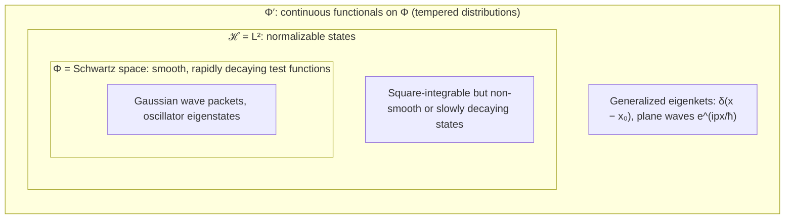
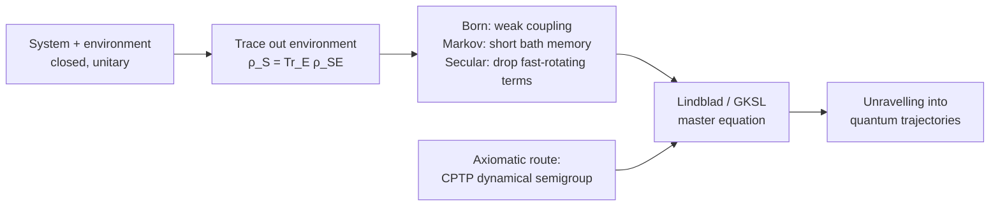

[Quantum Mechanics](./) &raquo; Advanced Formalism

This page collects the graduate-level machinery that extends the textbook formalism of normalizable state vectors, Hermitian observables and unitary evolution. It assumes the material on [States, Operators & Dynamics](formalism.html) (Hilbert spaces, Dirac notation, the Schrödinger and Heisenberg pictures, ladder operators). None of it is a prerequisite for the introductory pages; it is here for readers who want the mathematically complete picture or need the tools used in quantum optics, quantum information and field theory.

## Overview

The introductory formalism is sufficient for bound-state problems, but it fails or becomes awkward in several places. Each section below addresses one of them.

| Gap in the textbook formalism | Extension | Central object |
|---|---|---|
| Position and momentum eigenkets are not normalizable | [Rigged Hilbert space](#rigged-hilbert-spaces) | Gelfand triple $\Phi \subset \mathcal{H} \subset \Phi'$ |
| Mixtures and subsystems have no state vector | [Density operator](#density-matrices-and-mixed-states) | $\hat\rho \ge 0$, $\operatorname{Tr}\hat\rho = 1$ |
| Real detectors are not projective measurements | [POVMs](#generalized-measurements-povms) | Effects $\hat E_m \ge 0$, $\sum_m \hat E_m = \mathbb{1}$ |
| Real systems are not isolated | [Channels and Lindblad dynamics](#open-quantum-systems-and-the-lindblad-equation) | CPTP maps, GKSL generator |
| Operators obscure the classical limit and field theory | [Path integral](#the-path-integral-formulation) | $\int \mathcal{D}[x]\, e^{iS/\hbar}$ |
| Oscillators and light near the classical limit | [Coherent and squeezed states](#coherent-and-squeezed-states), [Wigner function](#phase-space-representation-the-wigner-function) | $\hat a\lvert\alpha\rangle = \alpha\lvert\alpha\rangle$, $W(x,p)$ |
| Schrödinger equation is not Lorentz invariant | [Relativistic wave equations](#relativistic-quantum-mechanics) | Klein–Gordon, Dirac |

## Rigged Hilbert Spaces

<a href="https://arxiv.org/abs/quant-ph/0502053"> Paper: <b><i>The role of the rigged Hilbert space in quantum mechanics</i></b> - R. de la Madrid</a>

### The problem

A **Hilbert space** $\mathcal{H}$ is a complete inner-product space over $\mathbb{C}$; the spaces used in quantum mechanics are also **separable** (they have a countable orthonormal basis). For a particle on a line, $\mathcal{H} = L^2(\mathbb{R})$.

The most-used "states" in physics are not in $\mathcal{H}$. A position eigenket satisfies $\hat x\lvert x\rangle = x\lvert x\rangle$ and $\langle x'\vert x\rangle = \delta(x'-x)$, so its norm is $\delta(0) = \infty$. The momentum eigenfunction $\langle x\vert p\rangle = (2\pi\hbar)^{-1/2}e^{ipx/\hbar}$ is not square-integrable either. Correspondingly, $\hat x$ and $\hat p$ have purely continuous spectra and no eigenvectors in $L^2$ at all. Von Neumann's resolution was to avoid eigenkets and work with projection-valued spectral measures. The **rigged Hilbert space** keeps Dirac's notation and makes it rigorous.

### The Gelfand triple

A rigged Hilbert space is a triple

$$
\Phi \subset \mathcal{H} \subset \Phi'
$$

- $\Phi$ is a dense subspace of well-behaved test vectors with a finer (nuclear) topology. For a particle on a line it is typically the **Schwartz space** $\mathcal{S}(\mathbb{R})$ of smooth functions that decay faster than any power. The operators of interest, and all their powers, map $\Phi$ into itself, so quantities such as $\langle\psi\vert\hat p^n\vert\phi\rangle$ are finite.
- $\mathcal{H}$ is the usual space of normalizable states.
- $\Phi'$ is the space of continuous linear functionals on $\Phi$ (for $\mathcal{S}$, the tempered distributions). It is larger than $\mathcal{H}$ and contains the generalized eigenkets: $\langle x_0\rvert$ is the functional $\phi \mapsto \phi(x_0)$, that is, the Dirac delta.

The **nuclear spectral theorem** (Gelfand–Maurin) guarantees that a self-adjoint operator leaving $\Phi$ invariant has a complete set of generalized eigenvectors in $\Phi'$. This is what justifies expanding every state over $\lvert x\rangle$ or $\lvert p\rangle$.

### Spectral decomposition

For a self-adjoint $\hat A$ the spectral theorem gives $\hat A = \int \lambda\, d\hat E_\lambda$ with $\hat E_\lambda$ a projection-valued measure. In Dirac notation, a spectrum with both discrete and continuous parts gives

$$
\hat{A} = \sum_n a_n \lvert a_n\rangle\langle a_n\rvert + \int a \,\lvert a\rangle\langle a\rvert \, da,
\qquad
\mathbb{1} = \sum_n \lvert a_n\rangle\langle a_n\rvert + \int \lvert a\rangle\langle a\rvert \, da .
$$

The discrete eigenkets (bound states) are vectors in $\mathcal{H}$; the continuum kets (scattering states) live in $\Phi'$. The hydrogen Hamiltonian is the standard example with both.

### Self-adjointness and Stone's theorem

**Stone's theorem** states that every strongly continuous one-parameter unitary group has the form $U(t) = e^{-i\hat H t/\hbar}$ with $\hat H$ self-adjoint, and conversely. The group laws $U(0) = \mathbb{1}$, $U(t_1)U(t_2) = U(t_1+t_2)$ and $U(t)^\dagger = U(-t)$ express reversible, composable time evolution.

The theorem requires **self-adjointness**, which is stronger than symmetry ("Hermiticity" in the physics sense): the operator's domain must equal the domain of its adjoint. On unbounded operators this is a statement about boundary conditions. The momentum operator $-i\hbar\,d/dx$ on the half-line $[0,\infty)$, for example, is symmetric but has no self-adjoint extension, which is why there is no well-defined radial-momentum observable conjugate to $r$. On a finite interval it has a one-parameter family of self-adjoint extensions, one for each boundary phase $\psi(L) = e^{i\theta}\psi(0)$.

## Density Matrices and Mixed States

<a href="https://en.wikipedia.org/wiki/Density_matrix"> Article: <b><i>Density Matrix - Wikipedia</i></b></a>

A state vector describes a **pure** state, one of maximal knowledge. Two common situations have no state vector:

- **Classical uncertainty**: a source emits $\lvert\psi_1\rangle$ with probability $p_1$ and $\lvert\psi_2\rangle$ with probability $p_2$ (a thermal source, an imperfect preparation). This is a statistical mixture, not a superposition.
- **Entanglement**: if $AB$ is in an entangled pure state, subsystem $A$ alone has no state vector.

The **density operator** handles both.

### Definition and properties

For an ensemble $\lbrace p_i, \lvert\psi_i\rangle\rbrace$,

$$
\hat{\rho} = \sum_i p_i \lvert\psi_i\rangle\langle\psi_i\rvert ,
\qquad
\langle \hat{A} \rangle = \operatorname{Tr}(\hat{\rho}\,\hat{A}) .
$$

An operator is a valid density operator if and only if it is

- **normalized**: $\operatorname{Tr}\hat\rho = 1$;
- **positive semidefinite**: $\hat\rho \ge 0$, which implies Hermiticity.

Its eigenvalues therefore form a probability distribution. Unitary evolution becomes the **von Neumann equation** $i\hbar\, d\hat\rho/dt = [\hat H, \hat\rho]$, and a thermal equilibrium state is the Gibbs state $\hat\rho = e^{-\beta\hat H}/Z$ with $Z = \operatorname{Tr} e^{-\beta \hat H}$.

**Ensembles are not unique.** Different ensembles can give the same $\hat\rho$, and no measurement can tell them apart. An equal mixture of $\lvert 0\rangle,\lvert 1\rangle$ and an equal mixture of $\lvert +\rangle,\lvert -\rangle$ both give $\hat\rho = \mathbb{1}/2$. The density operator, not the ensemble, is the physical state. (The Schrödinger–HJW theorem characterizes all ensembles that realize a given $\hat\rho$.)

### Purity and the Bloch ball

The **purity** $\operatorname{Tr}(\hat\rho^2)$ distinguishes pure from mixed states:

$$
\frac{1}{d} \le \operatorname{Tr}(\hat\rho^2) \le 1 ,
$$

with the upper bound attained exactly for pure states and the lower bound for the maximally mixed state $\mathbb{1}/d$ in dimension $d$.

For a qubit every density matrix can be written $\hat\rho = \tfrac12(\mathbb{1} + \mathbf{r}\cdot\boldsymbol{\sigma})$ with Bloch vector $\lvert\mathbf{r}\rvert \le 1$, and $\operatorname{Tr}\hat\rho^2 = \tfrac12(1 + \lvert\mathbf r\rvert^2)$. Pure states lie on the surface of the **Bloch ball**, mixed states inside, and $\mathbb{1}/2$ at the centre. Compare the equal superposition and the equal mixture:

$$
\hat\rho_{\text{pure}} = \lvert +\rangle\langle +\rvert = \frac{1}{2}\begin{pmatrix} 1 & 1 \\ 1 & 1 \end{pmatrix}, \qquad
\hat\rho_{\text{mixed}} = \frac{1}{2}\begin{pmatrix} 1 & 0 \\ 0 & 1 \end{pmatrix} .
$$

Both give 50/50 outcomes in the $\lbrace \lvert 0\rangle, \lvert 1\rangle\rbrace$ basis. The off-diagonal **coherences** of $\hat\rho_{\text{pure}}$ carry the relative phase responsible for interference; a measurement in the $\lbrace \lvert\pm\rangle\rbrace$ basis gives $+$ with certainty for the first and 50/50 for the second. Decoherence is the process that suppresses these off-diagonal terms.

### Von Neumann entropy

$$
S(\hat{\rho}) = -\operatorname{Tr}(\hat{\rho} \ln \hat{\rho}) = -\sum_i \lambda_i \ln \lambda_i
$$

where $\lambda_i$ are the eigenvalues of $\hat\rho$. It is zero for pure states, maximal ($\ln d$) for $\mathbb{1}/d$, invariant under unitary evolution, and reduces to the Shannon entropy of the eigenvalue distribution. It is the basic quantity of quantum information theory (quantum data compression, entanglement measures, the thermodynamic entropy of a Gibbs state).

### Partial trace, Schmidt decomposition and purification

The state of subsystem $A$ of a composite system is the **reduced density matrix**

$$
\hat{\rho}_A = \operatorname{Tr}_B(\hat{\rho}_{AB}) = \sum_j \big(\mathbb{1}_A \otimes \langle j\rvert_B\big)\, \hat\rho_{AB}\, \big(\mathbb{1}_A \otimes \lvert j\rangle_B\big) ,
$$

the unique operator that reproduces $\langle \hat A\otimes\mathbb{1}\rangle$ for every observable on $A$.

Every pure bipartite state has a **Schmidt decomposition**, obtained from the singular value decomposition of its coefficient matrix:

$$
\lvert\Psi\rangle_{AB} = \sum_{k=1}^{r} \sqrt{\lambda_k}\, \lvert u_k\rangle_A \otimes \lvert v_k\rangle_B ,
\qquad \lambda_k > 0,\quad \sum_k \lambda_k = 1 .
$$

Both reduced states then have the same nonzero eigenvalues $\lambda_k$, so $S(\hat\rho_A) = S(\hat\rho_B)$. This common value is the **entanglement entropy**. The state is a product state if and only if the Schmidt rank $r$ is 1. For the Bell state $\lvert\Phi^+\rangle = (\lvert 00\rangle + \lvert 11\rangle)/\sqrt 2$, $\hat\rho_A = \mathbb{1}/2$ and $S = \ln 2$: a pure global state whose parts are maximally mixed.

Conversely, every mixed state $\hat\rho_A$ can be written as the reduced state of a pure state on a larger system (a **purification**): with $\hat\rho_A = \sum_k \lambda_k\lvert k\rangle\langle k\rvert$, take $\lvert\Psi\rangle = \sum_k \sqrt{\lambda_k}\lvert k\rangle_A\lvert k\rangle_R$. Purifications underlie the Stinespring picture of channels below.

## Generalized Measurements (POVMs)

Projective measurements are an idealization. Photodetectors with finite efficiency, unsharp measurements, and measurements performed through an ancilla are described by a **positive operator-valued measure** (POVM): a set of **effects** $\hat E_m$ with

$$
\hat E_m \ge 0, \qquad \sum_m \hat E_m = \mathbb{1}, \qquad p(m) = \operatorname{Tr}(\hat\rho\, \hat E_m) .
$$

When the post-measurement state matters, each outcome has **measurement operators** $\hat M_m$ with $\hat E_m = \hat M_m^\dagger \hat M_m$, and the state updates as $\hat\rho \to \hat M_m \hat\rho \hat M_m^\dagger / p(m)$. Projective measurements are the special case $\hat E_m = \hat P_m$ with $\hat P_m \hat P_n = \delta_{mn}\hat P_m$.

POVMs can have more outcomes than the Hilbert-space dimension and need not be orthogonal. The standard example is **unambiguous state discrimination** of two non-orthogonal states, which uses a three-outcome POVM ("state 1", "state 2", "don't know") and never errs when it answers. **Naimark's dilation theorem** shows that every POVM is a projective measurement on the system coupled to an ancilla, so POVMs add no new physics; they are the correct description of what an experiment accessing only the system actually does.

## Open Quantum Systems and the Lindblad Equation

<a href="https://arxiv.org/abs/1902.00967"> Lecture notes: <b><i>Lecture Notes on the Theory of Open Quantum Systems</i></b> - D. A. Lidar</a>

A system $S$ coupled to an environment $E$ evolves unitarily only as part of the whole. Its own state is $\hat\rho_S = \operatorname{Tr}_E\,\hat\rho_{SE}$, and its dynamics are non-unitary: energy and phase information leak into $E$, and pure states become mixed.

### Quantum channels

Any physically allowed transformation of a density matrix over a fixed time interval is a **quantum channel**: a linear, **completely positive, trace-preserving (CPTP)** map $\mathcal{E}$. Complete positivity (positivity of $\mathcal{E}\otimes\mathrm{id}$ on any extension) is required because the system might be entangled with something else; the transpose map is positive but not completely positive, and is therefore not physical.

Every channel has two equivalent representations:

- **Kraus (operator-sum) form**:
  $$
  \mathcal{E}(\hat\rho) = \sum_i \hat{K}_i\, \hat\rho\, \hat{K}_i^\dagger, \qquad \sum_i \hat{K}_i^\dagger \hat{K}_i = \mathbb{1} .
  $$
  The completeness condition is trace preservation. The Kraus operators are not unique; any unitary mixing of them gives the same channel.
- **Stinespring dilation**: $\mathcal{E}(\hat\rho) = \operatorname{Tr}_E\big[\hat U (\hat\rho \otimes \lvert 0\rangle\langle 0\rvert_E)\hat U^\dagger\big]$. Every channel is unitary evolution on a larger system followed by discarding the environment.

The standard single-qubit noise channels, all used in error-correction analysis:

| Channel | Kraus operators | Effect on the Bloch vector |
|---|---|---|
| Amplitude damping ($\gamma$) | $$\begin{pmatrix}1&0\\0&\sqrt{1-\gamma}\end{pmatrix}$$, $$\begin{pmatrix}0&\sqrt\gamma\\0&0\end{pmatrix}$$ | Pulled toward $\lvert 0\rangle$ (north pole); models $T_1$ decay |
| Phase damping ($\lambda$) | $$\begin{pmatrix}1&0\\0&\sqrt{1-\lambda}\end{pmatrix}$$, $$\begin{pmatrix}0&0\\0&\sqrt\lambda\end{pmatrix}$$ | $x,y$ components shrink by $\sqrt{1-\lambda}$; models pure dephasing |
| Depolarizing ($p$) | $\sqrt{1-\tfrac{3p}{4}}\,\mathbb{1}$, $\sqrt{\tfrac{p}{4}}\,\hat\sigma_{x,y,z}$ | Whole vector shrinks by $1-p$ toward the centre |

### The Lindblad (GKSL) master equation

If the channels form a continuous, memoryless family, $\mathcal{E}_{t+s} = \mathcal{E}_t \circ \mathcal{E}_s$ (a **quantum dynamical semigroup**), the Gorini–Kossakowski–Sudarshan–Lindblad theorem (1976) fixes the most general form of the generator:

$$
\frac{d\hat{\rho}}{dt} = -\frac{i}{\hbar}[\hat{H},\hat{\rho}] + \sum_k \gamma_k\left(\hat{L}_k \hat{\rho}\, \hat{L}_k^\dagger - \frac{1}{2}\left\{\hat{L}_k^\dagger\hat{L}_k,\, \hat{\rho}\right\}\right), \qquad \gamma_k \ge 0 .
$$

The commutator is the unitary part (with $\hat H$ possibly renormalized by the environment, e.g. a Lamb shift). The **dissipator** contains a "jump" term $\hat L_k\hat\rho\hat L_k^\dagger$ and an anticommutator that compensates for it so that the trace is conserved; together they keep $\hat\rho$ a valid density matrix at all times. Spontaneous emission of a two-level atom at zero temperature is $\hat L = \hat\sigma_-$ with $\gamma$ the Einstein $A$ coefficient; pure dephasing is $\hat L = \hat\sigma_z$.

The same equation can be reached from a microscopic model:

When the bath correlation time is not short compared with the system's dynamics (structured spectral densities, strong coupling, low temperature), the semigroup property fails and the dynamics are **non-Markovian**; information can flow back from the environment. Such cases need time-convolution master equations, the hierarchical equations of motion (HEOM), or tensor-network treatments of system plus bath.

### Relaxation and dephasing times

For a qubit, two time constants summarize Lindblad dynamics:

- $T_1$, **energy relaxation** (longitudinal): populations decay toward thermal equilibrium, driven by $\hat\sigma_\pm$ processes.
- $T_2$, **phase coherence** (transverse): off-diagonal elements $\rho_{01}$ decay, turning superpositions into mixtures.

With a pure-dephasing time $T_\phi$ they are related by

$$
\frac{1}{T_2} = \frac{1}{2T_1} + \frac{1}{T_\phi} \quad \Longrightarrow \quad T_2 \le 2T_1 .
$$

Experiments also quote $T_2^{\ast}$, the free-induction (Ramsey) decay time, which includes inhomogeneous broadening from slow frequency fluctuations; spin-echo sequences refocus that part, so $T_2^{\ast} \le T_2$. These times bound how many coherent operations a qubit can perform (see [Quantum Computing](qm-computing.html#decoherence-why-quantum-computers-are-hard)).

## The Path-Integral Formulation

<a href="https://www.fisica.net/mecanica-quantica/Feynman-thesis.pdf"> Thesis: <b><i>The Principle of Least Action in Quantum Mechanics</i></b> - Richard Feynman</a>

### Sum over histories

Feynman's formulation (1948) writes the **propagator** $K(x_f,t_f;x_i,t_i) = \langle x_f\vert e^{-i\hat H(t_f-t_i)/\hbar}\vert x_i\rangle$ as a sum over all paths between the endpoints, each weighted by a phase set by its classical action:

$$
K(x_f,t_f;x_i,t_i) = \int \mathcal{D}[x(t)] \, \exp\!\left(\frac{i}{\hbar}S[x]\right),
\qquad
S[x] = \int_{t_i}^{t_f} L(x,\dot{x},t) \, dt .
$$

Paths near the classical one, where $\delta S = 0$, have nearly equal phases and add constructively; elsewhere the phases vary rapidly and cancel. As $\hbar \to 0$ only the neighbourhood of the stationary path contributes, which is how the principle of least action emerges from quantum mechanics.

<figure style="margin:1.5em auto; max-width:520px;">
<svg viewBox="0 0 480 200" xmlns="http://www.w3.org/2000/svg" role="img" aria-label="Several paths connecting two spacetime points; the classical path is drawn solid and alternative paths dashed" style="width:100%; height:auto; font-family:sans-serif; color:currentColor;">
  <g fill="none" stroke="currentColor" stroke-width="1.2" stroke-dasharray="4 4" opacity="0.55">
    <path d="M60 160 C 140 20, 260 40, 420 40"/>
    <path d="M60 160 C 120 180, 300 160, 420 40"/>
    <path d="M60 160 C 100 60, 180 150, 260 90 S 380 20, 420 40"/>
    <path d="M60 160 C 200 190, 220 10, 420 40"/>
  </g>
  <path d="M60 160 C 170 110, 300 70, 420 40" fill="none" stroke="currentColor" stroke-width="2.6"/>
  <circle cx="60" cy="160" r="5" fill="currentColor"/>
  <circle cx="420" cy="40" r="5" fill="currentColor"/>
  <text x="48" y="186" font-size="13" fill="currentColor">(x_i, t_i)</text>
  <text x="392" y="26" font-size="13" fill="currentColor">(x_f, t_f)</text>
  <text x="250" y="122" font-size="12" fill="currentColor">classical path, δS = 0</text>
</svg>
<figcaption style="font-size:0.9em; text-align:center;">Every path contributes a phase eiS/ħ; contributions near the stationary-action path reinforce.</figcaption>
</figure>

### Time slicing

The measure $\mathcal{D}[x(t)]$ is defined by dividing $[t_i,t_f]$ into $N$ steps of length $\varepsilon = (t_f-t_i)/N$, inserting a resolution of the identity at each intermediate time, and taking $N\to\infty$:

$$
K = \lim_{N \to \infty} \left(\frac{m}{2\pi i\hbar\varepsilon}\right)^{N/2} \int \prod_{j=1}^{N-1} dx_j \; \exp\!\left(\frac{i}{\hbar}\sum_{j=1}^{N}\left[\frac{m(x_j-x_{j-1})^2}{2\varepsilon} - \varepsilon V(x_j)\right]\right),
$$

with $x_0 = x_i$ and $x_N = x_f$. Each factor $\sqrt{m/2\pi i\hbar\varepsilon}$ is the short-time free-particle normalization. The Trotter product formula $e^{-i(\hat T+\hat V)\varepsilon/\hbar} \approx e^{-i\hat T\varepsilon/\hbar}e^{-i\hat V\varepsilon/\hbar}$ is what makes this limit equal to the operator propagator.

### Exact propagators

Each slice is a Gaussian integral,

$$
\int_{-\infty}^{\infty} e^{-ax^2 + bx} \, dx = \sqrt{\frac{\pi}{a}} \, \exp\!\left(\frac{b^2}{4a}\right), \qquad \operatorname{Re} a \ge 0 ,
$$

and for $V = 0$ the chain of integrals collapses to the free propagator, with $T = t_f - t_i$:

$$
K_0(x_f,x_i;T) = \sqrt{\frac{m}{2\pi i\hbar T}} \, \exp\!\left(\frac{im(x_f-x_i)^2}{2\hbar T}\right) .
$$

For any action at most quadratic in $x$ and $\dot x$ the integral is Gaussian and $K = A(T)\,e^{iS_{\text{cl}}/\hbar}$, where $S_{\text{cl}}$ is the action of the classical path and the prefactor is given by the Van Vleck–Pauli–Morette determinant. For the harmonic oscillator this yields the Mehler kernel

$$
K_{\text{HO}}(x_f,x_i;T) = \sqrt{\frac{m\omega}{2\pi i\hbar \sin\omega T}}\,
\exp\!\left\{\frac{im\omega}{2\hbar\sin\omega T}\Big[(x_f^2 + x_i^2)\cos\omega T - 2x_f x_i\Big]\right\},
$$

which reduces to $K_0$ as $\omega\to 0$.

### Imaginary time and statistical mechanics

The substitution $t = -i\tau$ (a **Wick rotation**) turns the phase $e^{iS/\hbar}$ into a real weight $e^{-S_E/\hbar}$, with Euclidean action $S_E = \int_0^{\beta\hbar}\big[\tfrac{m}{2}\dot x^2 + V(x)\big]d\tau$. The trace of the imaginary-time propagator over periodic paths is the thermal partition function:

$$
Z = \operatorname{Tr}\, e^{-\beta \hat H} = \oint_{x(0)=x(\beta\hbar)} \mathcal{D}[x(\tau)]\; e^{-S_E[x]/\hbar} .
$$

A quantum particle at temperature $T$ maps to a classical closed polymer ("ring polymer") of length $\beta\hbar$. This isomorphism is the basis of path-integral Monte Carlo and ring-polymer molecular dynamics (see [Computational Methods](qm-computational-methods.html#quantum-monte-carlo)).

### Where the path integral is used

- **Semiclassics**: stationary-phase evaluation gives the WKB approximation, the Gutzwiller trace formula, and instanton expressions for tunnelling rates.
- **Field theory**: the formulation extends directly to fields, where it is the standard route to gauge-theory quantization, Feynman rules and the renormalization group (see [Quantum Field Theory](../quantum-field-theory.html)).
- **Numerics**: lattice QCD and path-integral Monte Carlo sample the Euclidean weight $e^{-S_E/\hbar}$ directly.

## Coherent and Squeezed States

Both families are built from the oscillator ladder operators $\hat a, \hat a^\dagger$ with $[\hat a,\hat a^\dagger] = 1$. It is convenient to use dimensionless **quadratures** $\hat X = (\hat a + \hat a^\dagger)/\sqrt 2$ and $\hat P = (\hat a - \hat a^\dagger)/(i\sqrt 2)$, so that $[\hat X,\hat P] = i$ and $\Delta X\,\Delta P \ge 1/2$; the physical position and momentum are $\hat x = \sqrt{\hbar/m\omega}\,\hat X$ and $\hat p = \sqrt{\hbar m\omega}\,\hat P$. For a mode of the electromagnetic field, $\hat X$ and $\hat P$ are the in-phase and out-of-phase field amplitudes.

### Coherent states

<a href="https://en.wikipedia.org/wiki/Coherent_state"> Article: <b><i>Coherent States - Wikipedia</i></b></a>

A **coherent state** $\lvert\alpha\rangle$, $\alpha\in\mathbb{C}$, is an eigenstate of the annihilation operator. It is the vacuum displaced in phase space:

$$
\hat{a}\lvert\alpha\rangle = \alpha\lvert\alpha\rangle, \qquad
\lvert\alpha\rangle = \hat D(\alpha)\lvert 0\rangle = e^{-\lvert\alpha\rvert^2/2} \sum_{n=0}^{\infty} \frac{\alpha^n}{\sqrt{n!}} \lvert n\rangle,
\qquad \hat D(\alpha) = e^{\alpha\hat a^\dagger - \alpha^*\hat a} .
$$

Properties:

- **Poissonian photon statistics**: $P(n) = e^{-\bar n}\,\bar n^{\,n}/n!$ with $\bar n = \lvert\alpha\rvert^2$ and variance $\Delta n^2 = \bar n$. This is the statistics of an ideal single-mode laser.
- **Minimum uncertainty with equal quadrature noise**: $\Delta X = \Delta P = 1/\sqrt 2$, the same as the vacuum. The mean values are $\langle\hat X\rangle = \sqrt2\,\operatorname{Re}\alpha$ and $\langle\hat P\rangle = \sqrt2\,\operatorname{Im}\alpha$.
- **Non-orthogonal and overcomplete**:
  $$
  \lvert\langle\alpha\vert\beta\rangle\rvert^2 = e^{-\lvert\alpha - \beta\rvert^2}, \qquad \frac{1}{\pi}\int \lvert\alpha\rangle\langle\alpha\rvert \, d^2\alpha = \mathbb{1} .
  $$
  The overcomplete resolution of the identity is the starting point of the Glauber–Sudarshan $P$ and Husimi $Q$ phase-space representations.
- **Classical motion without spreading**: under $\hat H = \hbar\omega(\hat a^\dagger\hat a + \tfrac12)$,
  $$
  \lvert\alpha(t)\rangle = e^{-i\omega t/2}\,\lvert\alpha e^{-i\omega t}\rangle ,
  $$
  so the state remains coherent and its centre follows the classical trajectory. A classical current driving the field mode produces exactly such a displacement, which is why coherent states describe classical light.

### Squeezed states

<a href="https://en.wikipedia.org/wiki/Squeezed_coherent_state"> Article: <b><i>Squeezed Coherent State - Wikipedia</i></b></a>

A **squeezed state** redistributes quantum noise between the quadratures, reducing one below the vacuum level at the cost of increasing the other. It is generated by the **squeeze operator**

$$
\hat{S}(\xi) = \exp\!\left[\frac{1}{2}\left(\xi^*\hat{a}^2 - \xi\,\hat{a}^{\dagger 2}\right)\right], \qquad \xi = r e^{i\theta} ,
$$

which is produced physically by a degenerate parametric process (a pump photon at $2\omega$ splitting into two photons at $\omega$). The squeezed vacuum is $\lvert\xi\rangle = \hat S(\xi)\lvert 0\rangle$; a displaced squeezed state is $\hat D(\alpha)\hat S(\xi)\lvert 0\rangle$. For real $\xi = r$,

$$
\Delta X = \frac{e^{-r}}{\sqrt 2}, \qquad \Delta P = \frac{e^{+r}}{\sqrt 2}, \qquad \Delta X\,\Delta P = \frac{1}{2} .
$$

Squeezing is usually quoted in decibels of noise-power reduction, $10\log_{10}e^{2r} \approx 8.7\,r$ dB. Because $\hat a^{\dagger 2}$ creates photons in pairs, squeezed vacuum contains only even photon numbers, with mean $\bar n = \sinh^2 r$.

**Applications.** A measurement of the squeezed quadrature has sub-vacuum noise, which beats the **standard quantum limit** set by vacuum fluctuations. Gravitational-wave detectors inject squeezed vacuum into the interferometer's output port. Since the fourth observing run (O4, 2023), both LIGO detectors use **frequency-dependent squeezing**: a 300 m filter cavity rotates the squeezing angle with frequency, reducing shot noise at high frequencies without adding radiation-pressure noise at low frequencies. The reported reductions were 4.0 dB (Hanford) and 5.8 dB (Livingston) near 1 kHz ([Ganapathy et al., *Phys. Rev. X* 13, 041021 (2023)](https://journals.aps.org/prx/abstract/10.1103/PhysRevX.13.041021)). Squeezed states are also the resource for continuous-variable quantum information and for Gaussian boson sampling.

### Phase-space representation: the Wigner function

The **Wigner function** represents any state as a real quasi-probability distribution on phase space:

$$
W(x,p) = \frac{1}{\pi\hbar}\int_{-\infty}^{\infty} \langle x + y\vert\hat\rho\vert x - y\rangle\, e^{-2ipy/\hbar}\, dy .
$$

Its marginals are the true position and momentum distributions, $\int W\,dp = \langle x\vert\hat\rho\vert x\rangle$ and $\int W\,dx = \langle p\vert\hat\rho\vert p\rangle$, and expectation values of symmetrically ordered operators are phase-space averages. Unlike a probability density, $W$ can be negative.

- The vacuum, coherent states and squeezed states have **Gaussian** Wigner functions: a circle of radius set by the vacuum noise, the same circle displaced to $\alpha$, and an ellipse.
- Number states are not Gaussian: $W_{\lvert n\rangle}(0,0) = (-1)^n/(\pi\hbar)$, so every odd Fock state is negative at the origin.
- **Hudson's theorem**: a pure state has a non-negative Wigner function if and only if it is Gaussian.

Wigner negativity is used as a marker of non-classicality. Gaussian states and Gaussian operations alone can be simulated efficiently on a classical computer, so non-Gaussian resources (Fock states, cat states, GKP states, photon-number measurement) are required for a quantum advantage in continuous-variable systems.

<figure style="margin:1.5em auto; max-width:520px;">
<svg viewBox="0 0 440 300" xmlns="http://www.w3.org/2000/svg" role="img" aria-label="Phase-space sketch: vacuum is a circle at the origin, a coherent state is the same circle displaced, a squeezed state is an ellipse narrow along X" style="width:100%; height:auto; font-family:sans-serif; color:currentColor;">
  <defs>
    <marker id="qmaf-arrow" viewBox="0 0 10 10" refX="9" refY="5" markerWidth="7" markerHeight="7" orient="auto-start-reverse">
      <path d="M0 0 L10 5 L0 10 z" fill="currentColor"/>
    </marker>
  </defs>
  <line x1="30" y1="200" x2="420" y2="200" stroke="currentColor" stroke-width="1.2" marker-end="url(#qmaf-arrow)"/>
  <line x1="120" y1="290" x2="120" y2="15" stroke="currentColor" stroke-width="1.2" marker-end="url(#qmaf-arrow)"/>
  <text x="408" y="222" font-size="14" fill="currentColor">X</text>
  <text x="130" y="24" font-size="14" fill="currentColor">P</text>
  <circle cx="120" cy="200" r="26" fill="currentColor" fill-opacity="0.12" stroke="currentColor" stroke-width="1.8"/>
  <text x="60" y="248" font-size="12" fill="currentColor">vacuum |0⟩</text>
  <line x1="120" y1="200" x2="300" y2="90" stroke="currentColor" stroke-width="1.2" stroke-dasharray="4 3" marker-end="url(#qmaf-arrow)"/>
  <circle cx="300" cy="90" r="26" fill="currentColor" fill-opacity="0.12" stroke="currentColor" stroke-width="1.8"/>
  <text x="292" y="52" font-size="12" fill="currentColor">coherent |α⟩</text>
  <text x="196" y="132" font-size="12" fill="currentColor">D(α)</text>
  <ellipse cx="320" cy="210" rx="11" ry="60" fill="currentColor" fill-opacity="0.12" stroke="currentColor" stroke-width="1.8"/>
  <text x="342" y="262" font-size="12" fill="currentColor">squeezed in X</text>
</svg>
<figcaption style="font-size:0.9em; text-align:center;">Uncertainty contours in phase space. Displacement moves the vacuum blob without changing its shape; squeezing trades width in one quadrature for width in the other at constant area.</figcaption>
</figure>

## Relativistic Quantum Mechanics

<a href="https://en.wikipedia.org/wiki/Dirac_equation"> Article: <b><i>The Dirac Equation - Wikipedia</i></b></a>

The Schrödinger equation is first order in time and second order in space, so it cannot be Lorentz covariant. Relativistic single-particle wave equations were the historical bridge to quantum field theory. Their difficulties (negative-energy solutions, the absence of a consistent single-particle probability interpretation, and particle creation at energies of order $mc^2$) are resolved only by reinterpreting the wave function as a quantum field; see [Research Frontiers](qm-research-frontiers.html#second-quantization) and [Quantum Field Theory](../quantum-field-theory.html). The conventions below use the metric $g^{\mu\nu} = \operatorname{diag}(+1,-1,-1,-1)$ and $\partial_\mu = (\partial_t/c, \nabla)$.

### Klein–Gordon equation

Applying $E \to i\hbar\,\partial_t$ and $\mathbf{p} \to -i\hbar\nabla$ to $E^2 = (pc)^2 + (mc^2)^2$ gives

$$
\left(\Box + \frac{m^2 c^2}{\hbar^2}\right)\phi = 0, \qquad \Box \equiv \frac{1}{c^2}\frac{\partial^2}{\partial t^2} - \nabla^2 .
$$

It describes spin-0 particles (pions, the Higgs boson) once $\phi$ is treated as a field. As a single-particle equation it fails: being second order in time, its conserved density

$$
\rho = \frac{i\hbar}{2mc^2}\left(\phi^*\frac{\partial\phi}{\partial t} - \phi\frac{\partial\phi^*}{\partial t}\right)
$$

is not positive definite, and solutions with $E = -\sqrt{(pc)^2 + (mc^2)^2}$ are unavoidable. In field theory $\rho$ becomes a charge density, which is naturally allowed to take either sign (particles versus antiparticles).

### Dirac equation

Dirac (1928) sought an equation first order in both time and space. This requires a four-component **spinor** $\psi$ and four $4\times4$ matrices $\gamma^\mu$:

$$
\left(i\gamma^\mu \partial_\mu - \frac{mc}{\hbar}\right)\psi = 0,
\qquad
\{\gamma^\mu, \gamma^\nu\} = 2 g^{\mu\nu}\,\mathbb{1} .
$$

The **Clifford algebra** relation guarantees that applying the Dirac operator twice gives the Klein–Gordon equation for every component, so each solution satisfies the relativistic energy–momentum relation. The conserved density $\psi^\dagger\psi$ is positive definite. Written in Hamiltonian form, $i\hbar\,\partial_t\psi = \big(c\,\boldsymbol{\alpha}\cdot\hat{\mathbf p} + \beta mc^2\big)\psi$ with $\beta = \gamma^0$ and $\alpha^i = \gamma^0\gamma^i$.

### Consequences

- **Spin 1/2 is built in.** The four-component structure carries two spin states and, with minimal coupling $\hat{\mathbf p} \to \hat{\mathbf p} - q\mathbf A$, the non-relativistic limit is the Pauli equation with gyromagnetic ratio $g = 2$. The small measured deviation, $a_e = (g-2)/2 \approx 0.00116$, comes from QED radiative corrections; the electron value $g/2 = 1.001\,159\,652\,180\,59(13)$ was measured to 0.13 parts per trillion in 2023 (Fan et al., *Phys. Rev. Lett.* 130, 071801).
- **Hydrogen fine structure.** The Dirac equation with a Coulomb potential is exactly solvable. With $\alpha$ the fine-structure constant,
  $$
  E_{nj} = mc^2\left[1 + \left(\frac{\alpha}{n - \left(j+\frac{1}{2}\right) + \sqrt{\left(j+\frac{1}{2}\right)^2 - \alpha^2}}\right)^{2}\right]^{-1/2} .
  $$
  Levels depend only on $n$ and $j$, so $2S_{1/2}$ and $2P_{1/2}$ are degenerate. The measured splitting between them (the **Lamb shift**, 1947) is a QED effect beyond the Dirac equation.
- **Antiparticles.** Negative-energy solutions cannot be discarded, because interactions would drive transitions into them. Dirac's hole theory, and later the field-theoretic reinterpretation of negative-frequency modes, predicted the **positron**, observed by Anderson in 1932.
- **Relativistic single-particle anomalies.** Zitterbewegung (a trembling motion at frequency $2mc^2/\hbar$) and the Klein paradox (unexpected transmission through a potential step higher than $2mc^2$) are signs that the single-particle picture is incomplete; both are explained by pair creation in QFT. Low-energy Dirac equations reappear in condensed matter as effective descriptions of graphene and topological insulators.

## Further Reading

- R. de la Madrid, "The role of the rigged Hilbert space in quantum mechanics," *Eur. J. Phys.* 26, 287 (2005), [arXiv:quant-ph/0502053](https://arxiv.org/abs/quant-ph/0502053).
- M. A. Nielsen and I. L. Chuang, *Quantum Computation and Quantum Information* (Cambridge), chapters 2 and 8 for density operators, POVMs and channels.
- H.-P. Breuer and F. Petruccione, *The Theory of Open Quantum Systems* (Oxford).
- D. A. Lidar, "Lecture Notes on the Theory of Open Quantum Systems," [arXiv:1902.00967](https://arxiv.org/abs/1902.00967).
- R. P. Feynman and A. R. Hibbs, *Quantum Mechanics and Path Integrals* (emended edition, Dover).
- C. Gerry and P. Knight, *Introductory Quantum Optics* (Cambridge), for coherent, squeezed and Wigner-function material.
- J. J. Sakurai and J. Napolitano, *Modern Quantum Mechanics*, chapter 8, for relativistic quantum mechanics.

## See Also

- [Quantum Mechanics Hub](./)
- [States, Operators &amp; Dynamics](formalism.html): the working formalism these constructions extend.
- [Systems &amp; Phenomena](systems-and-phenomena.html): the harmonic oscillator and other exactly solvable systems.
- [Quantum Computing](qm-computing.html): qubits, gates, decoherence and error correction built on density matrices and channels.
- [Computational Methods](qm-computational-methods.html): numerical Lindblad propagation, path-integral Monte Carlo and tensor networks.
- [Computing, Information &amp; Advanced Formalism](computing-and-advanced.html): overview of the advanced pages.
- [Quantum Field Theory](../quantum-field-theory.html): second quantization and the path integral for fields.
- [Statistical Mechanics](../statistical-mechanics/): density matrices, partition functions and the imaginary-time formalism.
