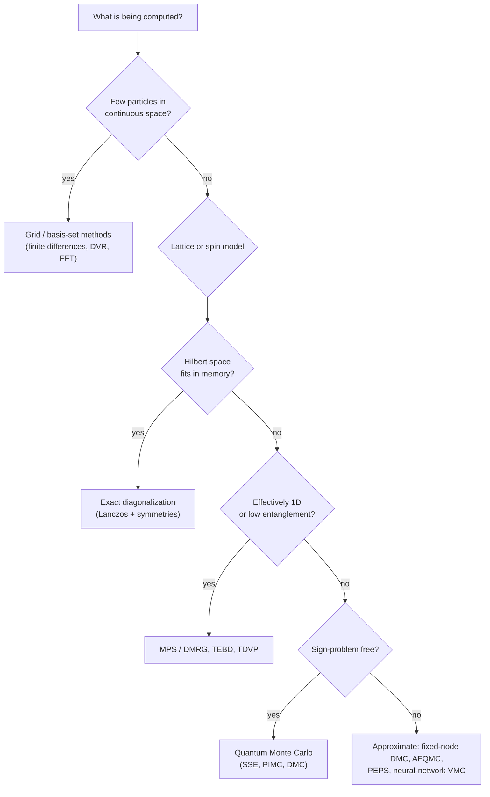
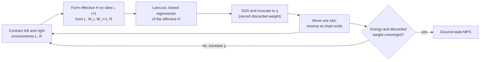
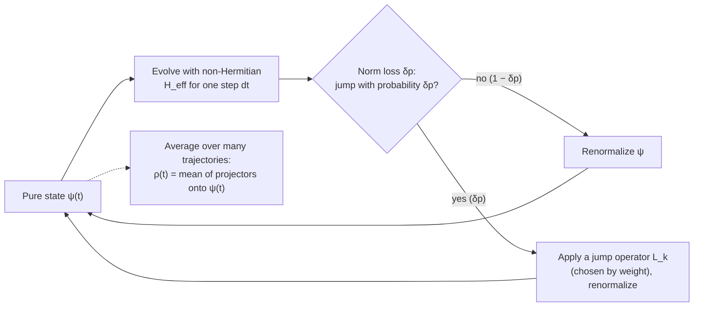

## Computational Methods

[Quantum Mechanics](./) &raquo; Computational Methods

Most quantum problems of practical interest have no closed-form solution. This page surveys the numerical methods used to solve them: grid discretization for few-body problems, exact diagonalization, tensor networks, quantum Monte Carlo, neural-network wavefunctions, and time propagation for closed, driven and open systems. It assumes the operator language of [States, Operators & Dynamics](formalism.html) and, for open systems, the density-matrix material on [Advanced Formalism](qm-advanced-formalism.html). Electronic-structure methods for molecules and solids (Hartree–Fock, DFT, coupled cluster) are covered separately under [Computational Physics](../computational-physics/electronic-structure-beyond-dft.html).

Code examples use Python with NumPy/SciPy and, where noted, QuTiP 5 and TeNPy 1.x. Units are $\hbar = m = 1$ unless stated otherwise.

## The Exponential Wall

The Hilbert space of $N$ subsystems, each of local dimension $d$, has dimension

$$
\dim \mathcal{H} = d^N .
$$

A generic state therefore needs $d^N$ complex amplitudes. For spin-1/2 ($d = 2$) stored in double-precision complex numbers (16 bytes each):

| Spins $N$ | Amplitudes | Memory for one state vector |
|---|---|---|
| 20 | $\approx 10^6$ | 16 MiB |
| 30 | $\approx 10^9$ | 16 GiB |
| 40 | $\approx 10^{12}$ | 16 TiB |
| 50 | $\approx 10^{15}$ | 16 PiB |

Every method below is a strategy for dealing with this growth:

- **Exact diagonalization** attacks it directly, using sparsity and symmetry to reach as large an $N$ as memory allows.
- **Tensor networks** exploit the fact that ground states of local Hamiltonians have limited entanglement, so they can be described by polynomially many parameters.
- **Quantum Monte Carlo** never stores the state; it samples it.
- **Variational and neural-network ansätze** restrict to a parameterized family and optimize within it.
- **Time propagation** applies $e^{-i\hat H t}$ to a vector without ever forming the exponential.

Which is appropriate depends on dimensionality, entanglement, whether the problem has a sign problem, and whether statics or dynamics are wanted.



## Grid and Basis-Set Methods

For one to three particles in continuous space, the direct approach is to discretize the wavefunction on a grid or expand it in a finite basis and solve a matrix eigenvalue problem.

- **Finite differences** replace $d^2/dx^2$ by $(\psi_{j+1} - 2\psi_j + \psi_{j-1})/\Delta x^2$, giving a sparse, tridiagonal Hamiltonian with error $O(\Delta x^2)$.
- **Discrete variable representations (DVR)** and **Fourier grid** methods evaluate the kinetic energy exactly in a spectral basis. They converge exponentially for smooth potentials and need far fewer points.
- **Basis-set expansions** (harmonic-oscillator functions, Gaussians, B-splines) give small dense matrices and are the standard in atomic and molecular physics.
- The **shooting method** integrates the 1D equation outward from each boundary and adjusts $E$ until the solutions match; it is simple but does not generalize beyond 1D.

The finite-difference harmonic oscillator is a useful correctness check, since the exact eigenvalues are $n + \tfrac12$:

```python
import numpy as np
import scipy.sparse as sp
from scipy.sparse.linalg import eigsh

def fd_hamiltonian(x, V, hbar=1.0, m=1.0):
    """Second-order finite-difference Hamiltonian on a uniform grid (Dirichlet walls)."""
    dx = x[1] - x[0]
    n = x.size
    lap = sp.diags([1.0, -2.0, 1.0], [-1, 0, 1], shape=(n, n)) / dx**2
    return (-(hbar**2) / (2 * m) * lap + sp.diags(V(x))).tocsr()

x = np.linspace(-10, 10, 2001)
H = fd_hamiltonian(x, lambda x: 0.5 * x**2)
E, psi = eigsh(H, k=5, which="SA")
psi /= np.sqrt(x[1] - x[0])       # normalize so that sum |psi|^2 dx = 1
print(np.round(E, 5))             # [0.5 1.49998 2.49996 3.49992 4.49987]
```

The same grid Hamiltonian is the starting point for the [time-propagation methods](#time-propagation) below. Grid methods scale as $n^{D}$ for $n$ points per dimension in $D$ dimensions, so they become impractical beyond three or four degrees of freedom; multi-configuration methods such as MCTDH extend them to tens of coupled modes.

## Exact Diagonalization

Exact diagonalization (ED) constructs the Hamiltonian in the full many-body basis and diagonalizes it numerically. It is exact up to finite-size effects and is the reference against which approximate methods are tested.

### Building a sparse Hamiltonian

For a spin chain the basis states are the $2^N$ strings $\lvert s_1 s_2\cdots s_N\rangle$. For the transverse-field Ising model (TFIM),

$$
\hat{H} = -J \sum_{i} \hat{\sigma}^z_i \hat{\sigma}^z_{i+1} - h \sum_i \hat{\sigma}^x_i ,
$$

the $\hat\sigma^z\hat\sigma^z$ terms are diagonal and each $\hat\sigma^x_i$ flips one spin. Every row has $O(N)$ nonzero entries out of $2^N$, so the matrix is extremely sparse.

```python
import numpy as np
import scipy.sparse as sp
from scipy.sparse.linalg import eigsh

sx = sp.csr_matrix([[0.0, 1.0], [1.0, 0.0]])
sz = sp.csr_matrix([[1.0, 0.0], [0.0, -1.0]])

def op_at(op, site, N):
    """Embed a single-site operator: 1 x ... x op x ... x 1."""
    left = sp.identity(2**site, format="csr")
    right = sp.identity(2**(N - site - 1), format="csr")
    return sp.kron(sp.kron(left, op), right, format="csr")

def tfim_hamiltonian(N, J=1.0, h=1.0, periodic=True):
    H = sp.csr_matrix((2**N, 2**N))
    for i in range(N if periodic else N - 1):
        H -= J * op_at(sz, i, N) @ op_at(sz, (i + 1) % N, N)
    for i in range(N):
        H -= h * op_at(sx, i, N)
    return H

N = 12
H = tfim_hamiltonian(N, J=1.0, h=1.0)       # critical point h = J
evals, evecs = eigsh(H, k=4, which="SA")   # Lanczos for the lowest 4 states
print(evals[0] / N)                        # -1.2769; thermodynamic limit -4/pi = -1.2732
```

The TFIM is real and symmetric, so real arithmetic halves the memory compared with complex storage. Production codes do not build operators by Kronecker products; they act with $\hat H$ directly on bit-string representations of basis states ("matrix-free" ED).

### Lanczos and other Krylov solvers

Dense diagonalization costs $O(D^3)$ time and $O(D^2)$ memory for $D = d^N$, which limits it to roughly 14–16 spins. The **Lanczos algorithm** instead builds the Krylov subspace

$$
\mathcal{K}_m = \operatorname{span}\left\{ \lvert v\rangle, \hat{H}\lvert v\rangle, \hat{H}^2\lvert v\rangle, \ldots, \hat{H}^{m-1}\lvert v\rangle \right\},
$$

in which $\hat H$ is represented by an $m\times m$ tridiagonal matrix. Its extreme eigenvalues converge to those of $\hat H$ after $m$ of order 100 iterations, each needing one sparse matrix–vector product. SciPy's `eigsh` uses ARPACK's implicitly restarted Lanczos method. Lanczos gives a few extremal eigenpairs; for interior eigenvalues (needed, for example, in studies of many-body localization) shift-invert or polynomial-filtering methods are used. Lanczos with a continued-fraction expansion also yields dynamical correlation functions $S(\mathbf{q},\omega)$ directly.

### Symmetries

If $[\hat H, \hat Q] = 0$, the Hamiltonian is block diagonal in the eigenbasis of $\hat Q$, and each block can be diagonalized separately.

| Symmetry | Quantum number | Typical reduction |
|---|---|---|
| U(1), e.g. total $S^z$ or particle number | $S^z_{\text{tot}}$, $N_{\text{particles}}$ | Largest sector $\binom{N}{N/2} \approx 2^N\sqrt{2/(\pi N)}$ |
| Lattice translation | Crystal momentum $k$ | Factor $\approx N$ |
| Reflection, spin inversion | Parity $\pm 1$ | Factor 2 each |
| Point group of a 2D cluster | Irreducible representation | Factor up to the group order |

With all symmetries and distributed-memory, matrix-free implementations, ED has reached spin-1/2 clusters of about 48 sites. Beyond ground states, full diagonalization of symmetry sectors of 16–22 spins gives complete spectra for level-statistics and eigenstate-thermalization studies. Libraries include QuSpin (Python) and many research codes.

## Tensor Networks and DMRG

Ground states of local, gapped Hamiltonians are not generic vectors in Hilbert space. They satisfy an **area law**: the entanglement entropy of a region grows with the size of its boundary rather than its volume. In 1D the boundary is a point, so the entanglement across any cut is bounded, and the state can be compressed efficiently. Critical 1D systems violate the area law only logarithmically, $S \sim (c/6)\ln \ell$ for open chains, where $c$ is the central charge.

### Matrix product states

A **matrix product state** (MPS) writes each amplitude as a product of matrices, one per site:

$$
\lvert\psi\rangle = \sum_{s_1 \cdots s_N} A^{[1]s_1} A^{[2]s_2} \cdots A^{[N]s_N} \; \lvert s_1 s_2 \cdots s_N\rangle ,
$$

where $A^{[i]s_i}$ is a $\chi_{i-1}\times\chi_i$ matrix. The **bond dimension** $\chi$ (often written $D$) bounds the entanglement the state can carry, $S \le \ln\chi$ across any cut. The number of parameters is $O(N d \chi^2)$, linear in $N$. Any state can be written exactly with $\chi = d^{N/2}$; for gapped ground states, $\chi$ of a few hundred typically gives energies accurate to near machine precision.

<figure style="margin:1.5em auto; max-width:560px;">
<svg viewBox="0 0 520 170" xmlns="http://www.w3.org/2000/svg" role="img" aria-label="Five-site matrix product state: a chain of tensors joined by bond legs of dimension chi, each with one physical leg s1 to s5" style="width:100%; height:auto; font-family:sans-serif; color:currentColor;">
  <g stroke="currentColor" stroke-width="2.4">
    <line x1="60" y1="70" x2="420" y2="70"/>
    <line x1="60" y1="88" x2="60" y2="128"/>
    <line x1="150" y1="88" x2="150" y2="128"/>
    <line x1="240" y1="88" x2="240" y2="128"/>
    <line x1="330" y1="88" x2="330" y2="128"/>
    <line x1="420" y1="88" x2="420" y2="128"/>
  </g>
  <g fill="currentColor" fill-opacity="0.15" stroke="currentColor" stroke-width="2">
    <circle cx="60" cy="70" r="18"/>
    <circle cx="150" cy="70" r="18"/>
    <circle cx="240" cy="70" r="18"/>
    <circle cx="330" cy="70" r="18"/>
    <circle cx="420" cy="70" r="18"/>
  </g>
  <g fill="currentColor" font-size="13" text-anchor="middle">
    <text x="60" y="75">A¹</text>
    <text x="150" y="75">A²</text>
    <text x="240" y="75">A³</text>
    <text x="330" y="75">A⁴</text>
    <text x="420" y="75">A⁵</text>
    <text x="60" y="148">s₁</text>
    <text x="150" y="148">s₂</text>
    <text x="240" y="148">s₃</text>
    <text x="330" y="148">s₄</text>
    <text x="420" y="148">s₅</text>
    <text x="105" y="60">χ</text>
    <text x="195" y="60">χ</text>
    <text x="285" y="60">χ</text>
    <text x="375" y="60">χ</text>
  </g>
  <text x="470" y="150" font-size="12" fill="currentColor">physical</text>
  <text x="470" y="30" font-size="12" fill="currentColor" text-anchor="end">bond (virtual) legs, dimension χ</text>
</svg>
<figcaption style="font-size:0.9em; text-align:center;">Tensor-network notation: each circle is a tensor, each leg an index, and a connected leg is a summed index. The open legs are the physical spins.</figcaption>
</figure>

Any state vector can be converted to an MPS by repeated singular value decompositions. Truncating the smallest singular values at each cut gives the optimal approximation at that bond dimension, and the sum of the discarded squared singular values bounds the error:

```python
import numpy as np

def to_mps(psi, N, d=2, chi_max=None, tol=1e-12):
    """Left-canonical MPS of a state vector via successive SVDs.
    Returns the tensors (shape chi_left x d x chi_right) and the discarded weight."""
    tensors, discarded = [], 0.0
    rest = psi.reshape(1, -1)
    for _ in range(N - 1):
        chi_left = rest.shape[0]
        U, S, Vh = np.linalg.svd(rest.reshape(chi_left * d, -1), full_matrices=False)
        keep = S > tol * S[0]
        if chi_max is not None:
            keep[chi_max:] = False
        discarded += np.sum(S[~keep] ** 2)
        U, S, Vh = U[:, keep], S[keep], Vh[keep]
        tensors.append(U.reshape(chi_left, d, -1))
        rest = np.diag(S) @ Vh
    tensors.append(rest.reshape(-1, d, 1))
    return tensors, discarded

# Compress the 12-site TFIM ground state from the ED example above
mps, err = to_mps(evecs[:, 0], N=12, chi_max=8)
print([A.shape[2] for A in mps], err)   # bonds grow 2, 4, 8, ... ; discarded weight ~4e-5
```

This exact-then-compress route is only a demonstration, since it starts from the full vector. Practical algorithms work with the MPS throughout.

### Matrix product operators

Operators are written the same way as a **matrix product operator** (MPO), a chain of four-index tensors. Local Hamiltonians have small MPOs: the TFIM needs bond dimension 3, and any Hamiltonian with nearest-neighbour terms needs a bond dimension of 2 plus the number of distinct two-site terms. The MPO acts like a finite-state machine that, reading along the chain, is in one of a few states ("nothing placed yet", "first half of a bond placed", "term complete").

### DMRG

The **density-matrix renormalization group** (White, 1992) is, in modern language, a variational minimization of $\langle\psi\vert\hat H\vert\psi\rangle$ over MPS of fixed bond dimension. It optimizes one or two tensors at a time and sweeps back and forth along the chain:



The local problem has dimension $d^2\chi^2$, so a sweep costs $O(N d^3 \chi^3)$ with a two-site update. The energy decreases monotonically, and extrapolating it against the discarded weight gives an error estimate. For 1D gapped systems DMRG is effectively exact; it is also widely used in quantum chemistry for strongly correlated active spaces.

With TeNPy the full calculation is a few lines (the TFIM in TeNPy's convention is $-J\sum\sigma^x\sigma^x - g\sum\sigma^z$):

```python
from tenpy.algorithms import dmrg
from tenpy.models.tf_ising import TFIChain
from tenpy.networks.mps import MPS

M = TFIChain({"L": 32, "J": 1.0, "g": 1.0, "bc_MPS": "finite", "conserve": None})
psi = MPS.from_product_state(M.lat.mps_sites(), ["up"] * M.lat.N_sites, bc=M.lat.bc_MPS)
info = dmrg.run(psi, M, {
    "mixer": True,
    "max_E_err": 1e-10,
    "trunc_params": {"chi_max": 64, "svd_min": 1e-10},
})
print(info["E"], psi.chi)
print(psi.entanglement_entropy())   # grows logarithmically toward the chain centre at criticality
```

### Dynamics and higher dimensions

- **Real-time evolution**: TEBD applies Trotterized two-site gates and re-truncates after each; the **time-dependent variational principle** (TDVP) projects the Schrödinger equation onto the MPS manifold and handles long-range interactions. Both are limited by entanglement growth: after a quench the entanglement typically grows linearly in time, so the required $\chi$ grows exponentially.
- **Two dimensions**: an MPS wrapped on a cylinder of width $W$ needs $\chi \sim e^{W}$, so DMRG works up to moderate widths (about 6–12 sites depending on the model). **PEPS** (projected entangled pair states) obey the 2D area law by construction but are expensive to contract exactly; approximate contraction schemes (boundary MPS, corner transfer matrices, belief propagation) make them practical.
- **Simulating quantum processors**: tensor networks are the main classical competitor to near-term quantum experiments. IBM's 127-qubit "utility" experiment (Kim et al., *Nature* 618, 500 (2023)) was reproduced more accurately with a belief-propagation tensor network adapted to the heavy-hex lattice ([Tindall et al., *PRX Quantum* 5, 010308 (2024)](https://arxiv.org/abs/2306.14887)).

## Quantum Monte Carlo

Quantum Monte Carlo (QMC) samples configurations stochastically instead of storing the state. The statistical error scales as $1/\sqrt{N_{\text{samples}}}$ independently of system size, so QMC reaches thousands of particles in any dimension. Its limitation is the sign problem.

### Variational Monte Carlo

Variational Monte Carlo (VMC) estimates the energy of a trial wavefunction $\psi_T$. Writing the expectation value as an average over configurations $\mathbf{x}$,

$$
E[\psi_T] = \frac{\langle \psi_T \vert \hat{H} \vert \psi_T \rangle}{\langle \psi_T \vert \psi_T \rangle}
= \int p(\mathbf x)\, E_{\text{loc}}(\mathbf{x})\, d\mathbf x,
\qquad
p(\mathbf x) = \frac{\lvert\psi_T(\mathbf{x})\rvert^2}{\int \lvert\psi_T\rvert^2},
\qquad
E_{\text{loc}}(\mathbf{x}) = \frac{(\hat{H}\psi_T)(\mathbf{x})}{\psi_T(\mathbf{x})} .
$$

Configurations are drawn from $p(\mathbf x)$ by the Metropolis algorithm, which needs only ratios $\lvert\psi_T(\mathbf x')/\psi_T(\mathbf x)\rvert^2$, so the normalization is never computed. If $\psi_T$ is an exact eigenstate, $E_{\text{loc}}$ is constant and the variance vanishes (**zero-variance principle**); the variance is therefore a direct measure of trial-function quality.

For the harmonic oscillator with $\psi_T = e^{-a x^2}$, the local energy is $E_{\text{loc}} = a + x^2(\tfrac12 - 2a^2)$:

```python
import numpy as np

def vmc_harmonic(a, n_steps=200_000, step=1.0, burn_in=1_000, seed=0):
    """VMC energy and variance for psi_T = exp(-a x^2), H = -1/2 d^2/dx^2 + x^2/2."""
    rng = np.random.default_rng(seed)
    x, energies = 0.0, []
    for i in range(n_steps):
        x_new = x + step * rng.uniform(-1, 1)
        # Metropolis acceptance with probability |psi(x_new)/psi(x)|^2
        if rng.random() < np.exp(-2 * a * (x_new**2 - x**2)):
            x = x_new
        if i >= burn_in:
            energies.append(a + x**2 * (0.5 - 2 * a**2))
    e = np.asarray(energies)
    return e.mean(), e.var()

for a in (0.3, 0.5, 0.7):
    print(a, vmc_harmonic(a))   # a = 0.5 gives E = 0.5 with zero variance
```

Successive samples are correlated, so error bars must account for the autocorrelation time (for example by blocking/binning). The trial-function parameters are optimized by minimizing the energy or its variance; for many parameters the **stochastic reconfiguration** method (a natural-gradient scheme) is standard.

### Neural-network quantum states

Carleo and Troyer ([*Science* 355, 602 (2017)](https://arxiv.org/abs/1606.02318)) proposed using a neural network as the VMC ansatz: the network maps a configuration to an amplitude $\psi_\theta(\mathbf x)$, and $\theta$ is trained by stochastic reconfiguration. Architectures have since moved from restricted Boltzmann machines to convolutional networks and transformers. In continuous space, FermiNet and PauliNet represent many-electron wavefunctions with antisymmetric networks and reach high accuracy for small molecules. Neural-network states are not limited by the area law, which makes them attractive for 2D frustrated magnets, but optimization can be difficult and accuracy is not guaranteed. NetKet is a widely used library.

### Projector methods: diffusion and auxiliary-field QMC

Projector methods improve on the trial state by imaginary-time evolution:

$$
e^{-\tau \hat{H}} \lvert\psi_T\rangle = \sum_n e^{-\tau E_n} c_n \lvert n\rangle \;\longrightarrow\; c_0\, e^{-\tau E_0} \lvert 0\rangle \quad (\tau \to \infty),
$$

provided $c_0 = \langle 0\vert\psi_T\rangle \ne 0$. Excited-state components decay faster, leaving the ground state.

- **Diffusion Monte Carlo** (DMC) works in real space. The kinetic term becomes a diffusion of walkers and the potential term a birth–death (branching) process, with $\psi_T$ used for importance sampling. It is exact for bosonic ground states.
- **Auxiliary-field QMC** (AFQMC) decouples two-body interactions with a Hubbard–Stratonovich transformation and samples Slater determinants. It is used for lattice fermion models and increasingly for ab initio chemistry.
- **Finite-temperature methods**: path-integral Monte Carlo samples the ring-polymer representation of $e^{-\beta\hat H}$ (see [Advanced Formalism](qm-advanced-formalism.html#imaginary-time-and-statistical-mechanics)), and the stochastic series expansion (SSE) handles lattice spin models.

### The sign problem

For fermions and frustrated spins, the weights in these expansions are not all positive. Sampling $\lvert w\rvert$ and attaching the sign to the observable works in principle, but the average sign decays exponentially:

$$
\langle \operatorname{sign} \rangle \sim e^{-\beta N \Delta f}, \qquad
\frac{\sigma_{\langle O\rangle}}{\langle O\rangle} \sim \frac{e^{\beta N \Delta f}}{\sqrt{N_{\text{samples}}}},
$$

where $\Delta f > 0$ is the free-energy density difference between the true system and the one with weights $\lvert w\rvert$. Troyer and Wiese (2005) showed that a general solution would imply efficient algorithms for NP-hard problems. The practical workarounds are:

- models that are sign-free (**stoquastic**) in a suitable basis: bosons, unfrustrated antiferromagnets on bipartite lattices, the half-filled Hubbard model on bipartite lattices in AFQMC;
- controlled approximations: the **fixed-node** approximation in DMC (exact if the nodes of $\psi_T$ are exact) and the constrained-path or phaseless approximation in AFQMC;
- choosing a basis in which the sign problem is milder.

## Time Propagation

Static methods find eigenstates; dynamics requires applying the propagator. For a time-independent Hamiltonian,

$$
\lvert\psi(t)\rangle = e^{-i\hat{H}t/\hbar}\lvert\psi(0)\rangle ,
$$

and the numerical task is to apply this exponential to a vector without forming the matrix exponential, which would be dense.

| Method | Unitary? | Error per step | Best suited to |
|---|---|---|---|
| General ODE integrator (RK45) | No; norm drifts | Adaptive | Arbitrary time dependence, small systems |
| Crank–Nicolson | Yes | $O(\Delta t^3)$ | Grid problems; needs a sparse linear solve per step |
| Split-operator / Trotter | Yes | $O(\Delta t^3)$ (second order) | $\hat H = \hat T + \hat V$ on grids; local lattice terms |
| Krylov (Lanczos) propagation | To working precision | Controllable, exponential in $m$ | Large sparse $\hat H$, long steps |
| Chebyshev expansion | To working precision | Controllable | Time-independent $\hat H$ with known spectral bounds |

### Direct integration

Treating the Schrödinger equation as a system of ODEs and passing it to a general-purpose integrator handles arbitrary time dependence. Standard Runge–Kutta schemes are not unitary, so the norm and energy drift unless tolerances are tight; they are suitable for small systems and short times.

```python
import numpy as np
from scipy.integrate import solve_ivp

def propagate_ode(H, psi0, t_eval):
    """Integrate i d|psi>/dt = H |psi> (hbar = 1) with an adaptive Runge-Kutta method."""
    sol = solve_ivp(lambda t, y: -1j * (H @ y), (t_eval[0], t_eval[-1]),
                    psi0.astype(complex), t_eval=t_eval, rtol=1e-9, atol=1e-11)
    return sol.y   # column k is |psi(t_eval[k])>
```

### Split-operator and Trotter methods

For $\hat H = \hat T + \hat V$, the **split-operator** method applies $\hat V$ in position space and $\hat T$ in momentum space, switching between them with the FFT. The symmetric (Strang) splitting,

$$
e^{-i\hat{H}\Delta t/\hbar} = e^{-i\hat{V}\Delta t/2\hbar}\; e^{-i\hat{T}\Delta t/\hbar}\; e^{-i\hat{V}\Delta t/2\hbar} + O(\Delta t^3),
$$

is exactly unitary because each factor is. The local error is $O(\Delta t^3)$ and the global error $O(\Delta t^2)$; Suzuki's recursive construction gives fourth- and higher-order splittings at the cost of more exponentials per step. The same Trotter idea underlies TEBD for MPS and Trotterized Hamiltonian simulation on quantum computers.

```python
import numpy as np

n, L = 1024, 40.0
x = np.linspace(-L / 2, L / 2, n, endpoint=False)
k = 2 * np.pi * np.fft.fftfreq(n, d=L / n)      # angular wavenumbers matching np.fft ordering
V = 0.5 * x**2

def split_operator_step(psi, V, k, dt, hbar=1.0, m=1.0):
    """One Strang step for H = p^2/2m + V(x) on a periodic grid."""
    half_v = np.exp(-0.5j * V * dt / hbar)
    psi = half_v * psi
    psi = np.fft.ifft(np.exp(-0.5j * hbar * k**2 * dt / m) * np.fft.fft(psi))
    return half_v * psi

# A displaced Gaussian oscillates classically: after half a period <x> goes from 3 to -3
psi = np.exp(-(x - 3) ** 2 / 2) / np.pi**0.25
dt = 0.01
for _ in range(round(np.pi / dt)):
    psi = split_operator_step(psi, V, k, dt)
dx = L / n
print(np.sum(np.abs(psi) ** 2) * dx, np.sum(x * np.abs(psi) ** 2) * dx)   # 1.0, -3.0
```

Replacing $\Delta t$ by $-i\Delta\tau$ and renormalizing after each step gives **imaginary-time propagation**, a simple way to relax any initial state to the ground state.

### Krylov-subspace propagation

For a large sparse $\hat H$, the most accurate general approach is to build an $m$-dimensional Krylov space from the current state with the Lanczos recursion, exponentiate the small tridiagonal matrix exactly, and map back. With $m$ of 20–40 the error is typically at machine precision for a step, and it can be estimated a posteriori. Expokit and most tensor-network and ED codes use this approach.

```python
import numpy as np
from scipy.linalg import eigh_tridiagonal

def krylov_step(H, psi, dt, m=30):
    """Approximate exp(-i H dt) |psi> in an m-dimensional Krylov space (hbar = 1).
    No reorthogonalization: adequate for modest m and short steps."""
    beta0 = np.linalg.norm(psi)
    V = np.zeros((psi.size, m), dtype=complex)
    alpha, beta = np.zeros(m), np.zeros(m - 1)
    V[:, 0] = psi / beta0
    for j in range(m):
        w = H @ V[:, j]
        alpha[j] = np.vdot(V[:, j], w).real
        w = w - alpha[j] * V[:, j] - (beta[j - 1] * V[:, j - 1] if j > 0 else 0)
        if j == m - 1:
            break
        beta[j] = np.linalg.norm(w)
        if beta[j] < 1e-12:          # invariant subspace found: Krylov space is exact
            m = j + 1
            break
        V[:, j + 1] = w / beta[j]
    theta, S = eigh_tridiagonal(alpha[:m], beta[:m - 1])
    coeffs = S @ (np.exp(-1j * theta * dt) * S[0, :])   # exp(-i T dt) e_1
    return beta0 * (V[:, :m] @ coeffs)
```

SciPy's `scipy.sparse.linalg.expm_multiply` computes the same action of the exponential but with a different algorithm, a truncated Taylor series with scaling (Al-Mohy and Higham, 2011); it accepts `start`, `stop` and `num` arguments to return the state on a uniform time grid.

### Periodically driven systems: Floquet theory

If $\hat H(t+T) = \hat H(t)$, **Floquet's theorem** (the time-domain analogue of Bloch's theorem) gives solutions of the form $\lvert\psi_n(t)\rangle = e^{-i\varepsilon_n t/\hbar}\lvert\phi_n(t)\rangle$ with $\lvert\phi_n(t+T)\rangle = \lvert\phi_n(t)\rangle$. The **quasienergies** $\varepsilon_n$ are defined modulo $\hbar\omega = 2\pi\hbar/T$ and are obtained by diagonalizing the one-period propagator $\hat U(T)$, whose eigenvalues are $e^{-i\varepsilon_n T/\hbar}$. This captures the stroboscopic dynamics at all later times and is the basis of **Floquet engineering** (designing effective Hamiltonians by periodic driving). QuTiP 5 provides this through `FloquetBasis`:

```python
import numpy as np
import qutip as qt

delta, eps0, A, omega = 0.2 * 2 * np.pi, 1.0 * 2 * np.pi, 2.5 * 2 * np.pi, 1.0 * 2 * np.pi
T = 2 * np.pi / omega

H0 = -delta / 2 * qt.sigmax() - eps0 / 2 * qt.sigmaz()
H1 = A / 2 * qt.sigmaz()
H = [H0, [H1, "sin(w * t)"]]          # QuTiP list format: H0 + H1 sin(w t)

floquet = qt.FloquetBasis(H, T, args={"w": omega})
print(floquet.e_quasi)                # quasienergies, here approx [-2.831, 2.831]
```

### Open Systems and Lindblad Dynamics

A system coupled to a Markovian environment obeys the [Lindblad master equation](qm-advanced-formalism.html#open-quantum-systems-and-the-lindblad-equation):

$$
\frac{d\hat{\rho}}{dt} = -\frac{i}{\hbar}[\hat{H}, \hat{\rho}] + \sum_k \gamma_k \left( \hat{L}_k \hat{\rho}\hat{L}_k^\dagger - \frac{1}{2}\left\{ \hat{L}_k^\dagger \hat{L}_k, \hat{\rho} \right\} \right).
$$

There are two ways to solve it numerically:

- **Direct integration** of the vectorized density matrix, a vector of length $D^2$ acted on by a $D^2\times D^2$ Liouvillian superoperator. Steady states are the null vector of the Liouvillian.
- **Quantum trajectories** (Monte Carlo wavefunction method): evolve pure states of length $D$ under the non-Hermitian effective Hamiltonian $\hat H_{\text{eff}} = \hat H - \tfrac{i\hbar}{2}\sum_k \gamma_k \hat L_k^\dagger\hat L_k$, interrupted by random jumps $\lvert\psi\rangle \to \hat L_k\lvert\psi\rangle$. The average over trajectories reproduces $\hat\rho(t)$, with statistical error $\propto 1/\sqrt{N_{\text{traj}}}$. This trades memory ($D$ instead of $D^2$) for sampling and is also a physical model of continuously monitored systems.



For large open systems, both approaches combine with tensor networks (MPO representations of $\hat\rho$, or MPS trajectories), and non-Markovian baths are treated with the hierarchical equations of motion (HEOM) or process-tensor methods.

## Worked Example: A Damped, Driven Qubit in QuTiP

[QuTiP](https://qutip.org/) (version 5.3 at the time of writing) implements most of the propagators above. The example drives a two-level system resonantly (Rabi frequency $\Omega$) while it decays at rate $\gamma_1 = 1/T_1$ and dephases at rate $\gamma_\phi$, and compares the master-equation solution with a trajectory average.

```python
import numpy as np
import qutip as qt

g, e = qt.basis(2, 0), qt.basis(2, 1)        # ground and excited state
sm = g * e.dag()                             # lowering operator |g><e|
sz = e.proj() - g.proj()

Omega = 2 * np.pi * 1.0                      # Rabi frequency
gamma1, gamma_phi = 0.5, 0.2                 # decay and pure-dephasing rates

H = 0.5 * Omega * (sm + sm.dag())            # resonant drive, rotating frame
c_ops = [np.sqrt(gamma1) * sm,               # spontaneous emission (T1)
         np.sqrt(gamma_phi / 2) * sz]        # pure dephasing: coherences decay at gamma_phi
tlist = np.linspace(0, 10, 501)

me = qt.mesolve(H, g, tlist, c_ops=c_ops, e_ops=[e.proj()])
mc = qt.mcsolve(H, g, tlist, c_ops=c_ops, e_ops=[e.proj()], ntraj=500)

p_me, p_mc = me.expect[0], mc.expect[0]      # excited-state population vs time
print(p_me[-1], p_mc[-1])                    # both approach the steady state (about 0.49 here)
```

The excited-state population shows Rabi oscillations whose envelope decays toward a steady state; the trajectory average agrees with `mesolve` to within its sampling error (a few percent for 500 trajectories). Plotting `p_me` and `p_mc` against `tlist` with Matplotlib shows this directly.

## Choosing a Method

| Method | Best for | Cost and limits | Approximation |
|---|---|---|---|
| Grid / basis set | 1–3 particles in continuous space | $n^D$ points; impractical beyond a few degrees of freedom | Discretization, controllable |
| Exact diagonalization | Small lattices; full spectra; benchmarks | Exponential in $N$; about 48 spin-1/2 sites at the frontier | None beyond finite size |
| DMRG / MPS | 1D and quasi-1D ground states and low-lying states; strongly correlated chemistry | Polynomial in $N$; exponential in cylinder width | Truncation, controlled by discarded weight |
| TEBD / TDVP | 1D real-time dynamics | Fails once entanglement has grown (typically linear in time after a quench) | Truncation per step |
| PEPS and 2D networks | 2D ground states | High polynomial cost in $\chi$; approximate contraction | Truncation and contraction error |
| QMC (SSE, PIMC, DMC) | Large sign-free systems in any dimension; finite temperature | Statistical error $\propto 1/\sqrt{N_{\text{samples}}}$; sign problem | Statistical; fixed-node bias for fermions |
| Neural-network VMC | Frustrated and 2D systems, continuum electrons | Optimization cost; no a-priori accuracy guarantee | Variational |
| Time propagation (split-operator, Krylov) | Real- and imaginary-time dynamics, driven and open systems | One sparse matrix–vector product per Krylov vector | Trotter or Krylov error, controllable |

## Software

| Package | Language | Focus |
|---|---|---|
| [QuTiP](https://qutip.org/) | Python | Closed and open system dynamics, master equations, trajectories, Floquet |
| [QuSpin](https://quspin.github.io/QuSpin/) | Python | Exact diagonalization and dynamics of spin, boson and fermion lattice models with symmetries |
| [ITensor](https://itensor.org/) | Julia | Tensor networks: DMRG, TDVP, general tensor algebra |
| [TeNPy](https://github.com/tenpy/tenpy) | Python | MPS algorithms: DMRG, TEBD, TDVP, infinite-system variants |
| [quimb](https://github.com/jcmgray/quimb) | Python | Tensor networks, including arbitrary-geometry contraction and quantum-circuit simulation |
| [NetKet](https://www.netket.org/) | Python (JAX) | Neural-network quantum states and VMC |

## Further Reading

- U. Schollwöck, "The density-matrix renormalization group in the age of matrix product states," *Ann. Phys.* 326, 96 (2011), [arXiv:1008.3477](https://arxiv.org/abs/1008.3477).
- J. Eisert, M. Cramer and M. B. Plenio, "Area laws for the entanglement entropy," *Rev. Mod. Phys.* 82, 277 (2010), [arXiv:0808.3773](https://arxiv.org/abs/0808.3773).
- J. I. Cirac, D. Pérez-García, N. Schuch and F. Verstraete, "Matrix product states and projected entangled pair states: concepts, symmetries, theorems," *Rev. Mod. Phys.* 93, 045003 (2021), [arXiv:2011.12127](https://arxiv.org/abs/2011.12127).
- F. Becca and S. Sorella, *Quantum Monte Carlo Approaches for Correlated Systems* (Cambridge, 2017).
- M. Troyer and U.-J. Wiese, "Computational complexity and fundamental limitations to fermionic quantum Monte Carlo simulations," *Phys. Rev. Lett.* 94, 170201 (2005).
- G. Carleo and M. Troyer, "Solving the quantum many-body problem with artificial neural networks," *Science* 355, 602 (2017).
- A. J. Daley, "Quantum trajectories and open many-body quantum systems," *Adv. Phys.* 63, 77 (2014).

## See Also

- [Quantum Mechanics Hub](./)
- [Advanced Formalism](qm-advanced-formalism.html): density matrices, the Lindblad equation and the imaginary-time path integral used here.
- [Systems &amp; Phenomena](systems-and-phenomena.html): exactly solvable systems used to validate numerical codes.
- [Quantum Computing](qm-computing.html): quantum hardware as a simulator for problems beyond classical methods.
- [Research Frontiers](qm-research-frontiers.html): the physics of entanglement, tensor networks and many-body systems.
- [Computational Physics: Quantum Methods](../computational-physics/quantum-methods.html) and [Electronic Structure Beyond DFT](../computational-physics/electronic-structure-beyond-dft.html).
- [Statistical Mechanics](../statistical-mechanics/): finite-temperature ensembles and classical Monte Carlo.
