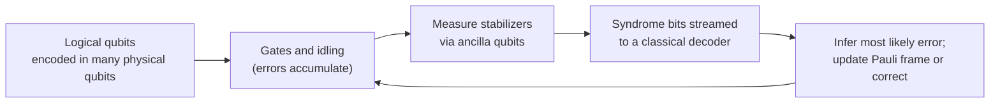

## Quantum Computing

[Quantum Mechanics](./) &raquo; Quantum Computing

This page treats quantum computing as applied quantum mechanics: what a qubit is as a two-level system, how gates act as unitary rotations, why entanglement and interference are the resources behind quantum speedups, and how decoherence and error correction set the practical limits. It closes with the state of hardware and error correction as of late 2026. Software frameworks and the computer-science side of algorithms are covered in the [Quantum Computing](../../quantum-computing/) technology hub and [Quantum Algorithms Research](../../advanced/quantum-algorithms-research/). The formal tools used here (density matrices, channels, the Lindblad equation) are developed on [Advanced Formalism](qm-advanced-formalism.html).

## Qubits and the Bloch Sphere

A classical bit takes one of two values. A **qubit** is any quantum two-level system, and its state can be a superposition

$$
\lvert\psi\rangle = \alpha\lvert 0\rangle + \beta\lvert 1\rangle, \qquad \lvert\alpha\rvert^2 + \lvert\beta\rvert^2 = 1, \qquad
\lvert 0\rangle = \begin{pmatrix} 1 \\ 0 \end{pmatrix}, \quad \lvert 1\rangle = \begin{pmatrix} 0 \\ 1 \end{pmatrix},
$$

with $\alpha,\beta\in\mathbb{C}$. By the Born rule, a measurement in the **computational basis** $\lbrace\lvert 0\rangle,\lvert 1\rangle\rbrace$ gives 0 with probability $\lvert\alpha\rvert^2$ and 1 with probability $\lvert\beta\rvert^2$.

A qubit has a continuum of states, but measuring it yields a single classical bit; Holevo's theorem shows that $n$ qubits can convey at most $n$ bits of classical information. The advantage lies elsewhere. A register of $n$ qubits has a $2^n$-dimensional state space $(\mathbb{C}^2)^{\otimes n}$, and a generic state needs $2^n$ complex amplitudes to describe classically. Quantum algorithms manipulate those amplitudes with interference so that measurement is likely to reveal a useful answer.

### The Bloch sphere

<p class="referenceBoxes type3"><a href="https://en.wikipedia.org/wiki/Bloch_sphere"> Article: <b><i>Bloch sphere - Wikipedia</i></b></a></p>

A pure qubit state has four real parameters; normalization removes one and the unobservable global phase another. The remaining two are angles on a sphere:

$$
\lvert\psi\rangle = \cos\frac{\theta}{2}\,\lvert 0\rangle + e^{i\varphi}\sin\frac{\theta}{2}\,\lvert 1\rangle,
\qquad 0 \le \theta \le \pi,\quad 0 \le \varphi < 2\pi .
$$

The corresponding **Bloch vector** is $\mathbf r = (\sin\theta\cos\varphi, \sin\theta\sin\varphi, \cos\theta)$, and the density operator is

$$
\hat\rho = \frac{1}{2}\left(\mathbb{1} + \mathbf{r}\cdot\boldsymbol{\sigma}\right), \qquad \lvert\mathbf r\rvert \le 1 ,
$$

where $\boldsymbol\sigma = (\hat\sigma_x,\hat\sigma_y,\hat\sigma_z)$. Pure states lie on the surface ($\lvert\mathbf r\rvert = 1$), mixed states inside, and the maximally mixed state $\mathbb{1}/2$ at the centre. The components of $\mathbf r$ are the expectation values $\langle\hat\sigma_x\rangle$, $\langle\hat\sigma_y\rangle$, $\langle\hat\sigma_z\rangle$.

<figure style="margin:1.5em auto; max-width:420px;">
<svg viewBox="0 0 360 340" xmlns="http://www.w3.org/2000/svg" role="img" aria-label="Bloch sphere with |0> at the north pole, |1> at the south pole, |+> and |+i> on the equator, and a state vector at polar angle theta and azimuth phi" style="width:100%; height:auto; font-family:sans-serif; color:currentColor;">
  <defs>
    <marker id="qmc-arrow" viewBox="0 0 10 10" refX="9" refY="5" markerWidth="7" markerHeight="7" orient="auto-start-reverse">
      <path d="M0 0 L10 5 L0 10 z" fill="currentColor"/>
    </marker>
  </defs>
  <circle cx="180" cy="170" r="120" fill="currentColor" fill-opacity="0.05" stroke="currentColor" stroke-width="1.6"/>
  <ellipse cx="180" cy="170" rx="120" ry="34" fill="none" stroke="currentColor" stroke-width="1" stroke-dasharray="5 4" opacity="0.7"/>
  <g stroke="currentColor" stroke-width="1" opacity="0.6">
    <line x1="180" y1="170" x2="180" y2="30"/>
    <line x1="180" y1="170" x2="180" y2="310"/>
    <line x1="180" y1="170" x2="320" y2="170"/>
    <line x1="180" y1="170" x2="112" y2="214"/>
  </g>
  <line x1="180" y1="170" x2="262" y2="92" stroke="currentColor" stroke-width="2.6" marker-end="url(#qmc-arrow)"/>
  <line x1="262" y1="92" x2="262" y2="190" stroke="currentColor" stroke-width="1" stroke-dasharray="3 3" opacity="0.7"/>
  <line x1="180" y1="170" x2="262" y2="190" stroke="currentColor" stroke-width="1" stroke-dasharray="3 3" opacity="0.7"/>
  <path d="M180 120 A 50 50 0 0 1 216 135" fill="none" stroke="currentColor" stroke-width="1.2"/>
  <path d="M150 190 A 40 14 0 0 0 214 182" fill="none" stroke="currentColor" stroke-width="1.2"/>
  <circle cx="180" cy="50" r="3.5" fill="currentColor"/>
  <circle cx="180" cy="290" r="3.5" fill="currentColor"/>
  <g fill="currentColor" font-size="14">
    <text x="190" y="46">|0⟩</text>
    <text x="190" y="304">|1⟩</text>
    <text x="284" y="162">|+i⟩ (y)</text>
    <text x="72" y="236">|+⟩ (x)</text>
    <text x="268" y="88">r</text>
    <text x="198" y="116" font-size="13">θ</text>
    <text x="176" y="210" font-size="13">φ</text>
    <text x="186" y="26" font-size="12">z</text>
  </g>
</svg>
<figcaption style="font-size:0.9em; text-align:center;">The Bloch sphere. Orthogonal states are antipodal; single-qubit gates are rotations; decoherence shrinks the vector toward the centre.</figcaption>
</figure>

Two points are easy to misread. First, antipodal points such as $\lvert 0\rangle$ and $\lvert 1\rangle$ are orthogonal states, not negatives of each other; the sphere is a picture of the projective state space, not of $\mathbb{C}^2$ itself. Second, the half-angle $\theta/2$ reflects the two-to-one map from SU(2) to the rotation group SO(3): a rotation by $2\pi$ multiplies a spinor by $-1$, which is an unobservable global phase for an isolated qubit but is observable in interference with a reference.

## Quantum Gates

Closed-system evolution is unitary, so a **gate** is a unitary $\hat U$ acting on one or a few qubits. Every gate is reversible ($\hat U^{-1} = \hat U^\dagger$), unlike classical AND or OR.

### Single-qubit gates

| Gate | Matrix | Action on the Bloch sphere |
|---|---|---|
| Pauli $X$ | $$\begin{pmatrix}0&1\\1&0\end{pmatrix}$$ | Rotation by $\pi$ about $x$ (bit flip) |
| Pauli $Y$ | $$\begin{pmatrix}0&-i\\i&0\end{pmatrix}$$ | Rotation by $\pi$ about $y$ |
| Pauli $Z$ | $$\begin{pmatrix}1&0\\0&-1\end{pmatrix}$$ | Rotation by $\pi$ about $z$ (phase flip) |
| Hadamard $H$ | $$\frac{1}{\sqrt2}\begin{pmatrix}1&1\\1&-1\end{pmatrix}$$ | Rotation by $\pi$ about $(x+z)/\sqrt2$; swaps the $Z$ and $X$ bases |
| Phase $S$ | $$\begin{pmatrix}1&0\\0&i\end{pmatrix}$$ | Rotation by $\pi/2$ about $z$ |
| $T$ | $$\begin{pmatrix}1&0\\0&e^{i\pi/4}\end{pmatrix}$$ | Rotation by $\pi/4$ about $z$ |

A general single-qubit gate is a rotation by angle $\gamma$ about a unit axis $\hat{\mathbf n}$, up to a global phase:

$$
\hat R_{\hat{\mathbf n}}(\gamma) = e^{-i\gamma\, \hat{\mathbf{n}}\cdot\boldsymbol{\sigma}/2}
= \cos\frac{\gamma}{2}\,\mathbb{1} - i\sin\frac{\gamma}{2}\,\hat{\mathbf{n}}\cdot\boldsymbol{\sigma} .
$$

Physically these are implemented by resonant pulses (microwave for superconducting and spin qubits, laser or microwave for atoms and ions): the pulse area sets $\gamma$ and the pulse phase sets the axis in the $xy$-plane, exactly as in NMR.

### Two-qubit gates and universality

Single-qubit gates acting on each qubit separately map product states to product states. Creating entanglement requires an interaction, expressed as an entangling two-qubit gate. The standard example is **CNOT**, which flips the target when the control is $\lvert 1\rangle$; in the basis $\lvert 00\rangle,\lvert 01\rangle,\lvert 10\rangle,\lvert 11\rangle$,

$$
\text{CNOT} = \begin{pmatrix} 1 & 0 & 0 & 0 \\ 0 & 1 & 0 & 0 \\ 0 & 0 & 0 & 1 \\ 0 & 0 & 1 & 0 \end{pmatrix}, \qquad
\text{CZ} = \operatorname{diag}(1, 1, 1, -1) .
$$

Hardware typically provides a native entangling gate such as CZ, iSWAP or the Mølmer–Sørensen $XX$ interaction. CZ and the Mølmer–Sørensen gate are equivalent to CNOT up to single-qubit gates; an iSWAP-type gate needs two applications to make a CNOT.

**Universality.** Any single-qubit gates together with any entangling two-qubit gate can generate every $n$-qubit unitary exactly. For fault tolerance a finite gate set is needed: $\lbrace H, T, \text{CNOT}\rbrace$ generates a dense subset of all unitaries, and the Solovay–Kitaev theorem guarantees that any single-qubit gate can be approximated to accuracy $\varepsilon$ with $O(\log^c(1/\varepsilon))$ gates. The gates $\lbrace H, S, \text{CNOT}\rbrace$ alone generate only the **Clifford group**, and by the **Gottesman–Knill theorem** Clifford circuits acting on computational-basis states with Pauli measurements can be simulated efficiently on a classical computer, despite producing highly entangled states. The non-Clifford $T$ gate is what makes the set universal, and in error-corrected machines it is the expensive resource (see [magic states](#fault-tolerant-gates-and-magic-states)).

## Entanglement as a Resource

Applying $H$ to the first qubit and then CNOT to $\lvert 00\rangle$ produces a maximally entangled state:

$$
\text{CNOT}\,(H\otimes \mathbb{1})\,\lvert 00\rangle
= \text{CNOT}\,\frac{\lvert 00\rangle + \lvert 10\rangle}{\sqrt2}
= \frac{\lvert 00\rangle + \lvert 11\rangle}{\sqrt2} \equiv \lvert\Phi^+\rangle .
$$

<figure style="margin:1.5em auto; max-width:460px;">
<svg viewBox="0 0 420 130" xmlns="http://www.w3.org/2000/svg" role="img" aria-label="Circuit: qubit 1 starts in |0>, passes through a Hadamard gate, then controls a CNOT on qubit 2 which starts in |0>; the output is the Bell state" style="width:100%; height:auto; font-family:sans-serif; color:currentColor;">
  <g stroke="currentColor" stroke-width="1.6">
    <line x1="60" y1="40" x2="340" y2="40"/>
    <line x1="60" y1="100" x2="340" y2="100"/>
    <line x1="230" y1="40" x2="230" y2="114"/>
  </g>
  <rect x="120" y="22" width="40" height="36" fill="currentColor" fill-opacity="0.1" stroke="currentColor" stroke-width="1.6"/>
  <text x="140" y="46" font-size="16" text-anchor="middle" fill="currentColor">H</text>
  <circle cx="230" cy="40" r="6" fill="currentColor"/>
  <circle cx="230" cy="100" r="14" fill="none" stroke="currentColor" stroke-width="1.6"/>
  <line x1="216" y1="100" x2="244" y2="100" stroke="currentColor" stroke-width="1.6"/>
  <g fill="currentColor" font-size="14">
    <text x="18" y="45">|0⟩</text>
    <text x="18" y="105">|0⟩</text>
    <text x="350" y="76">|Φ⁺⟩</text>
  </g>
  <path d="M342 34 Q 348 70 342 106" fill="none" stroke="currentColor" stroke-width="1.2"/>
</svg>
<figcaption style="font-size:0.9em; text-align:center;">Bell-state preparation: a Hadamard followed by a CNOT.</figcaption>
</figure>

The four **Bell states** form an orthonormal basis of two qubits:

$$
\lvert\Phi^{\pm}\rangle = \frac{\lvert 00\rangle \pm \lvert 11\rangle}{\sqrt2}, \qquad
\lvert\Psi^{\pm}\rangle = \frac{\lvert 01\rangle \pm \lvert 10\rangle}{\sqrt2}.
$$

A pure state is **entangled** if it is not a product $\lvert\psi_A\rangle\otimes\lvert\psi_B\rangle$. Equivalently, its reduced state is mixed:

$$
\hat\rho_A = \operatorname{Tr}_B\,\lvert\Phi^+\rangle\langle\Phi^+\rvert = \frac{1}{2}\mathbb{1} .
$$

The information is in the correlations, not in either qubit. The **entanglement entropy** $S(\hat\rho_A) = -\operatorname{Tr}\hat\rho_A\ln\hat\rho_A$ is zero for product states and $\ln 2$ (one **ebit**) for a Bell pair.

**No signalling.** Measuring one half of a Bell pair determines the correlated outcome on the other, but the local statistics on each side are unchanged by anything done to the other side. Correlations become visible only when results are compared over a classical channel (the **no-communication theorem**). The correlations do violate Bell inequalities, so they cannot be explained by local hidden variables; see [Bell Inequalities and Tests](bell-inequalities-and-tests.html).

**Entanglement as a consumable.** Communication protocols make the resource accounting explicit:

| Protocol | Consumes | Achieves |
|---|---|---|
| Teleportation | 1 ebit + 2 classical bits | Transfers 1 unknown qubit |
| Superdense coding | 1 ebit + 1 qubit sent | Transfers 2 classical bits |
| Entanglement swapping | 2 ebits (A–B, B–C) + Bell measurement at B | 1 ebit between A and C (basis of quantum repeaters) |

Teleportation respects no-cloning (the original is destroyed by the Bell measurement) and relativity (the two classical bits are required).

### Where the speedup comes from

A quantum computer does not "try every answer in parallel" in any useful sense: a uniform superposition over $2^n$ inputs, measured directly, returns one random input. Speedups come from **interference**. An algorithm arranges phases so that amplitudes for wrong answers cancel and amplitudes for the right answer add. Entanglement is necessary (a pure-state computation whose entanglement stays bounded can be simulated efficiently classically, for example with [matrix product states](qm-computational-methods.html#matrix-product-states)) but not sufficient (Clifford circuits are highly entangled yet classically simulable). Exponential speedups known so far rely on problem structure, such as periodicity in Shor's algorithm or the locality of physical Hamiltonians in quantum simulation.

## Quantum Algorithms

The sketches below focus on which quantum-mechanical feature produces the advantage.

| Algorithm | Problem | Quantum cost | Best known classical | Resource exploited |
|---|---|---|---|---|
| Shor (1994) | Factoring, discrete logarithm | Polynomial, $\tilde O((\log N)^2)$ to $O((\log N)^3)$ gates | Sub-exponential (number field sieve) | Periodicity via the QFT |
| Grover (1996) | Unstructured search over $N$ items | $O(\sqrt N)$ queries | $O(N)$ | Amplitude amplification |
| Hamiltonian simulation | $e^{-i\hat H t}$ for local $\hat H$ | Polynomial in $n$, $t$, $\log(1/\varepsilon)$ | Exponential in general | Natural encoding of quantum dynamics |
| Phase estimation | Eigenvalues of a unitary | $O(1/\varepsilon)$ controlled applications | Problem dependent | Interference of phase kickback |
| VQE, QAOA | Ground states, optimization | Heuristic | Heuristic | Variational principle; no proven speedup |

### Shor's algorithm

Factoring $N$ reduces to **order finding**: for random $a$ coprime to $N$, find the period $r$ of $f(x) = a^x \bmod N$. If $r$ is even and $a^{r/2}\not\equiv -1 \pmod N$, then $\gcd(a^{r/2}\pm 1, N)$ is a nontrivial factor.

The quantum part prepares a superposition over $x$, computes $f(x)$ into a second register (entangling the two), and applies the **quantum Fourier transform** to the first register,

$$
\lvert x\rangle \;\longmapsto\; \frac{1}{\sqrt{2^n}}\sum_{k=0}^{2^n-1} e^{2\pi i\, xk/2^n}\,\lvert k\rangle .
$$

A state periodic with period $r$ is transformed into one concentrated near multiples of $2^n/r$, so measurement followed by a continued-fraction expansion yields $r$. The QFT on $n$ qubits needs only $O(n^2)$ gates, compared with $O(n 2^n)$ operations for a classical FFT on the full amplitude vector; the cost of Shor's algorithm is dominated by the modular exponentiation.

The best classical method, the general number field sieve, runs in time $\exp\big(O((\log N)^{1/3}(\log\log N)^{2/3})\big)$. Shor's algorithm therefore breaks RSA and elliptic-curve cryptography once a large enough fault-tolerant machine exists. The most recent resource estimate for RSA-2048 is under one million noisy physical qubits running for under a week, assuming a 0.1% gate error rate and a 1 μs surface-code cycle ([Gidney, 2025](https://arxiv.org/abs/2505.15917)), down from 20 million qubits in the 2019 estimate. NIST published its first post-quantum cryptography standards (FIPS 203, 204 and 205) in August 2024; see [Cryptography](../../advanced/cryptography/).

### Grover's algorithm

Grover's algorithm finds one marked item among $N$ using only an oracle $\hat O$ that flips the phase of the marked state. Starting from the uniform superposition $\lvert s\rangle = N^{-1/2}\sum_x\lvert x\rangle$, it repeatedly applies

$$
\hat G = \left(2\lvert s\rangle\langle s\rvert - \mathbb{1}\right)\hat O .
$$

Each $\hat G$ is a rotation by angle $2\theta$, with $\sin\theta = 1/\sqrt N$, in the plane spanned by the marked state and $\lvert s\rangle$. After about $\tfrac{\pi}{4}\sqrt N$ iterations the state is close to the marked item. A state-vector simulation shows this directly:

```python
import numpy as np

n, marked = 10, 423
N = 2**n
psi = np.full(N, 1 / np.sqrt(N))          # uniform superposition |s>
k = int(np.pi / 4 * np.sqrt(N))           # 25 iterations for N = 1024
for _ in range(k):
    psi[marked] *= -1                     # oracle: phase flip on the marked item
    psi = 2 * psi.mean() - psi            # diffusion 2|s><s| - 1: inversion about the mean
print(k, abs(psi[marked]) ** 2)           # success probability about 0.9995
```

The quadratic speedup is optimal for unstructured search (Bennett, Bernstein, Brassard and Vazirani, 1997). Applying more iterations than optimal rotates past the target and lowers the success probability. Because the speedup is only quadratic, the large constant-factor overheads of error correction mean Grover-type algorithms are unlikely to beat classical hardware on practical problem sizes for a long time.

### Hamiltonian simulation and phase estimation

Simulating quantum systems was Feynman's original motivation (1982) and remains the most promising application. For a local Hamiltonian $\hat H = \sum_j \hat H_j$, the evolution $e^{-i\hat H t}$ can be built from products of $e^{-i\hat H_j \Delta t}$ by the same **Trotter–Suzuki** splitting used in [classical time propagation](qm-computational-methods.html#split-operator-and-trotter-methods), or with more efficient methods (linear combinations of unitaries, qubitization) whose cost scales near-optimally in $t$ and $\log(1/\varepsilon)$.

**Quantum phase estimation** (QPE) combines controlled applications of $e^{-i\hat H t}$ with an inverse QFT to read out an eigenvalue of $\hat H$ to precision $\varepsilon$ using $O(1/\varepsilon)$ evolutions, provided the input state overlaps the desired eigenstate. It underlies Shor's algorithm and fault-tolerant quantum chemistry. Preparing a state with good overlap on the ground state of a large, strongly correlated system is itself hard in general, which is the main open question for chemistry applications.

### Variational algorithms: VQE and QAOA

The **variational quantum eigensolver** uses a parameterized circuit to prepare $\lvert\psi(\boldsymbol\theta)\rangle$, estimates $E(\boldsymbol\theta) = \langle\psi(\boldsymbol\theta)\vert\hat H\vert\psi(\boldsymbol\theta)\rangle \ge E_0$ by sampling the Pauli terms of $\hat H$, and lets a classical optimizer lower it. The **quantum approximate optimization algorithm** alternates $e^{-i\gamma_k \hat H_C}$ (the cost Hamiltonian) with $e^{-i\beta_k \hat H_B}$ (a mixing Hamiltonian); it is a discretized, variational form of adiabatic quantum computation.

Both were designed for shallow circuits on noisy hardware. Their limitations are now well documented: the number of measurements needed to estimate energies to chemical accuracy is very large, random deep ansätze suffer from **barren plateaus** (gradients that vanish exponentially with qubit number), and noise biases the result. No practical quantum advantage from VQE or QAOA has been demonstrated, and resource estimates for useful chemistry generally assume fault-tolerant QPE instead.

## Decoherence: Why Quantum Computers Are Hard

Real qubits are [open quantum systems](qm-advanced-formalism.html#open-quantum-systems-and-the-lindblad-equation). Coupling to the environment destroys the superpositions and phase relations that algorithms rely on. For a qubit, two time constants summarize the effect:

- **$T_1$ (energy relaxation)**: the excited state $\lvert 1\rangle$ decays to $\lvert 0\rangle$ by emitting energy into the environment; the Bloch vector relaxes toward the north pole.
- **$T_2$ (dephasing)**: the relative phase between $\lvert 0\rangle$ and $\lvert 1\rangle$ randomizes; the transverse component of the Bloch vector shrinks. Because relaxation also destroys phase, $1/T_2 = 1/(2T_1) + 1/T_\phi$ and so $T_2 \le 2T_1$.

For a qubit prepared in $\lvert +\rangle$, neglecting energy relaxation ($T_1 \to \infty$, so $T_2 = T_\phi$), the state evolves as

$$
\hat\rho(t) = \frac{1}{2}\begin{pmatrix} 1 & e^{-t/T_2} \\ e^{-t/T_2} & 1 \end{pmatrix}
\;\longrightarrow\; \frac{1}{2}\begin{pmatrix} 1 & 0 \\ 0 & 1 \end{pmatrix} \quad (t \gg T_2) .
$$

The coherences decay and a superposition becomes a classical mixture, even though no energy is exchanged. The environment has effectively measured the qubit; this is the mechanism of the quantum-to-classical transition (see [Formalism: Decoherence](formalism.html#decoherence)).

The relevant figure of merit is not coherence time alone but the ratio of coherence time to gate time, and ultimately the **error per gate**. Besides $T_1$ and $T_2$, errors come from control imperfections, crosstalk, leakage out of the qubit subspace, measurement errors, and in some platforms atom or ion loss.

### Physical platforms

| Platform | Qubit | Typical two-qubit gate time | Coherence | Best two-qubit fidelities (2025) | Examples |
|---|---|---|---|---|---|
| Superconducting circuits | Lowest two levels of an anharmonic Josephson-junction oscillator (transmon) | 20–100 ns | $T_1$, $T_2$ ~0.1–1 ms | ~99.5–99.9% | Google Willow, IBM Heron and Nighthawk |
| Trapped ions | Hyperfine or optical levels of ions in RF traps | 10–500 μs | Seconds or longer | 99.9%+ (Quantinuum Helios: 99.92% across all pairs) | Quantinuum, IonQ |
| Neutral atoms | Hyperfine levels of atoms in optical tweezers; Rydberg interactions for gates | ~0.2–1 μs | Seconds (12.6 s in a 6,100-atom array) | ~99.5% | QuEra, Atom Computing, Pasqal |
| Spin qubits | Electron or nuclear spins in silicon or germanium quantum dots | 10–100 ns | ms (with isotopically purified silicon) | ~99% | Research devices; industrial CMOS fabrication |
| Photonic | Photon path, time-bin or polarization; or squeezed-light modes | Measurement-based | Photons barely decohere, but are lost | Limited by loss and probabilistic gates | PsiQuantum, Xanadu, Quandela |
| Topological (proposed) | Non-local Majorana modes in superconductor–semiconductor wires | — | Intended to be intrinsically protected | Not yet demonstrated | Microsoft Majorana 1 (2025; topological nature disputed) |

Superconducting qubits are fast and fabricated lithographically, but need millikelvin cryogenics and have mostly nearest-neighbour connectivity. Ions have the highest fidelities and all-to-all connectivity within a trap, but are slower. Neutral atoms scale to thousands of qubits and can be physically moved to reconfigure connectivity mid-circuit. Coherence and fidelity numbers change quickly; the values above are representative of published results through 2025.

## Quantum Error Correction

Error correction is needed to run long algorithms. Two features of quantum mechanics appear to forbid it: the **no-cloning theorem** rules out copying an unknown state for redundancy, and measuring a qubit to check it would collapse the superposition. Quantum error correction (QEC) avoids both by encoding one **logical** qubit in an entangled state of many **physical** qubits and measuring only joint **stabilizer** operators. These reveal whether and where an error occurred (the **syndrome**) without revealing the encoded amplitudes.

### The three-qubit example

The bit-flip code uses $\lvert 0\rangle_L = \lvert 000\rangle$ and $\lvert 1\rangle_L = \lvert 111\rangle$, so a logical state is $\alpha\lvert 000\rangle + \beta\lvert 111\rangle$ (an entangled state, not three copies). The parities $Z_1Z_2$ and $Z_2Z_3$ are $+1$ on both codewords, so measuring them reveals nothing about $\alpha$ or $\beta$. A single bit flip changes the parities in a pattern that identifies the flipped qubit:

| Error | $Z_1Z_2$ | $Z_2Z_3$ | Correction |
|---|---|---|---|
| None | $+1$ | $+1$ | None |
| $X_1$ | $-1$ | $+1$ | $X_1$ |
| $X_2$ | $-1$ | $-1$ | $X_2$ |
| $X_3$ | $+1$ | $-1$ | $X_3$ |

Continuous errors are not a problem: a small rotation is a superposition of "no error" and "bit flip", and the syndrome measurement projects it onto one of them. By linearity, a code that corrects the Pauli errors $X$, $Z$ and $Y = iXZ$ on a qubit corrects any error on that qubit. Shor's nine-qubit code (1995) was the first to do this, and Steane's seven-qubit code followed.

A code is labelled $[[n,k,d]]$: $n$ physical qubits encode $k$ logical qubits with **distance** $d$, the minimum weight of an undetectable error. It corrects up to $\lfloor (d-1)/2\rfloor$ arbitrary errors.

### The error-correction cycle



The decoder must keep pace with the hardware (about one round per microsecond for superconducting qubits), which makes real-time decoding a significant engineering problem in itself.

### Surface codes, qLDPC codes and the threshold

The **surface code** places qubits on a 2D grid with weight-4 $X$- and $Z$-type stabilizers on neighbouring plaquettes. A distance-$d$ patch uses $d^2$ data qubits plus about $d^2 - 1$ measurement qubits. It tolerates physical error rates up to about 1% and needs only nearest-neighbour coupling, which suits superconducting chips; the cost is a low encoding rate (one logical qubit per patch).

**Threshold theorem.** If the physical error rate $p$ is below a threshold $p_{\text{th}}$, the logical error rate falls exponentially with distance, roughly

$$
p_L \approx A\left(\frac{p}{p_{\text{th}}}\right)^{\lfloor (d+1)/2 \rfloor},
$$

so arbitrarily long computations become possible with polylogarithmic overhead. The suppression factor per step of $d \to d+2$ is written $\Lambda$.

**Quantum LDPC codes** encode many logical qubits per block with far fewer physical qubits, at the cost of longer-range connections. IBM's roadmap is built on the bivariate-bicycle "gross" code $[[144,12,12]]$, which stores 12 logical qubits in 144 data qubits (plus 144 check qubits), roughly an order of magnitude fewer than surface codes at comparable distance. Neutral-atom and ion platforms, with movable qubits, can implement such non-local codes natively.

### Fault-tolerant gates and magic states

Clifford gates can be applied to encoded qubits fault-tolerantly and relatively cheaply (transversally or by lattice surgery). The non-Clifford $T$ gate cannot be implemented transversally in codes such as the surface code, so it is performed by consuming a **magic state** $T\lvert +\rangle$. Magic states are prepared noisily and then purified by **distillation**, which historically dominated the qubit budget of fault-tolerant algorithms; newer techniques such as magic-state cultivation reduce that cost substantially and are part of why resource estimates for Shor's algorithm have fallen.

### Experimental status

- **Below threshold (Google, 2024).** On the 105-qubit Willow processor, surface-code memories of distance 3, 5 and 7 showed logical error suppression with $\Lambda = 2.14 \pm 0.02$, reaching 0.143% error per cycle at distance 7 using 101 qubits, with a logical lifetime exceeding that of the best physical qubit ([Google Quantum AI, *Nature* 638, 920 (2025)](https://arxiv.org/abs/2408.13687)).
- **Logical processors with atoms and ions.** Harvard, MIT and QuEra operated up to 48 logical qubits on a reconfigurable neutral-atom array (Bluvstein et al., *Nature* 626, 58 (2024)). Quantinuum's 98-qubit Helios system (November 2025) reported 48 error-corrected logical qubits at a 2:1 encoding rate and 94 logical qubits in an error-detected GHZ state.
- **Scale.** A Caltech group trapped 6,100 atomic qubits in a single tweezer array with 12.6 s coherence ([Manetsch et al., *Nature* (2025)](https://arxiv.org/abs/2403.12021)).

Fault-tolerant machines able to run Shor's algorithm at cryptographic sizes do not yet exist. Published roadmaps target on the order of hundreds of logical qubits around the end of the decade, for example IBM's "Starling" system with 200 logical qubits and $10^8$ gates planned for 2029.

## NISQ, Supremacy and Advantage

**NISQ** (noisy intermediate-scale quantum, Preskill 2018) describes machines with tens to a few thousand physical qubits and no full error correction. Circuit depth is limited by noise, and error *mitigation* (extrapolating or post-processing noisy results, at a cost that grows exponentially with circuit size) replaces error correction.

**Quantum supremacy** or **beyond-classical computation** means performing any task, useful or not, that is infeasible for classical computers. **Quantum advantage** usually means doing so for a useful or verifiable task. Claims in this area are often followed by improved classical algorithms, so the boundary moves:

| Year | Experiment | Status |
|---|---|---|
| 2019 | Google Sycamore, 53 qubits: random circuit sampling in about 200 s, claimed to need 10,000 years classically | Classical tensor-network methods later reduced the gap to hours or less for that circuit size |
| 2020–2021 | USTC Jiuzhang (Gaussian boson sampling) and Zuchongzhi (random circuits) | Beyond-classical claims on sampling tasks with no known application |
| 2023 | IBM 127-qubit Eagle "utility" experiment: error-mitigated kicked-Ising dynamics | Reproduced more accurately with classical tensor-network simulation within weeks |
| 2024 | Google Willow: random circuit sampling estimated at $10^{25}$ years classically; below-threshold surface code | Sampling task not useful; QEC result is a genuine milestone |
| 2025 | Google "Quantum Echoes": out-of-time-order correlator measurement on Willow, reported as about 13,000 times faster than the best known classical algorithm and verifiable by repetition on another device | Framed as the first verifiable advantage; practical applications (NMR-style molecular structure) still at proof-of-principle stage |

The most credible routes to useful advantage are simulation of quantum materials and chemistry, and, once fault tolerance is available, cryptanalysis. Claims of near-term advantage in optimization or machine learning have generally not survived comparison with the best classical methods.

## See Also

- [Quantum Mechanics Hub](./)
- [States, Operators &amp; Dynamics](formalism.html): the Schrödinger equation, unitary evolution and the measurement postulate that gates and readout implement.
- [Advanced Formalism](qm-advanced-formalism.html): density matrices, quantum channels and the Lindblad equation behind decoherence and noise models.
- [Bell Inequalities and Tests](bell-inequalities-and-tests.html): the experimental case for entanglement.
- [Computational Methods](qm-computational-methods.html): the classical simulation methods that quantum computers compete with.
- [Quantum Computing (technology hub)](../../quantum-computing/): hardware stacks, software frameworks and programming.
- [Quantum Algorithms Research](../../advanced/quantum-algorithms-research/): algorithms from the computer-science side.
- [Cryptography](../../advanced/cryptography/): post-quantum cryptography and the impact of Shor's algorithm.
- [Quantum Field Theory](../quantum-field-theory.html): second quantization, the language of many physical qubit platforms.
