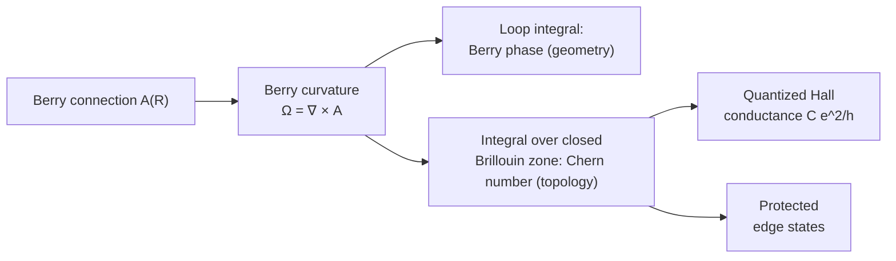
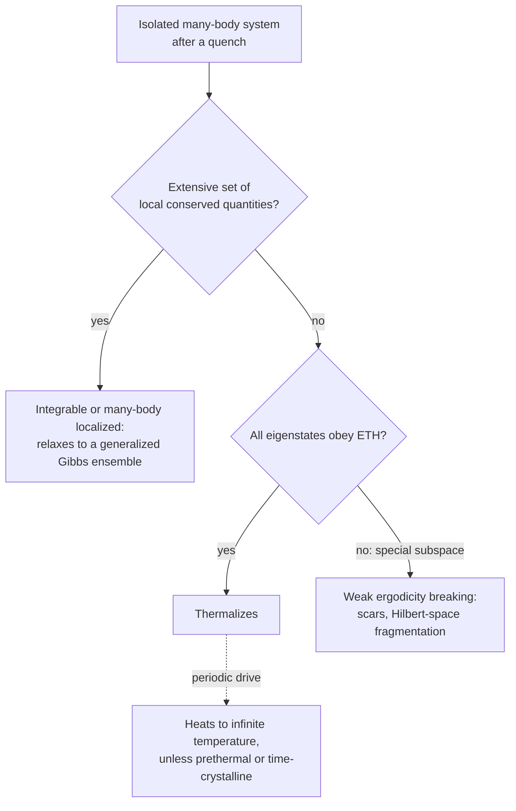

## Research Frontiers

[Quantum Mechanics](./) &raquo; Research Frontiers

This page surveys the active research directions that grow directly out of the quantum-mechanical formalism: what is understood, what is contested, and which recent experiments changed the picture. It is graduate-level reference material and assumes Dirac notation, density matrices and second quantization ([States, Operators & Dynamics](formalism.html), [Advanced Formalism](qm-advanced-formalism.html)). Numerical methods are treated in depth on [Computational Methods](qm-computational-methods.html) and are only summarized here.

| Frontier | Core question | Key concepts | Recent landmark |
|----------|---------------|--------------|-----------------|
| [Many-body physics](#many-body-quantum-physics) | How do $10^{23}$ interacting quanta organize themselves, and how can we compute it? | Entanglement area laws, tensor networks, sign problem, quantum simulators | Programmable Rydberg-atom and superconducting simulators with hundreds of qubits |
| [Geometric & Berry phases](#geometric-and-berry-phases) | What does a state remember about the path it took? | Berry connection and curvature, holonomy | Berry curvature as a routine band-structure diagnostic |
| [Topological matter](#topological-quantum-matter) | Which properties survive every smooth deformation? | Chern and $\mathbb{Z}_2$ invariants, edge states, anyons | Fractional quantum anomalous Hall states at zero magnetic field (2023–2024) |
| [Measurement-induced phenomena](#measurement-induced-phenomena) | What does repeated monitoring do to many-body dynamics? | Quantum trajectories, entanglement transitions | Entanglement transitions observed on trapped-ion and superconducting processors (2022–2023) |
| [Foundations & open questions](#foundations-and-open-questions) | Is the formalism complete, and how does classical behaviour emerge? | Thermalization, measurement problem, collapse models | Underground bounds on gravity-related collapse (2020) |

## Many-Body Quantum Physics

The Hilbert space of $N$ spin-1/2 particles has dimension $2^N$; storing a generic state of 300 spins would need more amplitudes than there are atoms in the observable universe. Many-body quantum physics is the study of how physically relevant states occupy a tiny corner of this space, and of methods — classical and quantum — that can follow them there.

### Second quantization

For identical particles the natural arena is **Fock space**, the direct sum of fixed-particle-number sectors,

$$\mathcal{F} = \bigoplus_{n=0}^{\infty} \mathcal{H}^{(n)},$$

built by creation and annihilation operators with $[\hat a_i, \hat a_j^\dagger] = \delta_{ij}$ for bosons and $\{\hat a_i, \hat a_j^\dagger\} = \delta_{ij}$ for fermions. Field operators $\hat\psi(x) = \sum_k \phi_k(x)\,\hat a_k$ express a generic Hamiltonian with a two-body interaction $U$ as

$$\hat{H} = \int dx\; \hat{\psi}^\dagger(x)\left[-\frac{\hbar^2 \nabla^2}{2m} + V(x)\right]\hat{\psi}(x) + \frac{1}{2}\iint dx\, dy\; \hat{\psi}^\dagger(x)\hat{\psi}^\dagger(y)\, U(x-y)\, \hat{\psi}(y)\hat{\psi}(x).$$

The operator algebra builds in the statistics: fermionic anticommutation enforces Pauli exclusion, and bosonic commutation permits macroscopic occupation of one mode — the seed of Bose–Einstein condensation and superfluidity.

### Entanglement and the area law

The modern organizing principle is entanglement. For a region $A$ with reduced density matrix $\rho_A$, the entanglement entropy is $S(\rho_A) = -\text{Tr}\,\rho_A\ln\rho_A$. Ground states of local Hamiltonians with an energy gap obey an **area law**,

$$S(\rho_A) \sim |\partial A|,$$

scaling with the boundary rather than the volume, whereas typical random states — and highly excited eigenstates of chaotic systems — obey a **volume law** $S \sim |A|$, close to the maximal Page value. In one dimension the area law is a theorem for gapped Hamiltonians (Hastings, 2007); in higher dimensions it is proven only in special cases. Gapless systems deviate in characteristic ways: one-dimensional critical ground states have $S = \tfrac{c}{3}\ln \ell$ (for a block of length $\ell$ in an infinite chain), with $c$ the central charge of the critical theory, and Fermi liquids carry a logarithmic correction $S \sim |\partial A|\ln|A|$.

The contrast can be checked directly with exact diagonalization. The script below compares the half-chain entropy of the gapped transverse-field Ising ground state with that of a random state on the same ten spins:

```python
import numpy as np

def tfim_hamiltonian(n, g):
    """Open-chain transverse-field Ising model H = -sum Z_i Z_{i+1} - g sum X_i."""
    dim = 2**n
    idx = np.arange(dim)
    bits = (idx[:, None] >> np.arange(n)[::-1]) & 1          # bit j of each basis state
    z = 1 - 2 * bits                                          # Z eigenvalues (+1/-1)
    H = np.diag(-np.sum(z[:, :-1] * z[:, 1:], axis=1)).astype(float)
    for j in range(n):                                        # X_j flips bit j
        H[idx, idx ^ (1 << (n - 1 - j))] -= g
    return H

def entanglement_entropy(psi, n, cut):
    """Von Neumann entropy (nats) of the first `cut` sites."""
    s = np.linalg.svd(psi.reshape(2**cut, 2**(n - cut)), compute_uv=False)
    p = s[s > 1e-12]**2
    return -np.sum(p * np.log(p))

n = 10
ground = np.linalg.eigh(tfim_hamiltonian(n, g=2.0))[1][:, 0]  # gapped paramagnet
rng = np.random.default_rng(0)
rand = rng.normal(size=2**n) + 1j * rng.normal(size=2**n)
rand /= np.linalg.norm(rand)

for cut in range(1, n // 2 + 1):
    print(f"cut={cut}:  ground S={entanglement_entropy(ground, n, cut):.3f}"
          f"   random S={entanglement_entropy(rand, n, cut):.3f}")
```

The ground-state entropy saturates at about $0.09$ regardless of the cut, while the random state's grows by roughly $\ln 2$ per site to $\approx 2.98$ at the midpoint — close to Page's prediction $\tfrac{n}{2}\ln 2 - \tfrac{1}{2}$.

<p class="referenceBoxes type3"><a href="https://arxiv.org/pdf/0808.3773.pdf"> Review: <b><i>Area Laws for the Entanglement Entropy</i></b> - Eisert, Cramer, Plenio</a></p>

### Tensor networks

The area law explains why **tensor networks** work: they are variational wave functions whose entanglement is bounded by construction. A **matrix product state (MPS)** writes an $N$-site state as a product of matrices,

$$|\Psi\rangle = \sum_{s_1,\ldots,s_N} \text{Tr}\left(A^{s_1} A^{s_2}\cdots A^{s_N}\right) |s_1 s_2 \cdots s_N\rangle,$$

where each $A^{s}$ is a $D\times D$ matrix and the **bond dimension** $D$ caps the entanglement across any cut at $\ln D$. White's **density-matrix renormalization group** (DMRG, 1992), now understood as variational optimization over MPS, reaches near machine precision for gapped one-dimensional systems and is the workhorse for quasi-one-dimensional strips and quantum chemistry. In two dimensions, **PEPS** satisfy the area law naturally but are expensive to contract exactly; **MERA** captures the logarithmic entanglement of critical states. Tensor networks also became the leading classical tool for *simulating quantum processors*, repeatedly narrowing claimed quantum-advantage margins since 2019.

| Method | Works well for | Fundamental limitation |
|--------|----------------|------------------------|
| Exact diagonalization | Any model, $\lesssim 40$ spins | Exponential memory |
| DMRG / MPS | Gapped 1D and narrow 2D strips; ground states and low-entanglement dynamics | Entanglement growth after quenches; width of 2D strips |
| PEPS, MERA | 2D ground states; critical states | Contraction cost; optimization difficulty |
| Quantum Monte Carlo | Bosons, unfrustrated magnets, half-filled Hubbard | Fermion sign problem |
| Neural-network quantum states | Frustrated and fermionic ground states (variational) | Optimization, no systematic error control |
| Quantum simulators | Dynamics, finite temperature, models too entangled for classical methods | Noise, limited programmability and verification |

Implementations and worked examples are on [Computational Methods](qm-computational-methods.html).

<p class="referenceBoxes type3"><a href="https://arxiv.org/pdf/1306.2164.pdf"> Review: <b><i>A Practical Introduction to Tensor Networks</i></b> - Román Orús</a></p>

### Quantum Monte Carlo and the sign problem

Quantum Monte Carlo maps a quantum partition function to a classical sampling problem — for example by expanding $\text{Tr}\,e^{-\beta\hat H}$ in imaginary-time paths — and is numerically exact, with statistical errors, when every sampled weight is non-negative. For fermions and frustrated magnets the weights acquire signs; the average sign decays as $e^{-\beta N \Delta f}$, so the statistical error grows exponentially with system size and inverse temperature. Troyer and Wiese (2005) showed that a *generic* solution to the sign problem would solve NP-hard problems, so no universal fix is expected; progress comes from model-specific sign-free formulations and from avoiding sampling altogether.

**Neural-network quantum states** (Carleo and Troyer, 2017) are one such route: a neural network parameterizes the amplitudes $\psi(s_1,\ldots,s_N)$ and is optimized variationally with Monte Carlo sampling of $|\psi|^2$, which carries no sign problem. Transformer and deep convolutional architectures now give competitive energies for frustrated magnets and small molecules.

### Quantum simulators

Feynman's 1982 proposal — simulate quantum systems with controllable quantum systems — is now an experimental reality. **Ultracold atoms** in optical lattices realize Hubbard models with single-site imaging (quantum gas microscopes). **Rydberg-atom arrays** in optical tweezers reach hundreds of individually positioned atoms and have been used to prepare quantum spin liquids and to discover quantum many-body scars. **Trapped ions** and **superconducting processors** provide programmable gate-based simulation of dynamics. These platforms are most valuable exactly where classical methods fail: real-time dynamics after quenches, finite-temperature transport, and two-dimensional fermions. Verifying the output when no classical check is available is itself an open problem.

### Strong correlation and emergence

Many of the deepest problems concern **strongly correlated** matter, where no weakly interacting quasiparticle description exists. Examples include the high-temperature cuprate superconductors, whose pairing mechanism is still unsettled after four decades; the "strange metal" phase with resistivity linear in temperature; heavy-fermion quantum criticality; correlated insulators and superconductivity in **magic-angle twisted bilayer graphene** (2018), where a moiré superlattice produces nearly flat bands; and superconducting nickelates, including $\text{La}_3\text{Ni}_2\text{O}_7$ near $80\ \text{K}$ under pressure (2023). The theme is **emergence**: collective excitations — anyons, spinons, composite fermions — that have no counterpart among the underlying electrons. See [Condensed Matter Physics](../condensed-matter/) for the materials side.

## Geometric and Berry Phases

Transport a quantum system slowly around a closed loop in parameter space. Besides the dynamical phase $-\tfrac{1}{\hbar}\int E\,dt$, the state acquires a **geometric phase** that depends only on the loop, not on the speed. Berry (1984) showed this phase is observable and generic; it now underlies the modern theory of electric polarization, the anomalous Hall effect and topological band theory.

<p class="referenceBoxes type3"><a href="https://michaelberryphysics.files.wordpress.com/2013/07/berry187.pdf"> Paper: <b><i>Quantal Phase Factors Accompanying Adiabatic Changes</i></b> - Michael Berry</a></p>

### Berry connection and Berry phase

For a Hamiltonian $\hat H(\mathbf{R})$ with a non-degenerate eigenstate $|n(\mathbf{R})\rangle$, the adiabatic theorem keeps the system in the instantaneous eigenstate. Around a closed loop $C$ it acquires

$$\gamma_n(C) = \oint_C \mathcal{A}_n \cdot d\mathbf{R}, \qquad \mathcal{A}_n(\mathbf{R}) = i\,\langle n(\mathbf{R})|\nabla_{\mathbf{R}}\,n(\mathbf{R})\rangle .$$

The **Berry connection** $\mathcal{A}_n$ behaves as a gauge potential: under $|n\rangle \to e^{i\chi(\mathbf{R})}|n\rangle$ it shifts by $-\nabla_{\mathbf{R}}\chi$, and the loop integral is invariant modulo $2\pi$. The canonical example is a spin-$s$ in a magnetic field whose direction traces a loop: the phase is $\gamma = -m_s\,\Omega(C)$, with $\Omega(C)$ the solid angle subtended by the loop — for spin-1/2 aligned with the field, minus half the solid angle.

### Berry curvature

By Stokes' theorem the phase is the flux of the **Berry curvature**,

$$\boldsymbol{\Omega}_n(\mathbf{R}) = \nabla_{\mathbf{R}} \times \mathcal{A}_n(\mathbf{R}), \qquad \gamma_n(C) = \int_S \boldsymbol{\Omega}_n \cdot d\mathbf{S},$$

a gauge-invariant "magnetic field in parameter space" whose sources (monopoles) sit at degeneracy points. For Bloch electrons the parameters are crystal momenta $\mathbf{k}$, and the curvature adds an **anomalous velocity** to the semiclassical equations,

$$\dot{\mathbf{r}} = \frac{1}{\hbar}\frac{\partial \varepsilon_n(\mathbf{k})}{\partial \mathbf{k}} - \dot{\mathbf{k}} \times \boldsymbol{\Omega}_n(\mathbf{k}),$$

which gives the intrinsic anomalous Hall effect and the valley Hall effect in two-dimensional materials. Integrating the curvature over the *closed* Brillouin zone gives an integer: the step from geometry to topology.



### The Aharonov–Bohm effect

A charge $q$ encircling a solenoid of flux $\Phi$ acquires a phase

$$\Delta\varphi = \frac{q}{\hbar}\oint \mathbf{A}\cdot d\mathbf{l} = \frac{q\,\Phi}{\hbar}$$

even though the magnetic field vanishes everywhere along its path. Predicted in 1959 and confirmed decisively by Tonomura's electron-holography experiments with shielded toroidal magnets (1986), it shows that in quantum mechanics the potentials, through their gauge-invariant loop integrals, carry physical information that the local fields do not. Its non-Abelian generalization — degenerate states transported by a matrix-valued **holonomy** — is the principle behind holonomic quantum gates and the braiding of non-Abelian anyons.

## Topological Quantum Matter

Landau's paradigm classifies phases by the symmetries they break. The integer quantum Hall effect (von Klitzing, 1980) exposed phases with *identical* symmetries distinguished by a **topological invariant**, an integer that cannot change without closing the bulk energy gap. The 2016 Nobel Prize (Thouless, Haldane, Kosterlitz) recognized the theoretical foundations.

<p class="referenceBoxes type3"><a href="https://arxiv.org/pdf/1002.3895.pdf"> Review: <b><i>Colloquium: Topological Insulators</i></b> - Hasan, Kane</a></p>

### Topological invariants

For a filled band of a two-dimensional insulator, the **Chern number** is

$$C = \frac{1}{2\pi}\int_{\text{BZ}} \Omega_n^{z}(\mathbf{k})\; d^2k \in \mathbb{Z}.$$

It is an integer because the Bloch states form a fibre bundle over the Brillouin-zone torus, and $C$ counts its twisting. Thouless, Kohmoto, Nightingale and den Nijs (TKNN, 1982) showed that the Hall conductance is $\sigma_{xy} = C\,e^2/h$, which is why it is quantized to parts in $10^{10}$ irrespective of disorder, and why the quantum Hall effect now realizes the ohm in the SI. With time-reversal symmetry the Chern number vanishes, but a $\mathbb{Z}_2$ invariant (Kane and Mele, 2005) distinguishes **topological insulators**, first observed in HgTe quantum wells (2007) and $\text{Bi}_2\text{Se}_3$-family crystals (2008–2009).

Free-fermion topological phases are systematically classified by the **tenfold way** (Altland–Zirnbauer symmetry classes; Schnyder, Ryu, Furusaki, Ludwig and Kitaev, 2008–2009), which predicts which invariant ($0$, $\mathbb{Z}$ or $\mathbb{Z}_2$) is possible in each dimension for each combination of time-reversal, particle–hole and chiral symmetry. Crystalline symmetries extend the table further ("topological quantum chemistry").

### Bulk–boundary correspondence

Where a region with invariant $C$ meets one with $C'$, the gap must close at the interface, and exactly $|C - C'|$ net chiral edge modes appear. These modes cannot backscatter — there is no counter-propagating state on the same edge to scatter into — so they conduct without dissipation along the boundary of an insulating bulk. In topological insulators the surface hosts a single **helical** Dirac cone with spin locked to momentum, protected as long as time-reversal symmetry is preserved.

### The topological zoo

| System | Invariant | Protected feature | Status (2026) |
|--------|-----------|-------------------|---------------|
| Integer quantum Hall | Chern number $C \in \mathbb{Z}$ | Chiral edge channels; $\sigma_{xy} = Ce^2/h$ | Metrological standard |
| Quantum anomalous Hall | Chern number, zero field | Chiral edges without a magnet | Observed in magnetic topological insulators (2013) and moiré materials |
| Topological insulator | $\mathbb{Z}_2$ | Helical surface Dirac cone | Many materials confirmed by ARPES |
| Fractional quantum Hall | Topological order | Anyons with fractional charge ($e/3$ at $\nu = 1/3$) and statistics | Fractional charge (1997) and anyonic braiding phases (2020) measured |
| Fractional quantum anomalous Hall | Topological order, zero field | Fractional Chern insulator without a magnetic field | Observed in twisted bilayer $\text{MoTe}_2$ (2023) and rhombohedral multilayer graphene (2024) |
| Topological superconductor | $\mathbb{Z}$ or $\mathbb{Z}_2$ | Majorana zero modes at ends and vortices | Contested; no unambiguous demonstration |

**Anyons and topological quantum computing.** In two dimensions exchange statistics need not be bosonic or fermionic. **Non-Abelian anyons** — such as Majorana zero modes or the excitations of the $\nu = 5/2$ state — have a degenerate ground space in which braiding acts as a unitary matrix, so quantum information stored non-locally is protected from local noise. Experiments on quantum processors have *prepared* non-Abelian topological order and braided its defects (superconducting and trapped-ion devices, 2023–2024), but in these the protection is engineered rather than intrinsic to a material. The materials route remains unsettled: a 2018 report of quantized Majorana conductance was retracted in 2021, and Microsoft's 2025 interferometric parity measurements in InAs–Al nanowires, announced with the "Majorana 1" chip, were published with the authors' own caveat that the data do not by themselves establish topological states; the community has not accepted them as proof of a topological qubit.

## Measurement-Induced Phenomena

Textbook measurement is a single projective event. Modern experiments monitor quantum systems continuously and in real time, and measurement has become a dynamical ingredient whose competition with unitary evolution produces new phenomena.

### Continuous monitoring and quantum trajectories

Under weak continuous measurement a system's state does not jump but diffuses along a **quantum trajectory** conditioned on the measurement record. Averaging over all records recovers the **Lindblad master equation**,

$$\frac{d\hat{\rho}}{dt} = -\frac{i}{\hbar}[\hat H, \hat\rho] + \sum_k \gamma_k\left(\hat L_k \hat\rho\, \hat L_k^\dagger - \tfrac{1}{2}\{\hat L_k^\dagger \hat L_k, \hat\rho\}\right),$$

but individual trajectories retain more information: each is a pure state conditioned on what was observed. In circuit QED experiments it is now routine to track single trajectories, stabilize states by feedback, and catch and reverse a quantum jump mid-flight (Minev et al., 2019). The Lindblad equation itself is derived on [Advanced Formalism](qm-advanced-formalism.html#open-quantum-systems-and-the-lindblad-equation).

### Measurement-induced entanglement transitions

Consider many qubits evolving under random local unitaries interleaved with single-qubit measurements at rate $p$. Unitaries generate entanglement; measurements destroy it.

<figure style="margin: 1.5em auto; max-width: 640px;">
<svg viewBox="0 0 640 330" role="img" aria-label="Brickwork random circuit: layers of two-qubit unitary gates acting on neighbouring qubits, interleaved with single-qubit projective measurements applied at random with probability p" style="max-width:640px;width:100%;height:auto;color:inherit;font-family:inherit">
  <line x1="60" y1="310" x2="60" y2="38" stroke="currentColor" stroke-width="1.2" opacity="0.7"/><line x1="106" y1="310" x2="106" y2="38" stroke="currentColor" stroke-width="1.2" opacity="0.7"/><line x1="152" y1="310" x2="152" y2="38" stroke="currentColor" stroke-width="1.2" opacity="0.7"/><line x1="198" y1="310" x2="198" y2="38" stroke="currentColor" stroke-width="1.2" opacity="0.7"/><line x1="244" y1="310" x2="244" y2="38" stroke="currentColor" stroke-width="1.2" opacity="0.7"/><line x1="290" y1="310" x2="290" y2="38" stroke="currentColor" stroke-width="1.2" opacity="0.7"/><line x1="336" y1="310" x2="336" y2="38" stroke="currentColor" stroke-width="1.2" opacity="0.7"/><line x1="382" y1="310" x2="382" y2="38" stroke="currentColor" stroke-width="1.2" opacity="0.7"/><rect x="50" y="268.0" width="66" height="22" rx="4" fill="currentColor" fill-opacity="0.13" stroke="currentColor" stroke-width="1.5"/><rect x="142" y="268.0" width="66" height="22" rx="4" fill="currentColor" fill-opacity="0.13" stroke="currentColor" stroke-width="1.5"/><rect x="234" y="268.0" width="66" height="22" rx="4" fill="currentColor" fill-opacity="0.13" stroke="currentColor" stroke-width="1.5"/><rect x="326" y="268.0" width="66" height="22" rx="4" fill="currentColor" fill-opacity="0.13" stroke="currentColor" stroke-width="1.5"/><rect x="96" y="226.0" width="66" height="22" rx="4" fill="currentColor" fill-opacity="0.13" stroke="currentColor" stroke-width="1.5"/><rect x="188" y="226.0" width="66" height="22" rx="4" fill="currentColor" fill-opacity="0.13" stroke="currentColor" stroke-width="1.5"/><rect x="280" y="226.0" width="66" height="22" rx="4" fill="currentColor" fill-opacity="0.13" stroke="currentColor" stroke-width="1.5"/><rect x="50" y="184.0" width="66" height="22" rx="4" fill="currentColor" fill-opacity="0.13" stroke="currentColor" stroke-width="1.5"/><rect x="142" y="184.0" width="66" height="22" rx="4" fill="currentColor" fill-opacity="0.13" stroke="currentColor" stroke-width="1.5"/><rect x="234" y="184.0" width="66" height="22" rx="4" fill="currentColor" fill-opacity="0.13" stroke="currentColor" stroke-width="1.5"/><rect x="326" y="184.0" width="66" height="22" rx="4" fill="currentColor" fill-opacity="0.13" stroke="currentColor" stroke-width="1.5"/><rect x="96" y="142.0" width="66" height="22" rx="4" fill="currentColor" fill-opacity="0.13" stroke="currentColor" stroke-width="1.5"/><rect x="188" y="142.0" width="66" height="22" rx="4" fill="currentColor" fill-opacity="0.13" stroke="currentColor" stroke-width="1.5"/><rect x="280" y="142.0" width="66" height="22" rx="4" fill="currentColor" fill-opacity="0.13" stroke="currentColor" stroke-width="1.5"/><rect x="50" y="100.0" width="66" height="22" rx="4" fill="currentColor" fill-opacity="0.13" stroke="currentColor" stroke-width="1.5"/><rect x="142" y="100.0" width="66" height="22" rx="4" fill="currentColor" fill-opacity="0.13" stroke="currentColor" stroke-width="1.5"/><rect x="234" y="100.0" width="66" height="22" rx="4" fill="currentColor" fill-opacity="0.13" stroke="currentColor" stroke-width="1.5"/><rect x="326" y="100.0" width="66" height="22" rx="4" fill="currentColor" fill-opacity="0.13" stroke="currentColor" stroke-width="1.5"/><rect x="96" y="58.0" width="66" height="22" rx="4" fill="currentColor" fill-opacity="0.13" stroke="currentColor" stroke-width="1.5"/><rect x="188" y="58.0" width="66" height="22" rx="4" fill="currentColor" fill-opacity="0.13" stroke="currentColor" stroke-width="1.5"/><rect x="280" y="58.0" width="66" height="22" rx="4" fill="currentColor" fill-opacity="0.13" stroke="currentColor" stroke-width="1.5"/><circle cx="60" cy="258.0" r="6.5" fill="currentColor"/><circle cx="106" cy="258.0" r="6.5" fill="currentColor"/><circle cx="244" cy="258.0" r="6.5" fill="currentColor"/><circle cx="382" cy="258.0" r="6.5" fill="currentColor"/><circle cx="106" cy="216.0" r="6.5" fill="currentColor"/><circle cx="244" cy="174.0" r="6.5" fill="currentColor"/><circle cx="244" cy="132.0" r="6.5" fill="currentColor"/><circle cx="382" cy="132.0" r="6.5" fill="currentColor"/><circle cx="152" cy="90.0" r="6.5" fill="currentColor"/><circle cx="382" cy="90.0" r="6.5" fill="currentColor"/><circle cx="382" cy="48.0" r="6.5" fill="currentColor"/>
  <line x1="30" y1="300" x2="30" y2="48" stroke="currentColor" stroke-width="1.5"/>
  <path d="M 25 56 L 30 48 L 35 56" fill="none" stroke="currentColor" stroke-width="1.5"/>
  <text x="22" y="174.0" font-size="12.5" fill="currentColor" text-anchor="middle" transform="rotate(-90 22 174.0)">time</text>
  <text x="221.0" y="326" font-size="12.5" fill="currentColor" text-anchor="middle">qubits</text>
  <g font-size="12.5" fill="currentColor">
    <rect x="440" y="70" width="36" height="18" rx="4" fill="currentColor" fill-opacity="0.13" stroke="currentColor" stroke-width="1.5"/>
    <text x="486" y="84">random 2-qubit gate</text>
    <circle cx="458" cy="118" r="6.5" fill="currentColor"/>
    <text x="486" y="122">measurement (prob. p)</text>
    <text x="440" y="170" font-weight="bold">p &lt; p_c: volume law</text>
    <text x="440" y="188">S(A) grows with |A|</text>
    <text x="440" y="222" font-weight="bold">p &gt; p_c: area law</text>
    <text x="440" y="240">S(A) ∝ |∂A|, bounded</text>
  </g>
</svg>
<figcaption style="font-size: 0.9em; text-align: center;">A monitored brickwork circuit. Below a critical measurement rate $p_c$ the steady state has volume-law entanglement; above it, area-law entanglement.</figcaption>
</figure>

As $p$ crosses a critical value $p_c$ the steady state changes from a **volume-law** phase, in which entanglement grows with subsystem size and information is scrambled and hidden from the measurements, to an **area-law** phase, in which frequent measurement keeps entanglement bounded (Li, Chen and Fisher; Skinner, Ruhman and Nahum, 2018–2019). The volume-law phase can be understood as a dynamically generated quantum error-correcting code that protects information from the measurements.

The transition is invisible in the trajectory-averaged density matrix, which simply heats to infinite temperature; it appears only in quantities nonlinear in the conditional state, such as entanglement entropy. Observing it therefore requires either repeating identical measurement records — exponentially costly (the **post-selection problem**) — or using classical post-processing or reference qubits as decoders. Small-scale experimental observations were made on trapped ions (2022) and on a superconducting processor (Google Quantum AI, 2023). Current work links these transitions to quantum error correction, to the classical simulability of noisy circuits, and to measurement-based state preparation of long-range entangled states.

<p class="referenceBoxes type3"><a href="https://arxiv.org/pdf/2207.14280.pdf"> Review: <b><i>Random Quantum Circuits</i></b> - Fisher, Khemani, Nahum, Vijay</a></p>

### Decoherence

The unmonitored version of measurement is **decoherence**: entanglement with an environment suppresses interference between macroscopically distinct states, often on extremely short timescales, and selects preferred "pointer" states. It explains why superpositions of macroscopic objects are not seen, without adding a collapse postulate, and it is the dominant error source in quantum hardware. Qubit coherence is characterized by the energy-relaxation time $T_1$ and dephasing times $T_2^* \le T_2 \le 2T_1$. Decoherence does not by itself explain why one particular outcome occurs; that is the measurement problem below. Details are on [States, Operators & Dynamics](formalism.html#decoherence).

## Foundations and Open Questions

### Thermalization and its failure

An isolated quantum system evolves unitarily and never forgets its initial state, yet local observables typically relax to thermal values. The **eigenstate thermalization hypothesis** (ETH; Deutsch 1991, Srednicki 1994) explains this through the structure of matrix elements of local operators $\hat O$ in the energy eigenbasis,

$$\langle E_m|\hat O|E_n\rangle = O(\bar E)\,\delta_{mn} + e^{-S(\bar E)/2} f_O(\bar E, \omega)\,R_{mn},$$

where $\bar E = (E_m + E_n)/2$, $\omega = E_m - E_n$, $S$ is the thermodynamic entropy, $O(\bar E)$ and $f_O$ are smooth functions, and $R_{mn}$ are erratic numbers of order one. Each eigenstate is already thermal for local measurements, and off-diagonal elements are exponentially small, so the long-time state is indistinguishable locally from the microcanonical ensemble.



The frontier is the systems that avoid thermalization:

- **Integrable systems** relax to a **generalized Gibbs ensemble** that remembers every conserved quantity (demonstrated with ultracold atoms in the "quantum Newton's cradle", 2006).
- **Many-body localization (MBL)**: strong disorder was predicted to produce an emergent set of local integrals of motion and a stable non-thermal phase. Numerical evidence since 2019 and the theory of **avalanches** — rare thermal regions that destabilize their surroundings — suggest MBL may not survive as a true phase in the thermodynamic limit, at least in dimensions above one, though very slow, "prethermal" localization is well established experimentally.
- **Quantum many-body scars**: a vanishing fraction of non-thermal eigenstates embedded in a chaotic spectrum, producing persistent revivals from special initial states. They were discovered in a 51-atom Rydberg array (2017) and explained through the PXP model.
- **Hilbert-space fragmentation**: kinetic constraints split the space into exponentially many disconnected sectors, so memory of the initial state persists without disorder.
- **Discrete time crystals**: periodically driven systems that respond at a multiple of the drive period, stable against perturbations when heating is suppressed; observed in trapped ions and NV centres (2017) and on a superconducting processor (2021–2022).

<p class="referenceBoxes type3"><a href="https://arxiv.org/pdf/1509.06411.pdf"> Review: <b><i>From Quantum Chaos and Eigenstate Thermalization to Statistical Mechanics</i></b> - D'Alessio, Kafri, Polkovnikov, Rigol</a></p>

### Quantum thermodynamics

Quantum thermodynamics asks what work, heat and entropy mean for small, coherent systems far from equilibrium. Work is not an observable; it is defined through two energy measurements, and with that definition the **Jarzynski equality** and **Crooks relation** hold exactly:

$$\left\langle e^{-\beta W}\right\rangle = e^{-\beta\,\Delta F}.$$

Open questions include how coherence and entanglement act as thermodynamic resources (resource theories of athermality), how the second law applies to systems strongly coupled to their baths, and the thermodynamic cost of measurement, feedback and erasure (Landauer's bound $k_B T\ln 2$ per erased bit, verified experimentally in 2012). Single-ion and superconducting-circuit heat engines have been built.

<p class="referenceBoxes type3"><a href="https://arxiv.org/pdf/1505.07835.pdf"> Review: <b><i>The Role of Quantum Information in Thermodynamics</i></b> - Goold, Huber, Riera, del Rio, Skrzypczyk</a></p>

### The measurement problem and interpretations

Unitary evolution of a system plus apparatus produces an entangled superposition of apparatus readings, while experiments record one outcome. Decoherence explains why the branches do not interfere, but not why one is realized. The main responses differ in what they add to or remove from the theory:

| Interpretation | What it changes | Empirically distinct? |
|----------------|-----------------|-----------------------|
| Copenhagen / textbook | Collapse is a primitive rule applied at measurement | No |
| Many-worlds (Everett) | No collapse; all branches are real | No |
| Pilot-wave (de Broglie–Bohm) | Adds definite particle positions guided nonlocally by the wave function | No (in the non-relativistic domain) |
| Objective collapse (GRW, CSL, Diósi–Penrose) | Adds spontaneous, stochastic localization to the dynamics | **Yes**: predicts heating, extra noise and loss of interference for large masses |
| QBism, relational QM | The quantum state is relative to an agent or a physical system | No |

Collapse models are under active experimental pressure. Searches for the spontaneous X-ray emission they predict, carried out deep underground at Gran Sasso, ruled out the parameter-free Diósi–Penrose model (2020) and constrain CSL; macromolecule interferometry, levitated nanoparticles and cantilever noise bound it from other directions. Extended Wigner's-friend arguments (Frauchiger–Renner 2018; the "local friendliness" no-go tested on photons in 2020) sharpen which assumptions about observers and outcomes can hold together.

### Is gravity quantum?

No experiment has yet shown that gravity must be quantized. A proposed test (Bose et al.; Marletto and Vedral, 2017) places two masses each in a spatial superposition and lets them interact only gravitationally; if they become **entangled**, the mediating field cannot be purely classical. The required masses (around $10^{-14}\ \text{kg}$) held in superposition over micrometres are far beyond current coherence capabilities, but progress in ground-state cooling of levitated particles and in measuring gravity between milligram-scale masses has made this an active experimental programme. See [Toward Quantum Gravity](../relativity/quantum-gravity.html) for the theory side.

### Quantum biology

Whether biological systems exploit quantum coherence in warm, wet environments is debated:

- **Photosynthetic energy transfer**: long-lived oscillations seen in 2D spectroscopy of light-harvesting complexes (2007) were first read as electronic coherence aiding transport. Later work (for example Duan et al., 2017) found that electronic coherence decays within tens of femtoseconds and that the long-lived signals are mostly vibrational, so a functional role is now considered unlikely.
- **Avian magnetoreception**: the **radical-pair mechanism**, in which the spin state of a photo-generated electron pair in a cryptochrome protein depends on the orientation of the Earth's field, is the leading model; cryptochrome 4 from European robins shows the predicted magnetic sensitivity in vitro (2021).
- **Enzyme catalysis**: hydrogen tunnelling in enzymes is established through kinetic isotope effects; its evolutionary significance is debated.

## Connections to Other Fields

- **[Quantum Field Theory](../quantum-field-theory.html)** — second quantization, the renormalization group and effective field theory are the field-theoretic continuation of many-body physics.
- **[Statistical Mechanics](../statistical-mechanics/)** — partition functions $Z = \text{Tr}\,e^{-\beta\hat H}$, quantum phase transitions driven by quantum rather than thermal fluctuations, and thermalization.
- **[Condensed Matter Physics](../condensed-matter/)** — band theory, superconductivity, quantum magnetism and the topological phases above.
- **[Quantum Computing](qm-computing.html)** — error correction (operated below the surface-code threshold on superconducting hardware in 2024), topological qubits, and processors used as quantum simulators.
- **[Black Holes](../relativity/black-holes.html)** — entanglement entropy, Page curves and quantum error correction reappear in the black-hole information problem, where Hawking radiation has temperature $T_H = \hbar c^3/(8\pi G M k_B)$.

## Research-Level Resources

### Graduate textbooks
<p class="referenceBoxes type3"><a href="https://www.cambridge.org/highereducation/books/modern-quantum-mechanics/AAE1925F1A0963C6124421B03D7801AE"> Book: <b><i>Modern Quantum Mechanics</i></b> - J.J. Sakurai, J. Napolitano</a></p>
<p class="referenceBoxes type3"><a href="https://link.springer.com/book/10.1007/0-306-47120-5"> Book: <b><i>Quantum Theory: Concepts and Methods</i></b> - Asher Peres</a></p>

### Reviews
<p class="referenceBoxes type3"><a href="https://arxiv.org/pdf/1804.11065.pdf"> Review: <b><i>Many-Body Localization, Thermalization, and Entanglement</i></b> - Abanin, Altman, Bloch, Serbyn</a></p>
<p class="referenceBoxes type3"><a href="https://arxiv.org/pdf/0808.3773.pdf"> Review: <b><i>Area Laws for the Entanglement Entropy</i></b> - Eisert, Cramer, Plenio</a></p>
<p class="referenceBoxes type3"><a href="https://arxiv.org/pdf/2207.14280.pdf"> Review: <b><i>Random Quantum Circuits</i></b> - Fisher, Khemani, Nahum, Vijay</a></p>

### Courses
<p class="referenceBoxes type3"><a href="https://ocw.mit.edu/courses/8-05-quantum-physics-ii-fall-2013/"> Course: <b><i>MIT 8.05 Quantum Physics II</i></b></a></p>
<p class="referenceBoxes type3"><a href="https://perimeterinstitute.ca/online-courses"> Course: <b><i>Perimeter Institute - Online Physics Courses</i></b></a></p>

### Software
<p class="referenceBoxes type3"><a href="https://github.com/ITensor/ITensors.jl"> Library: <b><i>ITensor - Tensor Network Calculations</i></b></a></p>
<p class="referenceBoxes type3"><a href="https://github.com/qutip/qutip"> Library: <b><i>QuTiP - Open Quantum Systems in Python</i></b></a></p>

## See Also

- [Computational Methods](qm-computational-methods.html) — exact diagonalization, DMRG, quantum Monte Carlo and time propagation in detail.
- [Advanced Formalism](qm-advanced-formalism.html) — density matrices, path integrals and the Lindblad equation.
- [Systems &amp; Phenomena](systems-and-phenomena.html) — the solvable systems and basic quantum effects.
- [States, Operators &amp; Dynamics](formalism.html) — measurement, decoherence and time evolution.
- [Quantum Field Theory](../quantum-field-theory.html) — second quantization and the renormalization group developed in full.
- [Condensed Matter Physics](../condensed-matter/) — where topological matter and strong correlation meet experiment.
- [Quantum Mechanics Hub](./) — back to the section overview.
