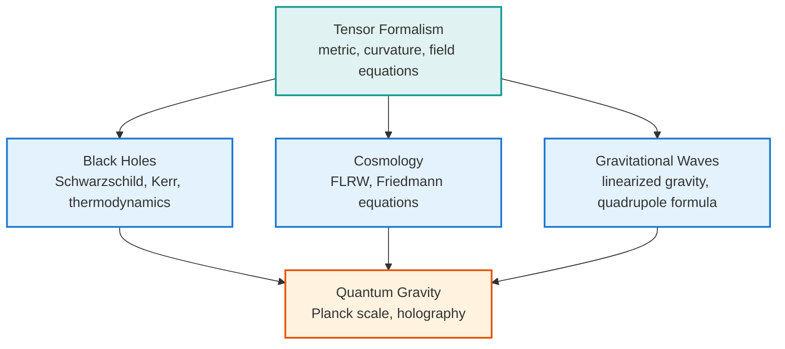

[Relativity](./) &raquo; Graduate Topics

<!-- Custom styles are now loaded via main.scss -->

  <h1 style="color: white; margin: 0; font-size: 2.5rem;">Graduate Topics</h1>
  
Tensor Formalism, Exact Solutions, and the Quantum-Gravity Frontier

  
This is the sub-hub for the graduate-level treatment of relativity. The conceptual core lives on <a href="special-relativity.html">Special Relativity</a> and <a href="general-relativity.html">General Relativity</a>; here the material is dense, formal, and split across five focused deep-dive pages so each can be consulted on its own. Start with <a href="tensor-formalism.html">Tensor Formalism</a> for the differential geometry that the other four pages assume, then branch into the exact solutions, radiation, cosmology, and frontier topics in whatever order you need.

  <h4>Conventions used throughout these pages</h4>
  
Unless stated otherwise, the deep-dive pages work in <strong>geometric units</strong> with $G = c = 1$, so masses, lengths, and times share dimensions and the field equations and line elements take their cleanest form (e.g. the Schwarzschild factor is $1 - 2M/r$ rather than $1 - 2GM/rc^2$). The metric signature is <strong>(−,+,+,+)</strong> ("mostly-plus"); both this and the (+,−,−,−) convention appear in the literature and differ only by an overall sign.

## The Five Deep Dives

  <a href="tensor-formalism.html" class="nav-card">
    <h4><i class="fas fa-superscript"></i> Tensor Formalism &amp; the Field Equations</h4>
    
Manifolds and tensors, the metric, the connection and Christoffel symbols, the covariant derivative, geodesics, the Riemann and Ricci tensors, and a careful derivation of the Einstein field equations from the Einstein–Hilbert action.

  </a>
  <a href="black-holes.html" class="nav-card">
    <h4><i class="fas fa-circle"></i> Black Holes</h4>
    
The Schwarzschild, Reissner–Nordström, and Kerr solutions; horizons, ergospheres, and singularities; Kruskal and Penrose diagrams; black-hole thermodynamics, Hawking radiation, and the information paradox.

  </a>
  <a href="cosmology.html" class="nav-card">
    <h4><i class="fas fa-globe"></i> Relativistic Cosmology</h4>
    
The FLRW metric, the Friedmann equations, equations of state, the $\Lambda$CDM expansion history, cosmological horizons, de Sitter and anti–de Sitter space, and inflation.

  </a>
  <a href="gravitational-waves.html" class="nav-card">
    <h4><i class="fas fa-wave-square"></i> Gravitational Waves</h4>
    
Linearized gravity, gauge freedom and the transverse–traceless gauge, the quadrupole formula, binary inspiral and the chirp mass, and how interferometers like LIGO measure a strain of one part in $10^{21}$.

  </a>
  <a href="quantum-gravity.html" class="nav-card">
    <h4><i class="fas fa-atom"></i> Toward Quantum Gravity</h4>
    
Why general relativity and quantum mechanics conflict, the non-renormalizability of naïve quantum gravity, and the leading programs: string theory, loop quantum gravity, asymptotic safety, causal sets, and the holographic principle.

  </a>

## How the Pages Fit Together

The five pages form a dependency chain rooted in the geometry. The tensor formalism supplies the curvature machinery and the field equations; the exact-solution and radiation pages apply that machinery; quantum gravity asks what happens when the classical geometry itself must be quantized.

| Page | What it covers | Assumes |
|------|----------------|---------|
| [Tensor Formalism & the Field Equations](tensor-formalism.html) | Manifolds, the metric, the connection, covariant derivatives, the Riemann/Ricci tensors, Einstein–Hilbert action | [General Relativity](general-relativity.html) |
| [Black Holes](black-holes.html) | Schwarzschild/Reissner–Nordström/Kerr, horizons, Penrose diagrams, thermodynamics, Hawking radiation, information paradox | [Tensor Formalism](tensor-formalism.html) |
| [Relativistic Cosmology](cosmology.html) | FLRW metric, Friedmann equations, $\Lambda$CDM, horizons, (anti–)de Sitter, inflation | [Tensor Formalism](tensor-formalism.html) |
| [Gravitational Waves](gravitational-waves.html) | Linearized gravity, TT gauge, quadrupole formula, binary inspiral, LIGO detection | [Tensor Formalism](tensor-formalism.html) |
| [Toward Quantum Gravity](quantum-gravity.html) | Planck scale, non-renormalizability, string theory, LQG, asymptotic safety, causal sets, holography | [Quantum Field Theory](../quantum-field-theory.html) |

  <h4>Suggested reading order</h4>
  
Read <a href="tensor-formalism.html">Tensor Formalism</a> first — it is the foundation the other four assume. After that the pages are independent: <a href="black-holes.html">Black Holes</a> and <a href="cosmology.html">Cosmology</a> are the two great families of exact solutions, <a href="gravitational-waves.html">Gravitational Waves</a> is the weak-field radiative regime, and <a href="quantum-gravity.html">Toward Quantum Gravity</a> is the open frontier where the classical theory runs out.

## See Also

  <h4>Within Relativity</h4>
  <ul>
    <li><a href="general-relativity.html">General Relativity</a> — the equivalence principle and the field equations in their conceptual setting.</li>
    <li><a href="special-relativity.html">Special Relativity</a> — Minkowski spacetime, four-vectors, and the flat-space limit these pages reduce to.</li>
    <li><a href="./">Relativity Hub</a> — overview and navigation.</li>
  </ul>

  <h4>Elsewhere in Physics</h4>
  <ul>
    <li><a href="../quantum-field-theory.html">Quantum Field Theory</a> — the relativistic quantum framework behind the Standard Model.</li>
    <li><a href="../string-theory/">String Theory</a> — a leading candidate for quantum gravity and extra dimensions.</li>
    <li><a href="../computational-physics/">Computational Physics</a> — numerical relativity and gravitational-wave simulations.</li>
    <li><a href="../">Physics Hub</a> — browse all physics topics.</li>
  </ul>

