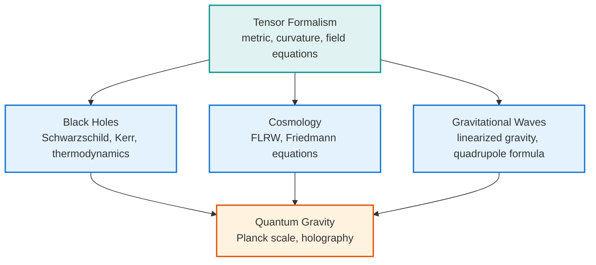

[Relativity](./) &raquo; Graduate Topics

  <h1 style="color: white; margin: 0; font-size: 2rem;">Graduate Topics</h1>
  
Tensor formalism, exact solutions, and the quantum-gravity frontier

This is the sub-hub for the graduate-level treatment of relativity. The conceptual core lives on [Special Relativity](special-relativity.html) and [General Relativity](general-relativity.html); here the material is dense, formal, and split across five focused deep-dive pages. Start with [Tensor Formalism](tensor-formalism.html) for the differential geometry the other four assume, then branch into exact solutions, radiation, cosmology, and frontier topics as needed.

**Conventions.** Unless stated otherwise these pages use **geometric units** with $G = c = 1$, so masses, lengths, and times share dimensions and the field equations take their cleanest form (the Schwarzschild factor is $1 - 2M/r$ rather than $1 - 2GM/rc^2$). The metric signature is **(−,+,+,+)** ("mostly-plus"); it and the (+,−,−,−) convention differ only by an overall sign.

## The Five Deep Dives

The graduate material splits into five pages — tensor formalism, black holes, cosmology, gravitational waves, and quantum gravity — each summarized with prerequisites in the table below.

## How the Pages Fit Together

The five pages form a dependency chain rooted in the geometry. The tensor formalism supplies the curvature machinery and the field equations; the exact-solution and radiation pages apply that machinery; quantum gravity asks what happens when the classical geometry itself must be quantized.

| Page | What it covers | Assumes |
|------|----------------|---------|
| [Tensor Formalism & the Field Equations](tensor-formalism.html) | Manifolds, the metric, the connection, covariant derivatives, the Riemann/Ricci tensors, Einstein–Hilbert action | [General Relativity](general-relativity.html) |
| [Black Holes](black-holes.html) | Schwarzschild/Reissner–Nordström/Kerr, horizons, Penrose diagrams, thermodynamics, Hawking radiation, information paradox | [Tensor Formalism](tensor-formalism.html) |
| [Relativistic Cosmology](cosmology.html) | FLRW metric, Friedmann equations, $\Lambda$CDM, horizons, (anti–)de Sitter, inflation | [Tensor Formalism](tensor-formalism.html) |
| [Gravitational Waves](gravitational-waves.html) | Linearized gravity, TT gauge, quadrupole formula, binary inspiral, LIGO detection | [Tensor Formalism](tensor-formalism.html) |
| [Toward Quantum Gravity](quantum-gravity.html) | Planck scale, non-renormalizability, string theory, LQG, asymptotic safety, causal sets, holography | [Quantum Field Theory](../quantum-field-theory.html) |

**Suggested reading order.** Read [Tensor Formalism](tensor-formalism.html) first — it is the foundation the other four assume. After that the pages are independent: [Black Holes](black-holes.html) and [Cosmology](cosmology.html) are the two great families of exact solutions, [Gravitational Waves](gravitational-waves.html) is the weak-field radiative regime, and [Toward Quantum Gravity](quantum-gravity.html) is the open frontier where the classical theory runs out.

## See Also

Within relativity:

- [General Relativity](general-relativity.html) — the equivalence principle and the field equations in their conceptual setting.
- [Special Relativity](special-relativity.html) — Minkowski spacetime, four-vectors, and the flat-space limit these pages reduce to.
- [Relativity Hub](./) — overview and navigation.

Elsewhere in physics:

- [Quantum Field Theory](../quantum-field-theory.html) — the relativistic quantum framework behind the Standard Model.
- [String Theory](../string-theory/) — a leading candidate for quantum gravity and extra dimensions.
- [Computational Physics](../computational-physics/) — numerical relativity and gravitational-wave simulations.
- [Physics Hub](../) — browse all physics topics.
