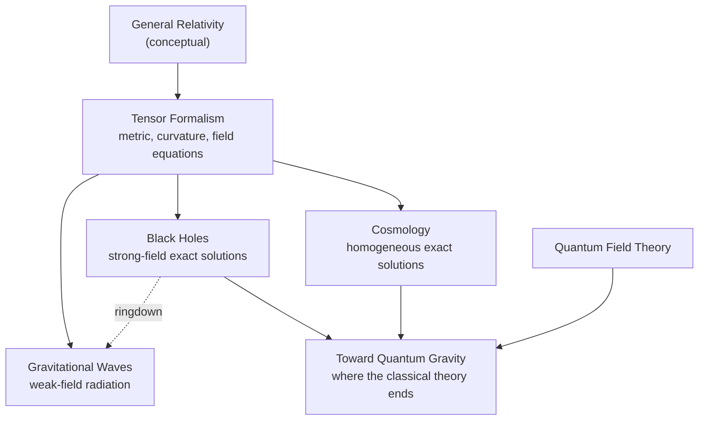

[Relativity](./) &raquo; Graduate Topics

  <h1 style="color: white; margin: 0; font-size: 2rem;">Graduate Topics</h1>
  
Tensor formalism, exact solutions, gravitational radiation, cosmology and the quantum-gravity frontier

This hub organizes the graduate-level treatment of relativity. The conceptual introduction is on [Special Relativity](special-relativity.html) and [General Relativity](general-relativity.html); the five pages below develop the theory in its standard mathematical form and connect it to current observations. [Tensor Formalism](tensor-formalism.html) supplies the differential geometry that the other four assume.

## The Five Deep Dives

| Page | What it covers | Assumes |
|------|----------------|---------|
| [Tensor Formalism & the Field Equations](tensor-formalism.html) | Manifolds, metric, connection and covariant derivative, Riemann/Ricci tensors, geodesic deviation, Einstein–Hilbert action | [General Relativity](general-relativity.html) |
| [Black Holes](black-holes.html) | Schwarzschild, Reissner–Nordström and Kerr; horizons, ISCO and photon sphere, Penrose diagrams, thermodynamics, Hawking radiation, information paradox, observational status | Tensor Formalism |
| [Gravitational Waves](gravitational-waves.html) | Linearized gravity, TT gauge, quadrupole formula, binary inspiral and ringdown, interferometric detection | Tensor Formalism |
| [Relativistic Cosmology](cosmology.html) | FLRW metric, Friedmann equations, $\Lambda$CDM, cosmological horizons, de Sitter and anti-de Sitter, inflation | Tensor Formalism |
| [Toward Quantum Gravity](quantum-gravity.html) | Planck scale, non-renormalizability, string theory, loop quantum gravity, asymptotic safety, causal sets, holography | [Quantum Field Theory](../quantum-field-theory.html) |

After Tensor Formalism the pages can be read in any order. Black Holes and Cosmology treat the two main families of exact solutions — isolated, strongly curved objects and the homogeneous universe. Gravitational Waves covers the weak-field radiative regime, and its merger and ringdown material links directly to the black-hole page. Toward Quantum Gravity picks up the places where the classical theory predicts its own breakdown: singularities, black-hole entropy, and the initial state of the universe.

## Conventions

These pages use **geometric units** $G = c = 1$, in which mass, length and time share one dimension ($1\,M_\odot \approx 1.48\ \text{km} \approx 4.93\ \mu\text{s}$), so the Schwarzschild factor is $1 - 2M/r$ rather than $1 - 2GM/rc^2$. Signs follow Misner, Thorne & Wheeler (MTW), which is also the convention of Wald, Carroll, Hartle and Schutz.

| Choice | Used here (MTW) | Common alternative |
|--------|-----------------|--------------------|
| Metric signature | $(-,+,+,+)$, "mostly plus" | $(+,-,-,-)$, e.g. Landau–Lifshitz and most particle-physics texts |
| Index ranges | Greek $\mu,\nu = 0..3$; Latin $i,j = 1..3$ | Some texts put time last ($\mu = 1..4$) |
| Riemann tensor | $R^\rho{}_{\sigma\mu\nu} = \partial_\mu\Gamma^\rho_{\nu\sigma} - \partial_\nu\Gamma^\rho_{\mu\sigma} + \Gamma^\rho_{\mu\lambda}\Gamma^\lambda_{\nu\sigma} - \Gamma^\rho_{\nu\lambda}\Gamma^\lambda_{\mu\sigma}$ | Overall sign flipped in some older texts |
| Ricci tensor | $R_{\mu\nu} = R^\rho{}_{\mu\rho\nu}$ | Contraction on other index pairs (changes sign) |
| Field equations | $G_{\mu\nu} + \Lambda g_{\mu\nu} = 8\pi T_{\mu\nu}$ | $-8\pi$ with opposite Ricci sign |

Changing signature flips the sign of $g_{\mu\nu}$ and of every expression with an odd number of explicit metrics, but not the physics. When comparing formulas across references, check all three sign choices before suspecting an error.

## Key Equations

| Topic | Equation | Details |
|-------|----------|---------|
| Field equations | $G_{\mu\nu} + \Lambda g_{\mu\nu} = 8\pi T_{\mu\nu}$ | [Tensor Formalism](tensor-formalism.html) |
| Geodesic equation | $\ddot x^\mu + \Gamma^\mu_{\alpha\beta}\dot x^\alpha \dot x^\beta = 0$ | [Tensor Formalism](tensor-formalism.html) |
| Schwarzschild horizon | $r_s = 2M$; photon sphere $3M$; ISCO $6M$ | [Black Holes](black-holes.html) |
| Kerr horizons | $r_\pm = M \pm \sqrt{M^2 - a^2}$, $a = J/M \le M$ | [Black Holes](black-holes.html#the-kerr-solution) |
| Hawking temperature, entropy | $T_H = \hbar\kappa/2\pi$, $S = A/4\ell_P^2$ | [Black Holes](black-holes.html#black-hole-thermodynamics) |
| Quadrupole formula | $\bar h_{ij} = \dfrac{2}{r}\,\ddot I_{ij}(t - r)$ | [Gravitational Waves](gravitational-waves.html) |
| Friedmann equation | $H^2 = \dfrac{8\pi}{3}\rho - \dfrac{k}{a^2} + \dfrac{\Lambda}{3}$ | [Relativistic Cosmology](cosmology.html) |
| Planck length | $\ell_P = \sqrt{G\hbar/c^3} \approx 1.6\times10^{-35}\ \text{m}$ | [Toward Quantum Gravity](quantum-gravity.html) |

## Where the Field Stands (2026)

General relativity has passed every precision test to date; the open questions are about the strong-field and cosmological regimes and about its quantum completion.

| Area | Current picture |
|------|-----------------|
| Gravitational-wave astronomy | LIGO–Virgo–KAGRA completed their fourth observing run (O4) in November 2025, with hundreds of compact-binary candidates; GW250114, the loudest event yet, confirmed Hawking's area theorem and resolved two ringdown modes. Pulsar-timing arrays (NANOGrav and others, 2023) report evidence for a nanohertz background, most likely from supermassive black-hole binaries. ESA adopted LISA in 2024 for launch in the mid-2030s. |
| Black-hole imaging | The Event Horizon Telescope has imaged M87* and Sagittarius A*, including polarization, and is building multi-epoch observations toward horizon-scale movies. |
| Cosmology | $\Lambda$CDM still fits the cosmic microwave background, but the Hubble tension between early- and late-universe measurements of $H_0$ persists, and baryon-acoustic-oscillation data from DESI (2024–2025), combined with supernovae, show a mild preference for evolving dark energy that is not yet decisive. |
| Quantum gravity | No experimental signature yet. Theoretical progress centres on holography and the black-hole information problem (the island computation of the Page curve), with tabletop proposals to test whether gravity can entangle masses. |

## See Also

Within relativity:

- [Special Relativity](special-relativity.html) — Minkowski spacetime, four-vectors, and the flat-space limit.
- [General Relativity](general-relativity.html) — the equivalence principle, the field equations in conceptual form, and the classic tests.
- [Relativity Hub](./) — overview and navigation.

Elsewhere in physics:

- [Quantum Field Theory](../quantum-field-theory.html) — the relativistic quantum framework needed for Hawking radiation and quantum gravity.
- [String Theory](../string-theory/) — a leading candidate for quantum gravity.
- [Computational Physics](../computational-physics/) — numerical relativity and waveform modelling.
- [Physics Hub](../) — browse all physics topics.
