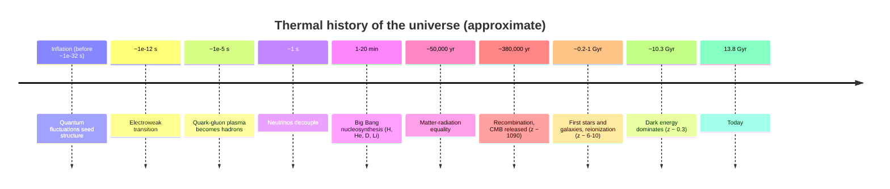
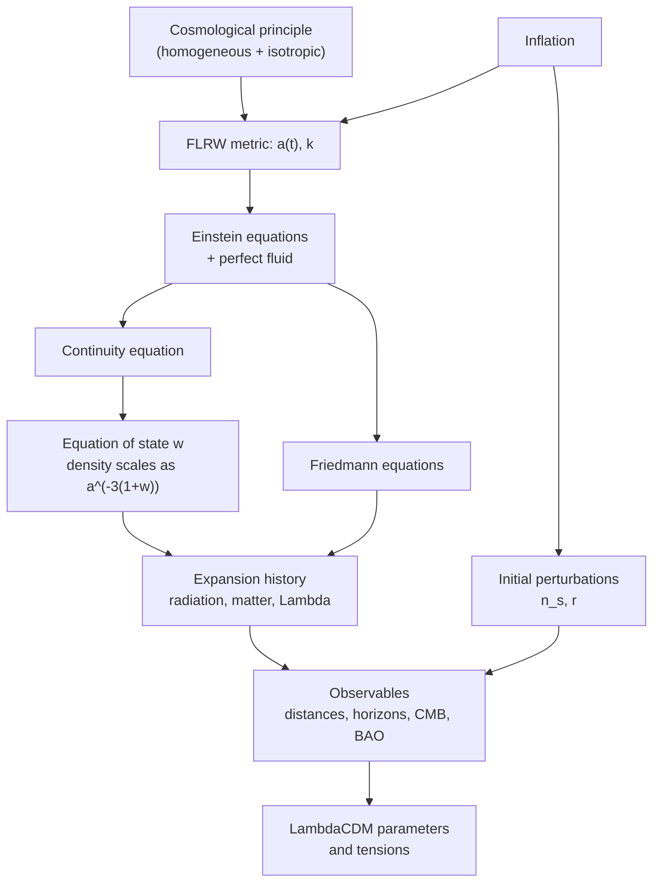

[Relativity](./) &raquo; Relativistic Cosmology

## Relativistic Cosmology

Cosmology applies the [Einstein field equations](general-relativity.html#the-einstein-field-equations) to the universe as a whole. On scales above roughly 100 Mpc the matter distribution is observed to be statistically **homogeneous** and **isotropic**. That single empirical input, the *cosmological principle*, reduces the ten field equations to two ordinary differential equations for one function of time, the scale factor $a(t)$.

This page derives the FLRW metric and the Friedmann equations, defines redshift, distances, and horizons, traces the expansion and thermal history of the standard **$\Lambda$CDM** model, summarizes its measured parameters and the tensions that have emerged since 2019 (the Hubble tension and hints of evolving dark energy from DESI), and closes with inflation. It assumes [Tensor Formalism & the Field Equations](tensor-formalism.html) and [General Relativity](general-relativity.html).

**Conventions.** $c = 1$ unless restored for clarity; $G$ is kept explicit. Signature $(-,+,+,+)$. The scale factor is normalized to $a(t_0) = 1$ today, and a subscript $0$ denotes a present-day value. The **Hubble parameter** is $H \equiv \dot a/a$; density parameters are $\Omega_i \equiv \rho_i/\rho_{\rm crit}$ with $\rho_{\rm crit} = 3H^2/8\pi G$. Overdots are derivatives with respect to cosmic time $t$. It is common to write $H_0 = 100\,h\ \text{km s}^{-1}\text{Mpc}^{-1}$.

## The Cosmological Principle

Two lines of evidence support large-scale homogeneity and isotropy:

- **Isotropy.** After removing the dipole caused by our own motion ($\approx 370$ km/s), the cosmic microwave background (CMB) has the same temperature, $2.7255$ K, in every direction to about one part in $10^5$. Radio-source and galaxy counts are likewise isotropic on large scales.
- **Homogeneity.** Isotropy about *every* point (the Copernican assumption that we are not specially placed) implies homogeneity. Galaxy redshift surveys (2dF, SDSS, DESI) show directly that counts in spheres approach uniformity above about 100 Mpc.

Mathematically, the spatial slices of constant cosmic time are **maximally symmetric** three-spaces. Such spaces have constant curvature, and up to scale there are exactly three: the 3-sphere (positive curvature), Euclidean space (zero), and hyperbolic space (negative).

## The FLRW Metric

The **Friedmann–Lemaître–Robertson–Walker** (FLRW) metric is the most general homogeneous, isotropic spacetime:

$$ds^2 = -dt^2 + a(t)^2\left[\frac{dr^2}{1-kr^2} + r^2\left(d\theta^2 + \sin^2\theta\, d\phi^2\right)\right]$$

- $t$ is **cosmic time**, the proper time of **comoving** observers (those at fixed $r,\theta,\phi$, who see an isotropic CMB).
- $a(t)$ is the dimensionless **scale factor**: all proper distances between comoving points scale in proportion to $a$.
- $k \in \{-1, 0, +1\}$ sets the spatial geometry (with $r$ dimensionless, $a$ carries the curvature radius):

| $k$ | Geometry | Spatial volume | Triangle angles sum to | Fate if matter-only |
|-----|----------|----------------|------------------------|---------------------|
| $+1$ | Closed (3-sphere) | finite | $> 180^\circ$ | recollapse |
| $0$ | Flat | infinite | $180^\circ$ | expands forever, $\dot a \to 0$ |
| $-1$ | Open (hyperbolic) | infinite | $< 180^\circ$ | expands forever |

With $\Lambda > 0$ the link between geometry and fate is broken: even a closed universe can expand forever.

Substituting $d\chi = dr/\sqrt{1-kr^2}$ gives the equivalent form

$$ds^2 = -dt^2 + a(t)^2\left[d\chi^2 + S_k(\chi)^2\, d\Omega^2\right], \qquad S_k(\chi) = \begin{cases} \sin\chi & k=+1 \\ \chi & k=0 \\ \sinh\chi & k=-1 \end{cases}$$

where $\chi$ is the **comoving radial distance** and $d\Omega^2 = d\theta^2 + \sin^2\theta\,d\phi^2$.

### Hubble's law

A comoving galaxy at coordinate $\chi$ has **proper distance** $d(t) = a(t)\chi$. Differentiating,

$$\dot d = \dot a\,\chi = H(t)\,d$$

which is **Hubble's law** (Lemaître 1927, Hubble 1929). The recession is not motion through space — comoving galaxies are at rest with respect to the CMB — but the growth of proper distance between them. It is not limited by $c$: galaxies beyond the **Hubble radius** $c/H$ recede faster than light without violating relativity, since no signal is carried.

### Cosmological redshift

Following a radial null geodesic, successive wave crests emitted at $t_e$ arrive stretched by the ratio of scale factors:

$$1 + z \equiv \frac{\lambda_0}{\lambda_e} = \frac{a(t_0)}{a(t_e)} = \frac{1}{a(t_e)}$$

Redshift is therefore a direct, model-independent measure of the size of the universe at emission: light from $z = 6$ left when distances were $1/7$ of today's. Only the *conversion* of redshift into time or distance requires a model for $a(t)$.

## The Friedmann Equations

Homogeneity and isotropy force the stress–energy tensor to be that of a **perfect fluid** at rest in comoving coordinates, $T^\mu{}_\nu = \mathrm{diag}(-\rho, p, p, p)$. Substituting the FLRW metric into $G_{\mu\nu} + \Lambda g_{\mu\nu} = 8\pi G\,T_{\mu\nu}$, the $tt$ and $ii$ components give the two **Friedmann equations**:

$$H^2 = \left(\frac{\dot{a}}{a}\right)^2 = \frac{8\pi G}{3}\rho - \frac{k}{a^2} + \frac{\Lambda}{3}$$

$$\frac{\ddot{a}}{a} = -\frac{4\pi G}{3}\left(\rho + 3p\right) + \frac{\Lambda}{3}$$

The first is a constraint relating the expansion rate to the energy content and curvature; the second is the **acceleration equation**. Pressure appears in the source: any component with $\rho + 3p > 0$ decelerates the expansion, so acceleration requires either $\Lambda > 0$ or a component with $p < -\rho/3$.

The first equation has a Newtonian reading. A shell of radius $R = a\chi$ around a uniform sphere of density $\rho$ has energy per unit mass $\tfrac{1}{2}\dot R^2 - \tfrac{4\pi G}{3}\rho R^2 = \text{const}$; dividing by $R^2/2$ reproduces the Friedmann equation with $-k$ playing the role of the total energy. GR is needed for the pressure term, for the meaning of $k$ as spatial curvature, and to justify the argument in an infinite universe.

### The continuity equation and equations of state

Energy–momentum conservation, $\nabla_\mu T^{\mu\nu} = 0$ (which also follows from combining the two Friedmann equations), gives

$$\dot{\rho} + 3H\left(\rho + p\right) = 0$$

the first law of thermodynamics $d(\rho V) = -p\,dV$ for a comoving volume $V \propto a^3$. For an equation of state $p = w\rho$ with constant $w$,

$$\rho \propto a^{-3(1+w)}$$

| Component | $w$ | $\rho(a)$ | Reason |
|-----------|-----|-----------|--------|
| **Radiation** (photons, relativistic neutrinos) | $1/3$ | $\propto a^{-4}$ | Number density dilutes as $a^{-3}$; each quantum's energy redshifts as $a^{-1}$ |
| **Matter** (cold dark matter, baryons) | $0$ | $\propto a^{-3}$ | Pressureless; dilutes with volume |
| **Curvature** (effective) | $-1/3$ | $\propto a^{-2}$ | The $-k/a^2$ term |
| **Cosmological constant** | $-1$ | constant | Vacuum energy density does not dilute |

For a flat universe dominated by one component with $w > -1$, the Friedmann equation integrates to a power law:

$$a(t) \propto t^{\frac{2}{3(1+w)}} \quad\Longrightarrow\quad a \propto t^{1/2} \ \text{(radiation)}, \qquad a \propto t^{2/3} \ \text{(matter)}$$

while $w = -1$ gives $a \propto e^{Ht}$ with constant $H$.

### Critical density and the cosmic sum rule

For $k = \Lambda = 0$ the density that makes space exactly flat is the **critical density**

$$\rho_{\rm crit} = \frac{3H^2}{8\pi G}, \qquad \rho_{\rm crit,0} \approx 1.88\times10^{-26}\,h^2\ \text{kg m}^{-3} \approx 8.5\times10^{-27}\ \text{kg m}^{-3}$$

for $h \approx 0.67$ — about five hydrogen atoms per cubic metre. Dividing the first Friedmann equation by $H^2$ and defining $\Omega_k \equiv -k/(aH)^2$ and $\Omega_\Lambda \equiv \Lambda/(3H^2)$ gives the **sum rule**

$$\Omega_m + \Omega_r + \Omega_\Lambda + \Omega_k = 1$$

The **deceleration parameter** $q \equiv -\ddot a a/\dot a^2$ follows from the acceleration equation; for matter plus $\Lambda$, $q_0 = \tfrac{1}{2}\Omega_{m,0} - \Omega_{\Lambda,0} \approx -0.53$, so the expansion is accelerating today.

## The Cosmological Constant and de Sitter Space

Einstein introduced $\Lambda$ in 1917 to allow a static universe (which turned out to be unstable) and abandoned it after the discovery of expansion. It returned in 1998, when two teams using type Ia supernovae as standard candles (Riess et al.; Perlmutter et al.) found that the expansion is accelerating — the 2011 Nobel Prize.

### $\Lambda$ as vacuum energy

A cosmological constant is equivalent to a perfect fluid with

$$\rho_\Lambda = \frac{\Lambda}{8\pi G}, \qquad p_\Lambda = -\rho_\Lambda \quad (w = -1)$$

Because it does not dilute, it inevitably dominates at late times. Then $H \to \sqrt{\Lambda/3}$ and $a \propto e^{Ht}$: an exponentially expanding, increasingly empty **de Sitter** universe is the late-time limit of $\Lambda$CDM.

### de Sitter and anti-de Sitter space

The maximally symmetric vacuum solutions with $\Lambda \neq 0$ are de Sitter ($\Lambda > 0$) and anti-de Sitter ($\Lambda < 0$). In static coordinates, with curvature radius $\alpha = \sqrt{3/\lvert\Lambda\rvert}$:

$$ds^2 = -\left(1-\frac{r^2}{\alpha^2}\right)dt^2 + \left(1-\frac{r^2}{\alpha^2}\right)^{-1}dr^2 + r^2\, d\Omega^2 \qquad \text{(de Sitter)}$$

$$ds^2 = -\left(1+\frac{r^2}{\alpha^2}\right)dt^2 + \left(1+\frac{r^2}{\alpha^2}\right)^{-1}dr^2 + r^2\, d\Omega^2 \qquad \text{(anti-de Sitter)}$$

In de Sitter space $r = \alpha$ is a **cosmological horizon** for an observer at $r = 0$. It radiates at the Gibbons–Hawking temperature $T = \hbar H/2\pi k_B$, the cosmological analogue of [Hawking radiation](black-holes.html#hawking-temperature); for our universe's asymptotic $H$ this is about $10^{-30}$ K. Anti-de Sitter space has no cosmological horizon and a timelike conformal boundary; it is the arena of the AdS/CFT correspondence (see [Quantum Gravity](quantum-gravity.html#adscft-holography-made-exact) and [String Theory](../string-theory/)).

### The cosmological constant problem

Quantum field theory predicts a vacuum energy from zero-point fluctuations. Cut off at the Planck scale, the estimate exceeds the observed $\rho_\Lambda \approx 6\times10^{-27}\ \text{kg m}^{-3}$ by about 120 orders of magnitude; even a cutoff at the electroweak scale overshoots by about 55. Why the observed value is small but nonzero, and why it becomes dominant just as observers appear (the *coincidence problem*), is unexplained. Proposed directions include dynamical dark energy (quintessence), anthropic selection in a landscape of vacua, and modified gravity.

## Expansion History

Using $\rho_i \propto a^{-3(1+w_i)}$ and $a = 1/(1+z)$, the first Friedmann equation becomes

$$H(z)^2 = H_0^2\left[\Omega_{r,0}(1+z)^4 + \Omega_{m,0}(1+z)^3 + \Omega_{k,0}(1+z)^2 + \Omega_{\Lambda,0}\right] \equiv H_0^2\,E(z)^2$$

Each term scales differently with $z$, so the universe passes through successive epochs dominated by one component.

<figure class="diagram">
<svg viewBox="0 0 640 310" role="img" aria-label="Log-log plot of energy density against scale factor for radiation, matter and the cosmological constant, showing matter-radiation equality near z of 3400 and matter-Lambda equality near z of 0.3" style="max-width: 640px; width: 100%;">
  <g fill="none" stroke="currentColor">
    <path d="M70,262 L600,262 M70,262 L70,30" stroke-width="1.5"/>
    <path d="M70,262 L70,268 M145.7,262 L145.7,268 M221.4,262 L221.4,268 M297.1,262 L297.1,268 M372.9,262 L372.9,268 M448.6,262 L448.6,268 M524.3,262 L524.3,268 M600,262 L600,268"/>
    <path d="M256.2,40 L256.2,262 M515.4,40 L515.4,262" stroke-dasharray="5,4" stroke-opacity="0.55"/>
    <path d="M294,40 L294,262" stroke-dasharray="1,4" stroke-opacity="0.55"/>
    <path d="M524.3,40 L524.3,262" stroke-opacity="0.35"/>
    <path d="M70,40.4 L600,252.8" stroke-width="2.5"/>
    <path d="M70,59 L600,218.3" stroke-width="2.5" stroke-dasharray="10,5"/>
    <path d="M70,192.9 L600,192.9" stroke-width="2.5" stroke-dasharray="2,4"/>
  </g>
  <g fill="currentColor" font-size="12" text-anchor="middle">
    <text x="70" y="282">10⁻⁶</text>
    <text x="145.7" y="282">10⁻⁵</text>
    <text x="221.4" y="282">10⁻⁴</text>
    <text x="297.1" y="282">10⁻³</text>
    <text x="372.9" y="282">10⁻²</text>
    <text x="448.6" y="282">10⁻¹</text>
    <text x="524.3" y="282">1</text>
    <text x="600" y="282">10</text>
    <text x="335" y="302">scale factor a = 1/(1+z)  (log scale)</text>
    <text x="40" y="150" transform="rotate(-90 40 150)">energy density (log scale)</text>
    <text x="150" y="66" text-anchor="start">radiation ∝ a⁻⁴</text>
    <text x="100" y="102" text-anchor="start">matter ∝ a⁻³</text>
    <text x="330" y="186" text-anchor="start">Λ = constant</text>
    <text x="256.2" y="34">z ≈ 3400</text>
    <text x="300" y="52" text-anchor="start" font-size="11">CMB, z ≈ 1090</text>
    <text x="498" y="34">z ≈ 0.3</text>
    <text x="545" y="52" font-size="11">today</text>
    <text x="160" y="248">radiation era</text>
    <text x="390" y="248">matter era</text>
    <text x="562" y="248">Λ era</text>
  </g>
</svg>
<figcaption>Energy densities of the three main components versus scale factor, computed for $\Omega_{r,0} = 9\times10^{-5}$, $\Omega_{m,0} = 0.31$, $\Omega_{\Lambda,0} = 0.69$ (vertical axis spans about 28 decades). Slopes are $-4$, $-3$, and $0$; the crossings mark matter–radiation and matter–$\Lambda$ equality.</figcaption>
</figure>

| Epoch | Redshift range | $a(t)$ | Notes |
|-------|----------------|--------|-------|
| Radiation-dominated | $z \gtrsim 3400$ ($t \lesssim 50{,}000$ yr) | $\propto t^{1/2}$ | Nucleosynthesis at $t \sim 1$–$20$ min |
| Matter-dominated | $3400 \gtrsim z \gtrsim 0.3$ | $\propto t^{2/3}$ | CMB released at $z \approx 1090$; structure grows |
| $\Lambda$-dominated | $z \lesssim 0.3$ (last $\sim 3.5$ Gyr) | $\to e^{Ht}$ | Structure growth stalls |

The expansion began **accelerating** somewhat earlier than $\Lambda$ became dominant: $\ddot a > 0$ once $\rho_\Lambda > \tfrac{1}{2}\rho_m$, which happened at $z \approx 0.6$, about 6 Gyr ago.

### The age of the universe

Integrating $dt = da/(aH)$:

$$t_0 = \int_0^1 \frac{da}{a\,H(a)} = \frac{1}{H_0}\int_0^\infty \frac{dz}{(1+z)\,E(z)}$$

For Planck $\Lambda$CDM parameters, $t_0 = 13.80 \pm 0.02$ Gyr. The **Hubble time** $1/H_0 \approx 14.5$ Gyr is similar only by coincidence of the present epoch, when past deceleration and recent acceleration roughly cancel in the integral. The oldest stars and globular clusters (about 12–13.5 Gyr) are consistent with this age.

## Distances

In an expanding, possibly curved universe "distance" has several operational definitions. All derive from the comoving distance along the line of sight,

$$\chi(z) = \int_0^z \frac{dz'}{H(z')}$$

| Distance | Definition | Used for |
|----------|------------|----------|
| Comoving, $\chi$ | Proper distance today to an object at redshift $z$ | Galaxy clustering, BAO scale |
| Transverse comoving, $D_M$ | $S_k(\chi)$ with curvature restored; equals $\chi$ if flat | Angular sizes of comoving rulers |
| Luminosity, $d_L$ | $(1+z)\,D_M$, so that flux $F = L/4\pi d_L^2$ | Standard candles (Type Ia supernovae), standard sirens |
| Angular-diameter, $d_A$ | $D_M/(1+z)$, so that angle $\theta = \ell/d_A$ | Standard rulers (CMB acoustic scale, BAO) |

The two factors of $(1+z)$ in $d_L$ come from photon energy loss and time dilation of arrival rate. Because $d_A$ reaches a maximum (near $z \approx 1.6$ in $\Lambda$CDM) and then decreases, very distant galaxies of fixed size look *larger* on the sky. The ratio $d_L/d_A = (1+z)^2$ holds in any metric theory where photons are conserved (Etherington's reciprocity relation), and is itself tested observationally.

## Horizons

### The particle horizon

The **particle horizon** is the comoving distance light could have travelled since $t = 0$:

$$\chi_{\rm ph}(t) = \int_0^{t} \frac{dt'}{a(t')} = \int_0^{a} \frac{da'}{a'^2 H(a')}$$

Its present proper radius is about 46 billion light-years, larger than $c\,t_0 \approx 13.8$ billion light-years because space expanded while the light travelled. It bounds the **observable universe**; regions outside it have never been in causal contact with us.

### The event horizon

The **cosmological event horizon** is the comoving distance light emitted now can ever cover:

$$\chi_{\rm eh}(t) = \int_{t}^{\infty} \frac{dt'}{a(t')}$$

For decelerating universes the integral diverges and there is no event horizon. With $\Lambda$ it converges: today the event horizon is at a proper distance of about 16–17 billion light-years, approaching $c/H_\infty = c/(H_0\sqrt{\Omega_\Lambda}) \approx 17$ billion light-years in the far future. Events happening now beyond it will never be seen by us. Galaxies currently beyond the event horizon are still visible — we see light they emitted long ago — but will appear to freeze and redshift away. Over the next $\sim 100$ Gyr everything outside the gravitationally bound Local Group will fade from view.

### The Hubble sphere

The **Hubble sphere**, at proper distance $c/H$ (about 14.5 billion light-years today), is where recession speed equals $c$. It is not a horizon: in $\Lambda$CDM we routinely receive light from galaxies that were outside the Hubble sphere when they emitted it, because the Hubble sphere has grown to overtake those photons.

| Horizon | Looks | Bounds | Exists in $\Lambda$CDM? |
|---------|-------|--------|---------------------------|
| Particle horizon | Backward | What we can see (in principle) | Yes, about 46 Gly |
| Event horizon | Forward | What we can ever reach or be reached by | Yes, about 16–17 Gly |
| Hubble sphere | Now | Where recession speed equals $c$ | Yes, about 14.5 Gly (not a causal horizon) |

## Thermal History

The universe cools as $T \propto 1/a$ for radiation. Running the expansion backward gives a sequence of events at which particle reactions froze out, each leaving a measurable relic.

- **Big Bang nucleosynthesis (BBN).** At $T \sim 0.1$ MeV neutrons are locked into helium-4, giving a primordial helium mass fraction $Y_p \approx 0.245$ and deuterium abundance $D/H \approx 2.5\times10^{-5}$, both matching the baryon density inferred independently from the CMB. The predicted lithium-7 abundance exceeds observations by a factor of about 3 (the *lithium problem*), unresolved.
- **Recombination and the CMB.** At $T \approx 3000$ K electrons and protons combine into neutral hydrogen, the universe becomes transparent, and the photons free-stream to us as the CMB, now at $2.7255$ K with a near-perfect blackbody spectrum (COBE/FIRAS). Its temperature anisotropies, dominated by acoustic oscillations of the photon–baryon fluid, are the most precise cosmological data set.
- **Baryon acoustic oscillations (BAO).** The same sound waves imprint a preferred comoving separation of about 147 Mpc (the sound horizon at the drag epoch) on the galaxy distribution, a standard ruler measured by galaxy surveys.
- **Reionization and the first galaxies.** Starlight reionized intergalactic hydrogen by $z \approx 6$. JWST has spectroscopically confirmed galaxies beyond $z = 14$, less than 300 Myr after the Big Bang, and finds more luminous early galaxies than many pre-launch models predicted — a challenge for galaxy-formation physics rather than, so far, for $\Lambda$CDM itself.

## The $\Lambda$CDM Model and Its Parameters

Six parameters fit the CMB and most other data: the baryon and cold-dark-matter densities, the acoustic angular scale (equivalently $H_0$), the optical depth to reionization, and the amplitude and tilt of primordial fluctuations. Representative values (Planck 2018, TT,TE,EE+lowE+lensing):

| Quantity | Value |
|----------|-------|
| $H_0$ | $67.4 \pm 0.5\ \text{km s}^{-1}\text{Mpc}^{-1}$ |
| $\Omega_m$ | $0.315 \pm 0.007$ |
| $\Omega_\Lambda$ | $0.685 \pm 0.007$ |
| $\Omega_b h^2$ | $0.0224 \pm 0.0001$ (baryons about 5% of the total) |
| $\Omega_c h^2$ | $0.120 \pm 0.001$ (cold dark matter about 26%) |
| $\Omega_k$ | $0.001 \pm 0.002$ (with BAO) — spatially flat |
| $n_s$ | $0.965 \pm 0.004$ |
| $\sigma_8$ | $0.811 \pm 0.006$ |
| $t_0$ | $13.80 \pm 0.02$ Gyr |

Later CMB data from the Atacama Cosmology Telescope (ACT DR6, 2025) and the South Pole Telescope (SPT-3G) independently confirm these values within $\Lambda$CDM.

### The Hubble tension

Measurements of $H_0$ fall into two groups that disagree:

| Method | Representative result ($\text{km s}^{-1}\text{Mpc}^{-1}$) |
|--------|-------------------------------------------------------------|
| CMB, assuming $\Lambda$CDM (Planck 2018; ACT and SPT agree) | $67.4 \pm 0.5$ |
| Galaxy clustering: BAO with BBN baryon density (DESI) | about $68.5 \pm 0.6$ |
| Cepheid-calibrated Type Ia supernovae (SH0ES, 2022; confirmed with JWST photometry) | $73.0 \pm 1.0$ |
| Tip-of-the-red-giant-branch and other JWST-calibrated supernovae (CCHP) | about $70$, with uncertainty about $\pm 2$ |
| Gravitational-wave standard siren (GW170817) | $70^{+12}_{-8}$ |

The SH0ES and Planck values differ at about $5\sigma$. Proposed resolutions divide into unrecognized systematics in the distance ladder (the CCHP results sit between the two groups, and the question is actively debated) and new physics that shrinks the sound horizon before recombination (for example early dark energy), though no proposal fits all data sets comfortably. Standard sirens from future gravitational-wave catalogues offer a ladder-independent route; see [Gravitational Waves](gravitational-waves.html#the-chirp-mass).

### Dark energy: constant or evolving?

A common extension parameterizes the dark-energy equation of state as $w(a) = w_0 + w_a(1 - a)$, with $\Lambda$ corresponding to $w_0 = -1$, $w_a = 0$. The Dark Energy Spectroscopic Instrument's second data release (DESI DR2 BAO, March 2025, more than 14 million galaxies and quasars) combined with the CMB prefers $w_0 > -1$, $w_a < 0$ — dark energy whose density is weakening today — over $\Lambda$ at about $3.1\sigma$, rising to $2.8$–$4.2\sigma$ when supernova samples are added, depending on which sample. This is not yet a detection, and the result depends partly on how the supernova samples are calibrated, but it is the strongest hint so far that dark energy is not a cosmological constant. Euclid (launched 2023), the Vera C. Rubin Observatory's LSST (survey operations began in 2025), and the Nancy Grace Roman Space Telescope are designed to test it.

The same DESI data bound the sum of neutrino masses to $\sum m_\nu < 0.064$ eV (95%, assuming $\Lambda$CDM), close to the minimum of about 0.06 eV allowed by neutrino oscillations; the bound relaxes to about 0.16 eV if dark energy is allowed to evolve.

### Dark matter

Cold dark matter is required by galaxy rotation curves, cluster dynamics and lensing (for example the Bullet Cluster), the CMB acoustic peaks, and the growth of structure. It has been detected only gravitationally; direct-detection experiments (LZ, XENONnT, PandaX-4T) have pushed WIMP–nucleon cross-section limits toward the irreducible neutrino background, and axions and other light candidates are being searched for. A milder tension is the **$S_8$ tension**: some weak-lensing surveys found clustering amplitudes a few percent below the CMB prediction, though recent reanalyses (KiDS-Legacy, 2025) have reduced the discrepancy.

## Inflation

The hot Big Bang leaves several initial conditions unexplained:

- **Horizon problem.** CMB regions more than about $2^\circ$ apart were outside each other's particle horizon at recombination, yet have the same temperature to $10^{-5}$.
- **Flatness problem.** $\lvert\Omega - 1\rvert$ grows during radiation and matter domination, so to be $\lesssim 10^{-3}$ today it had to be fine-tuned to roughly $10^{-60}$ at the Planck time.
- **Relic problem.** Grand unified theories predict magnetic monopoles that are not observed.
- **Origin of perturbations.** The seeds of structure need a source.

**Cosmic inflation** (Guth 1981; Linde, Albrecht and Steinhardt 1982; with precursors by Starobinsky) posits a brief early epoch of accelerated, nearly exponential expansion, driven by a scalar field $\phi$ (the **inflaton**) slowly rolling down a flat potential $V(\phi)$. With $\dot\phi^2 \ll V$, $w \approx -1$ and

$$H^2 \approx \frac{8\pi G}{3}\,V(\phi)$$

At least about 50–60 **e-folds** of expansion ($a$ grows by $e^{60}$) place the whole observable universe inside one causally connected patch, drive $\Omega_k$ toward zero, and dilute any relics.

Quantum fluctuations of the inflaton, stretched beyond the horizon, become classical density perturbations; fluctuations of the metric itself become **primordial gravitational waves**. In terms of the slow-roll parameters (with reduced Planck mass $M_{\rm Pl}^2 = 1/8\pi G$)

$$\epsilon = \frac{M_{\rm Pl}^2}{2}\left(\frac{V'}{V}\right)^2, \qquad \eta = M_{\rm Pl}^2\,\frac{V''}{V}$$

the scalar spectral index and the tensor-to-scalar ratio are

$$n_s - 1 \approx 2\eta - 6\epsilon, \qquad r \approx 16\,\epsilon$$

Observations match the generic predictions: nearly scale-invariant, Gaussian, adiabatic perturbations with a slight red tilt. Planck gives $n_s = 0.965 \pm 0.004$; the combination of ACT DR6 with Planck and DESI (2025) shifts this to about $0.974 \pm 0.003$, which puts mild pressure on some previously favoured plateau models. Primordial gravitational waves have not been detected: BICEP/Keck with Planck bound $r < 0.036$ (95%, 2021), which already excludes the simplest monomial potentials such as $V \propto \phi^2$. The Simons Observatory (observing since 2024–25), and later LiteBIRD and next-generation ground experiments, target $r \sim 10^{-3}$ through the B-mode polarization of the CMB.

## How It Fits Together

## See Also

- [General Relativity](general-relativity.html) — the field equations and their physical content.
- [Tensor Formalism & the Field Equations](tensor-formalism.html) — the curvature machinery used to derive the Friedmann equations.
- [Black Holes](black-holes.html) — horizons and Hawking radiation, the analogues of cosmological horizons and Gibbons–Hawking radiation.
- [Gravitational Waves](gravitational-waves.html) — standard sirens and the stochastic backgrounds.
- [Quantum Gravity](quantum-gravity.html) — the cosmological constant problem, holography, and de Sitter space in quantum gravity.
- [Graduate Topics Hub](advanced.html) — how the deep-dive pages fit together.
- [Thermodynamics](../thermodynamics.html) — adiabatic expansion and blackbody radiation.
- [Quantum Field Theory](../quantum-field-theory.html) — vacuum energy and the inflaton.
- [String Theory](../string-theory/) — anti-de Sitter space and the AdS/CFT correspondence.
- [Physics Hub](../) — all physics topics.
