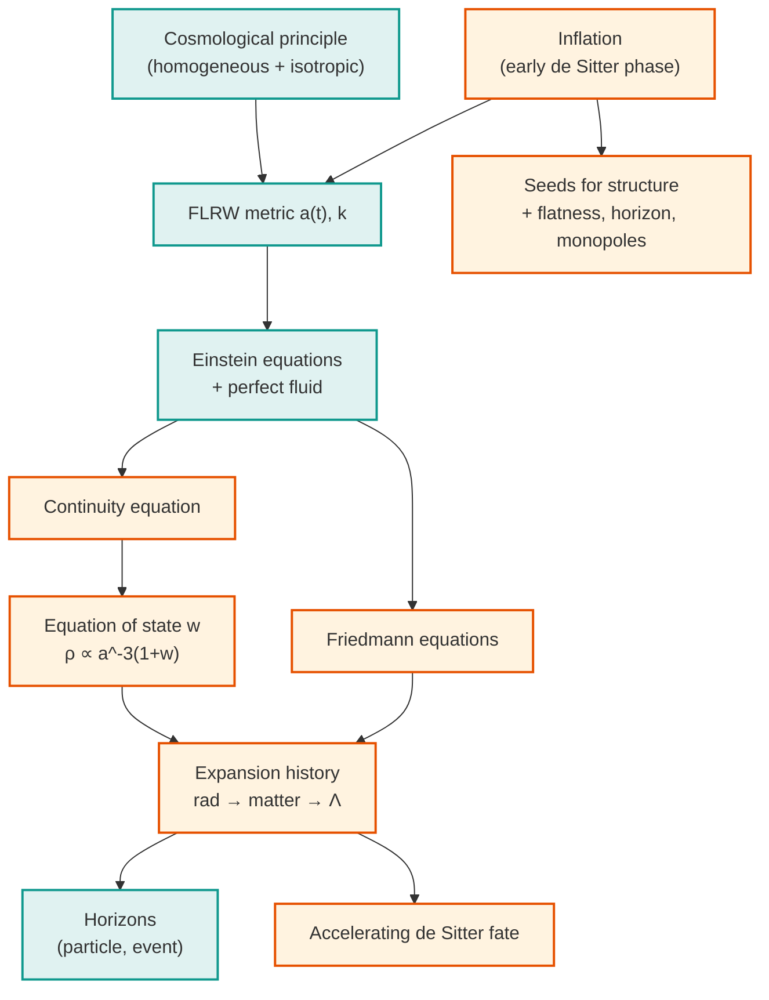

[Relativity](./) &raquo; Relativistic Cosmology

## Relativistic Cosmology

Cosmology applies the [Einstein field equations](general-relativity.html) to the universe as a whole. On scales larger than a few hundred megaparsecs the matter distribution is observed to be **homogeneous** (the same everywhere) and **isotropic** (the same in every direction). That single empirical input — the *cosmological principle* — collapses the ten coupled field equations into two ordinary differential equations for a single function of time, the scale factor $a(t)$. This page derives the FLRW metric, the Friedmann equations, and the cosmological constant; works out the expansion history of the standard $\Lambda$CDM model; defines the cosmological horizons; and closes with a brief account of inflation. It assumes [Tensor Formalism & the Field Equations](tensor-formalism.html) and the physics of [General Relativity](general-relativity.html).

**Conventions.** We work in **geometric units** with $G = c = 1$ except where a constant is restored for clarity. The metric signature is **(−,+,+,+)**. The scale factor is normalized so that today $a(t_0) = a_0 = 1$, and a subscript $0$ denotes a present-day value. The **Hubble parameter** is $H \equiv \dot{a}/a$ with present value $H_0 \approx 67$–$73~\text{km s}^{-1}\text{Mpc}^{-1}$; the dimensionless **density parameters** are $\Omega_i \equiv \rho_i/\rho_{\rm crit}$ with $\rho_{\rm crit} = 3H^2/8\pi G$. An overdot denotes $d/dt$ in cosmic time.

## The Cosmological Principle

The observable universe contains rich structure — stars, galaxies, clusters, voids — but **averaged over scales of order $100~\text{Mpc}$** these inhomogeneities wash out. Two observations support this:

- **Isotropy.** The cosmic microwave background (CMB) is the same temperature in every direction to about one part in $10^5$ after subtracting the dipole due to our own motion. Galaxy counts and radio-source counts are likewise direction-independent on large scales.
- **Homogeneity.** Combined with the Copernican assumption that we occupy no special location, isotropy about *every* point implies homogeneity. Large galaxy redshift surveys (SDSS, 2dF) confirm directly that the matter distribution becomes statistically uniform on large scales.

Mathematically, the **cosmological principle** states that space is *maximally symmetric*: at each instant of cosmic time the spatial slices are homogeneous and isotropic three-spaces. A maximally symmetric 3-space has constant curvature, and there are exactly three of them up to scale: the 3-sphere (positive curvature), flat Euclidean 3-space (zero curvature), and the hyperbolic 3-space (negative curvature). This is what forces the metric into the FLRW form below.

## The FLRW Metric

The **Friedmann–Lemaître–Robertson–Walker** (FLRW) metric is the most general line element describing a spatially homogeneous and isotropic spacetime. Writing the spatial part in comoving spherical coordinates $(r, \theta, \phi)$ and pulling all the time dependence into the single function $a(t)$:

$$ds^2 = -dt^2 + a(t)^2\left[\frac{dr^2}{1-kr^2} + r^2\left(d\theta^2 + \sin^2\theta\, d\phi^2\right)\right]$$

Here:

- $t$ is **cosmic time**, the proper time of an observer comoving with the cosmic fluid (a galaxy at fixed $r,\theta,\phi$).
- $a(t)$ is the dimensionless **scale factor**; physical distances between comoving points scale as $a(t)$, so the universe expands or contracts uniformly.
- $k \in \{-1, 0, +1\}$ is the (normalized) **spatial curvature**, distinguishing the three geometries:

| $k$ | Geometry | Spatial volume | Fate (matter-only) |
|-----|----------|----------------|--------------------|
| $+1$ | Closed (3-sphere) | finite | recollapse |
| $0$ | Flat (Euclidean) | infinite | expands forever, $\dot a \to 0$ |
| $-1$ | Open (hyperbolic) | infinite | expands forever |

A useful alternative uses a rescaled radial coordinate $\chi$ defined by $d\chi = dr/\sqrt{1-kr^2}$, which puts the metric in the form

$$ds^2 = -dt^2 + a(t)^2\left[d\chi^2 + S_k(\chi)^2\, d\Omega^2\right], \qquad S_k(\chi) = \begin{cases} \sin\chi & k=+1 \\ \chi & k=0 \\ \sinh\chi & k=-1 \end{cases}$$

with $d\Omega^2 = d\theta^2 + \sin^2\theta\, d\phi^2$. In this form the radial coordinate $\chi$ is the **comoving distance** and $a S_k(\chi)$ is the **transverse comoving (angular-diameter-related) distance**.

### Comoving vs. proper distance

A galaxy at fixed comoving coordinate $\chi$ sits at **proper distance** $d_{\rm prop}(t) = a(t)\,\chi$ from us. Differentiating,

$$\dot d_{\rm prop} = \dot a\, \chi = \frac{\dot a}{a}\, d_{\rm prop} = H(t)\, d_{\rm prop}$$

which is exactly **Hubble's law**, $v = H d$: the recession velocity is proportional to distance, with proportionality constant the Hubble parameter. Crucially this is not motion *through* space — comoving galaxies are at rest in the cosmic rest frame — but the *stretching of space itself*.

### Cosmological redshift

Light emitted at time $t_e$ with wavelength $\lambda_e$ and observed today at $t_0$ is stretched in proportion to the expansion. Following a radial null geodesic ($ds^2 = 0$) one finds that the ratio of observed to emitted wavelength equals the ratio of scale factors:

$$1 + z \equiv \frac{\lambda_0}{\lambda_e} = \frac{a(t_0)}{a(t_e)} = \frac{1}{a(t_e)}$$

using $a_0 = 1$. **Redshift is therefore a direct, model-independent measure of the scale factor at emission**: a quasar at $z = 6$ is seen as it was when the universe was $1/(1+z) = 1/7$ of its present size. This is the workhorse relation of observational cosmology.

## The Friedmann Equations

To find $a(t)$ we feed the FLRW metric into the Einstein field equations $G_{\mu\nu} + \Lambda g_{\mu\nu} = 8\pi G\, T_{\mu\nu}$. Homogeneity and isotropy force the stress–energy tensor to be that of a **perfect fluid**,

$$T^{\mu}{}_{\nu} = \mathrm{diag}(-\rho,\, p,\, p,\, p)$$

with energy density $\rho(t)$ and pressure $p(t)$ that depend only on time. Computing the Einstein tensor for the FLRW metric (the Christoffel symbols and Ricci tensor follow the recipe on the [tensor-formalism page](tensor-formalism.html)) and reading off the $tt$ and spatial components gives the two **Friedmann equations**:

$$\left(\frac{\dot{a}}{a}\right)^2 = \frac{8\pi G\,\rho}{3} - \frac{k}{a^2} + \frac{\Lambda}{3}$$

$$\frac{\ddot{a}}{a} = -\frac{4\pi G}{3}\left(\rho + 3p\right) + \frac{\Lambda}{3}$$

The **first Friedmann equation** is a constraint relating the expansion rate to the energy content and curvature; it is essentially energy conservation for the expansion. The **second Friedmann equation** (the *acceleration equation*) governs $\ddot a$: because ordinary matter and radiation have $\rho + 3p > 0$, they *decelerate* the expansion — gravity is attractive. Only a sufficiently negative-pressure component or a positive $\Lambda$ can drive acceleration.

### The continuity equation

The two Friedmann equations are not independent of how $\rho$ evolves. The conservation law $\nabla_\mu T^{\mu\nu} = 0$ (equivalently, combining the two equations above) yields the **fluid/continuity equation**:

$$\dot{\rho} + 3\frac{\dot{a}}{a}\left(\rho + p\right) = 0$$

This is the first law of thermodynamics for a comoving volume: $d(\rho V) = -p\, dV$ with $V \propto a^3$. Given an **equation of state** $p = w\rho$ with constant $w$, it integrates immediately to

$$\rho \propto a^{-3(1+w)}$$

The three components that dominate cosmic history correspond to three values of $w$:

| Component | $w$ | Scaling $\rho(a)$ | Why |
|-----------|-----|-------------------|-----|
| **Radiation** (photons, relativistic neutrinos) | $1/3$ | $\rho \propto a^{-4}$ | number density $\propto a^{-3}$ and each quantum redshifts $\propto a^{-1}$ |
| **Matter** (cold dark matter + baryons) | $0$ | $\rho \propto a^{-3}$ | pressureless dust simply dilutes with volume |
| **Dark energy** ($\Lambda$) | $-1$ | $\rho = \text{const}$ | vacuum energy density is fixed |

### Critical density and density parameters

Set $k = \Lambda = 0$ in the first Friedmann equation; the energy density required to make space exactly flat is the **critical density**:

$$\rho_{\rm crit} = \frac{3H^2}{8\pi G}, \qquad \rho_{\rm crit,0} \approx 8.5\times 10^{-27}~\text{kg m}^{-3} \approx 5~\frac{\text{proton masses}}{\text{m}^3}$$

Dividing the first Friedmann equation by $H^2$ and defining $\Omega_i = \rho_i/\rho_{\rm crit}$, plus a curvature term $\Omega_k = -k/(a^2 H^2)$ and $\Omega_\Lambda = \Lambda/(3H^2)$, gives the clean **cosmic sum rule**:

$$\Omega_m + \Omega_r + \Omega_\Lambda + \Omega_k = 1$$

Measurements (Planck) give a spatially flat universe, $\Omega_{k,0} \approx 0$, partitioned roughly as $\Omega_{\Lambda,0} \approx 0.69$, $\Omega_{m,0} \approx 0.31$ (of which only $\sim 0.05$ is baryonic), and $\Omega_{r,0} \approx 9\times 10^{-5}$. This is the **$\Lambda$CDM** ("Lambda cold dark matter") concordance model.

## The Cosmological Constant and de Sitter Space

Einstein introduced the cosmological constant $\Lambda$ in 1917 to permit a static universe; after Hubble's discovery of expansion he reportedly called it his "biggest blunder." It returned in 1998 when type Ia supernovae revealed that the expansion is **accelerating**, which the second Friedmann equation requires a positive $\Lambda$ (or equivalent $w \approx -1$ dark energy) to explain.

### $\Lambda$ as vacuum energy

A cosmological constant is mathematically identical to a perfect fluid with

$$\rho_\Lambda = \frac{\Lambda}{8\pi G}, \qquad p_\Lambda = -\rho_\Lambda \quad (w = -1)$$

Its energy density does not dilute as space expands, so it eventually dominates over matter ($\propto a^{-3}$) and radiation ($\propto a^{-4}$). Once it does, the first Friedmann equation (neglecting the now-tiny matter and curvature terms) reads $H^2 \to \Lambda/3 = \text{const}$, giving **exponential expansion**:

$$a(t) \propto e^{Ht}, \qquad H = \sqrt{\frac{\Lambda}{3}}$$

This is the late-time fate of our universe in $\Lambda$CDM: an ever-emptier, exponentially expanding **de Sitter** space.

### The de Sitter and anti-de Sitter metrics

The maximally symmetric solutions of the *vacuum* Einstein equations with $\Lambda \neq 0$ are de Sitter ($\Lambda > 0$) and anti-de Sitter ($\Lambda < 0$). In static coordinates they take a Schwarzschild-like form with a cosmological horizon:

$$ds^2 = -\left(1-\frac{r^2}{\alpha^2}\right)dt^2 + \left(1-\frac{r^2}{\alpha^2}\right)^{-1}dr^2 + r^2\, d\Omega^2 \quad \text{(de Sitter, } \Lambda > 0\text{)}$$

$$ds^2 = -\left(1+\frac{r^2}{\alpha^2}\right)dt^2 + \left(1+\frac{r^2}{\alpha^2}\right)^{-1}dr^2 + r^2\, d\Omega^2 \quad \text{(anti-de Sitter, } \Lambda < 0\text{)}$$

with curvature radius $\alpha = \sqrt{3/|\Lambda|}$. In de Sitter space $r = \alpha$ is a **cosmological event horizon**: an observer is causally cut off from events beyond it, and the horizon carries a Gibbons–Hawking temperature $T = H/2\pi$, the cosmological analogue of [Hawking radiation](black-holes.html#hawking-temperature). Anti-de Sitter space, by contrast, has no horizon and a timelike boundary at infinity; it is the arena of the AdS/CFT correspondence in [string theory](../string-theory/).

**The cosmological constant problem.** Quantum field theory predicts a vacuum energy density from zero-point fluctuations that, cut off at the Planck scale, exceeds the observed $\rho_\Lambda$ by roughly **120 orders of magnitude** — the largest discrepancy between theory and observation in physics. Why $\Lambda$ is so small but nonzero is unsolved; proposals range from quintessence (a slowly rolling scalar field with $w$ near but not exactly $-1$) to anthropic selection in a multiverse to modifications of gravity.

## Expansion History

Putting the components together, the first Friedmann equation for a flat ($k=0$) universe can be written entirely in terms of present-day density parameters and redshift. Using $\rho_i \propto a^{-3(1+w_i)}$ and $a = 1/(1+z)$:

$$H(z)^2 = H_0^2\left[\Omega_{r,0}(1+z)^4 + \Omega_{m,0}(1+z)^3 + \Omega_{k,0}(1+z)^2 + \Omega_{\Lambda,0}\right]$$

Because the four terms redshift at different rates, the universe passes through distinct **epochs**, each dominated by one component:

  <svg viewBox="0 0 640 300" style="max-width: 600px; width: 100%;">
    <text x="320" y="24" text-anchor="middle" font-size="18" font-weight="bold" fill="#2c3e50">Density Evolution and Cosmic Epochs</text>
    <defs>
      <marker id="arrow-ch" markerWidth="10" markerHeight="10" refX="8" refY="3" orient="auto" markerUnits="strokeWidth">
        <path d="M0,0 L0,6 L9,3 z" fill="#2c3e50" />
      </marker>
    </defs>
    <!-- axes -->
    <line x1="70" y1="250" x2="610" y2="250" stroke="#2c3e50" stroke-width="2.5" marker-end="url(#arrow-ch)" />
    <line x1="70" y1="250" x2="70" y2="50" stroke="#2c3e50" stroke-width="2.5" marker-end="url(#arrow-ch)" />
    <text x="600" y="275" font-size="13" font-weight="bold" fill="#2c3e50">log a (time)</text>
    <text x="78" y="48" font-size="13" font-weight="bold" fill="#2c3e50">log ρ</text>
    <!-- radiation rho ~ a^-4 (steepest) -->
    <line x1="80" y1="70" x2="560" y2="245" stroke="#c62828" stroke-width="3" />
    <text x="150" y="78" font-size="13" font-weight="bold" fill="#c62828">Radiation (a⁻⁴)</text>
    <!-- matter rho ~ a^-3 -->
    <line x1="80" y1="110" x2="560" y2="235" stroke="#1976d2" stroke-width="3" />
    <text x="150" y="128" font-size="13" font-weight="bold" fill="#1976d2">Matter (a⁻³)</text>
    <!-- dark energy const -->
    <line x1="80" y1="200" x2="610" y2="200" stroke="#2e7d32" stroke-width="3" />
    <text x="430" y="193" font-size="13" font-weight="bold" fill="#2e7d32">Dark energy (const)</text>
    <!-- equality markers -->
    <line x1="190" y1="60" x2="190" y2="250" stroke="#757575" stroke-width="1.5" stroke-dasharray="5,4" />
    <text x="190" y="268" text-anchor="middle" font-size="11" fill="#555">matter–radiation</text>
    <line x1="500" y1="60" x2="500" y2="250" stroke="#757575" stroke-width="1.5" stroke-dasharray="5,4" />
    <text x="500" y="268" text-anchor="middle" font-size="11" fill="#555">matter–Λ</text>
    <!-- epoch labels -->
    <text x="125" y="245" text-anchor="middle" font-size="11" fill="#c62828">rad. era</text>
    <text x="345" y="245" text-anchor="middle" font-size="11" fill="#1976d2">matter era</text>
    <text x="555" y="245" text-anchor="middle" font-size="11" fill="#2e7d32">Λ era</text>
  </svg>

**Radiation-dominated era** ($z \gtrsim 3400$, $t \lesssim 50{,}000$ yr). With $\rho \propto a^{-4}$ the Friedmann equation gives $a \propto t^{1/2}$. Nucleosynthesis (forging helium and deuterium) occurs here at $t \sim 1$–$3$ min.

**Matter-dominated era** ($3400 \gtrsim z \gtrsim 0.3$). With $\rho \propto a^{-3}$ one finds $a \propto t^{2/3}$. Recombination and the release of the CMB occur at $z \approx 1100$; gravitational structure formation proceeds throughout.

**Dark-energy-dominated era** ($z \lesssim 0.3$, beginning a few Gyr ago). $\Lambda$ takes over, $\ddot a > 0$, and the expansion accelerates toward the de Sitter regime $a \propto e^{Ht}$.

For a **single component** with equation of state $w \neq -1$ in a flat universe, the generic power-law solution is worth memorizing:

$$a(t) \propto t^{\frac{2}{3(1+w)}} \quad\Longrightarrow\quad \begin{cases} a \propto t^{1/2} & \text{radiation } (w=1/3) \\ a \propto t^{2/3} & \text{matter } (w=0) \end{cases}$$

### The age of the universe

The age follows from integrating $dt = da/\dot a = da/(aH)$:

$$t_0 = \int_0^1 \frac{da}{a\,H(a)} = \frac{1}{H_0}\int_0^\infty \frac{dz}{(1+z)\,E(z)}, \qquad E(z) \equiv H(z)/H_0$$

For the Planck $\Lambda$CDM parameters this gives $t_0 \approx 13.8$ billion years. The combination $1/H_0 \approx 14.4$ Gyr is the **Hubble time**; that $t_0$ comes out close to it is a coincidence of the present epoch, when deceleration (matter) and acceleration ($\Lambda$) roughly balance in the integral.

## Horizons

Because light travels at finite speed in an expanding universe, there are fundamental limits on what we can see and influence. Two distinct horizons matter.

### The particle (comoving) horizon

The **particle horizon** is the comoving distance light could have traveled since the Big Bang ($t = 0$) — the boundary of the observable universe:

$$\chi_{\rm ph}(t) = \int_0^{t} \frac{dt'}{a(t')} = \int_0^{a} \frac{da'}{a'^2 H(a')}$$

Its present *proper* radius, $a_0\,\chi_{\rm ph}$, is about $46$ billion light-years — far larger than the naive $c\,t_0 \approx 14$ billion light-years, because space expanded while the light was in transit. Regions beyond the particle horizon have never been in causal contact with us.

### The event horizon

The **cosmological event horizon** is the comoving distance light emitted *now* can ever reach in the infinite future:

$$\chi_{\rm eh}(t) = \int_{t}^{\infty} \frac{dt'}{a(t')}$$

In a matter-only or radiation-only universe this integral diverges — there is no event horizon, and given enough time we could signal any comoving point. But with dark energy driving $a \propto e^{Ht}$, the integral *converges*: distant galaxies are accelerating away faster than light can cross the growing gap, and an event horizon forms at proper radius $\approx 1/H_0 \approx 16$ billion light-years. Galaxies beyond it are receding superluminally (a consequence of stretching space, not local motion) and their light will never reach us. Over the coming $\sim 100$ Gyr nearly all galaxies outside the Local Group will redshift away and disappear.

**Particle horizon vs. event horizon.** The **particle horizon** looks *backward*: it bounds the part of the universe we can already *see*. The **event horizon** looks *forward*: it bounds the part we can ever *reach or influence*. A static or decelerating universe has a particle horizon but no event horizon; an accelerating (de Sitter–like) universe has both.

## A Brief Overview of Inflation

The hot Big Bang model, despite its success, leaves several initial-condition puzzles unexplained:

- **The horizon problem.** Regions of the CMB separated by more than $\sim 1°$ were never in causal contact under standard radiation/matter expansion, yet they share the same temperature to one part in $10^5$. How did they thermalize?
- **The flatness problem.** $\Omega_k = 0$ is an unstable fixed point: any small initial curvature grows during radiation and matter domination. For $\Omega$ to be near $1$ today it must have been tuned to $1$ to better than $1$ part in $10^{60}$ at early times.
- **The monopole problem.** Grand unified theories predict copious magnetic monopoles and other relics that are not observed.

**Cosmic inflation** (Guth, Linde, Albrecht & Steinhardt, c. 1980) solves all three with a brief epoch of near-exponential expansion in the very early universe, $t \sim 10^{-36}$–$10^{-32}$ s. A scalar field $\phi$ (the *inflaton*) with potential $V(\phi)$ dominates the energy density while "slowly rolling" down a nearly flat region of its potential. With $\dot\phi^2 \ll V(\phi)$ its equation of state approaches $w \approx -1$, so it acts like a temporary, large cosmological constant and drives quasi-de-Sitter expansion:

$$a(t) \propto e^{Ht}, \qquad H^2 \approx \frac{8\pi G}{3}V(\phi)$$

A factor of $e^{60}$ or more of expansion (at least 60 *e-folds*) accomplishes the following:

- **Horizon problem solved:** the entire observable universe inflated from a single, tiny, causally connected patch, explaining its uniformity.
- **Flatness problem solved:** the enormous stretch flattens any initial curvature, driving $\Omega_k \to 0$ regardless of where it started — a robust prediction of near-perfect spatial flatness, confirmed by Planck.
- **Monopoles diluted:** any pre-inflationary relics are spread so thin (one per Hubble volume or fewer) as to be unobservable.

Inflation's most striking success is **structure formation**: quantum fluctuations of the inflaton, stretched to cosmological scales and frozen in, seed the tiny density perturbations that grow into galaxies. The model predicts a *nearly* scale-invariant spectrum with a slight red tilt ($n_s \approx 0.965$), Gaussian, adiabatic primordial perturbations, and a stochastic background of primordial gravitational waves. The first two are strikingly confirmed by the CMB power spectrum; detecting the inflationary gravitational-wave signature (B-mode polarization, parameterized by the tensor-to-scalar ratio $r$) remains a major experimental goal.

## How It Fits Together

The chain is tight: the cosmological principle fixes the metric up to one function and one discrete parameter; the field equations turn that into the Friedmann equations; the equation of state of each component dictates how its density dilutes; and the sum of those components, integrated, gives the entire history — from an inflationary beginning, through radiation and matter domination, to the accelerating, horizon-bounded de Sitter future we are entering now.

## See Also

Within relativity:

- [Tensor Formalism & the Field Equations](tensor-formalism.html) — the curvature machinery and Einstein equations used to derive the Friedmann equations.
- [General Relativity](general-relativity.html) — the equivalence principle, the field equations in context, and the Schwarzschild solution.
- [Graduate Formalism & Frontiers](advanced.html) — exact solutions (Kerr, de Sitter), horizons and Hawking/Gibbons–Hawking temperature, and quantum-gravity frontiers.
- [Relativity Hub](./) — overview and navigation.

Elsewhere in physics:

- [Thermodynamics](../thermodynamics.html) — the adiabatic expansion underlying the continuity equation and the thermal history of the universe.
- [Quantum Field Theory](../quantum-field-theory.html) — vacuum energy, the inflaton field, and the origin of primordial fluctuations.
- [String Theory](../string-theory/) — anti-de Sitter space and the AdS/CFT correspondence.
- [Physics Hub](../) — browse all physics topics.
