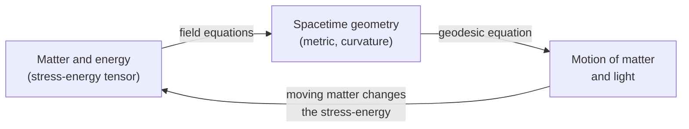

[Relativity](./) &raquo; General Relativity

## General Relativity

**General relativity** (GR) is Einstein's theory of gravitation, completed in November 1915. It replaces Newton's instantaneous force with geometry: mass and energy curve four-dimensional spacetime, and freely falling bodies follow the straightest possible paths (geodesics) through that curved geometry. John Wheeler's summary is still the best one-line description: *spacetime tells matter how to move; matter tells spacetime how to curve.*

This page covers the physical principles, the mathematical structure (metric, geodesics, curvature, field equations), the Schwarzschild solution and its consequences, the experimental record from Mercury's perihelion to the 2025 gravitational-wave tests, and the problems GR leaves open. It assumes [Special Relativity](special-relativity.html). The differential geometry is developed properly on [Tensor Formalism & the Field Equations](tensor-formalism.html); here it is stated and interpreted.

**Conventions.** Metric signature $(-,+,+,+)$; Greek indices run over $0$–$3$, Latin indices over spatial $1$–$3$; repeated indices are summed. Factors of $G$ and $c$ are kept on this page. The Schwarzschild radius is $r_s = 2GM/c^2$.

## Physical Foundations

### The equivalence principle

Galileo's observation that all bodies fall with the same acceleration means gravitational mass equals inertial mass. Einstein turned this coincidence into a principle. It comes in three strengths:

| Version | Statement | Status |
|---------|-----------|--------|
| **Weak (WEP)** | The trajectory of a freely falling test body is independent of its composition and internal structure. | Verified to about $10^{-15}$ (MICROSCOPE satellite, final result 2022). |
| **Einstein (EEP)** | WEP holds, *and* the outcome of any local non-gravitational experiment in a freely falling frame is independent of the frame's velocity and location. | Tested by clock-comparison, redshift, and Lorentz-invariance experiments. |
| **Strong (SEP)** | EEP extended to gravitational experiments and to self-gravitating bodies. | Tested by lunar laser ranging (Nordtvedt effect) and pulsars in triple systems. GR satisfies SEP; most alternative theories do not. |

The operational content is that a small, freely falling laboratory is indistinguishable from an inertial frame in empty space, and a laboratory resting on a planet is indistinguishable from one accelerating in a rocket.

<figure class="diagram">
<svg viewBox="0 0 560 250" role="img" aria-label="Equivalence principle: an observer in a rocket accelerating at g feels the same weight as an observer standing on Earth" style="max-width: 560px; width: 100%; color: inherit;">
  <defs>
    <marker id="gr-eq-arrow" markerWidth="10" markerHeight="10" refX="8" refY="3" orient="auto" markerUnits="strokeWidth">
      <path d="M0,0 L0,6 L9,3 z" fill="currentColor"/>
    </marker>
  </defs>
  <g fill="none" stroke="currentColor" stroke-width="2">
    <!-- rocket cabin -->
    <rect x="60" y="60" width="160" height="140" rx="6"/>
    <path d="M60,60 L140,20 L220,60"/>
    <path d="M100,200 L90,230 M180,200 L190,230" stroke-dasharray="4,3"/>
    <!-- person A -->
    <circle cx="140" cy="115" r="10"/>
    <path d="M140,125 L140,165 M140,140 L125,152 M140,140 L155,152 M140,165 L130,195 M140,165 L150,195"/>
    <!-- acceleration arrow -->
    <path d="M40,190 L40,80" marker-end="url(#gr-eq-arrow)"/>
    <!-- Earth cabin -->
    <rect x="340" y="60" width="160" height="140" rx="6"/>
    <path d="M320,200 L520,200" stroke-width="4"/>
    <path d="M330,210 L345,200 M360,210 L375,200 M390,210 L405,200 M420,210 L435,200 M450,210 L465,200 M480,210 L495,200" stroke-width="1"/>
    <circle cx="420" cy="115" r="10"/>
    <path d="M420,125 L420,165 M420,140 L405,152 M420,140 L435,152 M420,165 L410,195 M420,165 L430,195"/>
    <!-- gravity arrow -->
    <path d="M540,80 L540,190" marker-end="url(#gr-eq-arrow)"/>
    <!-- dropped balls -->
    <circle cx="180" cy="100" r="5"/>
    <circle cx="460" cy="100" r="5"/>
    <path d="M180,110 L180,140 M460,110 L460,140" stroke-dasharray="3,3" marker-end="url(#gr-eq-arrow)"/>
  </g>
  <g fill="currentColor" font-size="13" text-anchor="middle">
    <text x="140" y="245">Rocket in deep space, a = g</text>
    <text x="420" y="245">Room at rest on Earth</text>
    <text x="280" y="135" font-size="28">=</text>
    <text x="22" y="140" transform="rotate(-90 22 140)">thrust a</text>
    <text x="555" y="140" transform="rotate(90 555 140)">gravity g</text>
  </g>
</svg>
<figcaption>No local experiment distinguishes the two cabins: a dropped ball "falls" at $g$ in both. A freely falling cabin is likewise indistinguishable from an inertial one far from all masses.</figcaption>
</figure>

Two consequences follow before any field equations are written down:

- **Light bends.** A light ray crossing an accelerating cabin traces a curved path in the cabin frame, so by equivalence it must also bend in a gravitational field.
- **Clocks run slow deeper in a potential.** A photon climbing from floor to ceiling of an accelerating cabin is Doppler-redshifted; by equivalence, light climbing out of a gravitational well is redshifted by $\Delta\nu/\nu \approx -\Delta\Phi/c^2$.

Because gravity cannot be "transformed away" globally — two freely falling bodies on opposite sides of Earth accelerate toward each other — the equivalence principle is strictly *local*. What remains after all first-order effects are removed is **tidal acceleration**, and GR identifies tidal acceleration with spacetime curvature.

### General covariance

The laws of physics are written as tensor equations, which take the same form in every coordinate system. Coordinates in GR are labels with no intrinsic meaning; only invariants (proper times, proper distances, curvature scalars, the outcomes of measurements) are physical. Combined with the equivalence principle this gives a working recipe: take a law valid in special relativity, replace $\eta_{\mu\nu}$ with $g_{\mu\nu}$ and partial derivatives with covariant derivatives ("comma goes to semicolon"), and the result holds in curved spacetime.

### Gravity as geometry

The two halves of the theory form a feedback loop, which is what makes GR nonlinear: the curvature produced by matter also carries energy that itself gravitates.

## Mathematical Structure

### The metric

All geometric information is encoded in the **metric tensor** $g_{\mu\nu}(x)$, a symmetric $4\times 4$ field that turns coordinate displacements into invariant intervals:

$$ds^2 = g_{\mu\nu}\,dx^\mu\,dx^\nu$$

In flat spacetime with Cartesian coordinates it reduces to the Minkowski metric, $ds^2 = -c^2dt^2 + dx^2 + dy^2 + dz^2$. For a timelike worldline the elapsed **proper time** — what a clock carried along it reads — is $d\tau^2 = -ds^2/c^2$. At any single event one can always choose coordinates in which $g_{\mu\nu} = \eta_{\mu\nu}$ and its first derivatives vanish (locally inertial or Riemann normal coordinates); this is the mathematical form of the equivalence principle. The *second* derivatives cannot all be removed, and they are the curvature.

### Geodesics: how matter moves

A freely falling particle follows a **geodesic**, the worldline that extremizes (for timelike curves, maximizes) proper time between two events:

$$\frac{d^2x^\mu}{d\tau^2} + \Gamma^\mu_{\alpha\beta}\,\frac{dx^\alpha}{d\tau}\frac{dx^\beta}{d\tau} = 0$$

The **Christoffel symbols** of the Levi-Civita connection are built from first derivatives of the metric:

$$\Gamma^\mu_{\alpha\beta} = \frac{1}{2}g^{\mu\nu}\left(\partial_\alpha g_{\nu\beta} + \partial_\beta g_{\nu\alpha} - \partial_\nu g_{\alpha\beta}\right)$$

The $\Gamma$ terms play the role of the Newtonian gravitational force, but they are not tensors: they vanish in a freely falling frame, which is why a falling observer feels no force. Light follows **null geodesics** ($ds^2 = 0$), parameterized by an affine parameter rather than proper time.

**Newtonian limit.** For slow motion ($dx^i/d\tau \ll c$) in a weak, static field, the geodesic equation reduces to $\ddot{x}^i = -\partial_i \Phi$ provided

$$g_{00} \approx -\left(1 + \frac{2\Phi}{c^2}\right)$$

where $\Phi$ is the Newtonian potential. Newtonian gravity is thus the statement that clocks run at a rate set by the local potential; for most everyday purposes the time part of the metric *is* gravity. (Derivation: [Tensor Formalism — The Newtonian Limit](tensor-formalism.html#the-newtonian-limit).)

### Curvature: tidal forces

Curvature is measured by the **Riemann tensor**, which records how a vector changes when parallel-transported around a small closed loop:

$$R^\rho{}_{\sigma\mu\nu} = \partial_\mu\Gamma^\rho_{\nu\sigma} - \partial_\nu\Gamma^\rho_{\mu\sigma} + \Gamma^\rho_{\mu\lambda}\Gamma^\lambda_{\nu\sigma} - \Gamma^\rho_{\nu\lambda}\Gamma^\lambda_{\mu\sigma}$$

Its physical meaning is **geodesic deviation**: two neighbouring free-fall worldlines with tangent $u^\mu$ and separation $\xi^\mu$ accelerate relative to one another as

$$\frac{D^2\xi^\mu}{d\tau^2} = R^\mu{}_{\nu\rho\sigma}\,u^\nu u^\rho \xi^\sigma$$

which in the Newtonian limit is the tidal equation $\ddot\xi^i = -(\partial_i\partial_j\Phi)\,\xi^j$. The Riemann tensor is the relativistic tidal tensor. Its contractions are the **Ricci tensor** $R_{\mu\nu} = R^\rho{}_{\mu\rho\nu}$ and the **Ricci scalar** $R = g^{\mu\nu}R_{\mu\nu}$. In four dimensions the Riemann tensor has 20 independent components: 10 are in the Ricci tensor (fixed locally by matter) and 10 in the trace-free **Weyl tensor**, which describes curvature that propagates through vacuum — tidal fields and gravitational waves.

### The Einstein field equations

The field equations relate curvature to the stress–energy tensor $T_{\mu\nu}$:

$$G_{\mu\nu} + \Lambda g_{\mu\nu} = \frac{8\pi G}{c^4}\,T_{\mu\nu}, \qquad G_{\mu\nu} \equiv R_{\mu\nu} - \frac{1}{2}R\,g_{\mu\nu}$$

| Symbol | Name | Meaning |
|--------|------|---------|
| $g_{\mu\nu}$ | Metric | The geometry; the unknown being solved for |
| $R_{\mu\nu}$, $R$ | Ricci tensor, Ricci scalar | Contractions of the Riemann curvature |
| $G_{\mu\nu}$ | Einstein tensor | The unique divergence-free combination of $R_{\mu\nu}$, $R$, $g_{\mu\nu}$ |
| $\Lambda$ | Cosmological constant | Curvature of empty space; observed $\Lambda \approx 1.1\times10^{-52}\ \text{m}^{-2}$ |
| $T_{\mu\nu}$ | Stress–energy tensor | Energy density, momentum density, pressure, and stress |
| $8\pi G/c^4$ | Coupling | $\approx 2.1\times10^{-43}\ \text{N}^{-1}$: spacetime is extremely stiff |

Key structural facts:

- **Conservation is built in.** The contracted Bianchi identity $\nabla_\mu G^{\mu\nu} = 0$ holds identically, so the equations force $\nabla_\mu T^{\mu\nu} = 0$. Local energy–momentum conservation, and with it the geodesic motion of small bodies, is a consequence of the field equations rather than an extra assumption.
- **Counting.** There are 10 equations for the 10 components of $g_{\mu\nu}$, but the Bianchi identity leaves only 6 independent evolution equations; the remaining 4 degrees of freedom are the coordinate (gauge) choice. The 4 equations $G^{0\mu} = (8\pi G/c^4)T^{0\mu}$ contain no second time derivatives and act as **constraints** on initial data, as Gauss's law does in electromagnetism.
- **Trace-reversed form.** Taking the trace and substituting back gives
  $$R_{\mu\nu} = \frac{8\pi G}{c^4}\left(T_{\mu\nu} - \frac{1}{2}T\,g_{\mu\nu}\right) + \Lambda g_{\mu\nu}$$
  In vacuum with $\Lambda = 0$ the equations are simply $R_{\mu\nu} = 0$ — which does *not* mean spacetime is flat, because the Weyl curvature is unconstrained.
- **Nonlinearity.** Unlike Maxwell's equations, the field equations are nonlinear in $g_{\mu\nu}$, so solutions cannot be superposed. Exact solutions exist only with high symmetry; general problems such as black-hole mergers require [numerical relativity](../computational-physics/).

**Action principle.** The same equations follow from varying the Einstein–Hilbert action with respect to $g^{\mu\nu}$:

$$S = \frac{c^4}{16\pi G}\int \left(R - 2\Lambda\right)\sqrt{-g}\,d^4x \;+\; S_{\rm matter}, \qquad T_{\mu\nu} = -\frac{2}{\sqrt{-g}}\frac{\delta S_{\rm matter}}{\delta g^{\mu\nu}}$$

Lovelock's theorem (1971) shows that in four dimensions $G_{\mu\nu}$ and $\Lambda g_{\mu\nu}$ are the only divergence-free, second-order tensors built from the metric, which is why the field equations are essentially unique. The full variation is on [Tensor Formalism — The Einstein–Hilbert Action](tensor-formalism.html#route-2-the-einsteinhilbert-action).

## The Schwarzschild Solution

Karl Schwarzschild found the first exact solution in 1916: the vacuum field outside any static, spherically symmetric mass $M$.

$$ds^2 = -\left(1 - \frac{r_s}{r}\right)c^2dt^2 + \left(1 - \frac{r_s}{r}\right)^{-1}dr^2 + r^2\left(d\theta^2 + \sin^2\theta\,d\phi^2\right), \qquad r_s = \frac{2GM}{c^2}$$

**Birkhoff's theorem** guarantees that this is the *unique* spherically symmetric vacuum solution, even if the source is pulsating or collapsing — so a spherical star cannot emit gravitational waves, and the exterior of the Sun, a neutron star, and a non-rotating black hole are described by the same metric.

**Reading the metric.**

- The coordinate $r$ is defined so that a sphere at $r$ has area $4\pi r^2$; it is not the proper radial distance.
- The factor $(1 - r_s/r)$ on $dt^2$ is gravitational time dilation: a static clock at $r$ ticks at rate $d\tau/dt = \sqrt{1 - r_s/r}$ relative to one at infinity.
- The inverse factor on $dr^2$ stretches radial distances: the proper distance between two spheres exceeds the difference of their $r$ values.
- For $r \gg r_s$ the metric approaches Minkowski with $g_{00} \approx -(1 + 2\Phi/c^2)$, $\Phi = -GM/r$, recovering Newton.
- At $r = r_s$ the $g_{rr}$ component diverges, but this is a **coordinate singularity**: curvature invariants are finite there, and other coordinates (Eddington–Finkelstein, Kruskal–Szekeres) pass smoothly through. The surface $r = r_s$ is the **event horizon**. The genuine curvature singularity is at $r = 0$. See [Black Holes](black-holes.html).

For the Sun $r_s \approx 2.95$ km, for Earth $\approx 8.9$ mm, which is why relativistic corrections in the Solar System are of order $r_s/r \sim 10^{-6}$ to $10^{-9}$.

### Characteristic radii

Orbits in Schwarzschild spacetime differ qualitatively from Kepler orbits near the mass. The effective potential for radial motion has an extra attractive term $\propto -r_s L^2/r^3$ that dominates at small $r$, producing three landmark radii:

<figure class="diagram">
<svg viewBox="0 0 600 170" role="img" aria-label="Schwarzschild characteristic radii: event horizon at r_s, photon sphere at 1.5 r_s, innermost stable circular orbit at 3 r_s" style="max-width: 600px; width: 100%; color: inherit;">
  <g fill="none" stroke="currentColor" stroke-width="2">
    <path d="M40,120 L580,120"/>
    <path d="M40,114 L40,126 M190,114 L190,126 M265,114 L265,126 M415,114 L415,126 M565,114 L565,126" />
    <rect x="40" y="95" width="150" height="25" fill="currentColor" fill-opacity="0.25" stroke="none"/>
    <path d="M190,40 L190,120" stroke-width="3"/>
    <path d="M265,40 L265,120" stroke-dasharray="6,4"/>
    <path d="M415,40 L415,120" stroke-dasharray="2,4"/>
  </g>
  <g fill="currentColor" font-size="13" text-anchor="middle">
    <text x="40" y="145">0</text>
    <text x="190" y="145">r_s</text>
    <text x="265" y="145">1.5 r_s</text>
    <text x="415" y="145">3 r_s</text>
    <text x="565" y="145">4.5 r_s</text>
    <text x="310" y="165">Schwarzschild radial coordinate r</text>
    <text x="115" y="88">inside horizon</text>
    <text x="190" y="32">event horizon</text>
    <text x="265" y="20">photon sphere</text>
    <text x="415" y="32">ISCO</text>
    <text x="495" y="75">stable circular</text>
    <text x="495" y="92">orbits allowed</text>
    <text x="340" y="75">plunge region</text>
  </g>
</svg>
<figcaption>Landmark radii of a Schwarzschild black hole. Stable circular orbits exist only outside the ISCO; between the photon sphere and the ISCO circular orbits are unstable; light itself can circle at the photon sphere.</figcaption>
</figure>

| Radius | Value | Significance |
|--------|-------|--------------|
| Event horizon | $r_s = 2GM/c^2$ | Boundary from which no signal escapes to infinity |
| Photon sphere | $\tfrac{3}{2}r_s = 3GM/c^2$ | Unstable circular light orbits; sets the size of a black-hole "shadow" ($\approx 2.6\,r_s$ in radius as seen from afar) |
| Innermost stable circular orbit (ISCO) | $3r_s = 6GM/c^2$ | Inner edge of a thin accretion disk; matter inside plunges. Radiative efficiency of a disk ending here is about 5.7% of $mc^2$ |

For a rotating (Kerr) black hole the ISCO moves inward for prograde orbits, down to $GM/c^2$ for maximal spin, raising the efficiency to about 42%.

### Gravitational time dilation and redshift

A static clock at radius $r$ ticks slower than an identical clock at infinity:

$$\frac{d\tau}{dt} = \sqrt{1 - \frac{r_s}{r}} \;\approx\; 1 - \frac{GM}{rc^2}$$

Light emitted at radius $r_e$ and received by a static observer at $r_o$ is shifted by

$$1 + z = \frac{\nu_e}{\nu_o} = \sqrt{\frac{1 - r_s/r_o}{1 - r_s/r_e}}$$

which is a redshift ($z > 0$) when the emitter is deeper in the well. In the weak-field limit $z \approx (\Phi_o - \Phi_e)/c^2$. At Earth's surface a height difference of $1$ m changes clock rates by about $1.1\times10^{-16}$ — now directly measurable: optical atomic clocks resolve the redshift across a single millimetre-scale atomic sample (JILA, 2022), and "relativistic geodesy" uses clock comparisons to measure height differences.

### Proper time and the clock examples

Proper time is path-dependent: between two events, different worldlines accumulate different $\int d\tau$. Both special- and general-relativistic clock effects are instances of this single fact.

**The twin paradox.** Alice travels to a star $4$ light-years away at $v = 0.8c$ and returns; Bob stays home. With $\gamma = 1/\sqrt{1-0.8^2} = 5/3$, Bob's clock records $\Delta t = 10$ years and Alice's records $\Delta\tau = \Delta t/\gamma = 6$ years. The situation is not symmetric: Bob's worldline is a geodesic of flat spacetime (maximal proper time), Alice's is not. No gravity is needed to resolve it — see [Special Relativity](special-relativity.html).

**GPS.** Satellite clocks orbit at $r \approx 26{,}560$ km with $v \approx 3.87$ km/s. Their smaller potential depth makes them run *fast* by about $+45.7\ \mu\text{s/day}$ relative to ground clocks; their orbital speed makes them run *slow* by about $-7.2\ \mu\text{s/day}$. The net $+38.5\ \mu\text{s/day}$ would accumulate a ranging error of roughly $10$ km per day if uncorrected, so the satellite clocks are deliberately offset in frequency before launch.

## Experimental Tests

GR has passed every experimental test to date, across more than twenty orders of magnitude in field strength. The **parameterized post-Newtonian (PPN)** formalism quantifies Solar-System tests: metric theories are characterized by parameters such as $\gamma$ (space curvature per unit mass) and $\beta$ (nonlinearity), both equal to $1$ in GR.

### The classical tests

| Effect | GR prediction | Measured |
|--------|---------------|----------|
| **Perihelion precession** | $\Delta\phi = \dfrac{6\pi GM}{c^2 a(1-e^2)}$ per orbit; $42.98''$ per century for Mercury | Agrees to better than $10^{-3}$; the anomaly was known since Le Verrier (1859) and was GR's first success in 1915 |
| **Light deflection** | $\delta = \dfrac{4GM}{c^2 b}$ — twice the Newtonian corpuscular value; $1.75''$ at the solar limb | Eddington's 1919 eclipse expedition (roughly 20% precision); VLBI of quasars now gives $\gamma$ to $\sim 10^{-4}$ |
| **Gravitational redshift** | $z \approx \Delta\Phi/c^2$ | Pound–Rebka tower (1959); Gravity Probe A hydrogen maser (1976, $7\times10^{-5}$); Galileo satellites in eccentric orbits (2018, $\sim 2\times10^{-5}$) |
| **Shapiro time delay** | Round-trip radar delay $\approx \dfrac{4GM}{c^3}\ln\dfrac{4r_1r_2}{b^2}$ | Cassini (2003): $\gamma - 1 = (2.1 \pm 2.3)\times10^{-5}$ |

The factor of 2 in light deflection is instructive: half comes from the time part of the metric (the Newtonian-like part), half from the spatial curvature, so light bending tests space curvature directly.

### Modern tests

- **Frame dragging and geodetic precession.** Gravity Probe B (2011) measured gyroscope precession in Earth orbit: geodetic $6601.8 \pm 18.3$ mas/yr (GR: $6606.1$) and frame dragging $37.2 \pm 7.2$ mas/yr (GR: $39.2$). Laser-ranged satellites (LAGEOS, LARES) independently confirm Lense–Thirring precession.
- **Binary pulsars.** The Hulse–Taylor pulsar (discovered 1974) showed orbital decay matching gravitational-wave emission (1993 Nobel Prize). The Double Pulsar PSR J0737−3039A/B now tests the quadrupole formula to about $10^{-4}$ and measures several independent relativistic effects in a single system (Kramer et al., 2021).
- **Stars around Sagittarius A\*.** The GRAVITY collaboration measured the gravitational redshift of the star S2 at pericentre (2018) and its Schwarzschild orbital precession (2020), a strong-field test around a $4\times10^6\,M_\odot$ black hole.
- **Black-hole imaging.** The Event Horizon Telescope imaged the shadows of M87\* (2019) and Sgr A\* (2022); ring diameters match the Kerr prediction to within about 10–20%.
- **Gravitational waves.** Direct detections since 2015 test GR in the dynamical, strong-field regime: waveform consistency, ringdown spectroscopy, the speed of gravity (equal to $c$ to $\sim10^{-15}$ from GW170817), and, with the exceptionally loud GW250114 (2025), Hawking's area theorem and the first confident measurement of a ringdown overtone. See [Gravitational Waves](gravitational-waves.html).
- **Cosmology.** The expansion history, the CMB, and structure growth are all modelled with GR; see [Relativistic Cosmology](cosmology.html). This is the regime where GR's predictions depend most on the unknown dark sector.

## Beyond Schwarzschild

The field equations support a small number of important exact solutions and a much larger set of approximation schemes:

| Solution or method | Describes | Where covered |
|--------------------|-----------|---------------|
| Kerr (1963) | Rotating black holes; frame dragging, ergosphere | [Black Holes](black-holes.html#the-kerr-solution) |
| Reissner–Nordström, Kerr–Newman | Charged (and rotating) black holes | [Black Holes](black-holes.html) |
| FLRW | Homogeneous, isotropic expanding universe | [Cosmology](cosmology.html) |
| de Sitter / anti-de Sitter | Maximally symmetric spacetimes with $\Lambda \neq 0$ | [Cosmology](cosmology.html#de-sitter-and-anti-de-sitter-space) |
| Linearized gravity | Weak fields and gravitational waves | [Gravitational Waves](gravitational-waves.html) |
| Post-Newtonian expansion | Slow-motion, weak-field systems (Solar System, early binary inspiral) | [Gravitational Waves](gravitational-waves.html#the-three-phases-inspiral-merger-ringdown) |
| Numerical relativity | Fully nonlinear dynamics: mergers, collapse | [Computational Physics](../computational-physics/) |

## Limitations and Open Problems

GR is a classical field theory, and it predicts its own limits:

- **Singularities.** The Penrose–Hawking singularity theorems show that, under reasonable energy conditions, gravitational collapse and the Big Bang produce geodesics that end in finite proper time. GR cannot describe what happens there.
- **Quantum gravity.** Quantizing the metric perturbatively gives a non-renormalizable theory; GR is best understood as a low-energy effective field theory valid far below the Planck scale ($\sim 10^{19}$ GeV). See [Quantum Gravity](quantum-gravity.html).
- **Black-hole information.** Hawking radiation appears to destroy information, in conflict with quantum unitarity. See [Black Holes — The Information Paradox](black-holes.html#the-information-paradox).
- **The dark sector.** About 95% of the cosmic energy budget is attributed to dark matter and dark energy, detected only gravitationally. Whether these reflect new matter or a failure of GR on large scales is open; recent baryon-acoustic-oscillation data (DESI, 2025) mildly favour dark energy that evolves in time over a pure cosmological constant.
- **The cosmological constant problem.** Naive quantum-field-theory estimates of vacuum energy exceed the observed $\Lambda$ by up to about 120 orders of magnitude.

## See Also

- [Special Relativity](special-relativity.html) — the flat-spacetime theory GR generalizes.
- [Tensor Formalism & the Field Equations](tensor-formalism.html) — manifolds, connections, curvature, and derivations of the field equations.
- [Black Holes](black-holes.html) — Schwarzschild and Kerr geometry, horizons, and black-hole thermodynamics.
- [Relativistic Cosmology](cosmology.html) — GR applied to the universe as a whole.
- [Gravitational Waves](gravitational-waves.html) — linearized gravity, radiation, and detection.
- [Quantum Gravity](quantum-gravity.html) — where GR and quantum theory conflict.
- [Graduate Topics Hub](advanced.html) — how the deep-dive pages fit together.
- [Computational Physics](../computational-physics/) — numerical relativity.
- [Physics Hub](../) — all physics topics.
