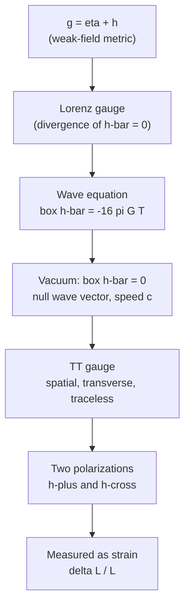
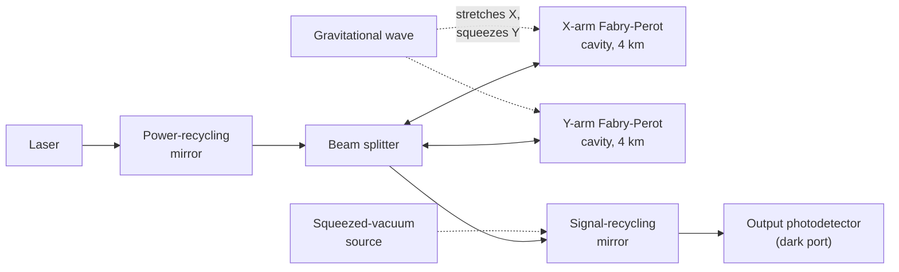
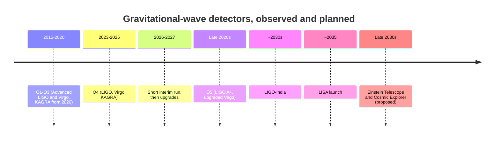

[Relativity](./) &raquo; Gravitational Waves

## Gravitational Waves

**Gravitational waves** are propagating ripples in spacetime curvature, predicted by Einstein in 1916, inferred from binary-pulsar orbital decay in the 1970s–80s, and first detected directly on 14 September 2015. This page develops them from the linearized field equations through gauge fixing and the two physical polarizations, the quadrupole formula for generation and energy loss, the inspiral–merger–ringdown of compact binaries, and interferometric detection. It closes with the observational record through the end of the fourth LIGO–Virgo–KAGRA observing run (O4) in November 2025, and the detectors planned for the next two decades.

It assumes [General Relativity](general-relativity.html) and the differential geometry on [Tensor Formalism](tensor-formalism.html).

**Conventions.** Geometric units $G = c = 1$ except where $G$ and $c$ are shown explicitly. Signature $(-,+,+,+)$. Greek indices run over $0$–$3$, Latin over spatial $1$–$3$; repeated indices are summed. $\Box \equiv \eta^{\mu\nu}\partial_\mu\partial_\nu = -\partial_t^2 + \nabla^2$ is the flat-space d'Alembertian.

## Linearized Gravity

Between source and detector, spacetime is very nearly flat, so the gravitational field can be treated as a small perturbation of Minkowski space. Linearizing the Einstein equations turns them into a wave equation with the same structure as electromagnetism in Lorenz gauge.

### The weak-field metric

Write

$$g_{\mu\nu} = \eta_{\mu\nu} + h_{\mu\nu}, \qquad |h_{\mu\nu}| \ll 1$$

and keep only terms linear in $h_{\mu\nu}$. Indices are raised and lowered with $\eta_{\mu\nu}$, since using $g_{\mu\nu}$ would only add second-order terms. To this order the Christoffel symbols and Ricci tensor are

$$\Gamma^\lambda_{\mu\nu} = \frac{1}{2}\eta^{\lambda\sigma}\left(\partial_\mu h_{\sigma\nu} + \partial_\nu h_{\sigma\mu} - \partial_\sigma h_{\mu\nu}\right)$$

$$R_{\mu\nu} = \frac{1}{2}\left(\partial_\sigma\partial_\mu h^\sigma{}_\nu + \partial_\sigma\partial_\nu h^\sigma{}_\mu - \Box h_{\mu\nu} - \partial_\mu\partial_\nu h\right)$$

where $h \equiv \eta^{\mu\nu}h_{\mu\nu}$ is the trace.

### The trace-reversed perturbation

Define the **trace-reversed** perturbation

$$\bar{h}_{\mu\nu} \equiv h_{\mu\nu} - \frac{1}{2}\eta_{\mu\nu} h$$

so called because $\bar{h} = -h$; the inverse is $h_{\mu\nu} = \bar{h}_{\mu\nu} - \tfrac{1}{2}\eta_{\mu\nu}\bar{h}$. The linearized Einstein tensor becomes

$$G_{\mu\nu} = -\frac{1}{2}\Box \bar{h}_{\mu\nu} + \partial_\alpha\partial_{(\mu}\bar{h}^\alpha{}_{\nu)} - \frac{1}{2}\eta_{\mu\nu}\partial_\alpha\partial_\beta \bar{h}^{\alpha\beta}$$

The last two terms involve only the divergence $\partial_\alpha\bar{h}^{\alpha\beta}$, which a coordinate choice can remove.

### Gauge freedom and the Lorenz gauge

An infinitesimal coordinate change $x^\mu \to x^\mu + \xi^\mu$ leaves $\eta_{\mu\nu}$ unchanged but shifts the perturbation:

$$h_{\mu\nu} \to h_{\mu\nu} - \partial_\mu\xi_\nu - \partial_\nu\xi_\mu$$

This is the gauge freedom of linearized gravity, the analogue of $A_\mu \to A_\mu - \partial_\mu\chi$ in electromagnetism; only gauge-invariant quantities, such as the linearized Riemann tensor, are physical. Under this change $\partial_\mu\bar{h}^{\mu\nu} \to \partial_\mu\bar{h}^{\mu\nu} - \Box\xi^\nu$, so solving $\Box\xi^\nu = \partial_\mu\bar{h}^{\mu\nu}$ reaches the **Lorenz** (harmonic, de Donder) **gauge**

$$\partial_\mu \bar{h}^{\mu\nu} = 0$$

in which the linearized field equations become a set of decoupled, sourced wave equations:

$$\Box \bar{h}_{\mu\nu} = -16\pi G\, T_{\mu\nu}$$

Compare Maxwell's $\Box A^\mu = -4\pi J^\mu$ in Gaussian units. Disturbances propagate at the speed of light; in vacuum, $\Box \bar{h}_{\mu\nu} = 0$.

The Lorenz condition does not use up all the freedom: any further $\xi^\mu$ with $\Box\xi^\mu = 0$ preserves it. This residual freedom is used next to remove the non-radiative components.

## The Transverse–Traceless Gauge

### Definition

Take a vacuum plane wave $\bar{h}_{\mu\nu} = A_{\mu\nu}e^{ik_\alpha x^\alpha}$. The wave equation forces $k_\alpha k^\alpha = 0$ (the wave vector is null, so the wave travels at $c$), and the Lorenz condition forces $k^\mu A_{\mu\nu} = 0$. The residual gauge freedom can then impose

$$h_{0\mu} = 0, \qquad h^i{}_i = 0, \qquad \partial^i h_{ij} = 0$$

— the perturbation is purely spatial, traceless, and transverse to the direction of propagation. This is the **transverse–traceless (TT) gauge**. Because the wave is traceless, $\bar{h}_{ij} = h_{ij}$, written $h^{TT}_{ij}$.

### Two polarizations

A symmetric $4\times4$ tensor has 10 components. The Lorenz condition removes 4 and the residual gauge freedom removes 4 more, leaving **2 physical degrees of freedom**. For a wave travelling along $z$:

$$h^{TT}_{ij} = \begin{pmatrix} h_+ & h_\times & 0 \\ h_\times & -h_+ & 0 \\ 0 & 0 & 0 \end{pmatrix}\cos\left[\omega(t - z)\right]$$

The amplitudes $h_+$ ("plus") and $h_\times$ ("cross") are the two **polarizations**. Under a rotation by angle $\psi$ about the propagation axis they mix with angle $2\psi$, the signature of a **helicity-2** (spin-2) field: the two linear polarizations are $45^\circ$ apart, compared with $90^\circ$ for the helicity-1 photon. Generic metric theories of gravity allow up to six polarizations (adding two vector and two scalar modes); detector networks constrain these, and data so far are consistent with GR's two tensor modes.

### Effect on free test masses

In TT coordinates, freely falling masses keep fixed coordinates, but the *proper* distance between them oscillates. For masses separated by $L$ along unit vector $\hat n$ in the transverse plane,

$$\frac{\delta L}{L} = \frac{1}{2}\,h^{TT}_{ij}\,n^i n^j$$

A $+$ wave stretches a ring of particles along $x$ while squeezing it along $y$, then reverses; a $\times$ wave does the same along axes rotated by $45^\circ$. The dimensionless **strain** $h$ is thus a fractional length change. Typical waves reaching Earth have $h \sim 10^{-21}$; over a 4 km arm that is $\delta L \sim 4\times10^{-18}$ m, about $1/200$ of a proton radius.

<figure class="diagram">
<svg viewBox="0 0 560 240" role="img" aria-label="A ring of free test masses deformed by plus and cross polarized gravitational waves over half a cycle" style="max-width: 560px; width: 100%;">
  <g font-size="13" fill="currentColor" text-anchor="middle">
    <text x="190" y="228">ωt = 0</text>
    <text x="320" y="228">ωt = π/2</text>
    <text x="450" y="228">ωt = π</text>
    <text x="60" y="64" text-anchor="start">plus (+)</text>
    <text x="60" y="174" text-anchor="start">cross (×)</text>
  </g>
    <circle cx="190" cy="60" r="32" fill="none" stroke="currentColor" stroke-dasharray="2,3" stroke-opacity="0.5"/>
    <circle cx="226.8" cy="60.0" r="3.5" fill="currentColor"/>
    <circle cx="221.9" cy="46.4" r="3.5" fill="currentColor"/>
    <circle cx="208.4" cy="36.4" r="3.5" fill="currentColor"/>
    <circle cx="190.0" cy="32.8" r="3.5" fill="currentColor"/>
    <circle cx="171.6" cy="36.4" r="3.5" fill="currentColor"/>
    <circle cx="158.1" cy="46.4" r="3.5" fill="currentColor"/>
    <circle cx="153.2" cy="60.0" r="3.5" fill="currentColor"/>
    <circle cx="158.1" cy="73.6" r="3.5" fill="currentColor"/>
    <circle cx="171.6" cy="83.6" r="3.5" fill="currentColor"/>
    <circle cx="190.0" cy="87.2" r="3.5" fill="currentColor"/>
    <circle cx="208.4" cy="83.6" r="3.5" fill="currentColor"/>
    <circle cx="221.9" cy="73.6" r="3.5" fill="currentColor"/>
    <circle cx="320" cy="60" r="32" fill="none" stroke="currentColor" stroke-dasharray="2,3" stroke-opacity="0.5"/>
    <circle cx="352.0" cy="60.0" r="3.5" fill="currentColor"/>
    <circle cx="347.7" cy="44.0" r="3.5" fill="currentColor"/>
    <circle cx="336.0" cy="32.3" r="3.5" fill="currentColor"/>
    <circle cx="320.0" cy="28.0" r="3.5" fill="currentColor"/>
    <circle cx="304.0" cy="32.3" r="3.5" fill="currentColor"/>
    <circle cx="292.3" cy="44.0" r="3.5" fill="currentColor"/>
    <circle cx="288.0" cy="60.0" r="3.5" fill="currentColor"/>
    <circle cx="292.3" cy="76.0" r="3.5" fill="currentColor"/>
    <circle cx="304.0" cy="87.7" r="3.5" fill="currentColor"/>
    <circle cx="320.0" cy="92.0" r="3.5" fill="currentColor"/>
    <circle cx="336.0" cy="87.7" r="3.5" fill="currentColor"/>
    <circle cx="347.7" cy="76.0" r="3.5" fill="currentColor"/>
    <circle cx="450" cy="60" r="32" fill="none" stroke="currentColor" stroke-dasharray="2,3" stroke-opacity="0.5"/>
    <circle cx="477.2" cy="60.0" r="3.5" fill="currentColor"/>
    <circle cx="473.6" cy="41.6" r="3.5" fill="currentColor"/>
    <circle cx="463.6" cy="28.1" r="3.5" fill="currentColor"/>
    <circle cx="450.0" cy="23.2" r="3.5" fill="currentColor"/>
    <circle cx="436.4" cy="28.1" r="3.5" fill="currentColor"/>
    <circle cx="426.4" cy="41.6" r="3.5" fill="currentColor"/>
    <circle cx="422.8" cy="60.0" r="3.5" fill="currentColor"/>
    <circle cx="426.4" cy="78.4" r="3.5" fill="currentColor"/>
    <circle cx="436.4" cy="91.9" r="3.5" fill="currentColor"/>
    <circle cx="450.0" cy="96.8" r="3.5" fill="currentColor"/>
    <circle cx="463.6" cy="91.9" r="3.5" fill="currentColor"/>
    <circle cx="473.6" cy="78.4" r="3.5" fill="currentColor"/>
    <circle cx="190" cy="170" r="32" fill="none" stroke="currentColor" stroke-dasharray="2,3" stroke-opacity="0.5"/>
    <circle cx="222.0" cy="165.2" r="3.5" fill="currentColor"/>
    <circle cx="220.1" cy="149.8" r="3.5" fill="currentColor"/>
    <circle cx="210.2" cy="139.9" r="3.5" fill="currentColor"/>
    <circle cx="194.8" cy="138.0" r="3.5" fill="currentColor"/>
    <circle cx="178.2" cy="144.7" r="3.5" fill="currentColor"/>
    <circle cx="164.7" cy="158.2" r="3.5" fill="currentColor"/>
    <circle cx="158.0" cy="174.8" r="3.5" fill="currentColor"/>
    <circle cx="159.9" cy="190.2" r="3.5" fill="currentColor"/>
    <circle cx="169.8" cy="200.1" r="3.5" fill="currentColor"/>
    <circle cx="185.2" cy="202.0" r="3.5" fill="currentColor"/>
    <circle cx="201.8" cy="195.3" r="3.5" fill="currentColor"/>
    <circle cx="215.3" cy="181.8" r="3.5" fill="currentColor"/>
    <circle cx="320" cy="170" r="32" fill="none" stroke="currentColor" stroke-dasharray="2,3" stroke-opacity="0.5"/>
    <circle cx="352.0" cy="170.0" r="3.5" fill="currentColor"/>
    <circle cx="347.7" cy="154.0" r="3.5" fill="currentColor"/>
    <circle cx="336.0" cy="142.3" r="3.5" fill="currentColor"/>
    <circle cx="320.0" cy="138.0" r="3.5" fill="currentColor"/>
    <circle cx="304.0" cy="142.3" r="3.5" fill="currentColor"/>
    <circle cx="292.3" cy="154.0" r="3.5" fill="currentColor"/>
    <circle cx="288.0" cy="170.0" r="3.5" fill="currentColor"/>
    <circle cx="292.3" cy="186.0" r="3.5" fill="currentColor"/>
    <circle cx="304.0" cy="197.7" r="3.5" fill="currentColor"/>
    <circle cx="320.0" cy="202.0" r="3.5" fill="currentColor"/>
    <circle cx="336.0" cy="197.7" r="3.5" fill="currentColor"/>
    <circle cx="347.7" cy="186.0" r="3.5" fill="currentColor"/>
    <circle cx="450" cy="170" r="32" fill="none" stroke="currentColor" stroke-dasharray="2,3" stroke-opacity="0.5"/>
    <circle cx="482.0" cy="174.8" r="3.5" fill="currentColor"/>
    <circle cx="475.3" cy="158.2" r="3.5" fill="currentColor"/>
    <circle cx="461.8" cy="144.7" r="3.5" fill="currentColor"/>
    <circle cx="445.2" cy="138.0" r="3.5" fill="currentColor"/>
    <circle cx="429.8" cy="139.9" r="3.5" fill="currentColor"/>
    <circle cx="419.9" cy="149.8" r="3.5" fill="currentColor"/>
    <circle cx="418.0" cy="165.2" r="3.5" fill="currentColor"/>
    <circle cx="424.7" cy="181.8" r="3.5" fill="currentColor"/>
    <circle cx="438.2" cy="195.3" r="3.5" fill="currentColor"/>
    <circle cx="454.8" cy="202.0" r="3.5" fill="currentColor"/>
    <circle cx="470.2" cy="200.1" r="3.5" fill="currentColor"/>
    <circle cx="480.1" cy="190.2" r="3.5" fill="currentColor"/>
</svg>
<figcaption>A ring of free test masses in the plane transverse to a wave travelling out of the page (deformation exaggerated, $h = 0.3$). The two polarizations have the same pattern rotated by $45^\circ$.</figcaption>
</figure>

## Generation: The Quadrupole Formula

The Lorenz-gauge wave equation is solved with the retarded Green's function, as in electromagnetism:

$$\bar{h}_{\mu\nu}(t,\mathbf{x}) = 4G \int \frac{T_{\mu\nu}(t - |\mathbf{x}-\mathbf{x}'|,\, \mathbf{x}')}{|\mathbf{x}-\mathbf{x}'|}\, d^3x'$$

Far from a slowly moving, compact source ($v \ll c$, size much smaller than the wavelength), the leading term is the **quadrupole formula**.

### Why there is no dipole radiation

In electromagnetism the leading radiation is electric dipole, $\propto \ddot{\mathbf{d}}$. The gravitational analogues vanish by conservation laws:

- The mass dipole is $\int \rho\,\mathbf{x}\,d^3x = M\mathbf{X}_{\rm cm}$; **momentum conservation** gives $\ddot{\mathbf{X}}_{\rm cm} = 0$.
- The "magnetic dipole" analogue is the total angular momentum, which is **conserved**.

The leading radiation is therefore quadrupolar, which is one reason gravitational radiation is so weak.

### The reduced quadrupole moment

Define the trace-free (reduced) mass quadrupole moment

$$\mathcal{I}_{ij} = \int \rho\left(x_i x_j - \frac{1}{3}\delta_{ij} r^2\right)d^3x$$

The radiation field at distance $r$ is

$$h^{TT}_{ij} = \frac{2G}{c^4 r}\,\ddot{\mathcal{I}}^{TT}_{ij}(t - r/c)$$

where TT denotes projection transverse to the line of sight and removal of the trace. The factor $G/c^4 \approx 8\times10^{-45}\ \text{s}^2\,\text{kg}^{-1}\,\text{m}^{-1}$ is why only astrophysical masses moving at a significant fraction of $c$ produce measurable strain.

### Radiated energy

Gravitational-wave energy cannot be localized at a point; it is defined by averaging over several wavelengths (the **Isaacson** effective stress–energy tensor). The resulting luminosity is

$$L_{\rm GW} = \frac{G}{5c^5}\left\langle \dddot{\mathcal{I}}_{ij}\, \dddot{\mathcal{I}}_{ij} \right\rangle$$

The natural luminosity scale is $c^5/G \approx 3.6\times10^{52}$ W. A laboratory source — two 1 kg masses on a 1 m rod spinning at 1 kHz — radiates of order $10^{-30}$ W. A binary black-hole merger radiates a few percent of $c^5/G$ at peak: GW150914 briefly emitted about $3.6\times10^{49}$ W, more than the combined electromagnetic output of all stars in the observable universe.

## Compact Binaries

Two neutron stars or black holes in orbit are the dominant sources for ground-based detectors. Radiation drains orbital energy, the orbit shrinks, the orbital frequency rises, and the emission strengthens: a runaway that ends in merger.

### Orbital decay

For a circular binary with masses $m_1, m_2$, total mass $M$, reduced mass $\mu = m_1 m_2/M$, and separation $a$, the waves are emitted at twice the orbital frequency, $f_{\rm GW} = 2f_{\rm orb}$. Equating the quadrupole luminosity to the loss of Newtonian orbital energy $E = -GM\mu/2a$ gives the **Peters** decay rate

$$\frac{da}{dt} = -\frac{64}{5}\frac{G^3}{c^5}\frac{\mu M^2}{a^3}$$

and a finite time to coalescence from initial separation $a_0$:

$$t_{\rm c} = \frac{5}{256}\frac{c^5\, a_0^4}{G^3\, \mu M^2}$$

Eccentric orbits decay faster and circularize as they shrink (Peters 1964), which is why most binaries are nearly circular by the time they enter the ground-based band. For the Hulse–Taylor pulsar the remaining lifetime is about 300 million years.

### The chirp mass

In the inspiral, the frequency evolution depends on the masses only through the **chirp mass**

$$\mathcal{M} = \frac{(m_1 m_2)^{3/5}}{(m_1 + m_2)^{1/5}} = \mu^{3/5} M^{2/5}$$

via

$$\frac{df_{\rm GW}}{dt} = \frac{96}{5}\pi^{8/3}\left(\frac{G\mathcal{M}}{c^3}\right)^{5/3} f_{\rm GW}^{11/3}$$

Integrating gives $f_{\rm GW} \propto (t_c - t)^{-3/8}$, and the strain amplitude grows as $f_{\rm GW}^{2/3}$. Measuring the rate at which the frequency sweeps upward yields $\mathcal{M}$ directly, and it is usually the best-measured parameter of an event. The individual masses, spins, and tidal deformability enter at higher post-Newtonian order and are less precisely determined.

**Standard sirens.** The amplitude falls as $1/d_L$ and depends on $\mathcal{M}$, which the phase evolution measures independently. A compact binary therefore gives its own **luminosity distance** without any calibration ladder. Combined with a redshift from an identified host galaxy (a "bright siren") or statistically from galaxy catalogues ("dark sirens"), this measures the Hubble constant; see [Cosmology — The Hubble tension](cosmology.html#the-hubble-tension).

### The three phases: inspiral, merger, ringdown

| Phase | Physics | Modelling |
|-------|---------|-----------|
| **Inspiral** | Well-separated bodies, $v/c \lesssim 0.3$; slowly rising frequency and amplitude | **Post-Newtonian** expansion in $v/c$ (known to 4.5PN order for the phase of non-spinning binaries) |
| **Merger** | Strong-field, highly nonlinear; peak amplitude | **Numerical relativity**, routine since the 2005 breakthroughs |
| **Ringdown** | Remnant Kerr black hole sheds its distortions as damped **quasinormal modes** | Black-hole perturbation theory; mode frequencies depend only on final mass and spin |

Search pipelines and parameter estimation use waveform families that stitch these regimes together and are calibrated to numerical relativity: effective-one-body models (SEOBNR), phenomenological models (IMRPhenom), and surrogate models interpolating numerical-relativity simulations directly.

<figure class="diagram">
<svg viewBox="0 0 580 230" role="img" aria-label="Schematic gravitational-wave strain from a binary black-hole merger: a chirp of rising frequency and amplitude, a peak at merger, and a damped ringdown" style="max-width: 580px; width: 100%;">
  <g fill="none" stroke="currentColor">
    <path d="M40,130 L565,130" stroke-opacity="0.35" stroke-dasharray="3,4"/>
    <path d="M40,215 L40,40" stroke-width="1.5"/>
    <path d="M40,215 L565,215" stroke-width="1.5"/>
    <path d="M465,40 L465,215 M505,40 L505,215" stroke-dasharray="5,4" stroke-opacity="0.6"/>
    <path d="M40,104 L41,104 L42,104 L43,104 L43,105 L44,105 L45,106 L46,107 L47,108 L48,109 L49,110 L50,111 L50,113 L51,114 L52,116 L53,117 L54,119 L55,121 L56,123 L56,125 L57,126 L58,128 L59,130 L60,132 L61,134 L62,136 L63,138 L63,140 L64,141 L65,143 L66,145 L67,146 L68,148 L69,149 L69,150 L70,152 L71,153 L72,154 L73,155 L74,155 L75,156 L76,156 L76,157 L77,157 L78,157 L79,157 L80,157 L81,156 L82,156 L82,155 L83,154 L84,153 L85,152 L86,151 L87,150 L88,148 L89,147 L89,145 L90,144 L91,142 L92,140 L93,138 L94,136 L95,134 L95,132 L96,130 L97,128 L98,126 L99,124 L100,122 L101,120 L102,118 L102,117 L103,115 L104,113 L105,112 L106,110 L107,109 L108,108 L108,106 L109,105 L110,105 L111,104 L112,103 L113,103 L114,103 L115,102 L116,103 L117,103 L118,103 L119,104 L120,105 L121,106 L121,107 L122,108 L123,109 L124,111 L125,113 L126,114 L127,116 L128,118 L128,120 L129,122 L130,124 L131,126 L132,128 L133,130 L134,132 L134,134 L135,137 L136,139 L137,141 L138,143 L139,144 L140,146 L141,148 L141,150 L142,151 L143,153 L144,154 L145,155 L146,156 L147,157 L148,158 L149,158 L150,158 L151,158 L152,158 L153,158 L154,157 L154,156 L155,156 L156,155 L157,153 L158,152 L159,151 L160,149 L160,147 L161,145 L162,144 L163,142 L164,139 L165,137 L166,135 L167,133 L167,131 L168,128 L169,126 L170,124 L171,122 L172,119 L173,117 L173,115 L174,113 L175,112 L176,110 L177,108 L178,107 L179,105 L180,104 L180,103 L181,102 L182,102 L183,101 L184,101 L185,101 L186,101 L187,102 L188,103 L189,103 L190,104 L191,106 L192,107 L193,109 L193,110 L194,112 L195,114 L196,116 L197,118 L198,120 L199,123 L199,125 L200,127 L201,130 L202,132 L203,135 L204,137 L205,139 L206,142 L206,144 L207,146 L208,148 L209,150 L210,152 L211,153 L212,155 L212,156 L213,157 L214,158 L215,159 L216,159 L217,160 L218,160 L219,160 L219,159 L220,159 L221,158 L222,157 L223,156 L224,155 L225,153 L225,151 L226,150 L227,148 L228,145 L229,143 L230,141 L231,138 L232,136 L232,133 L233,131 L234,128 L235,126 L236,123 L237,121 L238,118 L238,116 L239,113 L240,111 L241,109 L242,107 L243,106 L244,104 L245,103 L245,102 L246,101 L247,100 L248,100 L249,99 L250,99 L251,100 L252,101 L253,102 L254,103 L255,104 L256,106 L257,108 L258,110 L258,112 L259,114 L260,117 L261,119 L262,122 L263,125 L264,127 L264,130 L265,133 L266,136 L267,138 L268,141 L269,144 L270,146 L271,149 L271,151 L272,153 L273,155 L274,157 L275,158 L276,159 L277,160 L277,161 L278,161 L279,162 L280,162 L281,161 L282,161 L283,160 L284,159 L284,157 L285,156 L286,154 L287,152 L288,150 L289,147 L290,144 L290,142 L291,139 L292,136 L293,133 L294,130 L295,127 L296,124 L297,121 L297,118 L298,115 L299,112 L300,110 L301,108 L302,105 L303,103 L303,102 L304,100 L305,99 L306,98 L307,98 L308,97 L309,97 L310,98 L311,99 L312,100 L313,102 L314,104 L315,106 L316,108 L316,111 L317,113 L318,116 L319,119 L320,122 L321,126 L322,129 L323,132 L323,136 L324,139 L325,142 L326,145 L327,148 L328,151 L329,154 L329,156 L330,158 L331,160 L332,161 L333,162 L334,163 L335,164 L336,164 L337,163 L338,162 L339,161 L340,159 L341,157 L342,155 L342,153 L343,150 L344,147 L345,144 L346,140 L347,137 L348,133 L349,129 L349,126 L350,122 L351,118 L352,115 L353,112 L354,109 L355,106 L355,103 L356,101 L357,99 L358,97 L359,96 L360,95 L361,95 L362,95 L363,96 L364,97 L365,99 L366,101 L367,103 L368,106 L368,109 L369,112 L370,116 L371,120 L372,124 L373,128 L374,132 L375,136 L375,140 L376,144 L377,148 L378,151 L379,155 L380,158 L381,160 L381,163 L382,164 L383,166 L384,167 L385,167 L386,167 L387,166 L388,165 L388,164 L389,162 L390,159 L391,156 L392,153 L393,149 L394,145 L394,141 L395,136 L396,132 L397,127 L398,122 L399,118 L400,113 L401,109 L401,105 L402,102 L403,99 L404,96 L405,94 L406,92 L407,91 L408,91 L409,92 L410,94 L411,96 L412,98 L413,102 L414,105 L414,109 L415,114 L416,119 L417,124 L418,129 L419,135 L420,140 L420,145 L421,150 L422,155 L423,159 L424,163 L425,166 L426,168 L427,170 L427,171 L428,171 L429,171 L430,170 L431,168 L432,165 L433,161 L433,157 L434,152 L435,147 L436,141 L437,135 L438,129 L439,122 L440,116 L440,110 L441,105 L442,100 L443,95 L444,91 L445,89 L446,87 L446,86 L447,86 L448,87 L449,89 L450,92 L451,96 L452,102 L453,108 L453,114 L454,121 L455,129 L456,136 L457,144 L458,151 L459,158 L459,164 L460,169 L461,174 L462,177 L463,178 L464,178 L465,177 L466,174 L466,170 L467,164 L468,157 L469,149 L470,140 L471,131 L472,121 L472,112 L473,103 L474,94 L475,87 L476,82 L477,78 L478,76 L479,77 L479,80 L480,85 L481,92 L482,102 L483,113 L484,126 L485,139 L485,152 L486,165 L487,176 L488,185 L489,191 L490,193 L491,191 L492,184 L492,173 L493,158 L494,140 L495,119 L496,98 L497,77 L498,61 L498,51 L499,51 L500,64 L501,92 L502,135 L503,185 L504,206 L505,201 L505,177 L506,147 L507,120 L508,103 L509,98 L510,103 L511,114 L511,126 L512,137 L513,142 L514,143 L515,140 L516,135 L517,130 L518,126 L518,125 L519,125 L520,126 L521,129 L522,131 L523,132 L524,132 L525,131 L526,130 L527,130 L528,129 L529,129 L530,129 L531,130 L532,130 L533,130 L534,130 L535,130 L536,130 L537,130 L538,130 L539,130 L540,130 L541,130 L542,130 L543,130 L544,130 L545,130 L546,130 L547,130 L548,130 L549,130 L550,130 L551,130 L552,130 L553,130 L554,130 L555,130 L556,130 L557,130 L558,130 L559,130 L560,130" stroke-width="1.6"/>
  </g>
  <g fill="currentColor" font-size="13" text-anchor="middle">
    <text x="250" y="32">inspiral</text>
    <text x="485" y="32">merger</text>
    <text x="545" y="32">ringdown</text>
    <text x="300" y="232">time</text>
    <text x="24" y="130" transform="rotate(-90 24 130)">strain h</text>
  </g>
</svg>
<figcaption>Schematic strain for a binary black-hole coalescence, computed from the leading-order chirp $f \propto (t_c - t)^{-3/8}$, $h \propto f^{2/3}$, joined to an exponentially damped ringdown. Real signals spend far more cycles in the inspiral than can be drawn.</figcaption>
</figure>

### The binary pulsar

The first evidence came before any detector. **PSR B1913+16**, discovered by Hulse and Taylor in 1974, is a pulsar orbiting a neutron-star companion with a 7.75-hour period. Its orbital period decreases by about $76$ microseconds per year, matching the quadrupole-formula prediction to within about 0.2%. The 1993 Nobel Prize in Physics recognized the discovery. The Double Pulsar PSR J0737−3039A/B, in which both neutron stars are observed as pulsars, now confirms the prediction to about $10^{-4}$.

## Detection

### Laser interferometers

LIGO (Hanford and Livingston, USA, 4 km arms), Virgo (Italy, 3 km), and KAGRA (Japan, 3 km, underground and cryogenic) are Michelson interferometers whose end mirrors are suspended test masses. A wave with its $+$ polarization aligned to the arms lengthens one arm while shortening the other, giving a differential change

$$\Delta L = L_x - L_y = h L$$

The interferometer is held near a dark fringe, so a differential length change produces a change in light power at the output photodetector.

Reaching $\Delta L \sim 10^{-19}$ m requires suppressing every noise source:

- **Fabry–Pérot arm cavities** fold the light hundreds of times, increasing the phase shift per unit strain.
- **Power recycling** raises the circulating arm power to several hundred kilowatts, reducing relative photon shot noise; **signal recycling** shapes the frequency response.
- **Seismic isolation**: active platforms and multi-stage pendulum suspensions with fused-silica fibres attenuate ground motion above a few hertz.
- **Squeezed light**: injecting squeezed vacuum reduces quantum noise. Since O4, LIGO uses **frequency-dependent squeezing** via a 300 m filter cavity, reducing shot noise at high frequencies without increasing radiation-pressure noise at low frequencies.
- **Ultra-high vacuum** in the beam tubes removes phase noise from residual gas.

Seismic and Newtonian (gravity-gradient) noise dominate below about 10 Hz, thermal noise of suspensions and mirror coatings in the mid band, and quantum shot noise at high frequencies. The resulting band, roughly **10 Hz to a few kHz**, matches stellar-mass compact binaries. Sensitivity is often quoted as the **binary-neutron-star range**, the sky-averaged distance at which a $1.4 + 1.4\,M_\odot$ merger is detectable; during O4 the LIGO detectors typically reached about 150–170 Mpc.

A **network** of detectors is essential. Coincidence between widely separated sites rejects local noise transients ("glitches"), and arrival-time differences (up to about 10 ms between the LIGO sites) plus relative amplitudes localize the source on the sky for electromagnetic follow-up.

### Frequency bands and detector types

| Band | Detectors | Principal sources |
|------|-----------|-------------------|
| ~10 Hz – few kHz | LIGO, Virgo, KAGRA; planned LIGO-India, Einstein Telescope, Cosmic Explorer | Stellar-mass black-hole and neutron-star mergers; core-collapse supernovae; spinning neutron stars |
| ~0.1 mHz – 0.1 Hz | **LISA** (ESA with NASA; adopted January 2024, launch planned for about 2035) | Massive black-hole mergers ($10^4$–$10^7\,M_\odot$), extreme-mass-ratio inspirals, galactic white-dwarf binaries |
| ~1–100 nHz | **Pulsar timing arrays**: NANOGrav, EPTA/InPTA, PPTA, CPTA, MeerKAT PTA (combined as the IPTA) | Supermassive black-hole binaries; possible early-universe sources |
| ~$10^{-18}$–$10^{-16}$ Hz | CMB B-mode polarization (BICEP/Keck, Simons Observatory, future CMB experiments) | Primordial gravitational waves from inflation (not yet detected) |

**LISA** will be three spacecraft in a triangle with 2.5-million-km arms, trailing Earth around the Sun. **Pulsar timing arrays** use millisecond pulsars as clocks: a passing nanohertz wave shifts pulse arrival times, and a gravitational-wave background produces a characteristic angular correlation between pulsar pairs, the **Hellings–Downs curve**.

## Observational Record

### Landmark events

| Event | Date | What it was | Significance |
|-------|------|-------------|--------------|
| **GW150914** | 14 Sep 2015 | Binary black hole, about $36 + 29\,M_\odot$ → $62\,M_\odot$, at about 440 Mpc | First direct detection; about $3\,M_\odot c^2$ radiated in ~0.2 s. 2017 Nobel Prize (Weiss, Barish, Thorne) |
| **GW170817** | 17 Aug 2017 | Binary neutron star, 40 Mpc, in NGC 4993 | Gamma-ray burst 1.7 s later; kilonova observed across the spectrum; $\lvert v_{\rm GW} - c\rvert/c \lesssim 10^{-15}$; first standard-siren $H_0$; r-process nucleosynthesis site |
| **GW190521** | 21 May 2019 | About $85 + 66\,M_\odot$ → $142\,M_\odot$ | First intermediate-mass black-hole remnant; primary in the pair-instability mass gap |
| **GW230529** | 29 May 2023 | Primary of about $2.5$–$4.5\,M_\odot$ with a neutron-star companion | Object in the "lower mass gap" between the heaviest neutron stars and lightest black holes |
| **GW231123** | 23 Nov 2023 | About $137 + 103\,M_\odot$, both rapidly spinning; remnant about $225\,M_\odot$ | Most massive binary observed; high masses and spins suggest hierarchical (repeated) mergers |
| **GW250114** | 14 Jan 2025 | About $34 + 32\,M_\odot$ → $63\,M_\odot$ | Loudest event to date (network SNR about 80). Confirmed Hawking's area theorem at high confidence and measured the fundamental ringdown mode and first overtone, consistent with a Kerr black hole |

### Catalogues and populations

The LIGO–Virgo–KAGRA **Gravitational-Wave Transient Catalog** (GWTC) collects confident detections. GWTC-3 (2021) closed out runs O1–O3 with 90 candidates. **GWTC-4.0** (August 2025) added 128 new candidates from the first part of O4 (O4a, May 2023 – January 2024), roughly doubling the catalogue. O4 as a whole ran from 24 May 2023 to 18 November 2025 and issued hundreds of public alerts; catalogues for its later parts are in preparation.

Population analyses of these catalogues show that most detections are binary black holes; the black-hole mass distribution has a peak near $35\,M_\odot$ and a tail extending into the pair-instability gap; spins are typically small; and the merger rate increases with redshift, roughly tracking star formation. Neutron-star–black-hole binaries (first seen in 2020 as GW200105 and GW200115) and binary neutron stars remain comparatively rare.

### Pulsar-timing evidence for a nanohertz background

In June 2023 NANOGrav (15-year data set), EPTA/InPTA, PPTA, and CPTA jointly reported evidence for a stochastic nanohertz background, including the Hellings–Downs correlation at about $3$–$4\sigma$ in the individual data sets. The amplitude is consistent with, and somewhat above typical predictions for, a cosmic population of supermassive black-hole binaries; more exotic early-universe origins are not excluded. A combined IPTA analysis is expected to strengthen the detection.

### Tests of general relativity

Each loud event tests GR in the strong-field, dynamical regime:

- **Waveform consistency.** The inspiral and post-merger portions of a signal independently predict consistent remnant masses and spins; post-Newtonian coefficients agree with GR.
- **Propagation.** GW170817 bounds the speed of gravity; the absence of dispersion bounds the graviton mass at about $m_g \lesssim 10^{-23}\ \text{eV}/c^2$.
- **Polarizations.** Network analyses favour pure tensor polarizations over pure vector or scalar alternatives.
- **Ringdown spectroscopy and the area theorem.** GW250114 measured multiple quasinormal modes consistent with a single Kerr black hole (the no-hair theorem) and showed the final horizon area exceeds the sum of the initial areas, as Hawking's 1971 area theorem requires.

No deviation from GR has been found.

## Future Detectors

- **O5 and A+.** The LIGO A+ upgrade (larger test masses, improved coatings, further squeezing) aims to roughly double the O4 range. LIGO has indicated an interim observing period after O4 and the start of O5 in the late 2020s; dates remain subject to commissioning and funding.
- **LIGO-India**, a third 4 km LIGO detector, approved by the Indian government in 2023, will substantially improve sky localization.
- **Third-generation ground detectors.** The **Einstein Telescope** (Europe; underground, 10 km arms, cryogenic) and **Cosmic Explorer** (USA; 40 km and 20 km arms) would reach binary black-hole mergers throughout essentially the whole observable universe and detect hundreds of thousands of events per year.
- **LISA** will open the millihertz band, where massive black-hole mergers are expected to be detectable with very high signal-to-noise ratio.

## See Also

- [General Relativity](general-relativity.html) — the field equations whose wave solutions these are.
- [Tensor Formalism & the Field Equations](tensor-formalism.html) — curvature and the linearized field equations.
- [Black Holes](black-holes.html) — Kerr black holes, quasinormal modes, the no-hair and area theorems.
- [Relativistic Cosmology](cosmology.html) — standard sirens, the Hubble tension, and primordial gravitational waves from inflation.
- [Special Relativity](special-relativity.html) — the Minkowski background.
- [Graduate Topics Hub](advanced.html) — how the deep-dive pages fit together.
- [Computational Physics](../computational-physics/) — numerical relativity and waveform modelling.
- [Quantum Field Theory](../quantum-field-theory.html) — the graviton as a massless spin-2 field.
- [Physics Hub](../) — all physics topics.
