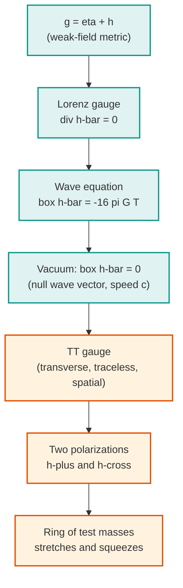
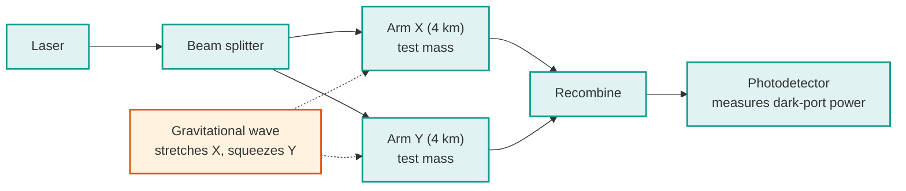

[Relativity](./) &raquo; Gravitational Waves

## Gravitational Waves

Gravitational waves are propagating ripples in the curvature of spacetime, predicted by Einstein in 1916 and directly detected for the first time in 2015. This page develops them from the ground up: the **linearized field equations**, the gauge freedom that reduces a wave to two physical polarizations, the **transverse–traceless (TT) gauge**, the **quadrupole formula** for wave generation and the energy they carry, the physics of inspiralling binaries, and how interferometers such as **LIGO** measure strains of one part in $10^{21}$. It assumes [General Relativity](general-relativity.html) and the differential-geometry machinery on the [Tensor Formalism](tensor-formalism.html) page.

**Conventions.** We work in **geometric units** with $G = c = 1$ except where a factor of $G$ or $c$ is shown explicitly. The metric signature is **(−,+,+,+)** ("mostly plus"). Greek indices $\mu,\nu,\dots$ run over $0,1,2,3$; Latin indices $i,j,\dots$ over the three spatial directions. The **Einstein summation convention** is in force, and $\Box \equiv \eta^{\mu\nu}\partial_\mu\partial_\nu = -\partial_t^2 + \nabla^2$ is the flat-space d'Alembertian.

## Linearized Gravity

Far from any strong-field region — which includes essentially the entire journey of a wave from its source to a detector on Earth — spacetime is very nearly flat, and we can treat the gravitational field as a small perturbation on a Minkowski background. This **weak-field expansion** linearizes the otherwise intractable Einstein equations into a wave equation that looks almost exactly like electromagnetism.

### The Weak-Field Metric

Write the metric as the flat Minkowski metric plus a small perturbation:

$$g_{\mu\nu} = \eta_{\mu\nu} + h_{\mu\nu} , \qquad |h_{\mu\nu}| \ll 1 .$$

We keep only terms linear in $h_{\mu\nu}$ throughout. Indices on $h_{\mu\nu}$ are raised and lowered with the **background** metric $\eta_{\mu\nu}$, not the full $g_{\mu\nu}$, since corrections would be second order. To this order the Christoffel symbols are

$$\Gamma^\lambda_{\mu\nu} = \frac{1}{2}\eta^{\lambda\sigma}\bigl(\partial_\mu h_{\sigma\nu} + \partial_\nu h_{\sigma\mu} - \partial_\sigma h_{\mu\nu}\bigr) ,$$

and the linearized Ricci tensor is

$$R_{\mu\nu} = \frac{1}{2}\bigl(\partial_\sigma\partial_\mu h^\sigma{}_\nu + \partial_\sigma\partial_\nu h^\sigma{}_\mu - \Box h_{\mu\nu} - \partial_\mu\partial_\nu h\bigr) ,$$

where $h \equiv h^\mu{}_\mu = \eta^{\mu\nu}h_{\mu\nu}$ is the trace.

### The Trace-Reversed Perturbation

The expressions simplify dramatically if we work with the **trace-reversed** perturbation

$$\bar{h}_{\mu\nu} \equiv h_{\mu\nu} - \frac{1}{2}\eta_{\mu\nu} h .$$

The name comes from $\bar{h} = h - \tfrac{1}{2}(4)h = -h$: trace reversal flips the sign of the trace, and inverting the relation gives $h_{\mu\nu} = \bar{h}_{\mu\nu} - \tfrac{1}{2}\eta_{\mu\nu}\bar{h}$. In terms of $\bar{h}_{\mu\nu}$, the linearized Einstein tensor becomes

$$G_{\mu\nu} = -\frac{1}{2}\Box \bar{h}_{\mu\nu} - \frac{1}{2}\eta_{\mu\nu}\partial_\alpha\partial_\beta \bar{h}^{\alpha\beta} + \partial_\alpha\partial_{(\mu}\bar{h}^\alpha{}_{\nu)} ,$$

and the last three terms — the ones with derivatives acting on the divergence $\partial_\alpha \bar{h}^{\alpha\beta}$ — can be removed entirely by a clever choice of coordinates.

### Gauge Freedom

The split $g_{\mu\nu} = \eta_{\mu\nu} + h_{\mu\nu}$ is not unique: an infinitesimal coordinate change $x^\mu \to x^\mu + \xi^\mu$, with $\xi^\mu$ small, leaves $\eta_{\mu\nu}$ unchanged but shifts the perturbation by

$$h_{\mu\nu} \to h'_{\mu\nu} = h_{\mu\nu} - \partial_\mu\xi_\nu - \partial_\nu\xi_\mu .$$

This is the **gauge freedom** of linearized gravity, exactly analogous to $A_\mu \to A_\mu - \partial_\mu \chi$ in electromagnetism. Physically distinct gravitational fields correspond to gauge-equivalence classes, not to individual $h_{\mu\nu}$; much of the work below is choosing representatives that make the physics manifest.

### The Lorenz (Harmonic) Gauge

The natural first choice is the **Lorenz gauge** (also called the harmonic or de Donder gauge), defined by

$$\partial_\mu \bar{h}^{\mu\nu} = 0 .$$

A gauge transformation changes the divergence by $\partial_\mu \bar{h}^{\mu\nu} \to \partial_\mu \bar{h}^{\mu\nu} - \Box \xi^\nu$, so we can always reach this gauge by solving $\Box \xi^\nu = \partial_\mu \bar{h}^{\mu\nu}$ for $\xi^\nu$. In the Lorenz gauge the messy divergence terms in $G_{\mu\nu}$ vanish, and the **linearized Einstein equations collapse to a wave equation**:

$$\Box \bar{h}_{\mu\nu} = -16\pi G\, T_{\mu\nu} .$$

This is the central result of linearized gravity. It is a set of decoupled, sourced wave equations — one for each component of $\bar{h}_{\mu\nu}$ — with the same structure as Maxwell's equations $\Box A^\mu = -4\pi J^\mu$ in Lorenz gauge. Disturbances in the source $T_{\mu\nu}$ propagate outward at the speed of light as gravitational radiation, and in vacuum ($T_{\mu\nu}=0$) the equation reduces to the homogeneous wave equation $\Box \bar{h}_{\mu\nu} = 0$.

**Residual gauge freedom.** The Lorenz condition does not exhaust the freedom. Any further $\xi^\mu$ satisfying $\Box\xi^\mu = 0$ preserves $\partial_\mu\bar{h}^{\mu\nu}=0$, and this *residual* gauge freedom is exactly what we exploit next to strip the radiation down to its two genuine physical degrees of freedom. The lesson mirrors electromagnetism, where after imposing $\partial_\mu A^\mu=0$ one can still remove the longitudinal and timelike photon polarizations, leaving two transverse ones.

## The Transverse–Traceless Gauge

In empty space, far from the source, the residual gauge freedom can be used to put a gravitational wave into its cleanest possible form, the **transverse–traceless (TT) gauge**, which exposes that a wave carries only two independent polarizations.

### Defining the TT Gauge

Consider a plane wave $\bar{h}_{\mu\nu} = A_{\mu\nu}\,e^{ik_\alpha x^\alpha}$ travelling through vacuum. The vacuum wave equation $\Box\bar{h}_{\mu\nu}=0$ forces $k_\alpha k^\alpha = 0$: the wave vector is **null**, so gravitational waves travel at the speed of light. We use the remaining freedom to impose three conditions on top of Lorenz gauge:

$$h^{0\mu} = 0 \quad\text{(purely spatial)}, \qquad h^\mu{}_\mu = 0 \quad\text{(traceless)}, \qquad \partial^i h_{ij} = 0 \quad\text{(transverse)} .$$

Because the wave is now traceless, $\bar{h}_{ij} = h_{ij}$, and we simply write $h^{TT}_{ij}$. The conditions say the wave has no time components, no trace, and is purely transverse to its direction of propagation — precisely the structure that leaves two free components.

### Counting the Polarizations

The symmetric $4\times 4$ matrix $h_{\mu\nu}$ has 10 independent components. The Lorenz gauge supplies 4 constraints; the residual gauge freedom removes 4 more; leaving $10 - 4 - 4 = 2$ physical degrees of freedom. For a wave travelling in the $z$-direction ($k^\mu = \omega(1,0,0,1)$), the TT perturbation is

$$h^{TT}_{ij} = \begin{pmatrix} h_+ & h_\times & 0 \\ h_\times & -h_+ & 0 \\ 0 & 0 & 0 \end{pmatrix}\cos\bigl[\omega(t - z)\bigr] .$$

The two amplitudes $h_+$ ("plus") and $h_\times$ ("cross") are the **two polarizations** of a gravitational wave. Unlike electromagnetism's spin-1 photon with polarizations $90^\circ$ apart, the graviton is **spin-2**, and the two polarization states are separated by $45^\circ$ — a direct, measurable signature of the tensor nature of gravity.

### The Physical Effect: Stretching and Squeezing

The TT gauge has a vivid operational meaning. Place a ring of freely falling test masses in the plane transverse to the wave. The proper separation between two nearby masses, initially $L$ along direction $\hat{n}$, oscillates as the wave passes:

$$\delta L = \frac{1}{2}\, h^{TT}_{ij}\, n^i n^j\, L .$$

A pure $h_+$ wave alternately stretches the ring along $x$ while squeezing along $y$, then reverses — deforming a circle into an ellipse and back. A pure $h_\times$ wave does the same on axes rotated by $45^\circ$. This characteristic quadrupolar "breathing" pattern is the signal interferometers are built to catch.

  <h4>The strain $h$ as a fractional length change</h4>
  
The dimensionless amplitude $h$ is literally the fractional change in length it induces, $h \sim \delta L / L$. A typical astrophysical wave reaching Earth has $h \sim 10^{-21}$. Over LIGO's 4 km arms this is a length change of $\delta L \sim 4\times10^{-18}$ m — about one-thousandth the diameter of a proton. That this is measurable at all is the central engineering miracle of gravitational-wave astronomy.

## Wave Generation: The Quadrupole Formula

The wave equation $\Box \bar{h}_{\mu\nu} = -16\pi G\, T_{\mu\nu}$ is solved, just as in electromagnetism, by a **retarded integral** over the source:

$$\bar{h}_{\mu\nu}(t,\mathbf{x}) = 4G \int \frac{T_{\mu\nu}(t - |\mathbf{x}-\mathbf{x}'|,\, \mathbf{x}')}{|\mathbf{x}-\mathbf{x}'|}\, d^3x' .$$

Far from a slowly moving, compact source, this collapses into the celebrated **quadrupole formula** — the gravitational analogue of the dipole radiation formula, but starting one multipole higher.

### Why Not Dipole Radiation?

In electromagnetism the leading radiation is **dipole**, sourced by $\ddot{d}^i$ where $d^i$ is the electric dipole moment. Gravity has no such term, for a deep reason rooted in conservation laws:

- The would-be "mass dipole" is $d^i = \int \rho\, x^i\, d^3x = M X^i_{\rm cm}$, whose second time derivative is $M \ddot{X}^i_{\rm cm}$. **Conservation of momentum** makes the center of mass move uniformly, so $\ddot{X}^i_{\rm cm} = 0$: no mass-dipole radiation.
- The "magnetic-dipole" analogue is the **angular momentum**, and **conservation of angular momentum** kills its time derivative too.

With both dipole terms forbidden, the leading radiation is **quadrupole**, sourced by the second time derivative of the mass distribution's quadrupole moment. This is why gravitational radiation is so weak and why only highly asymmetric, rapidly accelerating mass distributions (like merging compact objects) radiate detectably.

### The Mass Quadrupole Moment

Define the mass quadrupole moment and its **trace-free** ("reduced") version:

$$Q_{ij} = \int \rho\, x_i x_j\, d^3x , \qquad \mathcal{I}_{ij} = Q_{ij} - \frac{1}{3}\delta_{ij} Q^k{}_k = \int \rho\left(x_i x_j - \frac{1}{3}\delta_{ij} r^2\right)d^3x .$$

The radiated field in the TT gauge, evaluated at distance $r$ from the source, is the **quadrupole formula**:

$$h^{TT}_{ij} = \frac{2G}{r}\, \ddot{\mathcal{I}}^{TT}_{ij}(t - r) ,$$

where the superscript TT denotes projection onto the transverse–traceless part with respect to the line of sight, and the double dot is two retarded time derivatives. Restoring units, the prefactor is $2G/(r c^4)$ — the enormous $c^4$ in the denominator is the quantitative root of gravity's feebleness as a radiator.

### Energy Carried by the Waves

Gravitational waves carry energy and momentum away from their source. Because gravitational energy cannot be localized pointwise, the energy flux is defined by averaging over several wavelengths (the **Isaacson stress–energy tensor**). The total power radiated — the **luminosity** — is given by the third time derivative of the reduced quadrupole moment:

$$\frac{dE}{dt} = \frac{G}{5}\left\langle \dddot{\mathcal{I}}_{ij}\, \dddot{\mathcal{I}}^{ij} \right\rangle ,$$

where $\langle\,\cdot\,\rangle$ is the time average. The energy leaves the source ($dE_{\rm source}/dt < 0$), draining orbital energy from a binary and causing it to spiral inward. Restoring units gives a prefactor $G/(5c^5)$; the $c^5$ makes this the most extreme suppression in physics, yet a black-hole merger can momentarily outshine the entire observable universe in gravitational-wave power.

  <h4>Worked estimate: a spinning dumbbell</h4>
  
Take two masses $m$ on the ends of a rigid rod of length $2a$, spinning about its center at angular frequency $\Omega$. The quadrupole moment oscillates at $2\Omega$ (a rod looks the same after a half-turn), with amplitude $\sim m a^2$. The radiated power scales as

$$\frac{dE}{dt} \sim \frac{G}{c^5}\, m^2 a^4 \Omega^6 .$$

  
For any laboratory dumbbell ($m \sim$ kg, $a \sim$ m, $\Omega \sim$ kHz) the $G/c^5 \approx 10^{-53}\,\mathrm{W^{-1}\,s^{-1}}$ prefactor makes this utterly unmeasurable — around $10^{-30}$ W. Only astrophysical masses moving at relativistic speeds, where $a\Omega$ approaches $c$, produce detectable radiation.

## Binary Systems and the Chirp

The cleanest and most important gravitational-wave sources are **compact binaries** — two neutron stars or black holes orbiting each other. As they radiate, they lose orbital energy, spiral together, orbit faster, and radiate still more strongly: a runaway process whose signature is a rising-frequency, rising-amplitude "chirp."

### Orbital Decay: The Peters Equations

For a circular binary of masses $m_1, m_2$, total mass $M = m_1 + m_2$, reduced mass $\mu = m_1 m_2 / M$, and separation $a$, applying the quadrupole luminosity to the Keplerian orbital energy gives the **Peters–Mathews** orbital decay rate:

$$\frac{da}{dt} = -\frac{64}{5}\frac{G^3}{c^5}\frac{\mu M^2}{a^3} .$$

The separation shrinks ever faster as $a$ decreases. Integrating from an initial separation $a_0$ gives a finite **coalescence time**

$$t_{\rm c} = \frac{5}{256}\frac{c^5\, a_0^4}{G^3\, \mu M^2} ,$$

a remarkable result: every bound binary is guaranteed to merge in finite time. For the Hulse–Taylor binary pulsar this is about 300 million years; for the closest white-dwarf binaries it can be shorter than the age of the universe, which is why such mergers happen at all.

### The Chirp Mass

A beautiful simplification emerges in the inspiral phase. Both the gravitational-wave frequency evolution and the amplitude depend on the masses **only through a single combination**, the **chirp mass**:

$$\mathcal{M} = \frac{(m_1 m_2)^{3/5}}{(m_1 + m_2)^{1/5}} = \mu^{3/5} M^{2/5} .$$

The frequency sweep obeys

$$\frac{df_{\rm gw}}{dt} = \frac{96}{5}\pi^{8/3}\left(\frac{G\mathcal{M}}{c^3}\right)^{5/3} f_{\rm gw}^{11/3} ,$$

so measuring how the observed frequency rises with time directly yields $\mathcal{M}$ — typically the best-determined parameter of any detected event. This is how the very first detection, GW150914, was immediately known to involve two objects of tens of solar masses: only black holes can be that massive and that compact.

### The Three Phases: Inspiral, Merger, Ringdown

A binary-coalescence signal divides into three regimes, each described by different mathematics:

1. **Inspiral.** While the bodies are well separated and slow, the **post-Newtonian (PN) expansion** — a systematic series in $v/c$ around Newtonian gravity — accurately predicts the slowly chirping waveform. This is the long, clean, rising-frequency tone.
2. **Merger.** As the bodies approach and move at a sizable fraction of $c$, the field becomes strong and non-linear; only **numerical relativity** (direct supercomputer integration of the full Einstein equations) captures the peak of the waveform.
3. **Ringdown.** The merged remnant settles into a single Kerr black hole by radiating away its deformations as a superposition of damped **quasinormal modes**, whose frequencies and decay times are fixed by the final mass and spin alone — a direct test of the black-hole "no-hair" theorem.

  <svg viewBox="0 0 600 380" style="max-width: 500px; width: 100%;">
    <!-- Title -->
    <text x="300" y="25" text-anchor="middle" font-size="20" font-weight="bold" fill="#2c3e50">Gravitational Wave from Binary Black Hole Merger</text>

    <!-- Define arrow markers -->
    <defs>
      <marker id="arrow-gw" markerWidth="10" markerHeight="10" refX="8" refY="3" orient="auto" markerUnits="strokeWidth">
        <path d="M0,0 L0,6 L9,3 z" fill="#2c3e50" />
      </marker>
    </defs>

    <!-- Axes -->
    <line x1="50" y1="200" x2="570" y2="200" stroke="#2c3e50" stroke-width="3" marker-end="url(#arrow-gw)" />
    <line x1="50" y1="320" x2="50" y2="80" stroke="#2c3e50" stroke-width="3" marker-end="url(#arrow-gw)" />
    <text x="575" y="205" font-size="16" font-weight="bold" fill="#2c3e50">Time</text>
    <text x="55" y="75" font-size="16" font-weight="bold" fill="#2c3e50">Strain h</text>

    <!-- Zero line reference -->
    <line x1="50" y1="200" x2="550" y2="200" stroke="#bdbdbd" stroke-width="1" stroke-dasharray="4,4" />

    <!-- Waveform - Inspiral phase (increasing frequency and amplitude) -->
    <path d="M 70 200
             Q 85 190, 100 200 T 130 200
             Q 145 185, 160 200 T 190 200
             Q 210 175, 230 200 T 260 200
             Q 285 160, 310 200"
          stroke="#1976d2" stroke-width="4" fill="none" />
    <rect x="70" y="245" width="240" height="30" fill="#e3f2fd" stroke="#1976d2" stroke-width="2" rx="5" />
    <text x="190" y="267" text-anchor="middle" font-size="16" font-weight="bold" fill="#1565c0">INSPIRAL</text>

    <!-- Waveform - Merger phase (peak amplitude) -->
    <path d="M 310 200
             Q 330 130, 350 200
             Q 370 280, 390 200
             Q 405 110, 420 200"
          stroke="#c62828" stroke-width="4" fill="none" />
    <rect x="310" y="245" width="110" height="30" fill="#ffebee" stroke="#c62828" stroke-width="2" rx="5" />
    <text x="365" y="267" text-anchor="middle" font-size="16" font-weight="bold" fill="#b71c1c">MERGER</text>

    <!-- Waveform - Ringdown phase (decaying oscillation) -->
    <path d="M 420 200
             Q 440 230, 460 200
             Q 475 220, 490 200
             Q 500 210, 510 200
             Q 515 205, 520 200
             L 550 200"
          stroke="#2e7d32" stroke-width="4" fill="none" />
    <rect x="420" y="245" width="130" height="30" fill="#e8f5e9" stroke="#2e7d32" stroke-width="2" rx="5" />
    <text x="485" y="267" text-anchor="middle" font-size="16" font-weight="bold" fill="#1b5e20">RINGDOWN</text>

    <!-- Phase boundaries -->
    <line x1="310" y1="90" x2="310" y2="240" stroke="#757575" stroke-width="2" stroke-dasharray="6,4" />
    <line x1="420" y1="90" x2="420" y2="240" stroke="#757575" stroke-width="2" stroke-dasharray="6,4" />

    <!-- Binary system illustrations -->
    <!-- Inspiral - two orbiting black holes -->
    <g transform="translate(190, 55)">
      <circle cx="-20" cy="0" r="10" fill="#1976d2" stroke="#0d47a1" stroke-width="2" />
      <circle cx="20" cy="0" r="10" fill="#1976d2" stroke="#0d47a1" stroke-width="2" />
      <ellipse cx="0" cy="0" rx="30" ry="8" fill="none" stroke="#1976d2" stroke-width="2" stroke-dasharray="4,3" />
      <text x="0" y="35" text-anchor="middle" font-size="13" fill="#1565c0">Orbiting BHs</text>
    </g>

    <!-- Merger - coalescing -->
    <g transform="translate(365, 55)">
      <circle cx="0" cy="0" r="18" fill="#c62828" stroke="#b71c1c" stroke-width="2" />
      <text x="0" y="35" text-anchor="middle" font-size="13" fill="#b71c1c">Coalescing</text>
    </g>

    <!-- Ringdown - final black hole -->
    <g transform="translate(485, 55)">
      <circle cx="0" cy="0" r="16" fill="#2e7d32" stroke="#1b5e20" stroke-width="2" />
      <circle cx="0" cy="0" r="24" fill="none" stroke="#2e7d32" stroke-width="2" opacity="0.5" />
      <circle cx="0" cy="0" r="32" fill="none" stroke="#2e7d32" stroke-width="1" opacity="0.3" />
      <text x="0" y="50" text-anchor="middle" font-size="13" fill="#1b5e20">Final BH</text>
    </g>

    <!-- Annotations -->
    <text x="190" y="310" text-anchor="middle" font-size="13" fill="#1565c0">Frequency increases</text>
    <text x="365" y="310" text-anchor="middle" font-size="13" fill="#b71c1c">Peak amplitude</text>
    <text x="485" y="310" text-anchor="middle" font-size="13" fill="#1b5e20">Damped oscillation</text>

    <!-- Frequency evolution formula -->
    <rect x="150" y="335" width="300" height="35" fill="#fafafa" stroke="#e0e0e0" stroke-width="1" rx="5" />
    <text x="300" y="360" text-anchor="middle" font-size="15" fill="#333">Chirp: f proportional to (time to merger)^(-3/8)</text>
  </svg>

**The first indirect proof: the Hulse–Taylor binary pulsar.** Long before any direct detection, the binary pulsar **PSR B1913+16**, discovered by Hulse and Taylor in 1974, provided decisive indirect evidence. Its orbital period shrinks by about 76 microseconds per year — matching the Peters-equation prediction from gravitational-wave emission to better than 0.2%. This agreement, accumulated over decades, earned the 1993 Nobel Prize and made gravitational waves real well before LIGO confirmed them directly.

## Detection: Interferometry and LIGO

A gravitational wave changes the proper distance between free test masses by a fraction $h \sim 10^{-21}$. The instrument that turns that minuscule strain into a measurable signal is a **laser interferometer**.

### The Michelson Interferometer Principle

LIGO, Virgo, and KAGRA are kilometre-scale **Michelson interferometers**. A laser beam is split in two and sent down two perpendicular arms, each ending in a mirror (a suspended test mass) that reflects the light back. The returning beams recombine; the interference pattern depends on the **difference** in the two arms' lengths. A passing gravitational wave stretches one arm while squeezing the other (the $h_+$ pattern aligned with the arms), producing a differential length change

$$\Delta L = L\, h ,$$

which shifts the relative phase of the two beams and changes the brightness at the output photodetector. With $L = 4$ km arms, a strain $h = 10^{-21}$ gives $\Delta L \approx 4\times 10^{-18}$ m — far smaller than an atomic nucleus, yet detectable because the measurement is differential and the laser phase is exquisitely stable.

### Engineering the Impossible Measurement

Detecting a sub-nuclear length change requires defeating every conceivable source of noise. Key techniques include:

- **Fabry–Pérot cavities** in each arm, where light bounces hundreds of times before recombining, multiplying the effective arm length and hence the accumulated phase shift.
- **Power recycling** and **signal recycling** mirrors that build up enormous circulating laser power (hundreds of kilowatts) to beat down photon shot noise.
- **Seismic isolation** via multi-stage pendulum suspensions that decouple the mirrors from ground vibration above a few hertz.
- **Ultra-high vacuum** in the beam tubes to eliminate phase noise from residual gas.
- **Quantum squeezing** of the light's vacuum fluctuations, redistributing quantum noise to improve sensitivity beyond the standard quantum limit.

The dominant noise sources set the detector's sensitivity band: **seismic and Newtonian (gravity-gradient) noise** at low frequencies, **thermal noise** of the suspensions and coatings in the middle, and **photon shot noise** at high frequencies. Ground-based detectors are most sensitive in the audio band, roughly **10 Hz to a few kHz** — which is exactly where stellar-mass compact binaries chirp.

### Why More Than One Detector

A single interferometer cannot localize a source on the sky and cannot easily distinguish a real signal from a local glitch. A **network** of detectors — the two LIGO sites (Hanford and Livingston), Virgo in Italy, and KAGRA in Japan — solves both problems. Comparing the **arrival times** across the network triangulates the source's sky position, while demanding a **coincident, consistent** signal in widely separated instruments rejects local noise. Network triangulation is what lets electromagnetic telescopes point at the right patch of sky for multi-messenger follow-up.

### The Detector Spectrum: Ground, Space, and Pulsar Timing

Different sources radiate at vastly different frequencies, so different instruments are needed:

| Frequency band | Detector(s) | Sources |
|----------------|-------------|---------|
| ~10 Hz – kHz | LIGO, Virgo, KAGRA (ground) | Stellar-mass BH and NS mergers |
| ~0.1 mHz – 0.1 Hz | LISA (space, planned ~2035) | Massive BH mergers, galactic binaries |
| ~nHz | Pulsar timing arrays (NANOGrav, EPTA) | Supermassive BH binary background |

**LISA** will be a space-based interferometer with arms millions of kilometres long, free of seismic noise and sensitive to the low-frequency mergers of the massive black holes at galactic centers. **Pulsar timing arrays** use the regular ticks of millisecond pulsars as a galaxy-scale detector: a passing nanohertz wave perturbs the pulse arrival times correlated across the sky.

## Notable Observations

Direct gravitational-wave astronomy began in 2015 and has since grown into a routine, multi-detector enterprise. The landmark events below trace its arc.

### GW150914 — The First Direct Detection (2015)

On 14 September 2015 the two LIGO detectors recorded the merger of two black holes of about 36 and 29 solar masses, roughly 1.3 billion light-years away, forming a final black hole of about 62 solar masses. The missing **~3 solar masses** were radiated as gravitational waves in a fraction of a second, peaking at a luminosity exceeding the combined light of every star in the observable universe. The signal — a textbook inspiral–merger–ringdown chirp sweeping from 35 to 250 Hz — matched numerical-relativity predictions and earned the **2017 Nobel Prize in Physics** (Weiss, Barish, Thorne). It was the first direct detection of gravitational waves and the first direct observation of a binary black-hole merger.

### GW170817 — The Multi-Messenger Neutron-Star Merger (2017)

On 17 August 2017 LIGO and Virgo detected the inspiral of two **neutron stars**, and 1.7 seconds later the Fermi satellite caught a short gamma-ray burst from the same sky region. Within hours, telescopes across the electromagnetic spectrum identified the optical counterpart (a **kilonova**) in galaxy NGC 4993. This single event:

- Confirmed that **gravitational waves travel at the speed of light** to one part in $10^{15}$ (from the 1.7 s delay over 130 million light-years), tightly constraining alternative theories of gravity.
- Demonstrated that neutron-star mergers are a site of **r-process nucleosynthesis**, forging heavy elements such as gold and platinum.
- Provided an independent, "standard siren" measurement of the **Hubble constant** from the gravitational-wave distance and the host-galaxy redshift.

It launched the era of **multi-messenger astronomy**, combining gravitational waves, light, and (in principle) neutrinos from a single source.

### The Growing Catalog and Recent Frontiers

Subsequent observing runs (O3, O4) have grown the catalog to many dozens of confident detections, broadening the population and the science:

- **GW190521** — the merger of two black holes (~85 and ~66 solar masses) producing an intermediate-mass black hole of ~142 solar masses, with at least one progenitor falling in the "pair-instability mass gap" forbidden to ordinary stellar collapse.
- **GW230529** — a compact-binary coalescence involving an object in the **lower mass gap** between the heaviest neutron stars and the lightest black holes, sharpening the question of what populates that range.
- **NANOGrav 15-year data (2023)** — pulsar timing arrays announced evidence for a **nanohertz stochastic gravitational-wave background**, most plausibly the collective hum of supermassive black-hole binaries across the universe — a qualitatively different detection in a completely different band.
- **Black-hole shadows** — the Event Horizon Telescope's images of M87\* (2019) and Sagittarius A\* (2022), while not gravitational-wave detections, complement them as a strong-field test of general relativity around black holes.

Each merger is also a **precision test of general relativity** in the strong-field, dynamical regime: the measured ringdown frequencies test the no-hair theorem, the absence of extra polarizations tests the spin-2 nature of gravity, and the propagation tests the masslessness of the graviton — and so far, Einstein's 1916 theory passes every one.

## See Also

Within relativity:

- [General Relativity](general-relativity.html) — the equivalence principle, the field equations, and the curvature whose ripples these waves are.
- [Tensor Formalism & the Field Equations](tensor-formalism.html) — the Riemann tensor, the linearized field equations, and the differential geometry used above.
- [Special Relativity](special-relativity.html) — Minkowski spacetime, the flat background on which the waves propagate.
- [Graduate Formalism & Frontiers](advanced.html) — exact black-hole solutions, black-hole thermodynamics, and quantum-gravity frontiers.
- [Relativity Hub](./) — overview and navigation.

Elsewhere in physics:

- [Computational Physics](../computational-physics/) — numerical relativity, the source of the merger waveforms LIGO matches against.
- [Quantum Field Theory](../quantum-field-theory.html) — the spin-2 graviton and gravity as a field theory.
- [String Theory](../string-theory/) — a candidate quantum theory of the graviton and gravity.
- [Physics Hub](../) — browse all physics topics.
