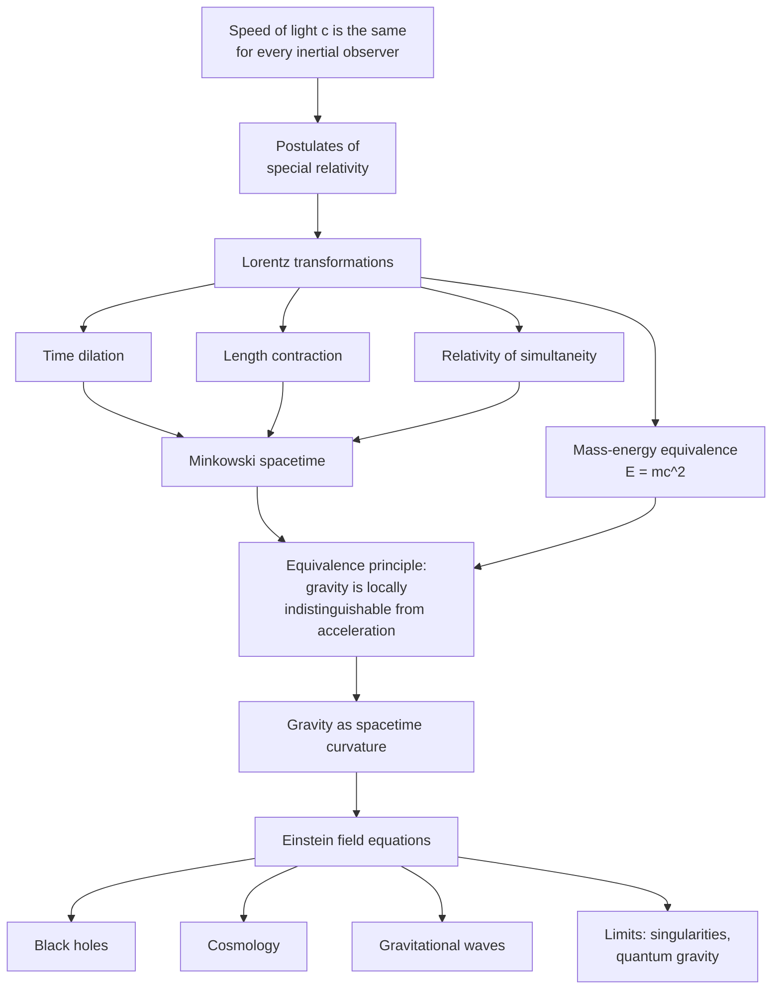

  <h1 style="color: white; margin: 0; font-size: 2.5rem;">Relativity</h1>
  
The Unity of Space, Time, and Gravity

Relativity is the pair of theories, both due to Albert Einstein, that replaced Newton's absolute space and time. **Special relativity** (1905) unifies space and time into a single spacetime whose geometry is the same for every inertial observer, with the speed of light as an invariant; its consequences include time dilation, length contraction, and $E = mc^2$. **General relativity** (1915) extends this to gravity, which becomes the curvature of spacetime by mass and energy. Together they underlie GPS timing, black-hole and gravitational-wave astronomy, and modern cosmology.

This hub links the eight pages in this section and shows how they depend on each other.

## Pages in This Section

| Page | Covers |
|------|--------|
| [Special Relativity](special-relativity.html) | The postulates, relativity of simultaneity, Lorentz transformations, time dilation, length contraction, velocity addition, $E = mc^2$, four-vectors |
| [General Relativity](general-relativity.html) | The equivalence principle, metric and geodesics, curvature, the Einstein field equations, the Schwarzschild solution, classical and modern experimental tests |
| [Graduate Topics Hub](advanced.html) | How the five deep-dive pages below fit together, with prerequisites and a reading order |
| [Tensor Formalism](tensor-formalism.html) | Manifolds, tensors, the covariant derivative, Riemann and Ricci curvature, two derivations of the field equations |
| [Black Holes](black-holes.html) | Schwarzschild, Reissner–Nordström and Kerr geometries, horizons, Penrose diagrams, black-hole thermodynamics, the information paradox |
| [Relativistic Cosmology](cosmology.html) | The FLRW metric, Friedmann equations, distances and horizons, thermal history, $\Lambda$CDM parameters, the Hubble tension, inflation |
| [Gravitational Waves](gravitational-waves.html) | Linearized gravity, polarizations, the quadrupole formula, compact binaries, interferometers, the observational record through LIGO–Virgo–KAGRA's O4 run |
| [Quantum Gravity](quantum-gravity.html) | Why GR and quantum theory conflict, non-renormalizability, string theory, loop quantum gravity, holography |

**Prerequisites.** The conceptual content of special relativity needs only algebra; Lorentz transformations and four-vectors use basic linear algebra. General relativity at the level of its own page needs calculus and some comfort with index notation. The deep-dive pages assume the tensor formalism. Read [Special Relativity](special-relativity.html) first; everything else builds on it.

## The Logical Structure

Each step in the chain below is forced by the one before. One experimental fact (the invariance of the speed of light) yields special relativity; one further principle (the equivalence of gravity and acceleration) yields general relativity.

## Core Ideas

- **The speed of light is invariant.** Every inertial observer measures the same $c$; simultaneity, lengths, and durations become observer-dependent.
- **Spacetime, not space and time.** The invariant interval $ds^2 = -c^2dt^2 + dx^2 + dy^2 + dz^2$ replaces separately invariant distances and durations. What a clock measures is the proper time along its worldline.
- **Energy and mass are equivalent.** $E^2 = (pc)^2 + (mc^2)^2$, which reduces to $E = mc^2$ at rest.
- **Gravity is geometry.** Mass and energy curve spacetime according to $G_{\mu\nu} + \Lambda g_{\mu\nu} = (8\pi G/c^4)\,T_{\mu\nu}$, and freely falling bodies follow geodesics of that curved spacetime.
- **Confirmed across scales.** From laboratory clocks resolving the gravitational redshift over a millimetre, through GPS and Solar-System tests, to binary pulsars, black-hole images, and gravitational waves from merging black holes, no experiment has found a deviation from general relativity.
- **Not the final word.** GR predicts singularities where it fails, conflicts with quantum mechanics, and in cosmology requires a dark sector whose nature is unknown.

## See Also

- [Classical Mechanics](../classical-mechanics/) — the Newtonian limit of both theories.
- [Quantum Mechanics](../quantum-mechanics/) — the quantum theory relativity must be reconciled with.
- [Quantum Field Theory](../quantum-field-theory.html) — the synthesis of special relativity and quantum mechanics.
- [String Theory](../string-theory/) — a candidate theory of quantum gravity.
- [Computational Physics](../computational-physics/) — numerical relativity and gravitational-wave simulation.
- [Physics Hub](../) — all physics topics.
