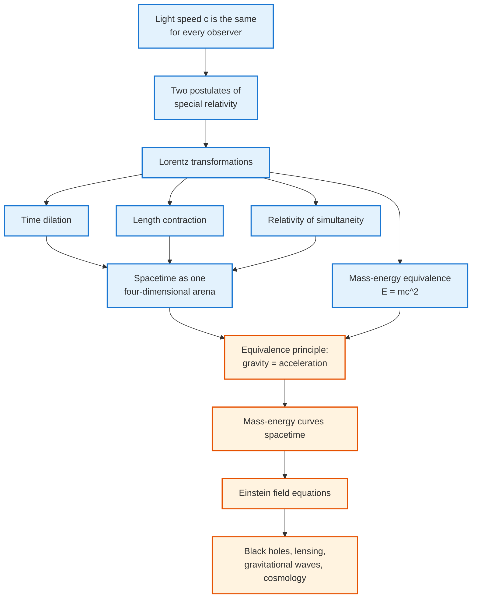

<!-- Custom styles are now loaded via main.scss -->

  <h1 style="color: white; margin: 0; font-size: 2.5rem;">Relativity</h1>
  
The Unity of Space, Time, and Gravity

  
Relativity encompasses two interrelated theories by Albert Einstein: special relativity and general relativity. These theories revolutionized our understanding of space, time, gravity, and the universe. They describe how measurements of various quantities are relative to the velocities of observers and how massive objects warp spacetime.

  
  

    

      <i class="fas fa-rocket"></i>
      <h4>Special Relativity</h4>
      
Space and time unite at high speeds

    

    

      <i class="fas fa-globe"></i>
      <h4>General Relativity</h4>
      
Gravity as curved spacetime

    

    

      <i class="fas fa-atom"></i>
      <h4>E = mc²</h4>
      
Mass and energy are equivalent

    

  

## Explore Relativity

### Foundations

  <a href="special-relativity.html" class="nav-card">
    <h4><i class="fas fa-rocket"></i> Special Relativity</h4>
    
The two postulates, Lorentz transformations, time dilation, length contraction, $E=mc^2$, relativistic dynamics, and four-vectors.

  </a>
  <a href="general-relativity.html" class="nav-card">
    <h4><i class="fas fa-globe"></i> General Relativity</h4>
    
The equivalence principle, the Einstein field equations, the Schwarzschild solution, gravitational time dilation, geodesics, and experimental tests.

  </a>

### Graduate Topics &amp; Deep Dives

  <a href="advanced.html" class="nav-card">
    <h4><i class="fas fa-superscript"></i> Graduate Topics Hub</h4>
    
Sub-hub for the graduate formalism and frontiers: where each deep-dive below fits, the prerequisites, and the path through them.

  </a>
  <a href="tensor-formalism.html" class="nav-card">
    <h4><i class="fas fa-square-root-alt"></i> Tensor Formalism</h4>
    
Tensor calculus, the metric, covariant derivatives, the Riemann and Ricci tensors, and a full derivation of the Einstein field equations.

  </a>
  <a href="black-holes.html" class="nav-card">
    <h4><i class="fas fa-circle"></i> Black Holes</h4>
    
Schwarzschild and Kerr geometries, horizons, singularities, the Penrose process, and black-hole thermodynamics.

  </a>
  <a href="cosmology.html" class="nav-card">
    <h4><i class="fas fa-globe-americas"></i> Cosmology</h4>
    
The FLRW metric, the Friedmann equations, the expanding universe, the cosmological constant, and the standard ΛCDM model.

  </a>
  <a href="gravitational-waves.html" class="nav-card">
    <h4><i class="fas fa-wave-square"></i> Gravitational Waves</h4>
    
Linearized gravity, the transverse-traceless gauge, the quadrupole formula, binary inspirals, and detection with LIGO.

  </a>
  <a href="quantum-gravity.html" class="nav-card">
    <h4><i class="fas fa-atom"></i> Quantum Gravity</h4>
    
Why general relativity and quantum theory clash, the information paradox, and the string-theory and loop approaches to a unified theory.

  </a>

### The Logic of Relativity

Both theories unfold from a single stubborn fact and a single guiding principle, each forcing the next conclusion. The chain below shows how one experimental observation (the constancy of light speed) cascades into the entire structure of special relativity, and how one further principle (equivalence) extends it into general relativity. Read it as the skeleton of this topic.

### What You'll Find

| Page | What it covers |
|------|----------------|
| [Special Relativity](special-relativity.html) | The two postulates, Lorentz transformations, time dilation, length contraction, $E=mc^2$, four-vectors |
| [General Relativity](general-relativity.html) | The equivalence principle, curvature, the Einstein field equations, Schwarzschild & black holes, predictions and tests |
| [Graduate Topics Hub](advanced.html) | Sub-hub: how the deep-dives below fit together, prerequisites, and a suggested reading path |
| [Tensor Formalism](tensor-formalism.html) | Tensor calculus, the metric, covariant derivatives, the Riemann/Ricci tensors, deriving the field equations |
| [Black Holes](black-holes.html) | Schwarzschild and Kerr geometries, horizons, singularities, the Penrose process, black-hole thermodynamics |
| [Cosmology](cosmology.html) | The FLRW metric, the Friedmann equations, cosmic expansion, the cosmological constant, ΛCDM |
| [Gravitational Waves](gravitational-waves.html) | Linearized gravity, the quadrupole formula, binary inspirals, detection with LIGO |
| [Quantum Gravity](quantum-gravity.html) | Why GR and quantum theory clash, the information paradox, string and loop approaches |

  <h4>Level and prerequisites</h4>
  
The conceptual core — postulates, time dilation, $E=mc^2$, gravity as curvature — needs only algebra and a willingness to abandon "common sense" about absolute time. The Lorentz transformations and four-vectors use a little linear algebra. The graduate formalism (tensor calculus, the Riemann tensor, exact black-hole solutions) is reference material and can be skipped on a first read. Read <a href="special-relativity.html">Special Relativity</a> first; <a href="general-relativity.html">General Relativity</a> assumes it.

## Key Takeaways

  

    <h4>The speed of light is absolute</h4>
    
$c$ is the same in every inertial frame; simultaneity, length, and time become observer-dependent.

  

  

    <h4>Space and time are one</h4>
    
Special relativity unifies them into spacetime, with the invariant interval $ds^2$ replacing separate distances and durations.

  

  

    <h4>Mass is energy</h4>
    
$E = mc^2$ (more generally $E^2 = (pc)^2 + (mc^2)^2$) — rest mass is a reservoir of energy.

  

  

    <h4>Gravity is geometry</h4>
    
General relativity recasts gravity as the curvature of spacetime: $G_{\mu\nu} = 8\pi G\, T_{\mu\nu}$.

  

  

    <h4>Free fall follows geodesics</h4>
    
Objects in free fall move along the straightest possible paths through curved spacetime.

  

  

    <h4>Confirmed across scales</h4>
    
From GPS clock corrections to gravitational waves and black-hole images, relativity passes every test.

  

## See Also

  <h4>Where to go next</h4>
  <ul>
    <li><a href="../classical-mechanics/">Classical Mechanics</a> — Newtonian mechanics, recovered in the low-speed, weak-gravity limit.</li>
    <li><a href="../quantum-field-theory.html">Quantum Field Theory</a> — unifying special relativity with quantum mechanics.</li>
    <li><a href="../string-theory/">String Theory</a> — a leading candidate for quantum gravity and extra dimensions.</li>
    <li><a href="../quantum-mechanics/">Quantum Mechanics</a> — the quantum theory that relativity is reconciled with in QFT.</li>
    <li><a href="../computational-physics/">Computational Physics</a> — numerical relativity and gravitational-wave simulations.</li>
    <li><a href="../">Physics Hub</a> — browse all physics topics.</li>
  </ul>

