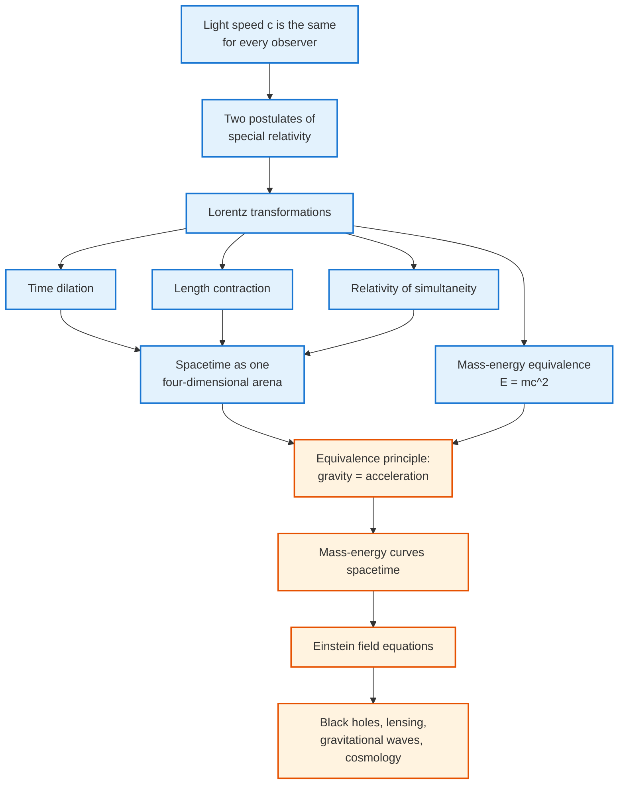

<!-- Custom styles are now loaded via main.scss -->

  <h1 style="color: white; margin: 0; font-size: 2.5rem;">Relativity</h1>
  
The Unity of Space, Time, and Gravity

Relativity comprises two interrelated theories by Albert Einstein. **Special relativity** (1905) shows that space and time unite at high speeds, with measurements depending on the observer's velocity. **General relativity** (1915) recasts gravity as curved spacetime. Together they yield $E = mc^2$ and reshaped our understanding of space, time, gravity, and the universe.

## Explore Relativity

The two foundational pages — [Special Relativity](special-relativity.html) and [General Relativity](general-relativity.html) — cover the conceptual and mathematical core. The graduate deep-dives (tensor formalism, black holes, cosmology, gravitational waves, quantum gravity) are reference material; the [Graduate Topics Hub](advanced.html) explains how they fit together. Full descriptions are in the [What You'll Find](#what-youll-find) table below.

### The Logic of Relativity

Both theories unfold from a single stubborn fact and a single guiding principle, each forcing the next conclusion. The chain below shows how one experimental observation (the constancy of light speed) cascades into the entire structure of special relativity, and how one further principle (equivalence) extends it into general relativity. Read it as the skeleton of this topic.

### What You'll Find

| Page | What it covers |
|------|----------------|
| [Special Relativity](special-relativity.html) | The two postulates, Lorentz transformations, time dilation, length contraction, $E=mc^2$, four-vectors |
| [General Relativity](general-relativity.html) | The equivalence principle, curvature, the Einstein field equations, Schwarzschild & black holes, predictions and tests |
| [Graduate Topics Hub](advanced.html) | Sub-hub: how the deep-dives below fit together, prerequisites, and a suggested reading path |
| [Tensor Formalism](tensor-formalism.html) | Tensor calculus, the metric, covariant derivatives, the Riemann/Ricci tensors, deriving the field equations |
| [Black Holes](black-holes.html) | Schwarzschild and Kerr geometries, horizons, singularities, the Penrose process, black-hole thermodynamics |
| [Cosmology](cosmology.html) | The FLRW metric, the Friedmann equations, cosmic expansion, the cosmological constant, ΛCDM |
| [Gravitational Waves](gravitational-waves.html) | Linearized gravity, the quadrupole formula, binary inspirals, detection with LIGO |
| [Quantum Gravity](quantum-gravity.html) | Why GR and quantum theory clash, the information paradox, string and loop approaches |

**Level and prerequisites.** The conceptual core — postulates, time dilation, $E=mc^2$, gravity as curvature — needs only algebra and a willingness to abandon "common sense" about absolute time. The Lorentz transformations and four-vectors use a little linear algebra. The graduate formalism (tensor calculus, the Riemann tensor, exact black-hole solutions) is reference material and can be skipped on a first read. Read [Special Relativity](special-relativity.html) first; [General Relativity](general-relativity.html) assumes it.

## Key Takeaways

- **The speed of light is absolute.** $c$ is the same in every inertial frame; simultaneity, length, and time become observer-dependent.
- **Space and time are one.** Special relativity unifies them into spacetime, with the invariant interval $ds^2$ replacing separate distances and durations.
- **Mass is energy.** $E = mc^2$ (more generally $E^2 = (pc)^2 + (mc^2)^2$) — rest mass is a reservoir of energy.
- **Gravity is geometry.** General relativity recasts gravity as the curvature of spacetime: $G_{\mu\nu} = 8\pi G\, T_{\mu\nu}$.
- **Free fall follows geodesics.** Objects in free fall move along the straightest possible paths through curved spacetime.
- **Confirmed across scales.** From GPS clock corrections to gravitational waves and black-hole images, relativity passes every test.

## See Also

- [Classical Mechanics](../classical-mechanics/) — Newtonian mechanics, recovered in the low-speed, weak-gravity limit.
- [Quantum Field Theory](../quantum-field-theory.html) — unifying special relativity with quantum mechanics.
- [String Theory](../string-theory/) — a leading candidate for quantum gravity and extra dimensions.
- [Quantum Mechanics](../quantum-mechanics/) — the quantum theory that relativity is reconciled with in QFT.
- [Computational Physics](../computational-physics/) — numerical relativity and gravitational-wave simulations.
- [Physics Hub](../) — browse all physics topics.
