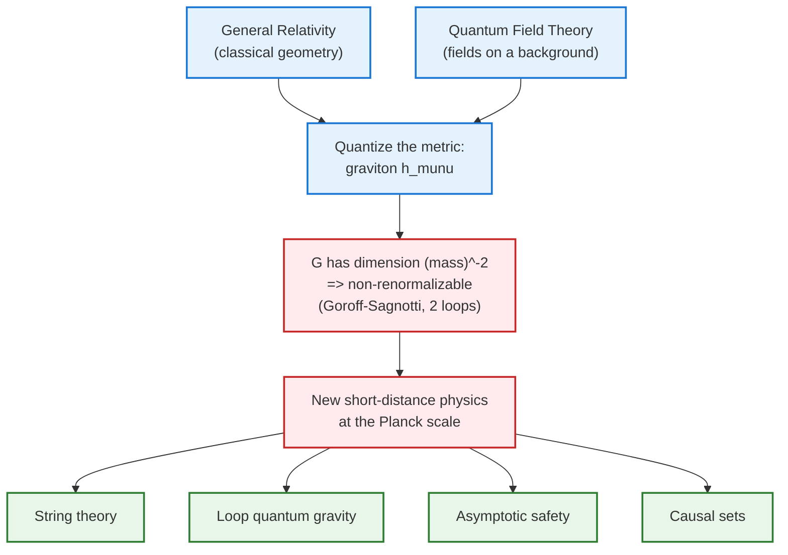
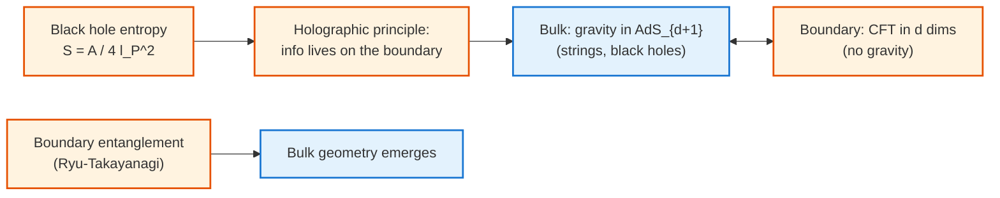

[Relativity](./) &raquo; Toward Quantum Gravity

## Toward Quantum Gravity

General relativity describes gravity as the smooth, classical geometry of spacetime. Quantum mechanics describes matter and the other three forces as quantum fields living *on* a fixed background. A complete theory must do both at once — and at the **Planck scale**, where the two descriptions overlap, naïvely combining them fails. This page explains *why* the two frameworks conflict, why the obvious fix (quantizing the metric like any other field) breaks down as a **non-renormalizable** theory, and surveys the leading research programs: string theory, loop quantum gravity, asymptotic safety, and causal set theory. It closes with the **holographic principle**, the most surprising structural clue any of these programs has produced. It assumes [General Relativity](general-relativity.html) and the field-theory background of [Quantum Field Theory](../quantum-field-theory.html).

**Conventions.** We work in **natural units** with $\hbar = c = 1$, so mass, energy, and inverse length share dimensions. The **Planck scale** is set by Newton's constant $G$: the Planck mass is $M_P = G^{-1/2} \approx 1.22 \times 10^{19}\ \text{GeV}$, the Planck length $\ell_P = G^{1/2} \approx 1.6 \times 10^{-35}\ \text{m}$, and the Planck time $t_P \approx 5.4 \times 10^{-44}\ \text{s}$. These are the scales at which quantum-gravitational effects become $O(1)$.

## Why General Relativity and Quantum Mechanics Conflict

The two pillars of modern physics are each spectacularly successful in their own domain and yet rest on assumptions the other flatly denies. The conflict is not a single equation that fails; it is a clash of *frameworks*.

### A clash of starting assumptions

| | General Relativity | Quantum Field Theory |
|---|---|---|
| Spacetime | Dynamical: the metric $g_{\mu\nu}$ is a field that bends and ripples | Fixed background (usually Minkowski) on which fields propagate |
| Time | No preferred time; observers slice spacetime however they like | A global time parameter underlies unitary Schrödinger evolution |
| Determinism vs. probability | Deterministic, geometric | Probabilistic amplitudes, superposition, measurement |
| Locality of energy | Gravitational energy is non-local; no covariant local stress tensor for gravity | Local operators, local stress tensor $T_{\mu\nu}$ |
| Key object | Geometry (curvature) | Operators on a Hilbert space |

A quantum theory of gravity must let the *background itself* be in superposition. But the entire machinery of QFT — the vacuum, the notion of particles, the time-ordering in the path integral — is built on having a fixed causal structure to begin with. If the metric is in a superposition of two geometries, "which events are causally before which" is itself uncertain, and the standard definitions stop making sense. This is the **problem of time** and the **problem of background independence**.

### The semiclassical equation and where it breaks

The first thing one tries is to keep gravity classical and let it respond to the *average* of quantum matter — the **semiclassical Einstein equation**:

$$G_{\mu\nu} = 8\pi G\, \langle \hat{T}_{\mu\nu} \rangle$$

This works well as an approximation (it is how Hawking radiation and inflationary perturbations are computed). But it cannot be fundamental. Put a massive body into a superposition of two locations. The left-hand side $G_{\mu\nu}$ is a single definite geometry, so it must respond to $\langle \hat{T}_{\mu\nu}\rangle$, a smear sitting at the *average* position — a place where there is no mass at all. A sufficiently sensitive measurement of the gravitational field would then reveal the average rather than collapse it, violating the predictions of quantum mechanics. Gedanken experiments of this type (and proposed table-top experiments on gravitationally induced entanglement) argue that **the gravitational field must itself be quantized**, not merely sourced by quantum matter.

### Where the regimes overlap

For most of physics the two theories never meet: gravity is utterly negligible for elementary particles, and quantum effects are negligible for planets. The dimensionless gravitational coupling between two particles of mass $m$ scales as $(m/M_P)^2$, which for an electron is about $10^{-45}$. The regimes overlap only where curvature is large *and* the system is small:

- The **singularities** inside black holes and at the Big Bang, where classical GR predicts infinite curvature and breaks down.
- The first $\sim t_P$ of the universe.
- The deep interior structure of horizons, implicated by the **black-hole information paradox** (see the [Graduate Formalism & Frontiers](advanced.html) discussion of Hawking radiation and entropy).

It is precisely in these regimes that we have no experimental data, which is why quantum gravity remains theory-driven.

## The Non-Renormalizability Problem

The deepest *technical* obstruction is that gravity, treated as just another quantum field theory, fails the test that the Standard Model passes: **renormalizability**.

### Gravity as a quantum field theory of the metric

Split the metric into a flat background plus a fluctuation that we quantize as a spin-2 field, the **graviton** $h_{\mu\nu}$:

$$g_{\mu\nu} = \eta_{\mu\nu} + \sqrt{32\pi G}\; h_{\mu\nu}$$

Expanding the Einstein–Hilbert action $S = \frac{1}{16\pi G}\int d^4x\,\sqrt{-g}\,R$ in powers of $h_{\mu\nu}$ gives a free spin-2 propagator plus an *infinite tower* of self-interaction vertices. As a low-energy **effective field theory** this is perfectly fine and even predictive: one can compute the leading quantum correction to Newton's potential,

$$V(r) = -\frac{G m_1 m_2}{r}\left[1 + a\,\frac{G(m_1+m_2)}{r c^2} + b\,\frac{G\hbar}{r^2 c^3} + \cdots \right]$$

where the $\hbar$ term is a genuine, unambiguous quantum-gravity prediction. The trouble is purely in the ultraviolet (short-distance) behavior.

### Why the coupling is the problem

Newton's constant carries dimensions. In natural units, $[G] = (\text{mass})^{-2}$, so the gravitational coupling is the dimensionless combination $G E^2 = (E/M_P)^2$ — it **grows with energy**. Power-counting then tells the whole story: each additional graviton loop comes with another factor of $G$, hence another factor of (loop momentum)$^2$ in the numerator. To absorb the resulting divergences one needs counterterms with more and more derivatives:

$$\Delta\mathcal{L} \sim c_1 R^2 + c_2 R_{\mu\nu}R^{\mu\nu} + c_3 R_{\mu\nu\rho\sigma}R^{\mu\nu\rho\sigma} + (\text{higher orders})$$

A renormalizable theory needs only *finitely many* counterterms, fixed by a finite number of measured parameters. Gravity needs an **infinite** number, each multiplied by an undetermined coupling. The theory loses all predictive power above the Planck scale.

### What is actually known

- **One loop, pure gravity:** the divergence is proportional to a total derivative (the Gauss–Bonnet term) and vanishes on-shell — pure gravity is *accidentally* finite at one loop ('t Hooft & Veltman, 1974).
- **One loop, gravity + matter:** generically divergent and non-renormalizable.
- **Two loops, pure gravity:** Goroff and Sagnotti (1986) found a genuine, non-vanishing two-loop counterterm,

$$\Delta\Gamma \propto \frac{1}{\varepsilon}\,\frac{G^2}{(4\pi)^4}\int d^4x\,\sqrt{-g}\; R_{\mu\nu}{}^{\rho\sigma}R_{\rho\sigma}{}^{\alpha\beta}R_{\alpha\beta}{}^{\mu\nu}$$

settling the question: perturbatively quantized Einstein gravity is **non-renormalizable**.

The lesson is that Einstein gravity is an *effective* description valid below $M_P$; some new physics must take over at the Planck scale. Every program below is, in essence, a proposal for what that new physics is.

## Approaches to Quantum Gravity

No approach is yet complete or experimentally confirmed. They differ in *what they keep* from established physics and *what they are willing to give up*.

### String Theory

**Fundamental idea:** replace point particles by one-dimensional extended objects — **strings** — whose vibrational modes are the particles we observe. The single most important fact is that the spectrum of a closed string *automatically* contains a massless spin-2 state with exactly the couplings of the graviton. String theory does not add gravity by hand; it cannot avoid predicting it.

**Why it cures the UV problem:** the finite size $\ell_s$ of the string smears out the point-like interaction vertices that caused gravity's divergences. There is a minimal length below which the usual notion of "shorter distance" stops applying (T-duality, $R \leftrightarrow \alpha'/R$, exchanges large and small radii), so the high-energy behavior is soft rather than divergent. String amplitudes are ultraviolet-finite order by order.

**Critical dimensions:** consistency (cancellation of the conformal anomaly) fixes the number of spacetime dimensions:

$$D = 26\ (\text{bosonic string}), \qquad D = 10\ (\text{superstring}).$$

The extra dimensions beyond four must be **compactified** — rolled up small — and the geometry of that compact space (often a Calabi–Yau manifold) determines the low-energy particle content and couplings, the origin of the enormous "landscape" of possible vacua.

**Dualities and unification:** the five consistent ten-dimensional superstring theories, together with eleven-dimensional supergravity, are now understood as limits of a single underlying framework, **M-theory**, connected by a web of dualities:

- **T-duality:** $R \leftrightarrow \alpha'/R$ — exchanges momentum and string-winding modes.
- **S-duality:** strong coupling $\leftrightarrow$ weak coupling.
- **AdS/CFT (gauge/gravity duality):** a string/gravity theory in anti-de Sitter space is *exactly equivalent* to a conformal field theory living on its boundary — the sharpest realization of the holographic principle (below).

For the full development of branes, dualities, and the landscape see the dedicated [String Theory](../string-theory/) section.

### Loop Quantum Gravity

**Fundamental idea:** quantize general relativity *directly*, with no extra dimensions or new matter, while keeping the defining lesson of GR — **background independence**. There is no fixed stage; geometry itself is the quantum degree of freedom.

**Method:** recast GR in the **Ashtekar variables**, a connection $A_a^i$ and a densitized triad $E^a_i$, which turn gravity into a gauge theory resembling Yang–Mills. The quantum states are built from **spin networks** — graphs whose edges carry $SU(2)$ spin labels $j$ and whose nodes carry intertwiners. A spin network is a quantum state of *space*; its time evolution sweeps out a **spin foam**.

**Key prediction — discrete geometry:** geometric operators have *discrete spectra*. Area and volume are quantized; there is a smallest possible area. The area operator's spectrum is

$$A = 8\pi\gamma\,\ell_P^2 \sum_i \sqrt{j_i(j_i+1)}$$

where the sum runs over the spin-network edges $i$ piercing the surface and $\gamma$ is the **Immirzi parameter**. Spacetime is granular at the Planck scale rather than a smooth continuum. This discreteness provides a natural cutoff that avoids the short-distance divergences, and it reproduces the Bekenstein–Hawking black-hole entropy (which fixes $\gamma$). Open problems include recovering smooth classical spacetime and the Einstein equations in the continuum limit, and incorporating the full Standard Model.

### Asymptotic Safety

**Fundamental idea:** perhaps gravity *is* renormalizable after all — not perturbatively, but **non-perturbatively**. The conjecture (due to Weinberg, 1979) is that the renormalization-group flow of the gravitational couplings runs to a **non-trivial ultraviolet fixed point**.

**How it resolves non-renormalizability:** the worry above was that the infinitely many couplings $G(k), \Lambda(k), c_i(k), \dots$ are all undetermined. But if, as the momentum scale $k \to \infty$, the *dimensionless* couplings $\tilde{g}_i(k) = g_i(k)\,k^{d_i}$ flow to a fixed point $\tilde{g}_i^*$, then physics at all scales is governed by the finite-dimensional surface of trajectories attracted to that fixed point — the **UV critical surface**. Only finitely many parameters (the relevant directions) are free; everything else is predicted. The theory becomes predictive again despite being perturbatively non-renormalizable.

**Status:** the functional (exact) renormalization group, applied in truncations of the gravitational action, finds a fixed point with a small number of relevant directions remarkably robustly. The hard problems are controlling the truncation error and demonstrating unitarity. Asymptotic safety is conservative — it adds no new dimensions, particles, or structures — and makes potentially testable predictions (e.g., for the Higgs mass and for trans-Planckian scattering).

### Causal Set Theory

**Fundamental idea:** the deep structure of spacetime is a **discrete partial order**. A causal set ("causet") is a set of elements ("spacetime atoms") with a relation $x \prec y$ meaning "$x$ is in the causal past of $y$," subject to transitivity, irreflexivity, and **local finiteness** (only finitely many elements lie causally between any two). The motto is *"order plus number equals geometry"*: the partial order encodes the conformal (causal) structure of spacetime, and simply counting elements supplies the missing volume/scale information.

**Why causal order:** a remarkable theorem of Lorentzian geometry states that the causal structure of a spacetime determines its metric up to a local conformal (volume) factor. Causal sets keep exactly that causal skeleton and discretize the rest. The continuum is recovered only in a coarse-grained limit; the central technical conjecture (the **Hauptvermutung**, "fundamental conjecture") is that a given causal set can be faithfully embedded into at most one continuum manifold, up to small fluctuations.

**A predictive success:** by estimating the cosmological constant from Poisson fluctuations in the number-volume relation, $\Lambda \sim 1/\sqrt{V} \sim 1/V$, causal-set reasoning predicted a small, non-zero $\Lambda$ of roughly the observed magnitude (Sorkin, before the 1998 discovery of cosmic acceleration). Dynamics — how a causet "grows" — is modeled by sequential-growth (classical) and, ongoing, quantum-amplitude rules.

### A comparative summary

| Approach | What it keeps | What it changes | Signature idea |
|---|---|---|---|
| String theory | Quantum mechanics, perturbative QFT methods | Point particles → strings; adds dimensions & supersymmetry | UV-finiteness from minimal length; predicts the graviton; AdS/CFT |
| Loop quantum gravity | Background independence; 4D; only GR + matter | Continuum geometry → spin networks | Discrete, quantized area and volume |
| Asymptotic safety | Standard QFT framework; 4D; no new fields | Demands a non-perturbative UV fixed point | Predictivity from finite UV critical surface |
| Causal sets | Lorentzian causal structure | Continuum → discrete partial order | "Order + number = geometry"; predicted small $\Lambda$ |

## The Holographic Principle

Of all the clues quantum gravity has produced, the most structurally surprising is **holography** — the idea that the information content of a region of space is bounded not by its volume but by the area of its boundary.

### The Bekenstein–Hawking bound

A black hole's entropy is not proportional to its volume, as for ordinary matter, but to the **area** of its event horizon:

$$S_{BH} = \frac{k_B\, c^3\, A}{4\, G\, \hbar} = \frac{k_B\, A}{4\, \ell_P^2}.$$

One bit of information per four Planck areas. Combined with the second law, this leads to the **Bekenstein bound**: the maximum entropy (and hence information) that can be packed into a region is set by the area of the surface enclosing it, $S \le A/4\ell_P^2$. If you try to cram in more, you form a black hole, and the entropy saturates at the area bound.

### From a bound to a principle

't Hooft and Susskind elevated this to the **holographic principle**: a gravitating region of spacetime is fully described by degrees of freedom living on its *boundary*, with no more than one bit per Planck area. The bulk three-dimensional world is, informationally, a hologram encoded on a two-dimensional surface. This is profoundly counterintuitive — it says the number of fundamental degrees of freedom inside a room scales with the room's walls, not its volume — and it is now regarded as a property any correct quantum theory of gravity must satisfy.

### AdS/CFT: holography made exact

The principle became a concrete, calculable duality with Maldacena's **AdS/CFT correspondence** (1997). It states an *exact equivalence*:

$$\underbrace{\text{Quantum gravity (string theory) in } \text{AdS}_{d+1}}_{\text{"bulk"}} \;\;\Longleftrightarrow\;\; \underbrace{\text{Conformal field theory on the } d\text{-dim boundary}}_{\text{"boundary"}}$$

A theory *with* gravity in $(d{+}1)$ dimensions is the same physics as a theory *without* gravity in $d$ dimensions. The dictionary maps bulk fields to boundary operators and, crucially, relates strong coupling on one side to weak coupling on the other — so hard gravitational questions (black-hole formation, the information paradox) become tractable boundary calculations. The Ryu–Takayanagi formula ties boundary entanglement entropy to bulk minimal surfaces,

$$S_{\text{entanglement}} = \frac{\text{Area}(\gamma)}{4\, G\, \hbar},$$

revealing that **spacetime geometry itself may emerge from quantum entanglement** ("entanglement builds geometry"). Holography is also central to modern resolutions of the black-hole information paradox via *islands* and replica wormholes.

## Open Problems and the Search for Evidence

Every program above is incomplete, and — because the Planck scale is $\sim 10^{15}$ times beyond collider energies — direct tests are extraordinarily hard. The live questions:

- **The continuum limit.** LQG and causal sets must reproduce smooth spacetime and Einstein's equations at large scales; this is not yet fully established.
- **The information paradox.** Does black-hole evaporation preserve quantum information? Holography and the island formula suggest yes, but the bulk mechanism is still debated.
- **Selecting a vacuum.** String theory's landscape of $\gtrsim 10^{500}$ vacua makes unique low-energy predictions difficult.
- **Phenomenology.** Possible windows include: tiny violations of Lorentz invariance (constrained by gamma-ray-burst timing and atomic clocks), imprints in the cosmic microwave background and primordial gravitational waves, discreteness-induced dispersion, and table-top tests of gravitationally induced entanglement.

The honest summary: we have several internally consistent, partly overlapping candidate frameworks and a few robust structural clues (the necessity of the graviton, the area law for entropy, holography), but no experimentally confirmed theory of quantum gravity.

## Key Takeaways

- **The conflict is structural.** GR makes spacetime dynamical; QFT needs a fixed background and a global time. A quantum metric undermines the very notions QFT is built on.
- **Gravity is non-renormalizable.** Because $[G] = (\text{mass})^{-2}$, the coupling grows with energy and needs infinitely many counterterms — proven divergent at two loops.
- **Effective field theory still works.** Below $M_P$, quantized gravity gives unambiguous low-energy predictions; new physics need only enter at the Planck scale.
- **Four leading roads.** String theory, loop quantum gravity, asymptotic safety, and causal sets differ in what they keep from known physics and what they sacrifice.
- **Information lives on boundaries.** Black-hole entropy scales with area, not volume — the holographic principle, made exact by AdS/CFT.
- **No confirmed theory yet.** The Planck scale is far beyond experiment; quantum gravity remains theory-driven, guided by consistency and a few robust clues.

## See Also

Continue in relativity:

- [General Relativity](general-relativity.html) — the classical theory being quantized: the equivalence principle and the field equations.
- [Tensor Formalism & the Field Equations](tensor-formalism.html) — the differential geometry and the Einstein–Hilbert action expanded above.
- [Graduate Formalism & Frontiers](advanced.html) — black-hole thermodynamics, Hawking radiation, and the information paradox in detail.
- [Relativity](./) — overview and navigation hub.

Related topics:

- [Quantum Field Theory](../quantum-field-theory.html) — the relativistic quantum framework whose methods and renormalization gravity resists.
- [String Theory](../string-theory/) — the leading candidate developed in full: branes, dualities, and the landscape.
- [Quantum Mechanics](../quantum-mechanics/) — the quantum framework that must be reconciled with curved spacetime.
- [Physics Hub](../) — browse all physics topics.
