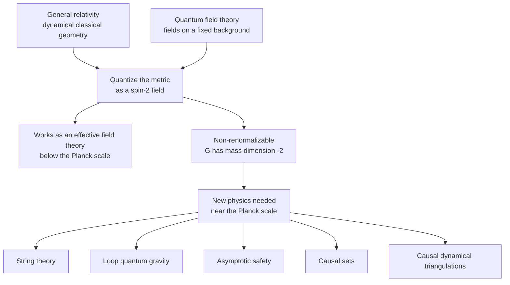
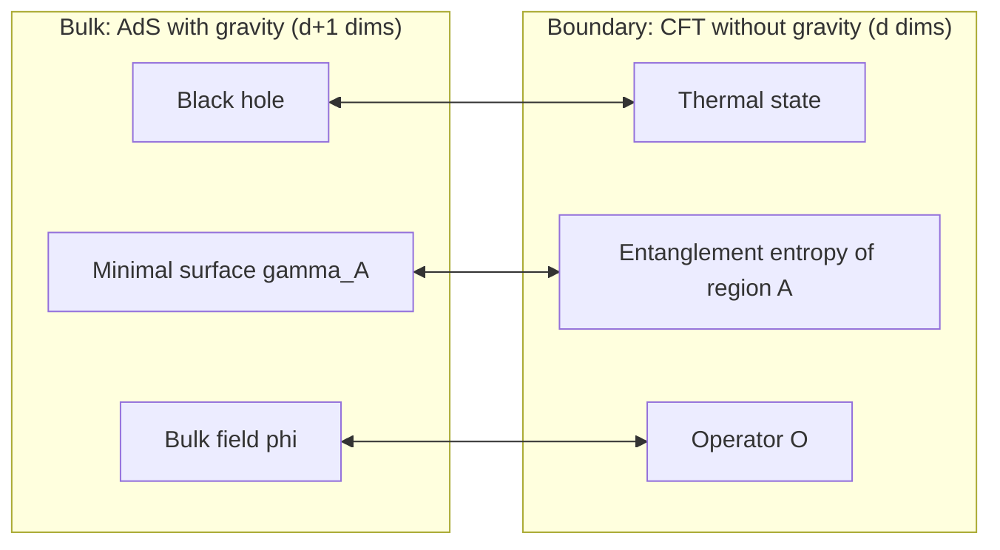

[Relativity](./) &raquo; Toward Quantum Gravity

## Toward Quantum Gravity

General relativity describes gravity as the classical, dynamical geometry of spacetime. Quantum field theory describes matter and the other three interactions as quantum fields on a *fixed* spacetime background. Each theory is confirmed to extraordinary precision in its own regime, but they cannot both be fundamental as they stand. This page covers why the frameworks conflict, why quantizing the metric like any other field yields a **non-renormalizable** theory, what that theory nevertheless predicts as an effective field theory, the main candidate completions (string theory, loop quantum gravity, asymptotic safety, causal sets, and causal dynamical triangulations), the **holographic principle**, and the present experimental situation. It assumes [General Relativity](general-relativity.html), the [tensor formalism](tensor-formalism.html), and the basics of [Quantum Field Theory](../quantum-field-theory.html).

**Conventions.** Natural units $\hbar = c = 1$ unless constants are shown. The Planck scale is set by Newton's constant:

| Quantity | Definition | Value |
|---|---|---|
| Planck mass / energy | $M_P = \sqrt{\hbar c/G}$ | $1.22 \times 10^{19}$ GeV $\;(2.18 \times 10^{-8}$ kg$)$ |
| Reduced Planck mass | $\bar M_P = M_P/\sqrt{8\pi}$ | $2.44 \times 10^{18}$ GeV |
| Planck length | $\ell_P = \sqrt{\hbar G/c^3}$ | $1.62 \times 10^{-35}$ m |
| Planck time | $t_P = \ell_P / c$ | $5.39 \times 10^{-44}$ s |

These are the scales at which quantum fluctuations of geometry are expected to become order one. For comparison, the LHC collides protons at $1.36 \times 10^{4}$ GeV, about $10^{15}$ times below $M_P$.

## Why General Relativity and Quantum Mechanics Conflict

The conflict is not a single equation that fails; it is a clash between the structural assumptions of the two frameworks.

| | General relativity | Quantum field theory |
|---|---|---|
| Spacetime | Dynamical: the metric $g_{\mu\nu}$ is itself a field | Fixed background (usually Minkowski) on which fields propagate |
| Time | No preferred time; any foliation is allowed | A time parameter generates unitary evolution |
| Causal structure | Determined by the solution | Given in advance; defines microcausality $[\phi(x),\phi(y)]=0$ for spacelike $x-y$ |
| Energy of the field | No local, covariant gravitational energy density | Local stress tensor $T_{\mu\nu}$ |
| Basic object | Geometry (curvature) | Operators on a Hilbert space |

A quantum theory of gravity must allow the geometry itself to be in superposition. But the machinery of QFT (the vacuum state, the particle concept, time-ordering, microcausality) presupposes a definite causal structure. If the metric is a superposition of two geometries, whether two events are spacelike or timelike separated is itself indefinite. Two long-standing expressions of this are the **problem of time** (the Hamiltonian of canonical gravity is a constraint, $\hat H \Psi = 0$, as in the Wheeler–DeWitt equation, so there is no external time to evolve in) and the **problem of background independence**.

### Semiclassical gravity and its limits

The natural first step keeps gravity classical and lets it respond to the expectation value of quantum matter. This is the **semiclassical Einstein equation**:

$$G_{\mu\nu} = 8\pi G\, \langle \hat{T}_{\mu\nu} \rangle$$

It is the framework in which Hawking radiation and the quantum origin of inflationary density perturbations are computed, and it is reliable when fluctuations of $\hat T_{\mu\nu}$ are small compared with its mean. It cannot be fundamental. Put a massive body in a superposition of two locations: the single classical geometry on the left must respond to the averaged source, which sits between the two branches where no mass is. Page and Geilker (1981) tested exactly this with a torsion balance whose source masses were positioned by a quantum random event; the field followed the actual outcome, not the average, ruling out the naive semiclassical picture. Semiclassical gravity is also non-linear in the state, which generically clashes with the Born rule and with no-signalling.

Whether gravity must therefore be *quantized* is now an experimental question. Two routes are active:

- **Gravitationally induced entanglement (GIE).** Bose et al. and Marletto and Vedral (both 2017) showed that if two masses, each in a spatial superposition, become entangled solely through their gravitational interaction, then gravity cannot be a local classical channel (a classical mediator cannot create entanglement under local operations). Required masses are roughly $10^{-14}$ kg held in micrometre-scale superpositions for about a second, well beyond current capability. Laboratory gravity measurements are moving down in mass: the attraction between 90 mg gold spheres was measured in 2021 (Westphal et al.), and in 2024 the gravitational pull on a levitated 0.43 mg superconducting particle was detected (Fuchs et al.).
- **Classical-quantum hybrid models.** Oppenheim's "postquantum" theory of classical gravity (2023) keeps the metric classical but couples it stochastically to quantum matter, consistently. It predicts a trade-off: the less decoherence gravity induces on quantum matter, the more random diffusion the gravitational field must show. Precision torsion-balance and mass-measurement data already bound the parameter space from both sides.

### Where the regimes overlap

The dimensionless gravitational coupling between two particles of mass $m$ is $Gm^2/\hbar c = (m/M_P)^2$, about $10^{-45}$ for electrons. Quantum gravity is therefore negligible for particle physics and quantum mechanics negligible for planets. The two meet only where curvature radii approach $\ell_P$:

- the **singularities** predicted by classical GR inside black holes and at the Big Bang, where the Penrose–Hawking theorems show classical geodesics end;
- the earliest epoch of the universe, $t \lesssim t_P$;
- the fate of information in **black-hole evaporation** (see [The Information Paradox](black-holes.html#the-information-paradox)), which involves only low curvature at the horizon yet appears to require quantum-gravitational input.

## Perturbative Quantum Gravity

### Gravity as an effective field theory

Expand the metric around flat space and treat the fluctuation as a quantum field, the **graviton**:

$$g_{\mu\nu} = \eta_{\mu\nu} + \kappa\, h_{\mu\nu}, \qquad \kappa = \sqrt{32\pi G}$$

Expanding the Einstein–Hilbert action $S = \frac{1}{16\pi G}\int d^4x\,\sqrt{-g}\,R$ in powers of $\kappa h$ gives a massless spin-2 propagator with two helicity states and an infinite series of self-interaction vertices. Weinberg and Deser showed that this structure is essentially forced: any consistent Lorentz-invariant theory of an interacting massless spin-2 particle reproduces general relativity at low energies.

Treated as an **effective field theory** (EFT), with all terms allowed by symmetry included and organized by powers of energy over $M_P$, the theory is predictive at energies well below $M_P$. The standard example is the long-distance correction to the Newtonian potential between two masses (Bjerrum-Bohr, Donoghue and Holstein, 2003):

$$V(r) = -\frac{G m_1 m_2}{r}\left[1 + 3\,\frac{G(m_1+m_2)}{r c^2} + \frac{41}{10\pi}\,\frac{G\hbar}{r^2 c^3} + \cdots \right]$$

The second term is a classical post-Newtonian correction; the third is a genuine, parameter-free quantum-gravity prediction. It arises from non-analytic $\log(-q^2)$ terms in the one-loop amplitude that are independent of the unknown short-distance couplings. At $r = 1$ m it is a relative correction of order $10^{-70}$, so it is unmeasurable, but it shows that quantum gravity is not "incalculable" at low energy. The same amplitude-based methods are now used routinely to compute classical post-Minkowskian dynamics of black-hole binaries for gravitational-wave template banks.

### Why the ultraviolet fails

Newton's constant is dimensionful, $[G] = (\text{mass})^{-2}$, so the effective coupling at energy $E$ is $G E^2 = (E/M_P)^2$ and grows without bound. By power counting each extra graviton loop brings another factor of $G$ and two more powers of loop momentum, so divergences require counterterms of ever higher curvature order:

$$\Delta\mathcal{L} = \sqrt{-g}\,\bigl(c_1 R^2 + c_2 R_{\mu\nu}R^{\mu\nu} + c_3 R_{\mu\nu\rho\sigma}R^{\mu\nu\rho\sigma}\bigr) + \mathcal{O}(\partial^6)$$

A renormalizable theory needs finitely many counterterms, fixed by finitely many measurements. Gravity needs infinitely many, each with a free coefficient, so the perturbative theory loses predictive power as $E \to M_P$.

| Result | Content |
|---|---|
| One loop, pure gravity ('t Hooft and Veltman, 1974) | Divergences are proportional to $R^2$ and $R_{\mu\nu}R^{\mu\nu}$, which vanish on-shell ($R_{\mu\nu}=0$), plus the topological Gauss–Bonnet term. Pure gravity is finite on-shell at one loop. |
| One loop, gravity plus matter | Generically divergent on-shell: non-renormalizable. |
| Two loops, pure gravity (Goroff and Sagnotti, 1986; van de Ven, 1992) | A non-vanishing on-shell counterterm cubic in the Riemann tensor (below). Einstein gravity is non-renormalizable. |
| $\mathcal{N}=8$ supergravity | Unexpected cancellations make it finite through at least five loops (Bern et al.); whether it is finite to all orders is open. |

The Goroff–Sagnotti counterterm, in dimensional regularization near $d = 4$ and with the gravitational coupling scaled out, is

$$\Delta\Gamma = \frac{209}{2880\,(4\pi)^4}\,\frac{1}{\varepsilon}\int d^4x\,\sqrt{-g}\; R^{\alpha\beta}{}_{\gamma\delta}\,R^{\gamma\delta}{}_{\rho\sigma}\,R^{\rho\sigma}{}_{\alpha\beta}$$

The conclusion is that Einstein gravity is an effective description valid below $M_P$, like the Fermi theory of weak interactions below the $W$ mass. Something must replace it at the Planck scale, and each program below is a proposal for what. For the general theory of counterterms and running couplings see [Renormalization](../renormalization.html).

## Approaches to Quantum Gravity

No approach is complete or experimentally confirmed. They differ in what established structure they keep and what they give up.

### String theory

Point particles are replaced by one-dimensional strings of length scale $\ell_s = \sqrt{\alpha'}$ whose vibrational modes are the particle spectrum. The closed-string spectrum always contains a massless spin-2 state that couples exactly like the graviton, so string theory *predicts* gravity rather than adding it.

- **Ultraviolet behavior.** Interactions are smeared over the string scale rather than occurring at points, and string perturbation theory is ultraviolet-finite order by order. T-duality ($R \leftrightarrow \alpha'/R$ for a compact circle) shows that distances below $\ell_s$ are not physically distinct from distances above it.
- **Critical dimension.** Cancellation of the worldsheet conformal anomaly requires $D = 26$ for the bosonic string and $D = 10$ for superstrings. The extra six dimensions are compactified, often on Calabi–Yau manifolds, and the compact geometry determines low-energy particle content and couplings. The number of consistent vacua (the **landscape**, with estimates such as $10^{500}$) is both a strength and the main obstacle to unique predictions.
- **Unification.** The five ten-dimensional superstring theories and eleven-dimensional supergravity are limits of one framework, **M-theory**, related by T-duality, S-duality (strong $\leftrightarrow$ weak coupling), and gauge/gravity duality.
- **Black-hole microstates.** Strominger and Vafa (1996) counted D-brane microstates of certain extremal black holes and reproduced $S = A/4G\hbar$ exactly, the first statistical derivation of Bekenstein–Hawking entropy.
- **Swampland program.** Since the mid-2000s much effort has gone into identifying which low-energy EFTs *cannot* arise from any consistent quantum gravity theory, for example the **weak gravity conjecture** (some particle must have charge-to-mass ratio exceeding that of an extremal black hole) and the absence of global symmetries. These criteria are conjectural but turn quantum gravity into constraints on low-energy physics, including dark energy model building.

Details are developed in [String Theory](../string-theory/) and [Dualities and Branes](../string-theory/dualities-and-branes.html).

### Loop quantum gravity

Loop quantum gravity (LQG) quantizes general relativity directly in four dimensions, without new fields or supersymmetry, keeping **background independence** as the central principle.

- **Variables.** GR is rewritten in terms of the Ashtekar–Barbero connection $A^i_a$ and a densitized triad $E^a_i$, making it resemble an $SU(2)$ gauge theory. The quantum states are **spin networks**: graphs whose edges carry $SU(2)$ spins $j$ and whose nodes carry intertwiners. A spin network is a quantum state of 3-geometry; its evolution is described by **spin foams** (the EPRL model is the standard covariant formulation).
- **Discrete geometry.** Area and volume operators have discrete spectra. For a surface pierced by spin-network edges with spins $j_i$,

$$A = 8\pi\gamma\,\ell_P^2 \sum_i \sqrt{j_i(j_i+1)}$$

  where $\gamma$ is the Barbero–Immirzi parameter. There is a smallest non-zero area, of order $\ell_P^2$. Counting horizon states reproduces the area law for black-hole entropy when $\gamma$ is fixed to a value near $0.24$ (the exact value depends on the counting scheme).
- **Loop quantum cosmology.** Applied to homogeneous cosmologies, LQG-inspired quantization replaces the Big Bang singularity by a **bounce** at Planckian density.
- **Open problems.** Demonstrating that smooth spacetime and the Einstein equations emerge in a semiclassical continuum limit, controlling the dynamics (the Hamiltonian constraint), and coupling to the full Standard Model.

### Asymptotic safety

Weinberg (1979) proposed that gravity may be renormalizable non-perturbatively: the renormalization-group flow of the dimensionless couplings $\tilde g_i(k) = g_i(k)\,k^{-d_i}$ (with $d_i$ the mass dimension of $g_i$) could approach a **non-Gaussian ultraviolet fixed point** $\tilde g_i^*$ as $k \to \infty$. Only trajectories that reach the fixed point are physical. They form the **UV critical surface**, and if it is finite-dimensional, only finitely many parameters (the relevant directions) must be measured. The theory would then be predictive at all scales even though it is perturbatively non-renormalizable.

- **Evidence.** Functional renormalization group calculations based on the Wetterich equation, in increasingly large truncations of the effective action (Einstein–Hilbert, $f(R)$ up to high powers, Weyl-squared terms, matter couplings), repeatedly find such a fixed point with about three relevant directions.
- **Predictions.** Assuming the fixed point persists when Standard Model fields are included, Shaposhnikov and Wetterich (2009) predicted a Higgs mass near 126 GeV before the 2012 discovery at 125 GeV. At the fixed point the effective spectral dimension of spacetime drops to about 2.
- **Open problems.** Truncation errors are hard to bound, most computations are in Euclidean signature, and unitarity with higher-derivative terms is unresolved.

### Causal set theory

Causal set theory (Bombelli, Lee, Meyer, Sorkin, 1987) takes spacetime to be fundamentally a **locally finite partial order**: a set of elements with a relation $x \prec y$ ("$x$ is in the causal past of $y$") that is transitive, acyclic, and such that only finitely many elements lie between any two.

- **"Order plus number equals geometry."** By theorems of Hawking, King and McCarthy and of Malament, the causal structure of a (distinguishing) Lorentzian manifold determines its metric up to a conformal factor. The missing volume information is supplied by counting: the number of elements in a region is proportional to its spacetime volume in Planck units.
- **Lorentz invariance.** Causal sets are obtained from continuum spacetimes by Poisson sprinkling, which is statistically Lorentz-invariant. Unlike lattice discretizations, the discreteness does not pick a rest frame, avoiding the tight observational limits on Lorentz violation below.
- **Cosmological constant.** If $\Lambda$ is conjugate to spacetime volume $V$ and $V$ fluctuates like a Poisson count, $\delta V \sim \sqrt{V}$ (in Planck units), then $\Lambda \sim \delta V^{-1} \sim V^{-1/2}$. With $V \sim H^{-4}$ for the observable universe this gives $\Lambda \sim H^2$, the observed order of magnitude. Sorkin made this argument before the 1998 discovery of cosmic acceleration; it also predicts that $\Lambda$ fluctuates over cosmic time.
- **Open problems.** A quantum dynamics (beyond classical sequential-growth models) and a proof of the **Hauptvermutung**, that a causal set faithfully embeds in at most one continuum spacetime up to approximate isometry.

### Causal dynamical triangulations

Causal dynamical triangulations (CDT; Ambjørn, Jurkiewicz, Loll) define the gravitational path integral as a sum over piecewise-flat simplicial geometries with an imposed causal (time-foliated) structure, evaluated by Monte Carlo simulation. Unlike earlier Euclidean dynamical triangulations, CDT has a phase in which an extended four-dimensional universe with the large-scale shape of de Sitter space emerges dynamically. Its spectral dimension runs from 4 at large scales to about 2 at short scales, the same "dimensional reduction" found in asymptotic safety, which is one reason the two programs are thought to be related.

### Comparison

| Approach | Keeps | Changes | Main result | Main open problem |
|---|---|---|---|---|
| String theory | Quantum mechanics, QFT methods, Lorentz invariance | Strings instead of points; extra dimensions; supersymmetry | Graviton is predicted; UV-finite perturbation theory; microstate counting; AdS/CFT | Vacuum selection; non-perturbative definition outside AdS; de Sitter |
| Loop quantum gravity | Background independence; 4D; GR plus matter | Continuum geometry replaced by spin networks | Discrete area and volume spectra; cosmological bounce | Semiclassical limit and dynamics |
| Asymptotic safety | QFT framework; 4D; metric as the field | Requires a non-perturbative UV fixed point | Fixed point in many truncations; Higgs-mass prediction | Truncation control; Lorentzian signature; unitarity |
| Causal sets | Lorentzian causal structure; Lorentz invariance | Continuum replaced by a discrete partial order | Correct order of magnitude for $\Lambda$ | Quantum dynamics; continuum embedding |
| CDT | GR path integral; 4D | Sum over causal triangulations | Emergent de Sitter-like 4D universe | Continuum limit (second-order transition) |

## The Holographic Principle

The most robust structural clue about quantum gravity is that the maximum information content of a region scales with the area of its boundary, not its volume.

### The area law

A black hole of horizon area $A$ carries the **Bekenstein–Hawking entropy**

$$S_{BH} = \frac{k_B\, c^3 A}{4 G \hbar} = \frac{k_B A}{4 \ell_P^2}$$

one quarter of the horizon area in Planck units. (Derivations and the four laws of black-hole mechanics are on the [Black Holes](black-holes.html#black-hole-thermodynamics) page.) Combined with the generalized second law, this implies that the entropy inside any region cannot exceed $A/4\ell_P^2$ in units of $k_B$: trying to exceed it forces gravitational collapse to a black hole, which saturates the bound. Bousso's **covariant entropy bound** (1999) makes this precise using light-sheets, so that it holds in cosmological and dynamical settings.

A classical consequence, Hawking's **area theorem** (the total horizon area cannot decrease), has now been checked directly. The binary black-hole merger GW250114, detected by LIGO on 14 January 2025 with a signal-to-noise ratio near 80, showed the final horizon area exceeding the initial total at high confidence and also resolved the first ringdown overtone predicted by the Kerr solution (LIGO–Virgo–KAGRA, *Phys. Rev. Lett.* 135, 2025).

### From a bound to a principle

't Hooft (1993) and Susskind (1995) promoted the bound to the **holographic principle**: a gravitating region is fully described by degrees of freedom on its boundary, at most one per Planck area (up to the factor of 4). The number of fundamental degrees of freedom in a room would then scale with the area of its walls. Local QFT, whose degrees of freedom scale with volume, must therefore massively overcount at high energies.

### AdS/CFT: holography made exact

Maldacena's **AdS/CFT correspondence** (1997) is the only fully precise realization. It asserts an exact equivalence:

$$\text{quantum gravity (string theory) on } \mathrm{AdS}_{d+1} \times X \quad\Longleftrightarrow\quad \text{conformal field theory on the } d\text{-dimensional boundary}$$

The canonical example is type IIB string theory on $\mathrm{AdS}_5 \times S^5$, dual to $\mathcal{N}=4$ supersymmetric Yang–Mills theory in four dimensions. Bulk fields correspond to boundary operators, the bulk radial direction to the boundary renormalization scale, and strongly coupled boundary physics to weakly curved classical gravity. Because the boundary theory is manifestly unitary, black-hole formation and evaporation in AdS must be unitary too.

### Entanglement and geometry

The **Ryu–Takayanagi formula** (2006) states that the entanglement entropy of a boundary region $A$ equals the area of the minimal bulk surface $\gamma_A$ anchored on its edge:

$$S(A) = \frac{\text{Area}(\gamma_A)}{4 G \hbar}$$

Its quantum-corrected form (the **quantum extremal surface** prescription of Engelhardt and Wall) adds the entropy of bulk fields and extremizes the total. Applied to evaporating black holes in 2019 (Penington; Almheiri, Engelhardt, Marolf and Maxfield), the prescription reproduces the **Page curve**: the entropy of the Hawking radiation rises and then falls, as unitarity requires, because after the Page time the quantum extremal surface jumps and the radiation's entanglement wedge includes an **island** inside the black hole. Replica-wormhole saddles in the gravitational path integral provide the derivation. This settles, within semiclassical gravity and holography, that the fine-grained entropy follows the Page curve, though how information is encoded in the radiation in a realistic, non-AdS spacetime is still debated.

The broader lesson, sometimes summarized as "entanglement builds geometry," is that connectivity of the bulk spacetime is tied to entanglement between boundary degrees of freedom, with quantum error-correcting codes as a working model of how bulk locality emerges.

## Experimental Situation

Direct access to the Planck scale is out of reach, so tests look for small cumulative effects or probe the quantum nature of gravity at low energy.

| Probe | What it constrains | Status (2026) |
|---|---|---|
| Energy-dependent photon speed from gamma-ray bursts | Linear Lorentz-invariance violation, $\Delta v/c \sim E/E_{\mathrm{QG}}$ | LHAASO observations of GRB 221009A give $E_{\mathrm{QG},1} > 10\,E_{\mathrm{Pl}}$ for linear subluminal dispersion (PRL 2024), excluding naive Planck-suppressed linear effects |
| Gravitational-wave propagation | Graviton mass, dispersion, speed | GW170817 with its gamma-ray counterpart fixes the speed of gravity to within about $10^{-15}$ of $c$; LIGO–Virgo–KAGRA bound the graviton mass at the $10^{-23}$ eV level |
| Black-hole ringdown and horizon area | Kerr geometry, area theorem, possible horizon-scale structure | Consistent with GR (e.g. GW250114); searches for echoes find none |
| Gravitationally induced entanglement | Whether gravity can mediate entanglement | Proposed; gravitational coupling now detected on sub-milligram test masses |
| CMB B-mode polarization | Tensor (graviton) fluctuations from inflation | Not yet detected; $r < 0.036$ (BICEP/Keck 2021) |
| Precision atom interferometry and clocks | Decoherence and diffusion predicted by hybrid classical-quantum models | Constrains parameter space of classical-gravity models |

The result so far is that every observed effect is consistent with classical GR coupled to quantum matter, and that some once-plausible signatures (linear Lorentz violation at the Planck scale) are ruled out.

## Open Problems

- **Non-perturbative definition.** A complete, background-independent formulation valid in realistic (asymptotically flat or de Sitter) spacetimes. AdS/CFT defines quantum gravity only with AdS boundary conditions.
- **Emergence of classical spacetime.** LQG, causal sets and CDT must show that smooth spacetime obeying the Einstein equations emerges at large scales.
- **Singularities.** What replaces the Big Bang and black-hole interiors.
- **The cosmological constant.** Why the vacuum energy is about $10^{-122}$ in Planck units, and whether de Sitter space admits a consistent quantum description.
- **Vacuum selection.** How (or whether) string theory's landscape yields the observed Standard Model and cosmology.
- **Observational access.** Identifying signatures that are both within reach and specific to one approach.

Settled so far: the graviton structure of low-energy gravity, the EFT predictions below $M_P$, the area law for black-hole entropy, and the holographic character of gravitational degrees of freedom are shared by all serious approaches. Beyond that there is no experimentally confirmed theory.

## See Also

Within relativity:

- [General Relativity](general-relativity.html) — the classical theory being quantized.
- [Tensor Formalism & the Field Equations](tensor-formalism.html) — the differential geometry and the Einstein–Hilbert action used above.
- [Black Holes](black-holes.html) — Hawking radiation, black-hole thermodynamics, and the information paradox.
- [Gravitational Waves](gravitational-waves.html) — linearized gravity and the observations that test strong-field GR.
- [Graduate Formalism & Frontiers](advanced.html) — overview of the advanced relativity pages.
- [Relativity](./) — overview and navigation hub.

Related topics:

- [Quantum Field Theory](../quantum-field-theory.html) and [Renormalization](../renormalization.html) — the framework and the renormalizability criterion gravity fails.
- [String Theory](../string-theory/) — the leading candidate in full.
- [Quantum Mechanics](../quantum-mechanics/) — the quantum framework that must be reconciled with curved spacetime.
- [Physics Hub](../) — all physics topics.
