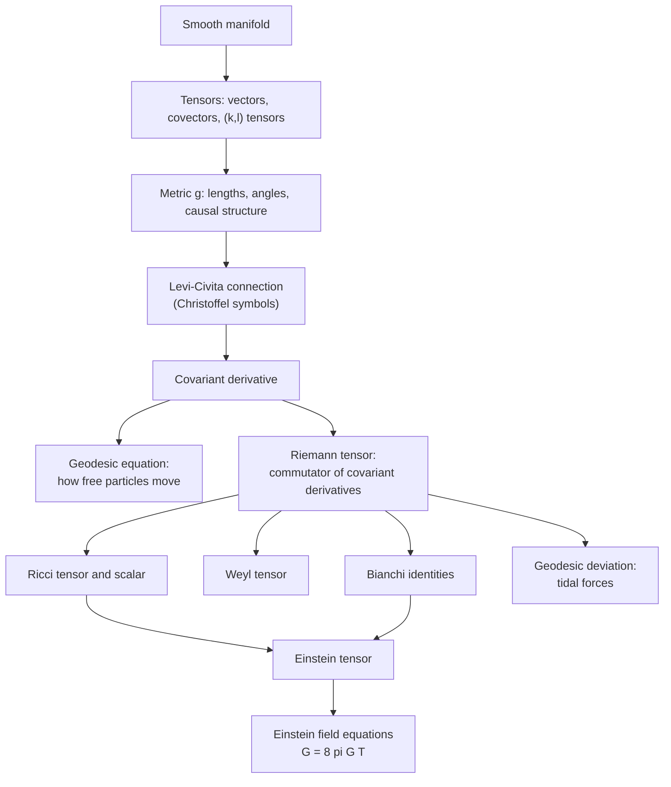

[Relativity](./) &raquo; Tensor Formalism &amp; the Field Equations

## Tensor Formalism & the Field Equations

This page is a reference for the differential geometry used in general relativity. It defines tensors on a manifold, the metric, the Levi-Civita connection and covariant derivative, geodesics, the Riemann, Ricci, Weyl and Einstein tensors, and Killing symmetries, and it derives the **Einstein field equations** twice: from Einstein's consistency requirements and from the Einstein–Hilbert action. A single example, the 2-sphere, is carried through every step. It assumes [Special Relativity](special-relativity.html) (four-vectors and the Minkowski metric) and complements [General Relativity](general-relativity.html), which covers the physical ideas.

**Conventions.** Signature **(−,+,+,+)**, with $c = 1$ and $G$ kept explicit in the field equations. Greek indices $\mu, \nu, \ldots$ run over $0,1,2,3$; Latin indices $i, j, \ldots$ over spatial components. Repeated indices, one up and one down, are summed. Symmetrization and antisymmetrization carry a factor of $1/n!$: $A_{(\mu\nu)} = \tfrac{1}{2}(A_{\mu\nu} + A_{\nu\mu})$, $A_{[\mu\nu]} = \tfrac{1}{2}(A_{\mu\nu} - A_{\nu\mu})$. Curvature sign conventions follow Misner–Thorne–Wheeler and Carroll ("+ + +" in MTW's classification), so a sphere has positive Ricci scalar.

## Why Tensors

The laws of physics cannot depend on the coordinates used to write them. On a curved spacetime there is no preferred global inertial frame and no privileged coordinate system, so a physical law must be an equation whose validity survives every smooth change of coordinates. Tensors are defined by how their components transform, in such a way that an equation $A^\mu{}_\nu = B^\mu{}_\nu$ between tensors of the same type, true in one coordinate system, is true in all. This is **general covariance**, and the formalism below exists to make it manifest.

The logical dependencies are:



## Manifolds and Tangent Spaces

A **smooth manifold** $M$ of dimension $n$ is a space covered by overlapping coordinate charts $x^\mu: U \to \mathbb{R}^n$ with smooth transition functions on the overlaps. Spacetime is a four-dimensional manifold. A bare manifold has no notion of distance, straightness, or parallelism; the metric and the connection supply them.

### Vectors

At each point $p$ there is a **tangent space** $T_pM$. A tangent vector is identified with a directional derivative: a curve $x^\mu(\lambda)$ through $p$ defines the operator

$$V[f] = \left.\frac{d}{d\lambda} f\bigl(x(\lambda)\bigr)\right|_p = \frac{dx^\mu}{d\lambda}\,\partial_\mu f$$

so the coordinate derivatives $\partial_\mu \equiv \partial/\partial x^\mu$ form a basis and $V = V^\mu \partial_\mu$. The components $V^\mu$ carry an upper (contravariant) index.

### Covectors

The dual space $T^*_pM$ consists of linear maps from vectors to numbers. Its elements are **covectors** or one-forms, $\omega = \omega_\mu\, dx^\mu$, where the basis $dx^\mu$ is defined by $dx^\mu(\partial_\nu) = \delta^\mu_\nu$. The pairing $\omega(V) = \omega_\mu V^\mu$ is a coordinate-independent number. The gradient of a function, $df = \partial_\mu f\, dx^\mu$, is the prototypical covector.

### Transformation laws

Under a change of coordinates $x^\mu \to x'^\mu$ the chain rule gives

$$V'^\mu = \frac{\partial x'^\mu}{\partial x^\nu}\, V^\nu, \qquad \omega'_\mu = \frac{\partial x^\nu}{\partial x'^\mu}\, \omega_\nu$$

A **$(k,l)$ tensor** has $k$ upper and $l$ lower indices and transforms with one such factor per index:

$$T'^{\mu_1 \cdots \mu_k}{}_{\nu_1 \cdots \nu_l} = \frac{\partial x'^{\mu_1}}{\partial x^{\alpha_1}} \cdots \frac{\partial x'^{\mu_k}}{\partial x^{\alpha_k}}\, \frac{\partial x^{\beta_1}}{\partial x'^{\nu_1}} \cdots \frac{\partial x^{\beta_l}}{\partial x'^{\nu_l}}\, T^{\alpha_1 \cdots \alpha_k}{}_{\beta_1 \cdots \beta_l}$$

Equivalently, a $(k,l)$ tensor is a multilinear map taking $k$ covectors and $l$ vectors to a number. Its components depend on the coordinates; the object does not.

| Type | Examples | Meaning |
|---|---|---|
| $(0,0)$ | Scalar field $\phi$, Ricci scalar $R$ | A number at each point, the same in all coordinates |
| $(1,0)$ | Four-velocity $u^\mu$, Killing vector $K^\mu$ | Direction and rate of change along a curve |
| $(0,1)$ | Gradient $\partial_\mu \phi$, four-momentum $p_\mu$ | Linear function of vectors |
| $(0,2)$ | Metric $g_{\mu\nu}$, stress–energy $T_{\mu\nu}$, Ricci $R_{\mu\nu}$ | Bilinear function of two vectors |
| $(1,1)$ | Kronecker delta $\delta^\mu_\nu$, a linear map on vectors | Maps vectors to vectors |
| $(1,3)$ | Riemann tensor $R^\rho{}_{\sigma\mu\nu}$ | Change of a vector transported around an infinitesimal loop |

### Tensor operations

All of the following produce tensors from tensors, so equations built from them are automatically covariant:

- **Linear combination** of tensors of the same type at the same point.
- **Outer product**: $(A \otimes B)^{\mu}{}_{\nu\rho} = A^\mu{}_\nu B_\rho$.
- **Contraction** of one upper with one lower index: $T^\mu{}_{\mu\nu}$ is a $(0,1)$ tensor.
- **Symmetrization and antisymmetrization** over indices of the same position.
- **Raising and lowering** with the metric (below).

Partial derivatives of tensor components are *not* tensors except for scalars; this is what the covariant derivative repairs.

## The Metric

The **metric** $g_{\mu\nu}$ is a symmetric, non-degenerate $(0,2)$ tensor. It defines the invariant line element

$$ds^2 = g_{\mu\nu}\, dx^\mu dx^\nu$$

which gives proper time along timelike curves ($d\tau^2 = -ds^2$) and proper distance along spacelike ones. Non-degeneracy ($\det g \neq 0$) guarantees an inverse $g^{\mu\nu}$ with $g^{\mu\lambda} g_{\lambda\nu} = \delta^\mu_\nu$. A Lorentzian metric has signature $(-,+,+,+)$.

At any point one can choose coordinates (Riemann normal coordinates, or a local inertial frame) in which

$$g_{\mu\nu}(p) = \eta_{\mu\nu}, \qquad \partial_\lambda g_{\mu\nu}(p) = 0$$

The second derivatives cannot all be removed; the 20 combinations that survive are the components of the Riemann tensor. This is the mathematical content of the equivalence principle: spacetime is locally Minkowskian, and gravity shows up only in second derivatives of the metric as tidal effects.

### Raising and lowering indices

The metric identifies vectors with covectors:

$$V_\mu = g_{\mu\nu} V^\nu, \qquad V^\mu = g^{\mu\nu} V_\nu$$

Inner products $U \cdot V = g_{\mu\nu} U^\mu V^\nu = U_\mu V^\mu$ are scalars. A vector is **timelike** if $V \cdot V < 0$, **null** if $V \cdot V = 0$, and **spacelike** if $V \cdot V > 0$. The invariant volume element is $\sqrt{-g}\, d^4x$ with $g = \det g_{\mu\nu}$, because $\sqrt{-g}$ transforms with the inverse of the Jacobian of $d^4x$.

### Example: the 2-sphere

The sphere of radius $a$ in coordinates $(\theta, \phi)$ has $ds^2 = a^2 d\theta^2 + a^2 \sin^2\theta\, d\phi^2$:

$$g_{\mu\nu} = \begin{pmatrix} a^2 & 0 \\ 0 & a^2 \sin^2\theta \end{pmatrix}, \qquad g^{\mu\nu} = \begin{pmatrix} a^{-2} & 0 \\ 0 & a^{-2}\sin^{-2}\theta \end{pmatrix}$$

It is the simplest curved space, and every quantity below can be computed for it by hand.

## The Connection and Covariant Derivative

Under a coordinate change, $\partial_\mu V^\nu$ picks up a term involving second derivatives of the coordinate transformation, so it is not a tensor. Geometrically, differentiating requires comparing vectors at neighboring points, which live in different tangent spaces; one needs a rule, the **connection**, for carrying a vector from one to the other.

### Definition

The **covariant derivative** adds correction terms linear in the connection coefficients $\Gamma^\lambda_{\mu\nu}$:

$$\nabla_\mu V^\nu = \partial_\mu V^\nu + \Gamma^\nu_{\mu\lambda} V^\lambda, \qquad \nabla_\mu \omega_\nu = \partial_\mu \omega_\nu - \Gamma^\lambda_{\mu\nu}\, \omega_\lambda$$

Each upper index gets a $+\Gamma$ term and each lower index a $-\Gamma$ term; on scalars $\nabla_\mu f = \partial_\mu f$. For example,

$$\nabla_\lambda T^\mu{}_\nu = \partial_\lambda T^\mu{}_\nu + \Gamma^\mu_{\lambda\sigma} T^\sigma{}_\nu - \Gamma^\sigma_{\lambda\nu} T^\mu{}_\sigma$$

The $\Gamma$ are not tensor components; their inhomogeneous transformation cancels that of the partial derivative. They can be set to zero at any single point by choice of coordinates, but not in a neighborhood if the space is curved.

### The Levi-Civita connection

General relativity uses the unique connection that is

- **metric-compatible**, $\nabla_\lambda g_{\mu\nu} = 0$, so that parallel transport preserves lengths and angles, and
- **torsion-free**, $\Gamma^\lambda_{\mu\nu} = \Gamma^\lambda_{\nu\mu}$.

Writing out $\nabla_\lambda g_{\mu\nu} = 0$ for the three cyclic permutations of the indices, adding two and subtracting the third, gives the **Christoffel symbols**

$$\Gamma^\lambda_{\mu\nu} = \frac{1}{2} g^{\lambda\sigma}\left(\partial_\mu g_{\sigma\nu} + \partial_\nu g_{\mu\sigma} - \partial_\sigma g_{\mu\nu}\right)$$

Metric compatibility also means $\nabla$ commutes with raising and lowering indices. Alternative theories (Einstein–Cartan theory, teleparallel gravity) relax torsion-freeness or use a different connection, but they are not needed for standard GR.

**Sphere example.** The only non-zero metric derivative is $\partial_\theta g_{\phi\phi} = 2a^2 \sin\theta\cos\theta$, giving

$$\Gamma^\theta_{\phi\phi} = -\sin\theta\cos\theta, \qquad \Gamma^\phi_{\theta\phi} = \Gamma^\phi_{\phi\theta} = \cot\theta$$

with all others zero.

### Parallel transport

A vector $V^\mu$ is **parallel transported** along a curve $x^\mu(\lambda)$ with tangent $u^\mu = dx^\mu/d\lambda$ if

$$\frac{DV^\mu}{d\lambda} \equiv u^\nu \nabla_\nu V^\mu = \frac{dV^\mu}{d\lambda} + \Gamma^\mu_{\nu\lambda}\, u^\nu V^\lambda = 0$$

On a curved space the result of transporting a vector between two points depends on the path. Around a closed loop the vector returns rotated, an effect called **holonomy**. For a small loop the rotation is proportional to the enclosed area times the curvature; on a 2-surface the total rotation equals the integral of the Gaussian curvature over the enclosed region.

<figure style="margin: 1.5em auto; max-width: 420px;">
<svg viewBox="0 0 400 330" role="img" aria-label="Parallel transport of a vector around a triangle on a sphere with three right angles; the vector returns rotated by ninety degrees" style="width: 100%; height: auto; font-family: inherit;">
  <defs>
    <marker id="tf-arrow" markerWidth="8" markerHeight="8" refX="7" refY="4" orient="auto" markerUnits="userSpaceOnUse">
      <path d="M0,0 L8,4 L0,8 z" fill="#1c7ed6"/>
    </marker>
    <marker id="tf-arrow-o" markerWidth="8" markerHeight="8" refX="7" refY="4" orient="auto" markerUnits="userSpaceOnUse">
      <path d="M0,0 L8,4 L0,8 z" fill="#e8590c"/>
    </marker>
  </defs>
  <circle cx="200" cy="200" r="150" fill="none" stroke="currentColor" stroke-width="1.5"/>
  <ellipse cx="200" cy="200" rx="150" ry="40" fill="none" stroke="currentColor" stroke-width="1" stroke-dasharray="4,4" opacity="0.6"/>
  <path d="M200,50 L200,240 A150,40 0 0,0 350,200 A150,150 0 0,0 200,50 Z" fill="currentColor" fill-opacity="0.08" stroke="currentColor" stroke-width="2.2"/>
  <!-- transported vector along the loop (all pointing "south" along the path) -->
  <line x1="200" y1="50" x2="200" y2="95" stroke="#1c7ed6" stroke-width="2.5" marker-end="url(#tf-arrow)"/>
  <line x1="200" y1="140" x2="200" y2="180" stroke="#1c7ed6" stroke-width="2.5" marker-end="url(#tf-arrow)"/>
  <line x1="200" y1="240" x2="200" y2="280" stroke="#1c7ed6" stroke-width="2.5" marker-end="url(#tf-arrow)"/>
  <line x1="297" y1="230" x2="297" y2="270" stroke="#1c7ed6" stroke-width="2.5" marker-end="url(#tf-arrow)"/>
  <line x1="350" y1="200" x2="350" y2="240" stroke="#1c7ed6" stroke-width="2.5" marker-end="url(#tf-arrow)"/>
  <line x1="306" y1="94" x2="334" y2="122" stroke="#1c7ed6" stroke-width="2.5" marker-end="url(#tf-arrow)"/>
  <!-- returned vector at the pole -->
  <line x1="200" y1="50" x2="248" y2="50" stroke="#e8590c" stroke-width="2.5" marker-end="url(#tf-arrow-o)"/>
  <path d="M200,72 A22,22 0 0,0 222,50" fill="none" stroke="#e8590c" stroke-width="1.5"/>
  <circle cx="200" cy="50" r="3.5" fill="currentColor"/>
  <circle cx="200" cy="240" r="3.5" fill="currentColor"/>
  <circle cx="350" cy="200" r="3.5" fill="currentColor"/>
  <text x="190" y="42" font-size="14" fill="currentColor" text-anchor="end">N</text>
  <text x="190" y="256" font-size="14" fill="currentColor" text-anchor="end">A</text>
  <text x="362" y="196" font-size="14" fill="currentColor">B</text>
  <text x="256" y="40" font-size="13" fill="#e8590c">returns rotated 90°</text>
  <text x="200" y="320" font-size="12" fill="currentColor" text-anchor="middle">Path N to A to B to N; the loop encloses 1/8 of the sphere</text>
</svg>
<figcaption style="font-size: 0.9em; text-align: center;">Parallel transport around a geodesic triangle with three right angles. The vector (blue) is kept parallel along each great-circle arc and returns to the north pole rotated by $\pi/2$ (orange), equal to the enclosed area $\pi a^2/2$ times the Gaussian curvature $1/a^2$.</figcaption>
</figure>

### Lie derivative and Killing vectors

A second, connection-independent derivative compares tensors along the flow of a vector field $K^\mu$. This **Lie derivative** acts on the metric as

$$\mathcal{L}_K\, g_{\mu\nu} = \nabla_\mu K_\nu + \nabla_\nu K_\mu$$

The metric is invariant under the flow (a symmetry, or **isometry**) exactly when $K$ satisfies **Killing's equation**

$$\nabla_{(\mu} K_{\nu)} = 0$$

Killing vectors produce conserved quantities: along any geodesic with tangent $u^\mu$, $K_\mu u^\mu$ is constant. In a static, spherically symmetric spacetime such as Schwarzschild, the time-translation Killing vector $\partial_t$ gives the conserved energy per unit mass $E = -u_t$, and the rotational Killing vector $\partial_\phi$ gives the conserved angular momentum $L = u_\phi$. These two constants reduce orbit problems to one-dimensional effective-potential problems. A maximally symmetric space in $n$ dimensions has $n(n+1)/2$ Killing vectors: 10 for Minkowski space (the Poincaré group), 3 for the 2-sphere.

## Geodesics

A **geodesic** is a curve that parallel transports its own tangent, $u^\nu \nabla_\nu u^\mu = 0$. In coordinates this is the **geodesic equation**

$$\frac{d^2 x^\mu}{d\lambda^2} + \Gamma^\mu_{\alpha\beta}\, \frac{dx^\alpha}{d\lambda}\frac{dx^\beta}{d\lambda} = 0$$

where $\lambda$ is an **affine parameter**, unique up to $\lambda \to a\lambda + b$. For massive particles one takes proper time $\tau$, so $u^\mu$ is the four-velocity and $u \cdot u = -1$; for light, $u \cdot u = 0$. Freely falling bodies follow timelike geodesics and light follows null geodesics. There is no gravitational force term: the apparent force is the Christoffel term.

**Newtonian limit.** For slow motion ($dx^i/d\tau \ll dt/d\tau$) in a weak static field with $g_{00} = -(1 + 2\Phi)$, the only significant Christoffel symbol is $\Gamma^i_{00} = -\tfrac{1}{2}\partial_i h_{00} = \partial_i\Phi$ (using $h_{00} = -2\Phi$), and with $dt/d\tau \approx 1$ the geodesic equation becomes

$$\frac{d^2 x^i}{dt^2} = -\partial_i \Phi$$

which is Newton's law of gravitation.

### Geodesics as extremal proper time

Timelike geodesics extremize (locally maximize) the proper time

$$\tau = \int \sqrt{-g_{\mu\nu}\,\frac{dx^\mu}{d\lambda}\frac{dx^\nu}{d\lambda}}\; d\lambda$$

between two events, which is the geometric content of the twin paradox in [special relativity](special-relativity.html#the-twin-paradox). In practice it is easier to use the Lagrangian $L = \tfrac{1}{2} g_{\mu\nu}\dot x^\mu \dot x^\nu$, which gives the same equations with an affine parameter. Its Euler–Lagrange equations reproduce the geodesic equation, so the Christoffel symbols can be read off without evaluating the formula.

**Sphere example.** With $L = \tfrac{1}{2}a^2(\dot\theta^2 + \sin^2\theta\,\dot\phi^2)$ the Euler–Lagrange equations are

$$\ddot\theta - \sin\theta\cos\theta\,\dot\phi^2 = 0, \qquad \ddot\phi + 2\cot\theta\,\dot\theta\,\dot\phi = 0$$

Comparison with the geodesic equation gives $\Gamma^\theta_{\phi\phi} = -\sin\theta\cos\theta$ and $\Gamma^\phi_{\theta\phi} = \cot\theta$ (the factor 2 counts both orderings of the symmetric lower indices). The solutions are great circles; $\phi$ has no explicit appearance, so $\sin^2\theta\,\dot\phi$ is conserved, the Killing constant associated with $\partial_\phi$.

### Geodesic deviation

Let $S^\mu$ be the separation vector between two neighbouring geodesics with tangent $u^\mu$. Its second covariant derivative along the curves is

$$\frac{D^2 S^\mu}{d\tau^2} = R^\mu{}_{\nu\rho\sigma}\, u^\nu u^\rho S^\sigma$$

In flat spacetime nearby free-fallers keep a constant relative velocity. In a gravitational field they accelerate relative to each other: this is **tidal gravity**, and the Riemann tensor is its complete description. Gravitational-wave detectors measure precisely this quantity.

## Curvature

### The Riemann tensor

Curvature is the failure of covariant derivatives to commute. For the Levi-Civita connection,

$$[\nabla_\mu, \nabla_\nu]\, V^\rho = R^\rho{}_{\sigma\mu\nu}\, V^\sigma$$

which defines the **Riemann tensor**. In terms of the connection,

$$R^\rho{}_{\sigma\mu\nu} = \partial_\mu \Gamma^\rho_{\nu\sigma} - \partial_\nu \Gamma^\rho_{\mu\sigma} + \Gamma^\rho_{\mu\lambda}\Gamma^\lambda_{\nu\sigma} - \Gamma^\rho_{\nu\lambda}\Gamma^\lambda_{\mu\sigma}$$

The Riemann tensor vanishes everywhere if and only if the spacetime is flat, meaning that coordinates exist in which $g_{\mu\nu} = \eta_{\mu\nu}$ throughout a region. It captures three equivalent signatures of curvature: non-commuting derivatives, holonomy around loops, and geodesic deviation.

Whether a singularity is physical or a coordinate artifact is decided by scalar invariants built from curvature, since individual components depend on the coordinates. For the Schwarzschild metric the metric component $g_{rr}$ diverges at $r = 2GM$, but the **Kretschmann scalar** $R_{\mu\nu\rho\sigma}R^{\mu\nu\rho\sigma} = 48G^2M^2/r^6$ is finite there, so the horizon is a coordinate singularity. The same scalar diverges at $r = 0$, a genuine curvature singularity. See [Black Holes](black-holes.html#the-schwarzschild-solution).

### Symmetries and the Bianchi identities

With the first index lowered, the Riemann tensor satisfies

$$R_{\rho\sigma\mu\nu} = -R_{\sigma\rho\mu\nu} = -R_{\rho\sigma\nu\mu} = R_{\mu\nu\rho\sigma}, \qquad R_{\rho[\sigma\mu\nu]} = 0$$

The last is the **first (algebraic) Bianchi identity**. Together these leave $n^2(n^2 - 1)/12$ independent components: 1 in two dimensions, 6 in three, **20** in four. There is also a differential identity, the **second Bianchi identity**,

$$\nabla_{[\lambda} R_{\rho\sigma]\mu\nu} = 0$$

which is the structural key to the field equations.

### Ricci tensor, scalar, and Weyl tensor

Contracting the Riemann tensor gives the symmetric **Ricci tensor** and the **Ricci scalar**:

$$R_{\mu\nu} = R^\lambda{}_{\mu\lambda\nu}, \qquad R = g^{\mu\nu} R_{\mu\nu}$$

The trace-free remainder is the **Weyl tensor** $C_{\rho\sigma\mu\nu}$. In four dimensions

$$R_{\rho\sigma\mu\nu} = C_{\rho\sigma\mu\nu} + \left(g_{\rho[\mu} R_{\nu]\sigma} - g_{\sigma[\mu} R_{\nu]\rho}\right) - \frac{1}{3} R\, g_{\rho[\mu} g_{\nu]\sigma}$$

| Object | Independent components (4D) | Physical role |
|---|---|---|
| Riemann $R_{\rho\sigma\mu\nu}$ | 20 | Complete tidal field |
| Ricci $R_{\mu\nu}$ | 10 | Volume change of a ball of free-falling particles; fixed locally by matter through the field equations |
| Weyl $C_{\rho\sigma\mu\nu}$ | 10 | Shape distortion at fixed volume; the part of curvature that exists in vacuum and propagates as gravitational waves |
| Ricci scalar $R$ | 1 | Trace; in vacuum GR without $\Lambda$, $R = 0$ |

The Weyl tensor is invariant under conformal rescalings $g \to \Omega^2 g$ and vanishes identically in three or fewer dimensions, which is why 3D general relativity has no local propagating degrees of freedom.

**Sphere example.** From the Christoffel symbols,

$$R^\theta{}_{\phi\theta\phi} = \partial_\theta \Gamma^\theta_{\phi\phi} - \Gamma^\theta_{\phi\phi}\Gamma^\phi_{\theta\phi} = (\sin^2\theta - \cos^2\theta) + \cos^2\theta = \sin^2\theta$$

This is the one independent component in two dimensions. Contracting gives $R_{\theta\theta} = 1$ and $R_{\phi\phi} = \sin^2\theta$, that is $R_{\mu\nu} = g_{\mu\nu}/a^2$, and

$$R = g^{\theta\theta} R_{\theta\theta} + g^{\phi\phi} R_{\phi\phi} = \frac{1}{a^2} + \frac{1}{a^2} = \frac{2}{a^2}$$

In two dimensions $R = 2K$, where $K = 1/a^2$ is the Gaussian curvature, consistent with the holonomy figure above.

### The Einstein tensor

Contracting the second Bianchi identity twice gives the **contracted Bianchi identity**:

$$\nabla^\mu G_{\mu\nu} = 0, \qquad G_{\mu\nu} \equiv R_{\mu\nu} - \frac{1}{2} g_{\mu\nu} R$$

The **Einstein tensor** $G_{\mu\nu}$ is divergence-free for every metric, as a geometric identity. This is exactly the property required of anything set equal to a conserved stress–energy tensor.

## The Einstein Field Equations

### Route 1: The Requirement-Driven Argument

Einstein looked for an equation $\mathcal{G}_{\mu\nu} = \kappa\, T_{\mu\nu}$, where $T_{\mu\nu}$ is the **stress–energy tensor** of matter. The left side must be

1. a symmetric $(0,2)$ tensor, like $T_{\mu\nu}$;
2. built from the metric and its first and second derivatives only, so that the equations are second-order like other field equations;
3. divergence-free, because local energy–momentum conservation in curved spacetime is $\nabla^\mu T_{\mu\nu} = 0$;
4. such that the Newtonian limit $\nabla^2\Phi = 4\pi G\rho$ is recovered.

**Lovelock's theorem** (1971) states that in four dimensions the only tensor satisfying 1–3 is a combination $a\,G_{\mu\nu} + b\,g_{\mu\nu}$. Setting $b = \Lambda$ (the cosmological constant) and fixing $a$ and $\kappa$ by requirement 4 gives the **Einstein field equations**

$$G_{\mu\nu} + \Lambda g_{\mu\nu} = 8\pi G\, T_{\mu\nu}$$

or, restoring $c$, $G_{\mu\nu} + \Lambda g_{\mu\nu} = (8\pi G/c^4)\, T_{\mu\nu}$.

Taking the trace ($g^{\mu\nu}g_{\mu\nu} = 4$) gives $-R + 4\Lambda = 8\pi G\, T$, which lets the equations be written in **trace-reversed** form:

$$R_{\mu\nu} = 8\pi G\left(T_{\mu\nu} - \frac{1}{2} T g_{\mu\nu}\right) + \Lambda g_{\mu\nu}$$

In vacuum with $\Lambda = 0$ this reduces to $R_{\mu\nu} = 0$: the Ricci tensor vanishes, but the Weyl tensor, and so tidal gravity, need not.

### Counting equations and degrees of freedom

The field equations are ten coupled, non-linear, second-order PDEs for the ten components of $g_{\mu\nu}$. They are not independent: the contracted Bianchi identity imposes four differential relations. Four more components are coordinate (gauge) freedom from diffeomorphism invariance. Of the remaining equations, four are **constraints** on initial data (the Hamiltonian and momentum constraints of the 3+1 split) rather than evolution equations. The result is **two** physical degrees of freedom per point, the two polarizations of gravitational waves (see [Counting the Polarizations](gravitational-waves.html#two-polarizations)).

### The Newtonian Limit

Take a weak, static field $g_{\mu\nu} = \eta_{\mu\nu} + h_{\mu\nu}$ with $h_{00} = -2\Phi$, and non-relativistic matter (dust) with $T_{00} = \rho$ and $T = g^{\mu\nu}T_{\mu\nu} \approx -\rho$. The time–time component of the trace-reversed equations (with $\Lambda = 0$) is

$$R_{00} = 8\pi G\left(\rho - \frac{1}{2}\rho\right) = 4\pi G\rho$$

For a static weak field, $R_{00} \approx \partial_i \Gamma^i_{00} = \nabla^2\Phi$ to first order. So

$$\nabla^2 \Phi = 4\pi G\, \rho$$

the Poisson equation of Newtonian gravity. This fixes the coupling $\kappa = 8\pi G$.

### Route 2: The Einstein–Hilbert Action

The same equations follow from the action

$$S = \frac{1}{16\pi G}\int d^4x\, \sqrt{-g}\,\left(R - 2\Lambda\right) + S_m$$

where $S_m$ is the matter action. Varying with respect to the inverse metric requires

$$\delta\sqrt{-g} = -\frac{1}{2}\sqrt{-g}\, g_{\mu\nu}\, \delta g^{\mu\nu}, \qquad \delta R = R_{\mu\nu}\,\delta g^{\mu\nu} + g_{\mu\nu}\,\Box\,\delta g^{\mu\nu} - \nabla_\mu\nabla_\nu\,\delta g^{\mu\nu}$$

with $\Box = \nabla^\lambda\nabla_\lambda$. The last two terms of $\delta R$ are total divergences (from the Palatini identity) and integrate to a boundary term. For a well-posed variational principle with the metric fixed on the boundary, that term is cancelled by adding the **Gibbons–Hawking–York** boundary term to the action. The gravitational variation is then

$$\delta S_{EH} = \frac{1}{16\pi G}\int d^4x\, \sqrt{-g}\,\left(R_{\mu\nu} - \frac{1}{2} g_{\mu\nu} R + \Lambda g_{\mu\nu}\right)\delta g^{\mu\nu}$$

Defining the stress–energy tensor by

$$T_{\mu\nu} = -\frac{2}{\sqrt{-g}}\,\frac{\delta S_m}{\delta g^{\mu\nu}}$$

and requiring $\delta S = 0$ for all $\delta g^{\mu\nu}$ gives $G_{\mu\nu} + \Lambda g_{\mu\nu} = 8\pi G\, T_{\mu\nu}$.

The action route makes three things explicit:

- $G_{\mu\nu}$ appears because it is the metric variation of $\sqrt{-g}\,R$.
- $\nabla^\mu T_{\mu\nu} = 0$ follows from the diffeomorphism invariance of $S_m$ whenever the matter fields obey their equations of motion; it is a Noether identity, not an extra assumption.
- The cosmological constant is a constant term in the Lagrangian, equivalent to a vacuum energy density $\rho_\Lambda = \Lambda/8\pi G$.

It is also the starting point for coupling other fields, for higher-curvature corrections, and for [quantization](quantum-gravity.html#perturbative-quantum-gravity).

### Interpreting the equations

The field equations relate the part of curvature that is locally determined by matter (Ricci) to the energy, momentum, pressure and stress of that matter. The Weyl part is not fixed locally; it is determined by boundary conditions and by distant sources, and it carries gravitational waves. Because the equations are non-linear, gravitational fields themselves act as sources, which leads to black holes, gravitational-wave emission and the dynamics of an expanding universe.

## Worked Example: the Schwarzschild Solution

The static, spherically symmetric vacuum solution illustrates the whole chain. The most general static, spherically symmetric metric can be written

$$ds^2 = -e^{2\alpha(r)}\,dt^2 + e^{2\beta(r)}\,dr^2 + r^2\left(d\theta^2 + \sin^2\theta\,d\phi^2\right)$$

Computing the Christoffel symbols and the Ricci tensor, the vacuum equations $R_{\mu\nu} = 0$ reduce to ordinary differential equations. The combination $R_{tt}e^{-2\alpha} + R_{rr}e^{-2\beta} = 0$ gives $\alpha' + \beta' = 0$, so $\alpha = -\beta$ after rescaling $t$, and $R_{\theta\theta} = 0$ then gives $\bigl(r e^{2\alpha}\bigr)' = 1$, that is $e^{2\alpha} = 1 - r_s/r$. Matching the Newtonian limit $g_{00} \approx -(1 + 2\Phi)$ with $\Phi = -GM/r$ fixes $r_s = 2GM$:

$$ds^2 = -\left(1 - \frac{2GM}{r}\right)dt^2 + \left(1 - \frac{2GM}{r}\right)^{-1}dr^2 + r^2\left(d\theta^2 + \sin^2\theta\,d\phi^2\right)$$

By **Birkhoff's theorem** this is the unique spherically symmetric vacuum solution, so it describes the exterior of any spherical body, static or not. The horizon, orbits and light bending are developed on the [Black Holes](black-holes.html) and [General Relativity](general-relativity.html) pages.

## Computing Curvature in Practice

Hand computation of curvature is error-prone beyond simple metrics, and symbolic algebra is standard. Widely used tools include xAct (xTensor, xCoba) for Mathematica, SageManifolds (part of SageMath), Cadabra, Maxima's ctensor package, and SymPy in Python. The following SymPy script computes the Christoffel symbols, Riemann tensor, Ricci tensor and Ricci scalar of the 2-sphere directly from the formulas above; changing `coords` and `g` handles any metric.

```python
import sympy as sp

theta, phi, a = sp.symbols("theta phi a", positive=True)
coords = [theta, phi]
g = sp.Matrix([[a**2, 0], [0, a**2 * sp.sin(theta)**2]])
ginv = g.inv()
n = len(coords)

# Gamma[l][m][k] = Gamma^l_{mk} = 1/2 g^{ls} (d_m g_{sk} + d_k g_{ms} - d_s g_{mk})
Gamma = [[[sp.simplify(sum(ginv[l, s] * (sp.diff(g[s, k], coords[m])
                                        + sp.diff(g[m, s], coords[k])
                                        - sp.diff(g[m, k], coords[s]))
                           for s in range(n)) / 2)
           for k in range(n)] for m in range(n)] for l in range(n)]

def riemann(r, s, m, v):
    """R^r_{s m v} = d_m Gamma^r_{vs} - d_v Gamma^r_{ms}
                     + Gamma^r_{ml} Gamma^l_{vs} - Gamma^r_{vl} Gamma^l_{ms}"""
    expr = sp.diff(Gamma[r][v][s], coords[m]) - sp.diff(Gamma[r][m][s], coords[v])
    expr += sum(Gamma[r][m][l] * Gamma[l][v][s] - Gamma[r][v][l] * Gamma[l][m][s]
                for l in range(n))
    return sp.simplify(expr)

# Ricci tensor R_{sv} = R^r_{s r v}, Ricci scalar R = g^{sv} R_{sv}
ricci = sp.Matrix(n, n, lambda s, v: sp.simplify(sum(riemann(r, s, r, v) for r in range(n))))
R = sp.simplify(sum(ginv[i, j] * ricci[i, j] for i in range(n) for j in range(n)))

print(Gamma[0][1][1], Gamma[1][0][1])  # -sin(2*theta)/2, 1/tan(theta)
print(sp.trigsimp(ricci[1, 1]))        # an expression equal to sin(theta)**2
print(R)                               # 2/a**2
```

SymPy may print trigonometric results in equivalent forms (for example $-\sin 2\theta/2$ for $-\sin\theta\cos\theta$). For four-dimensional metrics the nested-list approach is still practical, but dedicated packages exploit the Riemann symmetries and are much faster. Numerical relativity codes (such as the Einstein Toolkit) solve the field equations in 3+1 form rather than working with the covariant tensors directly; see [Computational Physics](../computational-physics/).

## See Also

Within relativity:

- [General Relativity](general-relativity.html) — the equivalence principle and the physical content of the field equations.
- [Special Relativity](special-relativity.html) — Minkowski spacetime and four-vectors, the flat-space limit of this formalism.
- [Black Holes](black-holes.html) — Schwarzschild, Reissner–Nordström and Kerr solutions and their causal structure.
- [Gravitational Waves](gravitational-waves.html) — linearized field equations and the Weyl curvature of radiation.
- [Toward Quantum Gravity](quantum-gravity.html) — what happens when the Einstein–Hilbert action is quantized.
- [Graduate Formalism & Frontiers](advanced.html) and [Relativity Hub](./) — overview and navigation.

Elsewhere in physics:

- [Lagrangian and Hamiltonian Mechanics](../classical-mechanics/lagrangian-hamiltonian.html) — variational principles and Noether's theorem in classical mechanics.
- [Quantum Field Theory](../quantum-field-theory.html) — action principles and the stress–energy tensor in relativistic field theory.
- [String Theory](../string-theory/) — a candidate quantum theory of the geometry described here.
- [Computational Physics](../computational-physics/) — numerical solution of the field equations.
- [Physics Hub](../) — all physics topics.
