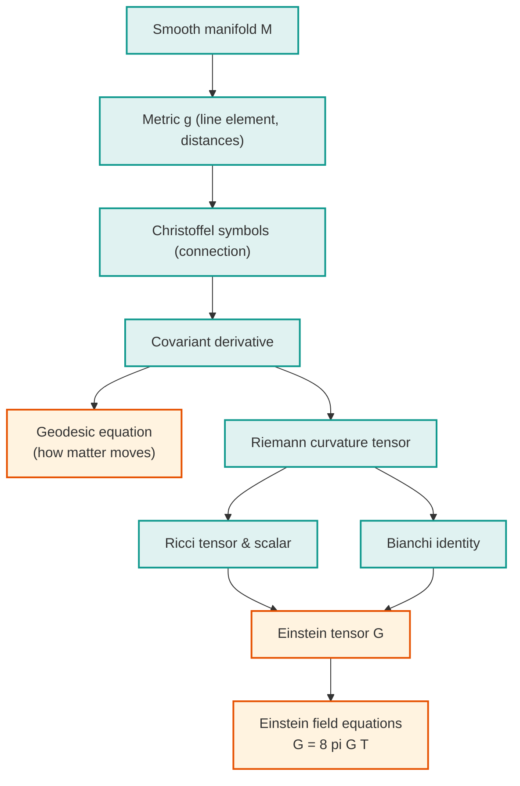

[Relativity](./) &raquo; Tensor Formalism &amp; the Field Equations

<!-- Custom styles are now loaded via main.scss -->

  <h1 style="color: white; margin: 0; font-size: 2.5rem;">Tensor Formalism &amp; the Field Equations</h1>
  
From Manifolds and the Metric to Curvature and Einstein's Equations

  
This page builds the mathematical machinery of general relativity from the ground up: tensors on a smooth manifold, the metric, the connection and its Christoffel symbols, the covariant derivative, geodesics, the Riemann and Ricci curvature tensors, and — as the destination — a careful derivation of the <strong>Einstein field equations</strong>, both by Einstein's original "find the right tensor" route and by varying the Einstein–Hilbert action. It assumes the conceptual material on <a href="special-relativity.html">Special Relativity</a> and <a href="general-relativity.html">General Relativity</a> and is intended as a self-contained reference for the differential geometry those pages use.

  <h4>Conventions used below</h4>
  
We work in <strong>geometric units</strong> with $G = c = 1$ unless a constant is shown explicitly. The metric signature is <strong>(−,+,+,+)</strong> ("mostly plus"). Greek indices $\mu,\nu,\dots$ run over the four spacetime coordinates $0,1,2,3$; Latin indices $i,j,\dots$ over the three spatial ones. The <strong>Einstein summation convention</strong> is in force: a repeated index, once up and once down, is summed. Round brackets on indices denote symmetrization, $A_{(\mu\nu)} = \tfrac{1}{2}(A_{\mu\nu}+A_{\nu\mu})$, square brackets antisymmetrization, $A_{[\mu\nu]} = \tfrac{1}{2}(A_{\mu\nu}-A_{\nu\mu})$.

## Why Tensors?

The central lesson of general relativity is that **the laws of physics must not depend on the coordinates used to write them down**. There is no preferred global inertial frame and no privileged set of coordinates on a curved spacetime, so a physical law expressed as "this collection of numbers equals that collection of numbers" is only meaningful if the equality survives every smooth change of coordinates. Tensors are exactly the objects with that property: they are defined by **how their components transform**, so that an equation of the form $A^{\mu}{}_{\nu} = B^{\mu}{}_{\nu}$ holding in one coordinate system holds in all of them. This is the principle of **general covariance**, and the entire formalism below exists to make it manifest.

## Manifolds and the Tangent Space

A **smooth manifold** $M$ is a space that looks locally like $\mathbb{R}^n$: it is covered by overlapping coordinate patches (charts) $x^\mu : U \to \mathbb{R}^n$, with smooth transition functions on the overlaps. Spacetime is a four-dimensional Lorentzian manifold. Crucially, a manifold has *no* intrinsic notion of distance, straight lines, or parallelism until we add extra structure — the metric and the connection supply those.

### Tangent Vectors

At each point $p \in M$ there is a **tangent space** $T_pM$, an $n$-dimensional vector space. The cleanest definition identifies a tangent vector with a **directional derivative operator**: a curve $\gamma(\lambda)$ through $p$ gives the operator

$$V[f] = \left.\frac{d}{d\lambda} f\bigl(\gamma(\lambda)\bigr)\right|_{p}$$

acting on functions $f$. In a coordinate basis the partial derivatives $\partial_\mu \equiv \partial/\partial x^\mu$ form a basis of $T_pM$, and any vector is $V = V^\mu \partial_\mu$. The numbers $V^\mu$ are the **contravariant components** (upper index).

### Covectors (the Cotangent Space)

The dual vector space $T^*_pM$ consists of linear maps $T_pM \to \mathbb{R}$. Its elements are **covectors** (one-forms), written with a lower index, $\omega = \omega_\mu \, dx^\mu$, where the coordinate differentials $dx^\mu$ form the **dual basis** defined by $dx^\mu(\partial_\nu) = \delta^\mu_\nu$. The pairing of a covector with a vector is the coordinate-independent scalar

$$\omega(V) = \omega_\mu V^\mu .$$

### The Transformation Laws

Under a coordinate change $x^\mu \to x'^\mu$, the chain rule fixes how components transform. Vectors transform with the Jacobian $\partial x'^\mu / \partial x^\nu$, covectors with its inverse:

$$V'^\mu = \frac{\partial x'^\mu}{\partial x^\nu}\, V^\nu , \qquad \omega'_\mu = \frac{\partial x^\nu}{\partial x'^\mu}\, \omega_\nu .$$

A general **$(k,l)$ tensor** has $k$ upper and $l$ lower indices and transforms with one Jacobian factor per index:

$$T'^{\mu_1\cdots\mu_k}{}_{\nu_1\cdots\nu_l} = \frac{\partial x'^{\mu_1}}{\partial x^{\alpha_1}}\cdots \frac{\partial x^{\beta_1}}{\partial x'^{\nu_1}}\cdots\, T^{\alpha_1\cdots\alpha_k}{}_{\beta_1\cdots\beta_l} .$$

This transformation rule is the definition of a tensor. Its payoff: if every term in an equation is a tensor of the same type, and the equation holds in one frame, the matched Jacobian factors guarantee it holds in every frame.

  <h4>Tensor as multilinear map</h4>
  
Equivalently, a $(k,l)$ tensor is a multilinear machine that eats $k$ covectors and $l$ vectors and returns a number. The metric $g_{\mu\nu}$ is a $(0,2)$ tensor: feed it two vectors and it returns their inner product. This viewpoint makes "tensor" mean a single geometric object whose <em>components</em> are coordinate-dependent but whose <em>identity</em> is not.

## The Metric Tensor

The structure that turns a bare manifold into a geometry is the **metric** $g_{\mu\nu}$, a symmetric, non-degenerate $(0,2)$ tensor. It defines the infinitesimal invariant **line element**

$$ds^2 = g_{\mu\nu}\, dx^\mu dx^\nu ,$$

which measures proper distance (spacelike) and proper time (timelike) and is the same in every coordinate system. Its defining properties are:

- **Symmetry:** $g_{\mu\nu} = g_{\nu\mu}$.
- **Non-degeneracy:** $\det(g_{\mu\nu}) \neq 0$, so an inverse metric $g^{\mu\nu}$ exists, defined by $g^{\mu\lambda} g_{\lambda\nu} = \delta^\mu_\nu$.
- **Signature:** for spacetime, $(-,+,+,+)$ — one timelike and three spacelike directions.

In a local inertial frame at any point $p$ (Riemann normal coordinates) the metric reduces to the flat **Minkowski metric** $\eta_{\mu\nu} = \mathrm{diag}(-1,+1,+1,+1)$ with vanishing first derivatives, which is the precise statement of the equivalence principle: spacetime is locally special-relativistic.

### Raising and Lowering Indices

The metric and its inverse convert between vectors and covectors — they "raise and lower indices":

$$V_\mu = g_{\mu\nu} V^\nu , \qquad V^\mu = g^{\mu\nu} V_\nu .$$

The squared norm of a vector and the inner product of two vectors are then coordinate-invariant scalars:

$$V^\mu V_\mu = g_{\mu\nu} V^\mu V^\nu , \qquad U \cdot V = g_{\mu\nu} U^\mu V^\nu .$$

A vector is **timelike** if $V^\mu V_\mu < 0$, **spacelike** if $> 0$, and **null** if $= 0$ (in the mostly-plus convention).

  <h4>Worked example: the metric on a 2-sphere</h4>
  
The round sphere of radius $a$, with coordinates $(\theta,\phi)$, has line element $ds^2 = a^2\,d\theta^2 + a^2\sin^2\theta\,d\phi^2$, i.e.

$$g_{\mu\nu} = \begin{pmatrix} a^2 & 0 \\ 0 & a^2\sin^2\theta \end{pmatrix}, \qquad g^{\mu\nu} = \begin{pmatrix} a^{-2} & 0 \\ 0 & a^{-2}\sin^{-2}\theta \end{pmatrix}.$$

  
This is the simplest curved space and a useful sandbox: every quantity below (Christoffel symbols, Riemann tensor, Ricci scalar) can be computed by hand for it, and the answer $R = 2/a^2$ confirms the sphere has constant positive curvature.

## The Connection and Covariant Derivative

The ordinary partial derivative $\partial_\mu V^\nu$ is **not a tensor**: under a coordinate change it picks up an extra term from differentiating the Jacobian, so it transforms inhomogeneously. The geometric reason is that comparing vectors at *different* points requires transporting one to the other, and on a curved manifold there is no canonical way to do that. We supply the missing structure with a **connection**, encoded by the **Christoffel symbols** $\Gamma^\lambda_{\mu\nu}$, which tell us how the basis vectors twist from point to point.

### Definition

The **covariant derivative** $\nabla_\mu$ adds correction terms that cancel the offending inhomogeneous pieces, yielding a genuine tensor. On a vector and a covector:

$$\nabla_\mu V^\nu = \partial_\mu V^\nu + \Gamma^\nu_{\mu\lambda} V^\lambda ,$$

$$\nabla_\mu \omega_\nu = \partial_\mu \omega_\nu - \Gamma^\lambda_{\mu\nu}\, \omega_\lambda .$$

Note the **opposite signs**: upper indices get a $+\Gamma$, lower indices a $-\Gamma$. For a general tensor, add one $+\Gamma$ term per upper index and one $-\Gamma$ term per lower index. The covariant derivative of a scalar is just its partial derivative, $\nabla_\mu f = \partial_\mu f$. The Christoffel symbols are **not tensors** themselves — their non-tensorial transformation is exactly what is needed to fix up the partial derivative.

### Parallel Transport

A vector is **parallel transported** along a curve with tangent $u^\mu$ when its covariant derivative along the curve vanishes:

$$u^\mu \nabla_\mu V^\nu = 0 .$$

On a curved manifold, parallel transporting a vector around a closed loop generally returns it rotated — this **holonomy** is the operational signature of curvature, and we will see it reappear as the Riemann tensor.

### The Levi-Civita Connection

Among all possible connections, general relativity selects the unique one determined by the metric through two conditions:

- **Metric compatibility:** $\nabla_\lambda g_{\mu\nu} = 0$. Parallel transport preserves lengths and angles, so the geometry measured by the metric is consistent with the parallelism defined by the connection.
- **Torsion-free (symmetric):** $\Gamma^\lambda_{\mu\nu} = \Gamma^\lambda_{\nu\mu}$.

These two requirements fix the connection completely. Solving the metric-compatibility equation for $\Gamma$ (the "Christoffel trick" of cyclically permuting indices and adding) gives the symbols entirely in terms of the metric:

$$\Gamma^\lambda_{\mu\nu} = \frac{1}{2} g^{\lambda\sigma}\bigl(\partial_\mu g_{\sigma\nu} + \partial_\nu g_{\mu\sigma} - \partial_\sigma g_{\mu\nu}\bigr).$$

This is the workhorse formula of general relativity. Everything downstream — geodesics, curvature, the field equations — is built from these symbols and hence ultimately from the metric and its derivatives.

  <h4>Worked example: Christoffel symbols of the 2-sphere</h4>
  
Using the sphere metric above, the only non-zero metric derivative is $\partial_\theta g_{\phi\phi} = 2a^2\sin\theta\cos\theta$. Feeding it into the formula gives the three independent non-vanishing symbols

$$\Gamma^\theta_{\phi\phi} = -\sin\theta\cos\theta , \qquad \Gamma^\phi_{\theta\phi} = \Gamma^\phi_{\phi\theta} = \cot\theta .$$

  
All others vanish. These encode the familiar fact that "straight" lines on a sphere are great circles, and they feed directly into the geodesic equation below.

## Geodesics

A **geodesic** is the curved-space generalization of a straight line: the straightest possible path, defined by parallel-transporting its own tangent vector. Writing the tangent as $u^\mu = dx^\mu/d\lambda$, the condition $u^\nu \nabla_\nu u^\mu = 0$ expands into the **geodesic equation**

$$\frac{d^2 x^\mu}{d\lambda^2} + \Gamma^\mu_{\alpha\beta}\, \frac{dx^\alpha}{d\lambda}\frac{dx^\beta}{d\lambda} = 0 ,$$

where $\lambda$ is an **affine parameter** (proper time $\tau$ for massive particles, in which case $u^\mu$ is the four-velocity). This single equation is the precise content of "spacetime tells matter how to move": a freely falling body feels no force, yet its worldline bends because the Christoffel symbols are non-zero in a curved (or merely curvilinear) spacetime. What we call gravity is this geometric term.

### Geodesics as Extremal Proper Time

Equivalently, timelike geodesics **extremize proper time** between two events. Starting from the action

$$\tau = \int \sqrt{-g_{\mu\nu}\,\frac{dx^\mu}{d\lambda}\frac{dx^\nu}{d\lambda}}\; d\lambda ,$$

the Euler–Lagrange equations reproduce the geodesic equation, with the Christoffel symbols emerging automatically from the variation. This is the relativistic version of the principle of least action and is often the fastest practical route to the Christoffel symbols: read them off the Euler–Lagrange equations rather than computing the $\Gamma$ formula directly.

### Geodesic Deviation

Two nearby geodesics separated by $S^\mu$ do not stay parallel; their relative acceleration is governed by the **geodesic deviation equation**

$$\frac{D^2 S^\mu}{d\tau^2} = -R^\mu{}_{\alpha\nu\beta}\, u^\alpha S^\nu u^\beta ,$$

where $D/d\tau \equiv u^\nu\nabla_\nu$ is the covariant derivative along the curve. This is the rigorous statement of **tidal gravity**: in flat space neighboring free-fallers stay parallel, but real gravitational fields stretch and squeeze a cloud of test particles, and the Riemann tensor on the right-hand side is exactly the measure of that effect. Gravity-as-a-force is encoded entirely in curvature.

## Curvature

Curvature measures the failure of a manifold to be flat, and it can be detected entirely from within the manifold (no embedding required) through three equivalent operational signatures: the holonomy of parallel transport around a loop, the geodesic deviation of nearby free-fallers, and the non-commutativity of covariant derivatives.

### The Riemann Tensor

The cleanest definition is the last: apply two covariant derivatives to a vector in each order and subtract. On flat space partials commute and the result vanishes; in general it does not, and the obstruction is a tensor — the **Riemann curvature tensor**:

$$[\nabla_\mu, \nabla_\nu] V^\rho = R^\rho{}_{\sigma\mu\nu}\, V^\sigma .$$

Working out the commutator in terms of the connection gives the explicit formula in Christoffel symbols:

$$R^\rho{}_{\sigma\mu\nu} = \partial_\mu \Gamma^\rho_{\nu\sigma} - \partial_\nu \Gamma^\rho_{\mu\sigma} + \Gamma^\rho_{\mu\lambda}\Gamma^\lambda_{\nu\sigma} - \Gamma^\rho_{\nu\lambda}\Gamma^\lambda_{\mu\sigma} .$$

A spacetime is flat **if and only if** $R^\rho{}_{\sigma\mu\nu} = 0$ everywhere; no choice of coordinates can hide genuine curvature, and conversely curvature that appears in a bad coordinate chart (like the "singularity" at the Schwarzschild horizon) but for which the Riemann tensor is finite is a mere coordinate artifact.

### Symmetries and the Bianchi Identities

Lowering the first index with the metric, $R_{\rho\sigma\mu\nu} = g_{\rho\lambda} R^\lambda{}_{\sigma\mu\nu}$, the Riemann tensor obeys a set of algebraic symmetries that drastically cut down its independent components:

$$R_{\rho\sigma\mu\nu} = -R_{\sigma\rho\mu\nu} = -R_{\rho\sigma\nu\mu} = R_{\mu\nu\rho\sigma} ,$$

$$R_{\rho[\sigma\mu\nu]} = 0 \quad \text{(first Bianchi identity)} .$$

In $n$ dimensions these leave $\tfrac{1}{12}n^2(n^2-1)$ independent components — **20** in four-dimensional spacetime. There is also a differential constraint, the **second (contracted) Bianchi identity**, which will be the structural key to the field equations:

$$\nabla_{[\lambda} R_{\rho\sigma]\mu\nu} = 0 .$$

### Ricci Tensor and Scalar Curvature

Contracting the Riemann tensor on its first and third indices gives the symmetric **Ricci tensor**, and contracting once more with the metric gives the **scalar curvature** (Ricci scalar):

$$R_{\mu\nu} = R^\lambda{}_{\mu\lambda\nu} , \qquad R = g^{\mu\nu} R_{\mu\nu} .$$

The Ricci tensor measures how the volume of a small ball of free-falling test particles changes — the part of tidal gravity that compresses (sourced directly by local matter). The remaining **trace-free** part of Riemann, which distorts shape without changing volume and carries gravity through empty space (tidal forces, gravitational waves), is the **Weyl tensor** $C_{\rho\sigma\mu\nu}$. The split

$$R_{\rho\sigma\mu\nu} = C_{\rho\sigma\mu\nu} + (\text{Ricci terms}) + (\text{scalar terms})$$

cleanly separates locally-sourced curvature (Ricci) from free, propagating curvature (Weyl).

### The Einstein Tensor

Contracting the second Bianchi identity twice produces a remarkable result. Define the **Einstein tensor**

$$G_{\mu\nu} = R_{\mu\nu} - \frac{1}{2} g_{\mu\nu} R .$$

The double contraction of the Bianchi identity then yields the **contracted Bianchi identity**

$$\nabla^\mu G_{\mu\nu} = 0 .$$

The Einstein tensor is **automatically, identically divergence-free** — a pure geometric fact, true for every metric. This is the linchpin of the next section: it is precisely the property a conserved source like energy–momentum demands.

## The Einstein Field Equations

We now have everything needed to write down the law relating geometry to matter. There are two complementary derivations: Einstein's original requirement-driven argument, and the variational derivation from an action.

### Route 1: The Requirement-Driven Argument

Einstein sought a tensor equation of the form $(\text{geometry})_{\mu\nu} = \kappa\, T_{\mu\nu}$, where $T_{\mu\nu}$ is the **stress–energy tensor** carrying the energy density, momentum density, and stresses of matter. The left side must satisfy four physical requirements:

1. It is a **symmetric $(0,2)$ tensor** (to match $T_{\mu\nu}$, which is symmetric).
2. It is built from the **metric and its first and second derivatives** only — the curvature, since that is what encodes the gravitational field.
3. It is **divergence-free**, $\nabla^\mu(\cdot)_{\mu\nu} = 0$, because local energy–momentum conservation requires $\nabla^\mu T_{\mu\nu} = 0$.
4. It reduces to **Newtonian gravity** ($\nabla^2 \Phi = 4\pi\rho$) in the weak-field, slow-motion limit, which fixes the constant $\kappa$.

Requirements 1–3 are met almost uniquely by the Einstein tensor: the contracted Bianchi identity guarantees $\nabla^\mu G_{\mu\nu} = 0$ identically, and $G_{\mu\nu}$ is symmetric and built from exactly the right curvature ingredients. (Adding a term $\Lambda g_{\mu\nu}$, with $\Lambda$ the cosmological constant, also satisfies 1–3 since $\nabla_\lambda g_{\mu\nu}=0$; we set it aside for the moment.) This gives

$$G_{\mu\nu} = R_{\mu\nu} - \frac{1}{2} g_{\mu\nu} R = \kappa\, T_{\mu\nu} .$$

Matching the Newtonian limit (requirement 4) fixes $\kappa = 8\pi G/c^4$, or $8\pi$ in geometric units. The result is the **Einstein field equations**:

$$\boxed{\;R_{\mu\nu} - \frac{1}{2} g_{\mu\nu} R = 8\pi G\, T_{\mu\nu}\;}$$

Including the cosmological constant gives the form used in modern cosmology:

$$R_{\mu\nu} - \frac{1}{2} g_{\mu\nu} R + \Lambda g_{\mu\nu} = 8\pi G\, T_{\mu\nu} .$$

These are ten coupled, non-linear, second-order partial differential equations for the ten independent components of $g_{\mu\nu}$. The contracted Bianchi identity supplies four differential relations among them, leaving the expected number of dynamical degrees of freedom (and reflecting the four-fold coordinate freedom).

### The Newtonian Limit

To verify requirement 4, take a nearly flat metric $g_{\mu\nu} = \eta_{\mu\nu} + h_{\mu\nu}$ with $|h_{\mu\nu}| \ll 1$, slowly moving sources, and a weak static field. The dominant metric component is $g_{00} \approx -(1 + 2\Phi)$ with $\Phi$ the Newtonian potential, and the dominant stress–energy component is the rest-energy density $T_{00} \approx \rho$. The time–time component of the field equations then reduces to

$$\nabla^2 \Phi = 4\pi G\, \rho ,$$

which is exactly the **Poisson equation** of Newtonian gravity. This recovery is not optional decoration — it is what pins the coupling constant to $8\pi G$ and certifies that general relativity contains Newton's theory as its weak-field limit.

### Route 2: The Einstein–Hilbert Action

The same equations follow far more elegantly from a variational principle, which is also the natural starting point for coupling gravity to other fields and for quantization. The dynamics come from the **Einstein–Hilbert action** plus a matter action:

$$S = \frac{1}{16\pi G}\int d^4x\, \sqrt{-g}\, R \;+\; \int d^4x\, \sqrt{-g}\, \mathcal{L}_m ,$$

where $g = \det(g_{\mu\nu})$ and $\sqrt{-g}$ is the invariant volume element that makes $d^4x\,\sqrt{-g}$ coordinate-independent. We vary $S$ with respect to the inverse metric $g^{\mu\nu}$ and demand $\delta S = 0$. The two ingredients we need are

$$\delta\sqrt{-g} = -\frac{1}{2}\sqrt{-g}\, g_{\mu\nu}\, \delta g^{\mu\nu} ,$$

$$\delta R = R_{\mu\nu}\, \delta g^{\mu\nu} + g_{\mu\nu}\, \Box\, \delta g^{\mu\nu} - \nabla_\mu \nabla_\nu\, \delta g^{\mu\nu} ,$$

where $\Box \equiv \nabla^\lambda \nabla_\lambda$ and the last two terms are total covariant divergences (the "Palatini" boundary terms). Combining them, the gravitational part of the variation is

$$\delta S_{EH} = \frac{1}{16\pi G}\int d^4x\, \sqrt{-g}\left(R_{\mu\nu} - \frac{1}{2} g_{\mu\nu} R\right)\delta g^{\mu\nu} + (\text{boundary term}) .$$

The boundary term integrates to a surface contribution that vanishes for variations vanishing on the boundary (or is cancelled by the **Gibbons–Hawking–York** term when the boundary is held fixed). Defining the **stress–energy tensor** as the response of the matter action to the metric,

$$T_{\mu\nu} = -\frac{2}{\sqrt{-g}}\frac{\delta(\sqrt{-g}\,\mathcal{L}_m)}{\delta g^{\mu\nu}} ,$$

the condition $\delta S = 0$ for arbitrary $\delta g^{\mu\nu}$ forces the integrand to vanish pointwise, giving back

$$R_{\mu\nu} - \frac{1}{2} g_{\mu\nu} R = 8\pi G\, T_{\mu\nu} .$$

This derivation makes three things transparent that the requirement-driven route only asserts: the Einstein tensor appears *because* it is the metric-variation of the scalar curvature; the conservation law $\nabla^\mu T_{\mu\nu}=0$ follows from the diffeomorphism invariance of $S_m$ (a Noether identity); and the cosmological constant is simply a constant added to the Lagrangian, $\mathcal{L} \to \mathcal{L} - \Lambda/8\pi G$.

  <h4>Reading the equation both ways</h4>
  
Wheeler's slogan splits cleanly along the two sides. The right-hand side, $T_{\mu\nu}$, is "matter tells spacetime how to curve" — energy and momentum source the geometry. The left-hand side feeds back through the Christoffel symbols into the geodesic equation, "spacetime tells matter how to move." The non-linearity — gravity gravitates, because curvature itself carries energy and re-sources the field — is what makes the equations hard and the physics rich: black holes, gravitational waves, and an expanding universe all live in that non-linearity.

## Putting It Together: the Schwarzschild Example

To see the whole machine run end to end, take the most symmetric non-trivial case: the static, spherically symmetric vacuum. With $T_{\mu\nu} = 0$, the trace of the field equations gives $R = 0$, so the vacuum equations reduce to $R_{\mu\nu} = 0$. Writing the most general static, spherically symmetric metric, computing its Christoffel symbols, assembling the Ricci tensor, and setting it to zero yields a pair of ordinary differential equations whose solution is the **Schwarzschild metric**

$$ds^2 = -\left(1 - \frac{2GM}{r}\right)dt^2 + \left(1 - \frac{2GM}{r}\right)^{-1}dr^2 + r^2\bigl(d\theta^2 + \sin^2\theta\, d\phi^2\bigr) ,$$

the integration constant $M$ being fixed as the mass by matching the Newtonian limit far from the source. Every step in that calculation uses exactly the tools built on this page: the metric, the Christoffel formula, the Riemann and Ricci tensors, and the field equations. The detailed solution, its horizon, and its physics are developed on the <a href="general-relativity.html">General Relativity</a> page and in the graduate <a href="advanced.html">Formalism &amp; Frontiers</a> reference.

## Summary of the Logical Chain

Each arrow is a construction we carried out: the metric defines distances, the metric-compatible torsion-free condition fixes the Christoffel symbols, those build the covariant derivative, whose non-commutativity *is* the Riemann tensor, whose contractions and Bianchi identity assemble the divergence-free Einstein tensor — which can only be sourced by the conserved stress–energy of matter. The field equations are the unique sensible endpoint of that chain.

## See Also

  <h4>Within Relativity</h4>
  <ul>
    <li><a href="general-relativity.html">General Relativity</a> — the equivalence principle, the field equations in context, and the Schwarzschild solution applied.</li>
    <li><a href="special-relativity.html">Special Relativity</a> — Minkowski spacetime, four-vectors, and the flat-space limit this formalism reduces to.</li>
    <li><a href="advanced.html">Graduate Formalism &amp; Frontiers</a> — exact solutions (Kerr, FLRW, de Sitter), the Weyl tensor, ADM formalism, black-hole thermodynamics, and quantum-gravity frontiers.</li>
    <li><a href="./">Relativity Hub</a> — overview and navigation.</li>
  </ul>

  <h4>Elsewhere in Physics</h4>
  <ul>
    <li><a href="../quantum-field-theory.html">Quantum Field Theory</a> — action principles, Noether's theorem, and the stress–energy tensor in the relativistic quantum setting.</li>
    <li><a href="../string-theory/">String Theory</a> — a leading candidate for quantizing the field equations derived here.</li>
    <li><a href="../computational-physics/">Computational Physics</a> — numerically solving the field equations for binary mergers and gravitational waves.</li>
    <li><a href="../">Physics Hub</a> — browse all physics topics.</li>
  </ul>

